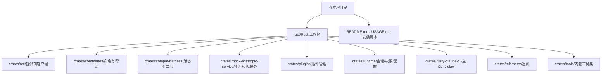
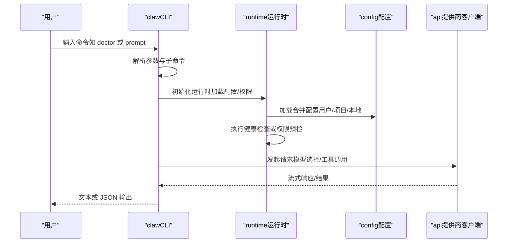
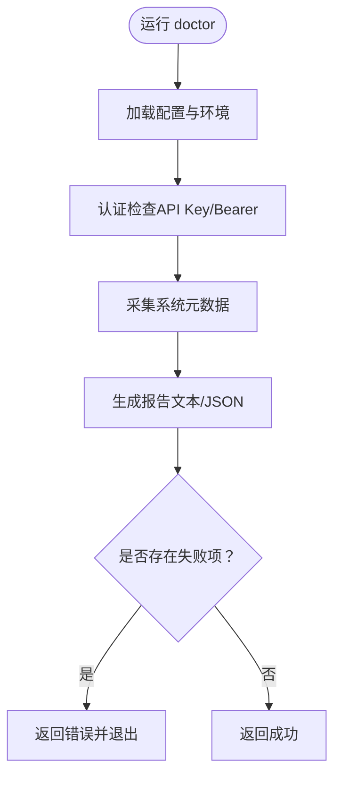
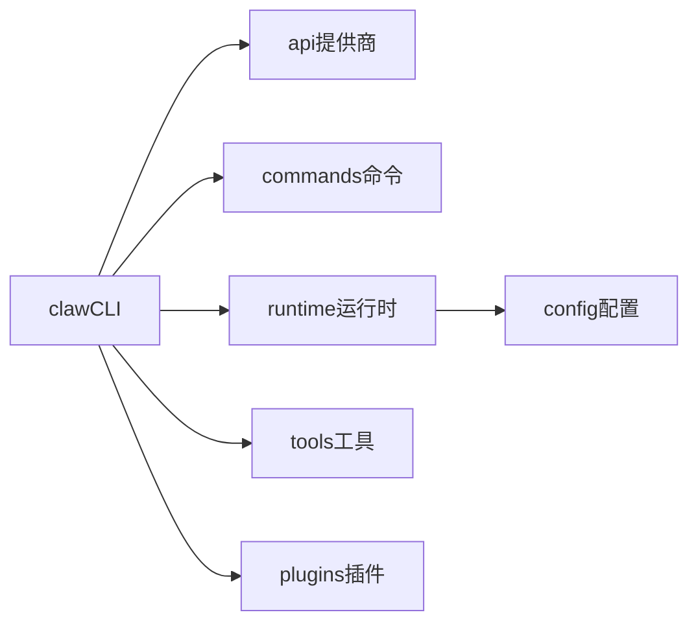

# 快速开始

<cite>
**本文引用的文件**
- [README.md](file://README.md)
- [USAGE.md](file://USAGE.md)
- [rust/README.md](file://rust/README.md)
- [install.sh](file://install.sh)
- [rust/Cargo.toml](file://rust/Cargo.toml)
- [rust/Cargo.lock](file://rust/Cargo.lock)
- [rust/crates/rusty-claude-cli/Cargo.toml](file://rust/crates/rusty-claude-cli/Cargo.toml)
- [rust/crates/rusty-claude-cli/src/main.rs](file://rust/crates/rusty-claude-cli/src/main.rs)
- [rust/crates/rusty-claude-cli/src/init.rs](file://rust/crates/rusty-claude-cli/src/init.rs)
- [rust/crates/runtime/src/config.rs](file://rust/crates/runtime/src/config.rs)
</cite>

## 目录
1. [简介](#简介)
2. [项目结构](#项目结构)
3. [核心组件](#核心组件)
4. [架构总览](#架构总览)
5. [详细组件分析](#详细组件分析)
6. [依赖关系分析](#依赖关系分析)
7. [性能注意事项](#性能注意事项)
8. [故障排除指南](#故障排除指南)
9. [结论](#结论)
10. [附录](#附录)

## 简介
本指南面向首次接触 Claw Code 的用户，目标是在 10 分钟内完成安装、配置与第一次运行。你将学到：
- 在 Windows、Linux、macOS 上安装 Rust 工具链与项目
- 克隆仓库、构建二进制、设置 API 密钥
- 运行第一个 CLI 命令：健康检查与基础提示
- 常见问题排查与环境准备建议

Claw Code 的 Rust 工作区提供了可直接运行的 `claw` 二进制，支持交互式 REPL、一次性提示、JSON 输出等能力，并内置“健康检查”（/doctor）作为首验命令。

章节来源
- [README.md: 31-74:31-74](file://README.md#L31-L74)
- [USAGE.md: 1-18:1-18](file://USAGE.md#L1-L18)

## 项目结构
仓库采用“多 crate 工作区”组织方式，核心在 rust/ 下，包含多个功能子 crate；根目录提供使用说明、安装脚本与文档链接。

图表来源
- [rust/README.md: 175-204:175-204](file://rust/README.md#L175-L204)
- [rust/Cargo.toml: 1-3:1-3](file://rust/Cargo.toml#L1-L3)

章节来源
- [rust/README.md: 175-204:175-204](file://rust/README.md#L175-L204)
- [rust/Cargo.toml: 1-3:1-3](file://rust/Cargo.toml#L1-L3)

## 核心组件
- CLI 二进制：claw（由 rusty-claude-cli crate 构建）
- 提供商适配层：api crate 支持 Anthropic/OpenAI 兼容接口
- 运行时：runtime 负责会话、权限策略、配置加载与 MCP 生命周期
- 工具系统：tools 提供 Bash、文件读写、网络检索等内置工具
- 插件系统：plugins 提供插件注册、启用/禁用与钩子集成
- 命令系统：commands 统一解析与渲染 slash 命令与帮助

章节来源
- [rust/README.md: 195-203:195-203](file://rust/README.md#L195-L203)

## 架构总览
下图展示从用户输入到 API 请求的关键路径，以及健康检查（/doctor）如何串联各子系统进行自检。

图表来源
- [rust/crates/rusty-claude-cli/src/main.rs: 180-277:180-277](file://rust/crates/rusty-claude-cli/src/main.rs#L180-L277)
- [rust/crates/runtime/src/config.rs: 213-326:213-326](file://rust/crates/runtime/src/config.rs#L213-L326)

章节来源
- [rust/crates/rusty-claude-cli/src/main.rs: 180-277:180-277](file://rust/crates/rusty-claude-cli/src/main.rs#L180-L277)
- [rust/crates/runtime/src/config.rs: 213-326:213-326](file://rust/crates/runtime/src/config.rs#L213-L326)

## 详细组件分析

### 安装与环境准备
- Windows
  - 安装 Rust（rustup），重启终端使 PATH 生效
  - 使用 PowerShell/Git Bash/WSL 克隆与构建
  - 设置 API 密钥后运行 `claw.exe`
- Linux/macOS
  - 安装 Rust 后，使用安装脚本一键构建或手动 cargo build
  - 按需安装系统依赖（如 OpenSSL、pkg-config 等）

章节来源
- [README.md: 75-98:75-98](file://README.md#L75-L98)
- [install.sh: 127-172:127-172](file://install.sh#L127-L172)

### 构建与运行
- 构建工作区：进入 rust/ 目录，执行 cargo build --workspace
- 运行二进制：默认输出在 rust/target/debug/claw（Windows 为 claw.exe）
- 首次健康检查：运行 `claw doctor`，或在 REPL 中输入 `/doctor`

章节来源
- [README.md: 56-70:56-70](file://README.md#L56-L70)
- [USAGE.md: 5-18:5-18](file://USAGE.md#L5-L18)

### API 密钥与认证
- 支持两种认证方式：
  - ANTHROPIC_API_KEY（sk-ant-...）
  - ANTHROPIC_AUTH_TOKEN（Bearer token）
- 若使用代理或本地服务，可设置 ANTHROPIC_BASE_URL
- 不同提供商可通过模型前缀路由到对应后端（如 openai/、qwen/ 等）

章节来源
- [USAGE.md: 96-124:96-124](file://USAGE.md#L96-L124)
- [USAGE.md: 125-182:125-182](file://USAGE.md#L125-L182)

### 健康检查（/doctor）
- 作用：对系统、配置、认证等进行本地诊断
- 行为：根据输出格式输出文本或 JSON；若存在失败项，进程以非零退出码结束
- 可通过 --output-format json 获取结构化报告

图表来源
- [rust/crates/rusty-claude-cli/src/main.rs: 1490-1504:1490-1504](file://rust/crates/rusty-claude-cli/src/main.rs#L1490-L1504)
- [rust/crates/rusty-claude-cli/src/main.rs: 1573-1676:1573-1676](file://rust/crates/rusty-claude-cli/src/main.rs#L1573-L1676)

章节来源
- [rust/crates/rusty-claude-cli/src/main.rs: 1490-1504:1490-1504](file://rust/crates/rusty-claude-cli/src/main.rs#L1490-L1504)
- [rust/crates/rusty-claude-cli/src/main.rs: 1573-1676:1573-1676](file://rust/crates/rusty-claude-cli/src/main.rs#L1573-L1676)

### 配置文件层次
- 搜索顺序（后覆盖先）：用户级 settings.json → 用户级 .claw.json → 项目级 .claw.json → 项目级 .claw/settings.json → 项目级 .claw/settings.local.json
- 支持 hooks、plugins、mcp、oauth、model、aliases、permission 等配置段

章节来源
- [USAGE.md: 320-329:320-329](file://USAGE.md#L320-L329)
- [rust/crates/runtime/src/config.rs: 213-326:213-326](file://rust/crates/runtime/src/config.rs#L213-L326)

### 初始化与引导
- 首次运行可触发初始化：创建 .claw/、.claw.json、CLAUDE.md、更新 .gitignore
- 生成内容包含语言/框架识别、验证建议与工作约定

章节来源
- [rust/crates/rusty-claude-cli/src/init.rs: 80-112:80-112](file://rust/crates/rusty-claude-cli/src/init.rs#L80-L112)
- [rust/crates/rusty-claude-cli/src/init.rs: 162-217:162-217](file://rust/crates/rusty-claude-cli/src/init.rs#L162-L217)

## 依赖关系分析
- 工作区定义与解析器版本在工作区根 Cargo.toml 中统一声明
- CLI 二进制依赖 api、commands、runtime、tools、plugins 等 crate
- 运行时依赖配置加载、权限策略、MCP 生命周期与工具执行

图表来源
- [rust/Cargo.toml: 1-3:1-3](file://rust/Cargo.toml#L1-L3)
- [rust/crates/rusty-claude-cli/Cargo.toml: 12-26:12-26](file://rust/crates/rusty-claude-cli/Cargo.toml#L12-L26)

章节来源
- [rust/Cargo.toml: 1-3:1-3](file://rust/Cargo.toml#L1-L3)
- [rust/crates/rusty-claude-cli/Cargo.toml: 12-26:12-26](file://rust/crates/rusty-claude-cli/Cargo.toml#L12-L26)

## 性能注意事项
- Debug 构建更快但体积较大；Release 构建优化更佳但编译时间较长
- 一次性提示（prompt）适合快速验证；交互式 REPL 更适合长会话与调试
- JSON 输出便于自动化流水线，但会增加序列化开销

章节来源
- [install.sh: 92-125:92-125](file://install.sh#L92-L125)
- [USAGE.md: 67-73:67-73](file://USAGE.md#L67-L73)

## 故障排除指南
常见问题与解决思路：
- Rust 工具链缺失或未加入 PATH
  - 解决：安装 rustup 并重新打开终端；确认 cargo --version 成功
- Linux 缺少系统依赖（pkg-config、OpenSSL）
  - 解决：按发行版安装对应包；参考安装脚本中的提示
- macOS 缺少 Xcode 命令行工具
  - 解决：xcode-select --install
- Windows 使用原生命令行而非 WSL
  - 解决：改用 WSL 或在 WSL 内运行安装脚本
- 构建中途失败（ring/openssl）
  - 解决：清理缓存后重试；补齐系统依赖
- 无法找到 claw 二进制
  - 解决：检查构建产物路径；将 rust/target/<profile> 添加到 PATH

章节来源
- [install.sh: 131-172:131-172](file://install.sh#L131-L172)

## 结论
按照本指南，你可以在 10 分钟内完成环境准备、构建与首次运行。建议将 `claw doctor` 作为每次变更后的首验命令，并结合配置文件层次与初始化模板，逐步完善本地开发体验。

## 附录

### 快速清单（10 分钟入门）
- 安装 Rust（rustup），验证 cargo 版本
- 克隆仓库，进入 rust/，构建工作区
- 设置 ANTHROPIC_API_KEY 或 ANTHROPIC_AUTH_TOKEN
- 运行 `claw doctor` 查看健康状态
- 尝试一次性提示：`claw prompt "你好"`
- 如需自动化，使用 `--output-format json`

章节来源
- [README.md: 56-74:56-74](file://README.md#L56-L74)
- [USAGE.md: 5-18:5-18](file://USAGE.md#L5-L18)