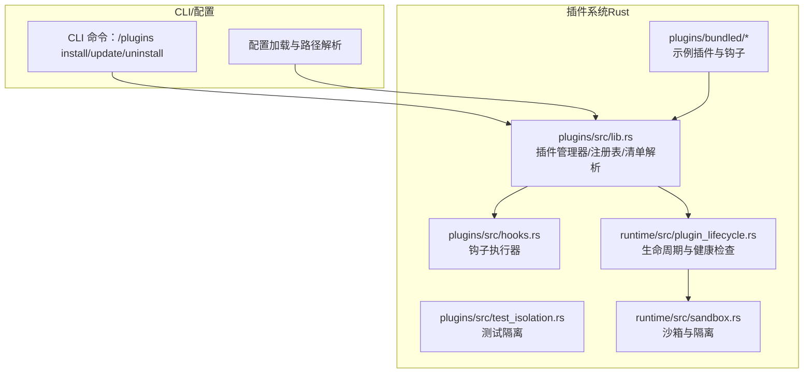
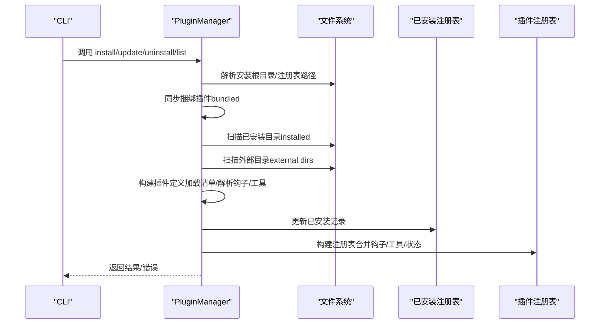
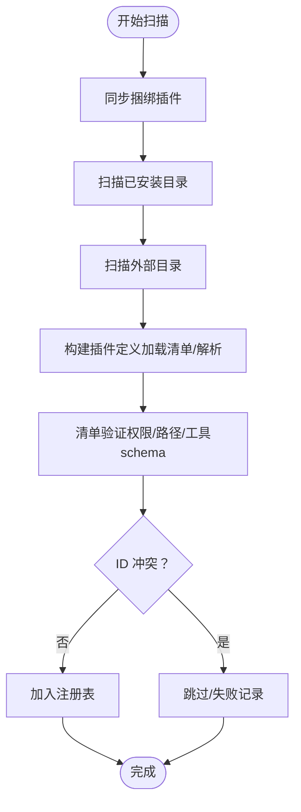
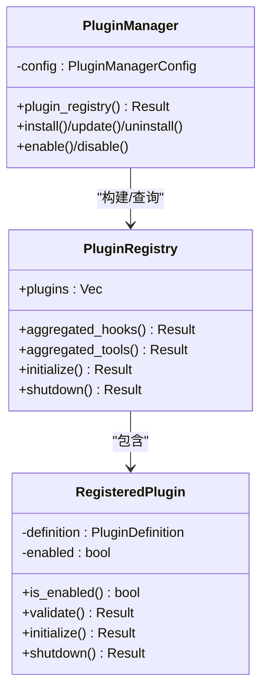
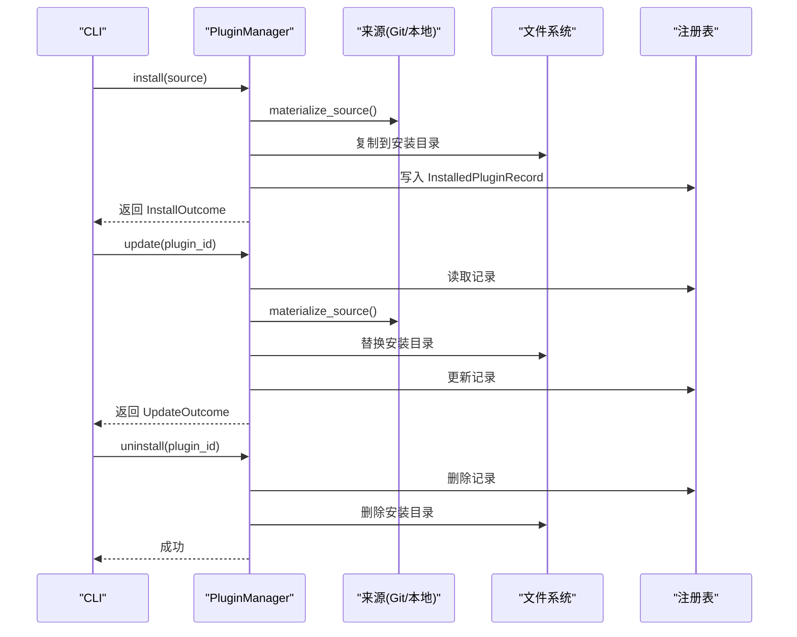
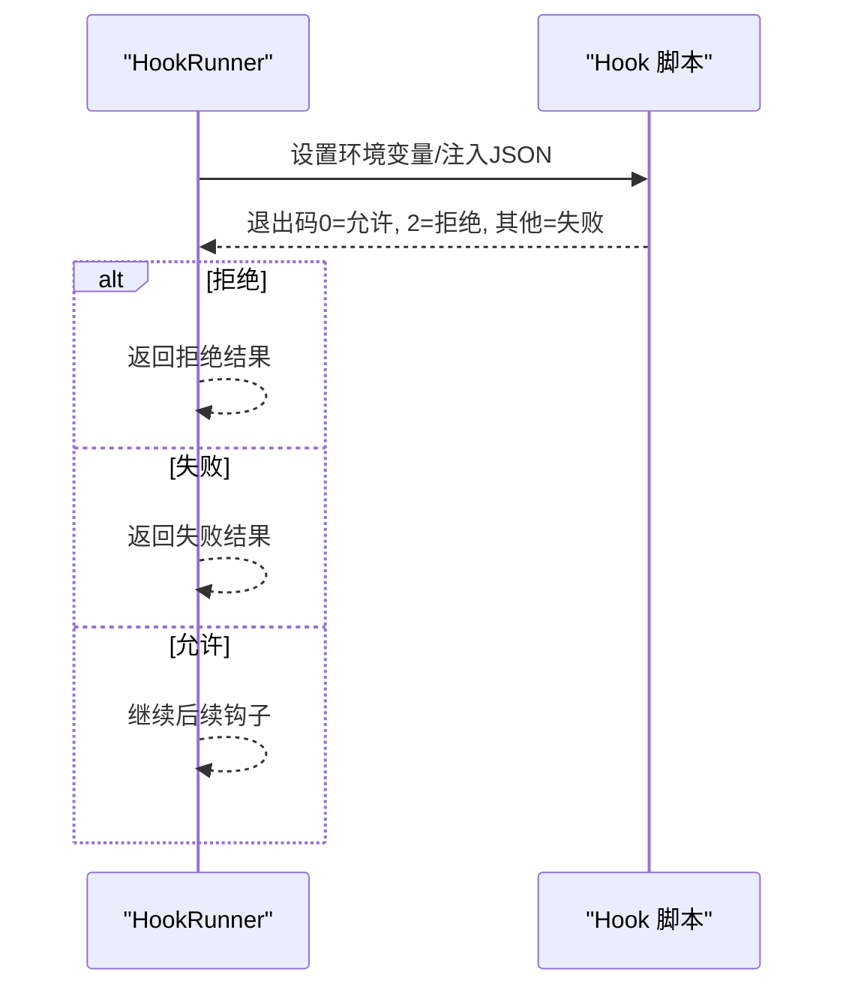
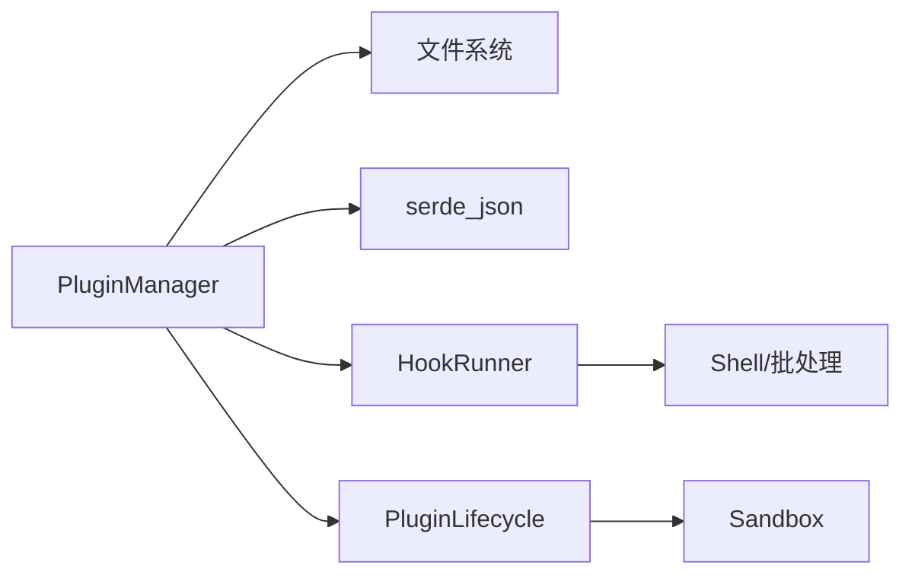

# 插件发现与管理

<cite>
**本文档引用的文件**
- [lib.rs](file://rust/crates/plugins/src/lib.rs)
- [hooks.rs](file://rust/crates/plugins/src/hooks.rs)
- [test_isolation.rs](file://rust/crates/plugins/src/test_isolation.rs)
- [plugin_lifecycle.rs](file://rust/crates/runtime/src/plugin_lifecycle.rs)
- [sandbox.rs](file://rust/crates/runtime/src/sandbox.rs)
- [Cargo.toml](file://rust/crates/plugins/Cargo.toml)
- [plugin.json（示例）](file://rust/crates/plugins/bundled/example-bundled/.claude-plugin/plugin.json)
- [plugin.json（示例钩子）](file://rust/crates/plugins/bundled/sample-hooks/.claude-plugin/plugin.json)
- [plugins.json（参考数据）](file://src/reference_data/subsystems/plugins.json)
</cite>

## 目录
1. [简介](#简介)
2. [项目结构](#项目结构)
3. [核心组件](#核心组件)
4. [架构总览](#架构总览)
5. [详细组件分析](#详细组件分析)
6. [依赖关系分析](#依赖关系分析)
7. [性能考虑](#性能考虑)
8. [故障排除指南](#故障排除指南)
9. [结论](#结论)
10. [附录](#附录)

## 简介
本文件系统性阐述插件发现与管理机制，覆盖内置插件、捆绑插件与外部插件的扫描策略；插件注册表的维护、插件列表管理与状态跟踪；插件安装、更新与卸载流程；冲突检测、依赖解析与版本管理；以及测试隔离、沙箱环境与安全边界。同时提供插件管理命令的使用指南与常见问题排查方法。

## 项目结构
插件系统位于 Rust 子工程中，核心代码集中在 plugins crate，运行时生命周期与沙箱能力由 runtime crate 提供支撑。插件清单与钩子脚本示例位于 bundled 目录下，便于理解插件结构与约定。

**图表来源**
- [lib.rs:1034-1522](file://rust/crates/plugins/src/lib.rs#L1034-L1522)
- [hooks.rs:60-120](file://rust/crates/plugins/src/hooks.rs#L60-L120)
- [plugin_lifecycle.rs:214-219](file://rust/crates/runtime/src/plugin_lifecycle.rs#L214-L219)
- [sandbox.rs:156-208](file://rust/crates/runtime/src/sandbox.rs#L156-L208)

**章节来源**
- [lib.rs:1034-1522](file://rust/crates/plugins/src/lib.rs#L1034-L1522)
- [Cargo.toml:1-14](file://rust/crates/plugins/Cargo.toml#L1-L14)

## 核心组件
- 插件类型与元数据
  - 内置插件（builtin）、捆绑插件（bundled）、外部插件（external）
  - 元数据包含 id、名称、版本、描述、来源、默认启用状态等
- 清单模型
  - 权限、钩子、生命周期、工具、命令等字段
- 注册表与状态
  - 已安装插件记录、启用状态、聚合钩子与工具
- 管理器
  - 安装、启用/禁用、更新、卸载、发现与报告生成

**章节来源**
- [lib.rs:26-167](file://rust/crates/plugins/src/lib.rs#L26-L167)
- [lib.rs:362-408](file://rust/crates/plugins/src/lib.rs#L362-L408)
- [lib.rs:762-844](file://rust/crates/plugins/src/lib.rs#L762-L844)

## 架构总览
插件发现与管理采用“多源扫描 + 统一注册表”的架构：先同步捆绑插件，再扫描已安装目录与外部目录，最后构建注册表并进行冲突检测与状态跟踪。

**图表来源**
- [lib.rs:1068-1086](file://rust/crates/plugins/src/lib.rs#L1068-L1086)
- [lib.rs:1354-1357](file://rust/crates/plugins/src/lib.rs#L1354-L1357)
- [lib.rs:1507-1521](file://rust/crates/plugins/src/lib.rs#L1507-L1521)

## 详细组件分析

### 插件发现机制
- 捆绑插件同步
  - 从 bundled 根目录扫描插件目录，校验清单版本/名称/描述/安装路径一致性，必要时复制到安装根目录，并更新注册表
- 已安装插件扫描
  - 遍历安装根目录下的每个插件目录，尝试加载清单并构造插件定义；同时清理过期注册项
- 外部目录扫描
  - 遍历配置中的外部目录，仅在 ID 未冲突的前提下加入发现集合
- 清单加载与验证
  - 支持直接路径与打包路径两种清单位置；检测不兼容字段并进行严格校验（权限、重复项、命令路径有效性等）

**图表来源**
- [lib.rs:1359-1441](file://rust/crates/plugins/src/lib.rs#L1359-L1441)
- [lib.rs:1237-1313](file://rust/crates/plugins/src/lib.rs#L1237-L1313)
- [lib.rs:1315-1352](file://rust/crates/plugins/src/lib.rs#L1315-L1352)
- [lib.rs:1589-1611](file://rust/crates/plugins/src/lib.rs#L1589-L1611)

**章节来源**
- [lib.rs:1359-1441](file://rust/crates/plugins/src/lib.rs#L1359-L1441)
- [lib.rs:1237-1313](file://rust/crates/plugins/src/lib.rs#L1237-L1313)
- [lib.rs:1315-1352](file://rust/crates/plugins/src/lib.rs#L1315-L1352)
- [lib.rs:1589-1611](file://rust/crates/plugins/src/lib.rs#L1589-L1611)

### 插件注册表与状态跟踪
- 注册表结构
  - 维护插件列表与启用状态；提供聚合钩子、聚合工具、初始化/关闭等操作
- 状态跟踪
  - 通过 enabled_plugins 映射与 settings.json 的 enabledPlugins 字段持久化启用状态
  - 插件 ID 由“名称@市场”构成，ID 冲突在聚合工具时触发错误

**图表来源**
- [lib.rs:762-844](file://rust/crates/plugins/src/lib.rs#L762-L844)
- [lib.rs:600-653](file://rust/crates/plugins/src/lib.rs#L600-L653)
- [lib.rs:872-874](file://rust/crates/plugins/src/lib.rs#L872-L874)

**章节来源**
- [lib.rs:762-844](file://rust/crates/plugins/src/lib.rs#L762-L844)
- [lib.rs:600-653](file://rust/crates/plugins/src/lib.rs#L600-L653)
- [lib.rs:1443-1462](file://rust/crates/plugins/src/lib.rs#L1443-L1462)

### 插件安装、更新与卸载
- 安装
  - 解析来源（本地路径或 Git URL），克隆/复制到临时目录，加载清单，写入安装目录与注册表，设置默认启用状态
- 更新
  - 基于现有记录重新拉取来源，替换安装目录内容，更新版本/时间戳并回写注册表
- 卸载
  - 移除注册表条目与安装目录；禁止卸载捆绑插件（仅可禁用）

**图表来源**
- [lib.rs:1118-1159](file://rust/crates/plugins/src/lib.rs#L1118-L1159)
- [lib.rs:1199-1235](file://rust/crates/plugins/src/lib.rs#L1199-L1235)
- [lib.rs:1179-1197](file://rust/crates/plugins/src/lib.rs#L1179-L1197)
- [lib.rs:2158-2189](file://rust/crates/plugins/src/lib.rs#L2158-L2189)

**章节来源**
- [lib.rs:1118-1159](file://rust/crates/plugins/src/lib.rs#L1118-L1159)
- [lib.rs:1199-1235](file://rust/crates/plugins/src/lib.rs#L1199-L1235)
- [lib.rs:1179-1197](file://rust/crates/plugins/src/lib.rs#L1179-L1197)
- [lib.rs:2158-2189](file://rust/crates/plugins/src/lib.rs#L2158-L2189)

### 冲突检测、依赖解析与版本管理
- 冲突检测
  - 工具名冲突：聚合工具时若同名来自不同插件则报错
  - ID 冲突：外部目录扫描时若与已存在插件 ID 冲突则跳过
- 依赖解析
  - 基于清单字段进行路径与命令合法性校验；不支持某些 Claude Code 特有字段
- 版本管理
  - 以清单 version 字段为准；更新时比较版本并记录时间戳

**章节来源**
- [lib.rs:807-824](file://rust/crates/plugins/src/lib.rs#L807-L824)
- [lib.rs:1330-1337](file://rust/crates/plugins/src/lib.rs#L1330-L1337)
- [lib.rs:1613-1669](file://rust/crates/plugins/src/lib.rs#L1613-L1669)
- [lib.rs:1727-1737](file://rust/crates/plugins/src/lib.rs#L1727-L1737)

### 钩子与生命周期
- 钩子执行
  - 在工具调用前/后及失败时按顺序执行脚本，支持 Deny/Allow/Failed 三种结果
  - 通过环境变量传递事件上下文，stdin 注入 JSON 负载
- 生命周期
  - Init/Shutdown 阶段按清单配置执行命令，失败即终止

**图表来源**
- [hooks.rs:121-174](file://rust/crates/plugins/src/hooks.rs#L121-L174)
- [hooks.rs:177-230](file://rust/crates/plugins/src/hooks.rs#L177-L230)

**章节来源**
- [hooks.rs:60-120](file://rust/crates/plugins/src/hooks.rs#L60-L120)
- [hooks.rs:121-174](file://rust/crates/plugins/src/hooks.rs#L121-L174)
- [hooks.rs:177-230](file://rust/crates/plugins/src/hooks.rs#L177-L230)
- [lib.rs:2075-2127](file://rust/crates/plugins/src/lib.rs#L2075-L2127)

### 运行时生命周期与健康检查
- 生命周期事件
  - ConfigValidated、StartupHealthy、StartupDegraded、StartupFailed、Shutdown
- 健康检查
  - 基于服务器状态（Healthy/Degraded/Failed）与可用工具集合，支持降级模式提示

**章节来源**
- [plugin_lifecycle.rs:194-212](file://rust/crates/runtime/src/plugin_lifecycle.rs#L194-L212)
- [plugin_lifecycle.rs:37-99](file://rust/crates/runtime/src/plugin_lifecycle.rs#L37-L99)
- [plugin_lifecycle.rs:136-161](file://rust/crates/runtime/src/plugin_lifecycle.rs#L136-L161)

### 测试隔离与沙箱
- 测试隔离
  - 通过 EnvLock 将 HOME/XDG_CONFIG_HOME 等环境变量重定向至临时目录，避免并发测试污染
- 沙箱
  - Linux 下可通过 unshare 创建用户命名空间与网络/文件系统隔离；支持请求式启用与回退原因说明

**章节来源**
- [test_isolation.rs:12-53](file://rust/crates/plugins/src/test_isolation.rs#L12-L53)
- [sandbox.rs:156-208](file://rust/crates/runtime/src/sandbox.rs#L156-L208)
- [sandbox.rs:211-262](file://rust/crates/runtime/src/sandbox.rs#L211-L262)

## 依赖关系分析
- 组件耦合
  - PluginManager 依赖文件系统与 JSON 序列化；与钩子执行器、生命周期模块松耦合
- 外部依赖
  - Git 命令用于远程源拉取；Shell/批处理用于钩子与生命周期命令执行
- 可能的循环依赖
  - 当前模块间为单向依赖，无明显循环

**图表来源**
- [Cargo.toml:8-10](file://rust/crates/plugins/Cargo.toml#L8-L10)
- [lib.rs:1034-1522](file://rust/crates/plugins/src/lib.rs#L1034-L1522)
- [hooks.rs:60-120](file://rust/crates/plugins/src/hooks.rs#L60-L120)
- [plugin_lifecycle.rs:214-219](file://rust/crates/runtime/src/plugin_lifecycle.rs#L214-L219)

**章节来源**
- [Cargo.toml:8-10](file://rust/crates/plugins/Cargo.toml#L8-L10)
- [lib.rs:1034-1522](file://rust/crates/plugins/src/lib.rs#L1034-L1522)

## 性能考虑
- 并发与资源
  - 安装/更新流程使用临时目录与原子写入，减少锁竞争
- I/O 优化
  - 使用批量复制与增量同步（仅在清单/版本变化时复制）
- 健康检查
  - 基于服务器状态快速判定健康/降级/失败，避免无效重试

[本节为通用指导，无需特定文件来源]

## 故障排除指南
- 常见错误类型
  - 清单验证失败（空字段、重复项、非法权限、路径不存在/非文件）
  - 加载失败（找不到清单、钩子/生命周期/工具命令路径非法）
  - 命令执行失败（钩子/生命周期返回非零退出码）
- 排查步骤
  - 检查插件清单字段与路径；确认钩子脚本可执行；查看失败记录详情
  - 对于捆绑插件，使用禁用而非卸载
  - 查看注册表与 settings 文件是否一致

**章节来源**
- [lib.rs:980-1032](file://rust/crates/plugins/src/lib.rs#L980-L1032)
- [lib.rs:1179-1197](file://rust/crates/plugins/src/lib.rs#L1179-L1197)
- [lib.rs:2075-2127](file://rust/crates/plugins/src/lib.rs#L2075-L2127)

## 结论
该插件系统通过清晰的发现策略、严格的清单验证与统一的注册表管理，实现了对内置、捆绑与外部插件的一致化治理。配合钩子执行、生命周期管理与沙箱隔离，既保证了灵活性，也强化了安全性与可观测性。建议在生产环境中结合健康检查与降级模式，确保系统稳定性。

[本节为总结，无需特定文件来源]

## 附录

### 插件清单与示例
- 清单字段要点
  - name/version/description/permissions/defaultEnabled/hooks/lifecycle/tools/commands
- 示例清单
  - [example-bundled/plugin.json:1-11](file://rust/crates/plugins/bundled/example-bundled/.claude-plugin/plugin.json#L1-L11)
  - [sample-hooks/plugin.json:1-11](file://rust/crates/plugins/bundled/sample-hooks/.claude-plugin/plugin.json#L1-L11)

**章节来源**
- [plugin.json（示例）:1-11](file://rust/crates/plugins/bundled/example-bundled/.claude-plugin/plugin.json#L1-L11)
- [plugin.json（示例钩子）:1-11](file://rust/crates/plugins/bundled/sample-hooks/.claude-plugin/plugin.json#L1-L11)

### 插件管理命令使用指南
- 安装
  - /plugins install <本地路径或Git URL>
- 更新
  - /plugins update <插件ID>
- 卸载
  - /plugins uninstall <插件ID>（捆绑插件仅可禁用）
- 列表
  - /plugins list（显示已安装与启用状态）

**章节来源**
- [lib.rs:1118-1159](file://rust/crates/plugins/src/lib.rs#L1118-L1159)
- [lib.rs:1199-1235](file://rust/crates/plugins/src/lib.rs#L1199-L1235)
- [lib.rs:1179-1197](file://rust/crates/plugins/src/lib.rs#L1179-L1197)
- [commands\lib.rs:2245-2278](file://rust/crates/commands/src/lib.rs#L2245-L2278)

### 参考数据
- 插件子系统参考信息
  - [plugins.json:1-9](file://src/reference_data/subsystems/plugins.json#L1-L9)

**章节来源**
- [plugins.json:1-9](file://src/reference_data/subsystems/plugins.json#L1-L9)