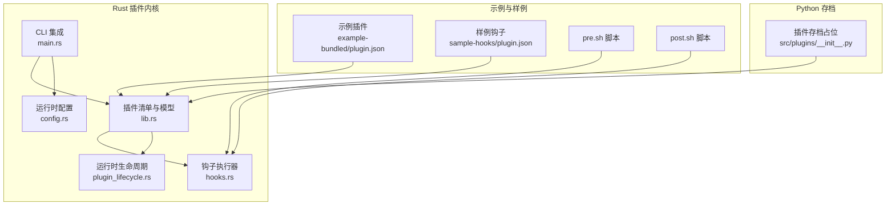
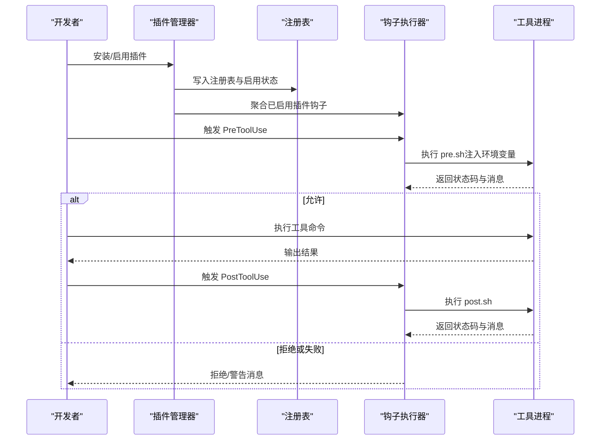
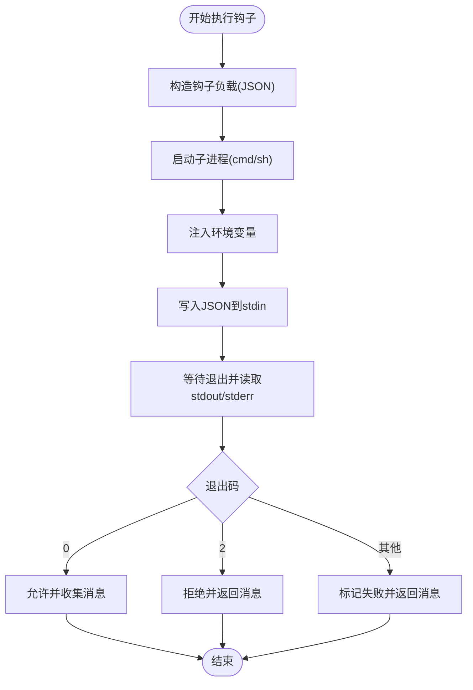
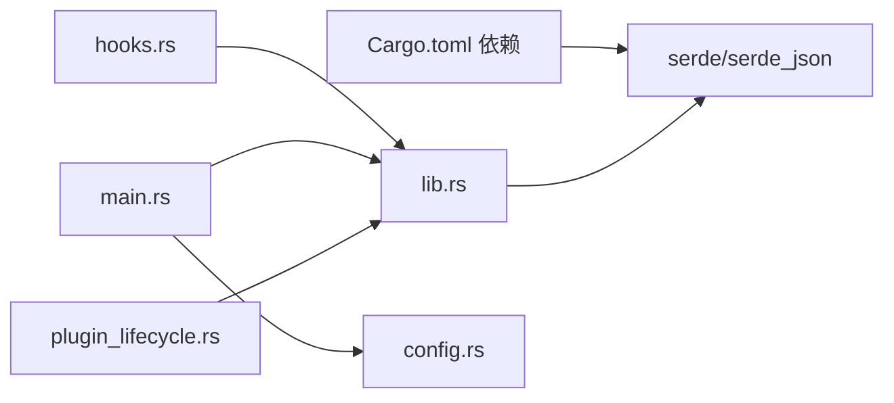

# 插件开发指南

<cite>
**本文档引用的文件**
- [rust\crates\plugins\src\lib.rs](file://rust\crates\plugins\src\lib.rs)
- [rust\crates\plugins\src\hooks.rs](file://rust\crates\plugins\src\hooks.rs)
- [rust\crates\plugins\src\test_isolation.rs](file://rust\crates\plugins\src\test_isolation.rs)
- [rust\crates\plugins\Cargo.toml](file://rust\crates\plugins\Cargo.toml)
- [rust\crates\plugins\bundled\example-bundled\.claude-plugin\plugin.json](file://rust\crates\plugins\bundled\example-bundled\.claude-plugin\plugin.json)
- [rust\crates\plugins\bundled\sample-hooks\.claude-plugin\plugin.json](file://rust\crates\plugins\bundled\sample-hooks\.claude-plugin\plugin.json)
- [rust\crates\plugins\bundled\example-bundled\hooks\pre.sh](file://rust\crates\plugins\bundled\example-bundled\hooks\pre.sh)
- [rust\crates\plugins\bundled\example-bundled\hooks\post.sh](file://rust\crates\plugins\bundled\example-bundled\hooks\post.sh)
- [rust\crates\plugins\bundled\sample-hooks\hooks\pre.sh](file://rust\crates\plugins\bundled\sample-hooks\hooks\pre.sh)
- [rust\crates\plugins\bundled\sample-hooks\hooks\post.sh](file://rust\crates\plugins\bundled\sample-hooks\hooks\post.sh)
- [rust\crates\runtime\src\plugin_lifecycle.rs](file://rust\crates\runtime\src\plugin_lifecycle.rs)
- [rust\crates\runtime\src\config.rs](file://rust\crates\runtime\src\config.rs)
- [rust\crates\rusty-claude-cli\src\main.rs](file://rust\crates\rusty-claude-cli\src\main.rs)
- [src\plugins\__init__.py](file://src\plugins\__init__.py)
</cite>

## 更新摘要
**所做更改**
- 新增基于Rust插件系统基础设施的完整开发指南
- 添加插件清单规范、权限声明和工具定义的详细说明
- 补充插件项目目录结构、配置文件和资源组织规范
- 提供插件开发最佳实践、代码规范和测试策略
- 增加插件调试技巧、日志记录和性能监控方法
- 包含完整的示例插件项目和常见问题解决方案

## 目录
1. [简介](#简介)
2. [项目结构](#项目结构)
3. [核心组件](#核心组件)
4. [架构总览](#架构总览)
5. [详细组件分析](#详细组件分析)
6. [依赖关系分析](#依赖关系分析)
7. [性能考虑](#性能考虑)
8. [故障排查指南](#故障排查指南)
9. [结论](#结论)
10. [附录](#附录)

## 简介
本指南面向希望基于Rust插件系统基础设施开发插件的开发者，覆盖从项目初始化、清单文件编写、权限与工具定义、目录结构与资源配置，到安装、调试、日志与性能监控、最佳实践与测试策略的完整流程。插件系统支持内置、打包与外部三类插件，通过清单文件（plugin.json）声明元数据、权限、生命周期命令、钩子脚本与工具定义，并以独立进程方式执行钩子与工具命令。

## 项目结构
插件系统主要由以下部分组成：
- Rust 插件内核：负责插件发现、加载、验证、注册表管理、生命周期与钩子执行、工具调用桥接等
- 示例与样例：提供可直接参考的插件骨架与钩子脚本
- 运行时与CLI集成：在运行时读取配置、构建插件管理器、暴露健康检查与降级模式
- Python 存档占位：历史模块的归档入口

**图表来源**
- [rust\crates\plugins\src\lib.rs](file://rust\crates\plugins\src\lib.rs)
- [rust\crates\plugins\src\hooks.rs](file://rust\crates\plugins\src\hooks.rs)
- [rust\crates\runtime\src\plugin_lifecycle.rs](file://rust\crates\runtime\src\plugin_lifecycle.rs)
- [rust\crates\runtime\src\config.rs](file://rust\crates\runtime\src\config.rs)
- [rust\crates\rusty-claude-cli\src\main.rs](file://rust\crates\rusty-claude-cli\src\main.rs)
- [rust\crates\plugins\bundled\example-bundled\.claude-plugin\plugin.json](file://rust\crates\plugins\bundled\example-bundled\.claude-plugin\plugin.json)
- [rust\crates\plugins\bundled\sample-hooks\.claude-plugin\plugin.json](file://rust\crates\plugins\bundled\sample-hooks\.claude-plugin\plugin.json)
- [src\plugins\__init__.py](file://src\plugins\__init__.py)

**章节来源**
- [rust\crates\plugins\src\lib.rs](file://rust\crates\plugins\src\lib.rs)
- [rust\crates\plugins\src\hooks.rs](file://rust\crates\plugins\src\hooks.rs)
- [rust\crates\plugins\bundled\example-bundled\.claude-plugin\plugin.json](file://rust\crates\plugins\bundled\example-bundled\.claude-plugin\plugin.json)
- [rust\crates\plugins\bundled\sample-hooks\.claude-plugin\plugin.json](file://rust\crates\plugins\bundled\sample-hooks\.claude-plugin\plugin.json)
- [src\plugins\__init__.py](file://src\plugins\__init__.py)

## 核心组件
- 插件清单与模型：定义插件元信息、权限、默认启用状态、钩子、生命周期命令、工具与命令等
- 钩子执行器：按事件类型收集并顺序执行钩子脚本，支持允许、拒绝与失败三种结果
- 工具执行器：通过外部命令执行工具，注入环境变量与标准输入，解析输出
- 注册表与插件管理：扫描、安装、启用/禁用、加载与汇总插件信息
- 生命周期与健康检查：提供启动健康、降级与失败状态，以及工具发现能力
- CLI 集成：根据运行时配置构建插件管理器，解析路径与设置

**章节来源**
- [rust\crates\plugins\src\lib.rs](file://rust\crates\plugins\src\lib.rs)
- [rust\crates\plugins\src\hooks.rs](file://rust\crates\plugins\src\hooks.rs)
- [rust\crates\runtime\src\plugin_lifecycle.rs](file://rust\crates\runtime\src\plugin_lifecycle.rs)
- [rust\crates\rusty-claude-cli\src\main.rs](file://rust\crates\rusty-claude-cli\src\main.rs)

## 架构总览
下图展示了插件从清单解析、钩子执行到工具调用的整体流程：

**图表来源**
- [rust\crates\plugins\src\hooks.rs](file://rust\crates\plugins\src\hooks.rs)
- [rust\crates\plugins\src\lib.rs](file://rust\crates\plugins\src\lib.rs)
- [rust\crates\plugins\bundled\example-bundled\hooks\pre.sh](file://rust\crates\plugins\bundled\example-bundled\hooks\pre.sh)
- [rust\crates\plugins\bundled\example-bundled\hooks\post.sh](file://rust\crates\plugins\bundled\example-bundled\hooks\post.sh)

## 详细组件分析

### 插件清单与模型（plugin.json）
- 必填字段：name、version、description
- 可选字段：defaultEnabled、permissions、hooks、lifecycle、tools、commands
- 权限枚举：read、write、execute
- 工具权限：read-only、workspace-write、danger-full-access
- 生命周期：Init、Shutdown
- 钩子事件：PreToolUse、PostToolUse、PostToolUseFailure

清单示例参考：
- [示例清单](file://rust\crates\plugins\bundled\example-bundled\.claude-plugin\plugin.json)
- [样例清单](file://rust\crates\plugins\bundled\sample-hooks\.claude-plugin\plugin.json)

清单字段与校验逻辑：
- 清单结构体与序列化：参见 [插件清单定义](file://rust\crates\plugins\src\lib.rs)
- 权限与工具权限枚举：参见 [权限与工具权限](file://rust\crates\plugins\src\lib.rs)
- 生命周期与钩子结构：参见 [生命周期与钩子](file://rust\crates\plugins\src\lib.rs)

**章节来源**
- [rust\crates\plugins\src\lib.rs](file://rust\crates\plugins\src\lib.rs)
- [rust\crates\plugins\bundled\example-bundled\.claude-plugin\plugin.json](file://rust\crates\plugins\bundled\example-bundled\.claude-plugin\plugin.json)
- [rust\crates\plugins\bundled\sample-hooks\.claude-plugin\plugin.json](file://rust\crates\plugins\bundled\sample-hooks\.claude-plugin\plugin.json)

### 钩子执行器（HookRunner）
- 事件类型：PreToolUse、PostToolUse、PostToolUseFailure
- 命令执行：跨平台兼容（Windows 使用 cmd /C；非 Windows 使用 sh 或 sh -lc）
- 输入输出：通过 stdin 传递 JSON 负载，stdout/stderr 作为消息来源
- 结果语义：0=允许、2=拒绝、其他=失败
- 环境变量：注入事件名、工具名、输入、输出、错误标志等

钩子脚本示例：
- [pre.sh](file://rust\crates\plugins\bundled\example-bundled\hooks\pre.sh)
- [post.sh](file://rust\crates\plugins\bundled\example-bundled\hooks\post.sh)
- [样例 pre.sh](file://rust\crates\plugins\bundled\sample-hooks\hooks\pre.sh)
- [样例 post.sh](file://rust\crates\plugins\bundled\sample-hooks\hooks\post.sh)

**图表来源**
- [rust\crates\plugins\src\hooks.rs](file://rust\crates\plugins\src\hooks.rs)

**章节来源**
- [rust\crates\plugins\src\hooks.rs](file://rust\crates\plugins\src\hooks.rs)
- [rust\crates\plugins\bundled\example-bundled\hooks\pre.sh](file://rust\crates\plugins\bundled\example-bundled\hooks\pre.sh)
- [rust\crates\plugins\bundled\example-bundled\hooks\post.sh](file://rust\crates\plugins\bundled\example-bundled\hooks\post.sh)
- [rust\crates\plugins\bundled\sample-hooks\hooks\pre.sh](file://rust\crates\plugins\bundled\sample-hooks\hooks\pre.sh)
- [rust\crates\plugins\bundled\sample-hooks\hooks\post.sh](file://rust\crates\plugins\bundled\sample-hooks\hooks\post.sh)

### 工具执行器（PluginTool.execute）
- 通过外部命令执行工具，支持 args 参数列表
- 注入环境变量：插件ID/名称、工具名、工具输入、根目录等
- 标准输入：将工具输入 JSON 写入子进程 stdin
- 标准输出：UTF-8 解码后去除尾随空白作为结果
- 错误处理：非零退出码或 stderr 内容作为错误信息

**章节来源**
- [rust\crates\plugins\src\lib.rs](file://rust\crates\plugins\src\lib.rs)

### 注册表与插件管理
- 插件种类：Builtin、Bundled、External
- 安装流程：写入注册表、更新启用状态、持久化配置
- 启用/禁用：维护 enabledPlugins 映射
- 加载与汇总：按 ID 排序，提供摘要信息

**章节来源**
- [rust\crates\plugins\src\lib.rs](file://rust\crates\plugins\src\lib.rs)

### 生命周期与健康检查
- 状态机：未配置、已验证、启动中、健康、降级、失败、关闭中、已停止
- 健康检查：根据服务器状态聚合为健康/降级/失败
- 降级模式：暴露可用/不可用工具集合与原因
- 事件：配置验证、启动健康/降级/失败、关闭

**章节来源**
- [rust\crates\runtime\src\plugin_lifecycle.rs](file://rust\crates\runtime\src\plugin_lifecycle.rs)

### CLI 集成与配置
- CLI 构建插件管理器：读取运行时配置中的插件设置（启用列表、外部目录、安装根、注册表路径、打包根）
- 路径解析：支持绝对路径、相对工作目录与相对配置目录
- 设置文件：settings.json 中包含 enabledPlugins、plugins 外部目录、安装根、注册表路径、打包根等键

**章节来源**
- [rust\crates\rusty-claude-cli\src\main.rs](file://rust\crates\rusty-claude-cli\src\main.rs)
- [rust\crates\runtime\src\config.rs](file://rust\crates\runtime\src\config.rs)

## 依赖关系分析
- 插件内核依赖 serde/serde_json 进行清单与数据序列化
- 钩子执行器依赖标准库进程与跨平台命令构造
- CLI 依赖运行时配置加载与插件管理器
- Python 存档模块仅作为历史占位，不参与当前插件逻辑

**图表来源**
- [rust\crates\plugins\Cargo.toml](file://rust\crates\plugins\Cargo.toml)
- [rust\crates\plugins\src\lib.rs](file://rust\crates\plugins\src\lib.rs)
- [rust\crates\plugins\src\hooks.rs](file://rust\crates\plugins\src\hooks.rs)
- [rust\crates\rusty-claude-cli\src\main.rs](file://rust\crates\rusty-claude-cli\src\main.rs)
- [rust\crates\runtime\src\config.rs](file://rust\crates\runtime\src\config.rs)
- [rust\crates\runtime\src\plugin_lifecycle.rs](file://rust\crates\runtime\src\plugin_lifecycle.rs)

**章节来源**
- [rust\crates\plugins\Cargo.toml](file://rust\crates\plugins\Cargo.toml)
- [rust\crates\plugins\src\lib.rs](file://rust\crates\plugins\src\lib.rs)
- [rust\crates\plugins\src\hooks.rs](file://rust\crates\plugins\src\hooks.rs)
- [rust\crates\rusty-claude-cli\src\main.rs](file://rust\crates\rusty-claude-cli\src\main.rs)
- [rust\crates\runtime\src\config.rs](file://rust\crates\runtime\src\config.rs)
- [rust\crates\runtime\src\plugin_lifecycle.rs](file://rust\crates\runtime\src\plugin_lifecycle.rs)

## 性能考虑
- 钩子与工具均以独立进程执行，避免阻塞主流程，但带来进程开销
- 建议：
  - 将钩子脚本与工具命令尽量轻量化，避免长时间阻塞
  - 在钩子中尽早返回（允许/拒绝），减少后续处理
  - 对工具输入进行必要校验，避免无效调用
  - 利用降级模式识别部分服务不可用场景，避免全盘失败

## 故障排查指南
- 常见错误类型：
  - 清单校验失败：如必填字段为空、权限值非法、工具输入 schema 非对象
  - 命令路径不存在或非文件
  - 工具命令执行失败（非零退出码或 stderr）
  - 钩子脚本异常：进程无法启动、被信号中断、退出码非 0/2
- 定位方法：
  - 查看插件管理器返回的错误详情（包含具体字段与路径）
  - 检查 settings.json 中 enabledPlugins 与 plugins 配置项
  - 在钩子脚本中打印 stdout/stderr，结合环境变量定位输入
  - 使用测试隔离工具创建独立测试环境，避免状态污染

**章节来源**
- [rust\crates\plugins\src\lib.rs](file://rust\crates\plugins\src\lib.rs)
- [rust\crates\plugins\src\test_isolation.rs](file://rust\crates\plugins\src\test_isolation.rs)
- [rust\crates\runtime\src\config.rs](file://rust\crates\runtime\src\config.rs)

## 结论
该插件系统提供了清晰的清单规范、灵活的钩子与工具机制、完善的生命周期与健康检查能力，并通过 CLI 与运行时配置实现可扩展的插件生态。遵循本文档的清单规范、目录结构与最佳实践，可快速构建稳定、可维护的插件。

## 附录

### 插件开发流程（从零到发布）
- 初始化项目
  - 创建 .claude-plugin/plugin.json，填写基础元信息与权限
  - 如需钩子，在 hooks 目录添加 pre.sh/post.sh/failure.sh 并在清单中引用
  - 如需工具，定义 tools 数组并提供可执行命令与参数
- 编写与调试
  - 在本地启用插件，使用钩子脚本输出消息验证输入
  - 使用工具时，确保命令可执行且输入 schema 正确
- 验证与测试
  - 使用测试隔离工具准备独立环境，运行集成测试
  - 检查插件注册表与启用状态是否正确
- 发布与部署
  - 将插件源码放置于外部目录或打包根，供插件管理器扫描
  - 通过 CLI 或配置文件设置安装根与注册表路径
  - 在 settings.json 中维护 enabledPlugins 与 plugins 配置

**章节来源**
- [rust\crates\plugins\bundled\example-bundled\.claude-plugin\plugin.json](file://rust\crates\plugins\bundled\example-bundled\.claude-plugin\plugin.json)
- [rust\crates\plugins\bundled\sample-hooks\.claude-plugin\plugin.json](file://rust\crates\plugins\bundled\sample-hooks\.claude-plugin\plugin.json)
- [rust\crates\plugins\src\test_isolation.rs](file://rust\crates\plugins\src\test_isolation.rs)
- [rust\crates\rusty-claude-cli\src\main.rs](file://rust\crates\rusty-claude-cli\src\main.rs)
- [rust\crates\runtime\src\config.rs](file://rust\crates\runtime\src\config.rs)

### 插件清单字段规范
- 必填：name、version、description
- 可选：defaultEnabled、permissions、hooks、lifecycle、tools、commands
- 权限：read、write、execute
- 工具权限：read-only、workspace-write、danger-full-access
- 生命周期：Init、Shutdown
- 钩子事件：PreToolUse、PostToolUse、PostToolUseFailure

**章节来源**
- [rust\crates\plugins\src\lib.rs](file://rust\crates\plugins\src\lib.rs)

### 目录结构与资源组织
- .claude-plugin/plugin.json：插件清单
- hooks/：钩子脚本（pre.sh/post.sh/failure.sh）
- tools/：工具命令（可选）
- settings.json：启用插件与插件路径配置
- installed.json：已安装插件注册表

**章节来源**
- [rust\crates\plugins\bundled\example-bundled\.claude-plugin\plugin.json](file://rust\crates\plugins\bundled\example-bundled\.claude-plugin\plugin.json)
- [rust\crates\plugins\bundled\sample-hooks\.claude-plugin\plugin.json](file://rust\crates\plugins\bundled\sample-hooks\.claude-plugin\plugin.json)
- [rust\crates\runtime\src\config.rs](file://rust\crates\runtime\src\config.rs)

### 最佳实践与代码规范
- 清单最小化：仅声明必要权限与工具
- 钩子幂等：重复执行不应产生副作用
- 工具健壮：对输入进行严格校验，输出结构化 JSON
- 日志与诊断：钩子与工具输出 stdout/stderr 用于排错
- 测试隔离：使用测试隔离工具避免环境干扰

**章节来源**
- [rust\crates\plugins\src\test_isolation.rs](file://rust\crates\plugins\src\test_isolation.rs)
- [rust\crates\plugins\src\hooks.rs](file://rust\crates\plugins\src\hooks.rs)
- [rust\crates\plugins\src\lib.rs](file://rust\crates\plugins\src\lib.rs)

### 调试技巧、日志记录与性能监控
- 调试技巧：
  - 在钩子脚本中打印环境变量与输入 JSON，确认传参正确
  - 使用小步验证：先验证 PreToolUse，再验证 PostToolUse
- 日志记录：
  - 钩子脚本 stdout/stderr 作为日志来源
  - 工具命令输出 UTF-8 文本作为结果
- 性能监控：
  - 利用生命周期健康检查与降级模式观察服务可用性
  - 通过工具调用耗时与钩子执行时间评估瓶颈

**章节来源**
- [rust\crates\plugins\src\hooks.rs](file://rust\crates\plugins\src\hooks.rs)
- [rust\crates\plugins\src\lib.rs](file://rust\crates\plugins\src\lib.rs)
- [rust\crates\runtime\src\plugin_lifecycle.rs](file://rust\crates\runtime\src\plugin_lifecycle.rs)

### 常见问题与解决方案
- 钩子脚本无执行权限：在测试或示例中确保脚本具有可执行位
- 命令路径不存在或非文件：检查清单中的 hooks/lifecycle/tools 路径
- 工具输入 schema 非对象：确保 tools[].inputSchema 为 JSON 对象
- 插件未生效：检查 settings.json 的 enabledPlugins 与 plugins 配置

**章节来源**
- [rust\crates\plugins\src\hooks.rs](file://rust\crates\plugins\src\hooks.rs)
- [rust\crates\plugins\src\lib.rs](file://rust\crates\plugins\src\lib.rs)
- [rust\crates\runtime\src\config.rs](file://rust\crates\runtime\src\config.rs)