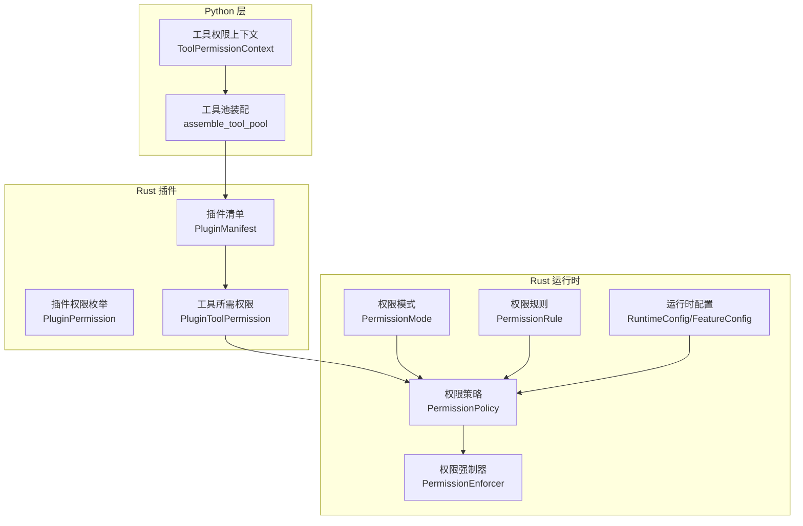
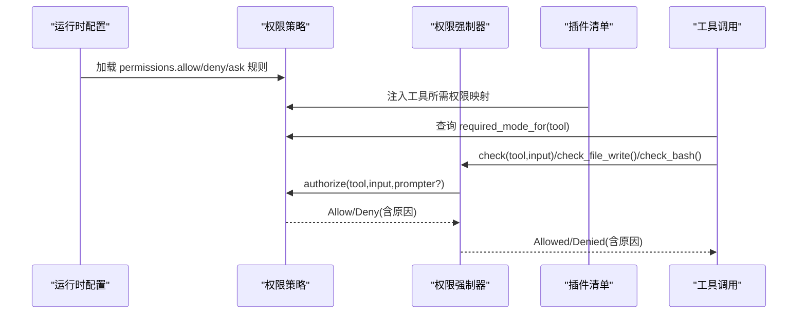
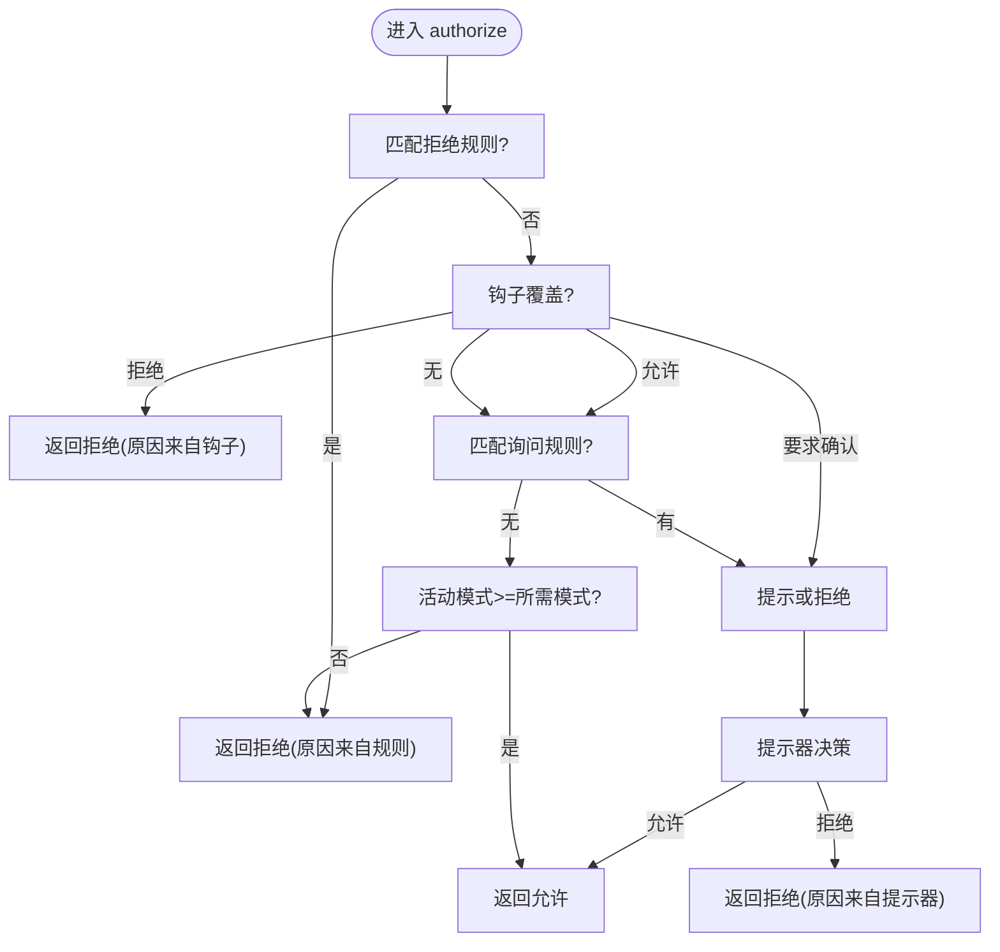
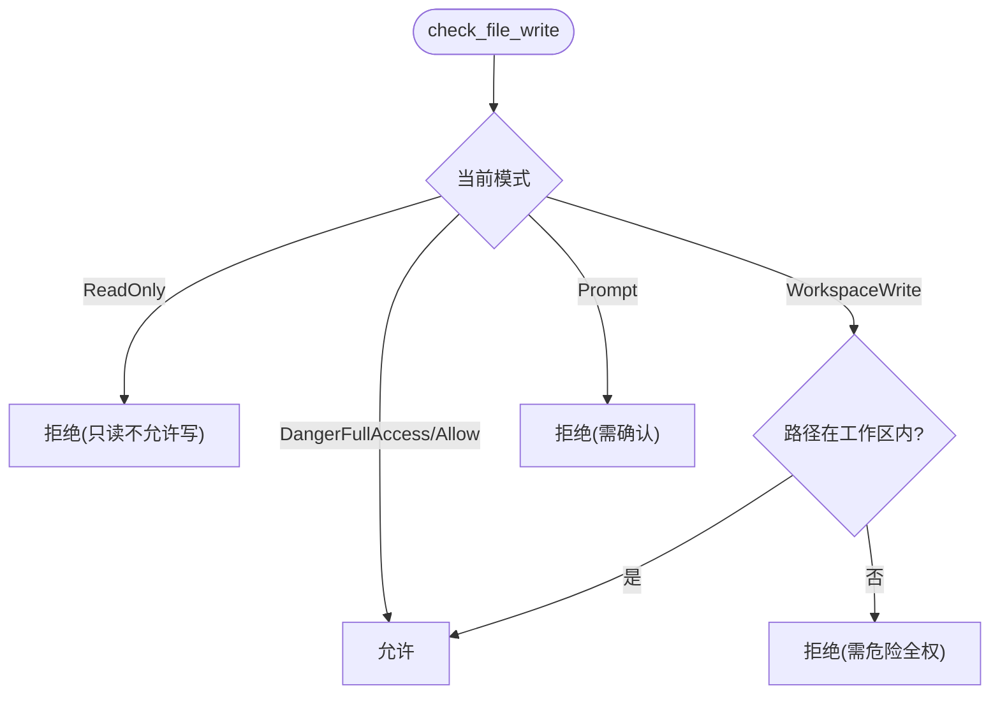
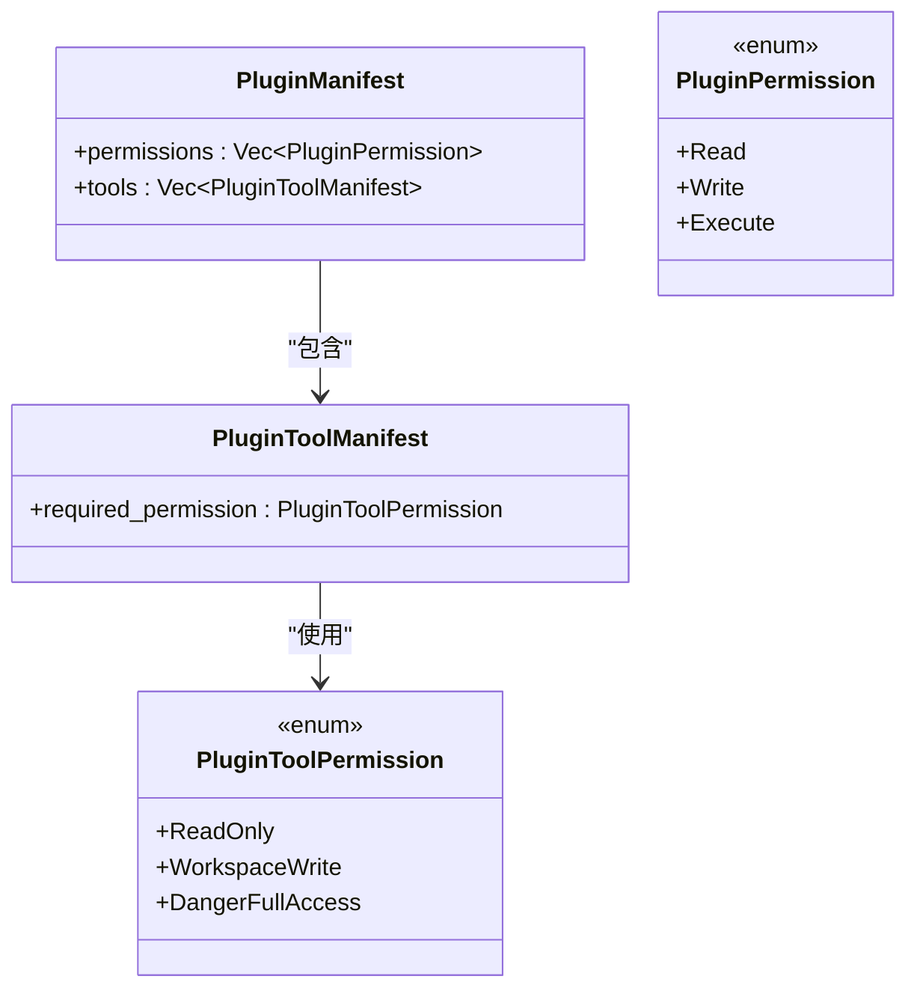
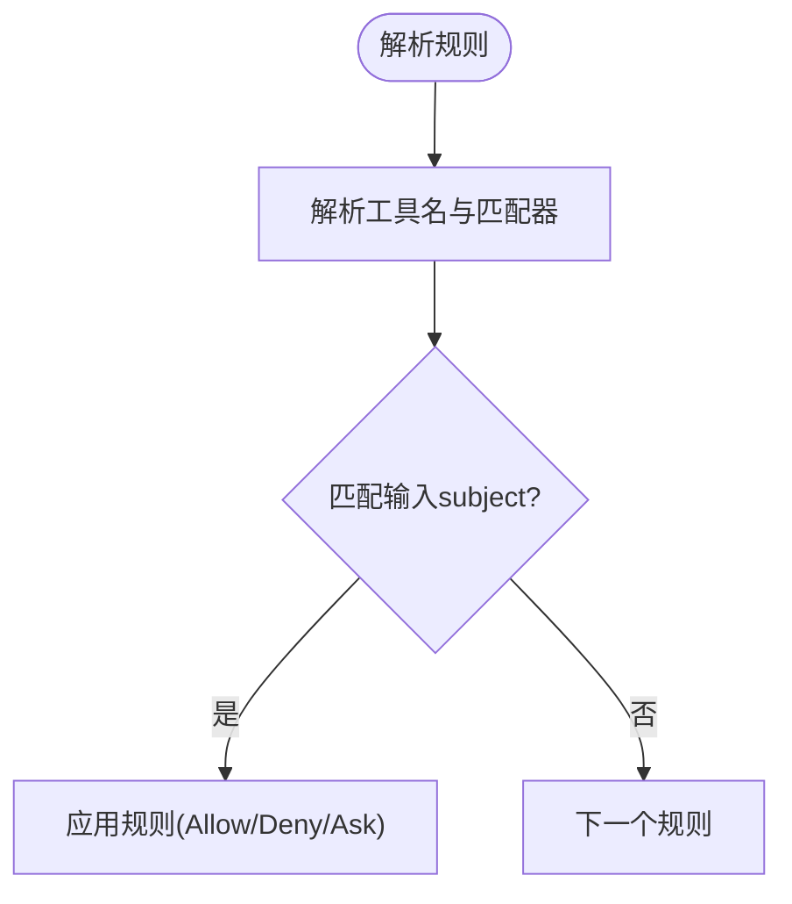
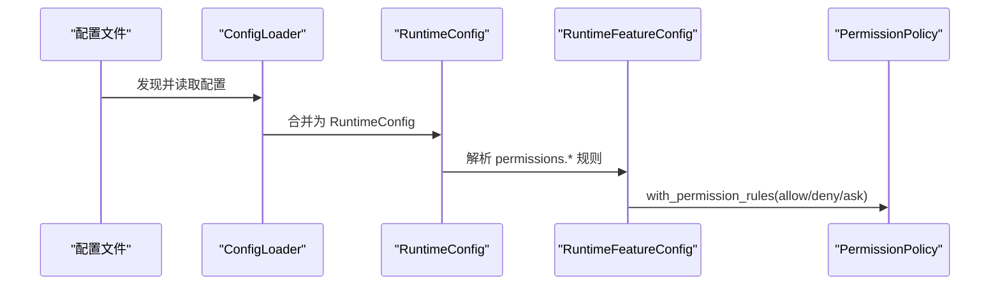
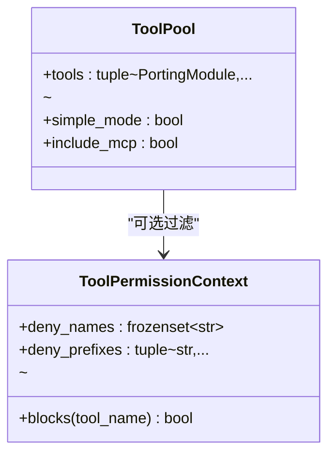
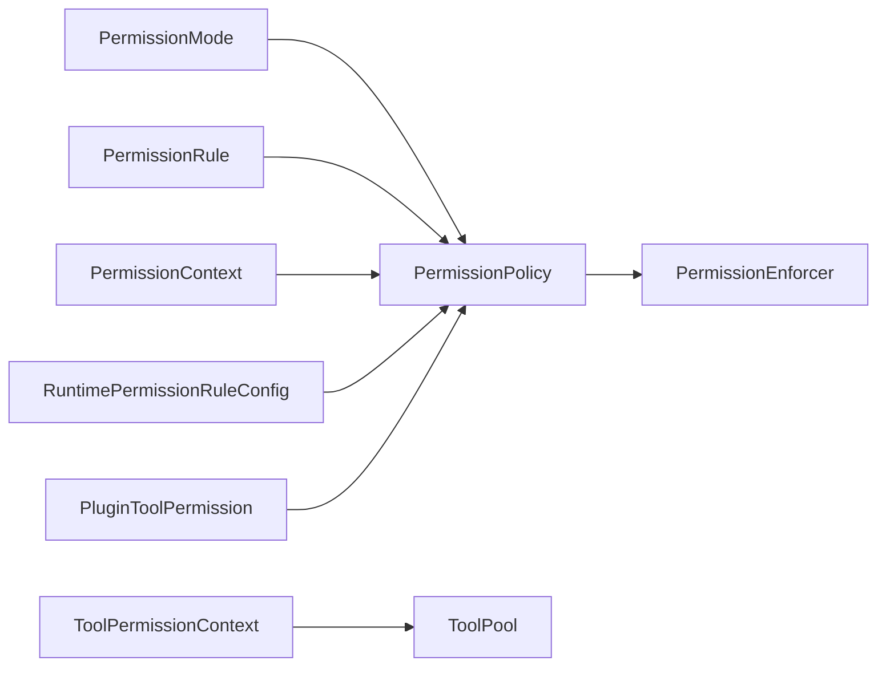
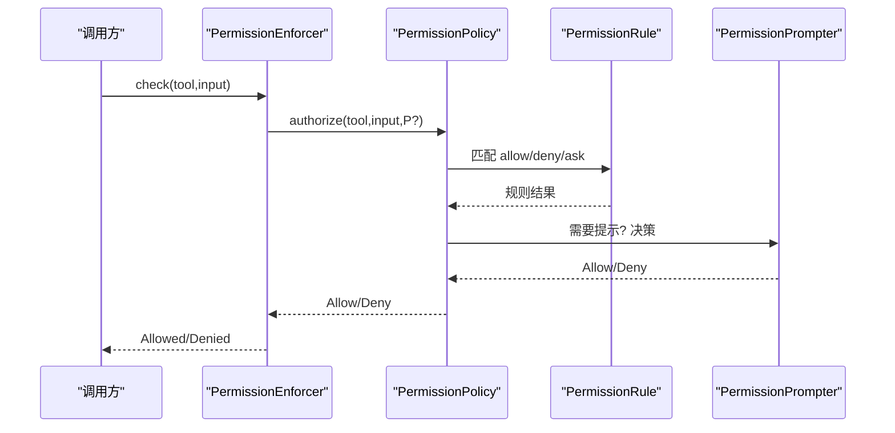

# 插件权限控制

<cite>
**本文引用的文件**
- [permissions.rs](file://rust/crates/runtime/src/permissions.rs)
- [permission_enforcer.rs](file://rust/crates/runtime/src/permission_enforcer.rs)
- [lib.rs（插件）](file://rust/crates/plugins/src/lib.rs)
- [config.rs](file://rust/crates/runtime/src/config.rs)
- [permissions.py](file://src/permissions.py)
- [tool_pool.py](file://src/tool_pool.py)
- [models.py](file://src/models.py)
</cite>

## 目录
1. [简介](#简介)
2. [项目结构](#项目结构)
3. [核心组件](#核心组件)
4. [架构总览](#架构总览)
5. [详细组件分析](#详细组件分析)
6. [依赖分析](#依赖分析)
7. [性能考量](#性能考量)
8. [故障排查指南](#故障排查指南)
9. [结论](#结论)
10. [附录](#附录)

## 简介
本文件系统化阐述插件权限控制的设计与实现，覆盖权限模型、权限级别、验证流程、访问控制策略、工具权限与工作区访问边界、危险权限管理、继承与提升、审计与错误处理等关键主题。目标是帮助开发者与运维人员在不深入源码的前提下，理解并正确配置与使用权限体系。

## 项目结构
围绕权限控制的关键模块分布于 Rust 运行时与 Python 工具层：
- Rust 运行时：权限模式、策略、规则、强制器、配置解析与加载
- Rust 插件子系统：插件清单中的权限声明与工具所需权限映射
- Python 层：工具池装配与工具权限上下文过滤

**图表来源**
- [permissions.rs:8-28](file://rust/crates/runtime/src/permissions.rs#L8-L28)
- [permissions.rs:98-105](file://rust/crates/runtime/src/permissions.rs#L98-L105)
- [permission_enforcer.rs:26-29](file://rust/crates/runtime/src/permission_enforcer.rs#L26-L29)
- [lib.rs（插件）:134-140](file://rust/crates/plugins/src/lib.rs#L134-L140)
- [lib.rs（插件）:180-186](file://rust/crates/plugins/src/lib.rs#L180-L186)
- [config.rs:88-93](file://rust/crates/runtime/src/config.rs#L88-L93)
- [permissions.py:6-21](file://src/permissions.py#L6-L21)
- [tool_pool.py:28-37](file://src/tool_pool.py#L28-L37)

**章节来源**
- [permissions.rs:1-684](file://rust/crates/runtime/src/permissions.rs#L1-L684)
- [permission_enforcer.rs:1-586](file://rust/crates/runtime/src/permission_enforcer.rs#L1-L586)
- [lib.rs（插件）:1-3658](file://rust/crates/plugins/src/lib.rs#L1-L3658)
- [config.rs:1-2112](file://rust/crates/runtime/src/config.rs#L1-L2112)
- [permissions.py:1-21](file://src/permissions.py#L1-L21)
- [tool_pool.py:1-38](file://src/tool_pool.py#L1-L38)
- [models.py:1-50](file://src/models.py#L1-L50)

## 核心组件
- 权限模式（PermissionMode）
  - 定义五档权限等级：只读、工作区写、危险全权、提示模式、允许全部。等级间存在可比较的序关系，用于快速判定“是否满足某工具所需的最低权限”。
- 权限策略（PermissionPolicy）
  - 组合活动模式、工具级需求、允许/拒绝/询问规则集，统一决策授权结果。
- 权限强制器（PermissionEnforcer）
  - 面向具体操作（如 bash、文件写入）的边界检查与即时放行/拒绝判断；对需要交互的场景委托给外部提示器。
- 插件权限与工具权限
  - 插件清单声明 read/write/execute 三类权限；每个工具声明其所需权限等级（只读/工作区写/危险全权），策略据此评估。
- 规则与匹配
  - 支持基于工具名与输入主体（从 JSON 输入中提取）的精确匹配、前缀匹配与任意匹配，以及转义语法。
- 运行时配置
  - 解析 permissions.allow/deny/ask 规则列表，合并多源配置，形成最终策略。

**章节来源**
- [permissions.rs:8-28](file://rust/crates/runtime/src/permissions.rs#L8-L28)
- [permissions.rs:98-105](file://rust/crates/runtime/src/permissions.rs#L98-L105)
- [permission_enforcer.rs:26-29](file://rust/crates/runtime/src/permission_enforcer.rs#L26-L29)
- [lib.rs（插件）:134-140](file://rust/crates/plugins/src/lib.rs#L134-L140)
- [lib.rs（插件）:180-186](file://rust/crates/plugins/src/lib.rs#L180-L186)
- [config.rs:88-93](file://rust/crates/runtime/src/config.rs#L88-L93)

## 架构总览
下图展示从配置到策略再到强制器的完整链路，以及插件清单如何影响工具所需权限。

**图表来源**
- [config.rs:780-798](file://rust/crates/runtime/src/config.rs#L780-L798)
- [permissions.rs:155-161](file://rust/crates/runtime/src/permissions.rs#L155-L161)
- [permissions.rs:164-292](file://rust/crates/runtime/src/permissions.rs#L164-L292)
- [permission_enforcer.rs:39-61](file://rust/crates/runtime/src/permission_enforcer.rs#L39-L61)
- [lib.rs（插件）:180-186](file://rust/crates/plugins/src/lib.rs#L180-L186)

## 详细组件分析

### 权限模式与策略
- 权限模式
  - 只读：仅允许只读操作；对可能修改状态的操作一律拒绝（除提示模式外）。
  - 工作区写：允许在工作区内进行写操作；跨工作区写需更高权限。
  - 危险全权：允许一切操作（含跨工作区写与危险命令）。
  - 提示：不直接放行，交由提示器决定；若无提示器则视为拒绝。
  - 允许全部：跳过大部分检查，常用于开发或受控环境。
- 策略决策流程
  - 优先匹配拒绝规则；其次根据钩子覆盖（允许/拒绝/要求确认）；再匹配询问规则；最后依据活动模式与工具所需模式综合判定。
  - 若处于提示模式且需要提升权限，或工作区写无法满足危险全权需求，则触发提示流程。

**图表来源**
- [permissions.rs:164-292](file://rust/crates/runtime/src/permissions.rs#L164-L292)

**章节来源**
- [permissions.rs:8-28](file://rust/crates/runtime/src/permissions.rs#L8-L28)
- [permissions.rs:98-105](file://rust/crates/runtime/src/permissions.rs#L98-L105)
- [permissions.rs:164-292](file://rust/crates/runtime/src/permissions.rs#L164-L292)

### 权限强制器与边界检查
- 工具执行
  - 当活动模式为提示时，直接放行以交由上层交互流程处理；否则按策略授权。
- 文件写入
  - 只读模式禁止写入；工作区写模式仅允许在工作区内写入；跨工作区写需危险全权；提示模式要求确认。
- Bash 命令
  - 只读模式仅允许保守的只读命令集合；工作区写及以上允许更广泛命令；提示模式严格限制。

**图表来源**
- [permission_enforcer.rs:108-142](file://rust/crates/runtime/src/permission_enforcer.rs#L108-L142)

**章节来源**
- [permission_enforcer.rs:39-100](file://rust/crates/runtime/src/permission_enforcer.rs#L39-L100)
- [permission_enforcer.rs:108-173](file://rust/crates/runtime/src/permission_enforcer.rs#L108-L173)

### 插件权限与工具权限
- 插件清单权限
  - 插件 manifest 声明 read/write/execute 三种权限，用于表达插件整体能力范围。
- 工具所需权限
  - 每个工具声明 required_permission（只读/工作区写/危险全权），策略据此计算工具所需模式。
- 清单校验
  - 对权限值进行去重、空值与非法值校验；工具 required_permission 同样进行解析与校验。

**图表来源**
- [lib.rs（插件）:117-132](file://rust/crates/plugins/src/lib.rs#L117-L132)
- [lib.rs（插件）:134-140](file://rust/crates/plugins/src/lib.rs#L134-L140)
- [lib.rs（插件）:168-178](file://rust/crates/plugins/src/lib.rs#L168-L178)
- [lib.rs（插件）:180-186](file://rust/crates/plugins/src/lib.rs#L180-L186)

**章节来源**
- [lib.rs（插件）:117-132](file://rust/crates/plugins/src/lib.rs#L117-L132)
- [lib.rs（插件）:1750-1782](file://rust/crates/plugins/src/lib.rs#L1750-L1782)
- [lib.rs（插件）:1827-1847](file://rust/crates/plugins/src/lib.rs#L1827-L1847)

### 规则系统与输入匹配
- 规则语法
  - 支持工具名后跟括号内的匹配器：任意(*)、精确值、前缀(:*)；支持对括号与反斜杠的转义。
- 匹配逻辑
  - 从输入 JSON 中提取 subject 字段（如 command、path、file_path、url 等常见键），与规则匹配器对比。
- 应用顺序
  - 拒绝规则优先；随后钩子覆盖；再看询问规则；最后模式比较。

**图表来源**
- [permissions.rs:349-391](file://rust/crates/runtime/src/permissions.rs#L349-L391)
- [permissions.rs:447-469](file://rust/crates/runtime/src/permissions.rs#L447-L469)

**章节来源**
- [permissions.rs:335-470](file://rust/crates/runtime/src/permissions.rs#L335-L470)

### 运行时配置与规则注入
- 配置来源与合并
  - 多源配置文件发现与合并，生成最终 FeatureConfig。
- 权限规则注入
  - 从 merged settings.permissions 中解析 allow/deny/ask 列表，构建规则集并注入策略。

**图表来源**
- [config.rs:242-269](file://rust/crates/runtime/src/config.rs#L242-L269)
- [config.rs:271-325](file://rust/crates/runtime/src/config.rs#L271-L325)
- [config.rs:780-798](file://rust/crates/runtime/src/config.rs#L780-L798)
- [permissions.rs:131-148](file://rust/crates/runtime/src/permissions.rs#L131-L148)

**章节来源**
- [config.rs:213-325](file://rust/crates/runtime/src/config.rs#L213-L325)
- [config.rs:780-798](file://rust/crates/runtime/src/config.rs#L780-L798)
- [permissions.rs:131-148](file://rust/crates/runtime/src/permissions.rs#L131-L148)

### Python 层工具权限上下文
- 工具权限上下文
  - 提供 deny_names 与 deny_prefixes 的冻结集合，用于快速判断工具名是否被显式拒绝。
- 工具池装配
  - assemble_tool_pool 接收 ToolPermissionContext，作为工具筛选的前置条件之一。

**图表来源**
- [permissions.py:6-21](file://src/permissions.py#L6-L21)
- [tool_pool.py:28-37](file://src/tool_pool.py#L28-L37)

**章节来源**
- [permissions.py:6-21](file://src/permissions.py#L6-L21)
- [tool_pool.py:28-37](file://src/tool_pool.py#L28-L37)
- [models.py:22-26](file://src/models.py#L22-L26)

## 依赖分析
- 组件耦合
  - PermissionPolicy 是权限控制的核心，依赖 PermissionMode、PermissionRule 与外部提示器接口。
  - PermissionEnforcer 将策略应用于具体操作（bash、文件写入），并与策略共享活动模式。
  - 插件清单通过 PluginToolPermission 影响策略的 required_mode_for 映射。
  - 运行时配置通过 RuntimePermissionRuleConfig 为策略注入规则。
- 外部依赖
  - Python 层的 ToolPermissionContext 与工具池装配，用于在工具暴露前进行黑名单/前缀过滤。

**图表来源**
- [permissions.rs:8-28](file://rust/crates/runtime/src/permissions.rs#L8-L28)
- [permissions.rs:98-105](file://rust/crates/runtime/src/permissions.rs#L98-L105)
- [permission_enforcer.rs:26-29](file://rust/crates/runtime/src/permission_enforcer.rs#L26-L29)
- [lib.rs（插件）:180-186](file://rust/crates/plugins/src/lib.rs#L180-L186)
- [config.rs:88-93](file://rust/crates/runtime/src/config.rs#L88-L93)
- [permissions.py:6-21](file://src/permissions.py#L6-L21)
- [tool_pool.py:28-37](file://src/tool_pool.py#L28-L37)

**章节来源**
- [permissions.rs:1-684](file://rust/crates/runtime/src/permissions.rs#L1-L684)
- [permission_enforcer.rs:1-586](file://rust/crates/runtime/src/permission_enforcer.rs#L1-L586)
- [lib.rs（插件）:1-3658](file://rust/crates/plugins/src/lib.rs#L1-L3658)
- [config.rs:1-2112](file://rust/crates/runtime/src/config.rs#L1-L2112)
- [permissions.py:1-21](file://src/permissions.py#L1-L21)
- [tool_pool.py:1-38](file://src/tool_pool.py#L1-L38)

## 性能考量
- 规则匹配
  - 规则数量与匹配复杂度线性相关；建议将高代价规则置于前面，利用早期短路。
- 输入解析
  - 从 JSON 中提取 subject 的解析开销与输入大小成正比；建议在上层对大体积输入进行裁剪或预处理。
- 模式比较
  - 模式比较为常数时间；策略主流程为 O(Rules)。
- 强制器分支
  - 文件写入与 bash 命令检查为常数时间；工作区边界检查为字符串前缀匹配。

[本节为通用指导，无需特定文件来源]

## 故障排查指南
- 常见拒绝原因
  - 工具所需权限高于当前模式；工作区写无法满足危险全权；提示模式缺少提示器。
- 审计与定位
  - EnforcementResult 与 PermissionOutcome 均携带明确原因字符串，可用于日志与用户反馈。
- 规则误判
  - 检查 permissions.allow/deny/ask 的语法与转义；确认工具名与 subject 键是否匹配。
- 钩子覆盖
  - 确认钩子是否正确设置 override_decision 与 override_reason，并确保提示器可用。

**章节来源**
- [permission_enforcer.rs:14-24](file://rust/crates/runtime/src/permission_enforcer.rs#L14-L24)
- [permissions.rs:91-95](file://rust/crates/runtime/src/permissions.rs#L91-L95)
- [permissions.rs:182-292](file://rust/crates/runtime/src/permissions.rs#L182-L292)

## 结论
该权限控制体系以清晰的五级模式为核心，结合规则与钩子覆盖，实现了对工具调用、文件写入与 bash 命令的细粒度控制。插件清单将“插件能力”与“工具所需权限”解耦，运行时配置提供灵活的策略注入点。通过提示器与审计输出，系统在安全性与可用性之间取得平衡。

## 附录

### 权限级别定义与映射
- 插件权限（manifest）
  - read：允许只读访问
  - write：允许工作区写入
  - execute：允许执行工具
- 工具所需权限（tool.required_permission）
  - read-only：只读工具
  - workspace-write：工作区写工具
  - danger-full-access：危险全权工具

**章节来源**
- [lib.rs（插件）:134-140](file://rust/crates/plugins/src/lib.rs#L134-L140)
- [lib.rs（插件）:180-186](file://rust/crates/plugins/src/lib.rs#L180-L186)

### 权限验证流程（序列）

**图表来源**
- [permission_enforcer.rs:39-61](file://rust/crates/runtime/src/permission_enforcer.rs#L39-L61)
- [permissions.rs:164-292](file://rust/crates/runtime/src/permissions.rs#L164-L292)

### 访问控制策略要点
- 工作区边界
  - 仅在工作区内允许写入；跨工作区写需危险全权。
- Bash 命令白名单
  - 只读模式下仅允许常见只读命令；工作区写及以上放宽；提示模式严格限制。
- 规则优先级
  - 拒绝规则最高；钩子覆盖次之；询问规则再次之；最后按模式比较。

**章节来源**
- [permission_enforcer.rs:108-173](file://rust/crates/runtime/src/permission_enforcer.rs#L108-L173)
- [permissions.rs:182-292](file://rust/crates/runtime/src/permissions.rs#L182-L292)

### 权限继承、提升与审计
- 继承
  - 插件清单的 read/write/execute 为插件能力声明，工具所需权限独立配置。
- 提升
  - 从只读到工作区写、从工作区写到危险全权的提升，通常需要提示确认。
- 审计
  - 所有拒绝均附带原因；建议在日志中记录 tool、active_mode、required_mode 与 reason。

**章节来源**
- [permissions.rs:266-292](file://rust/crates/runtime/src/permissions.rs#L266-L292)
- [permission_enforcer.rs:50-60](file://rust/crates/runtime/src/permission_enforcer.rs#L50-L60)

### 最佳实践与合规建议
- 最小权限原则
  - 默认使用只读或工作区写，仅在必要时提升至危险全权。
- 规则治理
  - 使用 allow/deny/ask 规则集中管理高风险工具与命令；定期审查与审计。
- 钩子与提示器
  - 在 CI/CD 环境禁用提示模式；本地开发启用提示器以获得交互确认。
- 配置来源
  - 将敏感规则置于更低优先级的配置源，避免被更高优先级覆盖。
- 合规记录
  - 记录每次权限提升与拒绝事件，满足审计要求。

[本节为通用指导，无需特定文件来源]