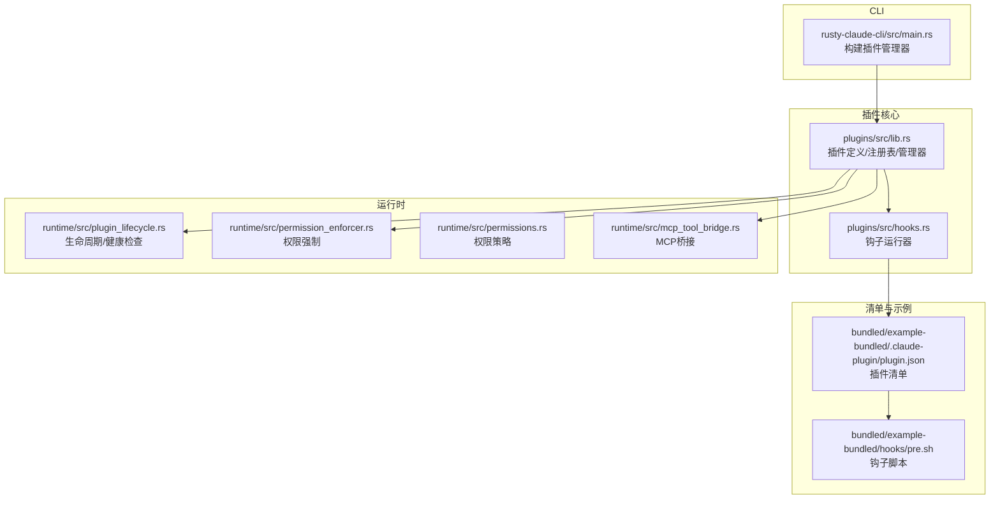
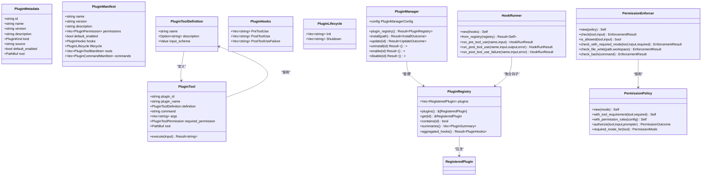
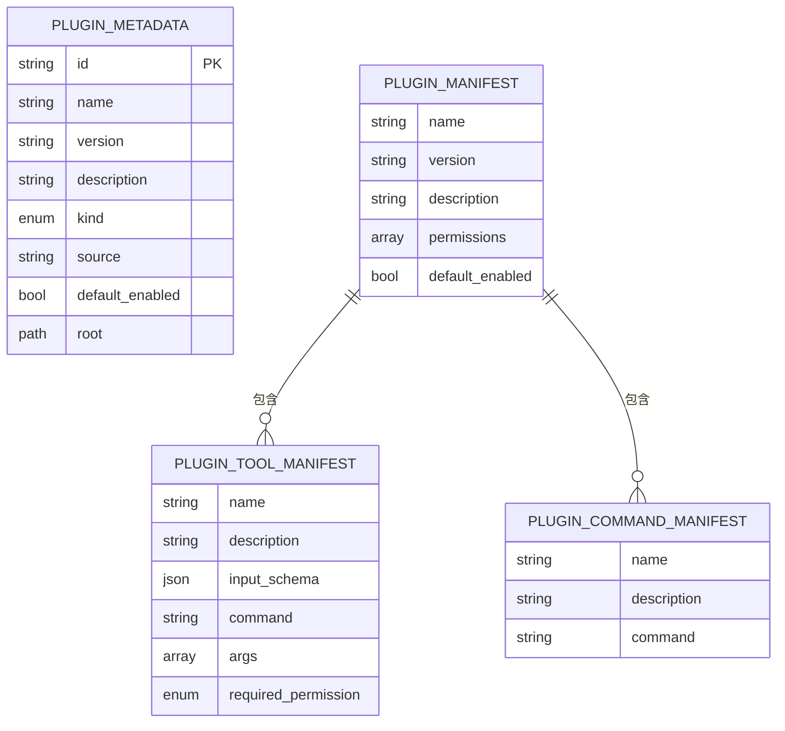
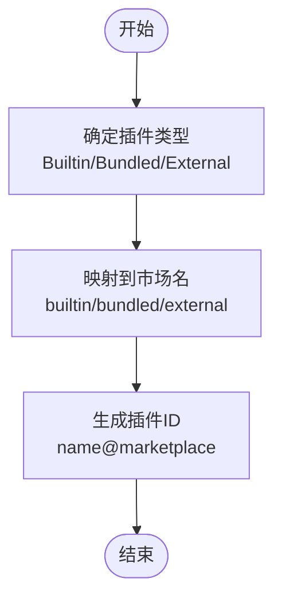
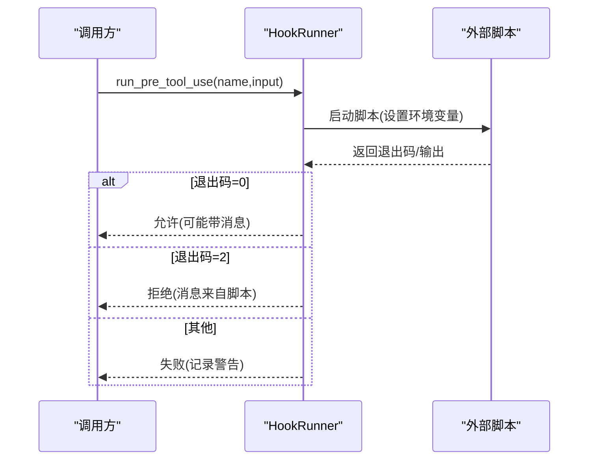
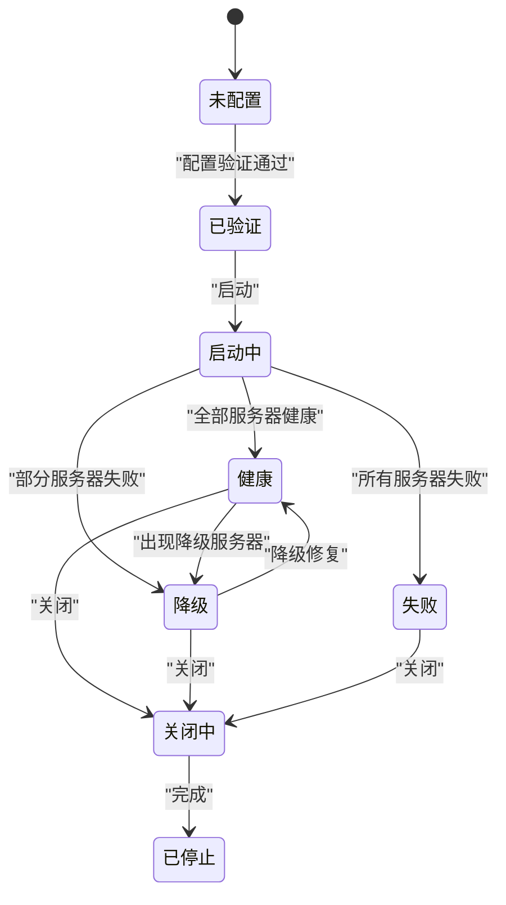
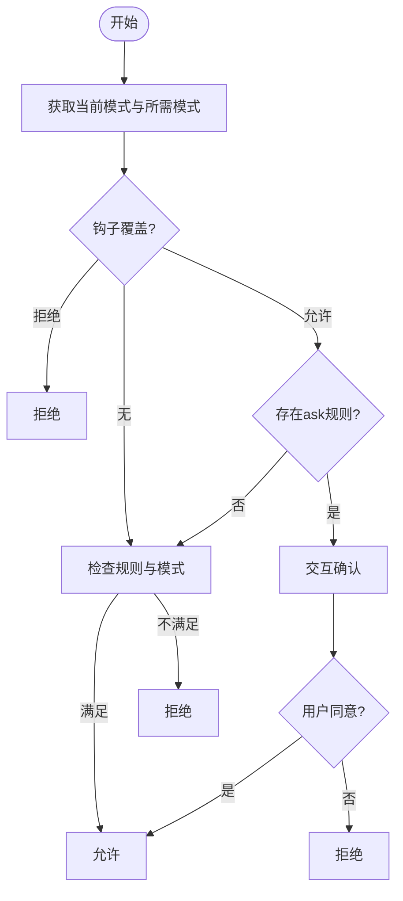
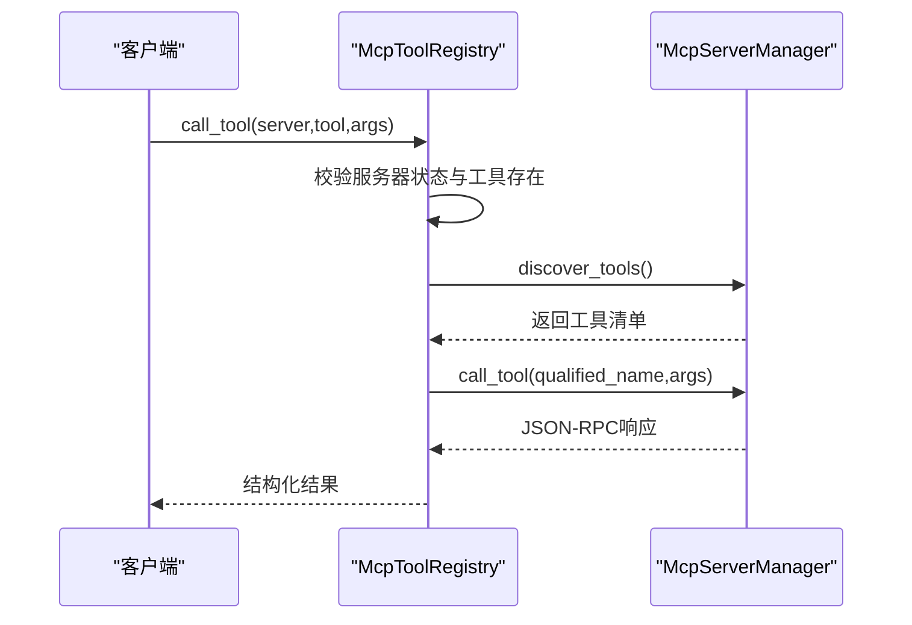
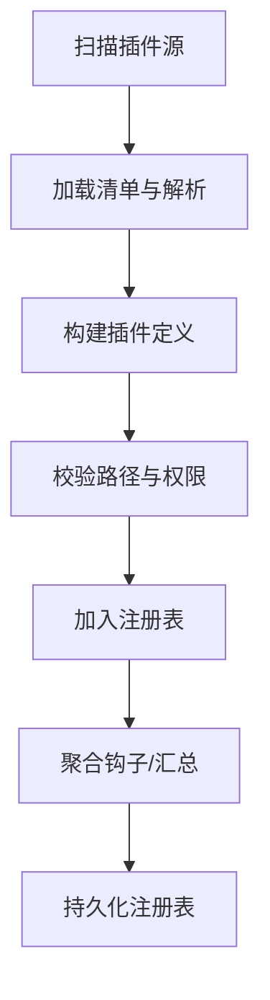
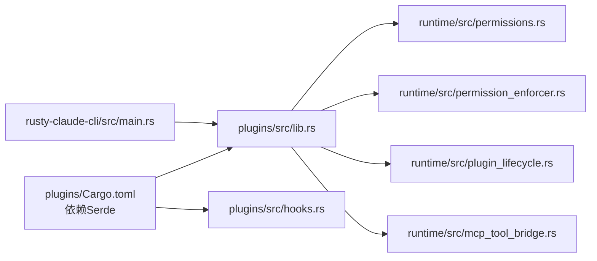

# 插件架构设计

<cite>
**本文档引用的文件**
- [lib.rs](file://rust/crates/plugins/src/lib.rs)
- [hooks.rs](file://rust/crates/plugins/src/hooks.rs)
- [plugin_lifecycle.rs](file://rust/crates/runtime/src/plugin_lifecycle.rs)
- [permission_enforcer.rs](file://rust/crates/runtime/src/permission_enforcer.rs)
- [permissions.rs](file://rust/crates/runtime/src/permissions.rs)
- [mcp_tool_bridge.rs](file://rust/crates/runtime/src/mcp_tool_bridge.rs)
- [plugin.json（示例）](file://rust/crates/plugins/bundled/example-bundled/.claude-plugin/plugin.json)
- [plugin.json（示例钩子）](file://rust/crates/plugins/bundled/sample-hooks/.claude-plugin/plugin.json)
- [pre.sh（示例钩子）](file://rust/crates/plugins/bundled/example-bundled/hooks/pre.sh)
- [Cargo.toml（插件crate）](file://rust/crates/plugins/Cargo.toml)
- [main.rs（CLI构建插件管理器）](file://rust/crates/rusty-claude-cli/src/main.rs)
</cite>

## 目录
1. [简介](#简介)
2. [项目结构](#项目结构)
3. [核心组件](#核心组件)
4. [架构总览](#架构总览)
5. [详细组件分析](#详细组件分析)
6. [依赖关系分析](#依赖关系分析)
7. [性能考量](#性能考量)
8. [故障排除指南](#故障排除指南)
9. [结论](#结论)

## 简介
本文件系统性阐述该代码库中的插件架构设计，涵盖插件系统整体架构模式、核心组件与数据结构、插件元数据与清单格式、插件分类机制、生命周期管理、权限模型、工具定义、注册表与发现机制、加载流程、插件间通信、依赖管理与版本兼容性等。目标是为开发者提供从概念到实现的完整参考。

## 项目结构
插件系统主要由以下部分组成：
- 插件核心库：定义插件元数据、清单、工具、生命周期、注册表与管理器等核心类型与行为
- 钩子系统：在工具使用前后执行外部脚本，支持预处理、后处理与失败处理
- 权限系统：基于策略的权限控制，支持只读、工作区写入、危险全权、提示模式与允许模式
- 运行时生命周期：插件状态机、健康检查、降级模式与服务发现
- MCP桥接：连接MCP服务器，暴露工具调用能力
- CLI集成：命令行工具中构建与配置插件管理器

**图表来源**
- [lib.rs:1-120](file://rust/crates/plugins/src/lib.rs#L1-120)
- [hooks.rs:1-120](file://rust/crates/plugins/src/hooks.rs#L1-120)
- [plugin_lifecycle.rs:1-120](file://rust/crates/runtime/src/plugin_lifecycle.rs#L1-120)
- [permission_enforcer.rs:1-120](file://rust/crates/runtime/src/permission_enforcer.rs#L1-120)
- [permissions.rs:1-120](file://rust/crates/runtime/src/permissions.rs#L1-120)
- [mcp_tool_bridge.rs:1-120](file://rust/crates/runtime/src/mcp_tool_bridge.rs#L1-120)
- [plugin.json（示例）:1-11](file://rust/crates/plugins/bundled/example-bundled/.claude-plugin/plugin.json#L1-11)
- [pre.sh（示例钩子）:1-3](file://rust/crates/plugins/bundled/example-bundled/hooks/pre.sh#L1-3)
- [main.rs（CLI构建插件管理器）:6150-6185](file://rust/crates/rusty-claude-cli/src/main.rs#L6150-L6185)

**章节来源**
- [lib.rs:1-120](file://rust/crates/plugins/src/lib.rs#L1-120)
- [hooks.rs:1-120](file://rust/crates/plugins/src/hooks.rs#L1-120)
- [plugin_lifecycle.rs:1-120](file://rust/crates/runtime/src/plugin_lifecycle.rs#L1-120)
- [permission_enforcer.rs:1-120](file://rust/crates/runtime/src/permission_enforcer.rs#L1-120)
- [permissions.rs:1-120](file://rust/crates/runtime/src/permissions.rs#L1-120)
- [mcp_tool_bridge.rs:1-120](file://rust/crates/runtime/src/mcp_tool_bridge.rs#L1-120)
- [plugin.json（示例）:1-11](file://rust/crates/plugins/bundled/example-bundled/.claude-plugin/plugin.json#L1-11)
- [pre.sh（示例钩子）:1-3](file://rust/crates/plugins/bundled/example-bundled/hooks/pre.sh#L1-3)
- [main.rs（CLI构建插件管理器）:6150-6185](file://rust/crates/rusty-claude-cli/src/main.rs#L6150-L6185)

## 核心组件
- 插件元数据与清单
  - 元数据：插件标识、名称、版本、描述、类型、来源、默认启用状态、根目录
  - 清单：包含权限、默认启用、钩子、生命周期、工具、命令等字段
- 插件分类
  - 内置（Builtin）、捆绑（Bundled）、外部（External）
- 工具与命令
  - 工具定义包含名称、描述、输入模式、命令与参数
  - 命令清单定义可直接执行的命令
- 注册表与管理器
  - 注册表聚合已安装插件，提供查询与汇总
  - 管理器负责发现、安装、更新、卸载与配置
- 钩子系统
  - 支持 PreToolUse、PostToolUse、PostToolUseFailure 三类事件
  - 通过外部脚本执行，支持拒绝、允许与失败处理
- 生命周期与健康检查
  - 定义启动、健康、降级、失败、关闭等状态
  - 提供服务健康度评估与降级模式
- 权限模型
  - 模式：只读、工作区写入、危险全权、提示、允许
  - 策略：规则匹配、覆盖决策、交互提示
- MCP桥接
  - 维护MCP服务器状态，提供工具调用与资源访问

**章节来源**
- [lib.rs:55-132](file://rust/crates/plugins/src/lib.rs#L55-132)
- [lib.rs:134-223](file://rust/crates/plugins/src/lib.rs#L134-223)
- [lib.rs:260-289](file://rust/crates/plugins/src/lib.rs#L260-289)
- [hooks.rs:9-24](file://rust/crates/plugins/src/hooks.rs#L9-24)
- [plugin_lifecycle.rs:19-61](file://rust/crates/runtime/src/plugin_lifecycle.rs#L19-61)
- [permissions.rs:8-28](file://rust/crates/runtime/src/permissions.rs#L8-28)
- [mcp_tool_bridge.rs:22-71](file://rust/crates/runtime/src/mcp_tool_bridge.rs#L22-71)

## 架构总览
插件系统采用分层架构：
- 数据层：插件元数据、清单、工具与命令定义
- 行为层：钩子执行、生命周期管理、权限控制
- 服务层：MCP桥接、注册表与管理器
- 接口层：CLI集成与配置解析

**图表来源**
- [lib.rs:55-289](file://rust/crates/plugins/src/lib.rs#L55-289)
- [hooks.rs:59-120](file://rust/crates/plugins/src/hooks.rs#L59-120)
- [permissions.rs:99-333](file://rust/crates/runtime/src/permissions.rs#L99-333)
- [permission_enforcer.rs:26-174](file://rust/crates/runtime/src/permission_enforcer.rs#L26-174)

**章节来源**
- [lib.rs:55-289](file://rust/crates/plugins/src/lib.rs#L55-289)
- [hooks.rs:59-120](file://rust/crates/plugins/src/hooks.rs#L59-120)
- [permissions.rs:99-333](file://rust/crates/runtime/src/permissions.rs#L99-333)
- [permission_enforcer.rs:26-174](file://rust/crates/runtime/src/permission_enforcer.rs#L26-174)

## 详细组件分析

### 插件元数据与清单结构
- 元数据字段：id、name、version、description、kind、source、default_enabled、root
- 清单字段：name、version、description、permissions、defaultEnabled、hooks、lifecycle、tools、commands
- 工具清单：name、description、inputSchema、command、args、requiredPermission
- 命令清单：name、description、command

**图表来源**
- [lib.rs:117-132](file://rust/crates/plugins/src/lib.rs#L117-132)
- [lib.rs:168-223](file://rust/crates/plugins/src/lib.rs#L168-223)

**章节来源**
- [lib.rs:117-132](file://rust/crates/plugins/src/lib.rs#L117-132)
- [lib.rs:168-223](file://rust/crates/plugins/src/lib.rs#L168-223)

### 插件分类机制
- 分类枚举：Builtin、Bundled、External
- 市场分类映射：builtin、bundled、external
- 插件ID生成：基于清单名称与市场名组合

**图表来源**
- [lib.rs:26-53](file://rust/crates/plugins/src/lib.rs#L26-53)
- [lib.rs:1550-1551](file://rust/crates/plugins/src/lib.rs#L1550-L1551)

**章节来源**
- [lib.rs:26-53](file://rust/crates/plugins/src/lib.rs#L26-53)
- [lib.rs:1550-1551](file://rust/crates/plugins/src/lib.rs#L1550-L1551)

### 钩子系统与执行流程
- 钩子事件：PreToolUse、PostToolUse、PostToolUseFailure
- 执行模型：串行执行，遇到拒绝立即返回，失败记录但继续后续钩子
- 脚本环境：注入事件名、工具名、输入、输出、错误标志等环境变量
- 平台差异：Windows使用cmd，非Windows使用sh或可执行脚本

**图表来源**
- [hooks.rs:70-120](file://rust/crates/plugins/src/hooks.rs#L70-L120)
- [hooks.rs:176-230](file://rust/crates/plugins/src/hooks.rs#L176-L230)

**章节来源**
- [hooks.rs:70-120](file://rust/crates/plugins/src/hooks.rs#L70-L120)
- [hooks.rs:176-230](file://rust/crates/plugins/src/hooks.rs#L176-L230)

### 生命周期管理与健康检查
- 状态机：未配置、已验证、启动中、健康、降级、失败、关闭中、已停止
- 健康检查：根据服务器状态计算整体状态
- 降级模式：暴露可用工具列表，隐藏不可用工具
- 生命周期事件：配置验证、启动健康、启动降级、启动失败、关闭

**图表来源**
- [plugin_lifecycle.rs:47-61](file://rust/crates/runtime/src/plugin_lifecycle.rs#L47-61)
- [plugin_lifecycle.rs:63-99](file://rust/crates/runtime/src/plugin_lifecycle.rs#L63-99)

**章节来源**
- [plugin_lifecycle.rs:47-99](file://rust/crates/runtime/src/plugin_lifecycle.rs#L47-99)

### 权限模型与强制执行
- 权限模式：ReadOnly、WorkspaceWrite、DangerFullAccess、Prompt、Allow
- 策略规则：deny/allow/ask 规则，支持通配符与前缀匹配
- 覆盖决策：钩子可直接允许/拒绝/要求确认
- 强制执行：检查工具是否允许、文件写入范围、bash命令是否只读

**图表来源**
- [permissions.rs:164-292](file://rust/crates/runtime/src/permissions.rs#L164-292)
- [permission_enforcer.rs:37-100](file://rust/crates/runtime/src/permission_enforcer.rs#L37-100)

**章节来源**
- [permissions.rs:164-292](file://rust/crates/runtime/src/permissions.rs#L164-292)
- [permission_enforcer.rs:37-100](file://rust/crates/runtime/src/permission_enforcer.rs#L37-100)

### MCP桥接与工具调用
- 服务器状态：断开、连接中、已连接、需要认证、错误
- 工具与资源：工具信息、资源信息
- 注册表：维护服务器状态，提供工具列表、资源读取、工具调用
- 调用流程：线程池+Tokio运行时，调用MCP服务器工具，处理JSON-RPC错误

**图表来源**
- [mcp_tool_bridge.rs:177-278](file://rust/crates/runtime/src/mcp_tool_bridge.rs#L177-278)

**章节来源**
- [mcp_tool_bridge.rs:177-278](file://rust/crates/runtime/src/mcp_tool_bridge.rs#L177-278)

### 注册表、发现机制与加载流程
- 发现：扫描内置、捆绑与外部目录，加载清单，解析钩子、生命周期与工具
- 加载：按类型构造插件定义，校验路径有效性，生成元数据与工具
- 注册：构建注册表，按ID排序，提供聚合钩子与摘要
- 管理：安装、更新、卸载、启用/禁用插件，持久化注册表

**图表来源**
- [lib.rs:1370-1400](file://rust/crates/plugins/src/lib.rs#L1370-L1400)
- [lib.rs:1543-1583](file://rust/crates/plugins/src/lib.rs#L1543-L1583)

**章节来源**
- [lib.rs:1370-1400](file://rust/crates/plugins/src/lib.rs#L1370-L1400)
- [lib.rs:1543-1583](file://rust/crates/plugins/src/lib.rs#L1543-L1583)

### 插件间通信与依赖管理
- 通信方式：钩子脚本通过标准输入输出与环境变量传递上下文
- 依赖管理：通过清单声明工具与命令，生命周期脚本进行初始化/清理
- 版本兼容：通过版本字段与更新流程保证向后兼容

**章节来源**
- [hooks.rs:176-230](file://rust/crates/plugins/src/hooks.rs#L176-L230)
- [lib.rs:101-114](file://rust/crates/plugins/src/lib.rs#L101-L114)
- [lib.rs:1784-1804](file://rust/crates/plugins/src/lib.rs#L1784-L1804)

## 依赖关系分析
- 插件核心依赖Serde进行序列化/反序列化
- CLI通过配置解析构建插件管理器，传入外部目录、安装根目录、注册表路径与捆绑根目录
- 运行时模块提供权限策略、生命周期与MCP桥接

**图表来源**
- [Cargo.toml（插件crate）:8-10](file://rust/crates/plugins/Cargo.toml#L8-10)
- [main.rs（CLI构建插件管理器）:6150-6185](file://rust/crates/rusty-claude-cli/src/main.rs#L6150-L6185)
- [lib.rs:1-16](file://rust/crates/plugins/src/lib.rs#L1-16)
- [permissions.rs:1-6](file://rust/crates/runtime/src/permissions.rs#L1-6)
- [permission_enforcer.rs:1-11](file://rust/crates/runtime/src/permission_enforcer.rs#L1-11)
- [plugin_lifecycle.rs:1-8](file://rust/crates/runtime/src/plugin_lifecycle.rs#L1-8)
- [mcp_tool_bridge.rs:1-21](file://rust/crates/runtime/src/mcp_tool_bridge.rs#L1-21)

**章节来源**
- [Cargo.toml（插件crate）:8-10](file://rust/crates/plugins/Cargo.toml#L8-10)
- [main.rs（CLI构建插件管理器）:6150-6185](file://rust/crates/rusty-claude-cli/src/main.rs#L6150-L6185)
- [lib.rs:1-16](file://rust/crates/plugins/src/lib.rs#L1-16)

## 性能考量
- 并行安装：多线程并行安装插件，减少等待时间
- 钩子执行：串行执行，避免竞态；脚本I/O需注意管道写入的BrokenPipe容忍
- 生命周期：健康检查与降级模式避免阻塞主流程
- 权限检查：规则匹配与模式比较为轻量操作，建议缓存常用结果
- MCP调用：异步Tokio运行时，避免阻塞主线程

[本节为通用指导，无需特定文件来源]

## 故障排除指南
- 插件加载失败：检查清单字段完整性、权限声明合法性、工具输入模式有效性
- 钩子执行失败：查看脚本退出码与标准错误输出，确认环境变量注入正确
- 权限拒绝：调整权限模式或添加规则，必要时使用交互提示
- MCP工具调用错误：检查服务器状态、工具存在性与JSON-RPC响应

**章节来源**
- [lib.rs:892-922](file://rust/crates/plugins/src/lib.rs#L892-L922)
- [hooks.rs:204-228](file://rust/crates/plugins/src/hooks.rs#L204-L228)
- [permissions.rs:164-292](file://rust/crates/runtime/src/permissions.rs#L164-L292)
- [mcp_tool_bridge.rs:177-278](file://rust/crates/runtime/src/mcp_tool_bridge.rs#L177-L278)

## 结论
该插件架构以清晰的数据结构与分层设计为基础，结合钩子、生命周期、权限与MCP桥接，提供了可扩展、可审计且安全的插件生态。通过清单驱动与严格的校验机制，确保插件的一致性与可靠性；通过权限策略与降级模式，保障运行时的安全与稳定性。未来可在插件依赖图谱、热重载与远程插件仓库方面进一步增强。