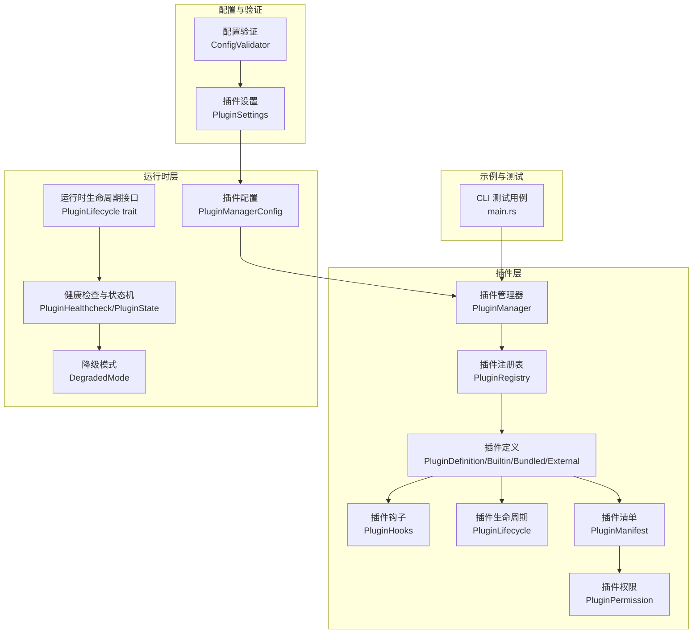
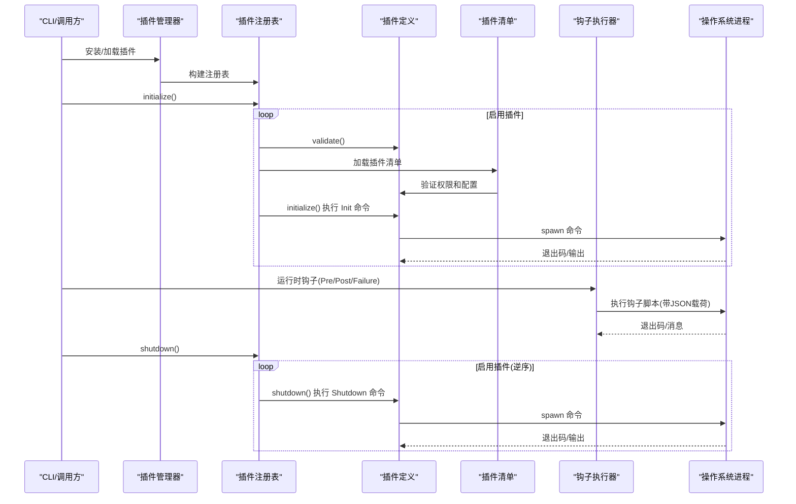
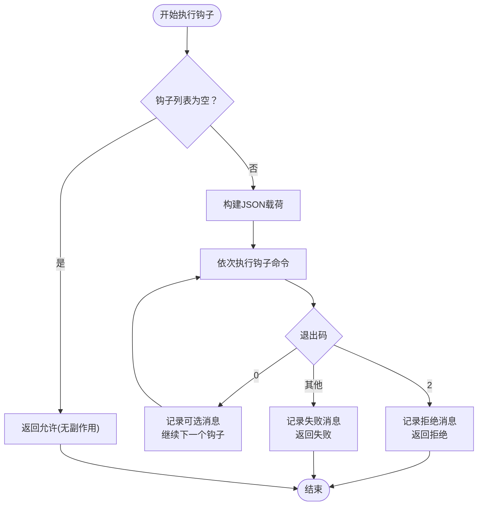
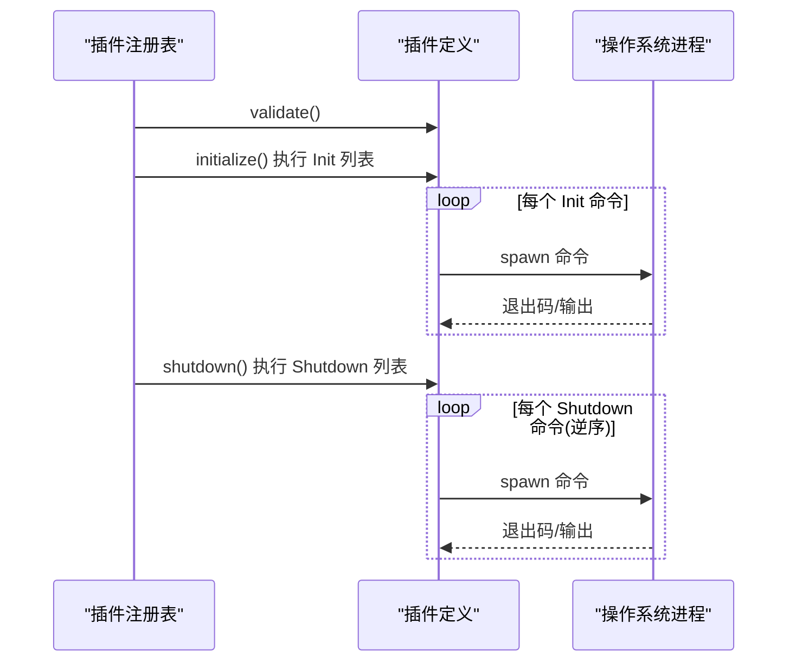
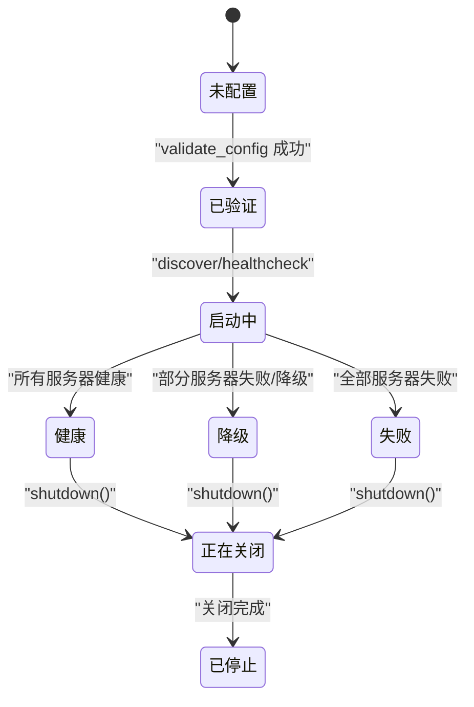
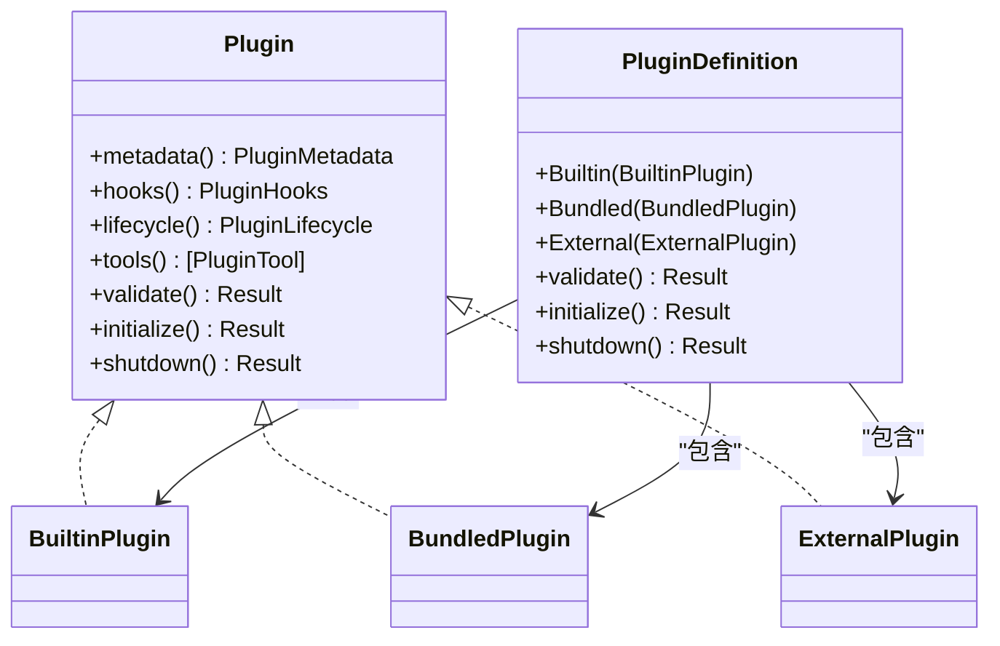
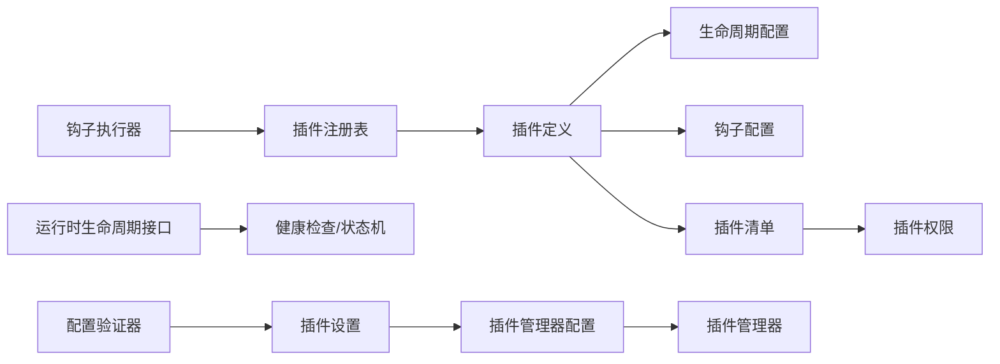

# 插件生命周期管理

<cite>
**本文引用的文件**
- [lib.rs](file://rust/crates/plugins/src/lib.rs)
- [hooks.rs](file://rust/crates/plugins/src/hooks.rs)
- [plugin_lifecycle.rs](file://rust/crates/runtime/src/plugin_lifecycle.rs)
- [config.rs](file://rust/crates/runtime/src/config.rs)
- [config_validate.rs](file://rust/crates/runtime/src/config_validate.rs)
- [main.rs](file://rust/crates/rusty-claude-cli/src/main.rs)
- [Cargo.toml](file://rust/crates/plugins/Cargo.toml)
- [plugins.json](file://src/reference_data/subsystems/plugins.json)
</cite>

## 更新摘要
**所做更改**
- 新增插件安装清单和配置系统章节，详细说明基于插件清单的安装、更新和管理流程
- 更新插件管理器配置系统，包括安装根目录、注册表路径和捆绑包根目录
- 新增插件清单验证和权限管理机制
- 更新插件生命周期状态机和错误处理策略
- 新增插件类型差异对比和迁移指南

## 目录
1. [引言](#引言)
2. [项目结构](#项目结构)
3. [核心组件](#核心组件)
4. [架构总览](#架构总览)
5. [详细组件分析](#详细组件分析)
6. [插件安装清单和配置系统](#插件安装清单和配置系统)
7. [依赖关系分析](#依赖关系分析)
8. [性能考量](#性能考量)
9. [故障排查指南](#故障排查指南)
10. [结论](#结论)
11. [附录](#附录)

## 引言
本文件系统性阐述插件从加载到卸载的完整生命周期管理机制，覆盖初始化、运行时管理与清理阶段；详述生命周期钩子的触发时机与执行顺序；说明插件验证、启动失败处理与优雅关闭的实现；给出生命周期事件的监听与响应模式，以及错误恢复与重试策略；并对比内置、捆绑与外部插件在生命周期上的差异。

**更新** 本次更新重点反映了新增的插件安装清单和配置系统，包括基于插件清单的安装、更新和管理流程，以及插件权限验证和生命周期状态管理的改进。

## 项目结构
围绕插件生命周期的关键模块分布于 Rust 子工程中：
- 插件定义与注册：位于 plugins crate 的 lib.rs，定义插件元数据、生命周期配置、工具与注册表等。
- 钩子执行：位于 plugins crate 的 hooks.rs，负责 Pre/Post 工具使用钩子的收集、聚合与执行。
- 运行时生命周期状态机：位于 runtime crate 的 plugin_lifecycle.rs，定义健康检查、降级模式与生命周期事件。
- 配置系统：位于 runtime crate 的 config.rs 和 config_validate.rs，管理插件配置验证和加载。
- CLI 集成测试：位于 rusty-claude-cli 的 main.rs，演示安装、初始化与优雅关闭流程。

**图表来源**
- [lib.rs:1118-1235](file://rust/crates/plugins/src/lib.rs#L1118-L1235)
- [lib.rs:116-132](file://rust/crates/plugins/src/lib.rs#L116-L132)
- [lib.rs:134-140](file://rust/crates/plugins/src/lib.rs#L134-L140)
- [config.rs:1690-1734](file://rust/crates/runtime/src/config.rs#L1690-L1734)
- [config_validate.rs:703-715](file://rust/crates/runtime/src/config_validate.rs#L703-L715)

**章节来源**
- [lib.rs:1-120](file://rust/crates/plugins/src/lib.rs#L1-L120)
- [hooks.rs:1-60](file://rust/crates/plugins/src/hooks.rs#L1-L60)
- [plugin_lifecycle.rs:1-60](file://rust/crates/runtime/src/plugin_lifecycle.rs#L1-L60)
- [config.rs:1690-1734](file://rust/crates/runtime/src/config.rs#L1690-L1734)

## 核心组件
- 插件元数据与类型
  - 插件种类：内置(builtin)、捆绑(bundled)、外部(external)，通过枚举与市场标识区分。
  - 元数据：包含插件 ID、名称、版本、描述、来源、默认启用状态与根路径等。
- 生命周期配置
  - 初始化与关闭命令列表，按字符串命令序列执行，支持工作目录与环境变量注入。
- 钩子系统
  - 预工具使用、后置工具使用、后置失败三类钩子，支持多插件聚合执行。
  - 钩子脚本通过标准输入接收 JSON 载荷，通过退出码控制允许/拒绝/失败。
- 注册表与管理器
  - 注册表维护已安装插件集合，提供启用过滤、验证与初始化/关闭批量操作。
  - 管理器负责安装、发现与配置加载，驱动注册表执行生命周期。
- 插件清单系统
  - 基于 JSON 清单文件的插件描述，包含权限、工具、命令和生命周期配置。
  - 支持插件清单验证、权限解析和工具命令构建。

**章节来源**
- [lib.rs:26-65](file://rust/crates/plugins/src/lib.rs#L26-L65)
- [lib.rs:101-114](file://rust/crates/plugins/src/lib.rs#L101-L114)
- [lib.rs:116-132](file://rust/crates/plugins/src/lib.rs#L116-L132)
- [lib.rs:134-140](file://rust/crates/plugins/src/lib.rs#L134-L140)
- [hooks.rs:9-24](file://rust/crates/plugins/src/hooks.rs#L9-L24)
- [hooks.rs:60-120](file://rust/crates/plugins/src/hooks.rs#L60-L120)
- [lib.rs:761-845](file://rust/crates/plugins/src/lib.rs#L761-L845)

## 架构总览
插件生命周期由"声明式配置 + 命令执行 + 钩子回调"的组合实现。初始化阶段按启用顺序对每个插件执行生命周期命令；运行时通过钩子拦截工具调用；关闭阶段逆序执行生命周期命令，确保资源有序释放。

**图表来源**
- [lib.rs:1118-1235](file://rust/crates/plugins/src/lib.rs#L1118-L1235)
- [lib.rs:474-496](file://rust/crates/plugins/src/lib.rs#L474-L496)
- [hooks.rs:74-119](file://rust/crates/plugins/src/hooks.rs#L74-L119)
- [hooks.rs:121-174](file://rust/crates/plugins/src/hooks.rs#L121-L174)

## 详细组件分析

### 生命周期钩子执行模型
- 触发时机
  - PreToolUse：工具调用前，用于鉴权或前置校验。
  - PostToolUse：工具调用成功后，用于记录或后置处理。
  - PostToolUseFailure：工具调用失败后，用于告警或回滚。
- 执行顺序
  - 按注册表聚合后的钩子列表顺序执行，任一钩子返回拒绝或失败即短路。
  - 允许态：继续后续钩子；拒绝态：立即终止并返回拒绝结果；失败态：记录警告并终止。
- 输入输出
  - 标准输入为 JSON 载荷，包含事件名、工具名、输入 JSON、输出或错误、是否错误标记。
  - 退出码约定：0=允许，2=拒绝，其他=失败。

**图表来源**
- [hooks.rs:121-174](file://rust/crates/plugins/src/hooks.rs#L121-L174)
- [hooks.rs:177-230](file://rust/crates/plugins/src/hooks.rs#L177-L230)
- [hooks.rs:238-267](file://rust/crates/plugins/src/hooks.rs#L238-L267)

**章节来源**
- [hooks.rs:74-119](file://rust/crates/plugins/src/hooks.rs#L74-L119)
- [hooks.rs:121-174](file://rust/crates/plugins/src/hooks.rs#L121-L174)
- [hooks.rs:177-230](file://rust/crates/plugins/src/hooks.rs#L177-L230)

### 生命周期命令执行模型
- 初始化阶段
  - 对每个启用插件执行 Init 命令序列，路径基于插件根目录与生命周期配置。
- 关闭阶段
  - 对每个启用插件逆序执行 Shutdown 命令序列，保证依赖释放顺序。
- 错误传播
  - 任一命令失败将导致整体初始化/关闭失败，注册表报告聚合失败。

**图表来源**
- [lib.rs:1118-1235](file://rust/crates/plugins/src/lib.rs#L1118-L1235)
- [lib.rs:474-496](file://rust/crates/plugins/src/lib.rs#L474-L496)
- [lib.rs:516-538](file://rust/crates/plugins/src/lib.rs#L516-L538)

**章节来源**
- [lib.rs:1118-1235](file://rust/crates/plugins/src/lib.rs#L1118-L1235)
- [lib.rs:474-496](file://rust/crates/plugins/src/lib.rs#L474-L496)
- [lib.rs:516-538](file://rust/crates/plugins/src/lib.rs#L516-L538)

### 运行时生命周期状态机
- 状态定义
  - 未配置、已验证、启动中、健康、降级、失败、正在关闭、已停止。
- 健康检查
  - 基于服务器健康集合计算状态，支持降级模式下可用/不可用工具清单。
- 生命周期事件
  - 配置已验证、启动健康、启动降级、启动失败、关闭。
- 优雅关闭
  - 关闭后健康检查返回已停止状态，确保资源回收完成。

**图表来源**
- [plugin_lifecycle.rs:37-99](file://rust/crates/runtime/src/plugin_lifecycle.rs#L37-L99)
- [plugin_lifecycle.rs:192-219](file://rust/crates/runtime/src/plugin_lifecycle.rs#L192-L219)

**章节来源**
- [plugin_lifecycle.rs:37-99](file://rust/crates/runtime/src/plugin_lifecycle.rs#L37-L99)
- [plugin_lifecycle.rs:192-219](file://rust/crates/runtime/src/plugin_lifecycle.rs#L192-L219)

### 不同插件类型的生命周期差异
- 内置插件
  - 默认无需外部文件系统验证，初始化/关闭为轻量操作。
- 捆绑插件
  - 需要验证钩子与生命周期命令路径存在性，并执行 Init/Shutdown 命令。
- 外部插件
  - 同捆绑插件的验证与命令执行逻辑，区别在于来源与安装方式。

**图表来源**
- [lib.rs:410-418](file://rust/crates/plugins/src/lib.rs#L410-L418)
- [lib.rs:420-425](file://rust/crates/plugins/src/lib.rs#L420-L425)
- [lib.rs:427-539](file://rust/crates/plugins/src/lib.rs#L427-L539)

**章节来源**
- [lib.rs:427-539](file://rust/crates/plugins/src/lib.rs#L427-L539)

### 生命周期事件监听与响应模式
- 钩子监听
  - 通过注册表聚合各插件钩子，统一在运行时触发 Pre/Post/Failure 事件。
- 响应模式
  - 允许：继续执行；拒绝：阻断工具调用；失败：记录警告并继续但不阻断。
- CLI 集成
  - CLI 在安装后触发初始化，在关闭时触发优雅关闭，验证生命周期日志输出。

**章节来源**
- [hooks.rs:74-119](file://rust/crates/plugins/src/hooks.rs#L74-L119)
- [main.rs:6150-6185](file://rust/crates/rusty-claude-cli/src/main.rs#L6150-L6185)

### 错误恢复与重试策略
- 钩子失败
  - 单个钩子失败会阻止后续执行，但不影响其他钩子的聚合结果；可通过修复脚本或调整命令顺序恢复。
- 生命周期命令失败
  - 初始化/关闭阶段任一命令失败将导致整体失败，需定位具体命令与环境问题后重试。
- 运行时降级
  - 当部分服务器失败时进入降级模式，仅暴露可用工具，待恢复后自动回到健康状态。

**章节来源**
- [hooks.rs:121-174](file://rust/crates/plugins/src/hooks.rs#L121-L174)
- [plugin_lifecycle.rs:137-161](file://rust/crates/runtime/src/plugin_lifecycle.rs#L137-L161)

## 插件安装清单和配置系统

### 插件清单格式与验证
插件清单系统基于 JSON 格式的插件描述文件，提供完整的插件元数据和配置信息：

- **基本字段**
  - name：插件名称，不能为空
  - version：插件版本，语义化版本格式
  - description：插件描述信息
  - permissions：插件所需权限列表
  - defaultEnabled：默认启用状态

- **高级配置**
  - hooks：钩子配置，包含 PreToolUse、PostToolUse、PostToolUseFailure
  - lifecycle：生命周期命令配置，包含 Init 和 Shutdown
  - tools：工具定义列表
  - commands：命令定义列表

- **验证机制**
  - 必填字段验证：确保 name、version、description 不为空
  - 权限验证：检查权限值的有效性和重复性
  - 工具和命令验证：确保名称唯一性和必需字段完整性

**章节来源**
- [lib.rs:116-132](file://rust/crates/plugins/src/lib.rs#L116-L132)
- [lib.rs:1740-1782](file://rust/crates/plugins/src/lib.rs#L1740-L1782)
- [lib.rs:1784-1804](file://rust/crates/plugins/src/lib.rs#L1784-L1804)

### 插件管理器配置系统
插件管理器通过配置系统管理插件的安装、发现和运行时行为：

- **配置文件结构**
  - enabledPlugins：启用的插件映射
  - plugins：插件相关配置
    - externalDirectories：外部插件目录列表
    - installRoot：插件安装根目录
    - registryPath：插件注册表路径
    - bundledRoot：捆绑插件根目录

- **配置加载流程**
  - 解析配置文件中的插件设置
  - 处理相对路径和绝对路径
  - 应用默认配置值
  - 验证配置有效性

- **配置验证**
  - 验证插件配置键的有效性
  - 检查配置值的数据类型和范围
  - 确保必需配置项的存在

**章节来源**
- [config.rs:1690-1734](file://rust/crates/runtime/src/config.rs#L1690-L1734)
- [config_validate.rs:703-715](file://rust/crates/runtime/src/config_validate.rs#L703-L715)

### 插件安装、更新和管理流程
基于插件清单的安装管理系统提供了完整的插件生命周期管理：

- **安装流程**
  1. 解析安装源（本地路径、Git URL）
  2. 创建临时目录并材料化源内容
  3. 加载插件清单并进行验证
  4. 计算插件 ID 并确定安装路径
  5. 复制插件文件到安装目录
  6. 更新插件注册表
  7. 设置默认启用状态

- **更新流程**
  1. 从注册表获取现有插件记录
  2. 使用原始安装源重新材料化
  3. 加载新版本插件清单
  4. 替换插件目录内容
  5. 更新注册表中的版本信息
  6. 记录更新时间戳

- **卸载流程**
  1. 从注册表移除插件记录
  2. 删除插件安装目录
  3. 清理启用状态配置
  4. 特殊处理捆绑插件（仅禁用）

- **启用/禁用流程**
  1. 验证插件存在性
  2. 更新启用状态文件
  3. 更新内存中的配置映射

**章节来源**
- [lib.rs:1118-1235](file://rust/crates/plugins/src/lib.rs#L1118-L1235)
- [lib.rs:1161-1177](file://rust/crates/plugins/src/lib.rs#L1161-L1177)
- [lib.rs:1179-1197](file://rust/crates/plugins/src/lib.rs#L1179-L1197)

### 插件权限管理
插件权限系统确保插件只能访问其所需的资源和功能：

- **权限类型**
  - read：只读权限，允许读取文件和数据
  - write：写权限，允许修改文件和数据
  - execute：执行权限，允许执行命令和脚本

- **权限验证**
  - 解析权限字符串并转换为枚举值
  - 检查重复权限和无效权限
  - 验证权限与插件工具的匹配性

- **权限应用**
  - 在工具执行时检查所需权限
  - 控制插件对系统资源的访问
  - 提供权限升级和降级机制

**章节来源**
- [lib.rs:134-140](file://rust/crates/plugins/src/lib.rs#L134-L140)
- [lib.rs:1750-1782](file://rust/crates/plugins/src/lib.rs#L1750-L1782)

### 插件发现和注册表管理
插件发现系统自动扫描和识别可用的插件：

- **发现机制**
  - 搜索外部插件目录
  - 扫描已安装插件根目录
  - 识别捆绑插件包
  - 验证插件清单文件

- **注册表维护**
  - 存储插件元数据和状态
  - 跟踪插件版本和来源
  - 管理插件启用状态
  - 处理过期和损坏条目

- **同步策略**
  - 自动同步捆绑插件到注册表
  - 清理不存在的插件条目
  - 保持注册表与实际文件系统的一致性

**章节来源**
- [lib.rs:1237-1313](file://rust/crates/plugins/src/lib.rs#L1237-L1313)
- [lib.rs:1315-1313](file://rust/crates/plugins/src/lib.rs#L1315-L1313)

## 依赖关系分析
- 组件耦合
  - 插件注册表依赖插件定义与生命周期配置；钩子执行器依赖注册表聚合结果。
  - 运行时生命周期接口独立于插件实现，提供通用状态机与事件抽象。
  - 配置系统为插件管理器提供运行时参数和设置。
- 外部依赖
  - 钩子脚本通过系统 shell 执行，受平台与权限影响；生命周期命令同样依赖可执行环境。
  - 插件清单文件依赖 JSON 解析库和文件系统访问权限。
- 循环依赖
  - 未见直接循环依赖；钩子与生命周期命令通过字符串命令解耦。

**图表来源**
- [lib.rs:761-845](file://rust/crates/plugins/src/lib.rs#L761-L845)
- [hooks.rs:70-72](file://rust/crates/plugins/src/hooks.rs#L70-L72)
- [plugin_lifecycle.rs:214-219](file://rust/crates/runtime/src/plugin_lifecycle.rs#L214-L219)
- [config.rs:1690-1734](file://rust/crates/runtime/src/config.rs#L1690-L1734)

**章节来源**
- [lib.rs:761-845](file://rust/crates/plugins/src/lib.rs#L761-L845)
- [hooks.rs:70-72](file://rust/crates/plugins/src/hooks.rs#L70-L72)
- [plugin_lifecycle.rs:214-219](file://rust/crates/runtime/src/plugin_lifecycle.rs#L214-L219)
- [config.rs:1690-1734](file://rust/crates/runtime/src/config.rs#L1690-L1734)

## 性能考量
- 钩子执行
  - 钩子脚本数量与复杂度直接影响响应时间；建议合并同类操作、避免长耗时阻塞。
- 生命周期命令
  - 命令串行执行且无并发控制，建议拆分大任务、减少 IO 等待。
- 注册表遍历
  - 初始化/关闭按启用插件线性遍历，注意插件数量增长带来的开销。
- 插件清单解析
  - 大型插件清单文件的解析和验证可能成为性能瓶颈，建议缓存已验证的清单。
- 配置加载
  - 配置文件的频繁读取和解析会影响启动性能，建议实现配置缓存机制。

## 故障排查指南
- 钩子脚本问题
  - 检查脚本可执行权限与 shebang；确认标准输入 JSON 解析正确；根据退出码判断允许/拒绝/失败。
- 生命周期命令问题
  - 查看命令工作目录与环境变量注入；核对命令是否存在；关注非零退出码与错误输出。
- 运行时健康检查
  - 关注降级模式下的可用工具清单；定位失败服务器及其错误信息。
- CLI 验证
  - 使用 CLI 安装后验证初始化日志；触发优雅关闭后检查关闭日志。
- 插件清单问题
  - 检查清单文件的 JSON 语法和字段完整性；验证权限值的有效性。
- 配置问题
  - 确认配置文件的路径解析正确；检查配置键的有效性和数据类型。

**章节来源**
- [hooks.rs:177-230](file://rust/crates/plugins/src/hooks.rs#L177-L230)
- [hooks.rs:269-279](file://rust/crates/plugins/src/hooks.rs#L269-L279)
- [plugin_lifecycle.rs:37-99](file://rust/crates/runtime/src/plugin_lifecycle.rs#L37-L99)
- [main.rs:6150-6185](file://rust/crates/rusty-claude-cli/src/main.rs#L6150-L6185)

## 结论
该插件生命周期体系通过声明式配置与命令执行实现标准化的初始化与关闭流程，结合钩子系统提供细粒度的运行时拦截能力。运行时状态机进一步增强了系统的可观测性与弹性。针对不同插件类型采用一致的生命周期接口，既保证了扩展性，也便于统一治理与运维。

**更新** 新增的插件安装清单和配置系统显著提升了插件管理的自动化程度和可靠性，通过严格的清单验证和权限管理确保插件的安全性和稳定性。配置系统的设计使得插件管理更加灵活，支持多种安装源和部署场景。

## 附录
- 插件清单示例位置
  - 基本清单：[lib.rs:2400-2415](file://rust/crates/plugins/src/lib.rs#L2400-L2415)
  - 生命周期清单：[lib.rs:2427-2445](file://rust/crates/plugins/src/lib.rs#L2427-L2445)
  - 工具清单：[lib.rs:2447-2472](file://rust/crates/plugins/src/lib.rs#L2447-L2472)
- 配置系统示例
  - 插件设置配置：[config.rs:1690-1734](file://rust/crates/runtime/src/config.rs#L1690-L1734)
  - 配置验证测试：[config_validate.rs:703-715](file://rust/crates/runtime/src/config_validate.rs#L703-L715)
- CLI 测试用例
  - 插件管理命令：[lib.rs:5542-5570](file://rust/crates/commands/src/lib.rs#L5542-L5570)
  - 管理器构建：[main.rs:6150-6185](file://rust/crates/rusty-claude-cli/src/main.rs#L6150-L6185)
- 插件子系统参考
  - 插件子系统描述：[plugins.json](file://src/reference_data/subsystems/plugins.json)
- 插件 crate 信息
  - 插件 crate 依赖：[Cargo.toml](file://rust/crates/plugins/Cargo.toml)