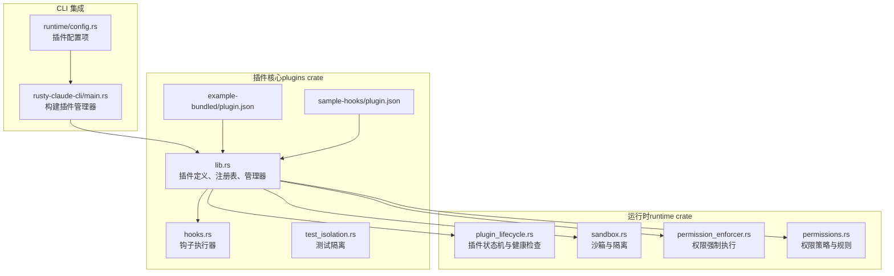
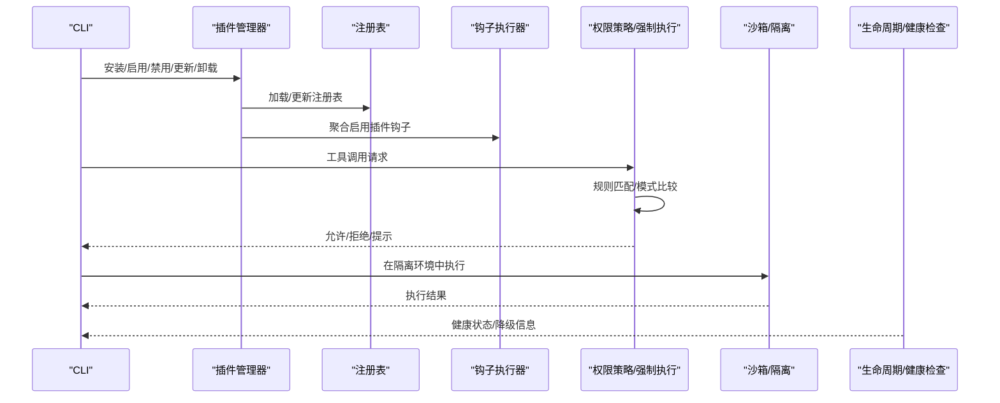
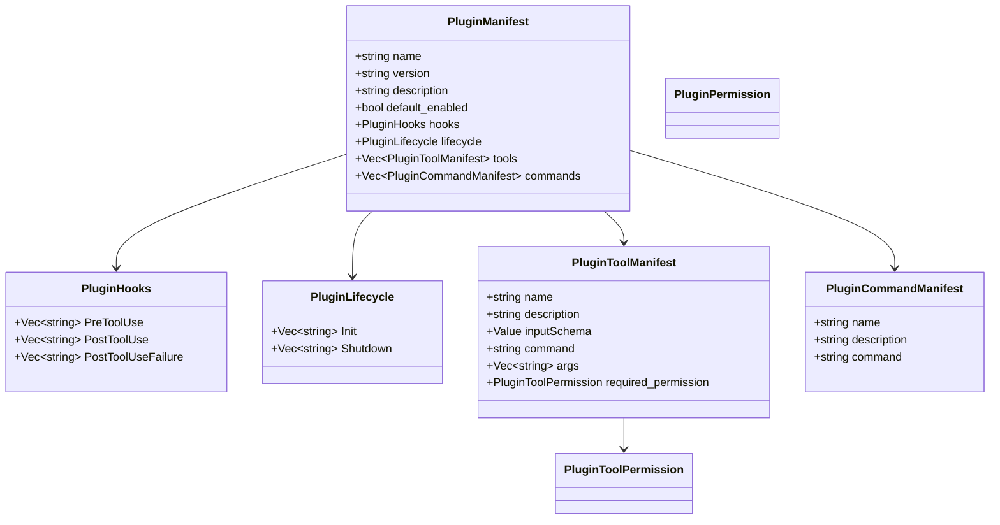
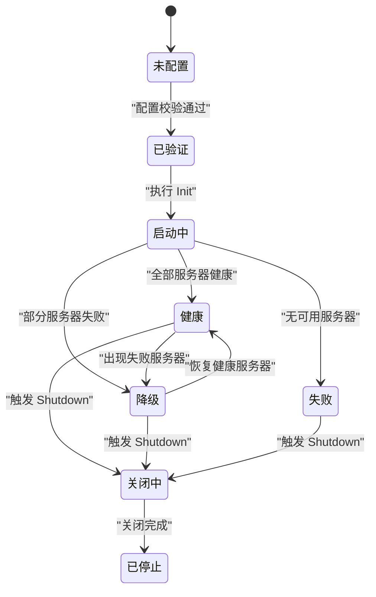
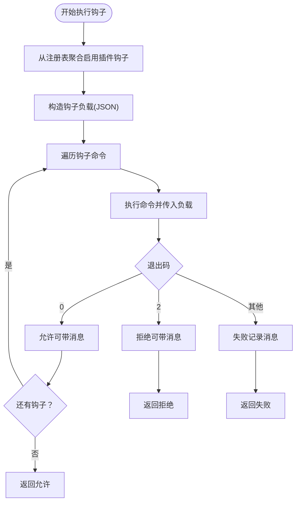
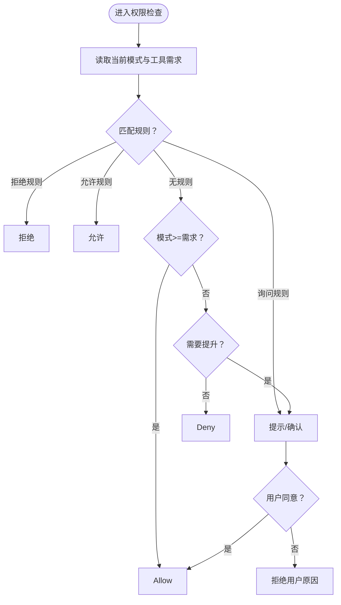
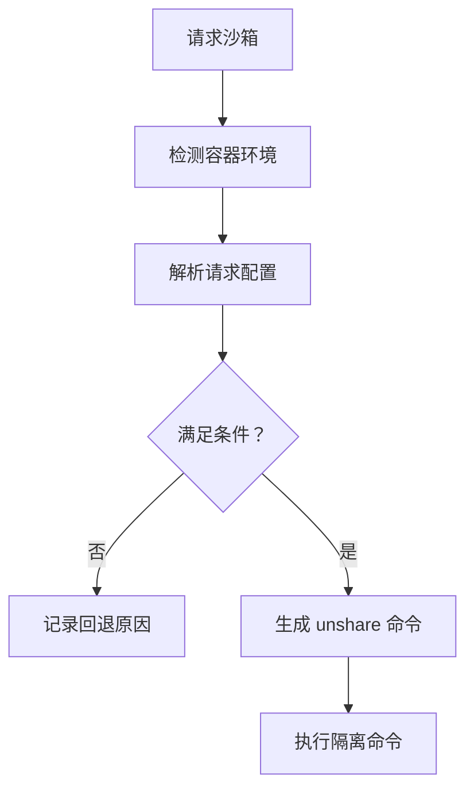
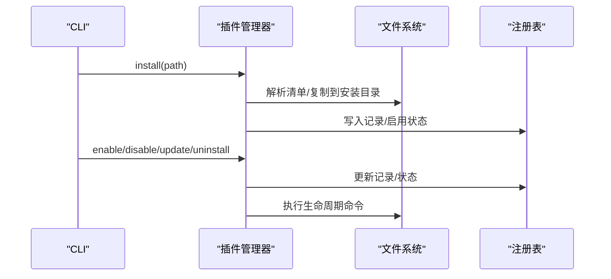
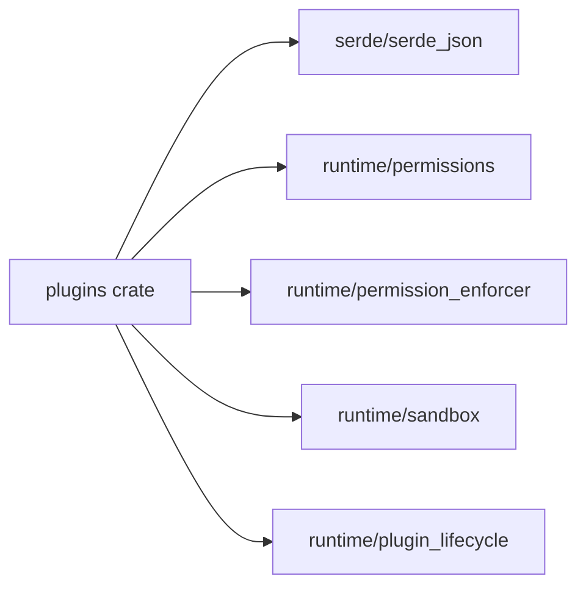

# 插件系统

<cite>
**本文档引用的文件**
- [rust\crates\plugins\src\lib.rs](file://rust\crates\plugins\src\lib.rs)
- [rust\crates\plugins\src\hooks.rs](file://rust\crates\plugins\src\hooks.rs)
- [rust\crates\plugins\src\test_isolation.rs](file://rust\crates\plugins\src\test_isolation.rs)
- [rust\crates\plugins\Cargo.toml](file://rust\crates\plugins\Cargo.toml)
- [rust\crates\plugins\bundled\example-bundled\.claude-plugin\plugin.json](file://rust\crates\plugins\bundled\example-bundled\.claude-plugin\plugin.json)
- [rust\crates\plugins\bundled\sample-hooks\.claude-plugin\plugin.json](file://rust\crates\plugins\bundled\sample-hooks\.claude-plugin\plugin.json)
- [rust\crates\runtime\src\plugin_lifecycle.rs](file://rust\crates\runtime\src\plugin_lifecycle.rs)
- [rust\crates\runtime\src\sandbox.rs](file://rust\crates\runtime\src\sandbox.rs)
- [rust\crates\runtime\src\permission_enforcer.rs](file://rust\crates\runtime\src\permission_enforcer.rs)
- [rust\crates\runtime\src\permissions.rs](file://rust\crates\runtime\src\permissions.rs)
- [rust\crates\rusty-claude-cli\src\main.rs](file://rust\crates\rusty-claude-cli\src\main.rs)
- [rust\crates\runtime\src\config.rs](file://rust\crates\runtime\src\config.rs)
</cite>

## 目录
1. [引言](#引言)
2. [项目结构](#项目结构)
3. [核心组件](#核心组件)
4. [架构总览](#架构总览)
5. [详细组件分析](#详细组件分析)
6. [依赖关系分析](#依赖关系分析)
7. [性能考量](#性能考量)
8. [故障排查指南](#故障排查指南)
9. [结论](#结论)
10. [附录](#附录)

## 引言
本文件系统化阐述插件系统的架构设计、生命周期管理与钩子（Hook）机制，覆盖插件的安装、配置、启用/禁用、更新与卸载流程；提供插件开发指南、API 接口与最佳实践；解释权限控制、沙箱隔离与安全考虑；并说明内置插件示例、钩子函数使用与插件间通信机制，以及插件市场、版本管理与兼容性保障的实现细节。

## 项目结构
插件系统由 Rust Crate 组成，核心位于 plugins crate，运行时能力在 runtime crate 中实现，并通过 CLI 进行集成与配置。

**图表来源**
- [rust\crates\plugins\src\lib.rs](file://rust\crates\plugins\src\lib.rs)
- [rust\crates\plugins\src\hooks.rs](file://rust\crates\plugins\src\hooks.rs)
- [rust\crates\plugins\src\test_isolation.rs](file://rust\crates\plugins\src\test_isolation.rs)
- [rust\crates\plugins\bundled\example-bundled\.claude-plugin\plugin.json](file://rust\crates\plugins\bundled\example-bundled\.claude-plugin\plugin.json)
- [rust\crates\plugins\bundled\sample-hooks\.claude-plugin\plugin.json](file://rust\crates\plugins\bundled\sample-hooks\.claude-plugin\plugin.json)
- [rust\crates\runtime\src\plugin_lifecycle.rs](file://rust\crates\runtime\src\plugin_lifecycle.rs)
- [rust\crates\runtime\src\sandbox.rs](file://rust\crates\runtime\src\sandbox.rs)
- [rust\crates\runtime\src\permission_enforcer.rs](file://rust\crates\runtime\src\permission_enforcer.rs)
- [rust\crates\runtime\src\permissions.rs](file://rust\crates\runtime\src\permissions.rs)
- [rust\crates\rusty-claude-cli\src\main.rs](file://rust\crates\rusty-claude-cli\src\main.rs)
- [rust\crates\runtime\src\config.rs](file://rust\crates\runtime\src\config.rs)

**章节来源**
- [rust\crates\plugins\src\lib.rs](file://rust\crates\plugins\src\lib.rs)
- [rust\crates\plugins\src\hooks.rs](file://rust\crates\plugins\src\hooks.rs)
- [rust\crates\plugins\src\test_isolation.rs](file://rust\crates\plugins\src\test_isolation.rs)
- [rust\crates\plugins\Cargo.toml](file://rust\crates\plugins\Cargo.toml)
- [rust\crates\plugins\bundled\example-bundled\.claude-plugin\plugin.json](file://rust\crates\plugins\bundled\example-bundled\.claude-plugin\plugin.json)
- [rust\crates\plugins\bundled\sample-hooks\.claude-plugin\plugin.json](file://rust\crates\plugins\bundled\sample-hooks\.claude-plugin\plugin.json)
- [rust\crates\runtime\src\plugin_lifecycle.rs](file://rust\crates\runtime\src\plugin_lifecycle.rs)
- [rust\crates\runtime\src\sandbox.rs](file://rust\crates\runtime\src\sandbox.rs)
- [rust\crates\runtime\src\permission_enforcer.rs](file://rust\crates\runtime\src\permission_enforcer.rs)
- [rust\crates\runtime\src\permissions.rs](file://rust\crates\runtime\src\permissions.rs)
- [rust\crates\rusty-claude-cli\src\main.rs](file://rust\crates\rusty-claude-cli\src\main.rs)
- [rust\crates\runtime\src\config.rs](file://rust\crates\runtime\src\config.rs)

## 核心组件
- 插件元数据与清单：定义插件名称、版本、描述、默认启用状态、权限、钩子、生命周期命令、工具等。
- 插件类型：内置（Builtin）、打包（Bundled）、外部（External），分别对应不同的加载与校验策略。
- 注册表与管理器：负责发现、加载、验证、初始化、聚合钩子、工具与生命周期事件。
- 钩子系统：支持 PreToolUse、PostToolUse、PostToolUseFailure 三类事件，按插件启用状态聚合执行。
- 权限策略与强制执行：基于模式（只读、工作区写、危险全权、提示、允许）与规则（允许/拒绝/询问）进行授权决策。
- 沙箱与隔离：在 Linux 上通过 unshare 提供用户命名空间、网络、PID/IPC/UTS 等隔离，支持文件系统模式与挂载白名单。
- 生命周期与健康检查：抽象出配置校验、启动健康、降级、失败、关闭等状态机，支持降级模式下的可用/不可用工具集合。
- CLI 集成：从运行时配置解析插件设置，构建插件管理器并执行安装/启用/禁用/更新/卸载等操作。

**章节来源**
- [rust\crates\plugins\src\lib.rs](file://rust\crates\plugins\src\lib.rs)
- [rust\crates\plugins\src\hooks.rs](file://rust\crates\plugins\src\hooks.rs)
- [rust\crates\runtime\src\permissions.rs](file://rust\crates\runtime\src\permissions.rs)
- [rust\crates\runtime\src\permission_enforcer.rs](file://rust\crates\runtime\src\permission_enforcer.rs)
- [rust\crates\runtime\src\sandbox.rs](file://rust\crates\runtime\src\sandbox.rs)
- [rust\crates\runtime\src\plugin_lifecycle.rs](file://rust\crates\runtime\src\plugin_lifecycle.rs)
- [rust\crates\rusty-claude-cli\src\main.rs](file://rust\crates\rusty-claude-cli\src\main.rs)
- [rust\crates\runtime\src\config.rs](file://rust\crates\runtime\src\config.rs)

## 架构总览
插件系统采用“清单驱动 + 清单解析 + 聚合执行”的架构。插件清单（plugin.json）描述钩子、生命周期命令、工具与权限；管理器根据配置扫描目录、加载清单、构建插件对象；运行时通过钩子执行器聚合所有启用插件的钩子脚本；权限层在工具执行前进行策略评估；沙箱与生命周期模块提供隔离与状态治理。

**图表来源**
- [rust\crates\plugins\src\lib.rs](file://rust\crates\plugins\src\lib.rs)
- [rust\crates\plugins\src\hooks.rs](file://rust\crates\plugins\src\hooks.rs)
- [rust\crates\runtime\src\permissions.rs](file://rust\crates\runtime\src\permissions.rs)
- [rust\crates\runtime\src\permission_enforcer.rs](file://rust\crates\runtime\src\permission_enforcer.rs)
- [rust\crates\runtime\src\sandbox.rs](file://rust\crates\runtime\src\sandbox.rs)
- [rust\crates\runtime\src\plugin_lifecycle.rs](file://rust\crates\runtime\src\plugin_lifecycle.rs)

## 详细组件分析

### 插件清单与元数据模型
- 清单字段：name、version、description、defaultEnabled、permissions、hooks、lifecycle、tools、commands。
- 权限枚举：read、write、execute；工具权限：只读、工作区写、危险全权。
- 钩子与生命周期：以字符串数组形式指定脚本路径或命令，支持相对路径与可执行脚本。
- 工具定义：包含名称、输入模式、命令与参数、所需权限等。

**图表来源**
- [rust\crates\plugins\src\lib.rs](file://rust\crates\plugins\src\lib.rs)

**章节来源**
- [rust\crates\plugins\src\lib.rs](file://rust\crates\plugins\src\lib.rs)
- [rust\crates\plugins\bundled\example-bundled\.claude-plugin\plugin.json](file://rust\crates\plugins\bundled\example-bundled\.claude-plugin\plugin.json)
- [rust\crates\plugins\bundled\sample-hooks\.claude-plugin\plugin.json](file://rust\crates\plugins\bundled\sample-hooks\.claude-plugin\plugin.json)

### 插件类型与生命周期
- 类型：Builtin、Bundled、External；Builtin 不需要外部文件系统校验，Bundled/External 需要校验钩子、生命周期与工具脚本路径。
- 生命周期：Init、Shutdown；在注册表初始化与关闭阶段按启用顺序执行。
- 状态机：Unconfigured → Validated → Starting → Healthy；或 Degraded/Faulted；支持健康检查与降级模式。

**图表来源**
- [rust\crates\runtime\src\plugin_lifecycle.rs](file://rust\crates\runtime\src\plugin_lifecycle.rs)

**章节来源**
- [rust\crates\plugins\src\lib.rs](file://rust\crates\plugins\src\lib.rs)
- [rust\crates\runtime\src\plugin_lifecycle.rs](file://rust\crates\runtime\src\plugin_lifecycle.rs)

### 钩子系统与执行流程
- 事件：PreToolUse、PostToolUse、PostToolUseFailure。
- 执行器：从注册表聚合启用插件的钩子命令，按顺序执行；支持环境变量注入（事件名、工具名、输入、输出/错误、是否错误）。
- 结果：允许、拒绝、失败；拒绝优先于失败；失败会收集警告消息但不中断后续钩子。

**图表来源**
- [rust\crates\plugins\src\hooks.rs](file://rust\crates\plugins\src\hooks.rs)

**章节来源**
- [rust\crates\plugins\src\hooks.rs](file://rust\crates\plugins\src\hooks.rs)

### 权限控制与强制执行
- 权限模式：只读、工作区写、危险全权、提示、允许。
- 策略：静态规则（允许/拒绝/询问）+ 工具特定需求 + 钩子上下文覆盖（允许/拒绝/要求确认）。
- 强制执行：在工具执行前评估，必要时交互确认；对文件写入与 bash 命令有专门检查逻辑。

**图表来源**
- [rust\crates\runtime\src\permissions.rs](file://rust\crates\runtime\src\permissions.rs)
- [rust\crates\runtime\src\permission_enforcer.rs](file://rust\crates\runtime\src\permission_enforcer.rs)

**章节来源**
- [rust\crates\runtime\src\permissions.rs](file://rust\crates\runtime\src\permissions.rs)
- [rust\crates\runtime\src\permission_enforcer.rs](file://rust\crates\runtime\src\permission_enforcer.rs)

### 沙箱与隔离
- 支持：用户命名空间隔离、网络隔离、PID/IPC/UTS 隔离；文件系统模式（关闭、仅工作区、白名单）。
- Linux 启动器：通过 unshare 构建命令，设置 HOME/TMPDIR 与隔离标志；支持可选网络隔离。
- 环境检测：基于 /proc/1/cgroup、容器标记文件与环境变量判断容器环境。

**图表来源**
- [rust\crates\runtime\src\sandbox.rs](file://rust\crates\runtime\src\sandbox.rs)

**章节来源**
- [rust\crates\runtime\src\sandbox.rs](file://rust\crates\runtime\src\sandbox.rs)

### 插件管理器与安装流程
- 配置来源：CLI 从运行时配置解析插件设置（启用列表、外部目录、安装根、注册表路径、内置根）。
- 发现与加载：扫描内置/打包/外部目录，解析清单，构建插件定义，写入注册表。
- 安装/启用/禁用/更新/卸载：管理器提供原子操作，维护注册表与启用状态文件。

**图表来源**
- [rust\crates\rusty-claude-cli\src\main.rs](file://rust\crates\rusty-claude-cli\src\main.rs)
- [rust\crates\plugins\src\lib.rs](file://rust\crates\plugins\src\lib.rs)
- [rust\crates\runtime\src\config.rs](file://rust\crates\runtime\src\config.rs)

**章节来源**
- [rust\crates\rusty-claude-cli\src\main.rs](file://rust\crates\rusty-claude-cli\src\main.rs)
- [rust\crates\plugins\src\lib.rs](file://rust\crates\plugins\src\lib.rs)
- [rust\crates\runtime\src\config.rs](file://rust\crates\runtime\src\config.rs)

### 插件间通信机制
- 钩子作为主要通信通道：通过标准输入传递 JSON 负载，通过环境变量传递上下文；钩子可读取输入并决定允许/拒绝/失败。
- 工具执行：插件工具以进程方式执行，注入插件 ID/名称、工具名称、输入等环境变量，便于跨插件协作与审计。

**章节来源**
- [rust\crates\plugins\src\hooks.rs](file://rust\crates\plugins\src\hooks.rs)
- [rust\crates\plugins\src\lib.rs](file://rust\crates\plugins\src\lib.rs)

### 插件开发指南与最佳实践
- 清单编写：确保 hooks/lifecycle/tools 字段完整且可执行；为工具声明最小权限。
- 钩子脚本：遵循退出码约定（0=允许、2=拒绝、其他=失败）；避免阻塞 stdin；处理 EPIPE 场景。
- 生命周期：Init/Shutdown 用于资源准备/清理；避免长时间阻塞。
- 安全：尽量使用只读或工作区写权限；避免危险全权；在提示模式下谨慎放行高风险工具。
- 测试：使用测试隔离工具模拟独立环境，避免污染全局状态。

**章节来源**
- [rust\crates\plugins\src\hooks.rs](file://rust\crates\plugins\src\hooks.rs)
- [rust\crates\plugins\src\test_isolation.rs](file://rust\crates\plugins\src\test_isolation.rs)
- [rust\crates\plugins\src\lib.rs](file://rust\crates\plugins\src\lib.rs)

## 依赖关系分析
- 插件核心依赖 serde/serde_json 进行清单序列化与反序列化。
- 运行时模块相互协作：权限策略与强制执行依赖权限模式与规则；沙箱与生命周期共同保障执行安全与稳定性。

**图表来源**
- [rust\crates\plugins\Cargo.toml](file://rust\crates\plugins\Cargo.toml)
- [rust\crates\plugins\src\lib.rs](file://rust\crates\plugins\src\lib.rs)
- [rust\crates\runtime\src\permissions.rs](file://rust\crates\runtime\src\permissions.rs)
- [rust\crates\runtime\src\permission_enforcer.rs](file://rust\crates\runtime\src\permission_enforcer.rs)
- [rust\crates\runtime\src\sandbox.rs](file://rust\crates\runtime\src\sandbox.rs)
- [rust\crates\runtime\src\plugin_lifecycle.rs](file://rust\crates\runtime\src\plugin_lifecycle.rs)

**章节来源**
- [rust\crates\plugins\Cargo.toml](file://rust\crates\plugins\Cargo.toml)
- [rust\crates\plugins\src\lib.rs](file://rust\crates\plugins\src\lib.rs)
- [rust\crates\runtime\src\permissions.rs](file://rust\crates\runtime\src\permissions.rs)
- [rust\crates\runtime\src\permission_enforcer.rs](file://rust\crates\runtime\src\permission_enforcer.rs)
- [rust\crates\runtime\src\sandbox.rs](file://rust\crates\runtime\src\sandbox.rs)
- [rust\crates\runtime\src\plugin_lifecycle.rs](file://rust\crates\runtime\src\plugin_lifecycle.rs)

## 性能考量
- 并行安装：支持多线程并行安装多个插件，减少等待时间。
- 聚合钩子：按启用状态聚合，避免对禁用插件的开销。
- 生命周期命令：仅在必要时执行，避免重复初始化。
- 沙箱启动：unshare 启动成本较高，建议按需启用网络隔离与命名空间隔离。

[本节为通用指导，无需具体文件分析]

## 故障排查指南
- 钩子失败：检查退出码与 stderr/stdout 输出；确认脚本可执行与路径正确；关注 BrokenPipe 场景。
- 权限拒绝：核对工具需求模式与当前模式；查看规则匹配与钩子覆盖；在提示模式下确认交互。
- 沙箱不可用：检查 unshare 可用性与容器限制；查看回退原因；调整文件系统模式与挂载白名单。
- 生命周期异常：确认 Init/Shutdown 命令成功；检查注册表记录与启用状态文件。

**章节来源**
- [rust\crates\plugins\src\hooks.rs](file://rust\crates\plugins\src\hooks.rs)
- [rust\crates\runtime\src\permission_enforcer.rs](file://rust\crates\runtime\src\permission_enforcer.rs)
- [rust\crates\runtime\src\sandbox.rs](file://rust\crates\runtime\src\sandbox.rs)
- [rust\crates\plugins\src\lib.rs](file://rust\crates\plugins\src\lib.rs)

## 结论
该插件系统以清单为中心，结合钩子、权限、沙箱与生命周期管理，提供了可扩展、可审计、可隔离的插件生态。通过清晰的 API 与严格的权限控制，既能满足开发者灵活扩展的需求，又能保障运行时的安全与稳定。

[本节为总结，无需具体文件分析]

## 附录
- 内置插件示例：example-bundled 与 sample-hooks 展示了基本钩子结构与清单格式。
- 版本管理与兼容性：注册表记录版本与安装/更新时间戳，支持同步与升级；清单字段变更通过校验与错误收集保障兼容性。
- 插件市场：通过外部目录与安装根实现“外部市场”；内置根用于打包内置插件；注册表统一管理。

**章节来源**
- [rust\crates\plugins\bundled\example-bundled\.claude-plugin\plugin.json](file://rust\crates\plugins\bundled\example-bundled\.claude-plugin\plugin.json)
- [rust\crates\plugins\bundled\sample-hooks\.claude-plugin\plugin.json](file://rust\crates\plugins\bundled\sample-hooks\.claude-plugin\plugin.json)
- [rust\crates\plugins\src\lib.rs](file://rust\crates\plugins\src\lib.rs)
- [rust\crates\runtime\src\config.rs](file://rust\crates\runtime\src\config.rs)