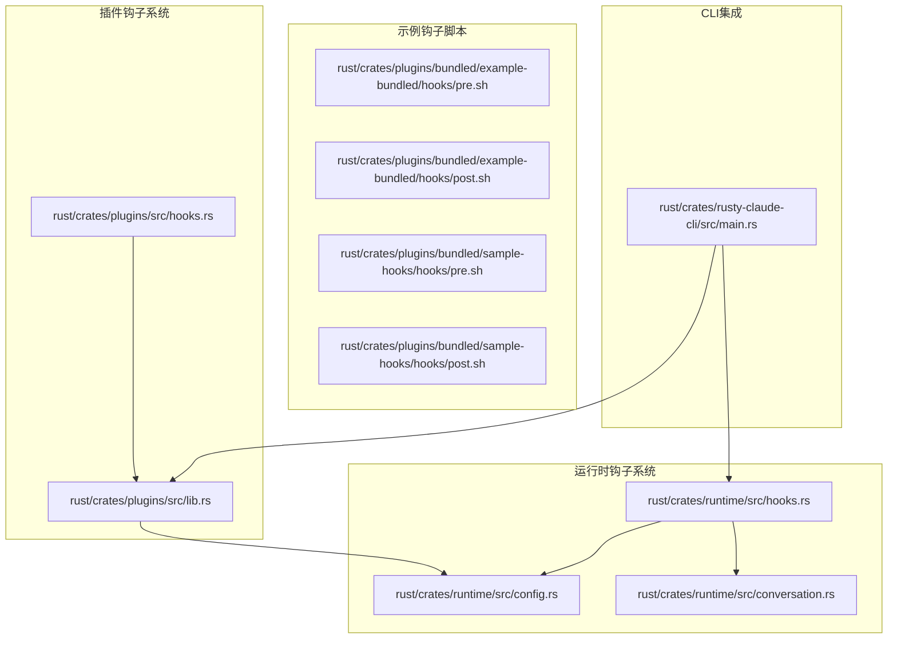
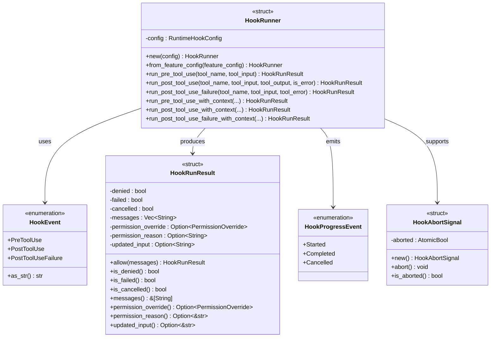
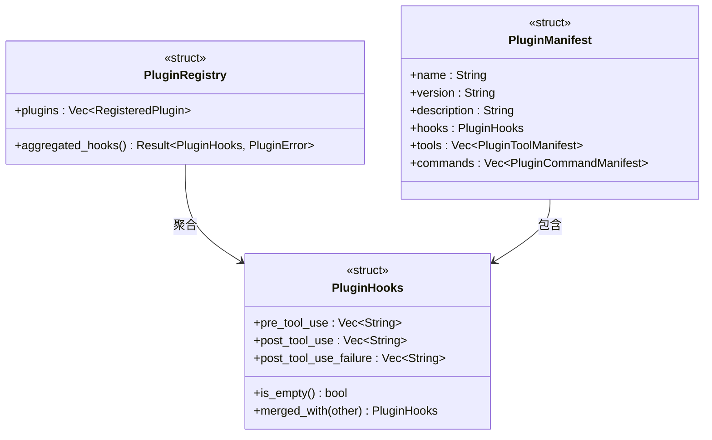
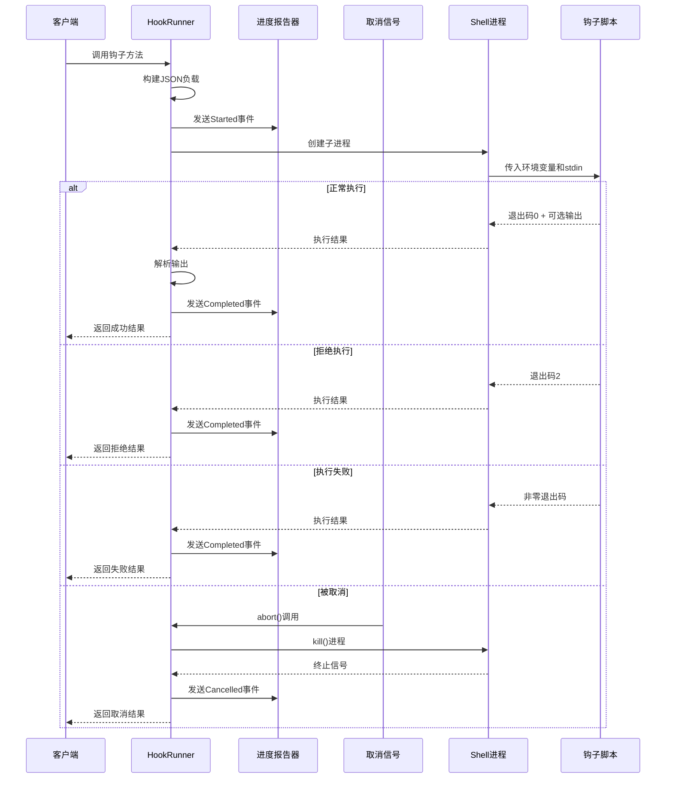
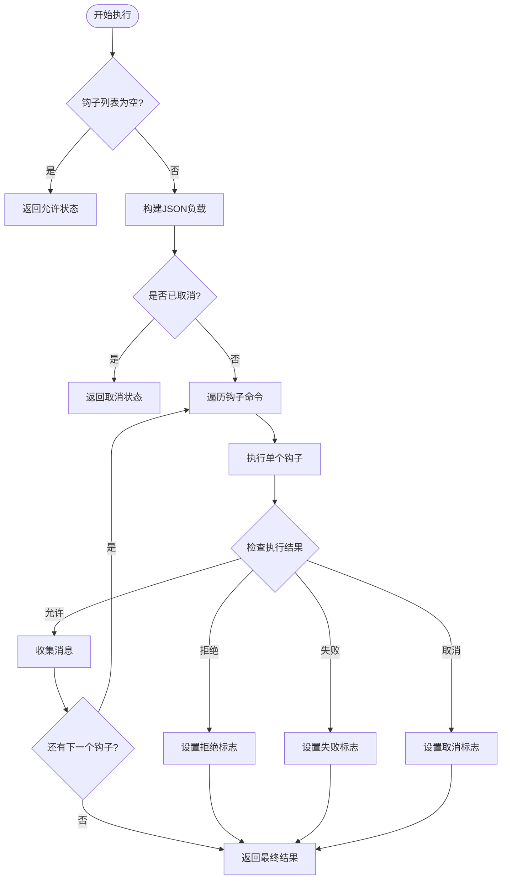
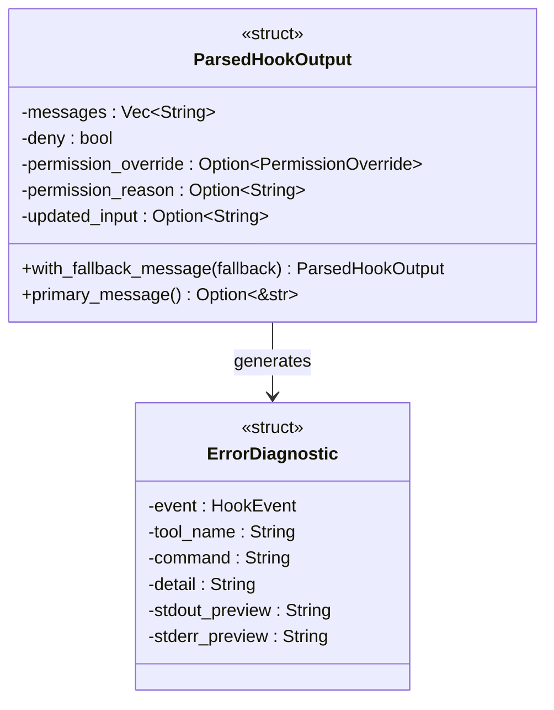
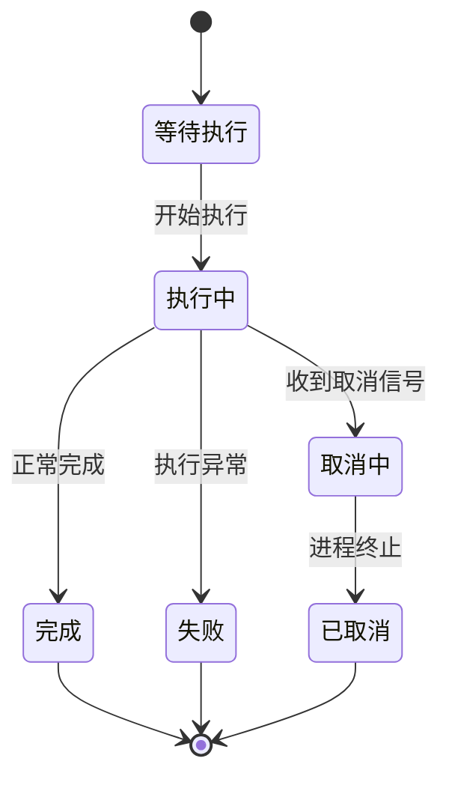
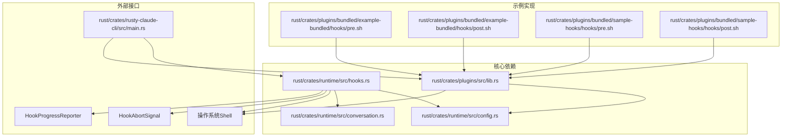
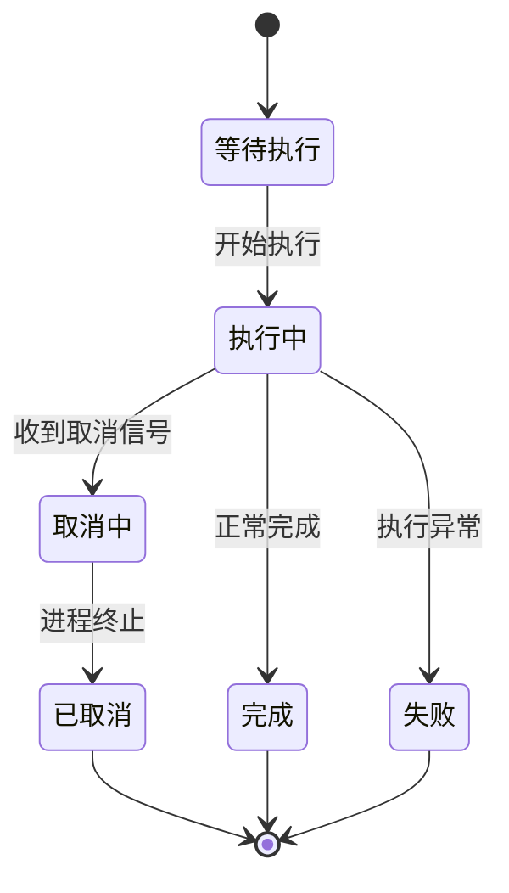

# 钩子系统

<cite>
**本文档引用的文件**
- [hooks.rs](file://rust/crates/runtime/src/hooks.rs)
- [hooks.rs](file://rust/crates/plugins/src/hooks.rs)
- [lib.rs](file://rust/crates/plugins/src/lib.rs)
- [config.rs](file://rust/crates/runtime/src/config.rs)
- [pre.sh](file://rust/crates/plugins/bundled/example-bundled/hooks/pre.sh)
- [post.sh](file://rust/crates/plugins/bundled/example-bundled/hooks/post.sh)
- [pre.sh](file://rust/crates/plugins/bundled/sample-hooks/hooks/pre.sh)
- [post.sh](file://rust/crates/plugins/bundled/sample-hooks/hooks/post.sh)
- [main.rs](file://rust/crates/rusty-claude-cli/src/main.rs)
- [conversation.rs](file://rust/crates/runtime/src/conversation.rs)
</cite>

## 更新摘要
**变更内容**
- 增强钩子输出解析机制，支持更详细的错误诊断信息
- 新增钩子输出预览功能，提供截断的输出内容展示
- 改进错误诊断信息格式，包含阶段、工具、命令等详细信息
- 提供更详细的钩子执行状态报告和进度监控
- 增强钩子取消信号处理和并发控制
- 基于新的插件基础设施，添加PreToolUse和PostToolUse钩子配置支持

## 目录
1. [简介](#简介)
2. [项目结构](#项目结构)
3. [核心组件](#核心组件)
4. [架构概览](#架构概览)
5. [详细组件分析](#详细组件分析)
6. [依赖关系分析](#依赖关系分析)
7. [性能考虑](#性能考虑)
8. [故障排除指南](#故障排除指南)
9. [结论](#结论)
10. [附录](#附录)

## 简介

钩子系统是 CLAW 运行时的核心扩展机制，允许在工具执行的关键节点插入自定义逻辑。该系统提供了三个主要的钩子类型：预工具使用钩子（PreToolUse）、后工具使用钩子（PostToolUse）和后工具使用失败钩子（PostToolUseFailure）。每个钩子类型都有其特定的触发时机和用途。

钩子系统的设计目标是在不修改核心代码的情况下，为用户提供强大的扩展能力。通过钩子，用户可以实现审计日志、安全检查、数据转换、通知等功能，而无需深入了解 CLAW 的内部实现细节。

**更新** 基于新的插件基础设施，系统现在支持通过插件配置 PreToolUse 和 PostToolUse 钩子，增强了钩子系统的灵活性和可扩展性。

## 项目结构

钩子系统主要分布在以下模块中：



**图表来源**
- [hooks.rs:1-100](file://rust/crates/runtime/src/hooks.rs#L1-L100)
- [hooks.rs:1-50](file://rust/crates/plugins/src/hooks.rs#L1-L50)
- [lib.rs:1-50](file://rust/crates/plugins/src/lib.rs#L1-L50)

**章节来源**
- [hooks.rs:1-100](file://rust/crates/runtime/src/hooks.rs#L1-L100)
- [hooks.rs:1-50](file://rust/crates/plugins/src/hooks.rs#L1-L50)
- [lib.rs:1-50](file://rust/crates/plugins/src/lib.rs#L1-L50)

## 核心组件

### 钩子事件类型

钩子系统定义了三种核心事件类型：



**图表来源**
- [hooks.rs:18-149](file://rust/crates/runtime/src/hooks.rs#L18-L149)
- [hooks.rs:151-308](file://rust/crates/runtime/src/hooks.rs#L151-L308)
- [hooks.rs:39-81](file://rust/crates/runtime/src/hooks.rs#L39-L81)

### 钩子配置系统

钩子配置通过 `RuntimeHookConfig` 结构管理：

| 配置项 | 类型 | 描述 |
|--------|------|------|
| pre_tool_use | Vec<String> | 预工具使用钩子命令列表 |
| post_tool_use | Vec<String> | 后工具使用钩子命令列表 |
| post_tool_use_failure | Vec<String> | 失败钩子命令列表 |

**更新** 基于新的插件基础设施，系统现在支持通过插件配置 PreToolUse 和 PostToolUse 钩子：



**图表来源**
- [hooks.rs:68-99](file://rust/crates/plugins/src/hooks.rs#L68-L99)
- [lib.rs:116-132](file://rust/crates/plugins/src/lib.rs#L116-L132)
- [lib.rs:795-800](file://rust/crates/plugins/src/lib.rs#L795-L800)

**章节来源**
- [hooks.rs:79-85](file://rust/crates/runtime/src/hooks.rs#L79-L85)
- [config.rs:567-611](file://rust/crates/runtime/src/config.rs#L567-L611)
- [hooks.rs:68-99](file://rust/crates/plugins/src/hooks.rs#L68-L99)
- [lib.rs:116-132](file://rust/crates/plugins/src/lib.rs#L116-L132)

## 架构概览

钩子系统采用分层架构设计，确保了良好的可扩展性和安全性：



**图表来源**
- [hooks.rs:310-411](file://rust/crates/runtime/src/hooks.rs#L310-L411)
- [hooks.rs:413-491](file://rust/crates/runtime/src/hooks.rs#L413-L491)
- [hooks.rs:799-811](file://rust/crates/runtime/src/hooks.rs#L799-L811)

## 详细组件分析

### 运行时钩子执行器

运行时钩子执行器提供了完整的钩子生命周期管理：

#### 钩子执行流程



**图表来源**
- [hooks.rs:310-411](file://rust/crates/runtime/src/hooks.rs#L310-L411)

#### 钩子输出解析

钩子脚本可以输出 JSON 格式的结构化数据：

| 字段名 | 类型 | 必需 | 描述 |
|--------|------|------|------|
| systemMessage | String | 否 | 系统消息，用于向用户显示 |
| reason | String | 否 | 决策原因说明 |
| continue | Boolean | 否 | 控制继续执行的布尔值 |
| decision | String | 否 | 决策类型（如"block"） |
| hookSpecificOutput | Object | 否 | 钩子特定输出对象 |

**更新** 增强了错误诊断信息格式，包含详细的阶段、工具、命令和预览信息：



**图表来源**
- [hooks.rs:503-536](file://rust/crates/runtime/src/hooks.rs#L503-L536)
- [hooks.rs:663-684](file://rust/crates/runtime/src/hooks.rs#L663-L684)

**章节来源**
- [hooks.rs:535-589](file://rust/crates/runtime/src/hooks.rs#L535-L589)

### 插件钩子系统

插件钩子系统提供了基于插件的钩子扩展机制：

#### 插件钩子配置

**更新** 新增了基于插件基础设施的钩子配置支持：

插件钩子配置通过 `PluginHooks` 结构管理，支持 PreToolUse 和 PostToolUse 钩子：


**章节来源**
- [hooks.rs:68-99](file://rust/crates/plugins/src/hooks.rs#L68-L99)
- [lib.rs:116-132](file://rust/crates/plugins/src/lib.rs#L116-L132)

### 钩子环境变量

钩子脚本执行时会接收到以下环境变量：

| 环境变量名 | 类型 | 值描述 |
|------------|------|--------|
| HOOK_EVENT | String | 钩子事件类型（PreToolUse/PostToolUse/PostToolUseFailure） |
| HOOK_TOOL_NAME | String | 工具名称 |
| HOOK_TOOL_INPUT | String | 工具输入的JSON字符串 |
| HOOK_TOOL_IS_ERROR | String | 是否为错误状态（"1"或"0"） |
| HOOK_TOOL_OUTPUT | String | 工具输出或错误信息（仅在适用场景） |

**更新** 新增了钩子输出预览功能，限制字符数量以防止输出过大：

**章节来源**
- [hooks.rs:428-434](file://rust/crates/runtime/src/hooks.rs#L428-L434)
- [hooks.rs:190-196](file://rust/crates/plugins/src/hooks.rs#L190-L196)

### 进度报告和状态监控

**新增** 钩子系统现在支持详细的进度报告和状态监控：



**图表来源**
- [hooks.rs:39-56](file://rust/crates/runtime/src/hooks.rs#L39-L56)
- [hooks.rs:63-81](file://rust/crates/runtime/src/hooks.rs#L63-L81)

**章节来源**
- [hooks.rs:39-81](file://rust/crates/runtime/src/hooks.rs#L39-L81)

## 依赖关系分析

钩子系统与其他组件的依赖关系如下：



**图表来源**
- [main.rs:6119-6148](file://rust/crates/rusty-claude-cli/src/main.rs#L6119-L6148)
- [lib.rs:795-800](file://rust/crates/plugins/src/lib.rs#L795-L800)
- [conversation.rs:210-294](file://rust/crates/runtime/src/conversation.rs#L210-L294)

**章节来源**
- [main.rs:6119-6148](file://rust/crates/rusty-claude-cli/src/main.rs#L6119-L6148)
- [lib.rs:795-800](file://rust/crates/plugins/src/lib.rs#L795-L800)

## 性能考虑

### 并发控制

钩子系统支持取消信号机制，允许在长时间运行的钩子中进行中断：



**图表来源**
- [hooks.rs:695-707](file://rust/crates/runtime/src/hooks.rs#L695-L707)

### 性能优化建议

1. **异步执行**：对于耗时的钩子操作，考虑使用异步模式
2. **缓存机制**：对重复的钩子操作结果进行缓存
3. **批量处理**：合并多个钩子调用以减少进程启动开销
4. **超时控制**：为钩子执行设置合理的超时时间
5. **输出预览**：利用预览功能限制输出大小，提高性能

**更新** 新增了输出预览功能，限制字符数量以提高性能和安全性。

## 故障排除指南

### 常见问题及解决方案

| 问题类型 | 症状 | 可能原因 | 解决方案 |
|----------|------|----------|----------|
| 钩子拒绝 | 返回拒绝状态 | 钩子脚本返回退出码2 | 检查钩子逻辑和权限 |
| 钩子失败 | 返回失败状态 | 钩子脚本返回非零退出码 | 检查钩子脚本错误处理 |
| 执行超时 | 钩子被取消 | 超过最大执行时间 | 优化钩子性能或增加超时 |
| 环境变量缺失 | 钩子无法获取工具信息 | 环境变量未正确设置 | 检查钩子执行环境 |
| JSON解析错误 | 返回详细诊断信息 | 钩子输出不是有效JSON | 检查钩子输出格式 |

**更新** 增强了错误诊断信息，提供更详细的故障排除指导：

**章节来源**
- [hooks.rs:456-471](file://rust/crates/runtime/src/hooks.rs#L456-L471)
- [hooks.rs:206-228](file://rust/crates/plugins/src/hooks.rs#L206-L228)

### 调试技巧

1. **启用详细日志**：检查钩子执行过程中的所有事件
2. **验证JSON输出**：确保钩子脚本输出符合预期格式
3. **测试独立执行**：单独运行钩子脚本验证功能
4. **监控资源使用**：观察钩子执行对系统资源的影响
5. **检查输出预览**：利用预览功能查看截断的输出内容

**更新** 新增了输出预览检查功能，帮助调试钩子输出问题。

### 错误诊断格式

**新增** 钩子系统现在提供标准化的错误诊断格式：

```
hook_invalid_json: phase=PreToolUse tool=Edit command=printf '{not-json
second line' detail=key must be a string stdout_preview={not-json
stderr_preview=stderr warning
```

**章节来源**
- [hooks.rs:663-684](file://rust/crates/runtime/src/hooks.rs#L663-L684)

## 结论

钩子系统为 CLAW 提供了强大而灵活的扩展机制。通过精心设计的架构，它能够在不影响核心功能的前提下，为用户提供丰富的定制能力。系统支持多种钩子类型、完善的错误处理机制、以及灵活的配置选项。

**更新** 最新的增强功能包括：
- 更详细的错误诊断信息和输出预览
- 改进的钩子执行状态报告和进度监控
- 增强的并发控制和取消信号处理
- 基于新的插件基础设施的 PreToolUse 和 PostToolUse 钩子配置支持
- 更好的性能优化和资源管理

未来的发展方向包括：
- 更好的性能监控和优化
- 增强的安全检查机制
- 更丰富的钩子类型和触发条件
- 改进的调试和诊断工具

## 附录

### 钩子脚本示例

#### 预工具使用钩子示例

```bash
#!/bin/sh
# 示例：记录工具调用日志
echo "预工具使用钩子: 工具名称=$HOOK_TOOL_NAME, 输入长度=$(echo -n "$HOOK_TOOL_INPUT" | wc -c)"
```

#### 后工具使用钩子示例

```bash
#!/bin/sh
# 示例：检查工具输出并发送通知
OUTPUT_LENGTH=$(echo -n "$HOOK_TOOL_OUTPUT" | wc -c)
if [ "$OUTPUT_LENGTH" -gt 1000 ]; then
    echo '{"systemMessage":"警告: 输出过大","reason":"输出超过1000字符"}'
fi
```

#### 失败钩子示例

```bash
#!/bin/sh
# 示例：失败时清理临时文件
echo "失败钩子: 工具执行失败，错误信息=$HOOK_TOOL_ERROR"
# 清理临时文件的逻辑
```

**更新** 建议在钩子脚本中：
1. 始终输出有效的JSON格式
2. 使用systemMessage字段提供用户友好的消息
3. 在失败时提供详细的reason说明
4. 利用输出预览功能避免输出过大

### 最佳实践

1. **错误处理**：始终检查钩子脚本的退出码和标准输出
2. **安全性**：避免在钩子中执行不受信任的代码
3. **性能**：保持钩子脚本简洁高效
4. **可维护性**：为钩子脚本添加适当的注释和文档
5. **测试**：为钩子脚本编写单元测试和集成测试
6. **输出控制**：合理控制钩子输出大小，利用预览功能
7. **状态监控**：使用进度报告器监控钩子执行状态
8. **插件配置**：利用新的插件基础设施配置 PreToolUse 和 PostToolUse 钩子

**更新** 新增了输出控制和状态监控的最佳实践，以及基于插件基础设施的钩子配置最佳实践。

**章节来源**
- [pre.sh:1-3](file://rust/crates/plugins/bundled/example-bundled/hooks/pre.sh#L1-L3)
- [post.sh:1-3](file://rust/crates/plugins/bundled/example-bundled/hooks/post.sh#L1-L3)
- [pre.sh:1-3](file://rust/crates/plugins/bundled/sample-hooks/hooks/pre.sh#L1-L3)
- [post.sh:1-3](file://rust/crates/plugins/bundled/sample-hooks/hooks/post.sh#L1-L3)