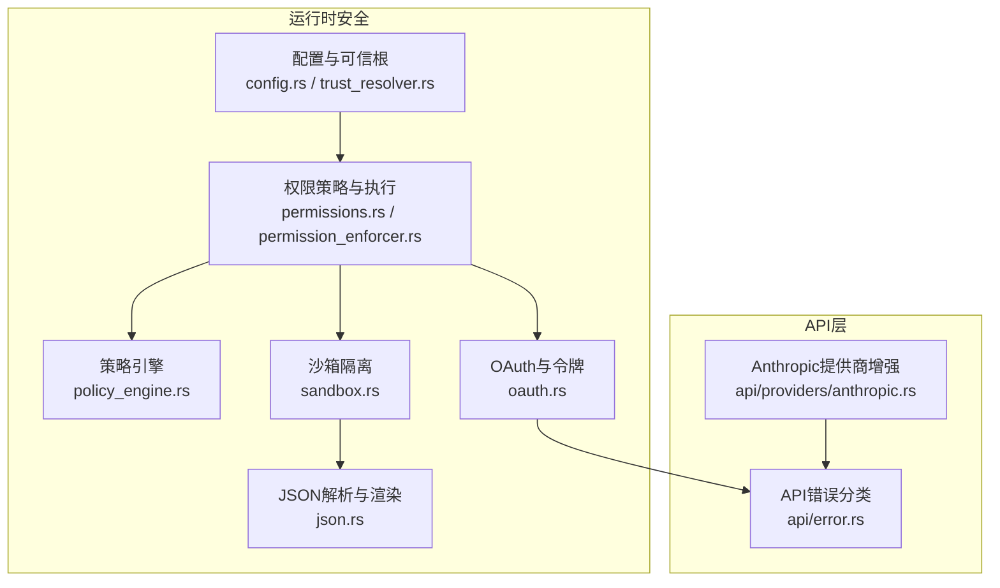
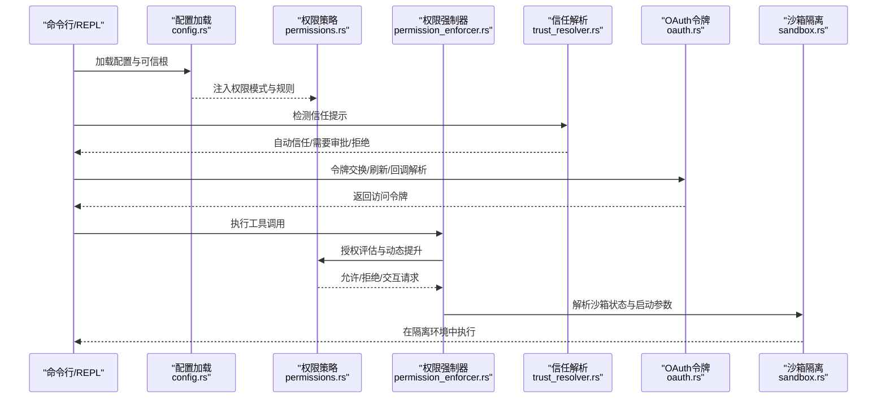
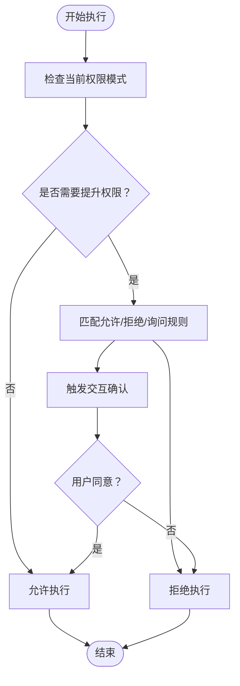
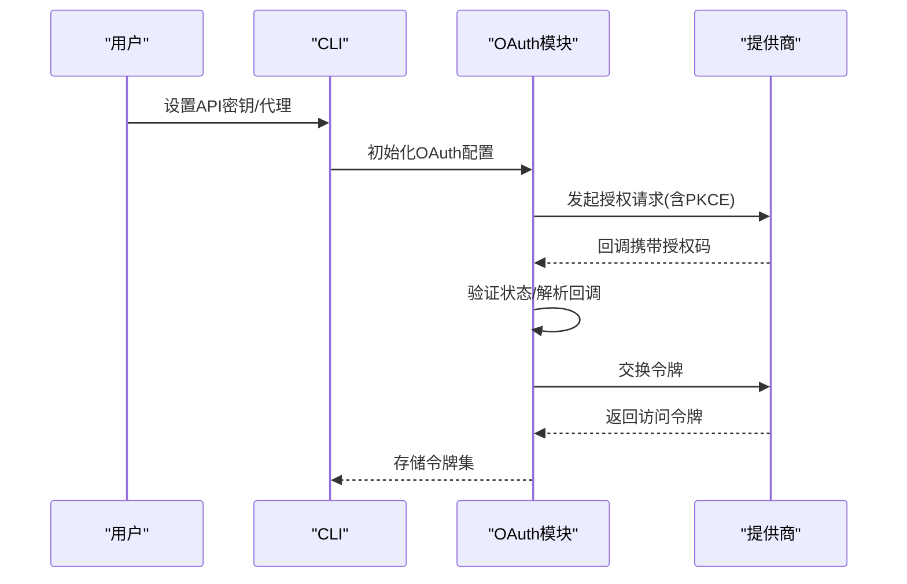
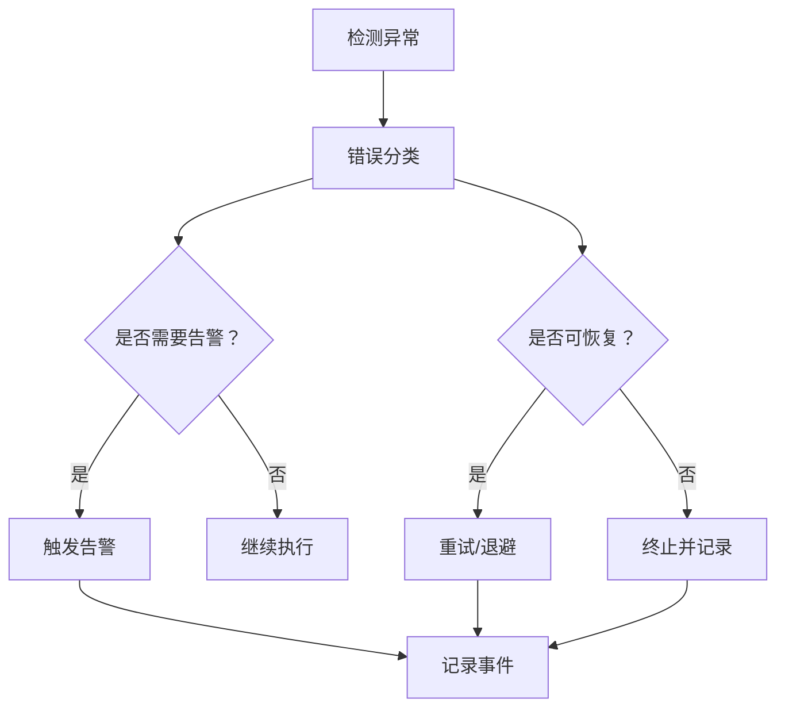
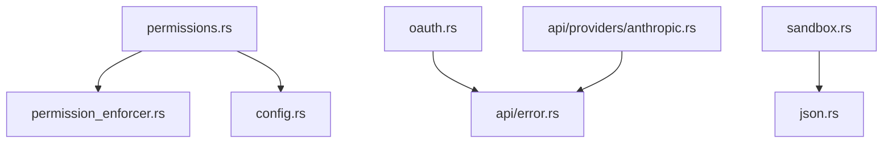

# 安全最佳实践

<cite>
**本文档引用的文件**
- [README.md](file://README.md)
- [rust/README.md](file://rust/README.md)
- [src/permissions.py](file://src/permissions.py)
- [rust/crates/runtime/src/permissions.rs](file://rust/crates/runtime/src/permissions.rs)
- [rust/crates/runtime/src/permission_enforcer.rs](file://rust/crates/runtime/src/permission_enforcer.rs)
- [rust/crates/runtime/src/policy_engine.rs](file://rust/crates/runtime/src/policy_engine.rs)
- [rust/crates/runtime/src/oauth.rs](file://rust/crates/runtime/src/oauth.rs)
- [rust/crates/runtime/src/trust_resolver.rs](file://rust/crates/runtime/src/trust_resolver.rs)
- [rust/crates/runtime/src/sandbox.rs](file://rust/crates/runtime/src/sandbox.rs)
- [rust/crates/runtime/src/config.rs](file://rust/crates/runtime/src/config.rs)
- [rust/crates/runtime/src/json.rs](file://rust/crates/runtime/src/json.rs)
- [rust/crates/api/src/providers/anthropic.rs](file://rust/crates/api/src/providers/anthropic.rs)
- [rust/crates/api/src/error.rs](file://rust/crates/api/src/error.rs)
</cite>

## 目录
1. [简介](#简介)
2. [项目结构](#项目结构)
3. [核心组件](#核心组件)
4. [架构总览](#架构总览)
5. [详细组件分析](#详细组件分析)
6. [依赖关系分析](#依赖关系分析)
7. [性能考虑](#性能考虑)
8. [故障排查指南](#故障排查指南)
9. [结论](#结论)
10. [附录](#附录)

## 简介
本指南聚焦于该代码库中的安全最佳实践，系统性总结权限控制与安全配置方法，涵盖最小权限原则、纵深防御策略与零信任架构的应用；详细说明API密钥管理、访问令牌处理与敏感信息保护；提供安全威胁模型分析、风险评估方法与缓解策略；包含安全事件响应流程、监控告警配置与应急处置方案；并文档化安全合规要求、审计跟踪与安全测试方法。

## 项目结构
该仓库采用多crate的Rust工作区组织方式，安全相关能力主要分布在runtime、api等核心crate中，并辅以Python参考实现与测试用例。安全相关的关键模块包括：
- 权限策略与执行：runtime/src/permissions.rs、permission_enforcer.rs
- 配置与可信根：runtime/src/config.rs、trust_resolver.rs
- OAuth与令牌管理：runtime/src/oauth.rs
- 沙箱隔离：runtime/src/sandbox.rs
- 风险策略引擎：runtime/src/policy_engine.rs
- API错误分类与提示：api/src/providers/anthropic.rs、api/src/error.rs
- JSON解析与渲染：runtime/src/json.rs（用于安全输出与日志）

**图表来源**
- [rust/crates/runtime/src/config.rs:1-200](file://rust/crates/runtime/src/config.rs#L1-L200)
- [rust/crates/runtime/src/trust_resolver.rs:1-150](file://rust/crates/runtime/src/trust_resolver.rs#L1-L150)
- [rust/crates/runtime/src/permissions.rs:1-200](file://rust/crates/runtime/src/permissions.rs#L1-L200)
- [rust/crates/runtime/src/permission_enforcer.rs:1-120](file://rust/crates/runtime/src/permission_enforcer.rs#L1-L120)
- [rust/crates/runtime/src/policy_engine.rs:1-120](file://rust/crates/runtime/src/policy_engine.rs#L1-L120)
- [rust/crates/runtime/src/sandbox.rs:1-120](file://rust/crates/runtime/src/sandbox.rs#L1-L120)
- [rust/crates/runtime/src/oauth.rs:1-120](file://rust/crates/runtime/src/oauth.rs#L1-L120)
- [rust/crates/api/src/error.rs:150-185](file://rust/crates/api/src/error.rs#L150-L185)
- [rust/crates/api/src/providers/anthropic.rs:1647-1705](file://rust/crates/api/src/providers/anthropic.rs#L1647-L1705)

**章节来源**
- [README.md:31-70](file://README.md#L31-L70)
- [rust/README.md:175-216](file://rust/README.md#L175-L216)

## 核心组件
- 权限模式与规则：定义只读、工作区写入、危险全权、提示模式与允许模式，支持基于工具名与输入内容的规则匹配与动态提升。
- 权限强制器：在执行前检查当前模式与所需模式，必要时触发交互确认或拒绝。
- 可信根与信任决策：通过检测屏幕文本中的信任提示，结合允许列表与拒绝列表决定自动信任、需要审批或直接拒绝。
- OAuth与令牌持久化：PKCE参数生成、授权URL构建、令牌交换与刷新、回调解析与凭据安全存储。
- 沙箱隔离：容器环境检测、命名空间隔离、网络隔离、文件系统隔离模式与挂载白名单。
- 风险策略引擎：基于上下文的规则匹配与动作链，支持合并、超时、清理、通知等操作。
- API错误分类：对认证失败、速率限制、上下文窗口超限等进行分类，便于告警与恢复。

**章节来源**
- [rust/crates/runtime/src/permissions.rs:7-160](file://rust/crates/runtime/src/permissions.rs#L7-L160)
- [rust/crates/runtime/src/permission_enforcer.rs:31-120](file://rust/crates/runtime/src/permission_enforcer.rs#L31-L120)
- [rust/crates/runtime/src/trust_resolver.rs:88-150](file://rust/crates/runtime/src/trust_resolver.rs#L88-L150)
- [rust/crates/runtime/src/oauth.rs:120-220](file://rust/crates/runtime/src/oauth.rs#L120-L220)
- [rust/crates/runtime/src/sandbox.rs:85-120](file://rust/crates/runtime/src/sandbox.rs#L85-L120)
- [rust/crates/runtime/src/policy_engine.rs:184-216](file://rust/crates/runtime/src/policy_engine.rs#L184-L216)
- [rust/crates/api/src/error.rs:158-185](file://rust/crates/api/src/error.rs#L158-L185)

## 架构总览
下图展示从配置加载到权限执行、令牌管理与沙箱隔离的整体安全架构：

**图表来源**
- [rust/crates/runtime/src/config.rs:271-325](file://rust/crates/runtime/src/config.rs#L271-L325)
- [rust/crates/runtime/src/permissions.rs:164-292](file://rust/crates/runtime/src/permissions.rs#L164-L292)
- [rust/crates/runtime/src/permission_enforcer.rs:37-100](file://rust/crates/runtime/src/permission_enforcer.rs#L37-L100)
- [rust/crates/runtime/src/trust_resolver.rs:88-135](file://rust/crates/runtime/src/trust_resolver.rs#L88-L135)
- [rust/crates/runtime/src/oauth.rs:269-292](file://rust/crates/runtime/src/oauth.rs#L269-L292)
- [rust/crates/runtime/src/sandbox.rs:156-208](file://rust/crates/runtime/src/sandbox.rs#L156-L208)

## 详细组件分析

### 权限控制与最小权限原则
- 权限模式分层：只读、工作区写入、危险全权、提示、允许，确保默认最小权限，仅在必要时提升。
- 工具级需求与规则：支持为特定工具设置所需模式，结合允许/拒绝/询问规则，实现细粒度控制。
- 动态提升与交互：当从低权限向高权限提升时，强制触发交互确认或根据策略自动放行。
- 文件系统边界检查：严格限制写入路径在工作区内，越界则拒绝或要求更高权限。

**图表来源**
- [rust/crates/runtime/src/permissions.rs:164-292](file://rust/crates/runtime/src/permissions.rs#L164-L292)
- [rust/crates/runtime/src/permission_enforcer.rs:37-100](file://rust/crates/runtime/src/permission_enforcer.rs#L37-L100)

**章节来源**
- [rust/crates/runtime/src/permissions.rs:97-170](file://rust/crates/runtime/src/permissions.rs#L97-L170)
- [rust/crates/runtime/src/permission_enforcer.rs:107-173](file://rust/crates/runtime/src/permission_enforcer.rs#L107-L173)

### 纵深防御策略与零信任架构
- 多层验证：配置加载阶段校验、权限策略阶段评估、信任解析阶段判定、沙箱隔离阶段执行。
- 最小暴露面：默认关闭网络与命名空间隔离，仅在明确需求时启用；文件系统隔离支持工作区仅与白名单挂载。
- 零信任执行：每次工具调用均需通过权限强制器评估，不依赖静态信任；容器环境检测确保在受控环境中运行。

**图表来源**
- [rust/crates/runtime/src/config.rs:304-325](file://rust/crates/runtime/src/config.rs#L304-L325)
- [rust/crates/runtime/src/permissions.rs:164-292](file://rust/crates/runtime/src/permissions.rs#L164-L292)
- [rust/crates/runtime/src/trust_resolver.rs:88-135](file://rust/crates/runtime/src/trust_resolver.rs#L88-L135)
- [rust/crates/runtime/src/sandbox.rs:156-208](file://rust/crates/runtime/src/sandbox.rs#L156-L208)

**章节来源**
- [rust/crates/runtime/src/sandbox.rs:156-208](file://rust/crates/runtime/src/sandbox.rs#L156-L208)
- [rust/crates/runtime/src/trust_resolver.rs:88-150](file://rust/crates/runtime/src/trust_resolver.rs#L88-L150)

### API密钥管理与访问令牌处理
- 环境变量注入：支持通过环境变量设置API密钥与代理地址，避免硬编码。
- OAuth令牌持久化：本地安全存储令牌集，支持刷新与清理；回调解析与状态校验防止CSRF。
- 错误分类与提示：对认证错误进行分类，避免在错误消息中泄露敏感令牌片段。
- PKCE流程：生成随机verifier与challenge，确保授权码交换的安全性。

**图表来源**
- [rust/crates/runtime/src/oauth.rs:120-220](file://rust/crates/runtime/src/oauth.rs#L120-L220)
- [rust/crates/runtime/src/oauth.rs:269-292](file://rust/crates/runtime/src/oauth.rs#L269-L292)
- [rust/crates/api/src/providers/anthropic.rs:1647-1705](file://rust/crates/api/src/providers/anthropic.rs#L1647-L1705)

**章节来源**
- [rust/crates/runtime/src/oauth.rs:1-120](file://rust/crates/runtime/src/oauth.rs#L1-L120)
- [rust/crates/api/src/providers/anthropic.rs:1647-1705](file://rust/crates/api/src/providers/anthropic.rs#L1647-L1705)
- [rust/crates/api/src/error.rs:158-185](file://rust/crates/api/src/error.rs#L158-L185)

### 敏感信息保护
- 凭据存储：使用安全的JSON文件存储令牌，保留其他字段不变，支持清理而不影响其他数据。
- 输出安全：JSON渲染对控制字符进行转义，避免在日志中泄露敏感内容。
- 错误抑制：在已发送特定头的情况下，避免重复提示敏感令牌片段。

**章节来源**
- [rust/crates/runtime/src/oauth.rs:283-300](file://rust/crates/runtime/src/oauth.rs#L283-L300)
- [rust/crates/runtime/src/json.rs:115-144](file://rust/crates/runtime/src/json.rs#L115-L144)
- [rust/crates/api/src/providers/anthropic.rs:1647-1705](file://rust/crates/api/src/providers/anthropic.rs#L1647-L1705)

### 安全威胁模型与风险评估
- 威胁场景
  - 权限滥用：从低权限向高权限提升未被阻止。
  - 令牌泄露：在错误消息或日志中暴露令牌片段。
  - 路径穿越：写入工作区外路径。
  - 不受控命令执行：bash命令在只读模式下仍可修改状态。
  - 供应链风险：不受信任的MCP服务器或插件。
- 风险评估
  - 高风险：危险全权模式下的任意命令执行、工作区外写入。
  - 中风险：提示模式下的交互缺失、OAuth回调状态不一致。
  - 低风险：只读模式下的非破坏性操作、沙箱不可用时的降级。

**章节来源**
- [rust/crates/runtime/src/permission_enforcer.rs:107-173](file://rust/crates/runtime/src/permission_enforcer.rs#L107-L173)
- [rust/crates/runtime/src/oauth.rs:301-325](file://rust/crates/runtime/src/oauth.rs#L301-L325)

### 缓解策略
- 强制最小权限：默认使用只读或工作区写入模式，危险全权仅在受控场景启用。
- 交互确认：在权限提升与高风险操作前强制用户确认。
- 沙箱与隔离：启用命名空间与网络隔离，限制文件系统访问范围。
- 令牌治理：定期刷新与清理令牌，避免长期有效令牌滞留。
- 配置审计：合并配置来源，记录加载顺序与覆盖关系，便于审计。

**章节来源**
- [rust/crates/runtime/src/sandbox.rs:156-208](file://rust/crates/runtime/src/sandbox.rs#L156-L208)
- [rust/crates/runtime/src/config.rs:242-269](file://rust/crates/runtime/src/config.rs#L242-L269)

### 安全事件响应流程
- 事件分类：按API错误类型分类（认证、速率限制、内部错误等）。
- 告警触发：对认证失败、速率限制、上下文窗口超限等进行告警。
- 恢复策略：对可恢复错误进行重试与退避，对不可恢复错误记录并终止。
- 记录与追踪：在MCP生命周期中记录阶段时间戳、错误与可恢复性，便于事后分析。

**图表来源**
- [rust/crates/api/src/error.rs:158-185](file://rust/crates/api/src/error.rs#L158-L185)
- [rust/crates/runtime/src/mcp_lifecycle_hardened.rs:120-135](file://rust/crates/runtime/src/mcp_lifecycle_hardened.rs#L120-L135)

**章节来源**
- [rust/crates/api/src/error.rs:158-185](file://rust/crates/api/src/error.rs#L158-L185)
- [rust/crates/runtime/src/mcp_lifecycle_hardened.rs:194-213](file://rust/crates/runtime/src/mcp_lifecycle_hardened.rs#L194-L213)

### 监控告警配置与应急处置
- 监控指标：认证失败次数、速率限制触发次数、上下文窗口超限次数、MCP生命周期阶段耗时。
- 告警阈值：设定连续失败阈值与单次超时阈值，超过阈值触发告警。
- 应急处置：临时降低权限模式、禁用高风险工具、清理令牌缓存、回滚配置变更。

**章节来源**
- [rust/crates/api/src/error.rs:158-185](file://rust/crates/api/src/error.rs#L158-L185)
- [rust/crates/runtime/src/policy_engine.rs:208-216](file://rust/crates/runtime/src/policy_engine.rs#L208-L216)

### 安全合规要求与审计跟踪
- 配置来源审计：记录用户、项目、本地配置文件的加载顺序与覆盖关系。
- 权限变更审计：记录工具调用、权限提升与交互确认的决策原因。
- 令牌生命周期审计：记录令牌保存、刷新、清理的时间点与操作者。
- 运行时审计：MCP生命周期阶段结果与错误上下文，便于追溯问题。

**章节来源**
- [rust/crates/runtime/src/config.rs:242-325](file://rust/crates/runtime/src/config.rs#L242-L325)
- [rust/crates/runtime/src/permissions.rs:471-683](file://rust/crates/runtime/src/permissions.rs#L471-L683)
- [rust/crates/runtime/src/oauth.rs:269-292](file://rust/crates/runtime/src/oauth.rs#L269-L292)
- [rust/crates/runtime/src/mcp_lifecycle_hardened.rs:189-213](file://rust/crates/runtime/src/mcp_lifecycle_hardened.rs#L189-L213)

### 安全测试方法
- 单元测试：覆盖权限策略匹配、强制器拒绝/允许、信任解析、OAuth回调解析与令牌持久化。
- 集成测试：通过模拟服务与清洁环境CLI运行，验证端到端权限与安全行为。
- 场景测试：针对危险全权、工作区外写入、只读命令、沙箱不可用等场景进行回归测试。

**章节来源**
- [rust/crates/runtime/src/permission_enforcer.rs:274-586](file://rust/crates/runtime/src/permission_enforcer.rs#L274-L586)
- [rust/crates/runtime/src/trust_resolver.rs:175-300](file://rust/crates/runtime/src/trust_resolver.rs#L175-L300)
- [rust/crates/runtime/src/oauth.rs:463-604](file://rust/crates/runtime/src/oauth.rs#L463-L604)

## 依赖关系分析
- 组件耦合
  - 权限策略依赖配置加载与规则解析，耦合度适中。
  - 权限强制器依赖策略与提示接口，保持较低内聚。
  - OAuth模块独立性强，仅在需要令牌时参与。
  - 沙箱模块与操作系统特性强相关，存在平台差异。
- 外部依赖
  - API提供商错误类型与分类，影响告警与恢复策略。
  - JSON解析与渲染用于安全输出，避免敏感信息泄露。

**图表来源**
- [rust/crates/runtime/src/permissions.rs:97-170](file://rust/crates/runtime/src/permissions.rs#L97-L170)
- [rust/crates/runtime/src/permission_enforcer.rs:31-62](file://rust/crates/runtime/src/permission_enforcer.rs#L31-L62)
- [rust/crates/runtime/src/config.rs:304-325](file://rust/crates/runtime/src/config.rs#L304-L325)
- [rust/crates/runtime/src/oauth.rs:1-120](file://rust/crates/runtime/src/oauth.rs#L1-L120)
- [rust/crates/api/src/error.rs:158-185](file://rust/crates/api/src/error.rs#L158-L185)
- [rust/crates/api/src/providers/anthropic.rs:1647-1705](file://rust/crates/api/src/providers/anthropic.rs#L1647-L1705)
- [rust/crates/runtime/src/json.rs:36-113](file://rust/crates/runtime/src/json.rs#L36-L113)

**章节来源**
- [rust/crates/runtime/src/permissions.rs:97-170](file://rust/crates/runtime/src/permissions.rs#L97-L170)
- [rust/crates/runtime/src/permission_enforcer.rs:31-62](file://rust/crates/runtime/src/permission_enforcer.rs#L31-L62)
- [rust/crates/runtime/src/oauth.rs:1-120](file://rust/crates/runtime/src/oauth.rs#L1-L120)
- [rust/crates/api/src/error.rs:158-185](file://rust/crates/api/src/error.rs#L158-L185)

## 性能考虑
- 权限评估开销：规则匹配与输入解析应尽量简洁，避免复杂正则导致的性能瓶颈。
- 沙箱启动成本：在Linux上启用命名空间与网络隔离会增加启动时间，建议按需启用。
- JSON渲染：对大对象进行安全渲染时注意内存占用，避免在高频路径中重复解析。
- OAuth回调：解析查询参数与状态校验应在短时限内完成，避免阻塞主流程。

## 故障排查指南
- 权限拒绝
  - 检查当前权限模式与所需模式是否匹配。
  - 查看规则匹配结果，确认是否存在拒绝或询问规则。
  - 若处于提示模式且无提示器，将直接拒绝。
- OAuth问题
  - 校验回调路径与状态参数是否正确。
  - 确认凭据文件存在且格式正确。
  - 检查环境变量是否正确设置。
- 沙箱不可用
  - 检查操作系统是否支持命名空间隔离。
  - 确认unshare命令可用且在当前环境中可执行。
- API错误
  - 根据错误分类采取相应措施（重试、更换令牌、调整配额）。
  - 对认证错误进行溯源，避免在日志中泄露令牌片段。

**章节来源**
- [rust/crates/runtime/src/permission_enforcer.rs:37-100](file://rust/crates/runtime/src/permission_enforcer.rs#L37-L100)
- [rust/crates/runtime/src/oauth.rs:301-325](file://rust/crates/runtime/src/oauth.rs#L301-L325)
- [rust/crates/runtime/src/sandbox.rs:285-304](file://rust/crates/runtime/src/sandbox.rs#L285-L304)
- [rust/crates/api/src/error.rs:158-185](file://rust/crates/api/src/error.rs#L158-L185)

## 结论
该代码库在权限控制、令牌管理与隔离执行方面提供了完善的零信任安全框架。通过最小权限原则、纵深防御与严格的策略执行，能够有效降低攻击面并提升系统的整体安全性。建议在生产环境中默认启用沙箱与网络隔离，严格限制权限模式，并建立完善的监控告警与审计追踪机制，持续优化安全策略与应急响应流程。

## 附录
- 快速开始与认证
  - 使用环境变量设置API密钥或代理地址。
  - 通过OAuth流程获取访问令牌并安全存储。
  - 默认权限模式为危险全权，建议在受控场景启用。

**章节来源**
- [rust/README.md:27-42](file://rust/README.md#L27-L42)
- [README.md:60-100](file://README.md#L60-L100)