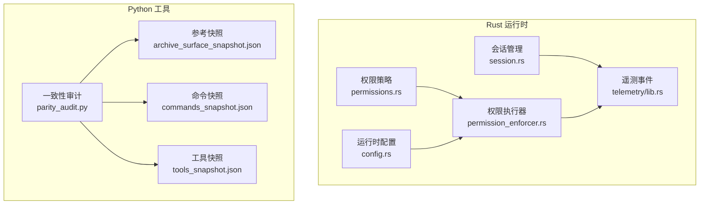
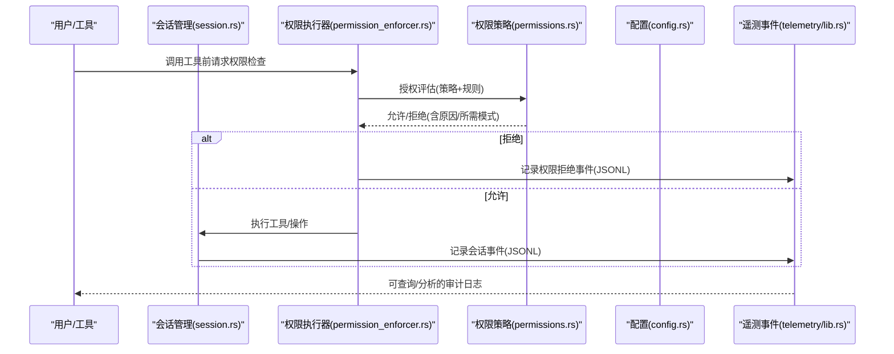
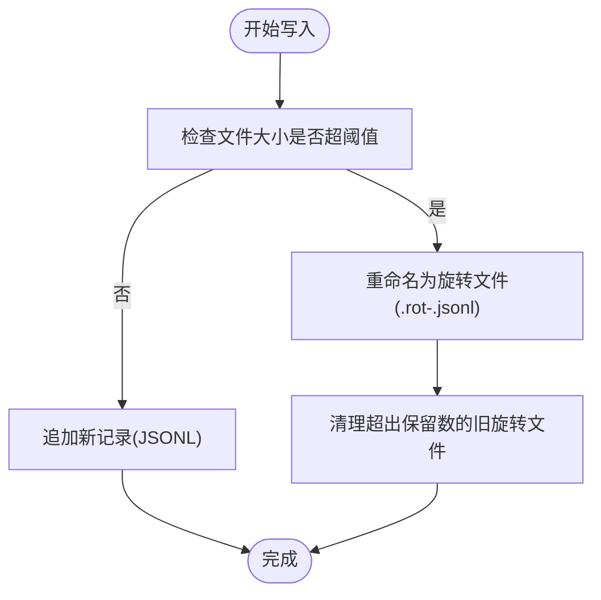
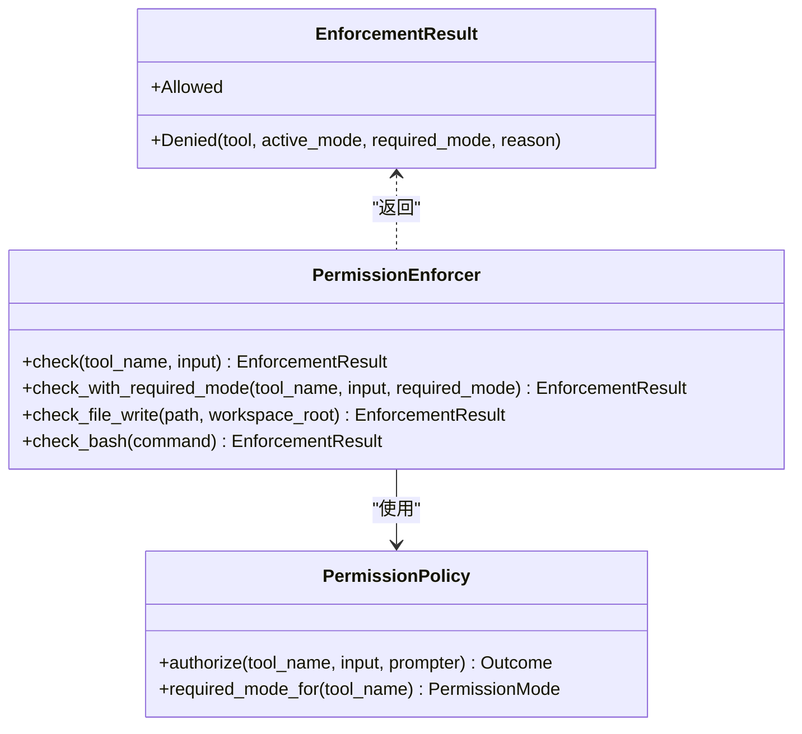
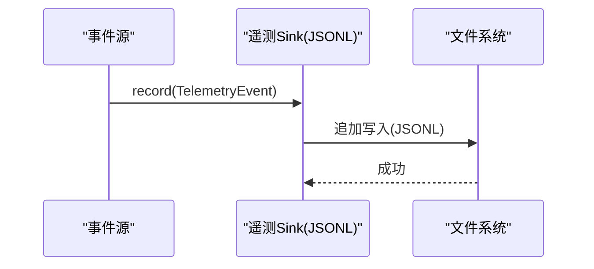
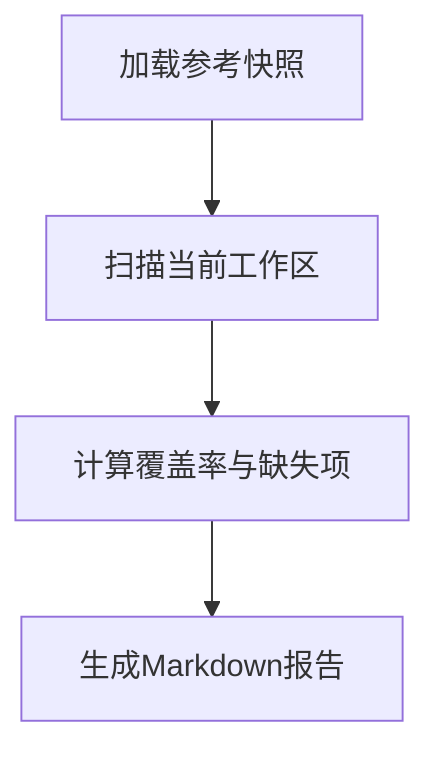
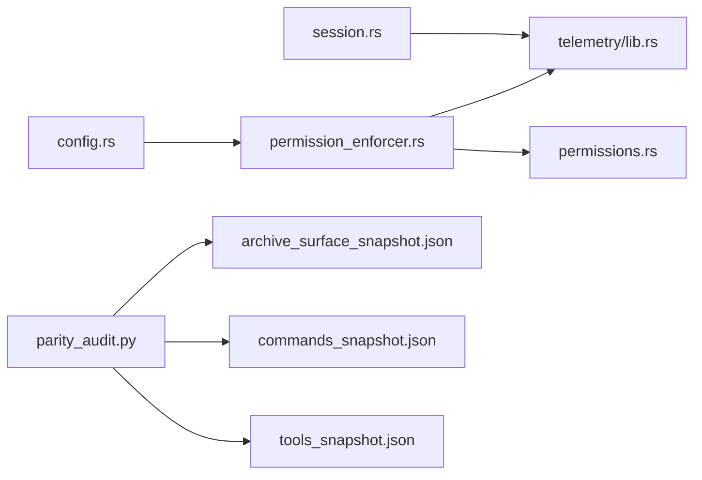

# 审计日志

<cite>
**本文档引用的文件**
- [parity_audit.py](file://src/parity_audit.py)
- [archive_surface_snapshot.json](file://src/reference_data/archive_surface_snapshot.json)
- [commands_snapshot.json](file://src/reference_data/commands_snapshot.json)
- [tools_snapshot.json](file://src/reference_data/tools_snapshot.json)
- [session.rs](file://rust/crates/runtime/src/session.rs)
- [permissions.rs](file://rust/crates/runtime/src/permissions.rs)
- [permission_enforcer.rs](file://rust/crates/runtime/src/permission_enforcer.rs)
- [config.rs](file://rust/crates/runtime/src/config.rs)
- [lib.rs](file://rust/crates/telemetry/src/lib.rs)
- [permissions.py](file://src/permissions.py)
</cite>

## 目录
1. [简介](#简介)
2. [项目结构](#项目结构)
3. [核心组件](#核心组件)
4. [架构总览](#架构总览)
5. [详细组件分析](#详细组件分析)
6. [依赖关系分析](#依赖关系分析)
7. [性能考虑](#性能考虑)
8. [故障排除指南](#故障排除指南)
9. [结论](#结论)
10. [附录](#附录)

## 简介
本文件系统化梳理并文档化代码库中的审计日志相关能力，涵盖以下方面：
- 审计日志的生成机制与存储格式（JSONL）
- 权限事件的记录标准与字段定义
- 数据完整性与一致性保障
- 分析工具、报告生成与合规性检查
- 配置选项、保留策略与隐私保护
- 在安全监控、合规审计与故障排查中的应用与最佳实践

## 项目结构
围绕审计日志的关键模块分布于 Rust 运行时与 Python 工具两部分：
- Rust 运行时：会话持久化（JSONL）、权限策略与执行器、遥测事件记录
- Python 工具：端到端一致性审计（命令/工具表面比对）

**图表来源**
- [session.rs](file://rust/crates/runtime/src/session.rs)
- [permissions.rs](file://rust/crates/runtime/src/permissions.rs)
- [permission_enforcer.rs](file://rust/crates/runtime/src/permission_enforcer.rs)
- [config.rs](file://rust/crates/runtime/src/config.rs)
- [lib.rs](file://rust/crates/telemetry/src/lib.rs)
- [parity_audit.py](file://src/parity_audit.py)
- [archive_surface_snapshot.json](file://src/reference_data/archive_surface_snapshot.json)
- [commands_snapshot.json](file://src/reference_data/commands_snapshot.json)
- [tools_snapshot.json](file://src/reference_data/tools_snapshot.json)

**章节来源**
- [session.rs](file://rust/crates/runtime/src/session.rs)
- [permissions.rs](file://rust/crates/runtime/src/permissions.rs)
- [permission_enforcer.rs](file://rust/crates/runtime/src/permission_enforcer.rs)
- [config.rs](file://rust/crates/runtime/src/config.rs)
- [lib.rs](file://rust/crates/telemetry/src/lib.rs)
- [parity_audit.py](file://src/parity_audit.py)

## 核心组件
- 会话持久化（JSONL）：负责将对话消息、提示历史等以 JSONL 格式写入磁盘，并支持轮转与清理
- 权限策略与执行器：定义权限模式、规则匹配与执行决策，输出拒绝原因与所需权限级别
- 遥测事件：统一的事件记录接口，支持内存与 JSONL 文件落盘
- 一致性审计：基于参考快照对比当前工作区，生成覆盖率与缺失项报告

**章节来源**
- [session.rs](file://rust/crates/runtime/src/session.rs)
- [permissions.rs](file://rust/crates/runtime/src/permissions.rs)
- [permission_enforcer.rs](file://rust/crates/runtime/src/permission_enforcer.rs)
- [lib.rs](file://rust/crates/telemetry/src/lib.rs)
- [parity_audit.py](file://src/parity_audit.py)

## 架构总览
审计日志体系由“事件采集—策略评估—持久化—分析报告”构成闭环。

**图表来源**
- [session.rs](file://rust/crates/runtime/src/session.rs)
- [permissions.rs](file://rust/crates/runtime/src/permissions.rs)
- [permission_enforcer.rs](file://rust/crates/runtime/src/permission_enforcer.rs)
- [config.rs](file://rust/crates/runtime/src/config.rs)
- [lib.rs](file://rust/crates/telemetry/src/lib.rs)

## 详细组件分析

### 会话持久化与审计日志存储（JSONL）
- 存储格式：每条记录为一条独立 JSON 对象，按时间顺序追加至文件；采用原子写入与临时文件避免损坏
- 轮转策略：超过阈值字节数后重命名旧文件为带时间戳的旋转文件，并限制保留数量
- 清理策略：仅保留最近 N 份旋转文件，超出数量的旧文件自动删除
- 字段要点：会话版本、会话 ID、创建/更新时间、消息列表、压缩摘要、分叉信息、工作区根路径、提示历史、模型信息等

**图表来源**
- [session.rs](file://rust/crates/runtime/src/session.rs)

**章节来源**
- [session.rs](file://rust/crates/runtime/src/session.rs)

### 权限事件记录与字段定义
- 决策结果：允许/拒绝
- 拒绝详情：工具名、当前模式、所需模式、拒绝原因
- 触发场景：工具调用前的权限检查、文件写入边界检查、Bash 命令只读/危险判定
- 字段示例：tool、active_mode、required_mode、reason

**图表来源**
- [permission_enforcer.rs](file://rust/crates/runtime/src/permission_enforcer.rs)
- [permissions.rs](file://rust/crates/runtime/src/permissions.rs)

**章节来源**
- [permission_enforcer.rs](file://rust/crates/runtime/src/permission_enforcer.rs)
- [permissions.rs](file://rust/crates/runtime/src/permissions.rs)

### 遥测事件与审计日志统一化
- 统一事件类型：HTTP 请求开始/失败、会话追踪、分析事件等
- 记录方式：内存缓冲或 JSONL 文件落盘，便于离线分析
- 属性合并：将方法、路径、尝试次数、错误、可重试标志等合并为属性集

**图表来源**
- [lib.rs](file://rust/crates/telemetry/src/lib.rs)

**章节来源**
- [lib.rs](file://rust/crates/telemetry/src/lib.rs)

### 一致性审计与合规性检查
- 参考快照：包含归档根目录、根文件集合、目录集合、TS 类似文件总数、命令入口数、工具入口数
- 当前工作区扫描：统计当前 Python 文件数量、命令/工具入口快照
- 结果指标：根文件覆盖率、目录覆盖率、文件总量比、命令/工具入口覆盖率、缺失项清单
- 报告形式：Markdown 文本，便于集成到合规报告

**图表来源**
- [parity_audit.py](file://src/parity_audit.py)
- [archive_surface_snapshot.json](file://src/reference_data/archive_surface_snapshot.json)
- [commands_snapshot.json](file://src/reference_data/commands_snapshot.json)
- [tools_snapshot.json](file://src/reference_data/tools_snapshot.json)

**章节来源**
- [parity_audit.py](file://src/parity_audit.py)
- [archive_surface_snapshot.json](file://src/reference_data/archive_surface_snapshot.json)
- [commands_snapshot.json](file://src/reference_data/commands_snapshot.json)
- [tools_snapshot.json](file://src/reference_data/tools_snapshot.json)

## 依赖关系分析
- 会话持久化依赖 JSONL 序列化与文件系统原子写入
- 权限执行器依赖权限策略与规则解析
- 遥测事件作为通用审计载体，被会话与权限模块复用
- Python 一致性审计依赖参考快照与当前工作区文件系统

**图表来源**
- [session.rs](file://rust/crates/runtime/src/session.rs)
- [permission_enforcer.rs](file://rust/crates/runtime/src/permission_enforcer.rs)
- [permissions.rs](file://rust/crates/runtime/src/permissions.rs)
- [config.rs](file://rust/crates/runtime/src/config.rs)
- [lib.rs](file://rust/crates/telemetry/src/lib.rs)
- [parity_audit.py](file://src/parity_audit.py)

**章节来源**
- [session.rs](file://rust/crates/runtime/src/session.rs)
- [permission_enforcer.rs](file://rust/crates/runtime/src/permission_enforcer.rs)
- [permissions.rs](file://rust/crates/runtime/src/permissions.rs)
- [config.rs](file://rust/crates/runtime/src/config.rs)
- [lib.rs](file://rust/crates/telemetry/src/lib.rs)
- [parity_audit.py](file://src/parity_audit.py)

## 性能考虑
- JSONL 追加写入：顺序写入，I/O 开销低；轮转与清理避免单文件过大
- 权限检查：规则匹配与模式比较为轻量级计算，拒绝路径快速返回
- 遥测落盘：批量追加写入，建议在高并发场景下通过缓冲减少系统调用
- 一致性审计：扫描当前工作区文件系统，建议在 CI 中缓存结果，避免重复全量扫描

## 故障排除指南
- JSONL 文件损坏或不完整
  - 现象：无法解析某条记录或文件末尾异常
  - 处理：依赖原子写入与临时文件机制；若出现损坏，检查最近一次写入是否成功，必要时回滚到上一个完整轮转文件
  - 参考：原子写入与临时文件命名策略
- 权限拒绝但不符合预期
  - 现象：工具被拒绝，返回所需模式与原因
  - 处理：核对权限策略配置、规则匹配、动态所需模式；确认当前模式是否正确
  - 参考：拒绝结果字段与所需模式判断逻辑
- 遥测事件未落盘
  - 现象：内存中存在事件但文件无记录
  - 处理：确认 JSONL Sink 初始化与文件路径权限；检查并发写入锁状态
- 一致性审计结果异常
  - 现象：覆盖率异常或缺失项不一致
  - 处理：核对参考快照版本与当前工作区变更；确保快照文件完整且未被修改

**章节来源**
- [session.rs](file://rust/crates/runtime/src/session.rs)
- [permission_enforcer.rs](file://rust/crates/runtime/src/permission_enforcer.rs)
- [lib.rs](file://rust/crates/telemetry/src/lib.rs)
- [parity_audit.py](file://src/parity_audit.py)

## 结论
该代码库提供了从“事件采集—策略评估—持久化—分析报告”的完整审计日志能力：
- 会话 JSONL 记录了对话与操作轨迹
- 权限执行器将权限决策标准化为可审计事件
- 遥测事件统一了多种运行时事件的落盘格式
- Python 一致性审计提供了端到端合规性检查与报告生成

建议在生产环境中结合轮转与保留策略、权限策略与规则、以及参考快照进行持续审计与合规性监控。

## 附录

### 审计日志字段定义（示例）
- 会话相关：version、session_id、created_at_ms、updated_at_ms、messages、compaction、fork、workspace_root、prompt_history、last_health_check_ms、model
- 权限拒绝：tool、active_mode、required_mode、reason
- 遥测事件：type、timestamp、attributes（如 method、path、attempt、error、retryable、namespace、action 等）

**章节来源**
- [session.rs](file://rust/crates/runtime/src/session.rs)
- [permission_enforcer.rs](file://rust/crates/runtime/src/permission_enforcer.rs)
- [lib.rs](file://rust/crates/telemetry/src/lib.rs)

### 配置选项与保留策略
- 权限模式与规则：通过运行时配置解析权限模式与规则列表，影响权限执行器行为
- 会话轮转阈值与保留数：通过常量控制轮转触发大小与保留文件数量
- 遥测落盘路径：通过 JSONL Sink 初始化指定输出路径

**章节来源**
- [config.rs](file://rust/crates/runtime/src/config.rs)
- [session.rs](file://rust/crates/runtime/src/session.rs)
- [lib.rs](file://rust/crates/telemetry/src/lib.rs)

### 隐私保护措施
- 最小化记录：仅记录必要的事件与属性，避免敏感信息进入日志
- 本地化存储：JSONL 文件默认保存在本地，建议配合访问控制与加密
- 可选脱敏：在生成报告前对敏感字段进行脱敏处理
- 合规审计：通过一致性审计报告与覆盖率指标验证端到端映射完整性

**章节来源**
- [parity_audit.py](file://src/parity_audit.py)
- [permissions.py](file://src/permissions.py)

### 应用场景与最佳实践
- 安全监控：利用权限拒绝事件识别越权行为与高风险操作
- 合规审计：使用一致性审计报告与覆盖率指标验证迁移/重构的完整性
- 故障排查：通过会话 JSONL 与遥测事件重建操作链路，定位问题根因