# 权限与安全

<cite>
**本文引用的文件**
- [permissions.py](file://src/permissions.py)
- [permission_enforcer.rs](file://rust/crates/runtime/src/permission_enforcer.rs)
- [permissions.rs](file://rust/crates/runtime/src/permissions.rs)
- [policy_engine.rs](file://rust/crates/runtime/src/policy_engine.rs)
- [config.rs](file://rust/crates/runtime/src/config.rs)
- [trust_resolver.rs](file://rust/crates/runtime/src/trust_resolver.rs)
- [sandbox.rs](file://rust/crates/runtime/src/sandbox.rs)
- [session_control.rs](file://rust/crates/runtime/src/session_control.rs)
- [parity_audit.py](file://src/parity_audit.py)
- [lib.rs（插件）](file://rust/crates/plugins/src/lib.rs)
</cite>

## 目录
1. [简介](#简介)
2. [项目结构](#项目结构)
3. [核心组件](#核心组件)
4. [架构总览](#架构总览)
5. [详细组件分析](#详细组件分析)
6. [依赖分析](#依赖分析)
7. [性能考虑](#性能考虑)
8. [故障排查指南](#故障排查指南)
9. [结论](#结论)
10. [附录](#附录)

## 简介
本文件围绕代码库中的权限控制与安全体系，系统化阐述权限模式、访问控制列表与策略引擎的工作原理；解释工具访问控制、API 密钥管理、信任域解析与沙箱隔离等机制；并给出权限配置、角色管理与安全策略的实现细节、最佳实践、威胁模型与防护建议，以及与插件、工具执行的集成方式。

## 项目结构
- 权限与策略相关的核心代码主要集中在 Rust 运行时模块中，包括权限模式与策略、策略引擎、信任解析、沙箱隔离、会话控制与配置加载等。
- Python 存档审计脚本用于对比当前仓库与历史快照，辅助进行合规性与一致性审计。

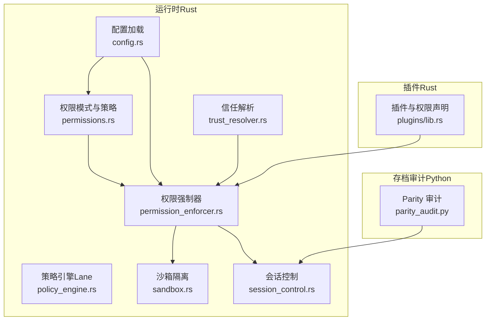

**图表来源**
- [permissions.rs](file://rust/crates/runtime/src/permissions.rs)
- [permission_enforcer.rs](file://rust/crates/runtime/src/permission_enforcer.rs)
- [policy_engine.rs](file://rust/crates/runtime/src/policy_engine.rs)
- [trust_resolver.rs](file://rust/crates/runtime/src/trust_resolver.rs)
- [sandbox.rs](file://rust/crates/runtime/src/sandbox.rs)
- [session_control.rs](file://rust/crates/runtime/src/session_control.rs)
- [config.rs](file://rust/crates/runtime/src/config.rs)
- [lib.rs（插件）](file://rust/crates/plugins/src/lib.rs)
- [parity_audit.py](file://src/parity_audit.py)

**章节来源**
- [permissions.rs](file://rust/crates/runtime/src/permissions.rs)
- [permission_enforcer.rs](file://rust/crates/runtime/src/permission_enforcer.rs)
- [policy_engine.rs](file://rust/crates/runtime/src/policy_engine.rs)
- [trust_resolver.rs](file://rust/crates/runtime/src/trust_resolver.rs)
- [sandbox.rs](file://rust/crates/runtime/src/sandbox.rs)
- [session_control.rs](file://rust/crates/runtime/src/session_control.rs)
- [config.rs](file://rust/crates/runtime/src/config.rs)
- [lib.rs（插件）](file://rust/crates/plugins/src/lib.rs)
- [parity_audit.py](file://src/parity_audit.py)

## 核心组件
- 权限模式与策略：定义权限等级、规则匹配、钩子覆盖与交互提示。
- 权限强制器：在工具调用前进行实时授权判定，并对文件写入、bash 命令等进行边界检查。
- 策略引擎：基于 Lane 上下文的条件动作链，支持合并、优先级与组合器。
- 信任解析：检测终端提示中的信任请求，结合白名单/黑名单自动决策或要求审批。
- 沙箱隔离：容器环境检测、命名空间/网络/文件系统隔离能力评估与命令构建。
- 配置加载：从多源配置文件合并，解析权限模式与规则、插件、MCP、OAuth 等。
- 插件系统：插件清单、权限声明、生命周期与钩子，影响工具执行的授权与审计。
- 会话控制：按工作树指纹隔离会话存储，避免并发冲突。
- 存档审计：对比当前 Python 代码与历史快照，评估覆盖率与缺失项。

**章节来源**
- [permissions.rs](file://rust/crates/runtime/src/permissions.rs)
- [permission_enforcer.rs](file://rust/crates/runtime/src/permission_enforcer.rs)
- [policy_engine.rs](file://rust/crates/runtime/src/policy_engine.rs)
- [trust_resolver.rs](file://rust/crates/runtime/src/trust_resolver.rs)
- [sandbox.rs](file://rust/crates/runtime/src/sandbox.rs)
- [config.rs](file://rust/crates/runtime/src/config.rs)
- [lib.rs（插件）](file://rust/crates/plugins/src/lib.rs)
- [session_control.rs](file://rust/crates/runtime/src/session_control.rs)
- [parity_audit.py](file://src/parity_audit.py)

## 架构总览
权限与安全体系由“策略层 + 强制层 + 执行层”构成：
- 策略层：权限模式、规则集、钩子覆盖、信任策略与沙箱配置。
- 强制层：权限强制器在工具执行前进行判定，必要时触发交互提示。
- 执行层：工具执行、插件钩子、会话持久化与审计。

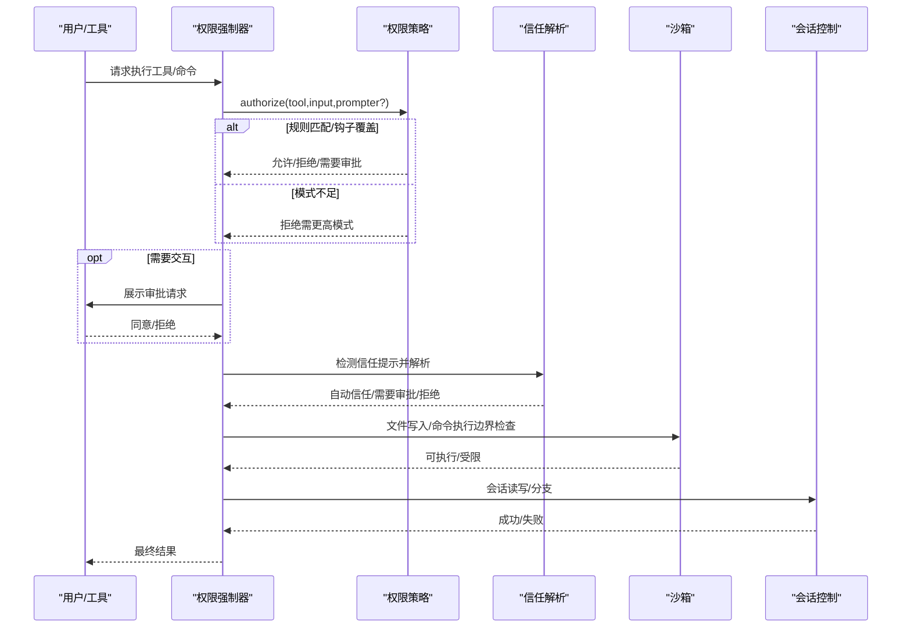

**图表来源**
- [permission_enforcer.rs](file://rust/crates/runtime/src/permission_enforcer.rs)
- [permissions.rs](file://rust/crates/runtime/src/permissions.rs)
- [trust_resolver.rs](file://rust/crates/runtime/src/trust_resolver.rs)
- [sandbox.rs](file://rust/crates/runtime/src/sandbox.rs)
- [session_control.rs](file://rust/crates/runtime/src/session_control.rs)

## 详细组件分析

### 权限模式与策略引擎
- 权限模式：只读、工作区写入、危险全权、提示模式、允许全部。模式之间存在有序关系，强制器以“当前模式 ≥ 工具所需模式”作为通过条件。
- 规则系统：支持 allow/deny/ask 三类规则，规则可按工具名精确匹配、通配或前缀匹配；输入内容通过 JSON 结构提取 subject 字段进行匹配。
- 钩子覆盖：插件或更高层可注入覆盖决策（允许/拒绝/要求审批），覆盖优先于规则与模式。
- 交互提示：当策略要求提升权限或存在 ask 规则时，可通过提示器收集用户决策。

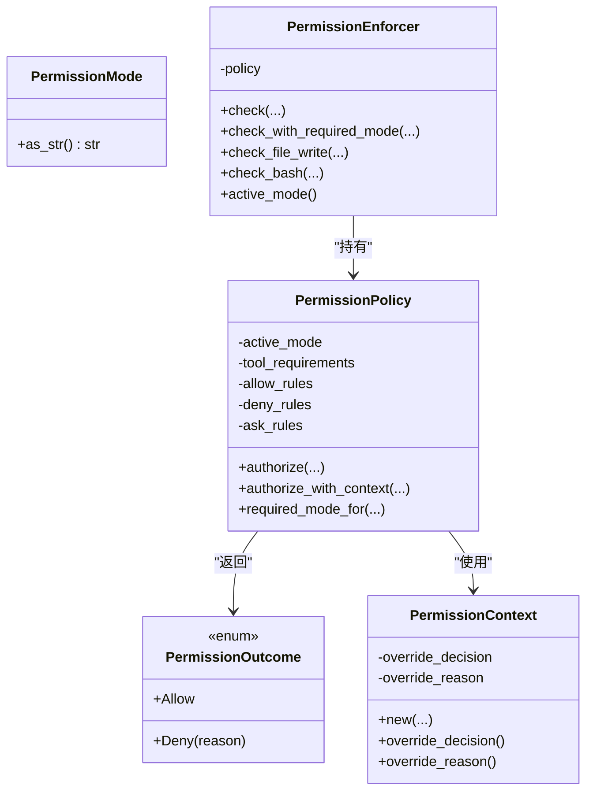

**图表来源**
- [permissions.rs](file://rust/crates/runtime/src/permissions.rs)
- [permission_enforcer.rs](file://rust/crates/runtime/src/permission_enforcer.rs)

**章节来源**
- [permissions.rs](file://rust/crates/runtime/src/permissions.rs)
- [permission_enforcer.rs](file://rust/crates/runtime/src/permission_enforcer.rs)

### 工具访问控制与强制执行
- 工具维度：可为特定工具设置所需模式；若未显式声明，默认要求最高模式。
- 输入维度：规则匹配时从输入 JSON 中抽取 subject（如命令路径、文件路径、URL 等），支持精确匹配与前缀匹配。
- 交互提示：当模式不足或规则要求审批时，强制器委托提示器进行用户确认。
- 文件写入与 bash 命令：强制器根据当前模式与规则分别进行边界检查与启发式判断（如只读命令集合）。

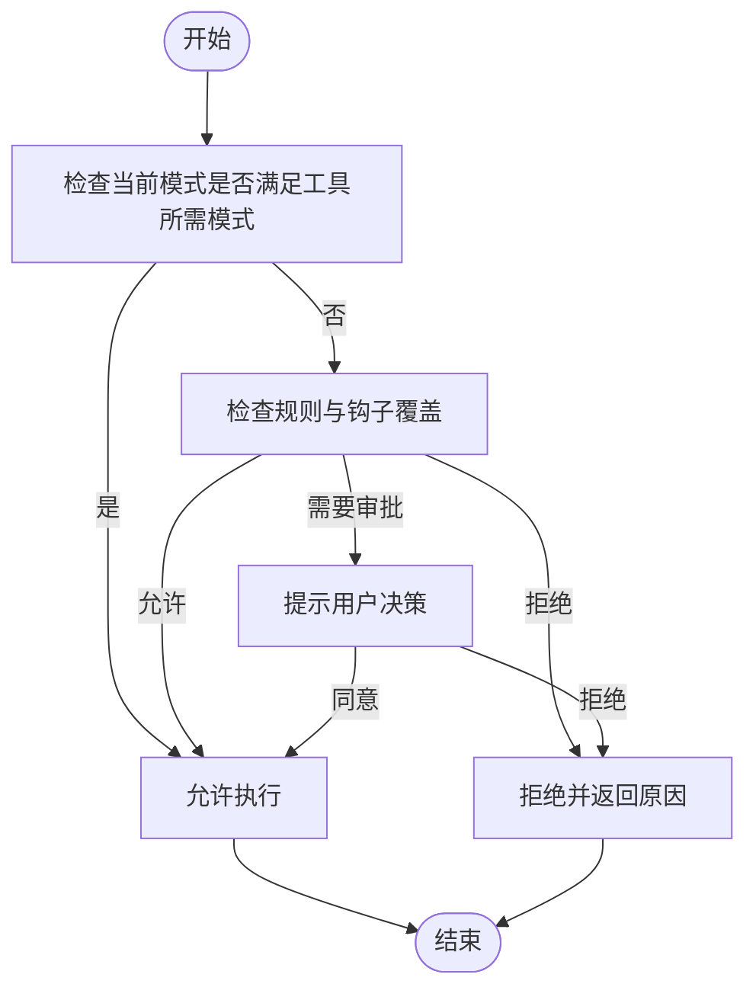

**图表来源**
- [permission_enforcer.rs](file://rust/crates/runtime/src/permission_enforcer.rs)
- [permissions.rs](file://rust/crates/runtime/src/permissions.rs)

**章节来源**
- [permission_enforcer.rs](file://rust/crates/runtime/src/permission_enforcer.rs)
- [permissions.rs](file://rust/crates/runtime/src/permissions.rs)

### 策略引擎（Lane 策略）
- 条件组合：支持 And/Or 组合器，条件包括绿灯等级、过期分支、启动阻塞、评审通过、范围变更、超时等。
- 动作链：支持合并动作链、优先级排序，动作类型包括合并、回滚、通知、阻断、清理等。
- 评估流程：按优先级顺序匹配规则，展开动作链后输出最终动作序列。

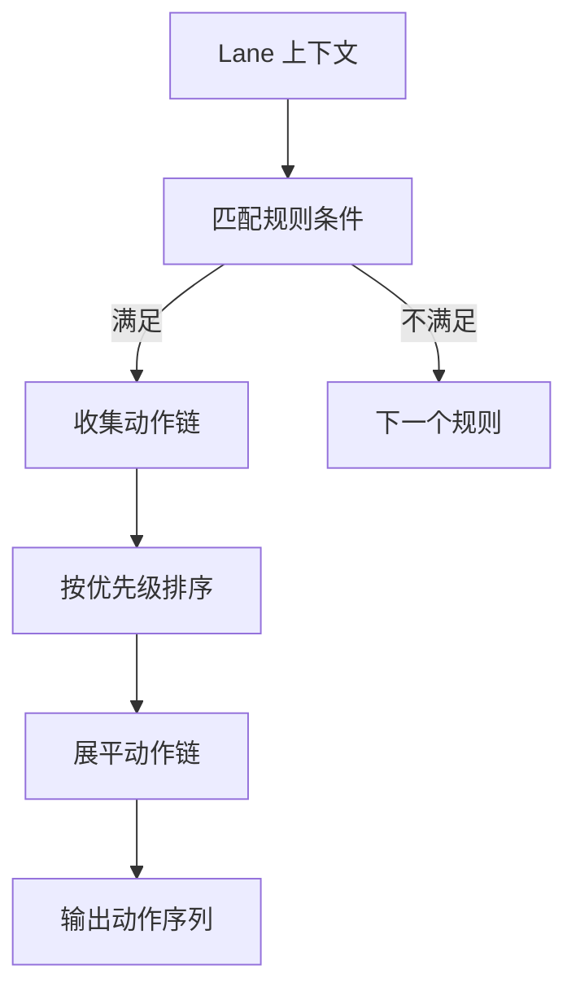

**图表来源**
- [policy_engine.rs](file://rust/crates/runtime/src/policy_engine.rs)

**章节来源**
- [policy_engine.rs](file://rust/crates/runtime/src/policy_engine.rs)

### 信任解析与自动决策
- 提示检测：识别终端输出中的信任提示关键词，触发信任解析流程。
- 决策逻辑：优先匹配黑名单（拒绝），其次匹配白名单（自动信任），否则要求人工审批。
- 事件记录：记录信任需求、解析结果与拒绝原因，便于审计。

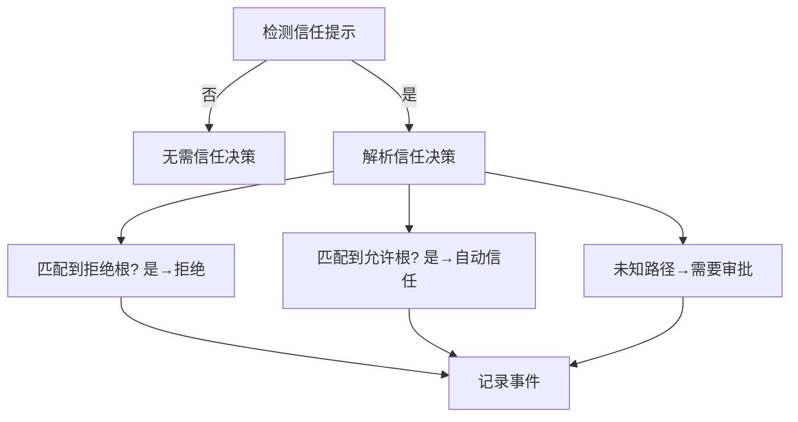

**图表来源**
- [trust_resolver.rs](file://rust/crates/runtime/src/trust_resolver.rs)

**章节来源**
- [trust_resolver.rs](file://rust/crates/runtime/src/trust_resolver.rs)

### 沙箱隔离与容器检测
- 能力检测：检测容器环境标记（/proc/1/cgroup、环境变量、/run/.containerenv 等），评估命名空间与网络隔离可用性。
- 配置解析：支持启用/禁用、命名空间限制、网络隔离、文件系统模式（关闭/仅工作区/允许列表）与挂载点。
- 命令构建：在 Linux 上通过 unshare 构建带隔离的命令执行环境，设置 HOME/TMPDIR 与隔离模式变量。

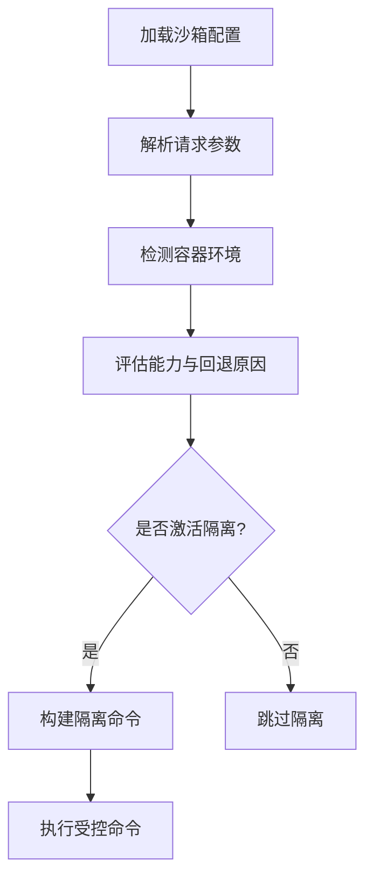

**图表来源**
- [sandbox.rs](file://rust/crates/runtime/src/sandbox.rs)

**章节来源**
- [sandbox.rs](file://rust/crates/runtime/src/sandbox.rs)

### 配置加载与权限规则
- 配置源：用户、项目、本地多源发现与合并，支持 hooks、插件、MCP、OAuth、权限模式与规则、沙箱等。
- 权限规则：从配置中解析 allow/deny/ask 规则，构建策略对象。
- 插件配置：解析插件启用状态、外部目录、安装根、注册表路径、最大输出 token 等。

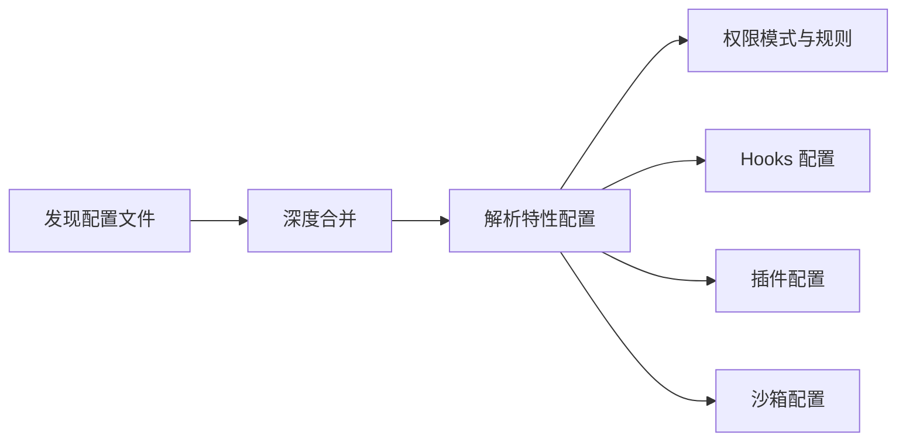

**图表来源**
- [config.rs](file://rust/crates/runtime/src/config.rs)

**章节来源**
- [config.rs](file://rust/crates/runtime/src/config.rs)

### 插件系统与工具权限
- 清单与权限：插件 manifest 声明工具所需的最小权限级别（只读/工作区写入/危险全权）。
- 生命周期与钩子：插件可定义 PreToolUse/PostToolUse/PostToolUseFailure 等钩子，影响工具执行前后的行为与审计。
- 执行上下文：插件工具执行时注入环境变量（插件 ID/名称、工具名、输入 JSON、根目录等）。

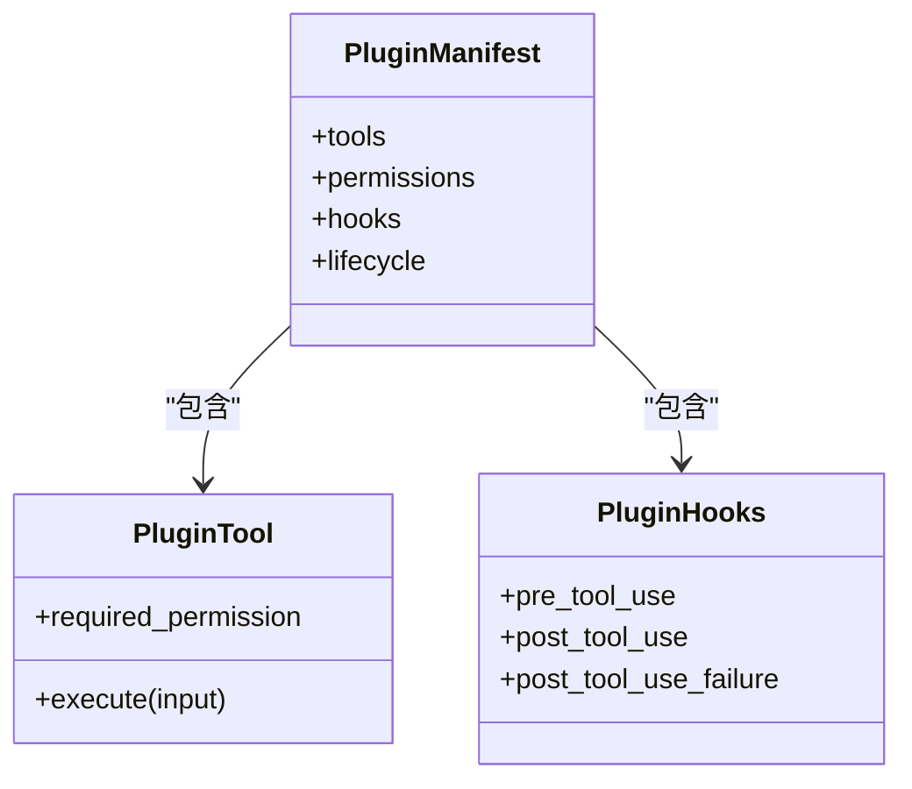

**图表来源**
- [lib.rs（插件）](file://rust/crates/plugins/src/lib.rs)

**章节来源**
- [lib.rs（插件）](file://rust/crates/plugins/src/lib.rs)

### 会话控制与审计
- 工作树隔离：按工作树根路径生成稳定指纹，命名空间化会话目录，避免并发冲突。
- 会话生命周期：创建、加载、分叉、列出、最新会话解析等。
- 审计关联：会话与工具执行、权限决策、信任事件、沙箱状态等可形成审计线索。

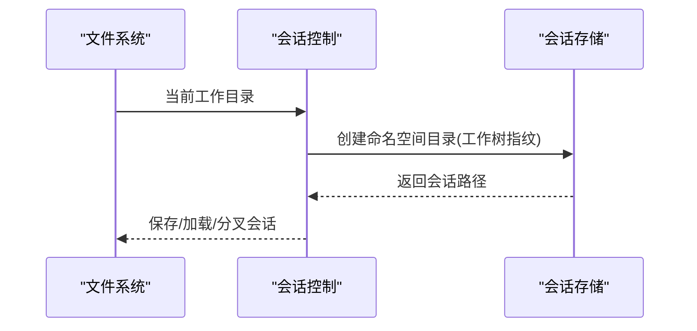

**图表来源**
- [session_control.rs](file://rust/crates/runtime/src/session_control.rs)

**章节来源**
- [session_control.rs](file://rust/crates/runtime/src/session_control.rs)

### 存档审计与合规
- 快照对比：统计当前 Python 文件数量、命令入口与工具入口覆盖率，输出缺失目标清单。
- 报告格式：Markdown 输出，便于审阅与归档。

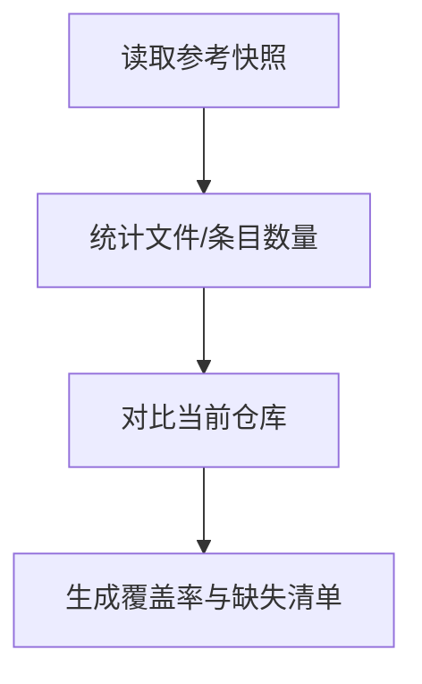

**图表来源**
- [parity_audit.py](file://src/parity_audit.py)

**章节来源**
- [parity_audit.py](file://src/parity_audit.py)

## 依赖分析
- 权限强制器依赖权限策略与提示器接口；策略依赖规则解析与钩子上下文。
- 信任解析独立于权限策略，但可被强制器在工具执行前调用以决定是否放行。
- 沙箱隔离与容器检测为执行层提供安全边界，与权限强制器协同作用。
- 配置加载贯穿策略与沙箱初始化，确保运行时行为一致。
- 插件系统通过清单与钩子影响工具执行与权限判定。

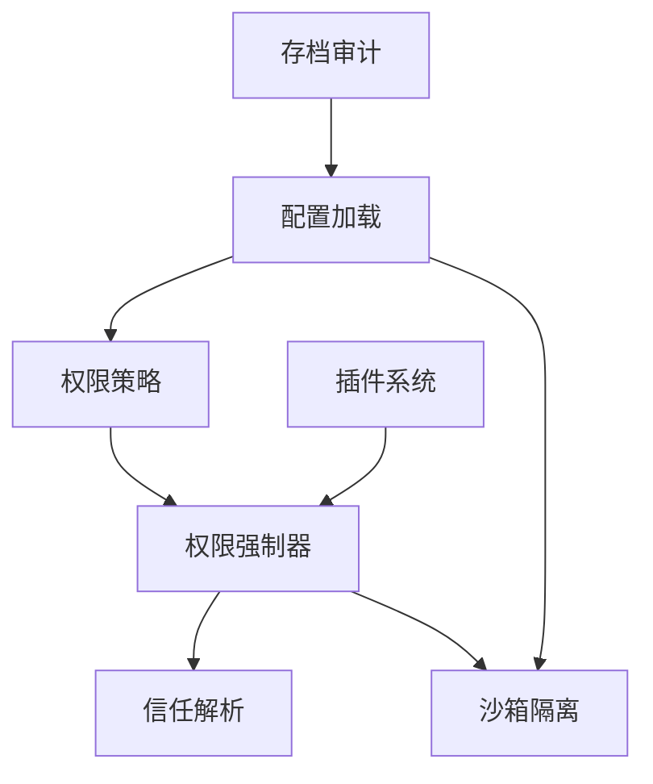

**图表来源**
- [permissions.rs](file://rust/crates/runtime/src/permissions.rs)
- [permission_enforcer.rs](file://rust/crates/runtime/src/permission_enforcer.rs)
- [trust_resolver.rs](file://rust/crates/runtime/src/trust_resolver.rs)
- [sandbox.rs](file://rust/crates/runtime/src/sandbox.rs)
- [config.rs](file://rust/crates/runtime/src/config.rs)
- [lib.rs（插件）](file://rust/crates/plugins/src/lib.rs)
- [parity_audit.py](file://src/parity_audit.py)

**章节来源**
- [permissions.rs](file://rust/crates/runtime/src/permissions.rs)
- [permission_enforcer.rs](file://rust/crates/runtime/src/permission_enforcer.rs)
- [trust_resolver.rs](file://rust/crates/runtime/src/trust_resolver.rs)
- [sandbox.rs](file://rust/crates/runtime/src/sandbox.rs)
- [config.rs](file://rust/crates/runtime/src/config.rs)
- [lib.rs（插件）](file://rust/crates/plugins/src/lib.rs)
- [parity_audit.py](file://src/parity_audit.py)

## 性能考虑
- 权限规则匹配：规则解析与匹配为轻量操作，建议合理组织规则数量与复杂度，避免过度嵌套。
- 交互提示：提示器应尽量异步或非阻塞，减少对工具执行时延的影响。
- 沙箱命令构建：仅在 Linux 且启用隔离时生效，避免在不支持平台产生额外开销。
- 会话存储：工作树指纹计算与目录遍历为常数级成本，注意磁盘 IO 与并发访问。

[本节为通用指导，无需具体文件引用]

## 故障排查指南
- 权限拒绝：检查工具所需模式与当前模式关系、规则匹配与钩子覆盖；查看拒绝原因字段定位问题。
- 信任提示：确认终端输出是否包含信任提示关键词；检查信任根配置与路径匹配。
- 沙箱不可用：检查容器环境检测标记与系统能力（unshare 用户命名空间）；查看回退原因。
- 会话异常：确认工作树指纹与会话目录对应关系；检查会话路径是否存在与工作区绑定。

**章节来源**
- [permission_enforcer.rs](file://rust/crates/runtime/src/permission_enforcer.rs)
- [trust_resolver.rs](file://rust/crates/runtime/src/trust_resolver.rs)
- [sandbox.rs](file://rust/crates/runtime/src/sandbox.rs)
- [session_control.rs](file://rust/crates/runtime/src/session_control.rs)

## 结论
该权限与安全体系通过“策略 + 强制 + 执行”的分层设计，实现了细粒度的工具访问控制、灵活的规则与钩子覆盖、可信的信任解析与容器化沙箱隔离。配合会话控制与存档审计，形成从配置到执行再到审计的闭环，既保证了安全性，也兼顾了可运维性与可观测性。

[本节为总结，无需具体文件引用]

## 附录
- 权限配置要点
  - 在配置中设置权限模式与规则，明确工具所需模式与输入匹配规则。
  - 使用 ask 规则对高风险工具进行二次确认。
  - 通过钩子覆盖实现业务侧的即时决策。
- 安全最佳实践
  - 默认采用更严格模式（如工作区写入或只读），仅在必要时放宽。
  - 对 bash 命令与文件写入实施边界检查与启发式过滤。
  - 启用沙箱隔离，限制网络与命名空间暴露面。
  - 审计所有权限决策、信任事件与工具执行轨迹。
- 威胁模型与防护
  - 威胁：误授权、越权执行、供应链风险、容器逃逸。
  - 防护：最小权限原则、规则与钩子双重校验、信任白名单/黑名单、沙箱与容器检测、会话隔离与审计。

[本节为通用指导，无需具体文件引用]