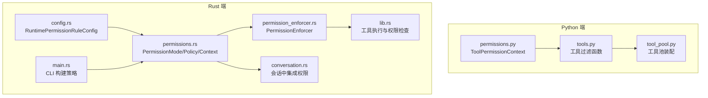
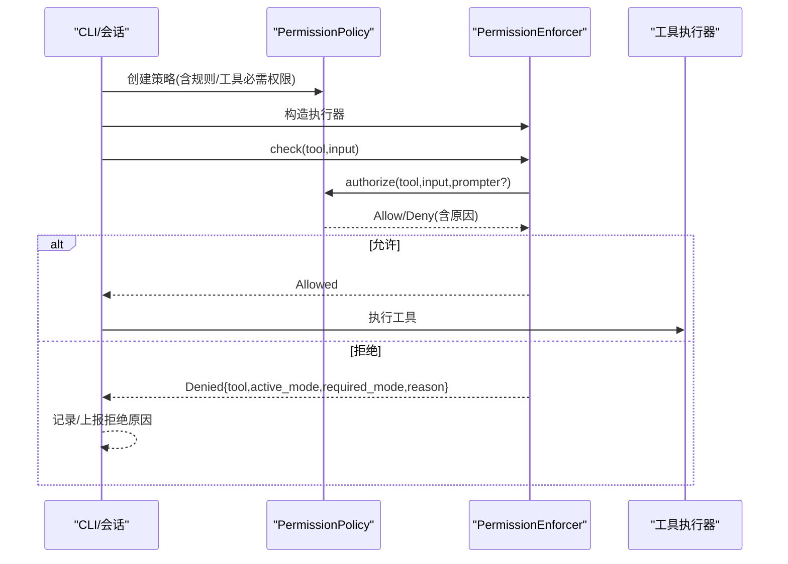
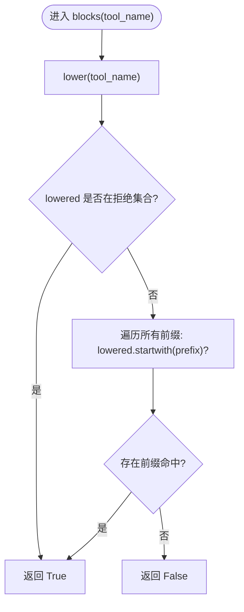
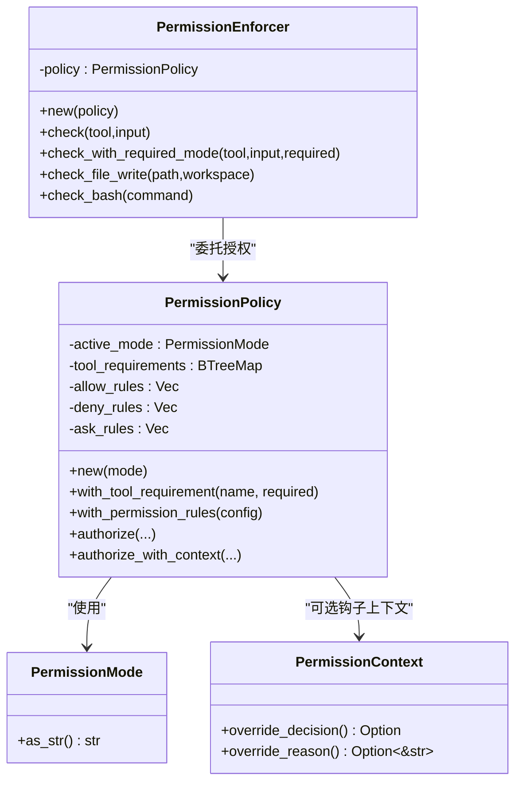
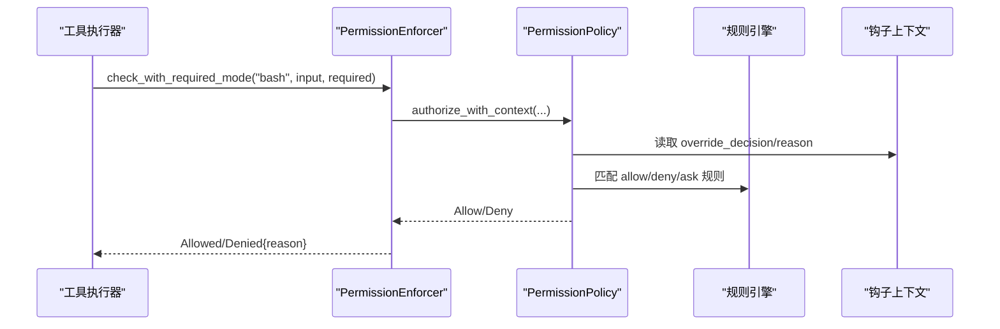
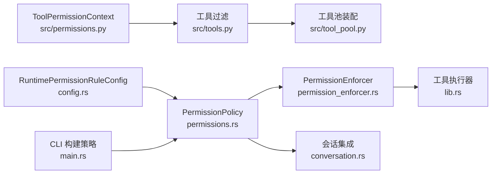

# 权限模型

<cite>
**本文档引用的文件**
- [permissions.py](file://src/permissions.py)
- [tools.py](file://src/tools.py)
- [tool_pool.py](file://src/tool_pool.py)
- [permissions.rs](file://rust/crates/runtime/src/permissions.rs)
- [permission_enforcer.rs](file://rust/crates/runtime/src/permission_enforcer.rs)
- [lib.rs](file://rust/crates/tools/src/lib.rs)
- [conversation.rs](file://rust/crates/runtime/src/conversation.rs)
- [config.rs](file://rust/crates/runtime/src/config.rs)
- [main.rs](file://rust/crates/rusty-claude-cli/src/main.rs)
</cite>

## 目录
1. [简介](#简介)
2. [项目结构](#项目结构)
3. [核心组件](#核心组件)
4. [架构总览](#架构总览)
5. [详细组件分析](#详细组件分析)
6. [依赖关系分析](#依赖关系分析)
7. [性能考虑](#性能考虑)
8. [故障排查指南](#故障排查指南)
9. [结论](#结论)
10. [附录](#附录)

## 简介
本文件系统性阐述代码库中的权限模型与工具执行安全控制机制，重点围绕 Python 端的 ToolPermissionContext 设计与 Rust 端的 PermissionPolicy/PermissionEnforcer 实现展开，覆盖以下主题：
- ToolPermissionContext 的设计原理与拒绝工具名称及前缀匹配逻辑
- 权限上下文的创建、配置与使用方法
- 权限检查算法、大小写处理与性能优化
- 权限模型在工具执行中的应用实例
- 与安全组件（规则引擎、钩子、提示器）的集成方式
- 权限配置最佳实践与常见使用场景

## 项目结构
权限模型横跨 Python 与 Rust 两套实现：
- Python 端：提供 ToolPermissionContext，用于在工具列表层面进行快速过滤与屏蔽
- Rust 端：提供 PermissionPolicy、PermissionEnforcer、PermissionMode 等，负责运行时细粒度权限判定与执行拦截

图表来源
- [permissions.py:1-21](file://src/permissions.py#L1-L21)
- [tools.py:56-72](file://src/tools.py#L56-L72)
- [tool_pool.py:28-37](file://src/tool_pool.py#L28-L37)
- [permissions.rs:9-15](file://rust/crates/runtime/src/permissions.rs#L9-L15)
- [permission_enforcer.rs:26-29](file://rust/crates/runtime/src/permission_enforcer.rs#L26-L29)
- [lib.rs:1174-1187](file://rust/crates/tools/src/lib.rs#L1174-L1187)
- [conversation.rs:411-445](file://rust/crates/runtime/src/conversation.rs#L411-L445)
- [config.rs:613-624](file://rust/crates/runtime/src/config.rs#L613-L624)
- [main.rs:8053-8064](file://rust/crates/rusty-claude-cli/src/main.rs#L8053-L8064)

章节来源
- [permissions.py:1-21](file://src/permissions.py#L1-L21)
- [tools.py:56-72](file://src/tools.py#L56-L72)
- [tool_pool.py:28-37](file://src/tool_pool.py#L28-L37)
- [permissions.rs:9-15](file://rust/crates/runtime/src/permissions.rs#L9-L15)
- [permission_enforcer.rs:26-29](file://rust/crates/runtime/src/permission_enforcer.rs#L26-L29)
- [lib.rs:1174-1187](file://rust/crates/tools/src/lib.rs#L1174-L1187)
- [conversation.rs:411-445](file://rust/crates/runtime/src/conversation.rs#L411-L445)
- [config.rs:613-624](file://rust/crates/runtime/src/config.rs#L613-L624)
- [main.rs:8053-8064](file://rust/crates/rusty-claude-cli/src/main.rs#L8053-L8064)

## 核心组件
- Python 端 ToolPermissionContext
  - 提供不可变的拒绝集合（精确名与前缀），统一小写化后进行匹配
  - 支持从可迭代输入构建，便于 CLI 或配置注入
- Rust 端 PermissionPolicy/PermissionEnforcer
  - PermissionMode 定义五级权限等级，支持比较与字符串化
  - PermissionPolicy 组合“工具必需权限 + 规则集（allow/deny/ask）+ 钩子上下文”，输出 Allow/Deny 结果
  - PermissionEnforcer 将 Policy 应用于具体工具调用，返回 Allowed/Denied，并携带原因与模式信息
- 工具执行层
  - 在工具执行前调用 enforce_permission_check 或 check_with_required_mode 进行拦截
  - 对 bash 等动态分类工具，按命令内容动态提升所需权限级别

章节来源
- [permissions.py:6-21](file://src/permissions.py#L6-L21)
- [permissions.rs:9-28](file://rust/crates/runtime/src/permissions.rs#L9-L28)
- [permissions.rs:99-161](file://rust/crates/runtime/src/permissions.rs#L99-L161)
- [permission_enforcer.rs:26-61](file://rust/crates/runtime/src/permission_enforcer.rs#L26-L61)
- [lib.rs:1174-1187](file://rust/crates/tools/src/lib.rs#L1174-L1187)

## 架构总览
权限模型在不同层协同工作：
- Python 层：在工具呈现与选择阶段，基于 ToolPermissionContext 快速剔除被禁止或前缀匹配的工具
- Rust 层：在会话与工具执行阶段，基于 PermissionPolicy/PermissionEnforcer 做细粒度判定；支持规则引擎与钩子上下文
- CLI/会话：通过 RuntimePermissionRuleConfig 注入规则，结合工具内置 required_permission 形成最终策略

图表来源
- [permission_enforcer.rs:37-61](file://rust/crates/runtime/src/permission_enforcer.rs#L37-L61)
- [permissions.rs:164-292](file://rust/crates/runtime/src/permissions.rs#L164-L292)
- [lib.rs:1174-1187](file://rust/crates/tools/src/lib.rs#L1174-L1187)

## 详细组件分析

### Python 端：ToolPermissionContext
- 设计要点
  - 使用不可变数据结构，确保线程安全与可复用性
  - 拒绝集合包含精确名集合与前缀元组，均在构造时转为小写，避免大小写差异导致的漏判
  - blocks 方法先查精确名，再遍历前缀，短路返回
- 大小写处理
  - 输入统一 lower() 后参与匹配，保证大小写不敏感
- 性能特征
  - 精确名使用 frozenset，查找 O(1)
  - 前缀匹配使用 any(...) 遍历，复杂度 O(k)（k 为前缀数量）
- 使用场景
  - CLI 参数 --deny-tool 与 --deny-prefix 转换为 ToolPermissionContext
  - 工具列表渲染前进行过滤，减少后续执行阶段负担

图表来源
- [permissions.py:18-21](file://src/permissions.py#L18-L21)

章节来源
- [permissions.py:6-21](file://src/permissions.py#L6-L21)
- [tools.py:56-59](file://src/tools.py#L56-L59)
- [tool_pool.py:30-37](file://src/tool_pool.py#L30-L37)

### Rust 端：PermissionMode/Policy/Enforcer
- PermissionMode
  - 定义只读、工作区写、危险全权、提示、允许 五个等级，支持有序比较
- PermissionPolicy
  - 维护当前活动模式、工具必需权限映射、规则集（allow/deny/ask）
  - authorize/authorize_with_context：按规则优先于模式，钩子上下文可强制 Allow/Deny/Ask
  - 支持 escalation 场景（如从工作区写到危险全权）触发提示
- PermissionEnforcer
  - 面向执行器的门面：check/check_with_required_mode
  - 对 Prompt 模式特殊处理：不直接拒绝，交由上层交互流程
  - 提供文件写入与 bash 命令的边界检查与启发式判断

图表来源
- [permissions.rs:9-28](file://rust/crates/runtime/src/permissions.rs#L9-L28)
- [permissions.rs:39-66](file://rust/crates/runtime/src/permissions.rs#L39-L66)
- [permissions.rs:99-161](file://rust/crates/runtime/src/permissions.rs#L99-L161)
- [permission_enforcer.rs:26-100](file://rust/crates/runtime/src/permission_enforcer.rs#L26-L100)

章节来源
- [permissions.rs:9-28](file://rust/crates/runtime/src/permissions.rs#L9-L28)
- [permissions.rs:99-161](file://rust/crates/runtime/src/permissions.rs#L99-L161)
- [permission_enforcer.rs:26-100](file://rust/crates/runtime/src/permission_enforcer.rs#L26-L100)

### 规则引擎与动态分类
- 规则解析
  - 支持 allow/deny/ask 三类规则，语法形如 toolname(pattern)，其中 pattern 可为通配、精确或前缀
  - 通过提取 input 中的 subject 字段（如 command、path 等）进行匹配
- 动态分类
  - bash 等工具根据命令内容动态计算所需权限级别，再调用 check_with_required_mode
- 钩子上下文
  - PreToolUse/PostToolUse 钩子可设置 PermissionContext，提前 Allow/Deny/Ask

图表来源
- [lib.rs:1174-1187](file://rust/crates/tools/src/lib.rs#L1174-L1187)
- [lib.rs:1304-1324](file://rust/crates/tools/src/lib.rs#L1304-L1324)
- [permissions.rs:175-292](file://rust/crates/runtime/src/permissions.rs#L175-L292)
- [conversation.rs:411-445](file://rust/crates/runtime/src/conversation.rs#L411-L445)

章节来源
- [lib.rs:1174-1187](file://rust/crates/tools/src/lib.rs#L1174-L1187)
- [lib.rs:1304-1324](file://rust/crates/tools/src/lib.rs#L1304-L1324)
- [permissions.rs:175-292](file://rust/crates/runtime/src/permissions.rs#L175-L292)
- [conversation.rs:411-445](file://rust/crates/runtime/src/conversation.rs#L411-L445)

### 文件与 bash 边界检查
- 文件写入
  - ReadOnly：一律拒绝
  - WorkspaceWrite：仅允许在工作区内；越界自动升级到危险全权并要求确认
  - Allow/DangerFullAccess：全部允许
  - Prompt：需要交互确认
- bash 命令
  - ReadOnly：仅允许只读命令（启发式白名单），否则拒绝
  - Prompt：需要确认
  - 其他模式：默认允许

章节来源
- [permission_enforcer.rs:107-173](file://rust/crates/runtime/src/permission_enforcer.rs#L107-L173)

## 依赖关系分析
- Python 端
  - ToolPermissionContext 由 tools.py 与 tool_pool.py 使用，形成“过滤-装配-渲染”的链路
- Rust 端
  - PermissionPolicy 依赖 RuntimePermissionRuleConfig（规则来源）
  - PermissionEnforcer 依赖 PermissionPolicy
  - 工具执行器在 lib.rs 中调用 enforce_permission_check/check_with_required_mode
  - 会话层 conversation.rs 在工具使用前后集成钩子与权限判定

图表来源
- [permissions.py:6-21](file://src/permissions.py#L6-L21)
- [tools.py:56-72](file://src/tools.py#L56-L72)
- [tool_pool.py:28-37](file://src/tool_pool.py#L28-L37)
- [permissions.rs:99-161](file://rust/crates/runtime/src/permissions.rs#L99-L161)
- [permission_enforcer.rs:26-61](file://rust/crates/runtime/src/permission_enforcer.rs#L26-L61)
- [lib.rs:1174-1187](file://rust/crates/tools/src/lib.rs#L1174-L1187)
- [conversation.rs:411-445](file://rust/crates/runtime/src/conversation.rs#L411-L445)
- [config.rs:613-624](file://rust/crates/runtime/src/config.rs#L613-L624)
- [main.rs:8053-8064](file://rust/crates/rusty-claude-cli/src/main.rs#L8053-L8064)

章节来源
- [permissions.py:6-21](file://src/permissions.py#L6-L21)
- [tools.py:56-72](file://src/tools.py#L56-L72)
- [tool_pool.py:28-37](file://src/tool_pool.py#L28-L37)
- [permissions.rs:99-161](file://rust/crates/runtime/src/permissions.rs#L99-L161)
- [permission_enforcer.rs:26-61](file://rust/crates/runtime/src/permission_enforcer.rs#L26-L61)
- [lib.rs:1174-1187](file://rust/crates/tools/src/lib.rs#L1174-L1187)
- [conversation.rs:411-445](file://rust/crates/runtime/src/conversation.rs#L411-L445)
- [config.rs:613-624](file://rust/crates/runtime/src/config.rs#L613-L624)
- [main.rs:8053-8064](file://rust/crates/rusty-claude-cli/src/main.rs#L8053-L8064)

## 性能考虑
- Python 端
  - 拒绝名使用 frozenset，命中 O(1)
  - 前缀匹配为线性扫描，建议控制前缀数量或在上层做预过滤
  - blocks 采用短路逻辑，先查精确名再查前缀
- Rust 端
  - PermissionPolicy 内部使用 BTreeMap 存储工具必需权限，查询近似 O(log n)
  - 规则匹配线性扫描，建议合理组织 allow/deny/ask 规则顺序，将高频规则前置
  - Prompt 模式下直接放行，避免额外开销
- 大小写处理
  - Python 端统一 lower()，Rust 端规则解析时对 subject 进行提取与匹配，避免大小写差异带来的重复匹配

[本节为通用性能讨论，无需特定文件分析]

## 故障排查指南
- 常见拒绝原因
  - 当前模式不足以满足工具必需权限
  - 规则集中存在 deny 规则
  - escalation（如从工作区写到危险全权）需要确认
- 排查步骤
  - 检查工具必需权限与当前模式是否匹配
  - 校验 allow/deny/ask 规则是否正确解析与匹配
  - 若启用 Prompt 模式，确认交互流程是否正确传递
- 关键定位点
  - EnforcementResult.Denied 中包含 tool、active_mode、required_mode、reason 字段，便于日志与错误展示
  - Rust 测试覆盖了规则匹配、钩子强制、escalation 等典型路径

章节来源
- [permission_enforcer.rs:12-24](file://rust/crates/runtime/src/permission_enforcer.rs#L12-L24)
- [permission_enforcer.rs:40-61](file://rust/crates/runtime/src/permission_enforcer.rs#L40-L61)
- [permissions.rs:285-291](file://rust/crates/runtime/src/permissions.rs#L285-L291)

## 结论
该权限模型通过“Python 层快速过滤 + Rust 层细粒度授权”的双层设计，在保证易用性的同时提供了强大的扩展能力。ToolPermissionContext 与 PermissionPolicy/PermissionEnforcer 分别承担“可见性控制”和“执行控制”的职责，配合规则引擎与钩子上下文，能够灵活应对多样的安全需求。

[本节为总结性内容，无需特定文件分析]

## 附录

### 权限上下文创建与使用方法
- Python 端
  - 从 CLI 参数构建 ToolPermissionContext，传入 deny_names 与 deny_prefixes 列表
  - 在工具列表装配阶段调用 filter_tools_by_permission_context 进行过滤
- Rust 端
  - 通过 RuntimePermissionRuleConfig 注入 allow/deny/ask 规则
  - 为每个工具设置 required_permission，形成策略
  - 在会话中使用 PermissionContext 注入钩子强制决策

章节来源
- [permissions.py:11-16](file://src/permissions.py#L11-L16)
- [tools.py:56-59](file://src/tools.py#L56-L59)
- [tool_pool.py:30-37](file://src/tool_pool.py#L30-L37)
- [config.rs:613-624](file://rust/crates/runtime/src/config.rs#L613-L624)
- [main.rs:8053-8064](file://rust/crates/rusty-claude-cli/src/main.rs#L8053-L8064)

### 权限检查算法与大小写处理
- 算法要点
  - deny_rules 优先于模式与 ask_rules
  - 钩子上下文可强制 Allow/Deny/Ask
  - escalation 场景需确认
- 大小写处理
  - Python：统一 lower() 后匹配
  - Rust：规则解析时对 subject 字段提取并匹配

章节来源
- [permissions.rs:175-292](file://rust/crates/runtime/src/permissions.rs#L175-L292)
- [permissions.py:14-15](file://src/permissions.py#L14-L15)

### 工具执行中的应用实例
- 基础工具执行前检查
  - enforce_permission_check：对已知工具进行权限校验
- 动态分类工具
  - bash：解析命令，按启发式分类所需权限，再执行 check_with_required_mode
- 文件与 bash 边界
  - check_file_write：工作区边界与模式联动
  - check_bash：只读命令白名单与 Prompt 模式处理

章节来源
- [lib.rs:1174-1187](file://rust/crates/tools/src/lib.rs#L1174-L1187)
- [lib.rs:1193-1205](file://rust/crates/tools/src/lib.rs#L1193-L1205)
- [permission_enforcer.rs:107-173](file://rust/crates/runtime/src/permission_enforcer.rs#L107-L173)

### 最佳实践
- 规则组织
  - 将高频规则前置，deny 优先，ask 用于高风险但可接受的场景
- 工具必需权限
  - 为每个工具设置合理的 required_permission，避免过度宽松
- 钩子使用
  - 通过 PermissionContext 提前 Allow/Deny/Ask，减少误判
- Python 过滤
  - 在前端快速剔除明显不合规工具，降低后端压力

[本节为通用最佳实践，无需特定文件分析]