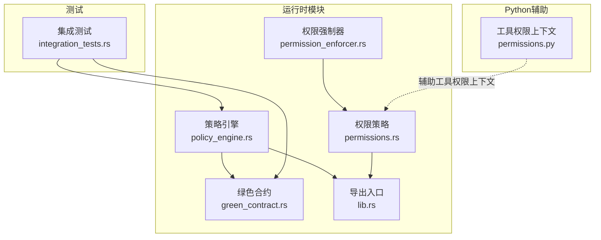
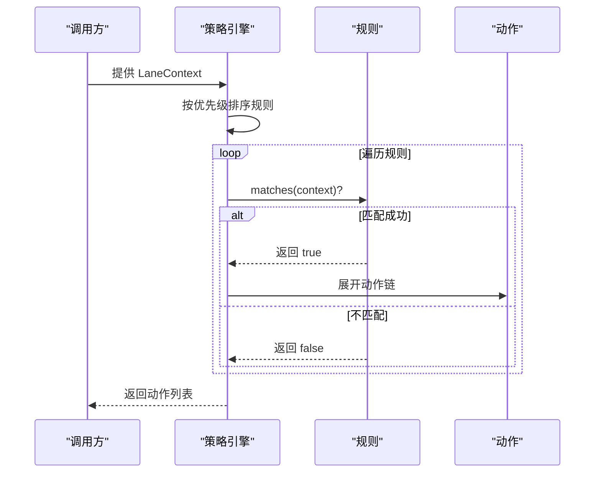
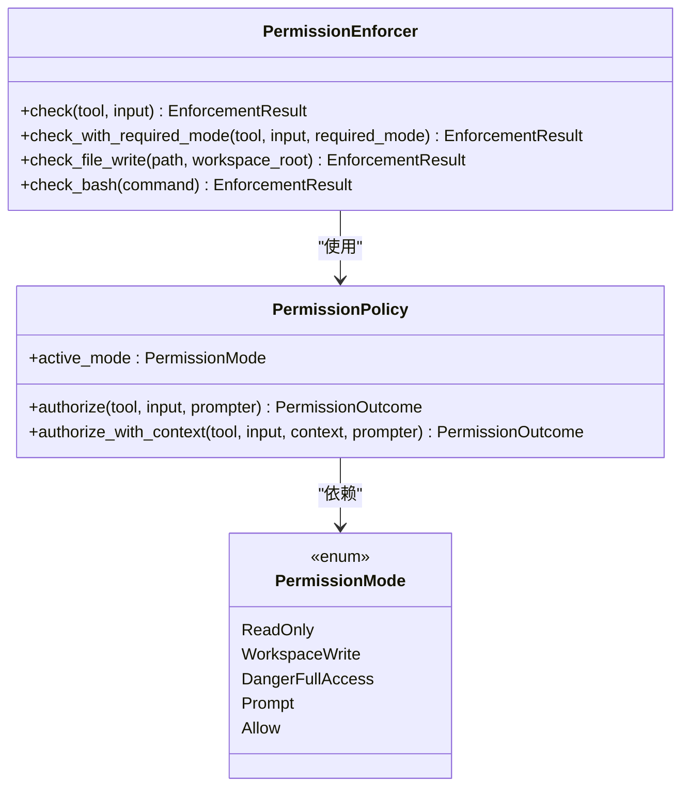
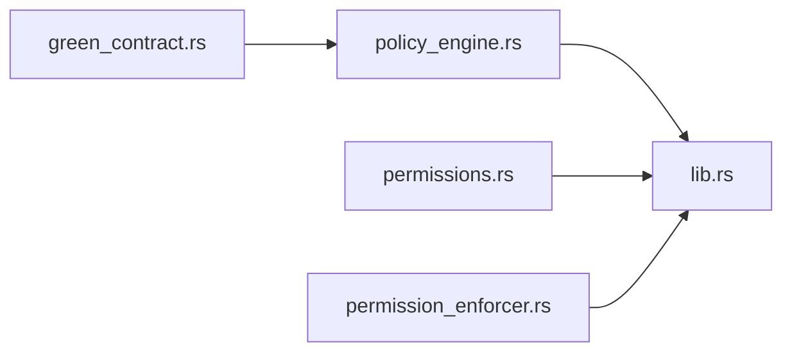

# 策略引擎

<cite>
**本文引用的文件**
- [policy_engine.rs](file://rust/crates/runtime/src/policy_engine.rs)
- [permission_enforcer.rs](file://rust/crates/runtime/src/permission_enforcer.rs)
- [permissions.rs](file://rust/crates/runtime/src/permissions.rs)
- [permissions.py](file://src/permissions.py)
- [lib.rs](file://rust/crates/runtime/src/lib.rs)
- [integration_tests.rs](file://rust/crates/runtime/tests/integration_tests.rs)
- [green_contract.rs](file://rust/crates/runtime/src/green_contract.rs)
- [init.rs](file://rust/crates/rusty-claude-cli/src/init.rs)
</cite>

## 目录
1. [简介](#简介)
2. [项目结构](#项目结构)
3. [核心组件](#核心组件)
4. [架构总览](#架构总览)
5. [详细组件分析](#详细组件分析)
6. [依赖关系分析](#依赖关系分析)
7. [性能考量](#性能考量)
8. [故障排查指南](#故障排查指南)
9. [结论](#结论)
10. [附录](#附录)

## 简介
本文件系统性地文档化策略引擎的设计与实现，涵盖策略解析、评估与执行流程、优先级与冲突处理、与权限系统的集成方式、在不同场景下的应用、配置示例、性能优化与调试方法，并提供扩展接口与自定义策略的实现指南。策略引擎以“规则-条件-动作”的形式表达业务决策，结合上下文（LaneContext）进行匹配与求值，最终输出一系列动作序列，用于驱动自动化流程（如合并、清理、通知、恢复等）。

## 项目结构
策略引擎位于 Rust 运行时模块中，采用清晰的分层设计：
- 规则与条件：定义策略规则、条件组合器与上下文类型
- 动作与原因：定义可执行的动作及特定原因枚举
- 引擎：负责规则排序、匹配与动作展开
- 权限系统：独立于策略引擎，但与工具执行前的授权检查紧密协作
- 集成测试：验证策略引擎与绿色合约、过期分支、回收配方等模块的协同

图表来源
- [policy_engine.rs:184-216](file://rust/crates/runtime/src/policy_engine.rs#L184-L216)
- [permissions.rs:98-333](file://rust/crates/runtime/src/permissions.rs#L98-L333)
- [permission_enforcer.rs:26-101](file://rust/crates/runtime/src/permission_enforcer.rs#L26-L101)
- [green_contract.rs:30-72](file://rust/crates/runtime/src/green_contract.rs#L30-L72)
- [lib.rs:126-129](file://rust/crates/runtime/src/lib.rs#L126-L129)
- [permissions.py:6-21](file://src/permissions.py#L6-L21)
- [integration_tests.rs:15-116](file://rust/crates/runtime/tests/integration_tests.rs#L15-L116)

章节来源
- [lib.rs:126-129](file://rust/crates/runtime/src/lib.rs#L126-L129)

## 核心组件
- 策略规则（PolicyRule）
  - 字段：名称、条件、动作、优先级
  - 匹配：基于条件与上下文判断是否触发
- 条件（PolicyCondition）
  - 组合器：And、Or（支持嵌套）
  - 基元条件：绿度阈值、过期分支、启动阻塞、完成/和解、评审通过、差异范围、超时
- 动作（PolicyAction）
  - 合并到开发、向前合并、一次性恢复、升级、关闭、清理会话、和解、通知、阻断、动作链
- 上下文（LaneContext）
  - 车道标识、绿度等级、分支新鲜度、阻塞者、评审状态、差异范围、完成/和解标志
- 引擎（PolicyEngine）
  - 构造时按优先级排序规则；评估时遍历匹配规则并展开动作链

章节来源
- [policy_engine.rs:7-182](file://rust/crates/runtime/src/policy_engine.rs#L7-L182)

## 架构总览
策略引擎的执行路径如下：
- 输入：LaneContext
- 处理：按优先级顺序匹配规则，条件匹配后将动作展开为线性序列
- 输出：动作列表（按优先级顺序）

图表来源
- [policy_engine.rs:189-216](file://rust/crates/runtime/src/policy_engine.rs#L189-L216)

## 详细组件分析

### 策略规则与条件
- 规则结构
  - 名称：便于审计与日志
  - 条件：可为单个条件或 And/Or 组合
  - 动作：可为单一动作或动作链
  - 优先级：数值越大优先级越高
- 条件类型
  - And：所有子条件必须满足
  - Or：任一子条件满足即可
  - GreenAt：绿度等级达到指定阈值
  - StaleBranch：分支新鲜度超过阈值
  - StartupBlocked/LaneCompleted/LaneReconciled/ReviewPassed/ScopedDiff/TimedOut：语义明确的状态条件
- 评估逻辑
  - 递归匹配组合器
  - 对于空 And 返回真，空 Or 返回假（符合布尔代数恒等式）

章节来源
- [policy_engine.rs:37-71](file://rust/crates/runtime/src/policy_engine.rs#L37-L71)

### 动作与和解原因
- 动作类型
  - 合并到开发、向前合并、一次性恢复、升级、关闭、清理会话、和解、通知、阻断、动作链
- 和解原因
  - 已合并、被替代、差异为空、手动关闭
- 动作链展开
  - 将嵌套动作链扁平化为线性动作序列，保持顺序

章节来源
- [policy_engine.rs:73-111](file://rust/crates/runtime/src/policy_engine.rs#L73-L111)

### 上下文与阈值
- 上下文字段
  - 车道标识、绿度等级、分支新鲜度、阻塞者、评审状态、差异范围、完成/和解标志
- 阈值常量
  - 分支过期阈值：默认 1 小时
- 默认上下文
  - 提供“已和解”上下文构造器，便于快速表达“无需进一步行动”的场景

章节来源
- [policy_engine.rs:133-182](file://rust/crates/runtime/src/policy_engine.rs#L133-L182)

### 引擎与评估流程
- 排序
  - 构造时按优先级升序排序，保证高优先级规则先被评估
- 评估
  - 遍历规则，匹配即展开动作，最后返回动作列表
- 稳定性
  - 测试覆盖了相同优先级规则的稳定排序行为

章节来源
- [policy_engine.rs:188-216](file://rust/crates/runtime/src/policy_engine.rs#L188-L216)

### 权限系统集成
- 权限策略（PermissionPolicy）
  - 模式：只读、工作区写入、危险全权限、提示、允许
  - 工具需求：为特定工具设置所需模式
  - 规则：允许/拒绝/询问三类规则，支持通配与前缀匹配
  - 授权流程：先检查拒绝规则，再根据钩子覆盖、询问规则、模式比较决定放行或提示
- 权限强制器（PermissionEnforcer）
  - 面向工具执行前的检查，支持动态所需模式分类
  - 文件写入与 Bash 命令的边界检查与启发式判定
- Python 工具权限上下文
  - 提供工具名与前缀的拒绝集合，便于在 Python 层面快速构建权限上下文

图表来源
- [permissions.rs:98-333](file://rust/crates/runtime/src/permissions.rs#L98-L333)
- [permission_enforcer.rs:26-174](file://rust/crates/runtime/src/permission_enforcer.rs#L26-L174)

章节来源
- [permissions.rs:98-333](file://rust/crates/runtime/src/permissions.rs#L98-L333)
- [permission_enforcer.rs:26-174](file://rust/crates/runtime/src/permission_enforcer.rs#L26-L174)
- [permissions.py:6-21](file://src/permissions.py#L6-L21)

### 绿色合约与策略引擎的协同
- 绿色合约（GreenContract）
  - 定义绿度等级与满足判定
  - 可用于策略条件中的绿度阈值判断
- 协同点
  - 策略条件可引用绿度等级，从而将质量门禁纳入自动化流程

章节来源
- [green_contract.rs:30-72](file://rust/crates/runtime/src/green_contract.rs#L30-L72)
- [policy_engine.rs:41-41](file://rust/crates/runtime/src/policy_engine.rs#L41-L41)

### 集成测试场景
- 过期分支：超过阈值触发合并动作，未超过阈值不触发
- 绿色合约：满足要求时允许合并，不满足时阻断
- 和解场景：已和解的车道优先匹配和解规则，同时仍可能触发通用关闭规则

章节来源
- [integration_tests.rs:15-116](file://rust/crates/runtime/tests/integration_tests.rs#L15-L116)

## 依赖关系分析
- 模块内聚与耦合
  - 策略引擎与绿色合约存在语义耦合（绿度条件），但实现上保持松耦合
  - 权限系统与策略引擎相互独立，通过工具执行阶段的授权检查衔接
- 导出与使用
  - lib.rs 将策略引擎与权限相关类型统一导出，便于上层使用

图表来源
- [lib.rs:126-129](file://rust/crates/runtime/src/lib.rs#L126-L129)
- [policy_engine.rs:184-216](file://rust/crates/runtime/src/policy_engine.rs#L184-L216)
- [permissions.rs:98-333](file://rust/crates/runtime/src/permissions.rs#L98-L333)
- [permission_enforcer.rs:26-101](file://rust/crates/runtime/src/permission_enforcer.rs#L26-L101)
- [green_contract.rs:30-72](file://rust/crates/runtime/src/green_contract.rs#L30-L72)

## 性能考量
- 时间复杂度
  - 规则评估：O(R)（R 为规则数量），每条规则的条件匹配为 O(C)（C 为条件深度）
  - 排序：O(R log R)，构造时按优先级排序
- 空间复杂度
  - 规则存储：O(R)
  - 动作展开：O(A)（A 为动作总数，含动作链扁平化）
- 优化建议
  - 规则数量控制：通过分组与条件复用减少冗余规则
  - 条件简化：避免深层嵌套的 And/Or，必要时拆分为多条规则
  - 优先级策略：将高频且简单的规则置于高位，减少后续匹配成本
  - 缓存策略（建议）
    - 若上下文可哈希且稳定，可在调用方层面对“规则匹配结果 + 动作展开结果”进行缓存，键为上下文哈希
    - 对于昂贵的外部查询（如网络请求）应在动作链中延迟执行，或通过动作包装器实现幂等重试
  - 并发评估（建议）
    - 在多车道并发场景下，可将不同 LaneContext 的评估任务并行化，注意动作副作用的隔离

[本节为通用性能讨论，不直接分析具体文件]

## 故障排查指南
- 常见问题
  - 规则未触发
    - 检查上下文字段是否满足条件（如绿度、评审状态、差异范围）
    - 确认优先级排序是否导致更高优先级规则提前命中
  - 动作链顺序异常
    - 确认动作链扁平化是否符合预期
  - 权限拒绝
    - 检查当前模式与所需模式的关系
    - 查看规则匹配（允许/拒绝/询问）与钩子覆盖的影响
- 调试方法
  - 使用测试用例作为参考，逐项比对期望与实际
  - 在调用方打印上下文与匹配结果，定位条件不满足的具体项
  - 对权限检查增加日志，记录工具名、输入摘要、所需模式与当前模式

章节来源
- [integration_tests.rs:15-116](file://rust/crates/runtime/tests/integration_tests.rs#L15-L116)
- [permission_enforcer.rs:37-100](file://rust/crates/runtime/src/permission_enforcer.rs#L37-L100)
- [permissions.rs:164-292](file://rust/crates/runtime/src/permissions.rs#L164-L292)

## 结论
策略引擎以简洁而强大的规则-条件-动作模型，实现了对复杂业务场景的自动化决策。其优先级排序与动作链展开提供了灵活的执行编排能力；与权限系统的分离设计确保了安全控制的独立性与可扩展性。通过合理的规则组织、条件简化与缓存策略，可以在保证正确性的前提下获得良好的性能表现。

## 附录

### 策略规则定义格式与优先级
- 规则结构
  - 名称：字符串
  - 条件：单个条件或 And/Or 组合
  - 动作：单个动作或动作链
  - 优先级：u32 数值，数值越大优先级越高
- 优先级处理
  - 构造时按优先级升序排序，评估时先评估高优先级规则
- 冲突解决
  - 通过优先级与条件组合器实现显式冲突控制；若需要“互斥”效果，可通过条件反向或调整优先级实现

章节来源
- [policy_engine.rs:7-35](file://rust/crates/runtime/src/policy_engine.rs#L7-L35)
- [policy_engine.rs:189-194](file://rust/crates/runtime/src/policy_engine.rs#L189-L194)

### 策略引擎与权限系统的集成
- 工具执行前的授权检查
  - 使用 PermissionEnforcer 对工具名与输入进行检查
  - 支持动态所需模式分类（如 Bash 命令的只读/修改态）
- 文件操作与命令边界
  - 文件写入需在工作区边界内，否则要求更高权限
  - Bash 命令采用启发式判定只读命令，避免误判
- 钩子覆盖
  - 允许钩子在授权前注入覆盖决策（允许/拒绝/询问）

章节来源
- [permission_enforcer.rs:37-174](file://rust/crates/runtime/src/permission_enforcer.rs#L37-L174)
- [permissions.rs:164-333](file://rust/crates/runtime/src/permissions.rs#L164-L333)

### 不同场景下的策略应用
- 过期分支
  - 当分支新鲜度超过阈值时触发合并动作
- 绿色合约
  - 满足绿度要求时允许合并，否则阻断
- 和解场景
  - 已和解的车道优先匹配和解规则，随后可能触发通用关闭规则

章节来源
- [integration_tests.rs:15-116](file://rust/crates/runtime/tests/integration_tests.rs#L15-L116)
- [policy_engine.rs:41-48](file://rust/crates/runtime/src/policy_engine.rs#L41-L48)

### 策略配置示例（概念性）
- 示例目标
  - 当绿度达到工作区级别且评审通过时，合并到开发分支
  - 当分支过期时，向前合并
  - 当启动阻塞时，先恢复一次，再升级
- 规则要点
  - 使用 And 组合多个条件
  - 使用 Chain 组合多个动作
  - 设置合理优先级以避免冲突

章节来源
- [policy_engine.rs:240-332](file://rust/crates/runtime/src/policy_engine.rs#L240-L332)

### 性能优化技巧
- 规则与条件优化
  - 减少深层嵌套，拆分复杂条件
  - 控制规则数量，避免重复与冗余
- 缓存与并发
  - 在调用方层面对评估结果进行缓存
  - 在多车道场景下并行评估不同上下文
- 日志与可观测性
  - 记录规则匹配与动作执行的关键路径，便于定位性能瓶颈

[本节为通用指导，不直接分析具体文件]

### 调试方法
- 单元测试
  - 利用现有测试用例作为模板，新增场景化测试
- 打印上下文
  - 在调用方打印 LaneContext 关键字段与匹配结果
- 权限检查日志
  - 记录工具名、输入摘要、所需模式与当前模式，便于排查权限问题

章节来源
- [integration_tests.rs:15-116](file://rust/crates/runtime/tests/integration_tests.rs#L15-L116)
- [permission_enforcer.rs:37-100](file://rust/crates/runtime/src/permission_enforcer.rs#L37-L100)

### 扩展接口与自定义策略实现指南
- 自定义条件
  - 新增条件类型并在匹配函数中实现逻辑
  - 注意组合器的恒等式（空 And 为真，空 Or 为假）
- 自定义动作
  - 新增动作类型并在动作链展开时处理
  - 明确动作副作用与幂等性
- 权限规则扩展
  - 通过规则语法（允许/拒绝/询问）与钩子覆盖实现细粒度控制
  - 使用 Python 工具权限上下文快速构建拒绝集合
- 配置与初始化
  - 通过运行时配置加载权限规则，初始化策略引擎与权限策略
  - 参考 CLI 初始化流程中的默认配置示例

章节来源
- [permissions.rs:130-148](file://rust/crates/runtime/src/permissions.rs#L130-L148)
- [permissions.py:6-21](file://src/permissions.py#L6-L21)
- [init.rs:4-10](file://rust/crates/rusty-claude-cli/src/init.rs#L4-L10)