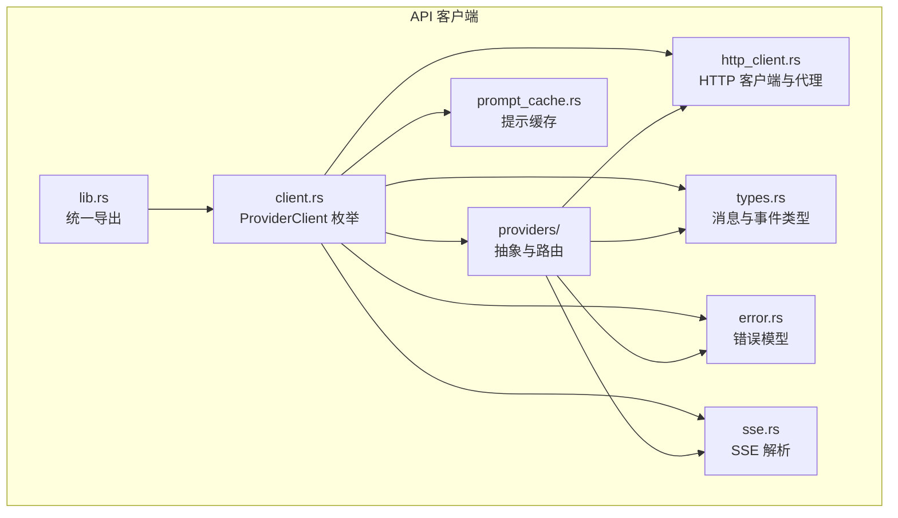
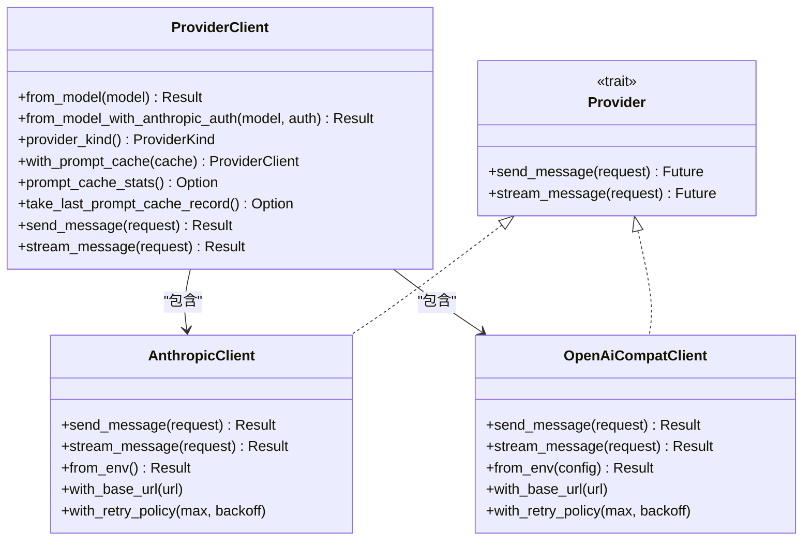
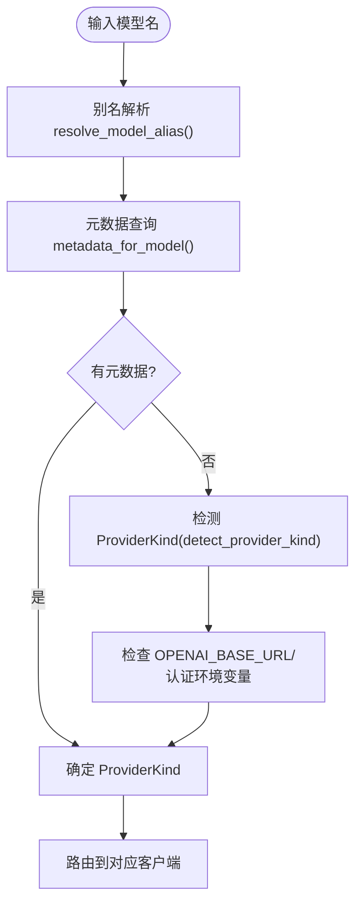
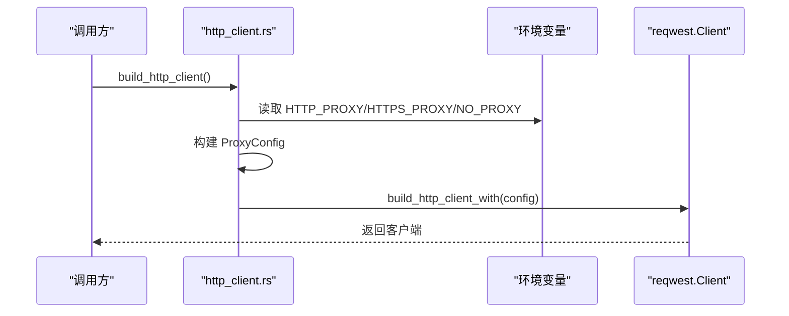
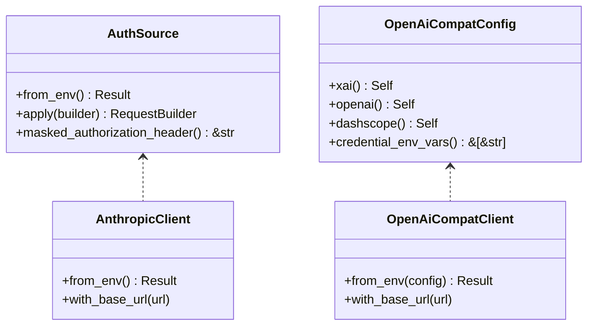
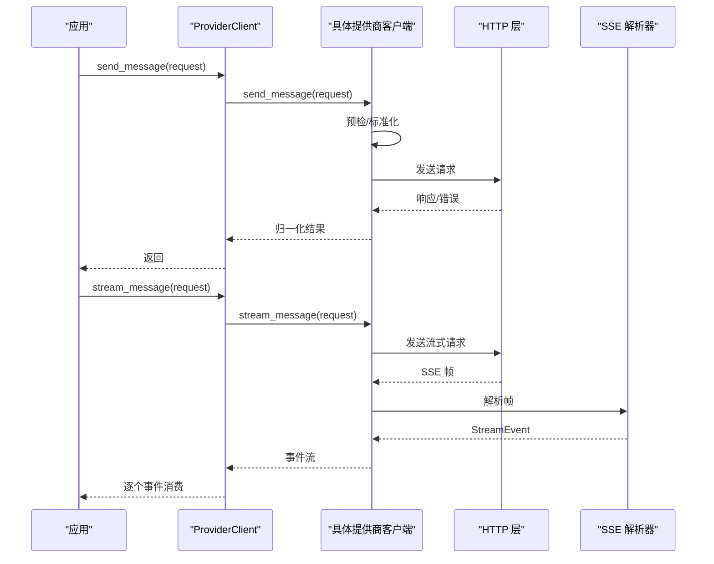
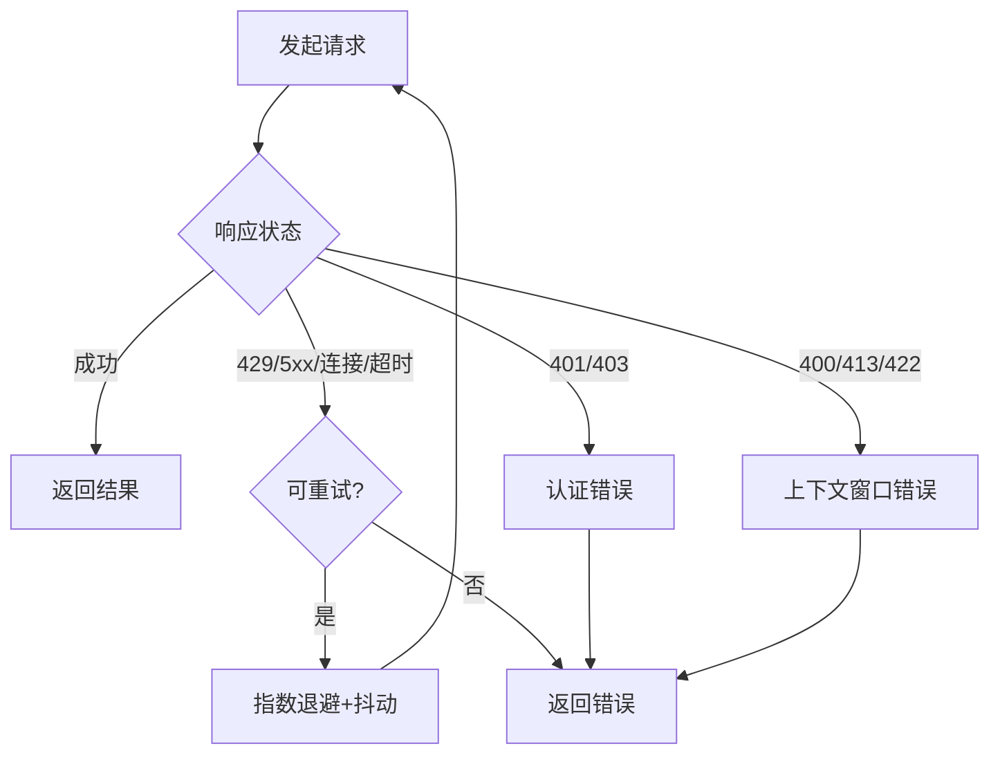
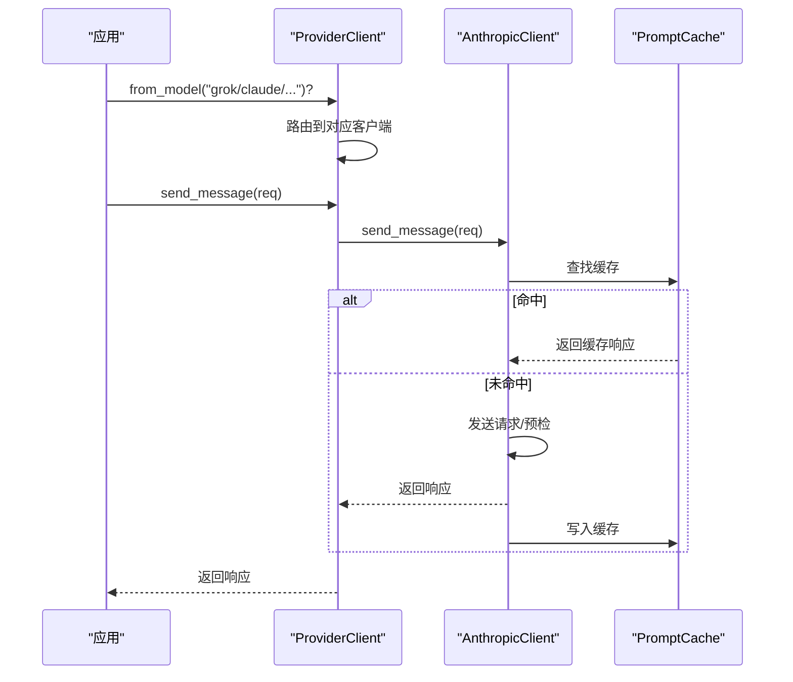
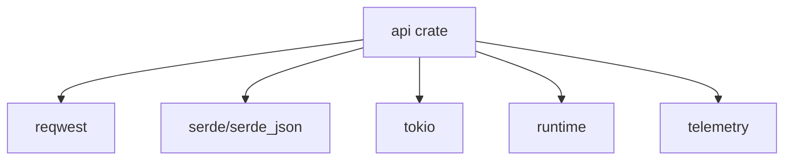

# API 客户端架构

<cite>
**本文档引用的文件**
- [lib.rs](file://rust/crates/api/src/lib.rs)
- [client.rs](file://rust/crates/api/src/client.rs)
- [mod.rs](file://rust/crates/api/src/providers/mod.rs)
- [anthropic.rs](file://rust/crates/api/src/providers/anthropic.rs)
- [openai_compat.rs](file://rust/crates/api/src/providers/openai_compat.rs)
- [http_client.rs](file://rust/crates/api/src/http_client.rs)
- [types.rs](file://rust/crates/api/src/types.rs)
- [error.rs](file://rust/crates/api/src/error.rs)
- [sse.rs](file://rust/crates/api/src/sse.rs)
- [prompt_cache.rs](file://rust/crates/api/src/prompt_cache.rs)
- [Cargo.toml](file://rust/crates/api/Cargo.toml)
- [client_integration.rs](file://rust/crates/api/tests/client_integration.rs)
</cite>

## 目录
1. [简介](#简介)
2. [项目结构](#项目结构)
3. [核心组件](#核心组件)
4. [架构总览](#架构总览)
5. [详细组件分析](#详细组件分析)
6. [依赖关系分析](#依赖关系分析)
7. [性能考虑](#性能考虑)
8. [故障排除指南](#故障排除指南)
9. [结论](#结论)
10. [附录](#附录)

## 简介
本文件系统性阐述多提供商支持的 API 客户端架构，涵盖提供商抽象层、HTTP 客户端实现、认证机制与请求路由策略。重点说明如何统一处理不同提供商的 API 差异（请求格式转换、响应解析、错误处理），以及提供商切换机制、重试与退避策略。同时提供集成新提供商和扩展多提供商支持的架构指导。

## 项目结构
该 API 客户端位于 Rust 工作区的 `rust/crates/api` 目录中，采用模块化设计：
- 核心导出：通过 lib.rs 暴露统一接口（ProviderClient、类型、错误、HTTP 客户端等）
- 提供商抽象：providers/mod.rs 定义 Provider trait 和通用路由逻辑
- 具体提供商：providers/anthropic.rs 和 providers/openai_compat.rs 实现具体客户端
- HTTP 层：http_client.rs 封装代理配置与客户端构建
- 类型与事件：types.rs 定义消息请求/响应与流式事件模型
- SSE 解析：sse.rs 处理服务器推送事件解析
- 错误模型：error.rs 统一错误分类与可重试判定
- 提示缓存：prompt_cache.rs 实现提示词缓存与命中统计
- 测试：tests/client_integration.rs 验证端到端行为

图表来源
- [lib.rs:1-40](file://rust/crates/api/src/lib.rs#L1-L40)
- [client.rs:1-239](file://rust/crates/api/src/client.rs#L1-L239)
- [mod.rs:1-800](file://rust/crates/api/src/providers/mod.rs#L1-L800)
- [http_client.rs:1-345](file://rust/crates/api/src/http_client.rs#L1-L345)
- [types.rs:1-311](file://rust/crates/api/src/types.rs#L1-L311)
- [error.rs:1-573](file://rust/crates/api/src/error.rs#L1-L573)
- [sse.rs:1-331](file://rust/crates/api/src/sse.rs#L1-L331)
- [prompt_cache.rs:1-736](file://rust/crates/api/src/prompt_cache.rs#L1-L736)

章节来源
- [lib.rs:1-40](file://rust/crates/api/src/lib.rs#L1-L40)
- [Cargo.toml:1-18](file://rust/crates/api/Cargo.toml#L1-L18)

## 核心组件
- ProviderClient 枚举：统一承载 Anthropic、xAI、OpenAI 客户端实例，屏蔽提供商差异，提供一致的 send_message/stream_message 接口。
- Provider 抽象：定义 send_message/stream_message 的异步接口，便于新增提供商实现。
- HTTP 客户端与代理：封装代理读取、校验与构建，支持 HTTP_PROXY/HTTPS_PROXY/NO_PROXY 环境变量。
- 认证源：AuthSource（Anthropic）与 OpenAiCompatConfig（xAI/OpenAI/DashScope）统一管理密钥与基础 URL。
- 请求/响应类型：MessageRequest/MessageResponse/StreamEvent 等标准化数据结构。
- SSE 解析器：SseParser 统一解析提供商返回的 SSE 帧并转换为内部事件。
- 错误模型：ApiError 统一错误分类、可重试判定与安全失败分类。
- 提示缓存：PromptCache 支持完成结果缓存与命中统计，仅 Anthropic 客户端启用。

章节来源
- [client.rs:8-130](file://rust/crates/api/src/client.rs#L8-L130)
- [mod.rs:16-30](file://rust/crates/api/src/providers/mod.rs#L16-L30)
- [http_client.rs:14-113](file://rust/crates/api/src/http_client.rs#L14-L113)
- [anthropic.rs:32-96](file://rust/crates/api/src/providers/anthropic.rs#L32-L96)
- [openai_compat.rs:28-84](file://rust/crates/api/src/providers/openai_compat.rs#L28-L84)
- [types.rs:5-266](file://rust/crates/api/src/types.rs#L5-L266)
- [sse.rs:4-80](file://rust/crates/api/src/sse.rs#L4-L80)
- [error.rs:20-66](file://rust/crates/api/src/error.rs#L20-L66)
- [prompt_cache.rs:19-106](file://rust/crates/api/src/prompt_cache.rs#L19-L106)

## 架构总览
多提供商架构以 ProviderClient 为中心，通过 Provider 抽象与路由策略选择具体提供商实现。HTTP 层负责网络与代理，认证层负责密钥与基础 URL，类型层统一请求/响应，SSE 层解析流式事件，错误层统一异常处理，缓存层优化重复请求。

图表来源
- [client.rs:9-106](file://rust/crates/api/src/client.rs#L9-L106)
- [mod.rs:16-30](file://rust/crates/api/src/providers/mod.rs#L16-L30)
- [anthropic.rs:113-125](file://rust/crates/api/src/providers/anthropic.rs#L113-L125)
- [openai_compat.rs:86-95](file://rust/crates/api/src/providers/openai_compat.rs#L86-L95)

## 详细组件分析

### 提供商抽象层与路由策略
- Provider trait：定义统一的异步发送与流式接口，便于扩展新提供商。
- ProviderKind：枚举 Anthropic、xAI、OpenAI，用于路由与元数据查询。
- 路由策略：
  - 别名解析：resolve_model_alias 将简写映射为实际模型名。
  - 元数据查询：metadata_for_model 返回提供商、认证环境变量、基础 URL 与默认值。
  - 检测优先级：先按模型前缀/命名空间确定提供商；若无明确前缀，则根据环境变量与本地配置推断。
  - 特殊场景：DashScope 使用 OpenAI 兼容客户端但指向特定兼容模式端点。

图表来源
- [mod.rs:127-229](file://rust/crates/api/src/providers/mod.rs#L127-L229)
- [mod.rs:52-198](file://rust/crates/api/src/providers/mod.rs#L52-L198)

章节来源
- [mod.rs:16-36](file://rust/crates/api/src/providers/mod.rs#L16-L36)
- [mod.rs:127-151](file://rust/crates/api/src/providers/mod.rs#L127-L151)
- [mod.rs:153-198](file://rust/crates/api/src/providers/mod.rs#L153-L198)
- [mod.rs:200-229](file://rust/crates/api/src/providers/mod.rs#L200-L229)

### HTTP 客户端与代理配置
- ProxyConfig：从环境变量读取 HTTP_PROXY/HTTPS_PROXY/NO_PROXY，支持大小写键与统一代理 URL。
- build_http_client/build_http_client_with：基于 ProxyConfig 构建 reqwest 客户端，支持回退策略。
- 代理优先级：当设置 proxy_url 时覆盖 per-scheme 配置；NO_PROXY 过滤域名列表。

图表来源
- [http_client.rs:23-113](file://rust/crates/api/src/http_client.rs#L23-L113)

章节来源
- [http_client.rs:14-58](file://rust/crates/api/src/http_client.rs#L14-L58)
- [http_client.rs:63-113](file://rust/crates/api/src/http_client.rs#L63-L113)

### 认证机制
- Anthropic：
  - AuthSource：支持 API Key、Bearer Token、组合认证；从环境变量或保存的凭据加载。
  - OAuth：支持令牌交换与刷新，过期检测与保存。
- OpenAI 兼容：
  - OpenAiCompatConfig：封装提供商名称、API Key 环境变量、基础 URL 环境变量与默认值。
  - 三类后端：xAI、OpenAI、DashScope（阿里云），分别使用不同环境变量与默认基础 URL。
- 基础 URL 读取：各提供商提供 read_base_url/read_base_url(config) 读取环境变量或默认值。

图表来源
- [anthropic.rs:32-96](file://rust/crates/api/src/providers/anthropic.rs#L32-L96)
- [anthropic.rs:619-674](file://rust/crates/api/src/providers/anthropic.rs#L619-L674)
- [openai_compat.rs:28-84](file://rust/crates/api/src/providers/openai_compat.rs#L28-L84)
- [openai_compat.rs:107-127](file://rust/crates/api/src/providers/openai_compat.rs#L107-L127)

章节来源
- [anthropic.rs:43-96](file://rust/crates/api/src/providers/anthropic.rs#L43-L96)
- [anthropic.rs:619-674](file://rust/crates/api/src/providers/anthropic.rs#L619-L674)
- [openai_compat.rs:28-84](file://rust/crates/api/src/providers/openai_compat.rs#L28-L84)
- [openai_compat.rs:107-127](file://rust/crates/api/src/providers/openai_compat.rs#L107-L127)

### 请求与响应处理
- 请求标准化：OpenAI 兼容客户端在发送前将请求翻译为统一格式，剥离路由前缀，处理工具调用等字段。
- 响应归一化：OpenAI 兼容客户端解析聊天补全响应并转换为统一 MessageResponse 结构，处理错误对象与空 usage 默认值。
- 上下文窗口预检：在发送前估算请求大小，避免超限请求进入网络层。
- SSE 流解析：SseParser 将提供商的 SSE 帧解析为统一的 StreamEvent 序列，支持 ping/done 忽略与增量拼接。

图表来源
- [client.rs:82-106](file://rust/crates/api/src/client.rs#L82-L106)
- [openai_compat.rs:148-197](file://rust/crates/api/src/providers/openai_compat.rs#L148-L197)
- [openai_compat.rs:199-215](file://rust/crates/api/src/providers/openai_compat.rs#L199-L215)
- [mod.rs:274-292](file://rust/crates/api/src/providers/mod.rs#L274-L292)
- [sse.rs:28-51](file://rust/crates/api/src/sse.rs#L28-L51)

章节来源
- [types.rs:5-136](file://rust/crates/api/src/types.rs#L5-L136)
- [openai_compat.rs:148-197](file://rust/crates/api/src/providers/openai_compat.rs#L148-L197)
- [openai_compat.rs:199-215](file://rust/crates/api/src/providers/openai_compat.rs#L199-L215)
- [mod.rs:274-292](file://rust/crates/api/src/providers/mod.rs#L274-L292)
- [sse.rs:82-128](file://rust/crates/api/src/sse.rs#L82-L128)

### 错误处理与可重试策略
- ApiError：统一错误类型，包含缺失凭证、上下文窗口超限、OAuth 过期、HTTP、JSON 解析、API 错误、重试耗尽、无效 SSE 帧、退避溢出等。
- 可重试判定：根据错误类型与状态码判断是否可重试，支持指数退避与抖动。
- 失败分类：safe_failure_class 将错误映射为安全分类，便于统计与告警。

图表来源
- [error.rs:118-134](file://rust/crates/api/src/error.rs#L118-L134)
- [error.rs:154-176](file://rust/crates/api/src/error.rs#L154-L176)
- [anthropic.rs:401-464](file://rust/crates/api/src/providers/anthropic.rs#L401-L464)
- [openai_compat.rs:217-246](file://rust/crates/api/src/providers/openai_compat.rs#L217-L246)

章节来源
- [error.rs:20-66](file://rust/crates/api/src/error.rs#L20-L66)
- [error.rs:118-176](file://rust/crates/api/src/error.rs#L118-L176)
- [anthropic.rs:401-464](file://rust/crates/api/src/providers/anthropic.rs#L401-L464)
- [openai_compat.rs:217-246](file://rust/crates/api/src/providers/openai_compat.rs#L217-L246)

### 提示缓存与提供商切换
- 提示缓存：PromptCache 以请求指纹为键缓存完成结果，支持 TTL、命中/未命中统计与意外断开检测。
- 切换机制：ProviderClient::from_model/from_model_with_anthropic_auth 根据模型别名与元数据自动选择 Anthropic/xAI/OpenAI 客户端；支持在 Anthropic 客户端上启用缓存。
- 流式事件：MessageStream 包装不同提供商的流式实现，统一 next_event 接口。

图表来源
- [client.rs:16-47](file://rust/crates/api/src/client.rs#L16-L47)
- [prompt_cache.rs:144-193](file://rust/crates/api/src/prompt_cache.rs#L144-L193)
- [anthropic.rs:283-337](file://rust/crates/api/src/providers/anthropic.rs#L283-L337)

章节来源
- [prompt_cache.rs:19-106](file://rust/crates/api/src/prompt_cache.rs#L19-L106)
- [client.rs:58-80](file://rust/crates/api/src/client.rs#L58-L80)
- [anthropic.rs:283-337](file://rust/crates/api/src/providers/anthropic.rs#L283-L337)

## 依赖关系分析
- 外部依赖：reqwest（HTTP）、serde/serde_json（序列化）、tokio（异步运行时）、runtime/telemetry（运行时与遥测）。
- 内部模块：lib.rs 作为统一入口，其他模块按职责分层，耦合度低，扩展性强。

图表来源
- [Cargo.toml:8-14](file://rust/crates/api/Cargo.toml#L8-L14)

章节来源
- [Cargo.toml:1-18](file://rust/crates/api/Cargo.toml#L1-L18)

## 性能考虑
- 指数退避与抖动：避免雪崩效应，提升重试稳定性。
- 上下文窗口预检：在发送前估算请求大小，减少无效网络往返。
- SSE 增量解析：按帧增量解析，降低内存峰值。
- 提示缓存命中：显著降低重复请求的网络与计算成本。
- 代理配置：合理设置代理与 NO_PROXY，避免不必要的网络绕行。

## 故障排除指南
- 缺少凭证：ApiError::MissingCredentials，提供提供商与环境变量提示；Anthropic 会根据其他提供商环境变量给出修复建议。
- 上下文窗口超限：ApiError::ContextWindowExceeded，检查模型限制与请求内容大小。
- 重试耗尽：ApiError::RetriesExhausted，查看最后一次错误类型与状态码。
- 无效 SSE 帧：ApiError::InvalidSseFrame，检查上游 SSE 输出格式。
- 代理配置错误：build_http_client_with 返回 ApiError::Http，检查代理 URL 与 NO_PROXY 规则。

章节来源
- [error.rs:231-329](file://rust/crates/api/src/error.rs#L231-L329)
- [mod.rs:349-373](file://rust/crates/api/src/providers/mod.rs#L349-L373)
- [http_client.rs:262-280](file://rust/crates/api/src/http_client.rs#L262-L280)

## 结论
该多提供商 API 客户端通过 Provider 抽象与统一的 ProviderClient 接口，实现了对 Anthropic、xAI、OpenAI/DashScope 的无缝集成。借助标准化的请求/响应模型、SSE 解析、HTTP 代理与错误分类，系统在复杂网络环境下具备良好的鲁棒性与可扩展性。提示缓存进一步提升了重复请求的性能表现。未来扩展新提供商只需实现 Provider trait 并在路由层注册即可。

## 附录

### 集成新提供商的架构指导
- 实现 Provider trait：提供 send_message/stream_message 的异步实现。
- 定义配置结构：如 OpenAiCompatConfig，包含提供商名称、密钥环境变量、基础 URL 环境变量与默认值。
- 注册路由：在 metadata_for_model/detect_provider_kind 中添加模型前缀与元数据，确保路由正确。
- 认证与基础 URL：提供 from_env 与 read_base_url 方法，支持环境变量与配置文件。
- 错误与重试：遵循 ApiError 分类，合理设置 is_retryable 与 safe_failure_class。
- 测试与验证：编写单元与集成测试，覆盖请求格式转换、响应解析、错误路径与流式事件。

章节来源
- [mod.rs:16-30](file://rust/crates/api/src/providers/mod.rs#L16-L30)
- [openai_compat.rs:28-84](file://rust/crates/api/src/providers/openai_compat.rs#L28-L84)
- [openai_compat.rs:107-127](file://rust/crates/api/src/providers/openai_compat.rs#L107-L127)
- [client_integration.rs:460-500](file://rust/crates/api/tests/client_integration.rs#L460-L500)