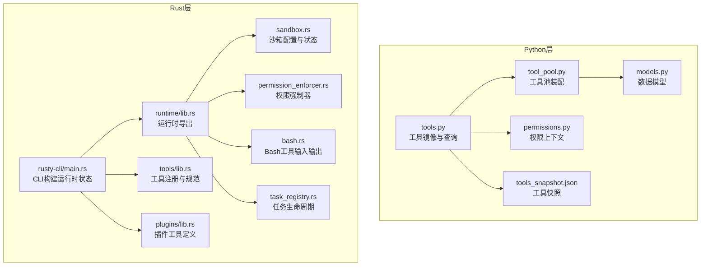
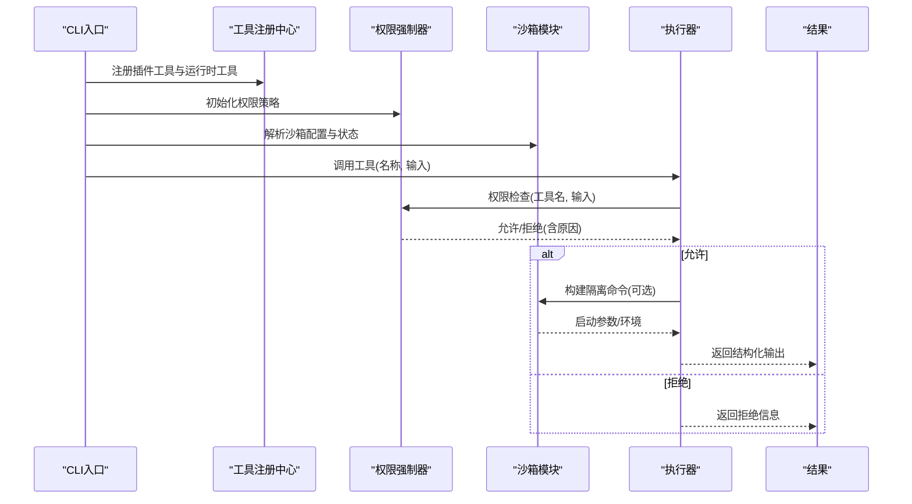
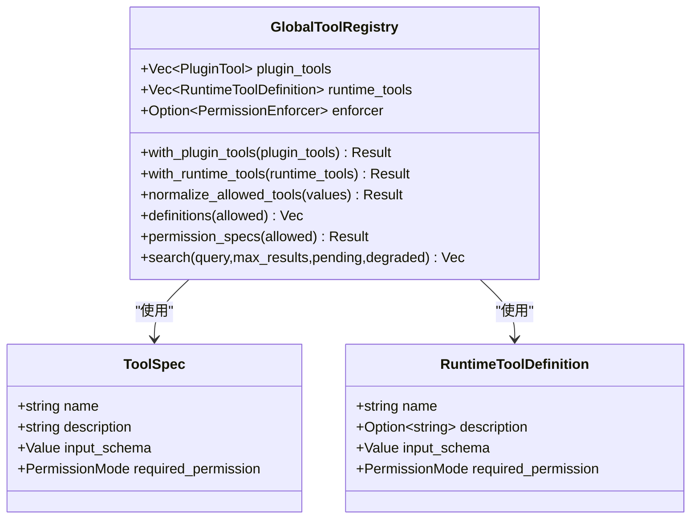
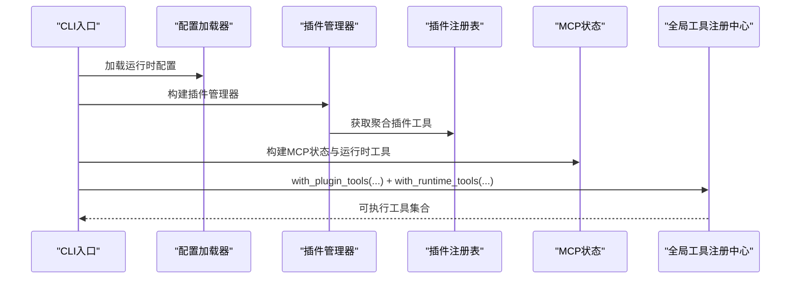
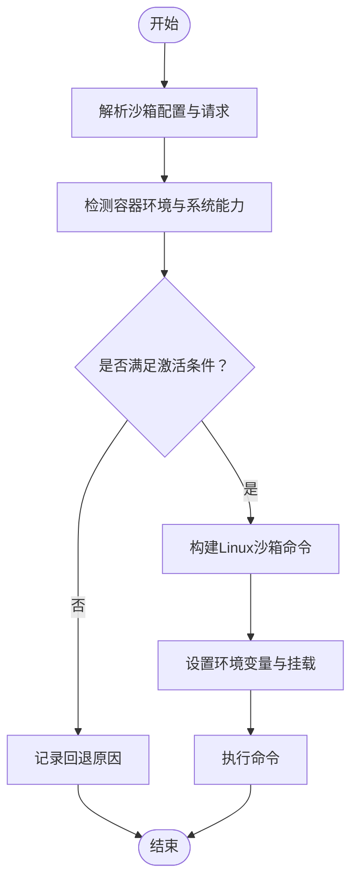
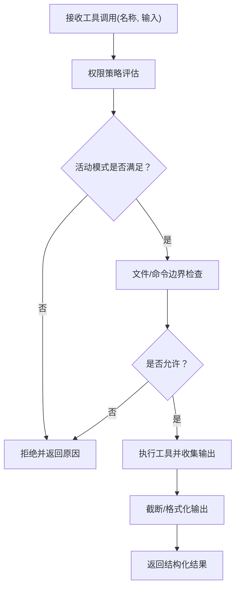
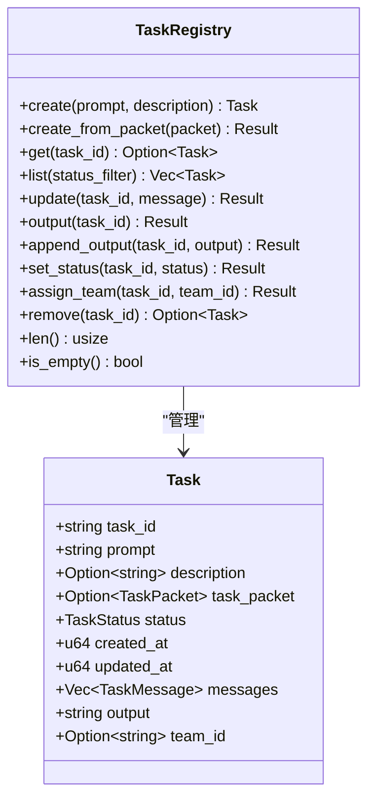
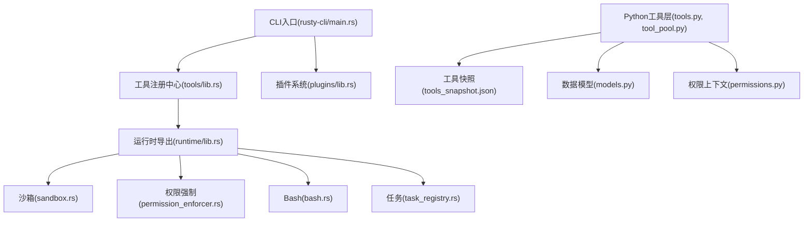

# 工具系统架构

<cite>
**本文档引用的文件**
- [tools/lib.rs](file://rust/crates/tools/src/lib.rs)
- [runtime/lib.rs](file://rust/crates/runtime/src/lib.rs)
- [sandbox.rs](file://rust/crates/runtime/src/sandbox.rs)
- [permission_enforcer.rs](file://rust/crates/runtime/src/permission_enforcer.rs)
- [bash.rs](file://rust/crates/runtime/src/bash.rs)
- [task_registry.rs](file://rust/crates/runtime/src/task_registry.rs)
- [plugins/lib.rs](file://rust/crates/plugins/src/lib.rs)
- [rusty-cli/main.rs](file://rust/crates/rusty-claude-cli/src/main.rs)
- [tools.py](file://src/tools.py)
- [tool_pool.py](file://src/tool_pool.py)
- [models.py](file://src/models.py)
- [permissions.py](file://src/permissions.py)
- [tools_snapshot.json](file://src/reference_data/tools_snapshot.json)
</cite>

## 目录
1. [引言](#引言)
2. [项目结构](#项目结构)
3. [核心组件](#核心组件)
4. [架构总览](#架构总览)
5. [详细组件分析](#详细组件分析)
6. [依赖关系分析](#依赖关系分析)
7. [性能考虑](#性能考虑)
8. [故障排除指南](#故障排除指南)
9. [结论](#结论)
10. [附录](#附录)

## 引言
本文件面向工具系统的架构设计与实现，覆盖工具定义、注册与执行的完整流程，重点阐述以下方面：
- 工具规范与输入输出模型
- 执行器模式（内置工具、插件工具、运行时工具）
- 沙箱隔离与资源管理
- 权限检查、参数验证与结果处理
- 生命周期管理、性能优化与安全考量
- 自定义工具开发与扩展现有工具集的实践指导

## 项目结构
该仓库采用多语言混合架构：Python侧负责工具镜像与权限过滤，Rust侧提供运行时、权限策略、沙箱隔离与工具执行器等核心能力；同时通过CLI入口将工具注册与执行串联起来。

**图表来源**
- [runtime/lib.rs:1-180](file://rust/crates/runtime/src/lib.rs#L1-L180)
- [tools/lib.rs:1-200](file://rust/crates/tools/src/lib.rs#L1-L200)
- [sandbox.rs:1-386](file://rust/crates/runtime/src/sandbox.rs#L1-L386)
- [permission_enforcer.rs:1-586](file://rust/crates/runtime/src/permission_enforcer.rs#L1-L586)
- [bash.rs:1-41](file://rust/crates/runtime/src/bash.rs#L1-L41)
- [task_registry.rs:1-504](file://rust/crates/runtime/src/task_registry.rs#L1-L504)
- [plugins/lib.rs:1-800](file://rust/crates/plugins/src/lib.rs#L1-L800)
- [rusty-cli/main.rs:6117-6148](file://rust/crates/rusty-claude-cli/src/main.rs#L6117-L6148)
- [tools.py:1-97](file://src/tools.py#L1-L97)
- [tool_pool.py:1-38](file://src/tool_pool.py#L1-L38)
- [models.py:1-50](file://src/models.py#L1-L50)
- [permissions.py:1-21](file://src/permissions.py#L1-L21)
- [tools_snapshot.json:1-800](file://src/reference_data/tools_snapshot.json#L1-L800)

**章节来源**
- [runtime/lib.rs:1-180](file://rust/crates/runtime/src/lib.rs#L1-L180)
- [tools/lib.rs:1-200](file://rust/crates/tools/src/lib.rs#L1-L200)
- [sandbox.rs:1-386](file://rust/crates/runtime/src/sandbox.rs#L1-L386)
- [permission_enforcer.rs:1-586](file://rust/crates/runtime/src/permission_enforcer.rs#L1-L586)
- [bash.rs:1-41](file://rust/crates/runtime/src/bash.rs#L1-L41)
- [task_registry.rs:1-504](file://rust/crates/runtime/src/task_registry.rs#L1-L504)
- [plugins/lib.rs:1-800](file://rust/crates/plugins/src/lib.rs#L1-L800)
- [rusty-cli/main.rs:6117-6148](file://rust/crates/rusty-claude-cli/src/main.rs#L6117-L6148)
- [tools.py:1-97](file://src/tools.py#L1-L97)
- [tool_pool.py:1-38](file://src/tool_pool.py#L1-L38)
- [models.py:1-50](file://src/models.py#L1-L50)
- [permissions.py:1-21](file://src/permissions.py#L1-L21)
- [tools_snapshot.json:1-800](file://src/reference_data/tools_snapshot.json#L1-L800)

## 核心组件
- 工具注册中心（GlobalToolRegistry）：统一管理内置工具、插件工具与运行时工具，支持名称去重与冲突检测，并提供允许列表归一化与工具检索。
- 权限强制器（PermissionEnforcer）：基于权限策略评估工具调用是否被允许，支持读写边界检查、Bash命令分类与提示模式处理。
- 沙箱模块（Sandbox）：在Linux环境下通过用户命名空间、网络与文件系统隔离实现安全执行，支持请求解析、状态判定与启动器生成。
- 运行时工具（RuntimeToolDefinition）：描述运行时发现的外部工具（如MCP工具），包含名称、描述、输入模式与所需权限。
- 插件工具（PluginTool）：通过外部进程执行的工具，具备命令、参数、权限要求与执行环境注入。
- Bash工具（BashCommandInput/Output）：内置Bash执行器的输入输出模型，支持超时、后台执行与沙箱开关。
- 任务注册表（TaskRegistry）：维护子代理任务生命周期，便于工具执行过程中的状态追踪与结果聚合。
- Python工具镜像（tools.py、tool_pool.py）：提供工具快照加载、权限过滤、工具池装配与简单模式筛选。

**章节来源**
- [tools/lib.rs:100-200](file://rust/crates/tools/src/lib.rs#L100-L200)
- [permission_enforcer.rs:26-174](file://rust/crates/runtime/src/permission_enforcer.rs#L26-L174)
- [sandbox.rs:27-208](file://rust/crates/runtime/src/sandbox.rs#L27-L208)
- [bash.rs:17-41](file://rust/crates/runtime/src/bash.rs#L17-L41)
- [task_registry.rs:55-231](file://rust/crates/runtime/src/task_registry.rs#L55-L231)
- [plugins/lib.rs:260-349](file://rust/crates/plugins/src/lib.rs#L260-L349)
- [tools.py:14-97](file://src/tools.py#L14-L97)
- [tool_pool.py:10-38](file://src/tool_pool.py#L10-L38)

## 架构总览
工具系统由“定义—注册—执行—隔离—权限—结果”闭环构成。CLI入口构建运行时状态，聚合插件工具与运行时工具，随后通过权限强制器与沙箱模块保障执行安全，最终返回结构化结果。

**图表来源**
- [rusty-cli/main.rs:6117-6148](file://rust/crates/rusty-claude-cli/src/main.rs#L6117-L6148)
- [tools/lib.rs:133-191](file://rust/crates/tools/src/lib.rs#L133-L191)
- [permission_enforcer.rs:37-100](file://rust/crates/runtime/src/permission_enforcer.rs#L37-L100)
- [sandbox.rs:211-262](file://rust/crates/runtime/src/sandbox.rs#L211-L262)
- [bash.rs:17-41](file://rust/crates/runtime/src/bash.rs#L17-L41)

## 详细组件分析

### 工具注册与规范
- 工具规范（ToolSpec）：包含名称、描述、输入JSON Schema与所需权限级别。
- 运行时工具定义（RuntimeToolDefinition）：用于描述动态发现的外部工具（如MCP工具）。
- 全局工具注册中心（GlobalToolRegistry）：
  - 支持插件工具与内置工具的合并注册，进行名称冲突检测与重复校验。
  - 提供运行时工具注册接口，确保名称唯一性。
  - 提供允许列表归一化与工具搜索能力，结合降级报告与待定服务器状态。

**图表来源**
- [tools/lib.rs:100-200](file://rust/crates/tools/src/lib.rs#L100-L200)
- [tools/lib.rs:133-191](file://rust/crates/tools/src/lib.rs#L133-L191)

**章节来源**
- [tools/lib.rs:100-200](file://rust/crates/tools/src/lib.rs#L100-L200)
- [tools/lib.rs:133-191](file://rust/crates/tools/src/lib.rs#L133-L191)

### 执行器模式与运行时集成
- CLI入口通过构建运行时插件状态，聚合插件注册表与运行时工具，形成全局工具注册中心。
- 运行时导出工具执行器、文件操作、会话控制、MCP桥接等能力，供上层调用。
- Python侧提供工具镜像与权限过滤，支持简单模式与MCP工具筛选。

**图表来源**
- [rusty-cli/main.rs:6117-6148](file://rust/crates/rusty-claude-cli/src/main.rs#L6117-L6148)
- [runtime/lib.rs:52-171](file://rust/crates/runtime/src/lib.rs#L52-L171)
- [tools.py:62-86](file://src/tools.py#L62-L86)
- [tool_pool.py:28-37](file://src/tool_pool.py#L28-L37)

**章节来源**
- [rusty-cli/main.rs:6117-6148](file://rust/crates/rusty-claude-cli/src/main.rs#L6117-L6148)
- [runtime/lib.rs:52-171](file://rust/crates/runtime/src/lib.rs#L52-L171)
- [tools.py:62-86](file://src/tools.py#L62-L86)
- [tool_pool.py:28-37](file://src/tool_pool.py#L28-L37)

### 沙箱隔离与资源管理
- 沙箱配置（SandboxConfig）与请求（SandboxRequest）：支持启用开关、命名空间限制、网络隔离、文件系统模式与挂载白名单。
- 状态解析（resolve_sandbox_status_for_request）：根据系统能力与请求条件计算实际可用状态，记录回退原因。
- Linux沙箱命令构建（build_linux_sandbox_command）：在满足条件时通过unshare生成带隔离参数的启动器，并注入环境变量与挂载路径。
- 输出截断与安全边界：内置Bash执行器对输出进行最大字节截断，避免过大输出影响性能与稳定性。

**图表来源**
- [sandbox.rs:155-208](file://rust/crates/runtime/src/sandbox.rs#L155-L208)
- [sandbox.rs:211-262](file://rust/crates/runtime/src/sandbox.rs#L211-L262)
- [bash.rs:288-304](file://rust/crates/runtime/src/bash.rs#L288-L304)

**章节来源**
- [sandbox.rs:27-208](file://rust/crates/runtime/src/sandbox.rs#L27-L208)
- [sandbox.rs:211-262](file://rust/crates/runtime/src/sandbox.rs#L211-L262)
- [bash.rs:288-304](file://rust/crates/runtime/src/bash.rs#L288-L304)

### 权限检查、参数验证与结果处理
- 权限策略（PermissionPolicy）：定义活动模式、工具特定需求、允许/拒绝/询问规则。
- 权限强制器（PermissionEnforcer）：
  - 基于策略评估工具调用许可，支持动态所需权限检查。
  - 文件写入边界检查与Bash命令只读启发式判断。
  - 在提示模式下延迟决策，交由交互流程处理。
- 参数验证：工具输入采用JSON Schema约束，配合运行时工具定义的输入模式进行校验。
- 结果处理：统一返回结构化输出，错误路径包含明确原因与必要字段。

**图表来源**
- [permission_enforcer.rs:37-100](file://rust/crates/runtime/src/permission_enforcer.rs#L37-L100)
- [permission_enforcer.rs:107-173](file://rust/crates/runtime/src/permission_enforcer.rs#L107-L173)
- [bash.rs:288-304](file://rust/crates/runtime/src/bash.rs#L288-L304)

**章节来源**
- [permission_enforcer.rs:26-174](file://rust/crates/runtime/src/permission_enforcer.rs#L26-L174)
- [bash.rs:17-41](file://rust/crates/runtime/src/bash.rs#L17-L41)

### 生命周期管理与任务编排
- 任务注册表（TaskRegistry）：提供任务创建、状态更新、消息追加、输出累积与团队分配等能力，支持终端态保护与一致性保证。
- 与工具执行的结合：在复杂工具链中，通过任务注册表跟踪中间状态与输出，便于回溯与恢复。

**图表来源**
- [task_registry.rs:34-231](file://rust/crates/runtime/src/task_registry.rs#L34-L231)

**章节来源**
- [task_registry.rs:55-231](file://rust/crates/runtime/src/task_registry.rs#L55-L231)

### 安全性与合规性
- 权限等级（ReadOnly、WorkspaceWrite、DangerFullAccess、Prompt、Allow）：逐级收紧控制范围，结合工具特定需求与工作区边界。
- Bash命令只读启发式：通过关键字与重定向/就地修改标记识别潜在破坏性操作。
- 沙箱回退与容器检测：在不满足隔离条件时提供清晰回退原因，避免误判安全状态。

**章节来源**
- [permission_enforcer.rs:193-272](file://rust/crates/runtime/src/permission_enforcer.rs#L193-L272)
- [sandbox.rs:108-208](file://rust/crates/runtime/src/sandbox.rs#L108-L208)

### 开发自定义工具与扩展现有工具集
- 插件工具（PluginTool）：通过外部命令与参数执行，支持权限标注与执行环境注入，适合快速扩展。
- 运行时工具（RuntimeToolDefinition）：用于动态发现与注册外部工具，需提供输入Schema与权限要求。
- Python工具镜像：提供工具快照与权限过滤，便于在Python侧进行工具索引与展示。

**章节来源**
- [plugins/lib.rs:260-349](file://rust/crates/plugins/src/lib.rs#L260-L349)
- [tools/lib.rs:115-121](file://rust/crates/tools/src/lib.rs#L115-L121)
- [tools.py:23-97](file://src/tools.py#L23-L97)
- [tool_pool.py:28-37](file://src/tool_pool.py#L28-L37)

## 依赖关系分析

**图表来源**
- [rusty-cli/main.rs:6117-6148](file://rust/crates/rusty-claude-cli/src/main.rs#L6117-L6148)
- [tools/lib.rs:1-200](file://rust/crates/tools/src/lib.rs#L1-L200)
- [plugins/lib.rs:1-800](file://rust/crates/plugins/src/lib.rs#L1-L800)
- [runtime/lib.rs:1-180](file://rust/crates/runtime/src/lib.rs#L1-L180)
- [sandbox.rs:1-386](file://rust/crates/runtime/src/sandbox.rs#L1-L386)
- [permission_enforcer.rs:1-586](file://rust/crates/runtime/src/permission_enforcer.rs#L1-L586)
- [bash.rs:1-41](file://rust/crates/runtime/src/bash.rs#L1-L41)
- [task_registry.rs:1-504](file://rust/crates/runtime/src/task_registry.rs#L1-L504)
- [tools.py:1-97](file://src/tools.py#L1-L97)
- [tool_pool.py:1-38](file://src/tool_pool.py#L1-L38)
- [models.py:1-50](file://src/models.py#L1-L50)
- [permissions.py:1-21](file://src/permissions.py#L1-L21)
- [tools_snapshot.json:1-800](file://src/reference_data/tools_snapshot.json#L1-L800)

**章节来源**
- [runtime/lib.rs:1-180](file://rust/crates/runtime/src/lib.rs#L1-L180)
- [tools/lib.rs:1-200](file://rust/crates/tools/src/lib.rs#L1-L200)
- [plugins/lib.rs:1-800](file://rust/crates/plugins/src/lib.rs#L1-L800)
- [sandbox.rs:1-386](file://rust/crates/runtime/src/sandbox.rs#L1-L386)
- [permission_enforcer.rs:1-586](file://rust/crates/runtime/src/permission_enforcer.rs#L1-L586)
- [bash.rs:1-41](file://rust/crates/runtime/src/bash.rs#L1-L41)
- [task_registry.rs:1-504](file://rust/crates/runtime/src/task_registry.rs#L1-L504)
- [tools.py:1-97](file://src/tools.py#L1-L97)
- [tool_pool.py:1-38](file://src/tool_pool.py#L1-L38)
- [models.py:1-50](file://src/models.py#L1-L50)
- [permissions.py:1-21](file://src/permissions.py#L1-L21)
- [tools_snapshot.json:1-800](file://src/reference_data/tools_snapshot.json#L1-L800)

## 性能考虑
- 输出截断：内置Bash执行器对输出进行最大字节截断，避免超大输出影响性能与稳定性。
- 任务注册表：通过内存结构管理任务状态，减少持久化开销；提供批量更新与消息追加接口，降低I/O频率。
- 沙箱启动成本：仅在满足隔离条件时启用，避免不必要的系统调用与启动开销。
- 权限检查缓存：在策略层面尽量复用已计算结果，减少重复解析与匹配成本。

**章节来源**
- [bash.rs:288-304](file://rust/crates/runtime/src/bash.rs#L288-L304)
- [task_registry.rs:73-231](file://rust/crates/runtime/src/task_registry.rs#L73-L231)
- [sandbox.rs:211-262](file://rust/crates/runtime/src/sandbox.rs#L211-L262)

## 故障排除指南
- 权限拒绝：检查活动模式与工具所需权限，确认策略中是否存在工具特定需求或提示模式导致的延迟决策。
- 沙箱不可用：查看沙箱状态回退原因，确认系统是否满足unshare与命名空间隔离要求。
- 工具未找到：核对工具名称与允许列表，确认是否正确注册到全局工具注册中心。
- 输出异常：检查输出截断阈值与编码问题，确认上游工具是否产生非UTF-8内容。

**章节来源**
- [permission_enforcer.rs:12-24](file://rust/crates/runtime/src/permission_enforcer.rs#L12-L24)
- [sandbox.rs:161-208](file://rust/crates/runtime/src/sandbox.rs#L161-L208)
- [tools/lib.rs:192-200](file://rust/crates/tools/src/lib.rs#L192-L200)
- [bash.rs:288-304](file://rust/crates/runtime/src/bash.rs#L288-L304)

## 结论
该工具系统以“规范定义—注册聚合—权限强制—沙箱隔离—执行反馈”为主线，实现了从Python镜像到Rust运行时的跨语言协作。通过严格的权限策略与沙箱隔离，兼顾了安全性与可扩展性；借助任务注册表与CLI集成，提供了良好的生命周期管理与用户体验。开发者可基于插件工具与运行时工具两种模式快速扩展工具集，并遵循输入Schema与权限要求确保一致的安全与质量标准。

## 附录
- 工具快照：工具镜像来源于历史TypeScript模块，通过快照文件进行集中管理与查询。
- 数据模型：Python层提供端口模块、权限拒绝、使用统计与任务摘要等基础模型，支撑工具索引与权限过滤。

**章节来源**
- [tools_snapshot.json:1-800](file://src/reference_data/tools_snapshot.json#L1-L800)
- [models.py:14-50](file://src/models.py#L14-L50)
- [tools.py:14-97](file://src/tools.py#L14-L97)