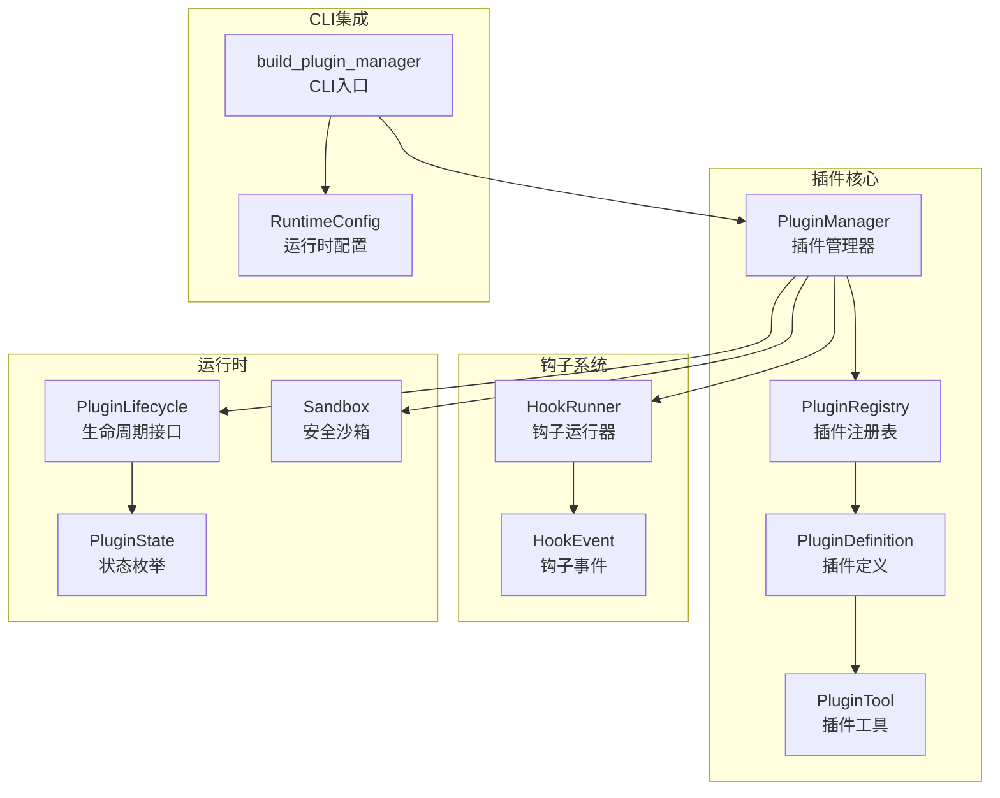
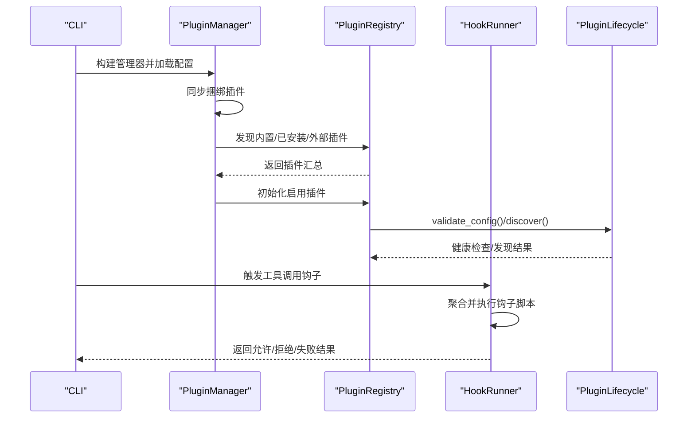
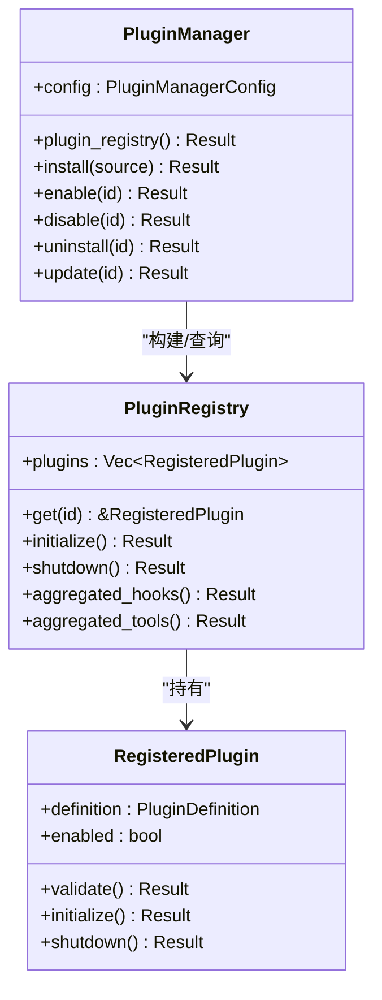
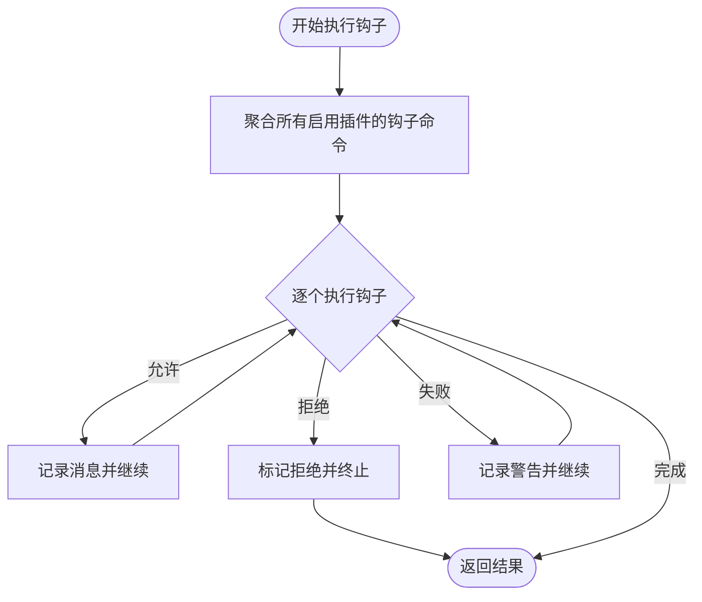
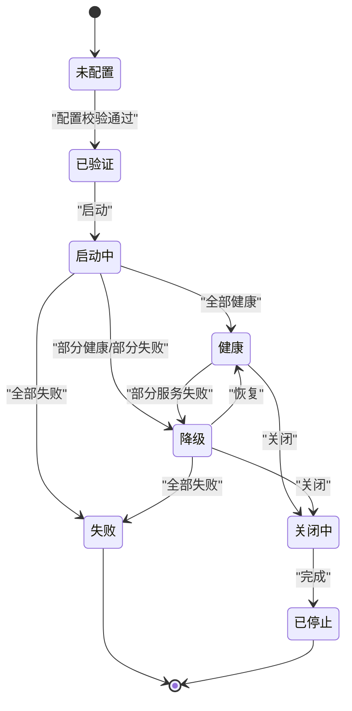
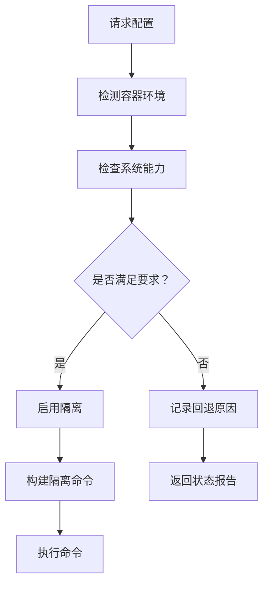
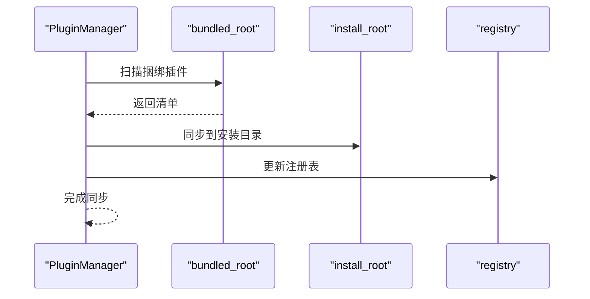
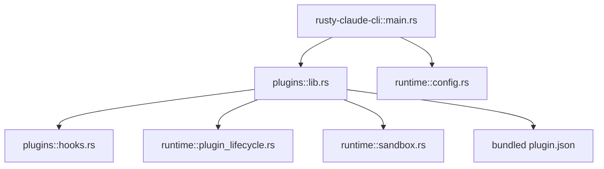

# 插件系统架构

<cite>
**本文档引用的文件**
- [lib.rs](file://rust/crates/plugins/src/lib.rs)
- [hooks.rs](file://rust/crates/plugins/src/hooks.rs)
- [test_isolation.rs](file://rust/crates/plugins/src/test_isolation.rs)
- [plugin_lifecycle.rs](file://rust/crates/runtime/src/plugin_lifecycle.rs)
- [sandbox.rs](file://rust/crates/runtime/src/sandbox.rs)
- [lib.rs](file://rust/crates/runtime/src/lib.rs)
- [plugin.json](file://rust/crates/plugins/bundled/example-bundled/.claude-plugin/plugin.json)
- [plugin.json](file://rust/crates/plugins/bundled/sample-hooks/.claude-plugin/plugin.json)
- [Cargo.toml](file://rust/crates/plugins/Cargo.toml)
- [main.rs](file://rust/crates/rusty-claude-cli/src/main.rs)
- [config.rs](file://rust/crates/runtime/src/config.rs)
</cite>

## 更新摘要
**所做更改**
- 新增完整的Rust插件管理基础设施章节，详细描述插件定义、注册表、生命周期管理
- 扩展钩子系统章节，包含详细的插件清单格式和权限模型
- 更新插件发现与版本管理章节，涵盖捆绑插件同步机制
- 新增权限与隔离机制章节，描述安全沙箱和权限控制
- 更新依赖关系分析，展示Rust插件系统与核心运行时的集成

## 目录
1. [引言](#引言)
2. [项目结构](#项目结构)
3. [核心组件](#核心组件)
4. [架构总览](#架构总览)
5. [详细组件分析](#详细组件分析)
6. [依赖关系分析](#依赖关系分析)
7. [性能考虑](#性能考虑)
8. [故障排除指南](#故障排除指南)
9. [结论](#结论)
10. [附录](#附录)

## 引言
本文件系统性阐述该代码库中的可扩展插件架构设计与实现机制，涵盖插件生命周期、钩子系统、权限与安全隔离、插件发现与版本管理、以及插件与核心系统的交互方式（事件处理、状态共享、资源管理）。目标读者包括插件开发者与系统集成工程师，帮助其快速理解并正确使用该插件体系。

**更新** 本次更新重点反映了新增的完整Rust插件系统架构，包括插件管理基础设施、安装清单、插件配置和钩子系统。

## 项目结构
插件系统主要由以下模块构成：
- 插件核心与管理：负责插件定义、注册表、安装/启用/禁用/卸载、聚合钩子与工具等
- 钩子执行器：负责在工具调用前后触发外部脚本钩子，并收集结果
- 运行时生命周期：抽象插件生命周期状态与健康检查
- 安全沙箱：提供文件系统隔离、命名空间限制、网络隔离等能力
- CLI 集成：从配置加载插件设置并构建插件管理器

**图表来源**
- [lib.rs:1034-1086](file://rust/crates/plugins/src/lib.rs#L1034-L1086)
- [hooks.rs:59-120](file://rust/crates/plugins/src/hooks.rs#L59-L120)
- [plugin_lifecycle.rs:214-219](file://rust/crates/runtime/src/plugin_lifecycle.rs#L214-L219)
- [sandbox.rs:28-68](file://rust/crates/runtime/src/sandbox.rs#L28-L68)
- [main.rs:6150-6173](file://rust/crates/rusty-claude-cli/src/main.rs#L6150-L6173)

**章节来源**
- [lib.rs:1034-1086](file://rust/crates/plugins/src/lib.rs#L1034-L1086)
- [hooks.rs:59-120](file://rust/crates/plugins/src/hooks.rs#L59-L120)
- [plugin_lifecycle.rs:214-219](file://rust/crates/runtime/src/plugin_lifecycle.rs#L214-L219)
- [sandbox.rs:28-68](file://rust/crates/runtime/src/sandbox.rs#L28-L68)
- [main.rs:6150-6173](file://rust/crates/rusty-claude-cli/src/main.rs#L6150-L6173)

## 核心组件
- 插件定义与元数据：包含插件 ID、名称、版本、描述、类型（内置/捆绑/外部）、默认启用状态及根目录等
- 插件清单（plugin.json）：声明权限、钩子、生命周期命令、工具与命令等
- 插件注册表：维护已发现插件及其启用状态，支持聚合钩子与工具
- 插件管理器：负责插件发现、安装、启用/禁用、卸载、更新、生命周期初始化与关闭
- 钩子系统：在工具调用前/后或失败时触发外部脚本，支持允许/拒绝/失败三种结果
- 生命周期接口：抽象插件健康检查、发现、关闭等运行时行为
- 安全沙箱：提供文件系统隔离模式、命名空间限制、网络隔离等

**更新** 新增了完整的插件清单格式规范，包括权限模型、工具定义和生命周期管理。

**章节来源**
- [lib.rs:55-132](file://rust/crates/plugins/src/lib.rs#L55-L132)
- [lib.rs:1540-1583](file://rust/crates/plugins/src/lib.rs#L1540-L1583)
- [lib.rs:761-845](file://rust/crates/plugins/src/lib.rs#L761-L845)
- [hooks.rs:9-24](file://rust/crates/plugins/src/hooks.rs#L9-L24)
- [plugin_lifecycle.rs:214-219](file://rust/crates/runtime/src/plugin_lifecycle.rs#L214-L219)
- [sandbox.rs:7-14](file://rust/crates/runtime/src/sandbox.rs#L7-L14)

## 架构总览
插件系统采用"清单驱动 + 多源发现 + 聚合执行"的架构：
- 清单驱动：通过 plugin.json 定义插件能力与约束
- 多源发现：内置插件、已安装插件、外部目录插件统一扫描与合并
- 聚合执行：注册表聚合所有启用插件的钩子与工具，供运行时统一调度
- 生命周期管理：插件按启用顺序验证与初始化，关闭时逆序执行
- 安全隔离：运行时可选择启用沙箱，限制文件系统访问与网络能力

**图表来源**
- [lib.rs:1072-1086](file://rust/crates/plugins/src/lib.rs#L1072-L1086)
- [lib.rs:826-844](file://rust/crates/plugins/src/lib.rs#L826-L844)
- [hooks.rs:70-120](file://rust/crates/plugins/src/hooks.rs#L70-L120)
- [plugin_lifecycle.rs:214-219](file://rust/crates/runtime/src/plugin_lifecycle.rs#L214-L219)

## 详细组件分析

### 插件管理器与注册表
- 插件管理器职责：同步捆绑插件、扫描内置/已安装/外部插件、构建注册表报告、执行安装/启用/禁用/卸载/更新操作、持久化启用状态与注册表
- 注册表职责：维护插件列表、按 ID 查询、聚合钩子与工具、按启用状态初始化/关闭插件
- 生命周期：注册表在初始化阶段先验证再初始化，关闭阶段逆序执行，确保资源有序释放

**图表来源**
- [lib.rs:1034-1086](file://rust/crates/plugins/src/lib.rs#L1034-L1086)
- [lib.rs:761-845](file://rust/crates/plugins/src/lib.rs#L761-L845)
- [lib.rs:605-653](file://rust/crates/plugins/src/lib.rs#L605-L653)

**章节来源**
- [lib.rs:1034-1086](file://rust/crates/plugins/src/lib.rs#L1034-L1086)
- [lib.rs:761-845](file://rust/crates/plugins/src/lib.rs#L761-L845)
- [lib.rs:605-653](file://rust/crates/plugins/src/lib.rs#L605-L653)

### 钩子系统
- 钩子事件：PreToolUse、PostToolUse、PostToolUseFailure
- 执行模型：HookRunner 聚合来自所有启用插件的钩子命令，按顺序执行；遇到拒绝码则立即拒绝，遇到非零退出码记录警告但不中断后续钩子
- 输入输出：通过环境变量与标准输入传递事件名、工具名、输入/输出/错误等上下文；钩子脚本可返回消息用于审计与提示

**图表来源**
- [hooks.rs:121-174](file://rust/crates/plugins/src/hooks.rs#L121-L174)
- [hooks.rs:177-230](file://rust/crates/plugins/src/hooks.rs#L177-L230)

**章节来源**
- [hooks.rs:9-24](file://rust/crates/plugins/src/hooks.rs#L9-L24)
- [hooks.rs:70-120](file://rust/crates/plugins/src/hooks.rs#L70-L120)
- [hooks.rs:121-174](file://rust/crates/plugins/src/hooks.rs#L121-L174)
- [hooks.rs:177-230](file://rust/crates/plugins/src/hooks.rs#L177-L230)

### 生命周期与健康检查
- 生命周期事件：ConfigValidated、StartupHealthy、StartupDegraded、StartupFailed、Shutdown
- 状态机：Unconfigured → Validated → Starting → Healthy → Degraded → Failed → ShuttingDown → Stopped
- 健康检查：根据服务器健康状态计算整体插件状态，并在降级模式下提供可用/不可用工具清单

**图表来源**
- [plugin_lifecycle.rs:47-61](file://rust/crates/runtime/src/plugin_lifecycle.rs#L47-L61)
- [plugin_lifecycle.rs:65-98](file://rust/crates/runtime/src/plugin_lifecycle.rs#L65-L98)

**章节来源**
- [plugin_lifecycle.rs:194-212](file://rust/crates/runtime/src/plugin_lifecycle.rs#L194-L212)
- [plugin_lifecycle.rs:47-61](file://rust/crates/runtime/src/plugin_lifecycle.rs#L47-L61)
- [plugin_lifecycle.rs:65-98](file://rust/crates/runtime/src/plugin_lifecycle.rs#L65-L98)

### 安全沙箱
- 隔离模式：Off、WorkspaceOnly、AllowList
- 可选能力：命名空间限制、网络隔离、文件系统挂载白名单
- 检测与回退：检测容器环境、校验 unshare 用户命名空间可用性，必要时给出回退原因
- Linux 启动器：基于 unshare 构造带隔离的命令执行环境

**图表来源**
- [sandbox.rs:108-159](file://rust/crates/runtime/src/sandbox.rs#L108-L159)
- [sandbox.rs:211-262](file://rust/crates/runtime/src/sandbox.rs#L211-L262)

**章节来源**
- [sandbox.rs:7-14](file://rust/crates/runtime/src/sandbox.rs#L7-L14)
- [sandbox.rs:85-106](file://rust/crates/runtime/src/sandbox.rs#L85-L106)
- [sandbox.rs:108-159](file://rust/crates/runtime/src/sandbox.rs#L108-L159)
- [sandbox.rs:211-262](file://rust/crates/runtime/src/sandbox.rs#L211-L262)

### 插件发现与版本管理
- 发现路径：内置插件、已安装插件目录、外部插件目录
- 版本同步：捆绑插件自动同步到安装目录，保持版本一致；清理过期条目并更新注册表
- 安装/更新/卸载：支持本地路径、Git URL 安装；更新时替换安装目录并更新注册表；卸载时删除安装目录并移除注册表项

**图表来源**
- [lib.rs:1359-1441](file://rust/crates/plugins/src/lib.rs#L1359-L1441)

**章节来源**
- [lib.rs:1359-1441](file://rust/crates/plugins/src/lib.rs#L1359-L1441)
- [lib.rs:1237-1313](file://rust/crates/plugins/src/lib.rs#L1237-L1313)
- [lib.rs:1315-1352](file://rust/crates/plugins/src/lib.rs#L1315-L1352)

### 权限与隔离机制
- 权限策略：只读、工作区写入、危险全权限等模式；动态判定工具所需权限
- 文件边界检查：严格限制超出工作区根目录的写入
- Bash 命令分类：根据命令特征判断是否只读，结合当前模式决定放行
- 沙箱集成：运行时可选择启用命名空间/网络/文件系统隔离，降低插件对宿主的影响

**章节来源**
- [permission_enforcer.rs:12-24](file://rust/crates/runtime/src/permission_enforcer.rs#L12-L24)
- [permission_enforcer.rs:107-142](file://rust/crates/runtime/src/permission_enforcer.rs#L107-L142)
- [permission_enforcer.rs:144-173](file://rust/crates/runtime/src/permission_enforcer.rs#L144-L173)
- [sandbox.rs:7-14](file://rust/crates/runtime/src/sandbox.rs#L7-L14)

### 插件与核心系统交互
- 事件处理：通过 HookRunner 在工具调用前后触发钩子，实现审计、告警、二次处理等
- 状态共享：通过环境变量与标准输入传递上下文，钩子脚本可读取工具名、输入、输出/错误等
- 资源管理：插件工具以进程形式执行，通过环境变量传递插件标识、工具名、输入等；失败时捕获 stderr 并格式化错误消息

**章节来源**
- [hooks.rs:177-230](file://rust/crates/plugins/src/hooks.rs#L177-L230)
- [lib.rs:307-349](file://rust/crates/plugins/src/lib.rs#L307-L349)

## 依赖关系分析

**图表来源**
- [lib.rs:1-20](file://rust/crates/plugins/src/lib.rs#L1-L20)
- [hooks.rs:1-10](file://rust/crates/plugins/src/hooks.rs#L1-L10)
- [plugin_lifecycle.rs:1-10](file://rust/crates/runtime/src/plugin_lifecycle.rs#L1-L10)
- [sandbox.rs:1-10](file://rust/crates/runtime/src/sandbox.rs#L1-L10)
- [main.rs:6150-6173](file://rust/crates/rusty-claude-cli/src/main.rs#L6150-L6173)
- [config.rs:1690-1734](file://rust/crates/runtime/src/config.rs#L1690-L1734)
- [plugin.json:1-11](file://rust/crates/plugins/bundled/example-bundled/.claude-plugin/plugin.json#L1-L11)

**章节来源**
- [lib.rs:1-20](file://rust/crates/plugins/src/lib.rs#L1-L20)
- [Cargo.toml:8-10](file://rust/crates/plugins/Cargo.toml#L8-L10)

## 性能考虑
- 钩子执行：串行执行多个钩子命令，建议插件钩子脚本尽量轻量、避免长时间阻塞
- 插件发现：扫描多源路径时注意 I/O 成本，建议合理配置外部目录与安装根目录
- 生命周期：健康检查与降级模式应避免频繁轮询，可在运行时缓存状态
- 沙箱：unshare 与命名空间隔离会带来额外开销，仅在需要时启用

## 故障排除指南
- 插件加载失败：检查 plugin.json 字段完整性、钩子/生命周期/工具路径是否存在且可执行
- 钩子被拒绝：确认钩子脚本返回特定拒绝码；查看 HookRunResult 中的消息
- 命令执行失败：查看 stderr 输出与退出码，核对工具输入 JSON 结构
- 沙箱不可用：检查 unshare 可用性与容器环境检测结果，关注回退原因

**章节来源**
- [lib.rs:917-977](file://rust/crates/plugins/src/lib.rs#L917-L977)
- [hooks.rs:269-279](file://rust/crates/plugins/src/hooks.rs#L269-L279)
- [sandbox.rs:285-304](file://rust/crates/runtime/src/sandbox.rs#L285-L304)

## 结论
该插件系统通过清单驱动、多源发现、聚合执行与生命周期管理，提供了可扩展、可观测、可隔离的插件生态。钩子系统与安全沙箱共同保障了插件行为的可控性与安全性，适合在 CLI 场景中进行工具扩展与流程编排。开发者可依据本文档快速上手插件开发与集成。

## 附录
- 插件清单示例：参见捆绑插件的 plugin.json 示例文件
- CLI 集成：从运行时配置加载插件设置并构建插件管理器
- 测试隔离：提供测试环境锁，确保测试间互不干扰

**章节来源**
- [plugin.json:1-11](file://rust/crates/plugins/bundled/example-bundled/.claude-plugin/plugin.json#L1-L11)
- [plugin.json:1-11](file://rust/crates/plugins/bundled/sample-hooks/.claude-plugin/plugin.json#L1-L11)
- [main.rs:6150-6173](file://rust/crates/rusty-claude-cli/src/main.rs#L6150-L6173)
- [test_isolation.rs:12-53](file://rust/crates/plugins/src/test_isolation.rs#L12-L53)