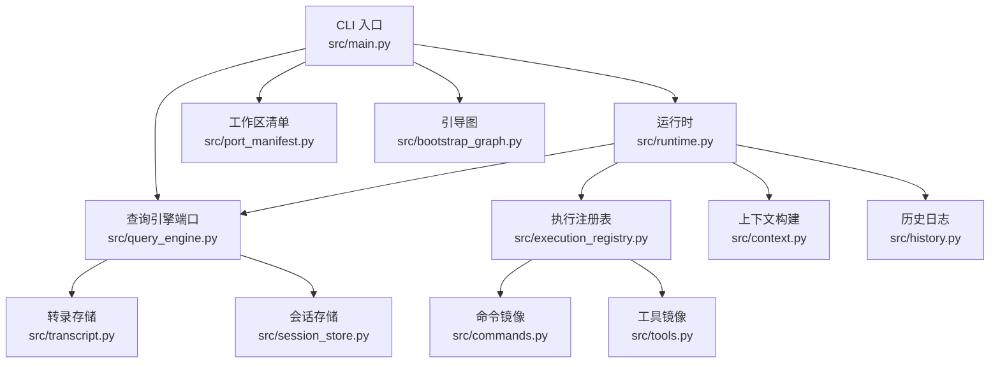
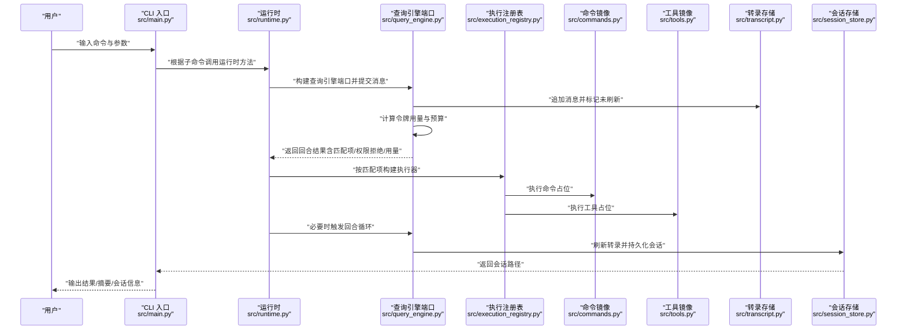
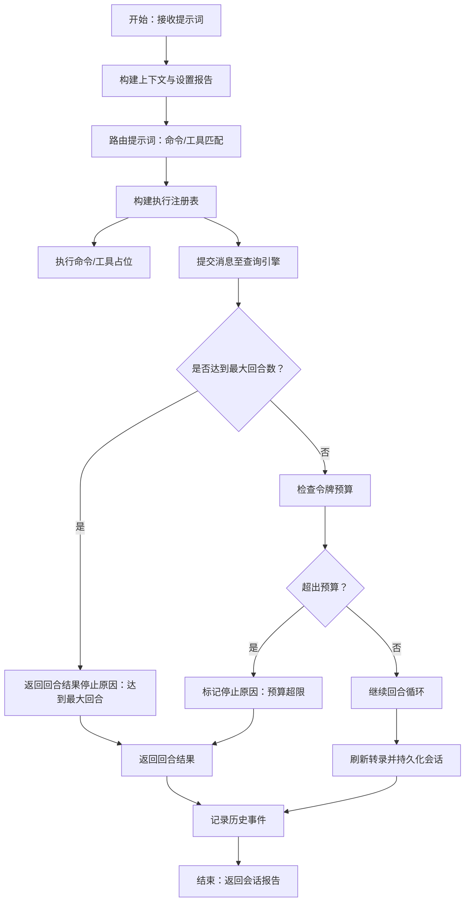
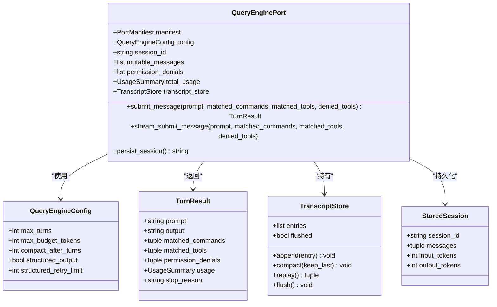
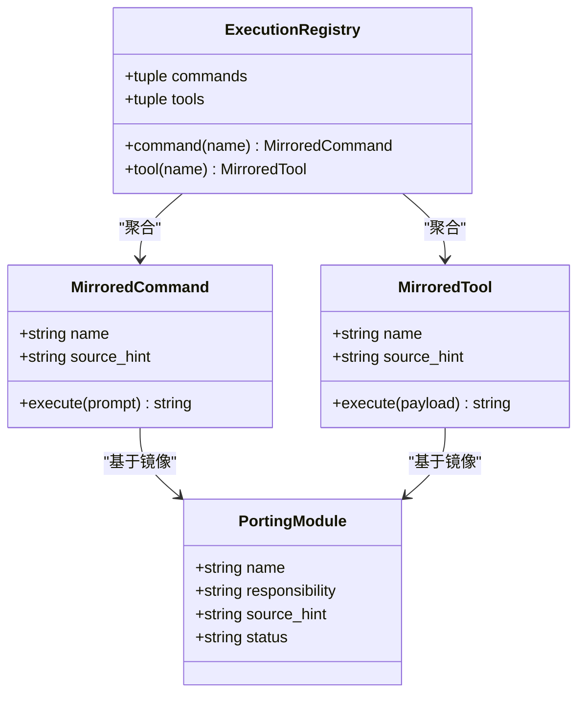
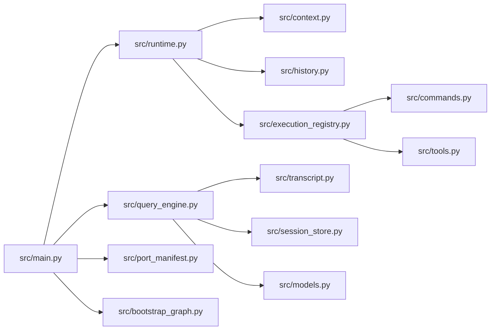

# 数据流设计

<cite>
**本文引用的文件**
- [src/main.py](file://src/main.py)
- [src/runtime.py](file://src/runtime.py)
- [src/query_engine.py](file://src/query_engine.py)
- [src/session_store.py](file://src/session_store.py)
- [src/transcript.py](file://src/transcript.py)
- [src/commands.py](file://src/commands.py)
- [src/tools.py](file://src/tools.py)
- [src/execution_registry.py](file://src/execution_registry.py)
- [src/models.py](file://src/models.py)
- [src/context.py](file://src/context.py)
- [src/history.py](file://src/history.py)
- [src/port_manifest.py](file://src/port_manifest.py)
- [src/bootstrap_graph.py](file://src/bootstrap_graph.py)
</cite>

## 目录
1. [引言](#引言)
2. [项目结构](#项目结构)
3. [核心组件](#核心组件)
4. [架构总览](#架构总览)
5. [详细组件分析](#详细组件分析)
6. [依赖分析](#依赖分析)
7. [性能考虑](#性能考虑)
8. [故障排查指南](#故障排查指南)
9. [结论](#结论)
10. [附录](#附录)

## 引言
本文件面向“数据流设计”，聚焦系统中数据自用户输入到最终输出的完整路径，覆盖以下主题：
- 用户输入经由 CLI 解析后进入运行时与查询引擎，形成会话状态与历史记录
- 任务包（命令/工具）匹配与执行，以及权限拒绝与事件传播
- 数据格式标准化（结构化输出、令牌用量统计）、中间状态缓存（转录与紧凑存储）
- 并发安全与错误传播、回滚策略（会话持久化与转录刷新）

## 项目结构
该仓库采用按功能域分层的组织方式：CLI 入口负责参数解析与子命令路由；运行时协调上下文、路由与回合循环；查询引擎承载会话状态、令牌预算与输出格式；命令与工具模块提供镜像清单与执行入口；会话存储与转录存储负责中间状态持久化与紧凑。

图表来源
- [src/main.py:94-214](file://src/main.py#L94-L214)
- [src/runtime.py:89-193](file://src/runtime.py#L89-L193)
- [src/query_engine.py:35-194](file://src/query_engine.py#L35-L194)
- [src/session_store.py:19-36](file://src/session_store.py#L19-L36)
- [src/transcript.py:6-24](file://src/transcript.py#L6-L24)
- [src/execution_registry.py:27-52](file://src/execution_registry.py#L27-L52)
- [src/commands.py:75-81](file://src/commands.py#L75-L81)
- [src/tools.py:81-87](file://src/tools.py#L81-L87)
- [src/context.py:19-48](file://src/context.py#L19-L48)
- [src/history.py:12-23](file://src/history.py#L12-L23)
- [src/port_manifest.py:30-53](file://src/port_manifest.py#L30-L53)
- [src/bootstrap_graph.py:16-28](file://src/bootstrap_graph.py#L16-L28)

章节来源
- [src/main.py:21-91](file://src/main.py#L21-L91)
- [src/bootstrap_graph.py:16-28](file://src/bootstrap_graph.py#L16-L28)

## 核心组件
- CLI 入口：解析参数、分发子命令，调用运行时与查询引擎，驱动会话生命周期
- 运行时：构建上下文、路由提示词、执行回合循环、记录历史
- 查询引擎端口：维护会话状态、令牌预算、结构化输出、转录与持久化
- 执行注册表：将匹配的命令/工具映射为可执行对象
- 命令/工具镜像：提供镜像清单与执行占位逻辑
- 上下文与历史：提供环境信息与操作轨迹
- 会话存储与转录存储：序列化会话、紧凑保存对话历史

章节来源
- [src/main.py:94-214](file://src/main.py#L94-L214)
- [src/runtime.py:89-193](file://src/runtime.py#L89-L193)
- [src/query_engine.py:35-194](file://src/query_engine.py#L35-L194)
- [src/execution_registry.py:27-52](file://src/execution_registry.py#L27-L52)
- [src/commands.py:75-81](file://src/commands.py#L75-L81)
- [src/tools.py:81-87](file://src/tools.py#L81-L87)
- [src/context.py:19-48](file://src/context.py#L19-L48)
- [src/history.py:12-23](file://src/history.py#L12-L23)
- [src/session_store.py:19-36](file://src/session_store.py#L19-L36)
- [src/transcript.py:6-24](file://src/transcript.py#L6-L24)

## 架构总览
下图展示从 CLI 到会话持久化的端到端数据流，包括会话状态管理、任务包处理与事件传播。

图表来源
- [src/main.py:142-166](file://src/main.py#L142-L166)
- [src/runtime.py:109-152](file://src/runtime.py#L109-L152)
- [src/query_engine.py:61-104](file://src/query_engine.py#L61-L104)
- [src/query_engine.py:106-127](file://src/query_engine.py#L106-L127)
- [src/execution_registry.py:47-52](file://src/execution_registry.py#L47-L52)
- [src/commands.py:75-81](file://src/commands.py#L75-L81)
- [src/tools.py:81-87](file://src/tools.py#L81-L87)
- [src/session_store.py:19-36](file://src/session_store.py#L19-L36)
- [src/transcript.py:11-24](file://src/transcript.py#L11-L24)

## 详细组件分析

### CLI 与子命令路由
- 负责解析参数、选择子命令处理器，并将控制权交给运行时或查询引擎
- 支持“路由”“引导会话”“回合循环”“加载/刷新会话”等子命令
- 将会话持久化路径与统计信息作为最终输出

章节来源
- [src/main.py:21-91](file://src/main.py#L21-L91)
- [src/main.py:142-166](file://src/main.py#L142-L166)

### 运行时：会话状态与回合循环
- 构建上下文、启动设置报告、路由提示词，生成匹配列表
- 执行命令/工具镜像执行（占位），记录权限拒绝
- 触发查询引擎提交消息，收集流式事件与回合结果
- 维护历史日志，记录路由、执行、回合与会话存储事件

图表来源
- [src/runtime.py:89-193](file://src/runtime.py#L89-L193)
- [src/query_engine.py:61-104](file://src/query_engine.py#L61-L104)
- [src/history.py:12-23](file://src/history.py#L12-L23)

章节来源
- [src/runtime.py:89-193](file://src/runtime.py#L89-L193)

### 查询引擎端口：会话状态与数据格式标准化
- 状态字段：工作区清单、配置、会话 ID、消息列表、权限拒绝、累计用量、转录存储
- 提交消息流程：校验回合上限、格式化输出、估算用量、更新消息与用量、必要时紧凑消息、返回回合结果
- 流式提交：产生事件类型（消息开始/命令匹配/工具匹配/权限拒绝/增量文本/停止）
- 结构化输出：在配置开启时以 JSON 形式渲染摘要，失败时重试并抛出错误
- 持久化：刷新转录、序列化会话并写入文件

图表来源
- [src/query_engine.py:15-44](file://src/query_engine.py#L15-L44)
- [src/query_engine.py:35-104](file://src/query_engine.py#L35-L104)
- [src/query_engine.py:106-127](file://src/query_engine.py#L106-L127)
- [src/query_engine.py:140-150](file://src/query_engine.py#L140-L150)
- [src/transcript.py:6-24](file://src/transcript.py#L6-L24)
- [src/session_store.py:8-36](file://src/session_store.py#L8-L36)

章节来源
- [src/query_engine.py:35-194](file://src/query_engine.py#L35-L194)
- [src/transcript.py:6-24](file://src/transcript.py#L6-L24)
- [src/session_store.py:19-36](file://src/session_store.py#L19-L36)

### 任务包处理：命令与工具镜像
- 命令镜像：加载快照、提供名称、过滤、查找与执行（占位）
- 工具镜像：加载快照、权限上下文过滤、简单模式筛选、执行（占位）
- 执行注册表：将镜像封装为可执行对象，按名称检索

图表来源
- [src/commands.py:13-81](file://src/commands.py#L13-L81)
- [src/tools.py:14-87](file://src/tools.py#L14-L87)
- [src/execution_registry.py:9-52](file://src/execution_registry.py#L9-L52)

章节来源
- [src/commands.py:22-81](file://src/commands.py#L22-L81)
- [src/tools.py:23-87](file://src/tools.py#L23-L87)
- [src/execution_registry.py:27-52](file://src/execution_registry.py#L27-L52)

### 会话状态管理与事件传播
- 会话状态：会话 ID、消息列表、权限拒绝、累计用量、转录存储
- 事件传播：流式提交产生多种事件类型，查询引擎在提交后统一返回回合结果
- 历史记录：运行时将路由、执行、回合与会话存储事件写入历史日志

章节来源
- [src/query_engine.py:35-104](file://src/query_engine.py#L35-L104)
- [src/query_engine.py:106-127](file://src/query_engine.py#L106-L127)
- [src/runtime.py:135-138](file://src/runtime.py#L135-L138)
- [src/history.py:12-23](file://src/history.py#L12-L23)

### 数据格式标准化与中间状态缓存
- 结构化输出：在配置开启时以 JSON 渲染摘要，失败时重试并抛错
- 中间状态缓存：转录存储支持紧凑与刷新，避免内存膨胀
- 令牌预算：用量估算与预算检查决定是否提前停止

章节来源
- [src/query_engine.py:152-169](file://src/query_engine.py#L152-L169)
- [src/query_engine.py:129-132](file://src/query_engine.py#L129-L132)
- [src/transcript.py:15-24](file://src/transcript.py#L15-L24)

### 并发安全机制
- 使用不可变数据结构（冻结数据类）降低共享状态风险
- 通过会话 ID 与转录存储实现幂等性与可恢复性
- 会话持久化采用原子写入（序列化后一次性写入文件）

章节来源
- [src/models.py:6-26](file://src/models.py#L6-L26)
- [src/query_engine.py:140-150](file://src/query_engine.py#L140-L150)
- [src/session_store.py:19-24](file://src/session_store.py#L19-L24)

### 错误传播与回滚策略
- 回滚策略：会话持久化前刷新转录，确保最终落盘一致性
- 错误传播：结构化输出渲染失败时抛出错误；回合循环在预算超限时停止
- 权限拒绝：运行时推断并传递给查询引擎，作为回合结果的一部分

章节来源
- [src/query_engine.py:162-169](file://src/query_engine.py#L162-L169)
- [src/query_engine.py:89-91](file://src/query_engine.py#L89-L91)
- [src/runtime.py:169-174](file://src/runtime.py#L169-L174)

## 依赖分析
- CLI 依赖运行时与查询引擎，用于执行具体功能
- 运行时依赖上下文、历史、执行注册表与查询引擎
- 查询引擎依赖转录存储、会话存储与模型定义
- 命令/工具镜像依赖模型与权限上下文
- 执行注册表聚合命令/工具镜像

图表来源
- [src/main.py:5-18](file://src/main.py#L5-L18)
- [src/runtime.py:5-13](file://src/runtime.py#L5-L13)
- [src/query_engine.py:7-12](file://src/query_engine.py#L7-L12)
- [src/execution_registry.py:5-6](file://src/execution_registry.py#L5-L6)
- [src/commands.py:8](file://src/commands.py#L8)
- [src/tools.py:9](file://src/tools.py#L9)
- [src/models.py:3](file://src/models.py#L3)
- [src/context.py:3](file://src/context.py#L3)
- [src/history.py:3](file://src/history.py#L3)
- [src/transcript.py:3](file://src/transcript.py#L3)
- [src/session_store.py:3](file://src/session_store.py#L3)
- [src/port_manifest.py:7](file://src/port_manifest.py#L7)
- [src/bootstrap_graph.py:6](file://src/bootstrap_graph.py#L6)

章节来源
- [src/main.py:5-18](file://src/main.py#L5-L18)
- [src/runtime.py:5-13](file://src/runtime.py#L5-L13)
- [src/query_engine.py:7-12](file://src/query_engine.py#L7-L12)

## 性能考虑
- 令牌预算与紧凑策略：当消息数量超过阈值时仅保留最近若干条，减少内存占用
- 缓存与快照：命令/工具镜像通过缓存加载快照，避免重复 IO
- 结构化输出重试：在渲染失败时自动重试，提升鲁棒性但增加开销

章节来源
- [src/query_engine.py:129-132](file://src/query_engine.py#L129-L132)
- [src/commands.py:22-33](file://src/commands.py#L22-L33)
- [src/tools.py:23-34](file://src/tools.py#L23-L34)
- [src/query_engine.py:162-169](file://src/query_engine.py#L162-L169)

## 故障排查指南
- 会话无法持久化：检查默认会话目录是否存在、权限是否足够；确认刷新与写入流程已执行
- 输出非结构化：确认结构化输出开关与渲染重试次数配置；关注渲染异常堆栈
- 预算超限提前停止：调整最大回合数或预算阈值；检查用量估算逻辑
- 权限拒绝导致工具不可用：检查权限上下文与运行时推断的拒绝列表
- 历史缺失：确认运行时是否正确记录路由、执行、回合与会话存储事件

章节来源
- [src/session_store.py:19-36](file://src/session_store.py#L19-L36)
- [src/query_engine.py:152-169](file://src/query_engine.py#L152-L169)
- [src/query_engine.py:89-91](file://src/query_engine.py#L89-L91)
- [src/runtime.py:169-174](file://src/runtime.py#L169-L174)
- [src/history.py:12-23](file://src/history.py#L12-L23)

## 结论
本系统通过 CLI、运行时与查询引擎的协作，实现了从用户输入到会话持久化的清晰数据流。会话状态、令牌预算与结构化输出在查询引擎中统一管理；命令/工具镜像与执行注册表提供一致的任务包处理接口；转录与会话存储保障中间状态的高效缓存与可靠持久化。配合历史记录与权限拒绝传播，系统具备良好的可观测性与可恢复性。

## 附录
- 引导阶段概览：顶层预取副作用、警告处理器与环境守卫、CLI 解析与信任门禁、并行加载命令/代理、延迟初始化、模式路由与查询引擎提交循环

章节来源
- [src/bootstrap_graph.py:16-28](file://src/bootstrap_graph.py#L16-L28)