# 核心运行时

<cite>
**本文引用的文件**
- [lib.rs](file://rust/crates/runtime/src/lib.rs)
- [bootstrap.rs](file://rust/crates/runtime/src/bootstrap.rs)
- [session.rs](file://rust/crates/runtime/src/session.rs)
- [conversation.rs](file://rust/crates/runtime/src/conversation.rs)
- [mcp.rs](file://rust/crates/runtime/src/mcp.rs)
- [permission_enforcer.rs](file://rust/crates/runtime/src/permission_enforcer.rs)
- [prompt.rs](file://rust/crates/runtime/src/prompt.rs)
- [recovery_recipes.rs](file://rust/crates/runtime/src/recovery_recipes.rs)
- [sandbox.rs](file://rust/crates/runtime/src/sandbox.rs)
- [config.rs](file://rust/crates/runtime/src/config.rs)
- [plugin_lifecycle.rs](file://rust/crates/runtime/src/plugin_lifecycle.rs)
- [worker_boot.rs](file://rust/crates/runtime/src/worker_boot.rs)
- [file_ops.rs](file://rust/crates/runtime/src/file_ops.rs)
- [lib.rs（tools）](file://rust/crates/tools/src/lib.rs)
- [runtime.py](file://src/runtime.py)
</cite>

## 目录
1. [引言](#引言)
2. [项目结构](#项目结构)
3. [核心组件](#核心组件)
4. [架构总览](#架构总览)
5. [详细组件分析](#详细组件分析)
6. [依赖分析](#依赖分析)
7. [性能考虑](#性能考虑)
8. [故障排查指南](#故障排查指南)
9. [结论](#结论)
10. [附录](#附录)

## 引言
本文件面向开发者与维护者，系统性阐述“核心运行时”的高层设计与关键实现，覆盖会话管理、对话循环、引导流程、状态持久化、权限评估、提示组装、工具执行、MCP 通信与错误恢复等主题。目标是帮助读者快速理解运行时如何协调各子系统，并提供可扩展的实践建议。

## 项目结构
运行时由 Rust crate 的 runtime 子系统与 Python 的运行时入口共同组成：
- Rust 运行时：提供会话持久化、权限策略、提示构建、对话循环、MCP 管理、沙箱隔离、恢复配方、插件生命周期、工作器启动控制等核心能力。
- Python 运行时：负责命令/工具路由、查询引擎交互、一次性会话引导与回合循环、历史记录与输出渲染。

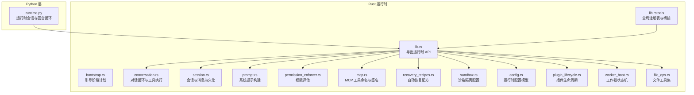

图示来源
- [lib.rs:1-180](file://rust/crates/runtime/src/lib.rs#L1-L180)
- [bootstrap.rs:1-112](file://rust/crates/runtime/src/bootstrap.rs#L1-L112)
- [conversation.rs:1-800](file://rust/crates/runtime/src/conversation.rs#L1-L800)
- [session.rs:1-800](file://rust/crates/runtime/src/session.rs#L1-L800)
- [prompt.rs:1-800](file://rust/crates/runtime/src/prompt.rs#L1-L800)
- [permission_enforcer.rs:1-586](file://rust/crates/runtime/src/permission_enforcer.rs#L1-L586)
- [mcp.rs:1-305](file://rust/crates/runtime/src/mcp.rs#L1-L305)
- [recovery_recipes.rs:1-632](file://rust/crates/runtime/src/recovery_recipes.rs#L1-L632)
- [sandbox.rs:1-386](file://rust/crates/runtime/src/sandbox.rs#L1-L386)
- [config.rs:1-2112](file://rust/crates/runtime/src/config.rs#L1-L2112)
- [plugin_lifecycle.rs:1-534](file://rust/crates/runtime/src/plugin_lifecycle.rs#L1-L534)
- [worker_boot.rs:1-1341](file://rust/crates/runtime/src/worker_boot.rs#L1-L1341)
- [file_ops.rs:1-840](file://rust/crates/runtime/src/file_ops.rs#L1-L840)
- [lib.rs（tools）:1-9683](file://rust/crates/tools/src/lib.rs#L1-L9683)
- [runtime.py:1-193](file://src/runtime.py#L1-L193)

章节来源
- [lib.rs:1-180](file://rust/crates/runtime/src/lib.rs#L1-L180)
- [runtime.py:1-193](file://src/runtime.py#L1-L193)

## 核心组件
- 会话与持久化：Session/ConversationMessage/ContentBlock 负责消息结构化存储与增量写入；支持 JSON/JSONL 双格式、轮转日志与压缩摘要。
- 对话循环：ConversationRuntime 协调上游 API 客户端、工具执行器、权限策略、钩子与使用统计，驱动单轮或多轮对话。
- 权限评估：PermissionPolicy/PermissionEnforcer 将策略与动态输入结合，决定工具是否允许执行或需要交互确认。
- 提示组装：SystemPromptBuilder/ProjectContext/GitContext 组合环境、指令文件、配置与 Git 上下文生成系统提示。
- MCP 管理：McpServer/McpTool/McpClient 抽象跨传输（STDIO/HTTP/SSE/WS/SDK/ManagedProxy）的 MCP 服务器与工具发现、命名规范与签名。
- 恢复配方：FailureScenario/RecoveryRecipe/RecoveryContext 定义常见失败场景的自动恢复步骤与事件日志。
- 沙箱隔离：SandboxConfig/SandboxStatus/LinuxSandboxCommand 提供容器化与用户/网络/文件系统隔离能力。
- 插件生命周期：PluginState/ServerHealth/DegradedMode 管理插件服务器健康与降级模式。
- 工作器启动：WorkerStatus/WorkerEvent/WorkerRegistry 实现工作器状态机与事件流，支撑信任门、提示投递与协议握手。
- 文件工具：read_file/write_file/glob_search/grep_search 等，带大小限制与二进制检测。
- 引导流程：BootstrapPlan/BootstrapPhase 定义从 CLI 到主运行时的关键阶段顺序。

章节来源
- [session.rs:1-800](file://rust/crates/runtime/src/session.rs#L1-L800)
- [conversation.rs:1-800](file://rust/crates/runtime/src/conversation.rs#L1-L800)
- [permission_enforcer.rs:1-586](file://rust/crates/runtime/src/permission_enforcer.rs#L1-L586)
- [prompt.rs:1-800](file://rust/crates/runtime/src/prompt.rs#L1-L800)
- [mcp.rs:1-305](file://rust/crates/runtime/src/mcp.rs#L1-L305)
- [recovery_recipes.rs:1-632](file://rust/crates/runtime/src/recovery_recipes.rs#L1-L632)
- [sandbox.rs:1-386](file://rust/crates/runtime/src/sandbox.rs#L1-L386)
- [plugin_lifecycle.rs:1-534](file://rust/crates/runtime/src/plugin_lifecycle.rs#L1-L534)
- [worker_boot.rs:1-1341](file://rust/crates/runtime/src/worker_boot.rs#L1-L1341)
- [file_ops.rs:1-840](file://rust/crates/runtime/src/file_ops.rs#L1-L840)
- [bootstrap.rs:1-112](file://rust/crates/runtime/src/bootstrap.rs#L1-L112)

## 架构总览
运行时采用“分层+协作”架构：上层 Python runtime.py 负责路由与回合循环；底层 Rust runtime 提供核心运行时能力并通过 tools crate 的全局注册表与桥接模块连接 MCP、插件与工具集。

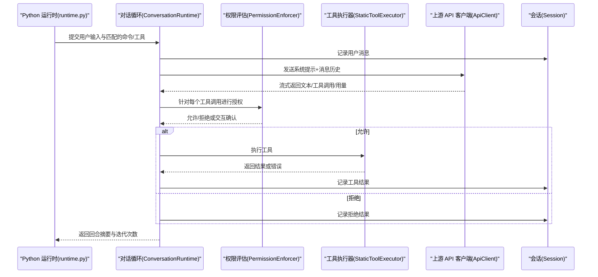

图示来源
- [conversation.rs:314-515](file://rust/crates/runtime/src/conversation.rs#L314-L515)
- [permission_enforcer.rs:39-100](file://rust/crates/runtime/src/permission_enforcer.rs#L39-L100)
- [session.rs:229-243](file://rust/crates/runtime/src/session.rs#L229-L243)
- [runtime.py:109-152](file://src/runtime.py#L109-L152)

## 详细组件分析

### 会话管理与状态持久化
- 数据模型
  - MessageRole/ContentBlock/ConversationMessage 支持文本、工具调用与工具结果三类内容块。
  - Session 记录版本、会话 ID、时间戳、消息列表、压缩摘要、分支信息、工作区根路径、提示历史与模型标识。
- 持久化策略
  - JSONL 增量追加：首次写入时写入完整元数据，后续仅追加消息与提示条目。
  - 轮转与清理：超过阈值自动轮转旧日志并清理过期备份。
  - 原子写入：确保崩溃不破坏文件完整性。
- 自动压缩
  - 基于令牌估算与阈值触发压缩，减少上下文开销。

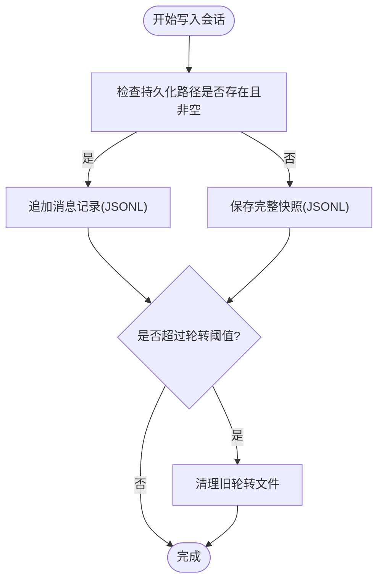

图示来源
- [session.rs:204-211](file://rust/crates/runtime/src/session.rs#L204-L211)
- [session.rs:541-574](file://rust/crates/runtime/src/session.rs#L541-L574)
- [session.rs:13-16](file://rust/crates/runtime/src/session.rs#L13-L16)

章节来源
- [session.rs:1-800](file://rust/crates/runtime/src/session.rs#L1-L800)

### 对话循环与工具执行
- 协调流程
  - 用户输入进入后，ConversationRuntime 构造 ApiRequest 并通过 ApiClient 流式获取 AssistantEvent。
  - 解析事件生成 ConversationMessage，记录工具调用请求，按需执行权限评估与钩子。
  - 工具执行器返回结果后写入会话，支持钩子反馈合并与错误标记。
- 迭代与上限
  - 限制最大迭代次数，避免无限循环。
- 自动压缩
  - 当累计输入令牌达到阈值时触发压缩，更新会话并记录移除的消息数量。

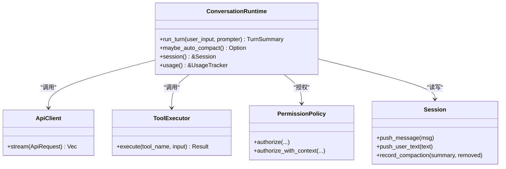

图示来源
- [conversation.rs:126-139](file://rust/crates/runtime/src/conversation.rs#L126-L139)
- [conversation.rs:314-515](file://rust/crates/runtime/src/conversation.rs#L314-L515)
- [session.rs:229-257](file://rust/crates/runtime/src/session.rs#L229-L257)

章节来源
- [conversation.rs:1-800](file://rust/crates/runtime/src/conversation.rs#L1-L800)

### 权限评估与策略
- 策略模型
  - PermissionMode 决定默认行为（只读/工作区写入/危险全开/提示模式/允许）。
  - PermissionPolicy 与 PermissionEnforcer 结合，支持动态所需模式与文件边界检查。
- Bash 命令分类
  - 基于启发式判断只读命令，避免修改型操作在只读模式下执行。
- 文件写入边界
  - WorkspaceWrite 仅允许在工作区内；DangerFullAccess 允许任意写入；Prompt 模式要求交互确认。

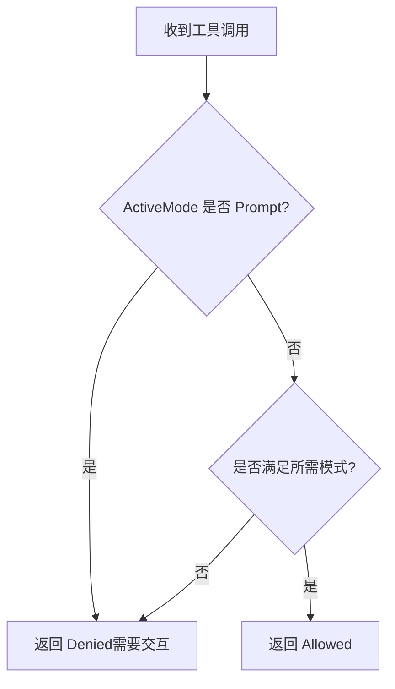

图示来源
- [permission_enforcer.rs:39-100](file://rust/crates/runtime/src/permission_enforcer.rs#L39-L100)
- [permission_enforcer.rs:145-173](file://rust/crates/runtime/src/permission_enforcer.rs#L145-L173)

章节来源
- [permission_enforcer.rs:1-586](file://rust/crates/runtime/src/permission_enforcer.rs#L1-L586)

### 提示组装与系统提示
- 动态边界
  - 使用 SYSTEM_PROMPT_DYNAMIC_BOUNDARY 分离静态框架与动态上下文。
- 上下文来源
  - 环境信息（模型族、工作目录、日期、平台）、项目上下文（Git 状态/差异/最近提交）、指令文件（去重与截断）、运行时配置。
- Git 集成
  - 自动读取分支、状态、差异与最近提交，增强上下文可信度。

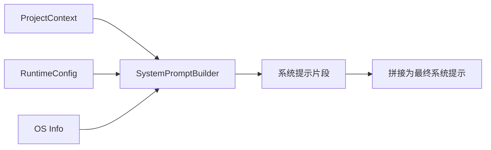

图示来源
- [prompt.rs:94-195](file://rust/crates/runtime/src/prompt.rs#L94-L195)
- [prompt.rs:432-446](file://rust/crates/runtime/src/prompt.rs#L432-L446)

章节来源
- [prompt.rs:1-800](file://rust/crates/runtime/src/prompt.rs#L1-L800)

### MCP 通信与工具桥接
- 工具命名与前缀
  - mcp_tool_prefix/mcp_tool_name 规范化工具名，避免非法字符并统一前缀。
- 服务器签名
  - mcp_server_signature/unwrapped URL 用于识别与去代理化，保证配置变更时正确重建连接。
- 配置集合
  - McpConfigCollection/ScopedMcpServerConfig 支持多作用域合并与哈希校验，保障一致性。
- 传输抽象
  - McpServerConfig/McpTransport 覆盖 STDIO/HTTP/SSE/WS/SDK/ManagedProxy 多种传输。

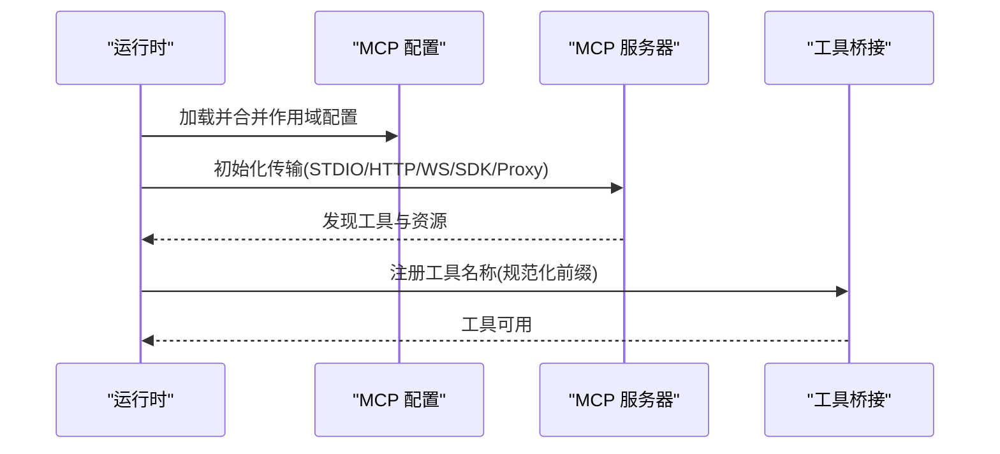

图示来源
- [mcp.rs:65-121](file://rust/crates/runtime/src/mcp.rs#L65-L121)
- [config.rs:95-128](file://rust/crates/runtime/src/config.rs#L95-L128)

章节来源
- [mcp.rs:1-305](file://rust/crates/runtime/src/mcp.rs#L1-L305)
- [config.rs:1-2112](file://rust/crates/runtime/src/config.rs#L1-L2112)

### 插件生命周期与降级模式
- 状态机
  - Unconfigured/Validated/Starting/Healthy/Degraded/Failed/ShuttingDown/Stopped。
- 健康检查
  - ServerHealth/ServerStatus 记录服务器能力与最后错误，聚合为 PluginState。
- 降级模式
  - DegradedMode 汇报可用/不可用工具清单与原因，便于 UI 与策略调整。

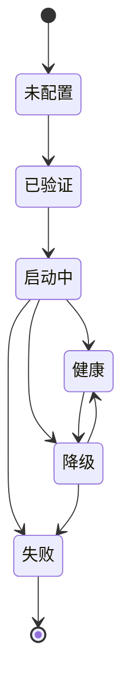

图示来源
- [plugin_lifecycle.rs:47-99](file://rust/crates/runtime/src/plugin_lifecycle.rs#L47-L99)

章节来源
- [plugin_lifecycle.rs:1-534](file://rust/crates/runtime/src/plugin_lifecycle.rs#L1-L534)

### 工作器启动与错误恢复
- 状态机
  - Spawning/TrustRequired/ReadyForPrompt/Running/Finished/Failed。
- 事件与负载
  - WorkerEvent/WorkerEventPayload 记录信任提示、提示投递、任务回执等。
- 失败场景映射
  - WorkerFailureKind 映射到 FailureScenario，驱动恢复配方。
- 恢复配方
  - RecoveryRecipe/RecoveryContext/RecoveryResult 定义步骤序列、尝试次数与升级策略。

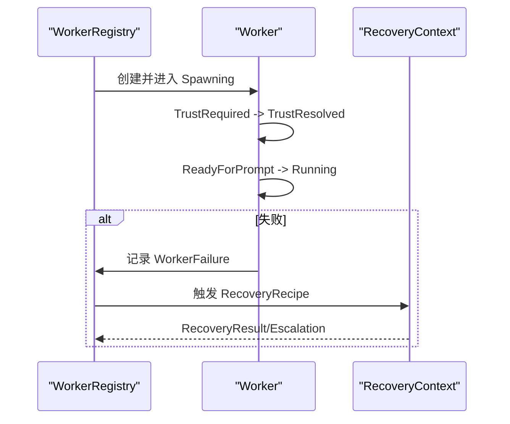

图示来源
- [worker_boot.rs:28-81](file://rust/crates/runtime/src/worker_boot.rs#L28-L81)
- [recovery_recipes.rs:175-225](file://rust/crates/runtime/src/recovery_recipes.rs#L175-L225)

章节来源
- [worker_boot.rs:1-1341](file://rust/crates/runtime/src/worker_boot.rs#L1-L1341)
- [recovery_recipes.rs:1-632](file://rust/crates/runtime/src/recovery_recipes.rs#L1-L632)

### 沙箱隔离与安全边界
- 配置与请求
  - SandboxConfig/SandboxRequest 控制启用、命名空间隔离、网络隔离、文件系统模式与挂载白名单。
- 状态解析
  - resolve_sandbox_status_for_request 基于请求与环境检测计算支持/激活状态与回退原因。
- Linux 启动器
  - build_linux_sandbox_command 生成 unshare 启动参数与环境变量，适配 HOME/TMPDIR 与模式开关。

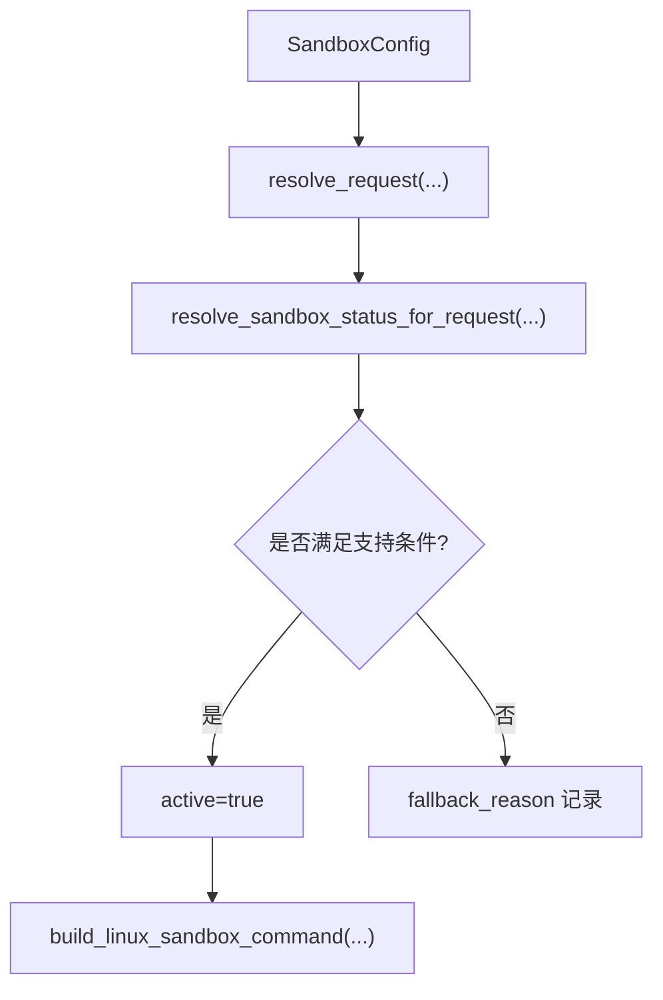

图示来源
- [sandbox.rs:85-105](file://rust/crates/runtime/src/sandbox.rs#L85-L105)
- [sandbox.rs:162-208](file://rust/crates/runtime/src/sandbox.rs#L162-L208)
- [sandbox.rs:211-262](file://rust/crates/runtime/src/sandbox.rs#L211-L262)

章节来源
- [sandbox.rs:1-386](file://rust/crates/runtime/src/sandbox.rs#L1-L386)

### 文件工具与安全限制
- 读写限制
  - MAX_READ_SIZE/MAX_WRITE_SIZE 控制单次读写规模；二进制检测防止误用。
- 搜索与替换
  - glob_search/walkdir；grep_search 支持上下文行数、大小写、正则等。
- 输出封装
  - ReadFileOutput/WriteFileOutput/EditFileOutput/GlobSearchOutput/GrepSearchOutput 提供结构化结果与补丁信息。

章节来源
- [file_ops.rs:1-840](file://rust/crates/runtime/src/file_ops.rs#L1-L840)

### 引导流程与生命周期管理
- 引导阶段
  - BootstrapPlan/BootstrapPhase 定义从 CLI 到主运行时的关键阶段顺序，去重并保持顺序。
- 生命周期
  - 从 FastPath 版本、系统提示、MCP 快速通道、守护进程、桥接、后台会话、模板、环境运行器到 MainRuntime 的完整链路。

章节来源
- [bootstrap.rs:1-112](file://rust/crates/runtime/src/bootstrap.rs#L1-L112)

### Python 运行时：路由与回合循环
- 路由策略
  - 基于 prompt 的词元与命令/工具模块的名称/职责进行打分，选择前 N 个候选。
- 一次性会话
  - build_execution_registry 执行匹配的命令/工具，收集权限拒绝与流式事件，持久化会话。
- 回合循环
  - 支持多次迭代，逐步收敛至完成或停止原因。

章节来源
- [runtime.py:89-193](file://src/runtime.py#L89-L193)

## 依赖分析
- 运行时导出
  - lib.rs 将会话、权限、提示、MCP、文件操作、对话循环、恢复配方、沙箱、插件生命周期、工作器、工具桥接等统一导出，形成稳定的公共 API。
- 工具层桥接
  - tools crate 的全局注册表与桥接模块（LSP/MCP/任务/团队/Cron/Worker）与 runtime 的 API 对接，实现跨子系统的协同。

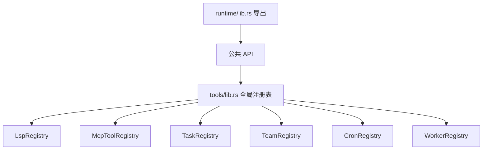

图示来源
- [lib.rs:52-171](file://rust/crates/runtime/src/lib.rs#L52-L171)
- [lib.rs（tools）:35-69](file://rust/crates/tools/src/lib.rs#L35-L69)

章节来源
- [lib.rs:1-180](file://rust/crates/runtime/src/lib.rs#L1-L180)
- [lib.rs（tools）:1-200](file://rust/crates/tools/src/lib.rs#L1-L200)

## 性能考虑
- 令牌压缩：基于累计输入令牌阈值自动压缩，降低上下文成本。
- IO 策略：JSONL 增量写入与轮转，避免大文件重写；原子写入保证一致性。
- 搜索优化：glob 与 walkdir 结合，grep 支持上下文与偏移，限制输出长度。
- 沙箱最小化：仅在必要时启用隔离，减少额外开销。

## 故障排查指南
- 会话健康探测
  - 在压缩后进行工具执行器探测，若失败提示重启新会话。
- 自动恢复
  - 针对信任提示未决、提示错投、过期分支、编译红叉 crate、MCP 握手失败、部分插件启动、提供商失败等场景，按配方自动尝试一次恢复并发出结构化事件。
- 工作器失败
  - 根据 WorkerFailureKind 映射到 FailureScenario，触发对应恢复步骤或升级策略。

章节来源
- [conversation.rs:295-330](file://rust/crates/runtime/src/conversation.rs#L295-L330)
- [recovery_recipes.rs:175-225](file://rust/crates/runtime/src/recovery_recipes.rs#L175-L225)
- [worker_boot.rs:46-53](file://rust/crates/runtime/src/worker_boot.rs#L46-L53)

## 结论
核心运行时以“会话为中心、权限为边界、提示为上下文、工具为手段、MCP 为扩展”的设计，实现了稳定、可观测、可恢复的对话式开发体验。通过清晰的引导流程、严格的权限策略、灵活的插件与 MCP 生态、以及完善的恢复与沙箱隔离，既满足日常开发需求，也为复杂场景下的扩展与演进提供了坚实基础。

## 附录
- 关键术语
  - 会话（Session）：一次对话的持久化载体。
  - 工具（Tool）：可被模型请求执行的操作单元。
  - MCP：Model Context Protocol，用于模型与外部工具/服务通信。
  - 插件（Plugin）：提供工具与资源的扩展模块。
  - 恢复配方（RecoveryRecipe）：针对特定失败场景的自动修复步骤序列。
  - 沙箱（Sandbox）：隔离的执行环境，限制命名空间、网络与文件系统访问。