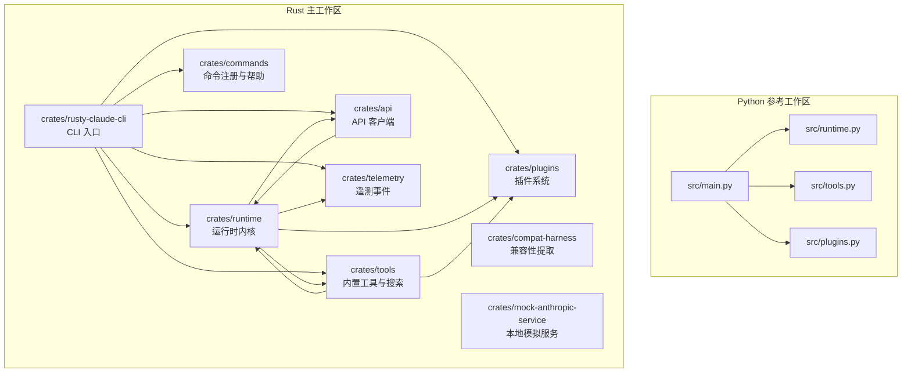
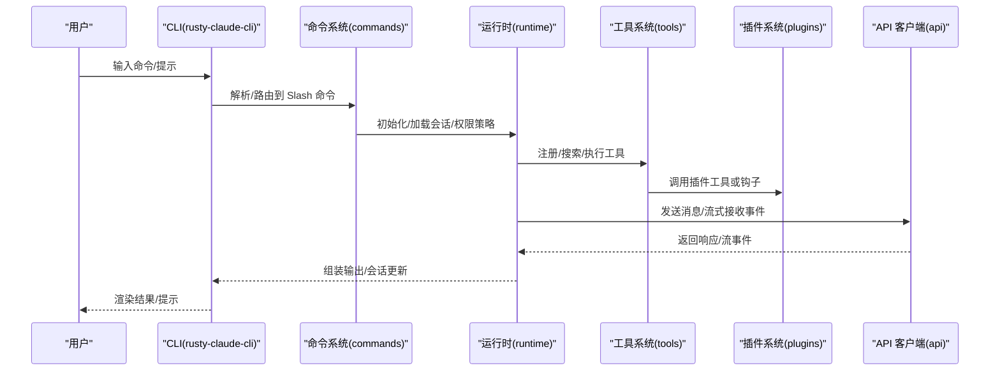
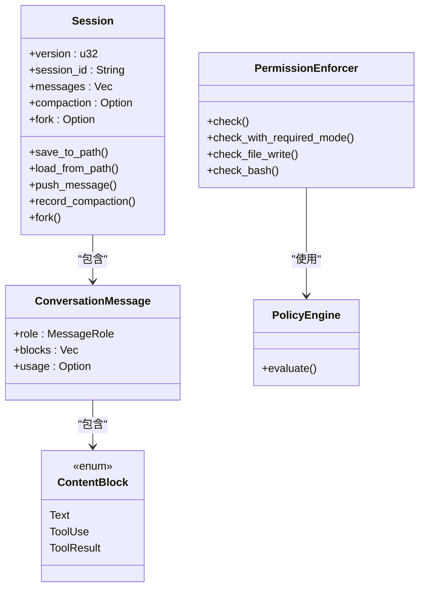
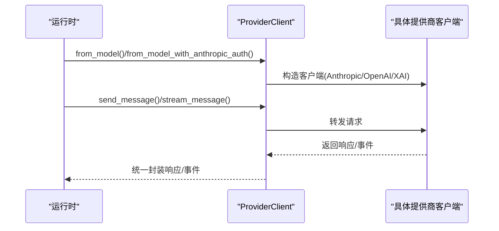
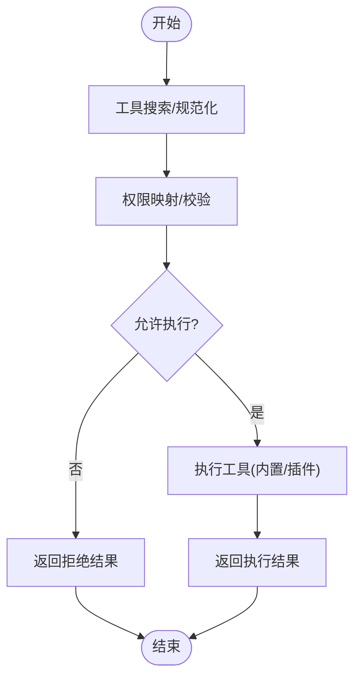
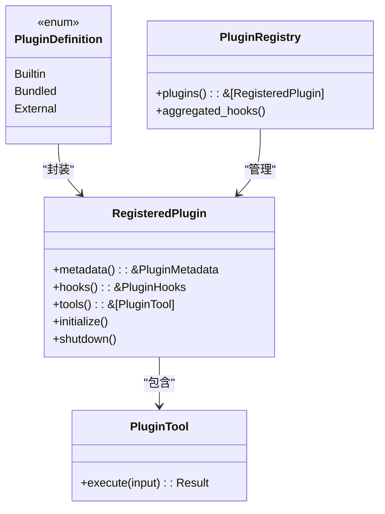
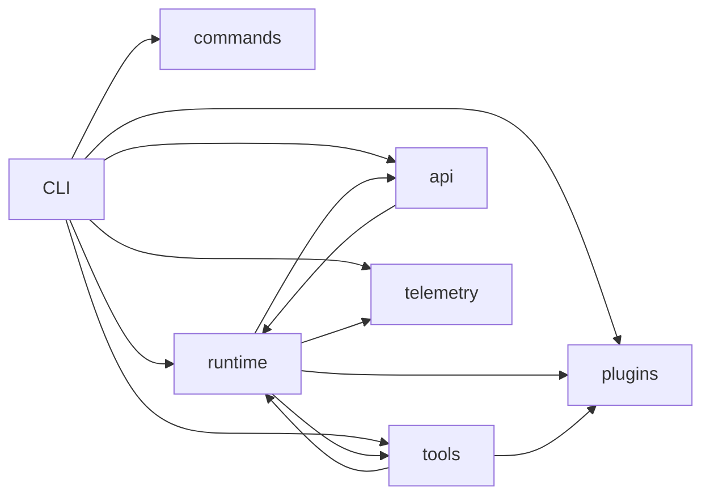

# 系统架构

<cite>
**本文引用的文件**
- [README.md](file://README.md)
- [rust/README.md](file://rust/README.md)
- [rust/Cargo.toml](file://rust/Cargo.toml)
- [src/main.py](file://src/main.py)
- [rust/crates/runtime/src/lib.rs](file://rust/crates/runtime/src/lib.rs)
- [rust/crates/api/src/lib.rs](file://rust/crates/api/src/lib.rs)
- [rust/crates/plugins/src/lib.rs](file://rust/crates/plugins/src/lib.rs)
- [rust/crates/tools/src/lib.rs](file://rust/crates/tools/src/lib.rs)
- [rust/crates/commands/src/lib.rs](file://rust/crates/commands/src/lib.rs)
- [rust/crates/runtime/src/session.rs](file://rust/crates/runtime/src/session.rs)
- [rust/crates/api/src/client.rs](file://rust/crates/api/src/client.rs)
- [rust/crates/api/src/types.rs](file://rust/crates/api/src/types.rs)
- [rust/crates/plugins/bundled/example-bundled/.claude-plugin/plugin.json](file://rust/crates/plugins/bundled/example-bundled/.claude-plugin/plugin.json)
- [rust/crates/tools/src/lane_completion.rs](file://rust/crates/tools/src/lane_completion.rs)
- [rust/crates/telemetry/src/lib.rs](file://rust/crates/telemetry/src/lib.rs)
- [rust/crates/runtime/src/config.rs](file://rust/crates/runtime/src/config.rs)
- [rust/crates/runtime/src/permission_enforcer.rs](file://rust/crates/runtime/src/permission_enforcer.rs)
</cite>

## 目录
1. [引言](#引言)
2. [项目结构](#项目结构)
3. [核心组件](#核心组件)
4. [架构总览](#架构总览)
5. [详细组件分析](#详细组件分析)
6. [依赖关系分析](#依赖关系分析)
7. [性能考量](#性能考量)
8. [故障排查指南](#故障排查指南)
9. [结论](#结论)
10. [附录](#附录)

## 引言
本文件面向架构师与高级开发者，系统化阐述 Claw Code 的高层设计与架构模式。Claw Code 是一个以 Rust 实现的 CLI 代理执行器，强调高性能、安全性与原生工具执行能力。其架构采用模块化与分层设计：上层由 CLI 与命令系统组成，中层为核心运行时（runtime），下层为 API 客户端、工具系统与插件系统。系统通过会话持久化、权限策略、MCP 生命周期管理、遥测与配置合并等机制实现稳定可控的交互闭环。

## 项目结构
仓库采用“双工作区”布局：
- Python 参考工作区：位于根目录 src/，用于镜像上游 TypeScript 行为与审计，非主运行面。
- Rust 主工作区：位于 rust/，包含 9 个 crate，提供高性能 CLI、会话与权限控制、工具与插件生态、API 客户端与遥测等能力。

图表来源
- [rust/README.md:175-211](file://rust/README.md#L175-L211)
- [src/main.py:1-214](file://src/main.py#L1-L214)

章节来源
- [README.md:31-44](file://README.md#L31-L44)
- [rust/README.md:175-211](file://rust/README.md#L175-L211)
- [rust/Cargo.toml:1-23](file://rust/Cargo.toml#L1-L23)

## 核心组件
- 运行时（runtime）：负责会话持久化、权限评估、提示词组装、MCP 拼接、文件操作、对话循环与使用统计等。是系统的核心协调者。
- API 客户端（api）：统一抽象多提供商（Anthropic、OpenAI 兼容、XAI）的消息发送、流式事件解析与请求预检；支持缓存与 OAuth。
- 工具系统（tools）：内置工具清单与执行器（如 bash、文件读写、搜索、网络抓取、任务创建等），并提供工具搜索、权限映射与全局注册表。
- 插件系统（plugins）：插件元数据、生命周期钩子、安装启用/禁用/更新、外部/内置/捆绑式插件分类与工具桥接。
- 命令系统（commands）：Slash 命令注册、解析与帮助渲染，覆盖会话、权限、MCP、技能、医生诊断等常用运维与开发场景。
- 遥测（telemetry）：会话追踪事件、HTTP 请求轨迹、分析事件与 JSONL 持久化，支撑可观测性与问题定位。
- 配置（runtime/config）：配置加载与合并、权限规则、MCP 服务器配置、沙箱隔离、模型别名与回退链路。

章节来源
- [rust/crates/runtime/src/lib.rs:1-180](file://rust/crates/runtime/src/lib.rs#L1-L180)
- [rust/crates/api/src/lib.rs:1-40](file://rust/crates/api/src/lib.rs#L1-L40)
- [rust/crates/tools/src/lib.rs:1-120](file://rust/crates/tools/src/lib.rs#L1-L120)
- [rust/crates/plugins/src/lib.rs:1-120](file://rust/crates/plugins/src/lib.rs#L1-L120)
- [rust/crates/commands/src/lib.rs:1-120](file://rust/crates/commands/src/lib.rs#L1-L120)
- [rust/crates/telemetry/src/lib.rs:1-120](file://rust/crates/telemetry/src/lib.rs#L1-L120)
- [rust/crates/runtime/src/config.rs:1-120](file://rust/crates/runtime/src/config.rs#L1-L120)

## 架构总览
Claw Code 采用“CLI → 命令系统 → 运行时 → 工具/插件 → API 客户端”的分层调用链。运行时贯穿会话状态、权限策略、MCP 生命周期与使用统计，形成稳定的执行闭环。

图表来源
- [rust/crates/commands/src/lib.rs:59-560](file://rust/crates/commands/src/lib.rs#L59-L560)
- [rust/crates/runtime/src/lib.rs:71-125](file://rust/crates/runtime/src/lib.rs#L71-L125)
- [rust/crates/tools/src/lib.rs:108-368](file://rust/crates/tools/src/lib.rs#L108-L368)
- [rust/crates/plugins/src/lib.rs:410-597](file://rust/crates/plugins/src/lib.rs#L410-L597)
- [rust/crates/api/src/client.rs:82-106](file://rust/crates/api/src/client.rs#L82-L106)

## 详细组件分析

### 运行时（runtime）
- 职责：会话持久化（JSON/JSONL）、消息角色与内容块建模、压缩与历史轮转、分支与 Fork、健康检查时间戳、MCP 服务器生命周期、OAuth、权限评估、策略引擎、任务与工作线程注册、沙箱隔离、使用统计与成本估算。
- 关键类型：Session、ConversationMessage、ContentBlock、SessionCompaction、SessionFork、PermissionEnforcer、PolicyEngine、McpServer 等。
- 数据流：输入提示 → 权限评估 → 提示词组装 → 工具选择/调用 → 输出/流事件 → 会话持久化/压缩 → 成本统计。

图表来源
- [rust/crates/runtime/src/session.rs:90-120](file://rust/crates/runtime/src/session.rs#L90-L120)
- [rust/crates/runtime/src/session.rs:47-80](file://rust/crates/runtime/src/session.rs#L47-L80)
- [rust/crates/runtime/src/permission_enforcer.rs:26-174](file://rust/crates/runtime/src/permission_enforcer.rs#L26-L174)

章节来源
- [rust/crates/runtime/src/session.rs:157-280](file://rust/crates/runtime/src/session.rs#L157-L280)
- [rust/crates/runtime/src/permission_enforcer.rs:31-173](file://rust/crates/runtime/src/permission_enforcer.rs#L31-L173)

### API 客户端（api）
- 职责：按模型别名解析提供商（Anthropic/OpenAI 兼容/XAI），构建 ProviderClient，统一发送消息与流式事件处理；支持提示词缓存与 OAuth。
- 关键类型：ProviderClient、MessageRequest/Response、StreamEvent、PromptCache、OAuthTokenSet。
- 流程：模型解析 → 客户端选择 → 发送/流式接收 → 缓存命中/统计 → 错误处理。

图表来源
- [rust/crates/api/src/client.rs:16-106](file://rust/crates/api/src/client.rs#L16-L106)
- [rust/crates/api/src/types.rs:5-136](file://rust/crates/api/src/types.rs#L5-L136)

章节来源
- [rust/crates/api/src/client.rs:16-106](file://rust/crates/api/src/client.rs#L16-L106)
- [rust/crates/api/src/types.rs:5-136](file://rust/crates/api/src/types.rs#L5-L136)

### 工具系统（tools）
- 职责：内置工具清单（bash、文件读写/搜索、网络抓取/搜索、任务创建、REPL、技能、配置等）、工具搜索与规范化、权限映射、全局注册表、任务/工作线程/团队/定时任务/语言通道注册。
- 关键类型：GlobalToolRegistry、RuntimeToolDefinition、ToolSpec、TaskRegistry、TeamRegistry、WorkerRegistry。
- 流程：工具搜索 → 规范化名称 → 权限校验 → 执行 → 结果返回/错误处理。

图表来源
- [rust/crates/tools/src/lib.rs:313-368](file://rust/crates/tools/src/lib.rs#L313-L368)
- [rust/crates/tools/src/lib.rs:374-381](file://rust/crates/tools/src/lib.rs#L374-L381)

章节来源
- [rust/crates/tools/src/lib.rs:108-368](file://rust/crates/tools/src/lib.rs#L108-L368)

### 插件系统（plugins）
- 职责：插件元数据与清单（plugin.json）、生命周期钩子（Pre/Post/失败）、安装启用/禁用/更新、外部/内置/捆绑式插件分类、插件工具定义与执行、聚合钩子。
- 关键类型：PluginDefinition、RegisteredPlugin、PluginRegistry、PluginTool、HookRunner。
- 流程：发现/加载 → 校验/初始化 → 钩子触发 → 工具执行 → 关闭/清理。

图表来源
- [rust/crates/plugins/src/lib.rs:410-597](file://rust/crates/plugins/src/lib.rs#L410-L597)
- [rust/crates/plugins/src/lib.rs:760-793](file://rust/crates/plugins/src/lib.rs#L760-L793)
- [rust/crates/plugins/bundled/example-bundled/.claude-plugin/plugin.json:1-11](file://rust/crates/plugins/bundled/example-bundled/.claude-plugin/plugin.json#L1-L11)

章节来源
- [rust/crates/plugins/src/lib.rs:410-597](file://rust/crates/plugins/src/lib.rs#L410-L597)
- [rust/crates/plugins/bundled/example-bundled/.claude-plugin/plugin.json:1-11](file://rust/crates/plugins/bundled/example-bundled/.claude-plugin/plugin.json#L1-L11)

### 命令系统（commands）
- 职责：Slash 命令注册与解析、帮助文本生成、JSON/文本渲染、会话/权限/MCP/技能/医生诊断等常用命令。
- 关键类型：SlashCommandSpec、CommandRegistry、SkillSlashDispatch。
- 流程：命令解析 → 参数校验 → 路由到运行时/工具 → 输出结果。

章节来源
- [rust/crates/commands/src/lib.rs:59-560](file://rust/crates/commands/src/lib.rs#L59-L560)

### 遥测（telemetry）
- 职责：会话追踪记录、HTTP 请求轨迹、分析事件、内存/JSONL 持久化。
- 关键类型：SessionTracer、TelemetryEvent、JsonlTelemetrySink、MemoryTelemetrySink。
- 流程：事件构造 → 记录到内存/文件 → 序列化输出。

章节来源
- [rust/crates/telemetry/src/lib.rs:279-407](file://rust/crates/telemetry/src/lib.rs#L279-L407)

### 配置与权限（runtime/config 与 permission_enforcer）
- 职责：配置加载与合并、权限策略、MCP 服务器配置、沙箱隔离、模型别名与回退链路。
- 关键类型：RuntimeConfig、RuntimeFeatureConfig、PermissionPolicy、PermissionEnforcer。
- 流程：加载配置 → 合并与派生视图 → 权限判定 → 工具执行前拦截。

章节来源
- [rust/crates/runtime/src/config.rs:36-120](file://rust/crates/runtime/src/config.rs#L36-L120)
- [rust/crates/runtime/src/permission_enforcer.rs:26-174](file://rust/crates/runtime/src/permission_enforcer.rs#L26-L174)

## 依赖关系分析
- 组件耦合：CLI 依赖命令系统、运行时、工具与插件；运行时依赖 API 客户端、工具、插件与遥测；工具依赖插件与运行时；API 客户端与配置/权限解耦。
- 外部集成：MCP 服务器（stdio/SSE/HTTP/WS/SDK/ManagedProxy）、OAuth、沙箱隔离、提示词缓存。
- 循环依赖：未见直接循环；通过接口与枚举类型避免循环引用。

图表来源
- [rust/README.md:175-211](file://rust/README.md#L175-L211)

章节来源
- [rust/README.md:175-211](file://rust/README.md#L175-L211)

## 性能考量
- 会话持久化：JSONL 追加写入与轮转，减少大文件重写开销；原子写入保障一致性。
- 工具执行：内置工具直接调用，插件工具通过进程桥接；权限映射在执行前完成，避免重复计算。
- API 流式：统一流式事件解析，降低内存峰值；提示词缓存仅在支持提供商启用。
- 并发与注册表：全局 LSP/MCP/任务/工作线程/团队/定时任务注册表使用 OnceLock，避免重复初始化。
- 配置合并：按作用域合并，减少运行时解析成本。

## 故障排查指南
- 会话相关：检查会话文件是否存在、JSONL 结构是否完整、轮转文件数量限制、路径权限。
- 权限相关：确认当前权限模式与工具所需权限匹配，必要时切换模式或交互确认。
- MCP 相关：检查服务器配置（URL/头/凭据/OAuth）、传输类型（stdio/SSE/HTTP/WS/SDK/ManagedProxy），查看降级报告。
- 插件相关：查看插件加载失败列表、钩子执行结果、工具执行返回码与标准错误。
- 遥测相关：检查 JSONL 文件可读性、事件序列号与时间戳，定位请求失败与重试行为。

章节来源
- [rust/crates/runtime/src/session.rs:204-227](file://rust/crates/runtime/src/session.rs#L204-L227)
- [rust/crates/plugins/src/lib.rs:699-738](file://rust/crates/plugins/src/lib.rs#L699-L738)
- [rust/crates/telemetry/src/lib.rs:233-277](file://rust/crates/telemetry/src/lib.rs#L233-L277)

## 结论
Claw Code 通过清晰的模块化与分层设计，在保证安全与可控的前提下实现了高性能与可扩展性。运行时作为中枢协调会话、权限、工具与插件，API 客户端提供统一的多提供商接入，遥测与配置完善可观测性与可运维性。该架构为后续扩展（如更多工具、插件生态、MCP 生态与策略引擎）提供了坚实基础。

## 附录
- Python 参考工作区：用于镜像上游行为与审计，便于对比 Rust 实现的一致性与回归测试。
- 构建与运行：参考 Rust 工作区 README 的快速启动与特性清单；注意 API 密钥与 OAuth 设置。

章节来源
- [README.md:46-107](file://README.md#L46-L107)
- [rust/README.md:7-25](file://rust/README.md#L7-L25)