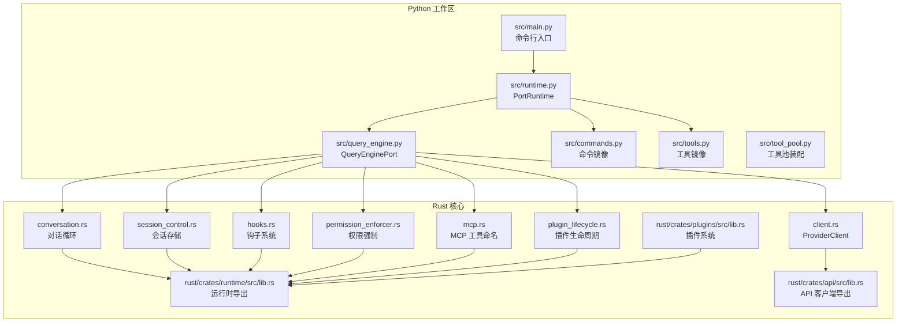
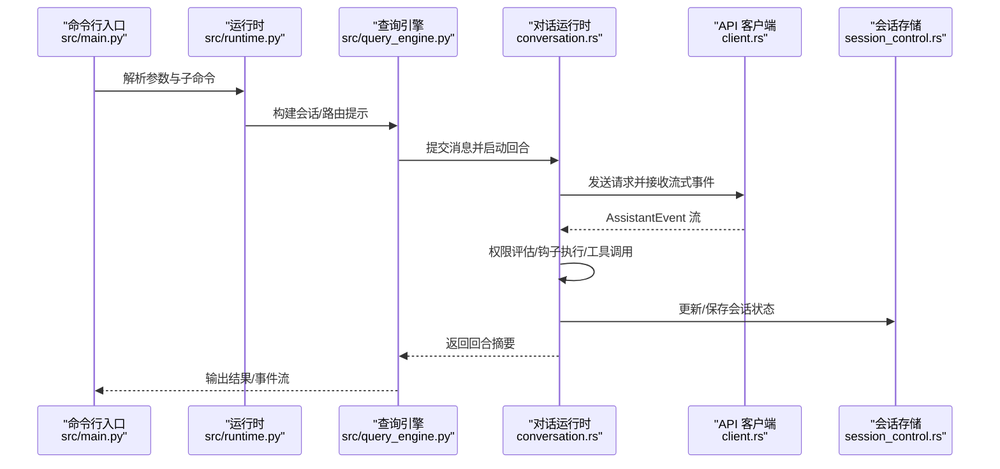
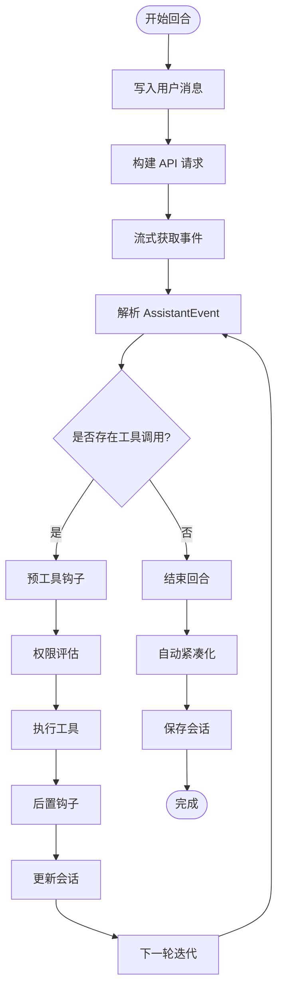
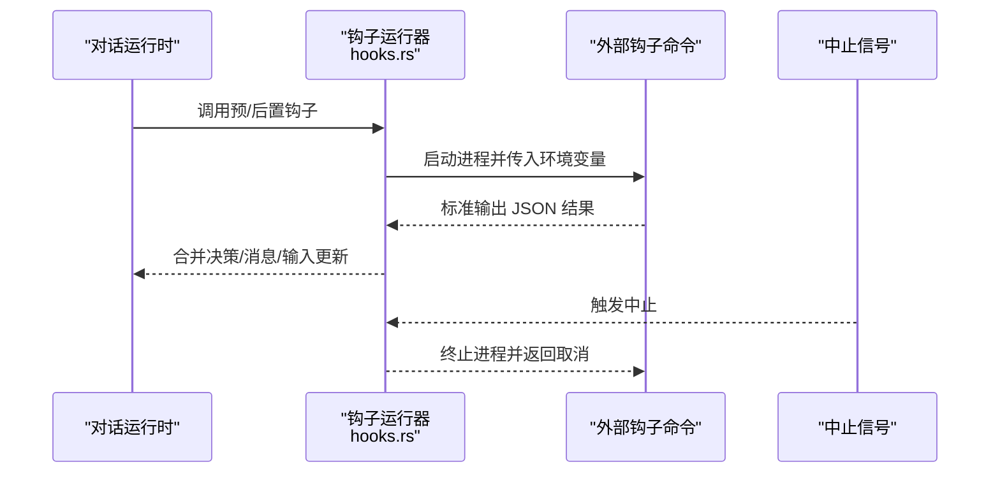
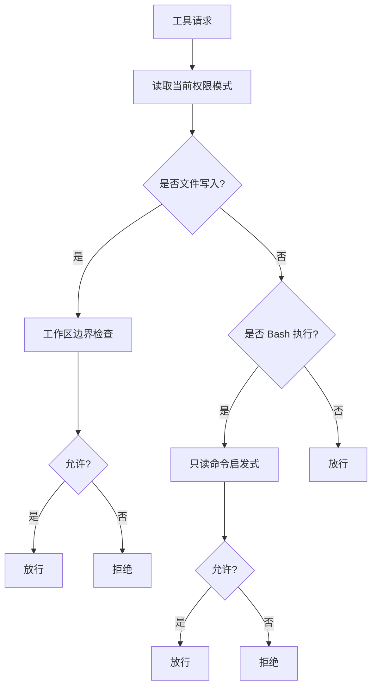
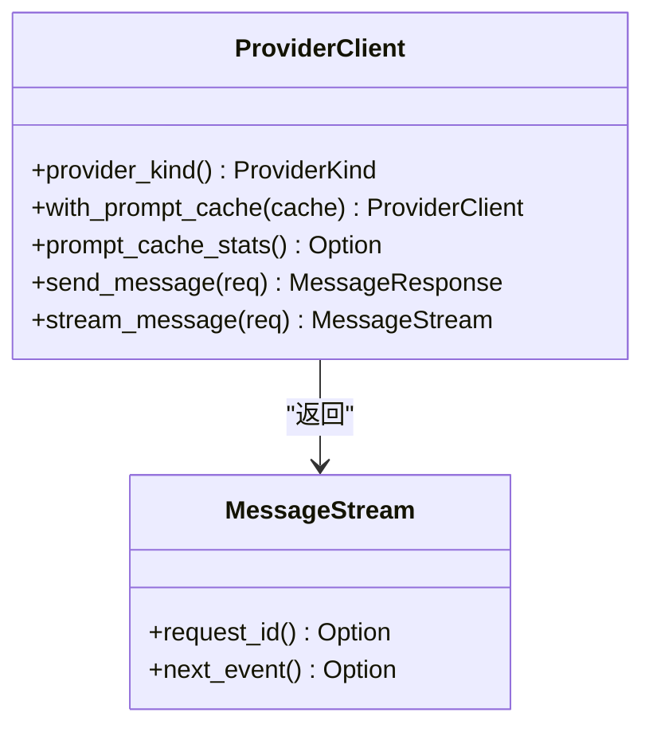
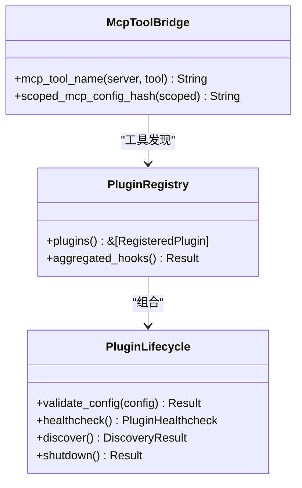
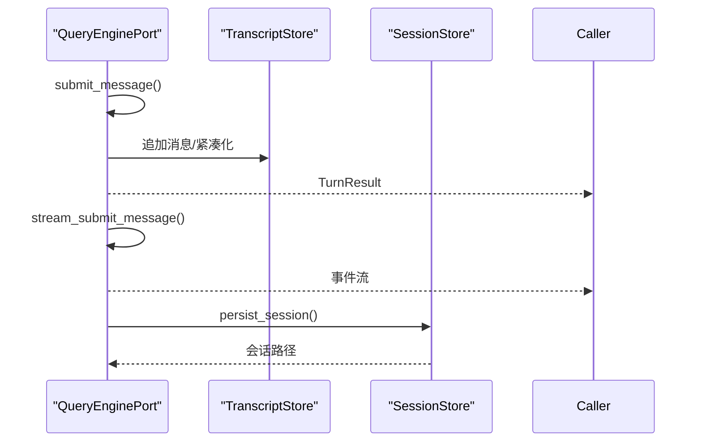
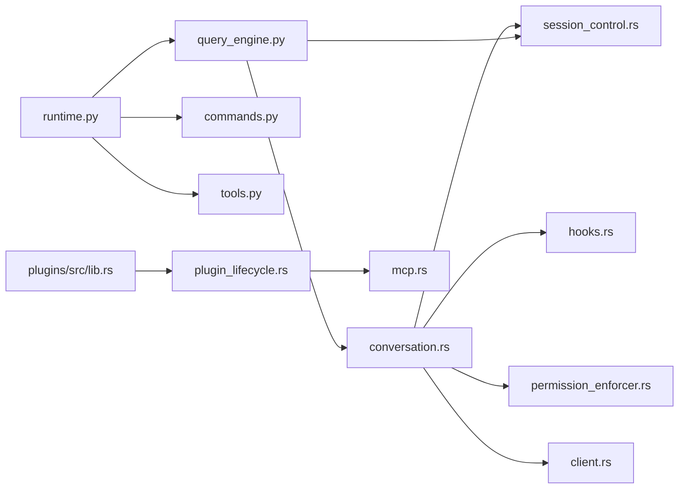

# 组件交互模式

<cite>
**本文档引用的文件**
- [README.md](file://README.md)
- [Cargo.toml](file://rust/Cargo.toml)
- [src/main.py](file://src/main.py)
- [src/runtime.py](file://src/runtime.py)
- [src/query_engine.py](file://src/query_engine.py)
- [src/commands.py](file://src/commands.py)
- [src/tools.py](file://src/tools.py)
- [src/tool_pool.py](file://src/tool_pool.py)
- [rust/crates/runtime/src/lib.rs](file://rust/crates/runtime/src/lib.rs)
- [rust/crates/runtime/src/conversation.rs](file://rust/crates/runtime/src/conversation.rs)
- [rust/crates/runtime/src/session_control.rs](file://rust/crates/runtime/src/session_control.rs)
- [rust/crates/runtime/src/hooks.rs](file://rust/crates/runtime/src/hooks.rs)
- [rust/crates/runtime/src/permission_enforcer.rs](file://rust/crates/runtime/src/permission_enforcer.rs)
- [rust/crates/runtime/src/mcp.rs](file://rust/crates/runtime/src/mcp.rs)
- [rust/crates/runtime/src/plugin_lifecycle.rs](file://rust/crates/runtime/src/plugin_lifecycle.rs)
- [rust/crates/api/src/lib.rs](file://rust/crates/api/src/lib.rs)
- [rust/crates/api/src/client.rs](file://rust/crates/api/src/client.rs)
- [rust/crates/plugins/src/lib.rs](file://rust/crates/plugins/src/lib.rs)
</cite>

## 目录
1. [引言](#引言)
2. [项目结构](#项目结构)
3. [核心组件](#核心组件)
4. [架构总览](#架构总览)
5. [详细组件分析](#详细组件分析)
6. [依赖分析](#依赖分析)
7. [性能考虑](#性能考虑)
8. [故障排查指南](#故障排查指南)
9. [结论](#结论)

## 引言
本文件聚焦于系统中“组件交互模式”的设计与实现，围绕运行时、API 客户端、工具系统与插件系统之间的协作关系展开，解释事件驱动架构、消息传递与状态同步机制，阐述组件解耦策略、接口抽象与依赖注入模式，并给出并发控制、错误传播与优雅降级机制的实践建议。目标是帮助读者从交互视角理解系统动态行为与组件集成方式。

## 项目结构
仓库采用双语言并行的工作区：Python 参考实现用于审计与镜像（src/），Rust 核心运行时与基础设施位于 rust/。二者通过命令行入口与查询引擎桥接，形成“Python 视图 + Rust 运行时”的协同架构。

**图表来源**
- [src/main.py:1-214](file://src/main.py#L1-L214)
- [src/runtime.py:89-193](file://src/runtime.py#L89-L193)
- [src/query_engine.py:35-194](file://src/query_engine.py#L35-L194)
- [rust/crates/runtime/src/lib.rs:1-180](file://rust/crates/runtime/src/lib.rs#L1-L180)
- [rust/crates/api/src/lib.rs:1-40](file://rust/crates/api/src/lib.rs#L1-L40)
- [rust/crates/plugins/src/lib.rs:1-800](file://rust/crates/plugins/src/lib.rs#L1-L800)

**章节来源**
- [README.md:31-132](file://README.md#L31-L132)
- [Cargo.toml:1-23](file://Cargo.toml#L1-L23)

## 核心组件
- 运行时（Rust）：负责会话持久化、权限评估、提示词组装、MCP 管理、工具文件操作、对话循环等核心能力。
- API 客户端（Rust）：统一 ProviderClient 抽象，支持 Anthropic、XAI、OpenAI 兼容模型，提供流式与非流式消息接口。
- 工具系统（Python/Rust 镜像）：通过命令/工具镜像清单与执行器，提供可路由的工具集合；支持权限上下文过滤。
- 插件系统（Rust）：插件注册、生命周期管理、健康检查、降级模式与 MCP 工具桥接。
- 查询引擎（Python）：会话与回合结果的记录、流式事件生成、预算与紧凑化策略。

**章节来源**
- [rust/crates/runtime/src/lib.rs:1-180](file://rust/crates/runtime/src/lib.rs#L1-L180)
- [rust/crates/api/src/lib.rs:1-40](file://rust/crates/api/src/lib.rs#L1-L40)
- [src/query_engine.py:35-194](file://src/query_engine.py#L35-L194)
- [src/commands.py:13-91](file://src/commands.py#L13-L91)
- [src/tools.py:14-97](file://src/tools.py#L14-L97)
- [rust/crates/plugins/src/lib.rs:1-800](file://rust/crates/plugins/src/lib.rs#L1-L800)

## 架构总览
系统采用“事件驱动 + 消息流 + 状态机”的交互模式：
- 事件驱动：对话循环以 AssistantEvent 流为驱动，逐轮处理文本增量、工具调用、用量统计与缓存事件。
- 消息传递：ProviderClient 提供统一的流式消息接口，运行时将其转换为 AssistantEvent，再由工具执行器与钩子系统消费。
- 状态同步：Session 控制器负责会话持久化与分支管理；权限强制器与钩子系统在每次工具使用前后进行状态更新与决策。

**图表来源**
- [src/main.py:94-214](file://src/main.py#L94-L214)
- [src/runtime.py:89-193](file://src/runtime.py#L89-L193)
- [src/query_engine.py:61-128](file://src/query_engine.py#L61-L128)
- [rust/crates/runtime/src/conversation.rs:125-515](file://rust/crates/runtime/src/conversation.rs#L125-L515)
- [rust/crates/api/src/client.rs:82-130](file://rust/crates/api/src/client.rs#L82-L130)
- [rust/crates/runtime/src/session_control.rs:158-172](file://rust/crates/runtime/src/session_control.rs#L158-L172)

## 详细组件分析

### 对话运行时与事件流
对话运行时通过泛型接口将 API 客户端与工具执行器解耦，借助钩子系统与权限强制器实现可扩展的工具调用链路。其核心流程如下：

**图表来源**
- [rust/crates/runtime/src/conversation.rs:314-515](file://rust/crates/runtime/src/conversation.rs#L314-L515)

**章节来源**
- [rust/crates/runtime/src/conversation.rs:52-139](file://rust/crates/runtime/src/conversation.rs#L52-L139)
- [rust/crates/runtime/src/conversation.rs:224-293](file://rust/crates/runtime/src/conversation.rs#L224-L293)
- [rust/crates/runtime/src/conversation.rs:517-578](file://rust/crates/runtime/src/conversation.rs#L517-L578)

### 钩子系统与并发控制
钩子系统通过外部进程执行与异步等待实现事件驱动的工具前后置处理，支持中止信号与进度报告器，具备良好的并发控制与优雅取消能力。

**图表来源**
- [rust/crates/runtime/src/hooks.rs:167-307](file://rust/crates/runtime/src/hooks.rs#L167-L307)
- [rust/crates/runtime/src/hooks.rs:413-490](file://rust/crates/runtime/src/hooks.rs#L413-L490)
- [rust/crates/runtime/src/hooks.rs:634-713](file://rust/crates/runtime/src/hooks.rs#L634-L713)

**章节来源**
- [rust/crates/runtime/src/hooks.rs:18-78](file://rust/crates/runtime/src/hooks.rs#L18-L78)
- [rust/crates/runtime/src/hooks.rs:310-411](file://rust/crates/runtime/src/hooks.rs#L310-L411)

### 权限强制与降级策略
权限强制器根据策略模式在工具执行前进行判定，结合工作区边界检查与 Bash 命令启发式规则，提供多层级的权限控制与降级反馈。

**图表来源**
- [rust/crates/runtime/src/permission_enforcer.rs:108-173](file://rust/crates/runtime/src/permission_enforcer.rs#L108-L173)
- [rust/crates/runtime/src/permission_enforcer.rs:176-272](file://rust/crates/runtime/src/permission_enforcer.rs#L176-L272)

**章节来源**
- [rust/crates/runtime/src/permission_enforcer.rs:12-61](file://rust/crates/runtime/src/permission_enforcer.rs#L12-L61)

### API 客户端与多提供商适配
ProviderClient 将不同提供商的客户端统一为一致的接口，支持流式与非流式消息发送，并提供提示词缓存统计与记录访问。

**图表来源**
- [rust/crates/api/src/client.rs:16-107](file://rust/crates/api/src/client.rs#L16-L107)
- [rust/crates/api/src/client.rs:109-130](file://rust/crates/api/src/client.rs#L109-L130)

**章节来源**
- [rust/crates/api/src/lib.rs:9-39](file://rust/crates/api/src/lib.rs#L9-L39)

### 插件系统与 MCP 工具桥接
插件系统提供统一的生命周期管理、健康检查与降级模式，支持内置/捆绑/外部插件类型，并通过 MCP 工具命名规范与配置签名实现跨服务器一致性。

**图表来源**
- [rust/crates/plugins/src/lib.rs:410-597](file://rust/crates/plugins/src/lib.rs#L410-L597)
- [rust/crates/runtime/src/plugin_lifecycle.rs:214-219](file://rust/crates/runtime/src/plugin_lifecycle.rs#L214-L219)
- [rust/crates/runtime/src/mcp.rs:25-121](file://rust/crates/runtime/src/mcp.rs#L25-L121)

**章节来源**
- [rust/crates/plugins/src/lib.rs:55-167](file://rust/crates/plugins/src/lib.rs#L55-L167)
- [rust/crates/runtime/src/plugin_lifecycle.rs:16-99](file://rust/crates/runtime/src/plugin_lifecycle.rs#L16-L99)

### Python 查询引擎与会话管理
查询引擎负责回合提交、流式事件生成、预算控制与会话紧凑化，同时提供会话加载/保存与转录管理。

**图表来源**
- [src/query_engine.py:61-128](file://src/query_engine.py#L61-L128)
- [src/query_engine.py:140-150](file://src/query_engine.py#L140-L150)
- [rust/crates/runtime/src/session_control.rs:158-172](file://rust/crates/runtime/src/session_control.rs#L158-L172)

**章节来源**
- [src/query_engine.py:15-44](file://src/query_engine.py#L15-L44)
- [src/query_engine.py:129-133](file://src/query_engine.py#L129-L133)

## 依赖分析
- 组件耦合与内聚：运行时通过 traits（ApiClient、ToolExecutor）与外部模块解耦；API 客户端集中于 ProviderClient；插件系统通过生命周期 trait 统一管理。
- 直接与间接依赖：对话运行时依赖会话存储、钩子、权限强制与 API 客户端；查询引擎依赖运行时与会话存储；命令/工具镜像通过 Python 层装配。
- 外部依赖与集成点：MCP 服务器配置签名、OAuth 回调、代理环境变量、容器沙箱检测等。

**图表来源**
- [rust/crates/runtime/src/conversation.rs:125-139](file://rust/crates/runtime/src/conversation.rs#L125-L139)
- [rust/crates/runtime/src/session_control.rs:158-172](file://rust/crates/runtime/src/session_control.rs#L158-L172)
- [rust/crates/runtime/src/hooks.rs:151-165](file://rust/crates/runtime/src/hooks.rs#L151-L165)
- [rust/crates/runtime/src/permission_enforcer.rs:26-35](file://rust/crates/runtime/src/permission_enforcer.rs#L26-L35)
- [rust/crates/api/src/client.rs:16-107](file://rust/crates/api/src/client.rs#L16-L107)
- [src/query_engine.py:61-128](file://src/query_engine.py#L61-L128)
- [src/runtime.py:89-193](file://src/runtime.py#L89-L193)
- [rust/crates/plugins/src/lib.rs:410-597](file://rust/crates/plugins/src/lib.rs#L410-L597)
- [rust/crates/runtime/src/plugin_lifecycle.rs:214-219](file://rust/crates/runtime/src/plugin_lifecycle.rs#L214-L219)
- [rust/crates/runtime/src/mcp.rs:25-121](file://rust/crates/runtime/src/mcp.rs#L25-L121)

**章节来源**
- [rust/crates/runtime/src/lib.rs:52-171](file://rust/crates/runtime/src/lib.rs#L52-L171)
- [rust/crates/api/src/lib.rs:9-39](file://rust/crates/api/src/lib.rs#L9-L39)
- [rust/crates/plugins/src/lib.rs:55-167](file://rust/crates/plugins/src/lib.rs#L55-L167)

## 性能考虑
- 自动紧凑化：基于输入令牌阈值触发会话紧凑化，减少上下文开销，避免超出模型限制。
- 流式事件：API 客户端采用流式接口，降低首字节延迟，提升用户体验。
- 钩子异步执行：钩子命令通过外部进程执行并支持中止信号，避免阻塞主流程。
- 会话存储：按工作树指纹隔离会话目录，避免并发冲突并提高 I/O 效率。

[本节为通用指导，无需特定文件引用]

## 故障排查指南
- 会话加载失败：检查会话路径是否存在、工作区根匹配与历史兼容性。
- 工具执行失败：查看钩子输出中的系统消息与权限决策字段，确认是否被拒绝或失败。
- 权限不足：根据权限强制器的拒绝原因调整模式或申请许可。
- 插件健康检查：关注插件状态与可用工具列表，必要时进入降级模式。

**章节来源**
- [rust/crates/runtime/src/session_control.rs:205-225](file://rust/crates/runtime/src/session_control.rs#L205-L225)
- [rust/crates/runtime/src/hooks.rs:535-589](file://rust/crates/runtime/src/hooks.rs#L535-L589)
- [rust/crates/runtime/src/permission_enforcer.rs:12-61](file://rust/crates/runtime/src/permission_enforcer.rs#L12-L61)
- [rust/crates/runtime/src/plugin_lifecycle.rs:116-161](file://rust/crates/runtime/src/plugin_lifecycle.rs#L116-L161)

## 结论
该系统通过清晰的接口抽象与事件驱动架构，实现了运行时、API 客户端、工具系统与插件系统的松耦合协作。对话运行时作为中枢协调各组件，配合钩子与权限强制实现可控的工具调用链；查询引擎提供会话与回合的统一管理；Rust 核心与 Python 镜像协同，既保证了可审计性又提供了高性能的运行时支撑。上述交互模式为系统的可扩展性、可观测性与稳定性奠定了坚实基础。