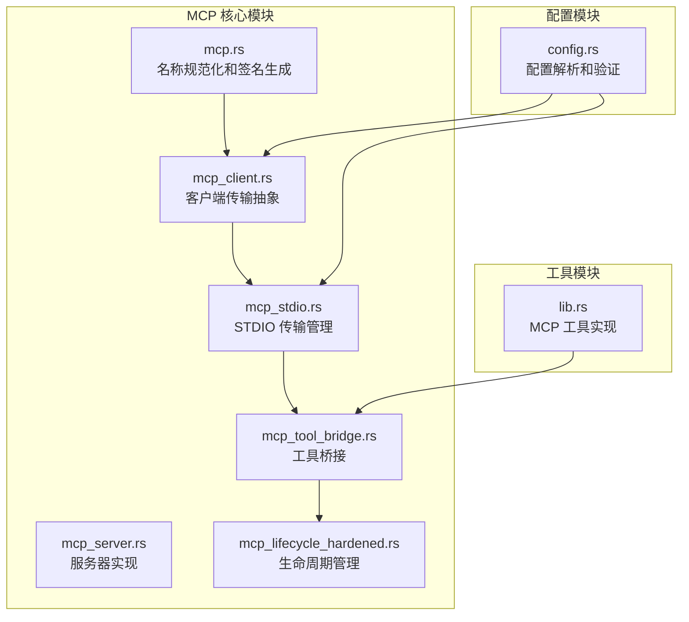
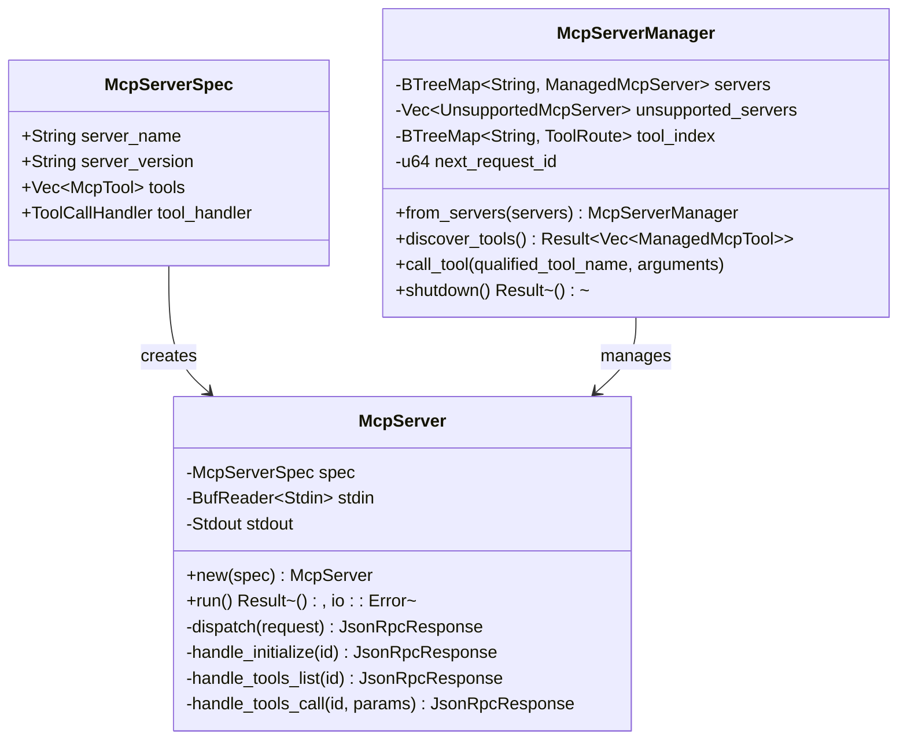
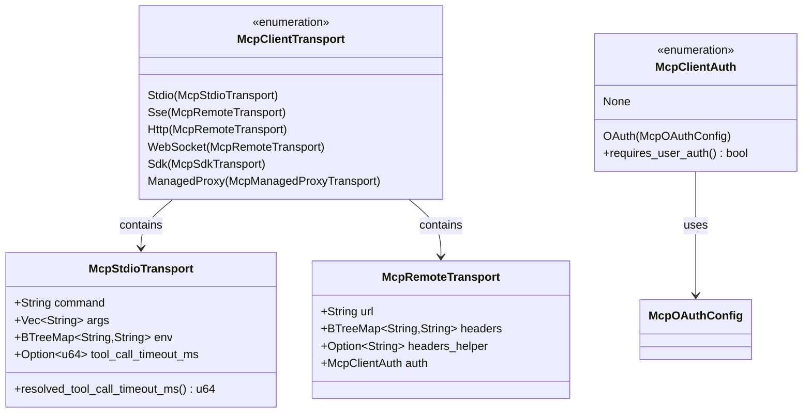
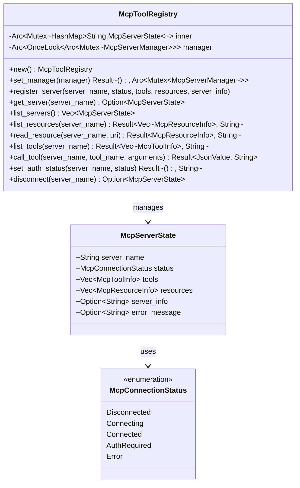
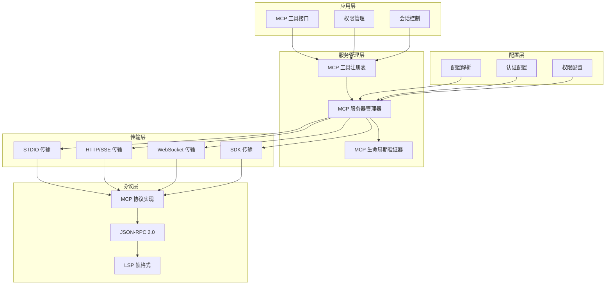
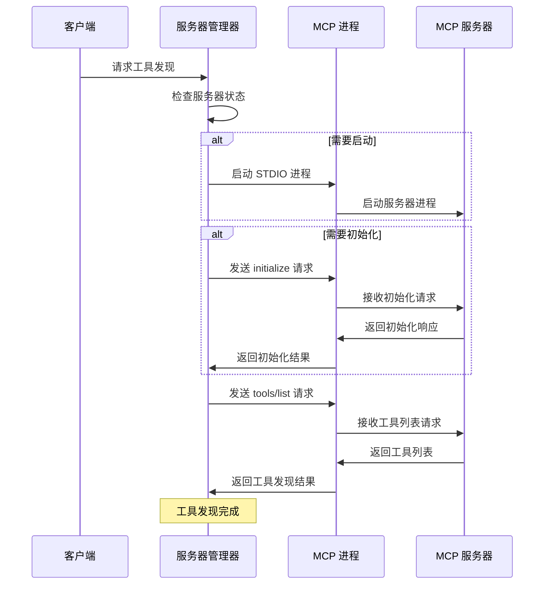
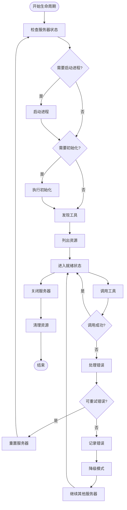
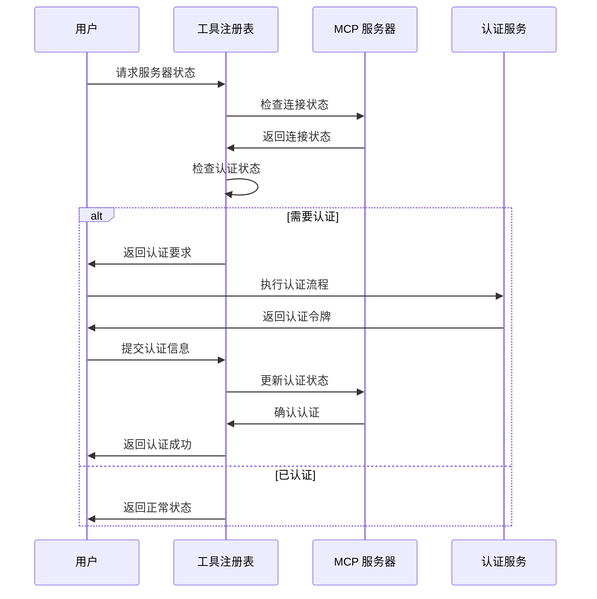
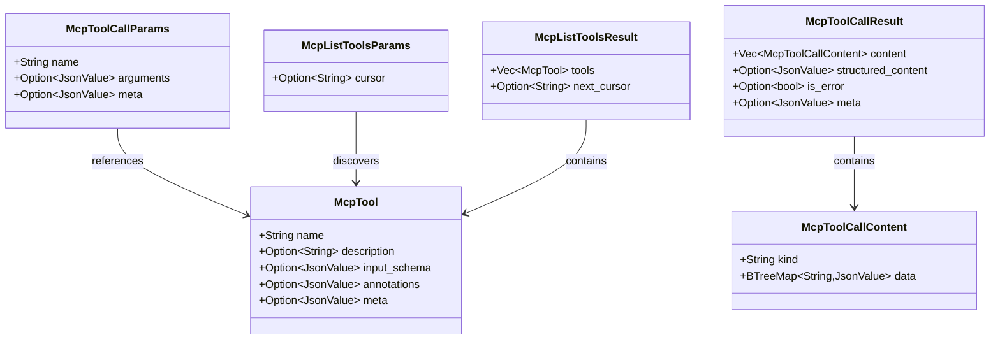
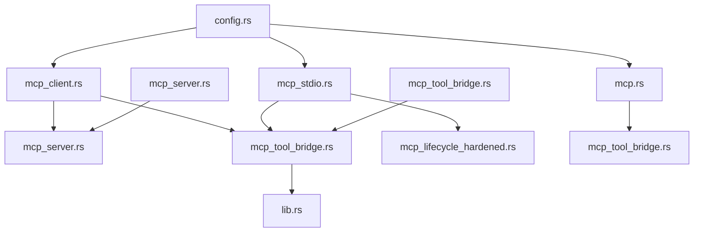

# MCP 生命周期管理

<cite>
**本文档引用的文件**
- [mcp.rs](file://rust/crates/runtime/src/mcp.rs)
- [mcp_client.rs](file://rust/crates/runtime/src/mcp_client.rs)
- [mcp_server.rs](file://rust/crates/runtime/src/mcp_server.rs)
- [mcp_stdio.rs](file://rust/crates/runtime/src/mcp_stdio.rs)
- [mcp_tool_bridge.rs](file://rust/crates/runtime/src/mcp_tool_bridge.rs)
- [mcp_lifecycle_hardened.rs](file://rust/crates/runtime/src/mcp_lifecycle_hardened.rs)
- [config.rs](file://rust/crates/runtime/src/config.rs)
- [lib.rs](file://rust/crates/tools/src/lib.rs)
</cite>

## 目录
1. [简介](#简介)
2. [项目结构](#项目结构)
3. [核心组件](#核心组件)
4. [架构概览](#架构概览)
5. [详细组件分析](#详细组件分析)
6. [依赖关系分析](#依赖关系分析)
7. [性能考虑](#性能考虑)
8. [故障排除指南](#故障排除指南)
9. [结论](#结论)

## 简介

MCP（Model Context Protocol）生命周期管理是本项目中一个关键的基础设施模块，负责管理 MCP 服务器和客户端的完整生命周期。该系统实现了标准化的 MCP 协议支持，提供了灵活的传输层抽象，以及强大的工具桥接功能。

本系统的核心目标是：
- 提供标准化的 MCP 协议实现
- 支持多种传输协议（STDIO、HTTP、WebSocket等）
- 实现健壮的生命周期管理和错误恢复机制
- 提供工具桥接功能，使外部 MCP 服务器能够被统一管理
- 支持认证和授权流程

## 项目结构

项目采用模块化设计，主要组件分布在 runtime 和 tools 两个核心模块中：

**图表来源**
- [mcp.rs:1-305](file://rust/crates/runtime/src/mcp.rs#L1-L305)
- [mcp_client.rs:1-249](file://rust/crates/runtime/src/mcp_client.rs#L1-L249)
- [mcp_stdio.rs:1-800](file://rust/crates/runtime/src/mcp_stdio.rs#L1-L800)
- [mcp_tool_bridge.rs:1-327](file://rust/crates/runtime/src/mcp_tool_bridge.rs#L1-L327)
- [mcp_lifecycle_hardened.rs:1-800](file://rust/crates/runtime/src/mcp_lifecycle_hardened.rs#L1-L800)
- [config.rs:1-200](file://rust/crates/runtime/src/config.rs#L1-L200)

**章节来源**
- [mcp.rs:1-305](file://rust/crates/runtime/src/mcp.rs#L1-L305)
- [mcp_client.rs:1-249](file://rust/crates/runtime/src/mcp_client.rs#L1-L249)
- [mcp_stdio.rs:1-800](file://rust/crates/runtime/src/mcp_stdio.rs#L1-L800)
- [mcp_tool_bridge.rs:1-327](file://rust/crates/runtime/src/mcp_tool_bridge.rs#L1-L327)
- [mcp_lifecycle_hardened.rs:1-800](file://rust/crates/runtime/src/mcp_lifecycle_hardened.rs#L1-L800)
- [config.rs:1-200](file://rust/crates/runtime/src/config.rs#L1-L200)

## 核心组件

### MCP 协议版本管理

系统实现了标准化的 MCP 协议版本管理，确保客户端和服务端之间的兼容性：

**图表来源**
- [mcp_server.rs:44-230](file://rust/crates/runtime/src/mcp_server.rs#L44-L230)
- [mcp_stdio.rs:479-520](file://rust/crates/runtime/src/mcp_stdio.rs#L479-L520)

系统使用固定的协议版本字符串 `"2025-03-26"`，确保与内置客户端保持同步。

**章节来源**
- [mcp_server.rs:29-42](file://rust/crates/runtime/src/mcp_server.rs#L29-L42)
- [mcp_server.rs:162-176](file://rust/crates/runtime/src/mcp_server.rs#L162-L176)

### 传输层抽象

系统提供了统一的传输层抽象，支持多种传输协议：

**图表来源**
- [mcp_client.rs:8-16](file://rust/crates/runtime/src/mcp_client.rs#L8-L16)
- [mcp_client.rs:18-32](file://rust/crates/runtime/src/mcp_client.rs#L18-L32)
- [mcp_client.rs:46-49](file://rust/crates/runtime/src/mcp_client.rs#L46-L49)

**章节来源**
- [mcp_client.rs:1-249](file://rust/crates/runtime/src/mcp_client.rs#L1-L249)

### 工具桥接功能

工具桥接系统提供了 MCP 服务器的状态管理和工具调用能力：

**图表来源**
- [mcp_tool_bridge.rs:74-77](file://rust/crates/runtime/src/mcp_tool_bridge.rs#L74-L77)
- [mcp_tool_bridge.rs:63-71](file://rust/crates/runtime/src/mcp_tool_bridge.rs#L63-L71)

**章节来源**
- [mcp_tool_bridge.rs:1-327](file://rust/crates/runtime/src/mcp_tool_bridge.rs#L1-L327)

## 架构概览

系统采用分层架构设计，从底层传输到上层应用服务：

**图表来源**
- [mcp_tool_bridge.rs:1-327](file://rust/crates/runtime/src/mcp_tool_bridge.rs#L1-L327)
- [mcp_stdio.rs:479-520](file://rust/crates/runtime/src/mcp_stdio.rs#L479-L520)
- [mcp_lifecycle_hardened.rs:14-65](file://rust/crates/runtime/src/mcp_lifecycle_hardened.rs#L14-L65)

## 详细组件分析

### MCP 服务器生命周期管理

系统实现了完整的 MCP 服务器生命周期管理，包括启动、初始化、工具发现、资源发现和关闭：

**图表来源**
- [mcp_stdio.rs:1047-1139](file://rust/crates/runtime/src/mcp_stdio.rs#L1047-L1139)
- [mcp_stdio.rs:806-872](file://rust/crates/runtime/src/mcp_stdio.rs#L806-L872)

生命周期管理的关键阶段包括：
1. **配置加载**：从配置文件加载 MCP 服务器配置
2. **服务器注册**：注册支持的 MCP 服务器
3. **进程启动**：启动 MCP 服务器进程
4. **握手初始化**：执行 MCP 协议握手
5. **工具发现**：发现可用的工具
6. **资源发现**：发现可用的资源
7. **就绪状态**：服务器进入可调用状态
8. **调用处理**：处理工具调用请求
9. **错误处理**：处理生命周期中的错误
10. **关闭清理**：优雅关闭服务器

**章节来源**
- [mcp_lifecycle_hardened.rs:14-65](file://rust/crates/runtime/src/mcp_lifecycle_hardened.rs#L14-L65)
- [mcp_stdio.rs:1047-1139](file://rust/crates/runtime/src/mcp_stdio.rs#L1047-L1139)

### 错误恢复和降级策略

系统实现了健壮的错误恢复机制，支持自动重试和降级处理：

**图表来源**
- [mcp_stdio.rs:1000-1014](file://rust/crates/runtime/src/mcp_stdio.rs#L1000-L1014)
- [mcp_lifecycle_hardened.rs:295-382](file://rust/crates/runtime/src/mcp_lifecycle_hardened.rs#L295-L382)

**章节来源**
- [mcp_stdio.rs:1000-1014](file://rust/crates/runtime/src/mcp_stdio.rs#L1000-L1014)
- [mcp_lifecycle_hardened.rs:295-382](file://rust/crates/runtime/src/mcp_lifecycle_hardened.rs#L295-L382)

### 认证和授权流程

系统支持多种认证方式，包括 OAuth 和基本认证：

**图表来源**
- [mcp_tool_bridge.rs:280-292](file://rust/crates/runtime/src/mcp_tool_bridge.rs#L280-L292)
- [lib.rs:1727-1739](file://rust/crates/tools/src/lib.rs#L1727-L1739)

**章节来源**
- [mcp_tool_bridge.rs:25-43](file://rust/crates/runtime/src/mcp_tool_bridge.rs#L25-L43)
- [lib.rs:1115-1126](file://rust/crates/tools/src/lib.rs#L1115-L1126)

### MCP 协议实现细节

系统实现了标准的 MCP 协议，包括工具调用、资源管理和错误处理：

**图表来源**
- [mcp_stdio.rs:116-165](file://rust/crates/runtime/src/mcp_stdio.rs#L116-L165)
- [mcp_stdio.rs:136-144](file://rust/crates/runtime/src/mcp_stdio.rs#L136-L144)

**章节来源**
- [mcp_stdio.rs:116-165](file://rust/crates/runtime/src/mcp_stdio.rs#L116-L165)

## 依赖关系分析

系统各组件之间的依赖关系如下：

**图表来源**
- [config.rs:95-106](file://rust/crates/runtime/src/config.rs#L95-L106)
- [mcp_client.rs:1-5](file://rust/crates/runtime/src/mcp_client.rs#L1-L5)
- [mcp_stdio.rs:14-19](file://rust/crates/runtime/src/mcp_stdio.rs#L14-L19)

**章节来源**
- [config.rs:95-106](file://rust/crates/runtime/src/config.rs#L95-L106)
- [mcp_client.rs:1-5](file://rust/crates/runtime/src/mcp_client.rs#L1-L5)

## 性能考虑

系统在设计时充分考虑了性能优化：

1. **异步 I/O 处理**：使用 Tokio 异步运行时处理网络通信
2. **连接池管理**：复用 MCP 服务器连接，减少启动开销
3. **超时控制**：为各种操作设置合理的超时时间
4. **内存管理**：使用高效的内存数据结构和序列化
5. **并发控制**：通过互斥锁保护共享状态

## 故障排除指南

### 常见问题和解决方案

1. **服务器启动失败**
   - 检查命令路径和参数配置
   - 验证环境变量设置
   - 查看进程日志输出

2. **工具调用超时**
   - 增加工具调用超时时间
   - 检查服务器性能
   - 优化工具实现

3. **认证失败**
   - 验证 OAuth 配置
   - 检查回调端口设置
   - 确认权限范围配置

4. **连接断开**
   - 实施自动重连机制
   - 检查网络稳定性
   - 验证防火墙设置

**章节来源**
- [mcp_stdio.rs:1016-1045](file://rust/crates/runtime/src/mcp_stdio.rs#L1016-L1045)
- [mcp_lifecycle_hardened.rs:355-382](file://rust/crates/runtime/src/mcp_lifecycle_hardened.rs#L355-L382)

## 结论

MCP 生命周期管理系统提供了完整的 MCP 协议实现和管理功能。系统具有以下特点：

1. **标准化实现**：严格遵循 MCP 协议规范
2. **多协议支持**：支持 STDIO、HTTP、WebSocket 等多种传输协议
3. **健壮性**：实现了完善的错误恢复和降级策略
4. **可扩展性**：模块化设计便于功能扩展
5. **易用性**：提供简洁的 API 接口和工具

该系统为构建可靠的 AI 助手工具生态提供了坚实的基础，支持从简单的本地工具到复杂的云端 MCP 服务器的各种场景。