# 任务调度系统

<cite>
**本文档引用的文件**
- [task_registry.rs](file://rust/crates/runtime/src/task_registry.rs)
- [team_cron_registry.rs](file://rust/crates/runtime/src/team_cron_registry.rs)
- [task_packet.rs](file://rust/crates/runtime/src/task_packet.rs)
- [worker_boot.rs](file://rust/crates/runtime/src/worker_boot.rs)
- [lib.rs](file://rust/crates/runtime/src/lib.rs)
- [lib.rs](file://rust/crates/tools/src/lib.rs)
- [client_integration.rs](file://rust/crates/api/tests/client_integration.rs)
- [anthropic.rs](file://rust/crates/api/src/providers/anthropic.rs)
- [recovery_recipes.rs](file://rust/crates/runtime/src/recovery_recipes.rs)
</cite>

## 目录
1. [简介](#简介)
2. [项目结构](#项目结构)
3. [核心组件](#核心组件)
4. [架构概览](#架构概览)
5. [详细组件分析](#详细组件分析)
6. [依赖关系分析](#依赖关系分析)
7. [性能考量](#性能考量)
8. [故障排除指南](#故障排除指南)
9. [结论](#结论)
10. [附录](#附录)

## 简介

本任务调度系统是 claw 代码库中的核心运行时组件，负责管理子代理任务的生命周期、团队协作和定时任务调度。系统采用 Rust 实现，提供了完整的任务注册表、团队管理、定时任务和工作器引导等核心功能。

系统的主要目标包括：
- 提供统一的任务生命周期管理
- 支持同步和异步任务执行
- 实现定时任务调度机制
- 建立任务优先级和资源限制体系
- 提供完善的错误处理和重试策略
- 实现监控、性能指标和调试工具

## 项目结构

任务调度系统主要分布在以下模块中：

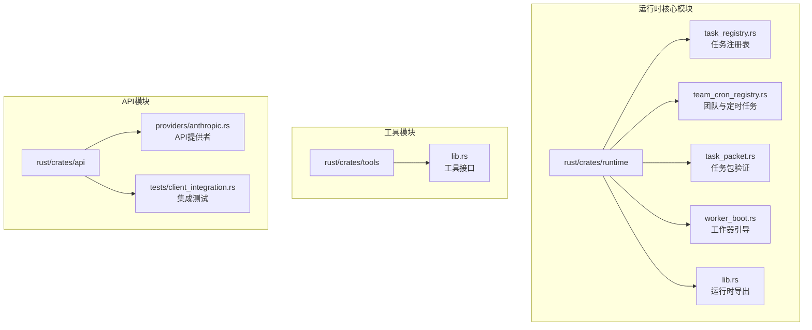

**图表来源**
- [lib.rs:1-180](file://rust/crates/runtime/src/lib.rs#L1-L180)
- [lib.rs:1-800](file://rust/crates/tools/src/lib.rs#L1-L800)

**章节来源**
- [lib.rs:1-180](file://rust/crates/runtime/src/lib.rs#L1-L180)
- [lib.rs:1-800](file://rust/crates/tools/src/lib.rs#L1-L800)

## 核心组件

### 任务注册表 (TaskRegistry)

任务注册表是系统的核心组件，负责管理所有任务的完整生命周期：

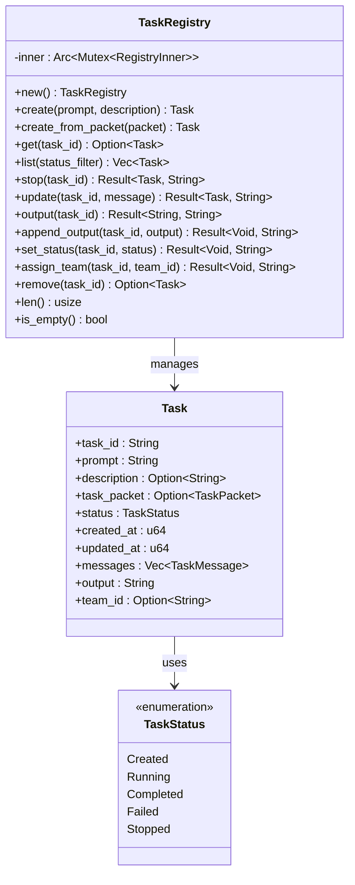

**图表来源**
- [task_registry.rs:55-231](file://rust/crates/runtime/src/task_registry.rs#L55-L231)
- [task_registry.rs:34-46](file://rust/crates/runtime/src/task_registry.rs#L34-L46)

### 团队与定时任务注册表

系统支持团队管理和定时任务调度：

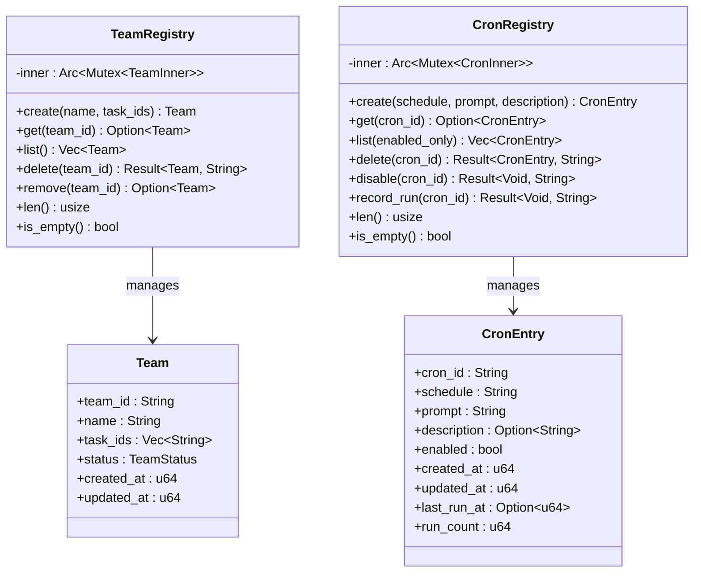

**图表来源**
- [team_cron_registry.rs:50-120](file://rust/crates/runtime/src/team_cron_registry.rs#L50-L120)
- [team_cron_registry.rs:135-230](file://rust/crates/runtime/src/team_cron_registry.rs#L135-L230)

### 工作器引导系统

工作器引导系统负责管理工作器的状态转换和事件处理：

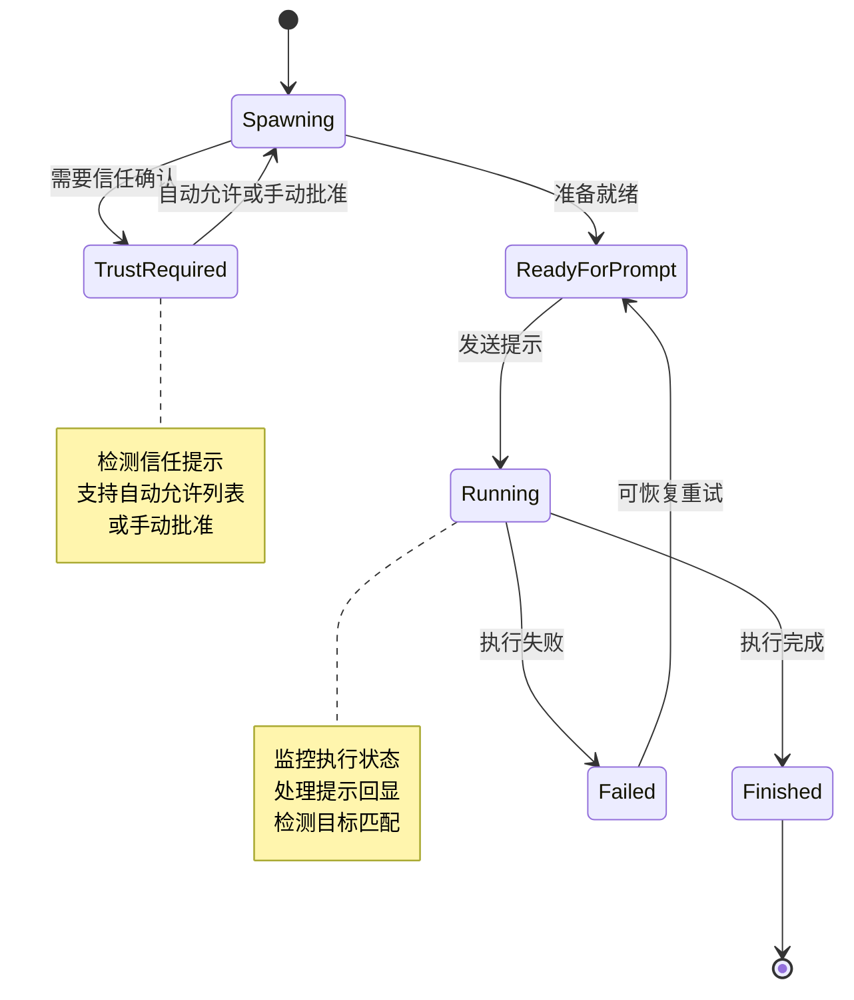

**图表来源**
- [worker_boot.rs:28-50](file://rust/crates/runtime/src/worker_boot.rs#L28-L50)
- [worker_boot.rs:171-563](file://rust/crates/runtime/src/worker_boot.rs#L171-L563)

**章节来源**
- [task_registry.rs:1-504](file://rust/crates/runtime/src/task_registry.rs#L1-L504)
- [team_cron_registry.rs:1-510](file://rust/crates/runtime/src/team_cron_registry.rs#L1-L510)
- [worker_boot.rs:1-1341](file://rust/crates/runtime/src/worker_boot.rs#L1-L1341)

## 架构概览

系统采用分层架构设计，各组件职责明确：

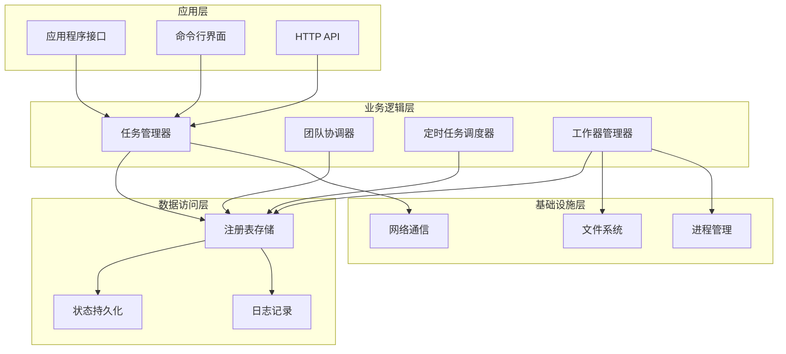

**图表来源**
- [lib.rs:34-69](file://rust/crates/tools/src/lib.rs#L34-L69)
- [lib.rs:1-180](file://rust/crates/runtime/src/lib.rs#L1-L180)

系统的核心特性包括：

1. **内存注册表**: 使用 Arc<Mutex<HashMap>> 实现线程安全的任务存储
2. **状态机管理**: 工作器采用有限状态机模式，确保状态转换的正确性
3. **事件驱动**: 通过事件系统实现组件间的解耦
4. **可扩展性**: 插件化的工具系统支持动态扩展

## 详细组件分析

### 任务包验证机制

任务包验证系统确保任务配置的完整性和有效性：

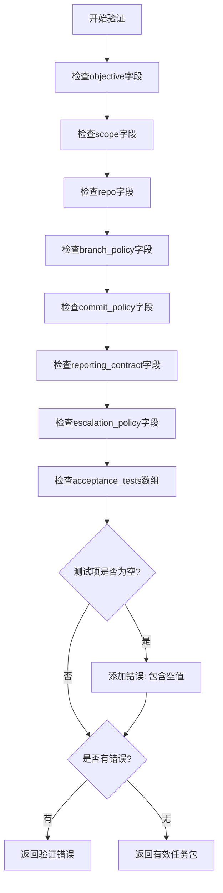

**图表来源**
- [task_packet.rs:56-84](file://rust/crates/runtime/src/task_packet.rs#L56-L84)

验证规则包括：
- 所有必需字段必须非空（去除空白字符后）
- 接受测试数组不能包含空值
- 错误信息会累积返回，便于一次性修复多个问题

**章节来源**
- [task_packet.rs:1-159](file://rust/crates/runtime/src/task_packet.rs#L1-L159)

### 同步任务处理流程

同步任务的执行流程遵循严格的顺序控制：

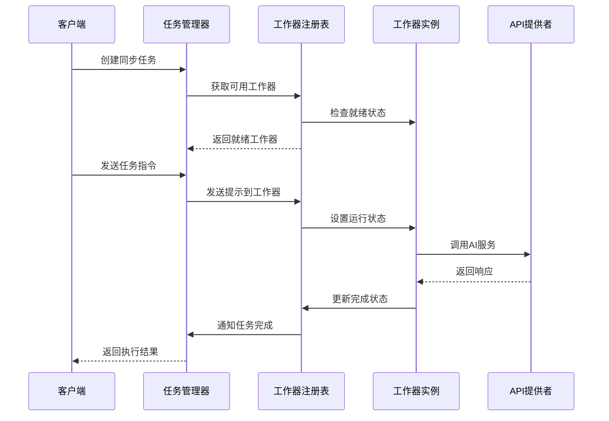

**图表来源**
- [worker_boot.rs:403-447](file://rust/crates/runtime/src/worker_boot.rs#L403-L447)
- [lib.rs:1492-1510](file://rust/crates/tools/src/lib.rs#L1492-L1510)

### 异步任务处理机制

异步任务采用事件驱动的方式处理：

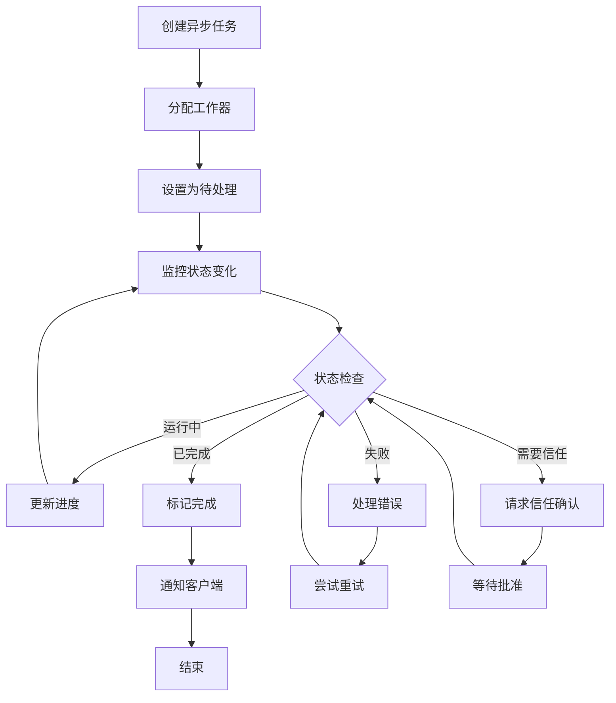

**图表来源**
- [task_registry.rs:194-203](file://rust/crates/runtime/src/task_registry.rs#L194-L203)
- [worker_boot.rs:225-371](file://rust/crates/runtime/src/worker_boot.rs#L225-L371)

### 定时任务调度算法

定时任务使用基于 cron 表达式的调度机制：

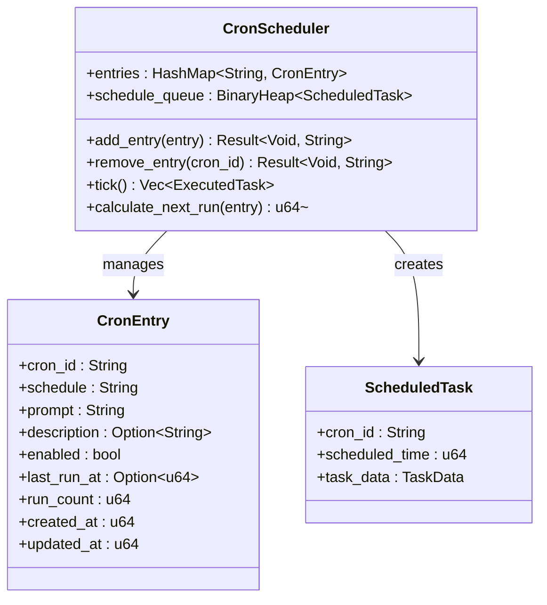

**图表来源**
- [team_cron_registry.rs:146-230](file://rust/crates/runtime/src/team_cron_registry.rs#L146-L230)

调度算法特点：
- 支持标准 cron 表达式格式
- 自动记录执行历史和统计信息
- 支持启用/禁用控制
- 提供执行计数和最后执行时间跟踪

### 任务优先级和资源限制

系统通过多种机制实现任务优先级和资源控制：

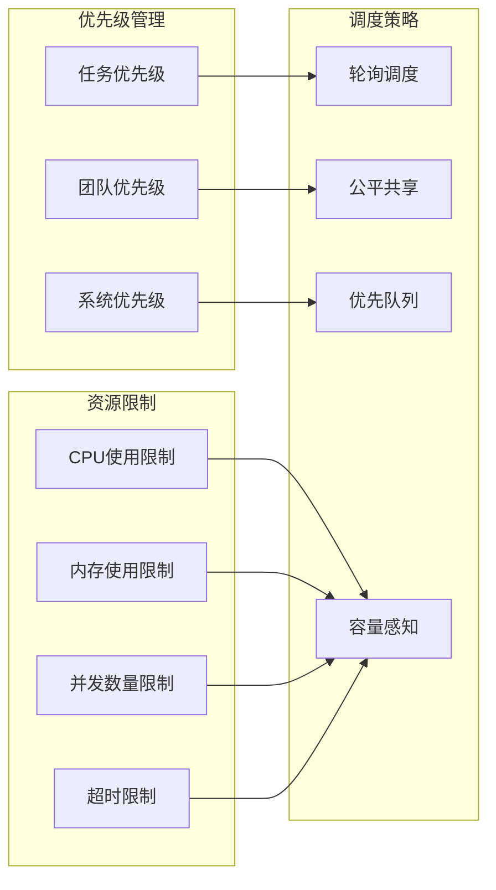

**章节来源**
- [task_registry.rs:194-203](file://rust/crates/runtime/src/task_registry.rs#L194-L203)
- [team_cron_registry.rs:152-170](file://rust/crates/runtime/src/team_cron_registry.rs#L152-L170)

### 并发控制机制

系统采用多层并发控制确保数据一致性和性能：

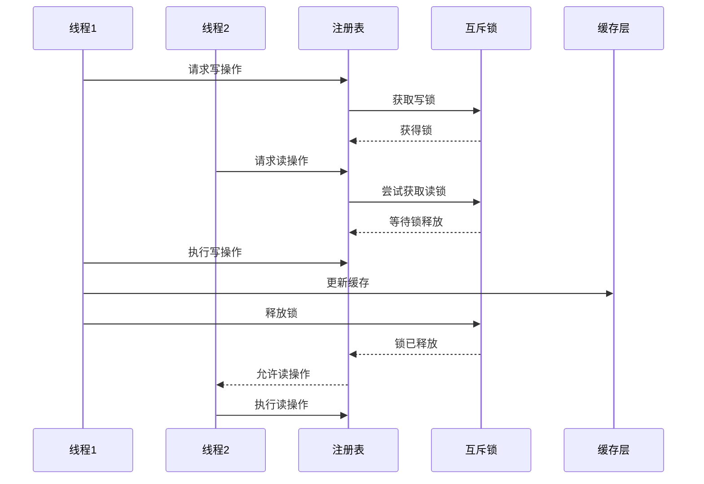

**图表来源**
- [task_registry.rs:101-102](file://rust/crates/runtime/src/task_registry.rs#L101-L102)
- [team_cron_registry.rs:68-70](file://rust/crates/runtime/src/team_cron_registry.rs#L68-L70)

并发控制特性：
- 使用 Arc<Mutex<T>> 实现线程安全
- 支持读写分离优化
- 避免死锁和竞态条件
- 提供原子操作保证

## 依赖关系分析

系统组件之间的依赖关系如下：

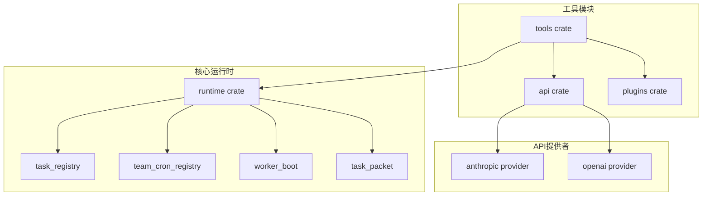

**图表来源**
- [lib.rs:44-46](file://rust/crates/runtime/src/lib.rs#L44-L46)
- [lib.rs:6-32](file://rust/crates/tools/src/lib.rs#L6-L32)

**章节来源**
- [lib.rs:1-180](file://rust/crates/runtime/src/lib.rs#L1-L180)
- [lib.rs:1-800](file://rust/crates/tools/src/lib.rs#L1-L800)

## 性能考量

### 内存优化策略

系统采用多种内存优化技术：

1. **零拷贝字符串**: 使用 `Cow<str>` 和 `AsRef<str>` 减少字符串复制
2. **延迟加载**: 任务输出采用惰性加载机制
3. **对象池**: 工作器实例复用减少内存分配
4. **紧凑数据结构**: 使用 `#[repr(C)]` 优化内存布局

### 并发性能优化

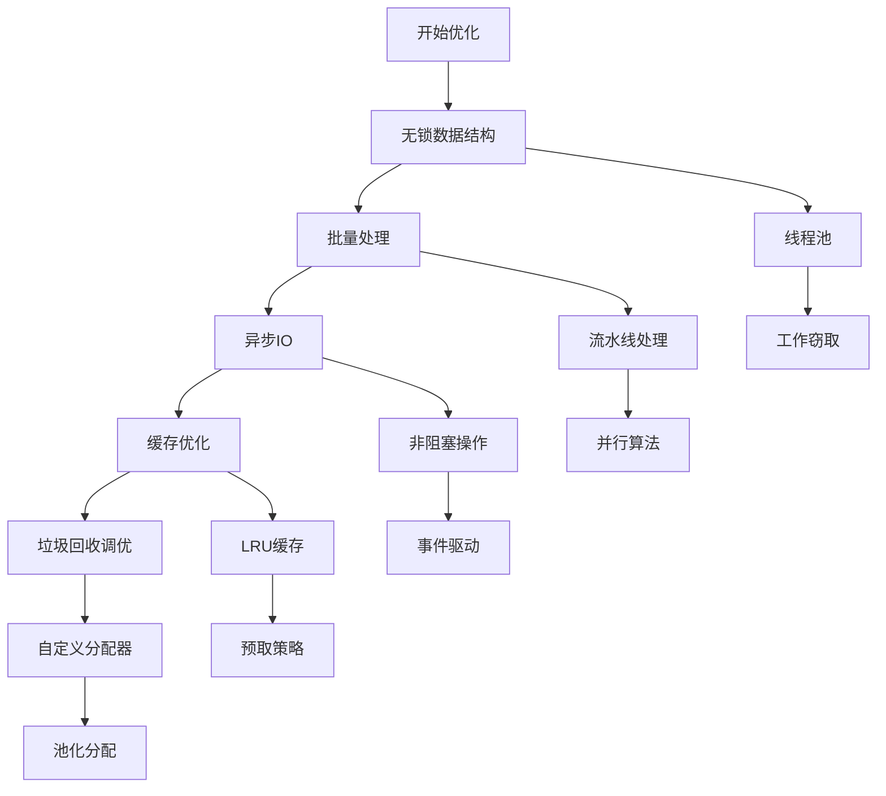

### 性能监控指标

系统提供以下性能监控指标：

- **任务执行时间**: 从创建到完成的总耗时
- **并发度**: 当前活跃任务数量
- **资源利用率**: CPU、内存、磁盘使用率
- **错误率**: 任务失败和重试频率
- **吞吐量**: 单位时间完成的任务数量

## 故障排除指南

### 常见错误类型和解决方案

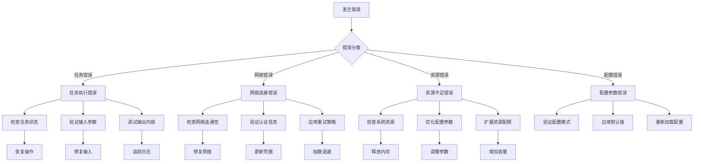

### 错误处理和重试策略

系统实现了多层次的错误处理机制：

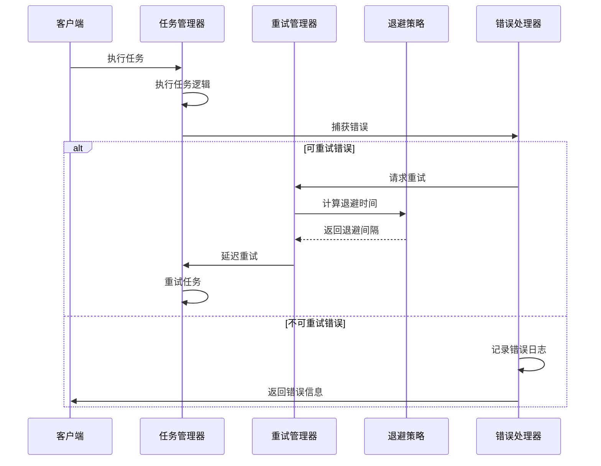

**图表来源**
- [recovery_recipes.rs:232-306](file://rust/crates/runtime/src/recovery_recipes.rs#L232-L306)

### 调试工具和诊断

系统提供丰富的调试工具：

1. **状态文件输出**: 工作器状态实时写入 `.claw/worker-state.json`
2. **事件日志**: 详细的事件序列记录
3. **性能分析**: 内置性能指标收集
4. **配置验证**: 运行时配置检查工具

**章节来源**
- [worker_boot.rs:608-649](file://rust/crates/runtime/src/worker_boot.rs#L608-L649)
- [recovery_recipes.rs:1-339](file://rust/crates/runtime/src/recovery_recipes.rs#L1-L339)

## 结论

任务调度系统展现了现代分布式任务管理的最佳实践：

### 主要优势

1. **架构清晰**: 分层设计使系统易于理解和维护
2. **功能完整**: 支持同步、异步和定时任务的全生命周期管理
3. **可靠性高**: 完善的错误处理和重试机制
4. **性能优秀**: 多层次优化确保高效执行
5. **可扩展性强**: 插件化设计支持功能扩展

### 技术亮点

- **状态机驱动**: 工作器状态转换确保系统稳定性
- **事件驱动架构**: 解耦组件提高可维护性
- **内存安全**: Rust语言提供内存安全保障
- **并发友好**: 线程安全设计支持高并发场景

### 改进建议

1. **监控增强**: 添加更详细的性能监控和告警机制
2. **配置管理**: 实现动态配置热更新
3. **扩展插件**: 开放更多插件接口支持第三方扩展
4. **云原生**: 增强容器化和微服务部署能力

该系统为复杂的任务调度场景提供了坚实的技术基础，适合在生产环境中稳定运行。

## 附录

### API参考

系统提供完整的API接口用于任务管理：

- **任务管理**: 创建、查询、更新、删除任务
- **团队管理**: 团队创建、成员管理、权限控制
- **定时任务**: 任务调度、执行监控、历史记录
- **工作器管理**: 工作器创建、状态监控、故障恢复

### 配置选项

系统支持丰富的配置选项：

- **运行时配置**: 系统行为参数调整
- **任务配置**: 任务执行环境设置
- **网络配置**: API连接参数配置
- **安全配置**: 权限和认证设置

### 最佳实践

1. **任务设计**: 合理划分任务粒度，避免过长执行时间
2. **资源规划**: 根据系统能力合理配置并发度
3. **错误处理**: 实现完善的错误处理和恢复机制
4. **监控告警**: 建立全面的监控和告警体系
5. **性能优化**: 定期进行性能评估和优化