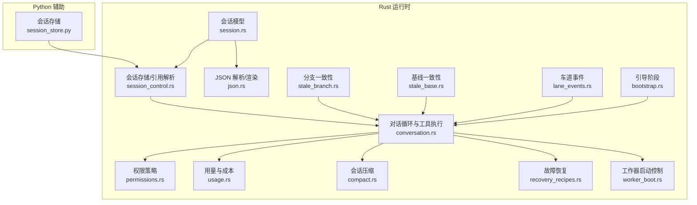
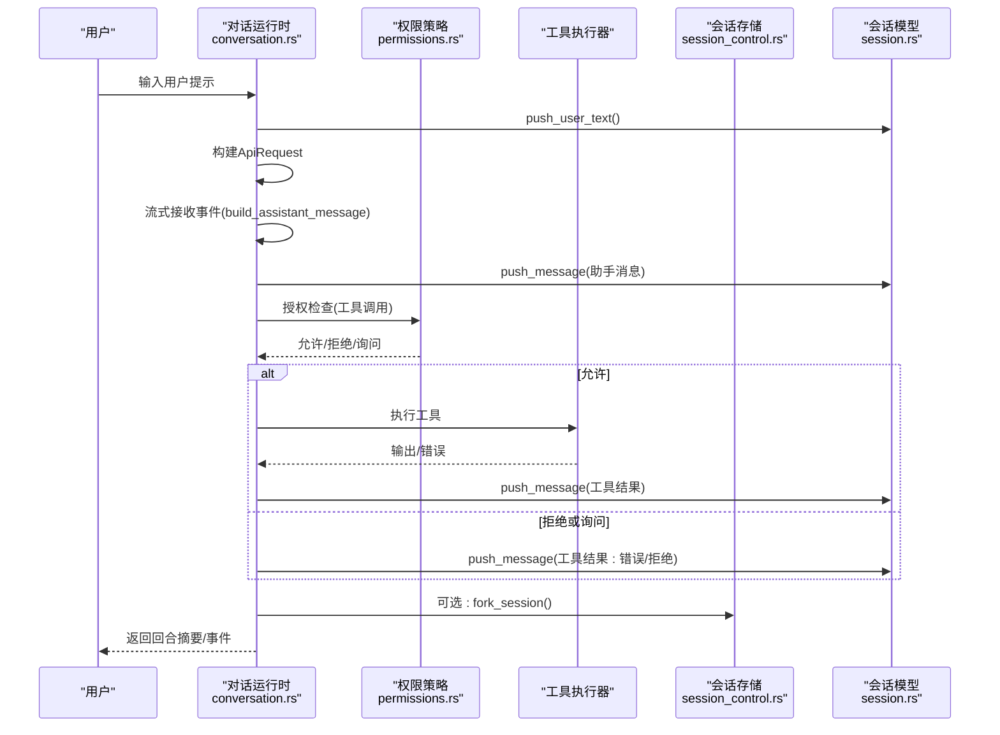
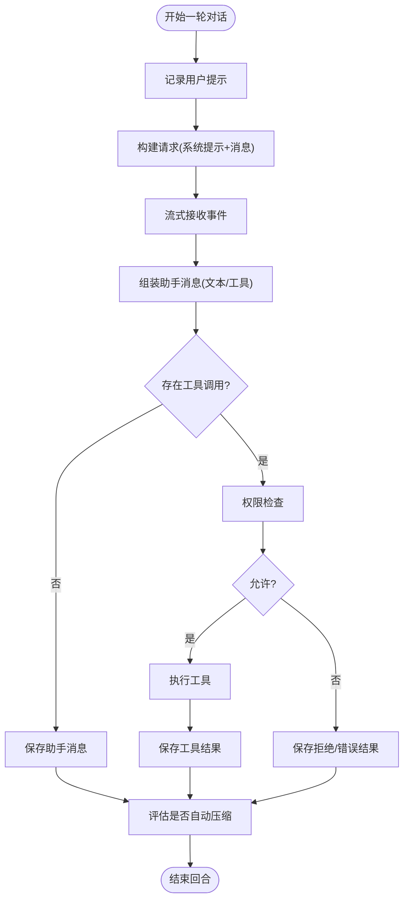
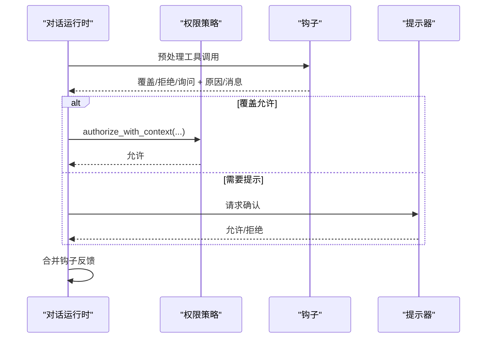
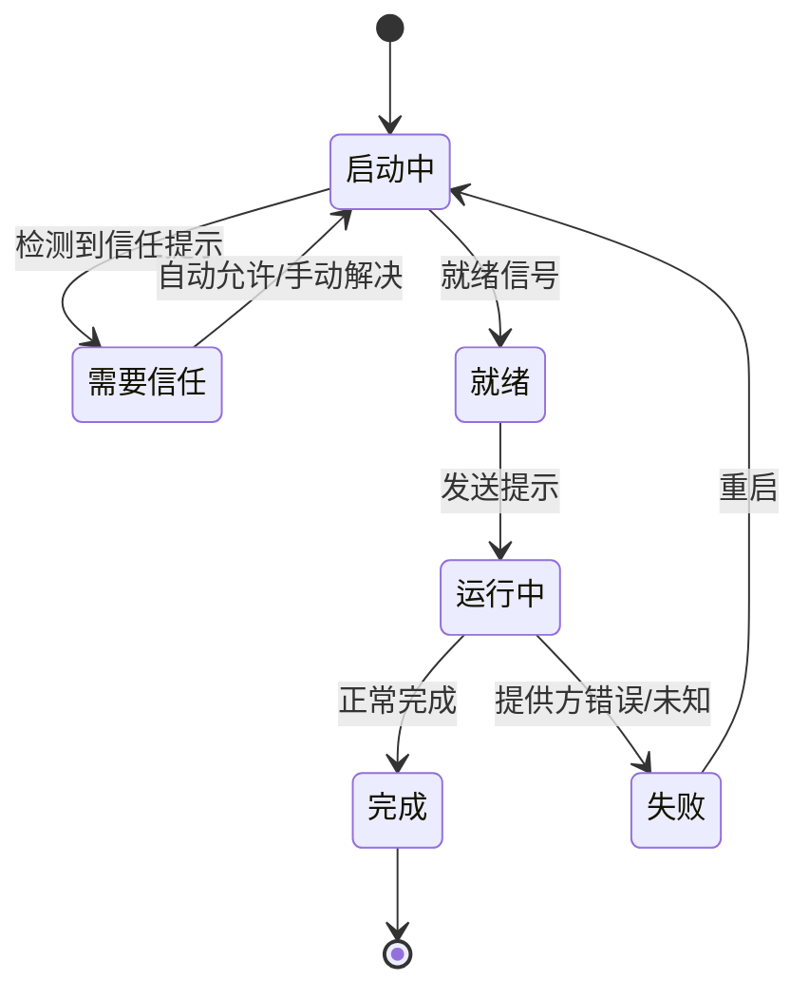
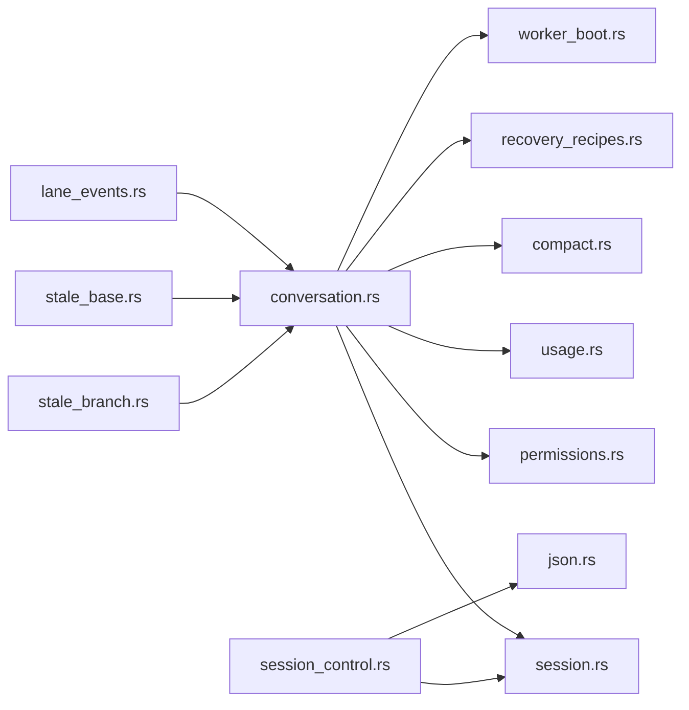

# 会话运行时

<cite>
**本文档引用的文件**
- [session.rs](file://rust/crates/runtime/src/session.rs)
- [session_control.rs](file://rust/crates/runtime/src/session_control.rs)
- [conversation.rs](file://rust/crates/runtime/src/conversation.rs)
- [compact.rs](file://rust/crates/runtime/src/compact.rs)
- [permissions.rs](file://rust/crates/runtime/src/permissions.rs)
- [usage.rs](file://rust/crates/runtime/src/usage.rs)
- [recovery_recipes.rs](file://rust/crates/runtime/src/recovery_recipes.rs)
- [bootstrap.rs](file://rust/crates/runtime/src/bootstrap.rs)
- [json.rs](file://rust/crates/runtime/src/json.rs)
- [lane_events.rs](file://rust/crates/runtime/src/lane_events.rs)
- [stale_branch.rs](file://rust/crates/runtime/src/stale_branch.rs)
- [stale_base.rs](file://rust/crates/runtime/src/stale_base.rs)
- [worker_boot.rs](file://rust/crates/runtime/src/worker_boot.rs)
- [session_store.py](file://src/session_store.py)
</cite>

## 目录
1. [简介](#简介)
2. [项目结构](#项目结构)
3. [核心组件](#核心组件)
4. [架构总览](#架构总览)
5. [详细组件分析](#详细组件分析)
6. [依赖分析](#依赖分析)
7. [性能考虑](#性能考虑)
8. [故障排查指南](#故障排查指南)
9. [结论](#结论)
10. [附录](#附录)

## 简介
本文件系统性阐述会话运行时的设计与实现，覆盖会话生命周期管理、状态持久化、对话循环机制、会话创建/恢复/合并/清理流程、会话数据结构与消息管理、历史记录处理、会话监控与性能指标、调试工具、与工具执行的集成、权限检查与安全控制、故障恢复、数据备份与扩展性等主题。目标是帮助开发者与运维人员快速理解并高效使用会话运行时。

## 项目结构
会话运行时主要由 Rust 模块构成，Python 提供轻量级会话存储辅助；核心模块包括：
- 会话模型与持久化：session.rs、session_control.rs、json.rs
- 对话循环与工具执行：conversation.rs、permissions.rs、usage.rs
- 会话压缩与成本统计：compact.rs、usage.rs
- 故障恢复与工作器控制：recovery_recipes.rs、worker_boot.rs
- 健康检查与分支/基线一致性：stale_branch.rs、stale_base.rs
- 车道事件与可观测性：lane_events.rs
- Python 会话存储（兼容旧版）：session_store.py



图表来源
- [session.rs:1-1546](file://rust/crates/runtime/src/session.rs#L1-L1546)
- [session_control.rs:1-967](file://rust/crates/runtime/src/session_control.rs#L1-L967)
- [conversation.rs:1-1812](file://rust/crates/runtime/src/conversation.rs#L1-L1812)
- [permissions.rs:1-684](file://rust/crates/runtime/src/permissions.rs#L1-L684)
- [usage.rs:1-314](file://rust/crates/runtime/src/usage.rs#L1-L314)
- [compact.rs:1-826](file://rust/crates/runtime/src/compact.rs#L1-L826)
- [recovery_recipes.rs:1-632](file://rust/crates/runtime/src/recovery_recipes.rs#L1-L632)
- [worker_boot.rs:1-1341](file://rust/crates/runtime/src/worker_boot.rs#L1-L1341)
- [json.rs:1-359](file://rust/crates/runtime/src/json.rs#L1-L359)
- [stale_branch.rs:1-418](file://rust/crates/runtime/src/stale_branch.rs#L1-L418)
- [stale_base.rs:1-430](file://rust/crates/runtime/src/stale_base.rs#L1-L430)
- [lane_events.rs:1-424](file://rust/crates/runtime/src/lane_events.rs#L1-L424)
- [bootstrap.rs:1-112](file://rust/crates/runtime/src/bootstrap.rs#L1-L112)
- [session_store.py:1-36](file://src/session_store.py#L1-L36)

章节来源
- [session.rs:1-1546](file://rust/crates/runtime/src/session.rs#L1-L1546)
- [session_control.rs:1-967](file://rust/crates/runtime/src/session_control.rs#L1-L967)
- [conversation.rs:1-1812](file://rust/crates/runtime/src/conversation.rs#L1-L1812)
- [json.rs:1-359](file://rust/crates/runtime/src/json.rs#L1-L359)
- [session_store.py:1-36](file://src/session_store.py#L1-L36)

## 核心组件
- 会话模型与持久化
  - 会话对象包含版本、会话ID、时间戳、消息列表、压缩元信息、派生分支信息、工作区绑定、用户提示历史、模型标识、持久化路径等字段，并提供 JSON/JSONL 的序列化/反序列化能力。
  - 支持增量写入 JSONL 记录，按需旋转日志文件，保留最近 N 份历史文件。
- 会话存储与引用解析
  - 按工作区指纹命名空间化会话目录，避免多实例并发冲突。
  - 支持别名“latest”解析、路径解析、扩展名兼容（.json/.jsonl），以及工作区根校验。
- 对话循环与工具执行
  - 单轮对话从用户输入开始，构建请求并调用上游 API 客户端流式获取响应；根据内容块类型拆分文本与工具调用；在权限策略允许下执行工具，收集结果并写回会话。
  - 支持自动会话压缩阈值、令牌用量统计与成本估算、会话追踪事件记录。
- 权限与安全
  - 基于模式的权限策略，支持规则白名单/黑名单/询问，钩子可覆盖决策，交互式提示器用于最终确认。
- 故障恢复
  - 针对信任提示未决、提示投递错误、分支过期、编译失败、MCP 握手失败、插件部分启动、提供方失败等场景定义恢复配方，最多一次自动尝试后升级策略。
- 工作器控制
  - 维护工作器状态机，检测信任提示、提示投递错误、就绪信号、运行中迹象，支持手动解决信任、自动重播提示、重启工作器、终止工作器等操作。
- 健康检查与一致性
  - 分支一致性检查（落后/分歧）、基线一致性检查（HEAD 与期望基线比较），并提供警告格式化。
- 观测性与事件
  - 结构化车道事件（启动/就绪/阻塞/完成/失败/合并等），工作器状态快照文件输出，便于外部观察。

章节来源
- [session.rs:1-1546](file://rust/crates/runtime/src/session.rs#L1-L1546)
- [session_control.rs:1-967](file://rust/crates/runtime/src/session_control.rs#L1-L967)
- [conversation.rs:1-1812](file://rust/crates/runtime/src/conversation.rs#L1-L1812)
- [permissions.rs:1-684](file://rust/crates/runtime/src/permissions.rs#L1-L684)
- [usage.rs:1-314](file://rust/crates/runtime/src/usage.rs#L1-L314)
- [compact.rs:1-826](file://rust/crates/runtime/src/compact.rs#L1-L826)
- [recovery_recipes.rs:1-632](file://rust/crates/runtime/src/recovery_recipes.rs#L1-L632)
- [worker_boot.rs:1-1341](file://rust/crates/runtime/src/worker_boot.rs#L1-L1341)
- [stale_branch.rs:1-418](file://rust/crates/runtime/src/stale_branch.rs#L1-L418)
- [stale_base.rs:1-430](file://rust/crates/runtime/src/stale_base.rs#L1-L430)
- [lane_events.rs:1-424](file://rust/crates/runtime/src/lane_events.rs#L1-L424)

## 架构总览
会话运行时以“会话模型 + 存储层 + 对话循环 + 权限/恢复/工作器控制”的分层设计组织，通过 JSON/JSONL 文件实现状态持久化与增量写入，配合压缩与成本统计提升长期会话的可用性与可观测性。



图表来源
- [conversation.rs:314-515](file://rust/crates/runtime/src/conversation.rs#L314-L515)
- [permissions.rs:174-292](file://rust/crates/runtime/src/permissions.rs#L174-L292)
- [session_control.rs:174-196](file://rust/crates/runtime/src/session_control.rs#L174-L196)
- [session.rs:229-243](file://rust/crates/runtime/src/session.rs#L229-L243)

## 详细组件分析

### 会话数据结构与持久化
- 数据结构
  - 会话角色：系统/用户/助手/工具
  - 内容块：文本、工具调用、工具结果
  - 会话消息：角色 + 内容块列表 + 可选用量
  - 会话元信息：版本、会话ID、创建/更新时间、压缩信息、派生分支、工作区根、模型、提示历史
- 持久化策略
  - JSONL 主记录 + 多条消息/压缩/提示历史记录
  - 增量追加写入，必要时先写完整快照
  - 日志轮转与清理，限制历史文件数量
- 工作区隔离
  - 使用工作区指纹命名会话目录，避免多实例写入冲突
  - 引用解析支持别名、绝对/相对路径、扩展名兼容与工作区根校验

```mermaid
classDiagram
class Session {
+version : u32
+session_id : String
+created_at_ms : u64
+updated_at_ms : u64
+messages : Vec~ConversationMessage~
+compaction : Option~SessionCompaction~
+fork : Option~SessionFork~
+workspace_root : Option~PathBuf~
+prompt_history : Vec~SessionPromptEntry~
+model : Option~String~
+persistence : Option~SessionPersistence~
+save_to_path(path)
+load_from_path(path)
+push_message(msg)
+push_user_text(text)
+record_compaction(summary, removed)
+fork(branch_name)
}
class ConversationMessage {
+role : MessageRole
+blocks : Vec~ContentBlock~
+usage : Option~TokenUsage~
}
class ContentBlock {
<<enum>>
Text{text}
ToolUse{id,name,input}
ToolResult{tool_use_id,tool_name,output,is_error}
}
class SessionStore {
+sessions_root : PathBuf
+workspace_root : PathBuf
+create_handle(id)
+resolve_reference(ref)
+list_sessions()
+latest_session()
+load_session(ref)
+fork_session(session, branch)
}
class SessionControlError
class SessionError
Session --> ConversationMessage : "包含"
ConversationMessage --> ContentBlock : "包含"
SessionStore --> Session : "管理"
SessionControlError <|-- SessionError : "包装"
```

图表来源
- [session.rs:82-106](file://rust/crates/runtime/src/session.rs#L82-L106)
- [session.rs:47-52](file://rust/crates/runtime/src/session.rs#L47-L52)
- [session.rs:28-44](file://rust/crates/runtime/src/session.rs#L28-L44)
- [session_control.rs:19-26](file://rust/crates/runtime/src/session_control.rs#L19-L26)
- [session_control.rs:354-359](file://rust/crates/runtime/src/session_control.rs#L354-L359)

章节来源
- [session.rs:1-1546](file://rust/crates/runtime/src/session.rs#L1-L1546)
- [session_control.rs:1-967](file://rust/crates/runtime/src/session_control.rs#L1-L967)

### 对话循环与工具执行
- 单轮对话流程
  - 用户输入 → 构造请求 → 上游流式事件 → 组装助手消息 → 权限检查 → 工具执行 → 写回会话 → 记录用量/事件
- 自动压缩
  - 基于令牌预算阈值与最近保留消息数进行压缩，生成系统摘要消息并保留近期消息
- 用量与成本
  - 累计输入/输出/缓存读写令牌，支持按模型定价估算成本



图表来源
- [conversation.rs:314-515](file://rust/crates/runtime/src/conversation.rs#L314-L515)
- [conversation.rs:555-578](file://rust/crates/runtime/src/conversation.rs#L555-L578)
- [compact.rs:39-51](file://rust/crates/runtime/src/compact.rs#L39-L51)

章节来源
- [conversation.rs:1-1812](file://rust/crates/runtime/src/conversation.rs#L1-L1812)
- [compact.rs:1-826](file://rust/crates/runtime/src/compact.rs#L1-L826)
- [usage.rs:1-314](file://rust/crates/runtime/src/usage.rs#L1-L314)

### 权限检查与安全控制
- 权限模式与规则
  - 模式等级：只读/工作区写/危险全权/提示/允许
  - 规则：白名单/黑名单/询问，支持基于输入内容的主题匹配
- 钩子与上下文
  - 钩子可覆盖决策、附加原因、注入消息反馈
- 交互式提示
  - 当需要提升权限或规则要求确认时，通过提示器进行交互



图表来源
- [conversation.rs:400-499](file://rust/crates/runtime/src/conversation.rs#L400-L499)
- [permissions.rs:174-292](file://rust/crates/runtime/src/permissions.rs#L174-L292)

章节来源
- [permissions.rs:1-684](file://rust/crates/runtime/src/permissions.rs#L1-L684)
- [conversation.rs:1-1812](file://rust/crates/runtime/src/conversation.rs#L1-L1812)

### 故障恢复与工作器控制
- 故障场景与恢复配方
  - 信任提示未决、提示投递错误、分支过期、编译失败、MCP 握手失败、插件部分启动、提供方失败
  - 每个场景定义步骤序列、最大自动尝试次数与升级策略
- 工作器状态机
  - 状态：启动中/需要信任/就绪/运行中/完成/失败
  - 事件：信任提示、提示投递、就绪、运行中、重启、完成、失败
  - 支持自动重播提示、重启工作器、终止工作器



图表来源
- [worker_boot.rs:28-50](file://rust/crates/runtime/src/worker_boot.rs#L28-L50)
- [worker_boot.rs:141-158](file://rust/crates/runtime/src/worker_boot.rs#L141-L158)
- [recovery_recipes.rs:16-54](file://rust/crates/runtime/src/recovery_recipes.rs#L16-L54)

章节来源
- [recovery_recipes.rs:1-632](file://rust/crates/runtime/src/recovery_recipes.rs#L1-L632)
- [worker_boot.rs:1-1341](file://rust/crates/runtime/src/worker_boot.rs#L1-L1341)

### 会话监控、性能指标与调试
- 会话追踪
  - 记录回合开始/助手迭代/工具执行/回合完成/回合失败等事件，携带属性如迭代次数、块数、工具名称、错误信息等
- 成本与用量
  - TokenUsage 累计输入/输出/缓存读写令牌，支持按模型定价估算成本
- 调试与可观测性
  - 工作器状态快照文件输出至 .claw/worker-state.json
  - 车道事件结构化输出，支持去重与补充元数据

章节来源
- [conversation.rs:580-686](file://rust/crates/runtime/src/conversation.rs#L580-L686)
- [usage.rs:167-215](file://rust/crates/runtime/src/usage.rs#L167-L215)
- [worker_boot.rs:608-649](file://rust/crates/runtime/src/worker_boot.rs#L608-L649)
- [lane_events.rs:1-424](file://rust/crates/runtime/src/lane_events.rs#L1-L424)

### 会话生命周期管理与清理
- 创建
  - 新建会话对象，设置默认持久化路径（可选）
- 恢复
  - 通过引用解析定位会话文件，加载并校验工作区根
- 合并/派生
  - fork_session 生成新会话，继承元信息并写入独立文件
- 清理
  - 日志轮转与历史文件清理，避免无限增长
  - 会话健康探针：压缩后验证工具执行器可用性

章节来源
- [session.rs:157-279](file://rust/crates/runtime/src/session.rs#L157-L279)
- [session_control.rs:158-196](file://rust/crates/runtime/src/session_control.rs#L158-L196)
- [conversation.rs:295-330](file://rust/crates/runtime/src/conversation.rs#L295-L330)

### 历史记录与压缩
- 历史记录
  - JSONL 中包含会话元信息、压缩记录、提示历史、消息记录
- 压缩策略
  - 基于预算阈值与最近保留消息数，生成系统摘要消息并保留近期消息
  - 边界保护：避免破坏工具调用/结果配对

章节来源
- [session.rs:405-504](file://rust/crates/runtime/src/session.rs#L405-L504)
- [compact.rs:94-183](file://rust/crates/runtime/src/compact.rs#L94-L183)

### 与工具执行的集成
- 工具执行器接口
  - ToolExecutor trait 定义执行方法，返回字符串输出或错误
- 钩子反馈合并
  - 将钩子提供的反馈消息合并到工具输出中，区分错误与非错误场景

章节来源
- [conversation.rs:58-84](file://rust/crates/runtime/src/conversation.rs#L58-L84)
- [conversation.rs:771-787](file://rust/crates/runtime/src/conversation.rs#L771-L787)

### Python 会话存储兼容
- 轻量级 JSON 存储，提供保存/加载接口，便于与旧版或外部工具集成

章节来源
- [session_store.py:1-36](file://src/session_store.py#L1-L36)

## 依赖分析
- 组件耦合
  - conversation.rs 依赖 session.rs、permissions.rs、usage.rs、compact.rs、recovery_recipes.rs、worker_boot.rs
  - session_control.rs 依赖 session.rs 与 json.rs，负责会话文件管理与引用解析
  - 权限策略与钩子在对话循环中紧密协作
- 外部依赖
  - Git 命令用于分支一致性与基线一致性检查
  - JSON/JSONL 解析与渲染由 json.rs 提供



图表来源
- [conversation.rs:1-1812](file://rust/crates/runtime/src/conversation.rs#L1-L1812)
- [session_control.rs:1-967](file://rust/crates/runtime/src/session_control.rs#L1-L967)
- [json.rs:1-359](file://rust/crates/runtime/src/json.rs#L1-L359)
- [stale_branch.rs:1-418](file://rust/crates/runtime/src/stale_branch.rs#L1-L418)
- [stale_base.rs:1-430](file://rust/crates/runtime/src/stale_base.rs#L1-L430)
- [lane_events.rs:1-424](file://rust/crates/runtime/src/lane_events.rs#L1-L424)

章节来源
- [conversation.rs:1-1812](file://rust/crates/runtime/src/conversation.rs#L1-L1812)
- [session_control.rs:1-967](file://rust/crates/runtime/src/session_control.rs#L1-L967)
- [json.rs:1-359](file://rust/crates/runtime/src/json.rs#L1-L359)

## 性能考虑
- 自动压缩阈值
  - 默认阈值可通过环境变量配置，减少上下文长度，降低延迟与成本
- 用量统计
  - 按回合与累计统计令牌用量，支持成本估算，便于资源控制
- 日志轮转
  - 控制单文件大小与历史文件数量，避免磁盘膨胀

章节来源
- [conversation.rs:688-704](file://rust/crates/runtime/src/conversation.rs#L688-L704)
- [usage.rs:167-215](file://rust/crates/runtime/src/usage.rs#L167-L215)
- [session.rs:12-16](file://rust/crates/runtime/src/session.rs#L12-L16)

## 故障排查指南
- 会话无法加载/工作区不匹配
  - 检查会话文件扩展名与工作区根绑定，使用 latest 别名或列出会话定位
- 提示投递错误
  - 观察工作器事件中的提示投递错误详情，必要时启用自动重播
- 分支过期/分歧
  - 使用分支一致性检查与策略应用，选择警告/阻止/自动变基/前向合并
- 基线不一致
  - 读取 .claw-base 或命令行参数，比较 HEAD 与期望基线，给出警告
- 提供方异常
  - 观察工作器完成事件中的 finish_reason 与输出令牌数，识别提供方失败

章节来源
- [session_control.rs:205-225](file://rust/crates/runtime/src/session_control.rs#L205-L225)
- [worker_boot.rs:508-562](file://rust/crates/runtime/src/worker_boot.rs#L508-L562)
- [stale_branch.rs:57-103](file://rust/crates/runtime/src/stale_branch.rs#L57-L103)
- [stale_base.rs:89-103](file://rust/crates/runtime/src/stale_base.rs#L89-L103)
- [recovery_recipes.rs:227-306](file://rust/crates/runtime/src/recovery_recipes.rs#L227-L306)

## 结论
会话运行时通过清晰的数据结构、稳健的持久化策略、完善的对话循环与权限控制、可观测性与恢复机制，为长期会话提供了高可用与可维护的基础。结合压缩、用量统计与工作器控制，能够在复杂环境中保持稳定与高效。

## 附录
- 引导阶段
  - 定义启动阶段顺序，确保各子系统按序初始化
- 事件与快照
  - 结构化事件与状态快照文件，便于外部观察与自动化集成

章节来源
- [bootstrap.rs:1-112](file://rust/crates/runtime/src/bootstrap.rs#L1-L112)
- [worker_boot.rs:608-649](file://rust/crates/runtime/src/worker_boot.rs#L608-L649)
- [lane_events.rs:1-424](file://rust/crates/runtime/src/lane_events.rs#L1-L424)