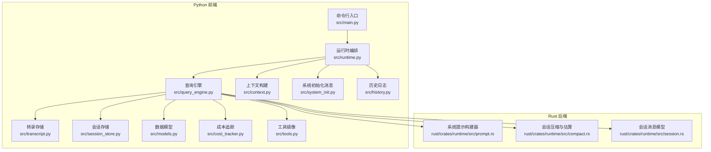
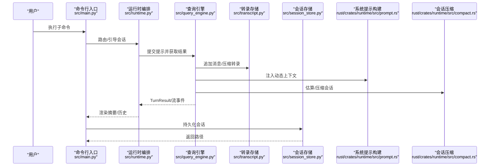
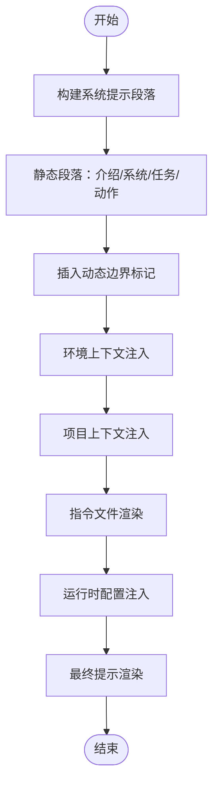
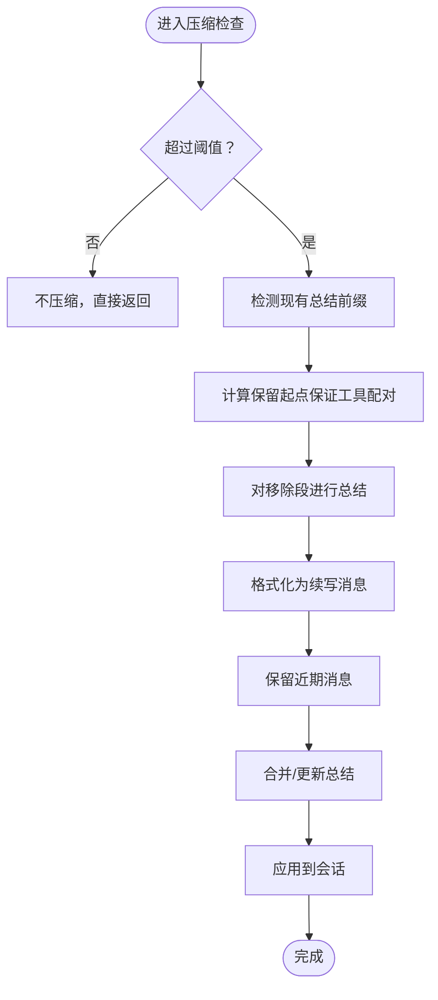
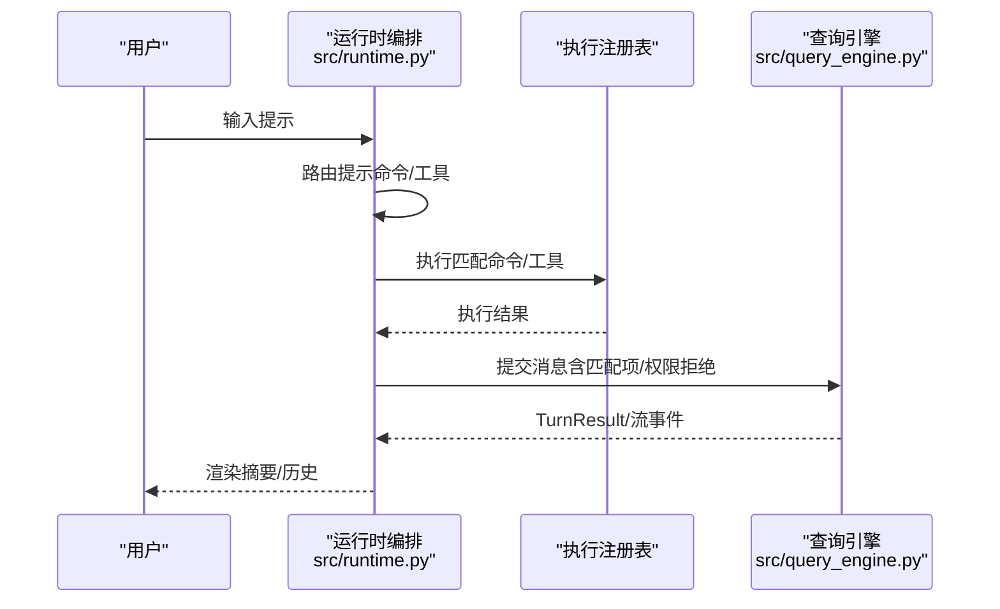
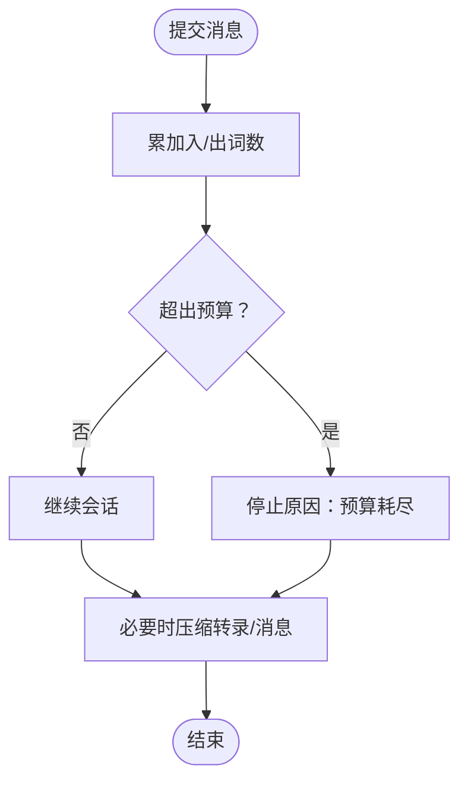
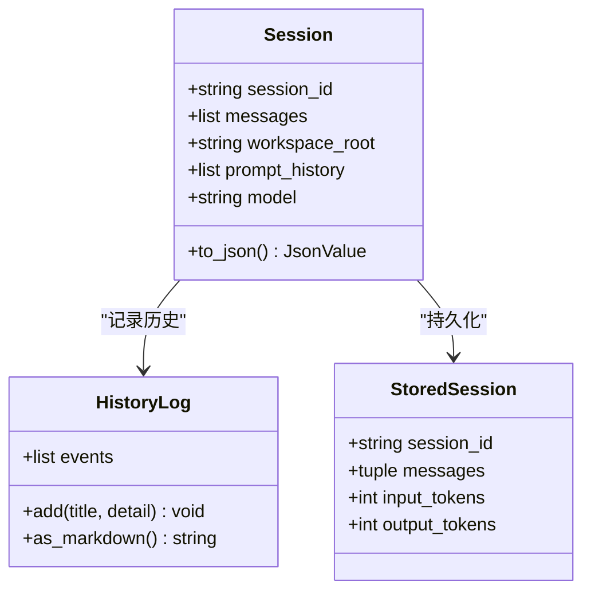
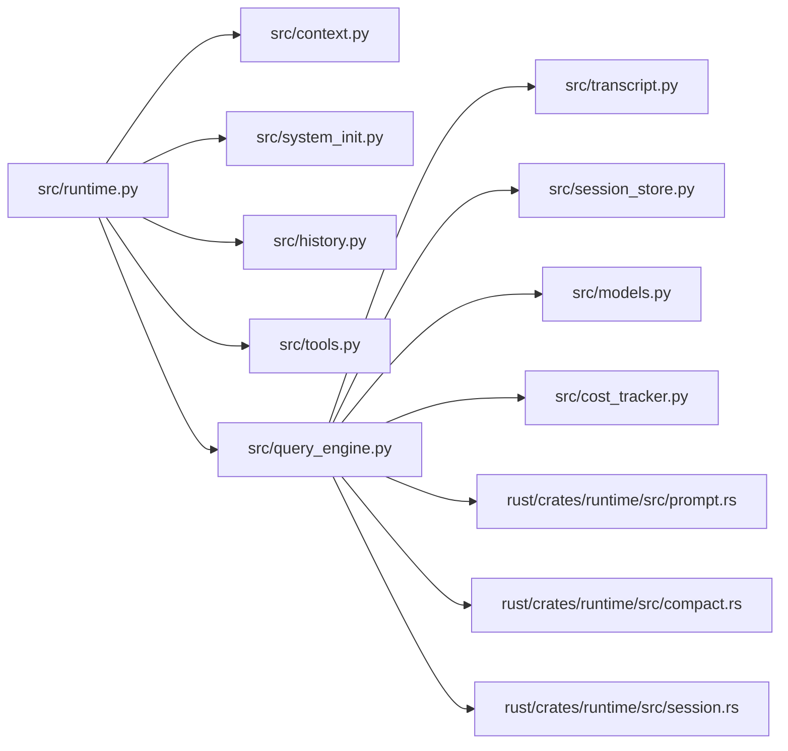

# 提示工程系统

<cite>
**本文引用的文件**
- [src/main.py](file://src/main.py)
- [src/runtime.py](file://src/runtime.py)
- [src/query_engine.py](file://src/query_engine.py)
- [src/transcript.py](file://src/transcript.py)
- [src/session_store.py](file://src/session_store.py)
- [src/history.py](file://src/history.py)
- [src/context.py](file://src/context.py)
- [src/system_init.py](file://src/system_init.py)
- [src/models.py](file://src/models.py)
- [src/cost_tracker.py](file://src/cost_tracker.py)
- [src/tools.py](file://src/tools.py)
- [rust/crates/runtime/src/prompt.rs](file://rust/crates/runtime/src/prompt.rs)
- [rust/crates/runtime/src/compact.rs](file://rust/crates/runtime/src/compact.rs)
- [rust/crates/runtime/src/session.rs](file://rust/crates/runtime/src/session.rs)
</cite>

## 目录
1. [简介](#简介)
2. [项目结构](#项目结构)
3. [核心组件](#核心组件)
4. [架构总览](#架构总览)
5. [详细组件分析](#详细组件分析)
6. [依赖关系分析](#依赖关系分析)
7. [性能考量](#性能考量)
8. [故障排查指南](#故障排查指南)
9. [结论](#结论)
10. [附录](#附录)

## 简介
本文件系统性阐述该提示工程系统的提示构建、上下文管理与提示压缩机制，覆盖提示模板设计、动态内容注入、多模态提示处理（含会话状态、历史压缩与长期记忆）、提示优化策略、令牌估算与成本控制、调试工具、效果评估与 A/B 测试建议、最佳实践与安全注意事项。文档以“从概念到实现”的方式组织，既适合初学者快速上手，也为高级用户提供深入的技术细节与可视化图示。

## 项目结构
该系统由 Python 前端与 Rust 后端协同组成：
- Python 层负责命令行入口、运行时会话编排、提示路由、会话持久化与摘要渲染。
- Rust 层负责系统提示构建、动态上下文注入、会话压缩与令牌估算、会话消息模型等。

图表来源
- [src/main.py:1-214](file://src/main.py#L1-L214)
- [src/runtime.py:1-193](file://src/runtime.py#L1-L193)
- [src/query_engine.py:1-194](file://src/query_engine.py#L1-L194)
- [src/transcript.py:1-24](file://src/transcript.py#L1-L24)
- [src/session_store.py:1-36](file://src/session_store.py#L1-L36)
- [src/context.py:1-48](file://src/context.py#L1-L48)
- [src/system_init.py:1-24](file://src/system_init.py#L1-L24)
- [src/history.py:1-23](file://src/history.py#L1-L23)
- [src/models.py:1-50](file://src/models.py#L1-L50)
- [src/cost_tracker.py:1-14](file://src/cost_tracker.py#L1-L14)
- [src/tools.py:1-97](file://src/tools.py#L1-L97)
- [rust/crates/runtime/src/prompt.rs:1-200](file://rust/crates/runtime/src/prompt.rs#L1-L200)
- [rust/crates/runtime/src/compact.rs:1-200](file://rust/crates/runtime/src/compact.rs#L1-L200)
- [rust/crates/runtime/src/session.rs:271-663](file://rust/crates/runtime/src/session.rs#L271-L663)

章节来源
- [src/main.py:1-214](file://src/main.py#L1-L214)
- [src/runtime.py:1-193](file://src/runtime.py#L1-L193)
- [src/query_engine.py:1-194](file://src/query_engine.py#L1-L194)
- [rust/crates/runtime/src/prompt.rs:1-200](file://rust/crates/runtime/src/prompt.rs#L1-L200)
- [rust/crates/runtime/src/compact.rs:1-200](file://rust/crates/runtime/src/compact.rs#L1-L200)
- [rust/crates/runtime/src/session.rs:271-663](file://rust/crates/runtime/src/session.rs#L271-L663)

## 核心组件
- 命令行入口与子命令：提供路由、引导会话、回合循环、加载/保存会话、远程模式等能力。
- 运行时编排：构建上下文、执行命令/工具、流式事件、记录历史。
- 查询引擎：会话消息管理、预算控制、结构化输出、转录压缩与持久化。
- 上下文与系统初始化：构建工作区上下文、系统初始化消息。
- 会话与历史：消息列表、转录存储、历史事件记录。
- Rust 提示构建与压缩：系统提示模板、动态边界、项目上下文注入、会话压缩与令牌估算。
- 成本与权限：使用量统计、权限拒绝记录。

章节来源
- [src/main.py:1-214](file://src/main.py#L1-L214)
- [src/runtime.py:1-193](file://src/runtime.py#L1-L193)
- [src/query_engine.py:1-194](file://src/query_engine.py#L1-L194)
- [src/context.py:1-48](file://src/context.py#L1-L48)
- [src/system_init.py:1-24](file://src/system_init.py#L1-L24)
- [src/transcript.py:1-24](file://src/transcript.py#L1-L24)
- [src/history.py:1-23](file://src/history.py#L1-L23)
- [rust/crates/runtime/src/prompt.rs:1-200](file://rust/crates/runtime/src/prompt.rs#L1-L200)
- [rust/crates/runtime/src/compact.rs:1-200](file://rust/crates/runtime/src/compact.rs#L1-L200)

## 架构总览
系统采用“Python 编排 + Rust 提示与压缩”的分层架构。Python 层负责高层流程与外部交互，Rust 层负责提示模板与会话压缩的高性能实现。

图表来源
- [src/main.py:142-160](file://src/main.py#L142-L160)
- [src/runtime.py:89-152](file://src/runtime.py#L89-L152)
- [src/query_engine.py:61-132](file://src/query_engine.py#L61-L132)
- [src/transcript.py:11-23](file://src/transcript.py#L11-L23)
- [src/session_store.py:19-35](file://src/session_store.py#L19-L35)
- [rust/crates/runtime/src/prompt.rs:144-171](file://rust/crates/runtime/src/prompt.rs#L144-L171)
- [rust/crates/runtime/src/compact.rs:96-183](file://rust/crates/runtime/src/compact.rs#L96-L183)

## 详细组件分析

### 组件一：提示模板设计与动态内容注入
- 静态模板与动态边界：系统提示通过构建器拼接静态段落与动态边界标记，随后注入环境、项目上下文、指令文件与配置。
- 动态内容来源：
  - 环境信息：模型族、工作目录、日期、平台。
  - 项目上下文：当前日期、Git 状态/差异、Git 上下文、指令文件集合。
  - 配置段：运行时配置注入。
- 多模态提示支持：Rust 侧会话消息模型支持文本与工具结果等多模态块，便于在提示中嵌入工具调用与结果。

图表来源
- [rust/crates/runtime/src/prompt.rs:144-171](file://rust/crates/runtime/src/prompt.rs#L144-L171)
- [rust/crates/runtime/src/prompt.rs:173-195](file://rust/crates/runtime/src/prompt.rs#L173-L195)
- [rust/crates/runtime/src/prompt.rs:64-91](file://rust/crates/runtime/src/prompt.rs#L64-L91)

章节来源
- [rust/crates/runtime/src/prompt.rs:1-200](file://rust/crates/runtime/src/prompt.rs#L1-L200)
- [rust/crates/runtime/src/session.rs:624-663](file://rust/crates/runtime/src/session.rs#L624-L663)

### 组件二：提示压缩与会话历史管理
- 会话压缩阈值：基于保留最近消息数量与最大估算令牌数判断是否压缩。
- 压缩过程：识别现有总结前缀、确保工具调用/结果配对不被切分、生成新总结、构造续写系统消息、保留近期消息。
- 历史与转录：Python 层维护转录列表与“已刷新”标志；当超过阈值时仅保留最近 N 条；持久化时统一刷新。
- 长期记忆：通过总结段与“续写系统消息”实现早期对话的长期记忆复用。

图表来源
- [rust/crates/runtime/src/compact.rs:41-51](file://rust/crates/runtime/src/compact.rs#L41-L51)
- [rust/crates/runtime/src/compact.rs:96-183](file://rust/crates/runtime/src/compact.rs#L96-L183)
- [src/query_engine.py:129-132](file://src/query_engine.py#L129-L132)
- [src/transcript.py:15-17](file://src/transcript.py#L15-L17)

章节来源
- [rust/crates/runtime/src/compact.rs:1-200](file://rust/crates/runtime/src/compact.rs#L1-200)
- [src/query_engine.py:129-132](file://src/query_engine.py#L129-L132)
- [src/transcript.py:1-24](file://src/transcript.py#L1-L24)

### 组件三：提示路由与动态内容注入
- 路由逻辑：将用户提示按词元映射到命令/工具清单，计算匹配分数，限制返回数量。
- 执行与回传：执行匹配的命令/工具，收集权限拒绝，流式返回事件，组装 TurnResult。
- 系统初始化消息：汇总系统可信状态、命令/工具条目数量与启动步骤。

图表来源
- [src/runtime.py:89-152](file://src/runtime.py#L89-L152)
- [src/system_init.py:8-23](file://src/system_init.py#L8-L23)
- [src/tools.py:62-72](file://src/tools.py#L62-L72)

章节来源
- [src/runtime.py:89-193](file://src/runtime.py#L89-L193)
- [src/system_init.py:1-24](file://src/system_init.py#L1-L24)
- [src/tools.py:1-97](file://src/tools.py#L1-L97)

### 组件四：令牌估算与成本控制
- 令牌估算：Rust 侧提供会话级粗略令牌估算函数，用于触发压缩决策。
- 成本追踪：Python 层使用使用量摘要累加输入/输出词数，作为预算控制依据。
- 预算与上限：查询引擎配置包含最大回合数、最大预算令牌数、压缩阈值等参数。

图表来源
- [src/query_engine.py:87-95](file://src/query_engine.py#L87-L95)
- [src/models.py:29-37](file://src/models.py#L29-L37)
- [rust/crates/runtime/src/compact.rs:33-37](file://rust/crates/runtime/src/compact.rs#L33-L37)

章节来源
- [src/query_engine.py:15-22](file://src/query_engine.py#L15-L22)
- [src/models.py:29-37](file://src/models.py#L29-L37)
- [rust/crates/runtime/src/compact.rs:33-37](file://rust/crates/runtime/src/compact.rs#L33-L37)

### 组件五：会话状态与历史记录
- 会话状态：包含消息列表、提示历史、模型、工作区根路径等字段，并可序列化为 JSON。
- 历史记录：以事件列表形式记录上下文、路由、执行、回合等关键节点。
- 会话持久化：将消息与使用量写入 JSON 文件，支持后续加载恢复。

图表来源
- [rust/crates/runtime/src/session.rs:271-611](file://rust/crates/runtime/src/session.rs#L271-L611)
- [src/history.py:12-22](file://src/history.py#L12-L22)
- [src/session_store.py:8-35](file://src/session_store.py#L8-L35)

章节来源
- [rust/crates/runtime/src/session.rs:271-663](file://rust/crates/runtime/src/session.rs#L271-L663)
- [src/history.py:1-23](file://src/history.py#L1-L23)
- [src/session_store.py:1-36](file://src/session_store.py#L1-L36)

### 组件六：调试工具与效果评估
- 调试工具：
  - 路由子命令：查看提示匹配结果与来源提示。
  - 引导会话子命令：生成运行时会话摘要，包含上下文、系统初始化、路由、执行、流事件、回合结果与历史。
  - 回合循环子命令：支持结构化输出与最大回合数控制。
  - 加载会话子命令：读取持久化会话并展示统计。
- 效果评估与 A/B 测试建议：
  - 使用结构化输出与流事件类型区分不同提示变体。
  - 对比不同压缩阈值、输出风格、指令文件注入对效果的影响。
  - 通过会话 ID 进行 A/B 分组与回归分析。

章节来源
- [src/main.py:142-170](file://src/main.py#L142-L170)
- [src/runtime.py:39-86](file://src/runtime.py#L39-L86)
- [src/query_engine.py:152-169](file://src/query_engine.py#L152-L169)

## 依赖关系分析
- Python 层内部依赖：运行时编排依赖上下文、系统初始化消息、历史记录、工具清单；查询引擎依赖转录存储、会话存储、数据模型与成本追踪。
- Rust 层内部依赖：提示构建器依赖运行时配置与 Git 上下文；压缩模块依赖会话消息模型与工具配对约束。
- 外部集成点：通过命令行子命令对外暴露功能；会话持久化为外部系统提供数据接口。

图表来源
- [src/runtime.py:1-193](file://src/runtime.py#L1-L193)
- [src/query_engine.py:1-194](file://src/query_engine.py#L1-L194)
- [rust/crates/runtime/src/prompt.rs:1-200](file://rust/crates/runtime/src/prompt.rs#L1-L200)
- [rust/crates/runtime/src/compact.rs:1-200](file://rust/crates/runtime/src/compact.rs#L1-L200)
- [rust/crates/runtime/src/session.rs:271-663](file://rust/crates/runtime/src/session.rs#L271-L663)

章节来源
- [src/runtime.py:1-193](file://src/runtime.py#L1-L193)
- [src/query_engine.py:1-194](file://src/query_engine.py#L1-L194)

## 性能考量
- 令牌估算与压缩：优先在 Rust 侧进行粗略估算与压缩，降低 Python 层负担。
- 转录压缩：仅保留最近 N 条消息，避免线性增长导致的内存与传输开销。
- 结构化输出重试：在 JSON 序列化失败时自动降级重试，提升稳定性。
- 路由评分：基于词元计分，复杂度与提示长度线性相关，建议控制提示长度与匹配上限。

## 故障排查指南
- 会话无法继续：检查预算是否耗尽或回合数达到上限。
- 压缩后报错：确认工具调用/结果配对未被错误切分，必要时调整保留最近消息数量。
- 权限拒绝：查看工具权限上下文与拒绝列表，确认是否需要放宽策略。
- 会话加载失败：确认持久化文件存在且格式正确。

章节来源
- [src/query_engine.py:67-78](file://src/query_engine.py#L67-L78)
- [rust/crates/runtime/src/compact.rs:115-158](file://rust/crates/runtime/src/compact.rs#L115-L158)
- [src/tools.py:56-59](file://src/tools.py#L56-L59)
- [src/session_store.py:27-35](file://src/session_store.py#L27-L35)

## 结论
该系统通过清晰的分层设计实现了高效的提示工程闭环：Python 层负责编排与外部交互，Rust 层负责提示模板与压缩的高性能实现。结合动态上下文注入、会话压缩与预算控制，系统在长对话与多模态场景下具备良好的扩展性与稳定性。建议在实际部署中配合结构化输出、A/B 测试与成本监控，持续优化提示质量与资源消耗。

## 附录
- 最佳实践
  - 明确提示边界：使用动态边界标记隔离静态模板与动态上下文。
  - 控制上下文大小：限制指令文件数量与长度，避免超过模型上下文窗口。
  - 启用压缩阈值：根据模型与任务设定合理的保留最近消息数量与最大估算令牌数。
  - 结构化输出：在需要稳定解析的场景启用结构化输出并设置重试上限。
  - 安全与权限：默认拒绝高风险工具，必要时通过权限上下文精细化放行。
- 安全考虑
  - 严格控制工具执行范围，避免破坏性操作。
  - 对外部输入进行最小化注入，减少提示污染风险。
  - 记录所有权限拒绝与异常事件，便于审计与回溯。