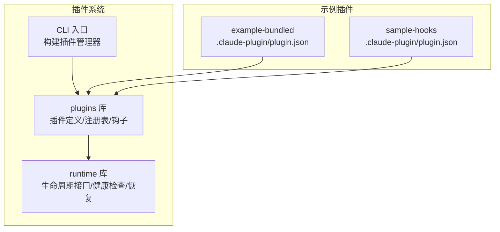
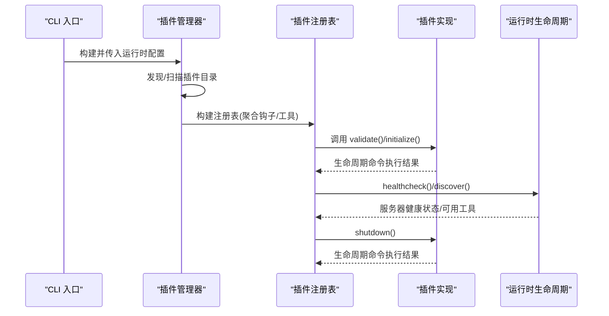
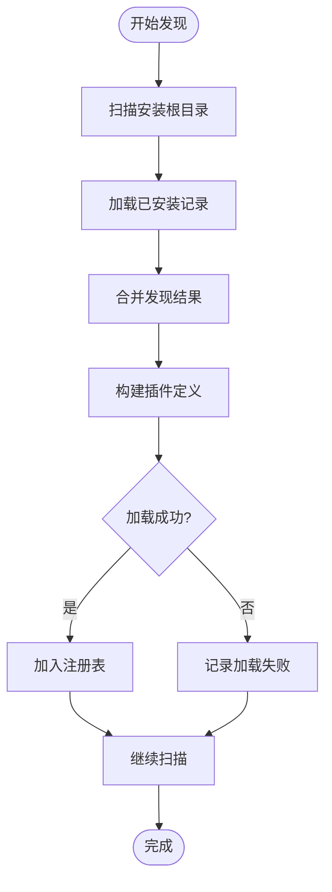
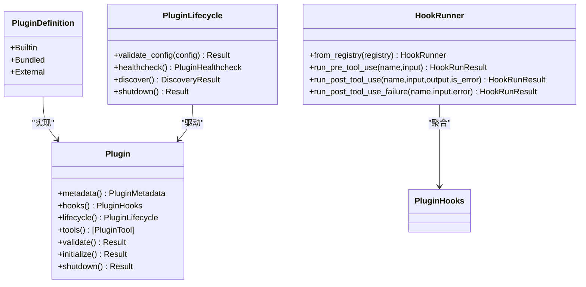
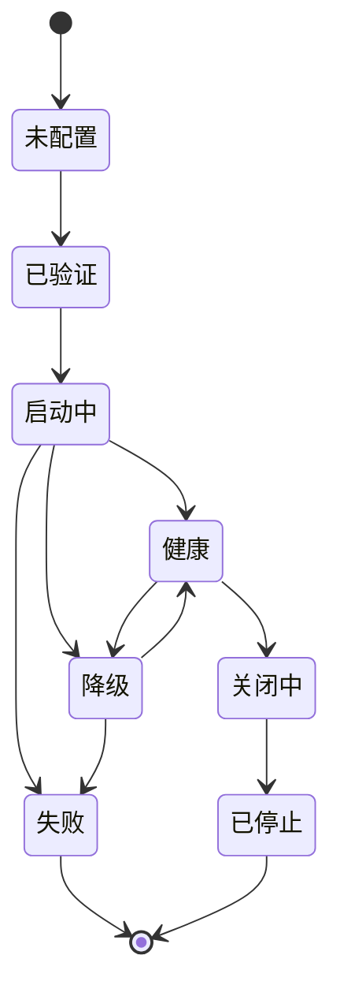
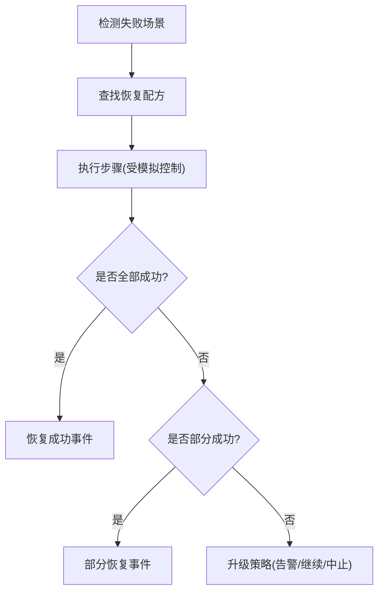
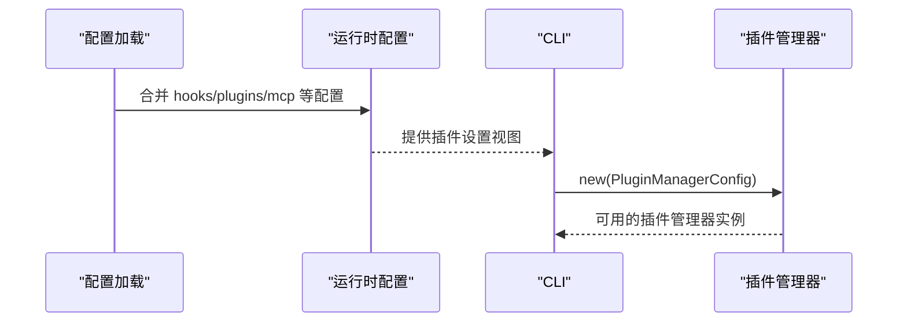
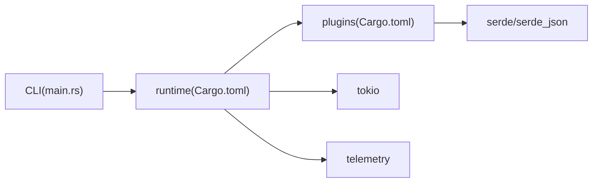

# 插件生命周期管理

<cite>
**本文档引用的文件**
- [rust/crates/plugins/src/lib.rs](file://rust/crates/plugins/src/lib.rs)
- [rust/crates/plugins/src/hooks.rs](file://rust/crates/plugins/src/hooks.rs)
- [rust/crates/runtime/src/plugin_lifecycle.rs](file://rust/crates/runtime/src/plugin_lifecycle.rs)
- [rust/crates/runtime/src/config.rs](file://rust/crates/runtime/src/config.rs)
- [rust/crates/runtime/src/recovery_recipes.rs](file://rust/crates/runtime/src/recovery_recipes.rs)
- [rust/crates/runtime/src/lib.rs](file://rust/crates/runtime/src/lib.rs)
- [rust/crates/plugins/bundled/example-bundled/.claude-plugin/plugin.json](file://rust/crates/plugins/bundled/example-bundled/.claude-plugin/plugin.json)
- [rust/crates/plugins/bundled/sample-hooks/.claude-plugin/plugin.json](file://rust/crates/plugins/bundled/sample-hooks/.claude-plugin/plugin.json)
- [rust/crates/plugins/bundled/example-bundled/hooks/pre.sh](file://rust/crates/plugins/bundled/example-bundled/hooks/pre.sh)
- [rust/crates/plugins/bundled/sample-hooks/hooks/post.sh](file://rust/crates/plugins/bundled/sample-hooks/hooks/post.sh)
- [rust/crates/rusty-claude-cli/src/main.rs](file://rust/crates/rusty-claude-cli/src/main.rs)
- [rust/crates/plugins/Cargo.toml](file://rust/crates/plugins/Cargo.toml)
- [rust/crates/runtime/Cargo.toml](file://rust/crates/runtime/Cargo.toml)
</cite>

## 目录
1. [简介](#简介)
2. [项目结构](#项目结构)
3. [核心组件](#核心组件)
4. [架构总览](#架构总览)
5. [详细组件分析](#详细组件分析)
6. [依赖关系分析](#依赖关系分析)
7. [性能考量](#性能考量)
8. [故障排查指南](#故障排查指南)
9. [结论](#结论)
10. [附录](#附录)

## 简介
本文件系统化阐述插件生命周期管理，覆盖插件发现、加载、初始化与卸载全流程；详解插件钩子系统、事件处理与生命周期回调机制；提供健康检查、状态监控与故障恢复策略；给出插件开发指南、API 接口与最佳实践；解释插件与运行时的集成方式、资源管理与安全控制；并包含调试工具、性能监控与扩展性建议。

## 项目结构
该仓库采用多 Crate 架构，插件系统主要由以下模块组成：
- plugins：插件定义、清单解析、注册表、生命周期与钩子执行
- runtime：运行时生命周期接口、健康检查、故障恢复、配置解析
- rusty-claude-cli：命令行入口，负责构建插件管理器并传递配置
- bundled 插件示例：演示钩子脚本与清单文件组织

**图表来源**
- [rust/crates/plugins/src/lib.rs](file://rust/crates/plugins/src/lib.rs)
- [rust/crates/runtime/src/plugin_lifecycle.rs](file://rust/crates/runtime/src/plugin_lifecycle.rs)
- [rust/crates/rusty-claude-cli/src/main.rs](file://rust/crates/rusty-claude-cli/src/main.rs)
- [rust/crates/plugins/bundled/example-bundled/.claude-plugin/plugin.json](file://rust/crates/plugins/bundled/example-bundled/.claude-plugin/plugin.json)
- [rust/crates/plugins/bundled/sample-hooks/.claude-plugin/plugin.json](file://rust/crates/plugins/bundled/sample-hooks/.claude-plugin/plugin.json)

**章节来源**
- [rust/crates/plugins/src/lib.rs](file://rust/crates/plugins/src/lib.rs)
- [rust/crates/runtime/src/plugin_lifecycle.rs](file://rust/crates/runtime/src/plugin_lifecycle.rs)
- [rust/crates/rusty-claude-cli/src/main.rs](file://rust/crates/rusty-claude-cli/src/main.rs)

## 核心组件
- 插件元数据与清单：插件 ID、名称、版本、描述、权限、钩子、生命周期、工具与命令等
- 插件类型：内置、打包、外部三类插件，统一通过 trait 抽象
- 注册表与汇总钩子：聚合启用插件的钩子列表，支持去重合并
- 生命周期接口：验证配置、健康检查、服务发现、优雅关闭
- 钩子系统：预/后置工具调用钩子，支持拒绝与失败传播
- 健康检查与降级模式：基于服务器健康状态计算插件整体状态
- 故障恢复：针对部分启动失败等场景的自动恢复策略

**章节来源**
- [rust/crates/plugins/src/lib.rs](file://rust/crates/plugins/src/lib.rs)
- [rust/crates/plugins/src/hooks.rs](file://rust/crates/plugins/src/hooks.rs)
- [rust/crates/runtime/src/plugin_lifecycle.rs](file://rust/crates/runtime/src/plugin_lifecycle.rs)

## 架构总览
插件生命周期在运行时中以“配置 → 发现 → 加载 → 初始化 → 运行 → 卸载”的闭环执行。运行时提供生命周期接口，插件通过清单声明钩子与生命周期命令，运行时负责执行与状态监控，并在异常时触发恢复策略。

**图表来源**
- [rust/crates/rusty-claude-cli/src/main.rs](file://rust/crates/rusty-claude-cli/src/main.rs)
- [rust/crates/plugins/src/lib.rs](file://rust/crates/plugins/src/lib.rs)
- [rust/crates/runtime/src/plugin_lifecycle.rs](file://rust/crates/runtime/src/plugin_lifecycle.rs)

## 详细组件分析

### 插件发现与加载
- 发现策略：扫描安装根目录与打包根目录，识别插件清单路径，构建插件定义
- 安装同步：将打包插件同步到安装目录，维护已安装记录
- 失败收集：对无法加载的插件记录失败原因，支持批量报告
- 注册表：按 ID 排序存储，提供查询、汇总钩子与摘要信息

**图表来源**
- [rust/crates/plugins/src/lib.rs](file://rust/crates/plugins/src/lib.rs)

**章节来源**
- [rust/crates/plugins/src/lib.rs](file://rust/crates/plugins/src/lib.rs)

### 插件生命周期与钩子系统
- 生命周期接口：validate_config、healthcheck、discover、shutdown
- 生命周期命令：Init/Shutdown 在插件定义中声明，运行时执行
- 钩子事件：PreToolUse、PostToolUse、PostToolUseFailure
- 钩子执行：串行执行，支持允许、拒绝、失败三种结果，失败会传播消息
- 钩子环境变量：为每个钩子脚本注入事件名、工具名、输入/输出、错误标志等

**图表来源**
- [rust/crates/plugins/src/lib.rs](file://rust/crates/plugins/src/lib.rs)
- [rust/crates/plugins/src/hooks.rs](file://rust/crates/plugins/src/hooks.rs)
- [rust/crates/runtime/src/plugin_lifecycle.rs](file://rust/crates/runtime/src/plugin_lifecycle.rs)

**章节来源**
- [rust/crates/plugins/src/lib.rs](file://rust/crates/plugins/src/lib.rs)
- [rust/crates/plugins/src/hooks.rs](file://rust/crates/plugins/src/hooks.rs)
- [rust/crates/runtime/src/plugin_lifecycle.rs](file://rust/crates/runtime/src/plugin_lifecycle.rs)

### 健康检查与状态监控
- 服务器健康：Healthy/Degraded/Failed 三种状态
- 插件状态：Unconfigured/Validated/Starting/Healthy/Degraded/Failed/ShuttingDown/Stopped
- 降级模式：当存在健康但降级或部分失败的服务器时，计算可用/不可用工具集合
- 健康检查：根据服务器状态生成插件状态与最近检查时间戳

**图表来源**
- [rust/crates/runtime/src/plugin_lifecycle.rs](file://rust/crates/runtime/src/plugin_lifecycle.rs)

**章节来源**
- [rust/crates/runtime/src/plugin_lifecycle.rs](file://rust/crates/runtime/src/plugin_lifecycle.rs)

### 故障恢复策略
- 场景覆盖：信任提示未解决、提示投递错误、分支过期、跨 Crate 编译、MCP 握手失败、部分插件启动、Provider 失败
- 恢复步骤：接受信任提示、重定向提示、变基/清理构建、重试握手、重启插件、重启工作进程等
- 执行策略：单次自动尝试后升级，支持部分恢复与事件日志

**图表来源**
- [rust/crates/runtime/src/recovery_recipes.rs](file://rust/crates/runtime/src/recovery_recipes.rs)

**章节来源**
- [rust/crates/runtime/src/recovery_recipes.rs](file://rust/crates/runtime/src/recovery_recipes.rs)

### 插件与运行时集成
- 配置解析：运行时从多个位置合并配置，提取插件相关设置（启用列表、外部目录、安装根、注册表路径、打包根）
- CLI 构建：CLI 将运行时配置转换为插件管理器配置，解析相对路径与绝对路径
- 生命周期桥接：运行时提供生命周期 trait，插件通过清单声明 Init/Shutdown 命令

**图表来源**
- [rust/crates/runtime/src/config.rs](file://rust/crates/runtime/src/config.rs)
- [rust/crates/rusty-claude-cli/src/main.rs](file://rust/crates/rusty-claude-cli/src/main.rs)

**章节来源**
- [rust/crates/runtime/src/config.rs](file://rust/crates/runtime/src/config.rs)
- [rust/crates/rusty-claude-cli/src/main.rs](file://rust/crates/rusty-claude-cli/src/main.rs)

### 插件开发指南与最佳实践
- 清单规范：声明 name/version/description/permissions/defaultEnabled/hooks/lifecycle/tools/commands
- 钩子脚本：遵循平台差异（Windows 使用 cmd /C，类 Unix 使用 sh 或 -lc），确保可执行权限
- 生命周期命令：Init/Shutdown 用于环境准备与清理，避免阻塞与长时间运行
- 权限模型：使用只读/工作区写入/危险全权限标签，最小授权原则
- 健康检查：提供稳定的工具/资源发现能力，避免在降级状态下暴露不可用能力
- 并发安全：避免共享状态冲突，使用隔离的配置目录进行测试

**章节来源**
- [rust/crates/plugins/src/lib.rs](file://rust/crates/plugins/src/lib.rs)
- [rust/crates/plugins/src/hooks.rs](file://rust/crates/plugins/src/hooks.rs)
- [rust/crates/plugins/bundled/example-bundled/.claude-plugin/plugin.json](file://rust/crates/plugins/bundled/example-bundled/.claude-plugin/plugin.json)
- [rust/crates/plugins/bundled/sample-hooks/.claude-plugin/plugin.json](file://rust/crates/plugins/bundled/sample-hooks/.claude-plugin/plugin.json)

## 依赖关系分析
- plugins 依赖 serde/serde_json 进行序列化与清单解析
- runtime 依赖 plugins、telemetry、tokio 等，提供生命周期、健康检查、恢复与 MCP 集成
- CLI 通过 runtime 暴露的能力与接口，构建插件管理器

**图表来源**
- [rust/crates/plugins/Cargo.toml](file://rust/crates/plugins/Cargo.toml)
- [rust/crates/runtime/Cargo.toml](file://rust/crates/runtime/Cargo.toml)
- [rust/crates/rusty-claude-cli/src/main.rs](file://rust/crates/rusty-claude-cli/src/main.rs)

**章节来源**
- [rust/crates/plugins/Cargo.toml](file://rust/crates/plugins/Cargo.toml)
- [rust/crates/runtime/Cargo.toml](file://rust/crates/runtime/Cargo.toml)

## 性能考量
- 钩子执行：串行执行，避免阻塞；建议短小精悍，必要时异步化
- 生命周期命令：尽量幂等且快速；Init/Shutdown 中避免长耗时操作
- 健康检查：定期采样，避免频繁重试造成负载；降级模式下减少无效请求
- 并发安装：多线程并行安装需注意磁盘与锁竞争，确保无状态与隔离

[本节为通用指导，无需具体文件分析]

## 故障排查指南
- 加载失败：查看插件加载失败报告，定位清单缺失、路径错误或权限问题
- 钩子拒绝：检查钩子返回码与标准输出，确认拒绝原因与消息
- 生命周期命令失败：查看 Init/Shutdown 命令执行日志与退出码
- 健康检查异常：核对服务器状态、能力列表与最后错误信息
- 恢复策略：关注恢复事件日志，区分完全恢复、部分恢复与升级

**章节来源**
- [rust/crates/plugins/src/lib.rs](file://rust/crates/plugins/src/lib.rs)
- [rust/crates/plugins/src/hooks.rs](file://rust/crates/plugins/src/hooks.rs)
- [rust/crates/runtime/src/plugin_lifecycle.rs](file://rust/crates/runtime/src/plugin_lifecycle.rs)
- [rust/crates/runtime/src/recovery_recipes.rs](file://rust/crates/runtime/src/recovery_recipes.rs)

## 结论
该插件系统通过清晰的生命周期接口、可组合的钩子机制与完善的健康检查/恢复策略，实现了稳定、可观测且可扩展的插件生态。开发者应严格遵循清单规范与最小权限原则，结合运行时提供的接口与工具，确保插件在生产环境中的可靠性与安全性。

[本节为总结，无需具体文件分析]

## 附录

### 插件清单字段说明
- name/version/description：插件基本信息
- permissions：访问权限（读/写/执行）
- defaultEnabled：默认启用状态
- hooks：钩子命令列表（PreToolUse/PostToolUse/PostToolUseFailure）
- lifecycle：生命周期命令（Init/Shutdown）
- tools：工具定义（名称、输入模式、命令、参数、所需权限）
- commands：命令定义（名称、描述、命令）

**章节来源**
- [rust/crates/plugins/src/lib.rs](file://rust/crates/plugins/src/lib.rs)

### 示例插件清单
- example-bundled：演示钩子与清单组织
- sample-hooks：钩子集成测试样例

**章节来源**
- [rust/crates/plugins/bundled/example-bundled/.claude-plugin/plugin.json](file://rust/crates/plugins/bundled/example-bundled/.claude-plugin/plugin.json)
- [rust/crates/plugins/bundled/sample-hooks/.claude-plugin/plugin.json](file://rust/crates/plugins/bundled/sample-hooks/.claude-plugin/plugin.json)