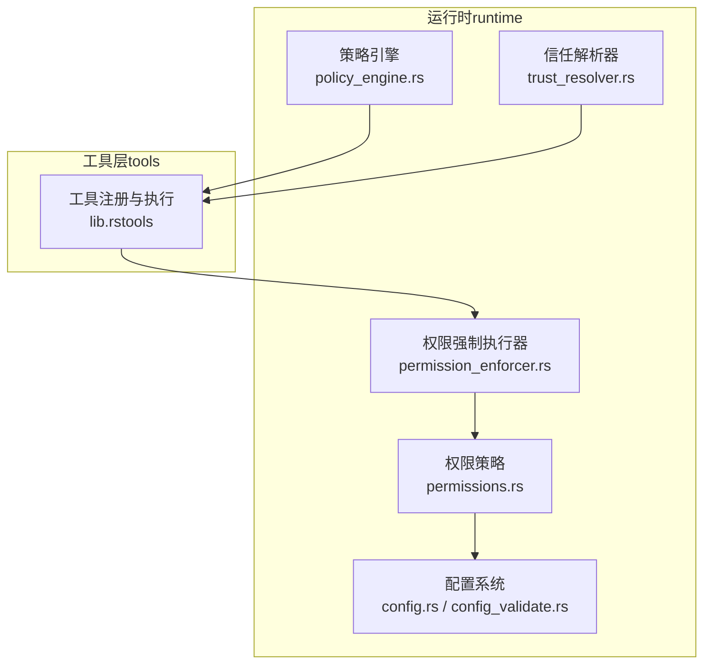
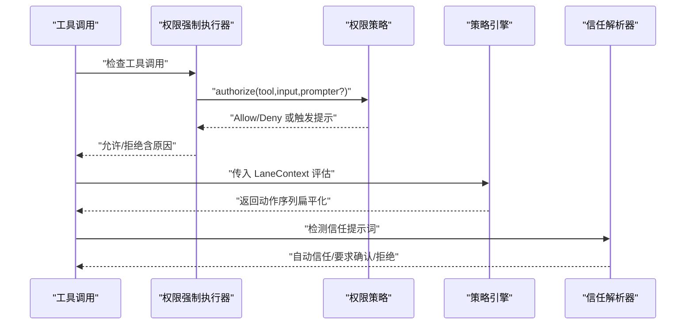
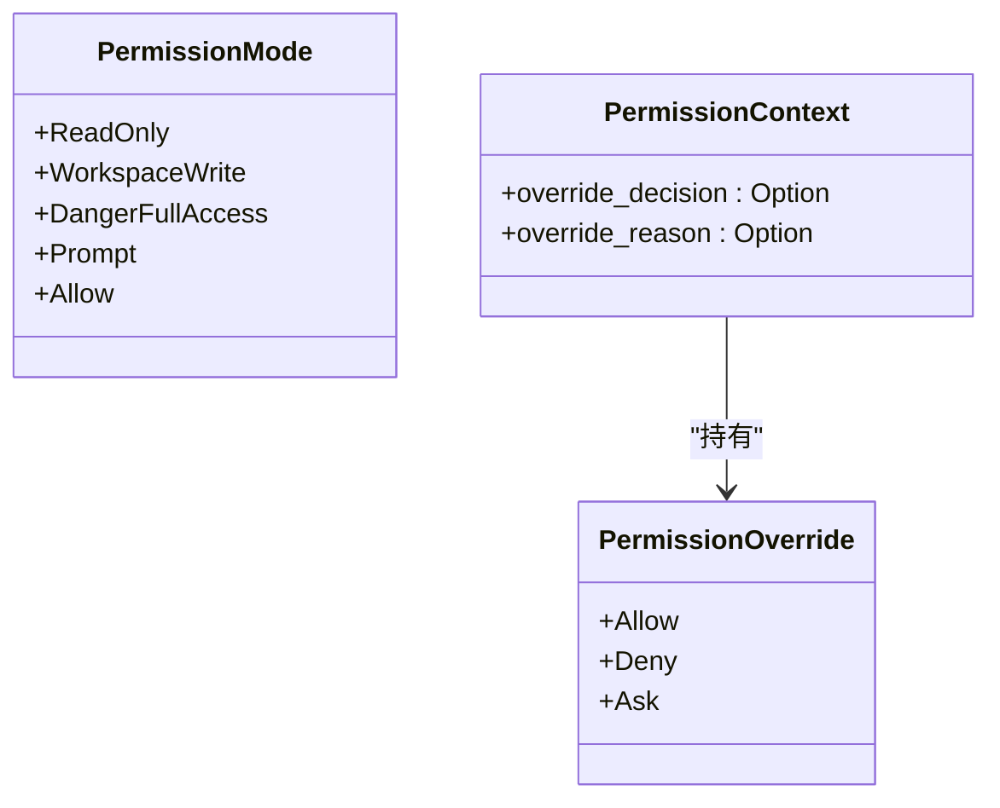
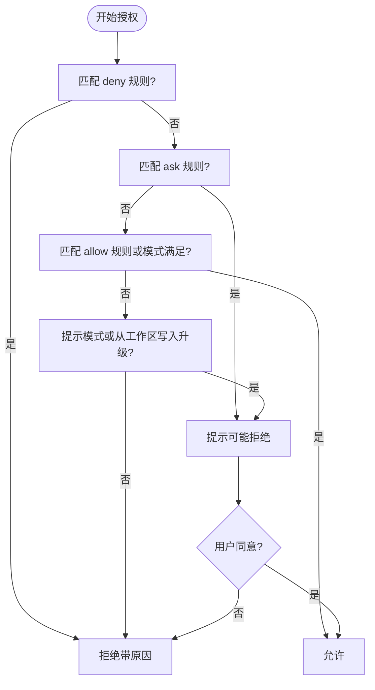
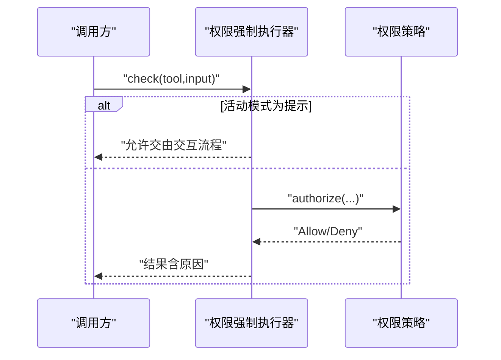
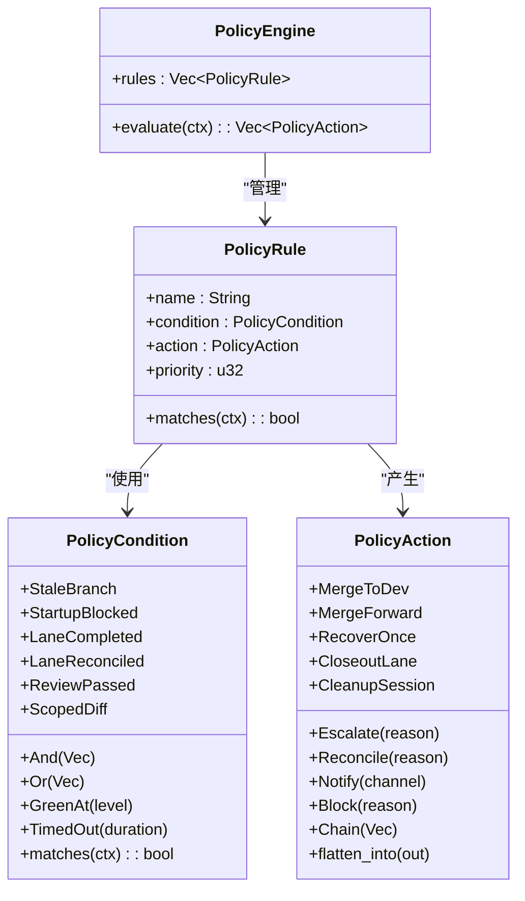
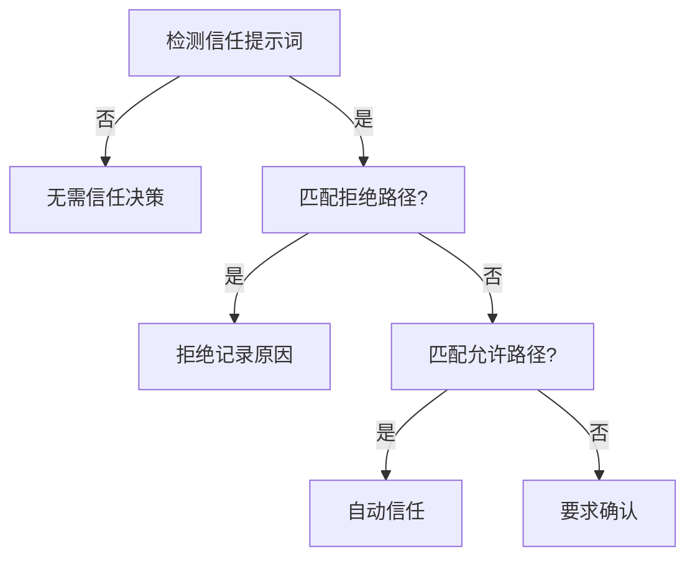
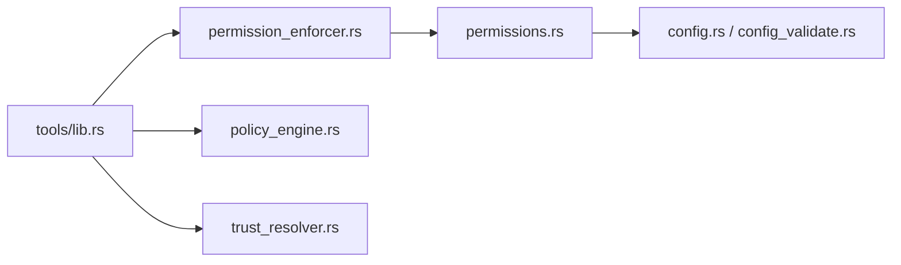

# 权限与策略引擎

<cite>
**本文引用的文件**
- [policy_engine.rs](file://rust/crates/runtime/src/policy_engine.rs)
- [permission_enforcer.rs](file://rust/crates/runtime/src/permission_enforcer.rs)
- [permissions.rs](file://rust/crates/runtime/src/permissions.rs)
- [trust_resolver.rs](file://rust/crates/runtime/src/trust_resolver.rs)
- [config.rs](file://rust/crates/runtime/src/config.rs)
- [config_validate.rs](file://rust/crates/runtime/src/config_validate.rs)
- [lib.rs（tools）](file://rust/crates/tools/src/lib.rs)
- [usage.rs](file://rust/crates/runtime/src/usage.rs)
- [integration_tests.rs](file://rust/crates/runtime/tests/integration_tests.rs)
- [permissions.py](file://src/permissions.py)
</cite>

## 目录
1. [简介](#简介)
2. [项目结构](#项目结构)
3. [核心组件](#核心组件)
4. [架构总览](#架构总览)
5. [详细组件分析](#详细组件分析)
6. [依赖关系分析](#依赖关系分析)
7. [性能考量](#性能考量)
8. [故障排除指南](#故障排除指南)
9. [结论](#结论)
10. [附录](#附录)

## 简介
本文件系统化阐述权限与策略引擎的设计与实现，涵盖权限模式、策略规则与执行器的工作机制；详细说明权限评估流程、策略条件判断与决策制定过程；包含权限覆盖、信任与合规性检查；提供策略配置示例、权限调试与冲突解决指南；解释策略引擎与运行时的集成方式、性能优化与扩展机制，并总结权限安全最佳实践与风险评估方法。

## 项目结构
该仓库采用多 Crate 的模块化组织，权限与策略相关逻辑主要集中在 runtime crate 中：
- 权限策略：权限模式、规则解析、授权决策、强制执行
- 策略引擎：基于 LaneContext 的规则匹配与动作执行
- 信任管理：基于工作目录提示词的信任判定
- 配置系统：支持从多个来源合并配置，含权限规则与信任根等
- 工具层：在工具调用前进行权限检查与动态模式分类
- 使用统计：令牌用量与成本估算（用于合规与成本控制）

图表来源
- [policy_engine.rs:184-216](file://rust/crates/runtime/src/policy_engine.rs#L184-L216)
- [permissions.rs:98-171](file://rust/crates/runtime/src/permissions.rs#L98-L171)
- [permission_enforcer.rs:26-101](file://rust/crates/runtime/src/permission_enforcer.rs#L26-L101)
- [trust_resolver.rs:77-150](file://rust/crates/runtime/src/trust_resolver.rs#L77-L150)
- [config.rs:304-325](file://rust/crates/runtime/src/config.rs#L304-L325)
- [lib.rs（tools）:1293-1324](file://rust/crates/tools/src/lib.rs#L1293-L1324)

章节来源
- [policy_engine.rs:1-582](file://rust/crates/runtime/src/policy_engine.rs#L1-L582)
- [permissions.rs:1-684](file://rust/crates/runtime/src/permissions.rs#L1-L684)
- [permission_enforcer.rs:1-586](file://rust/crates/runtime/src/permission_enforcer.rs#L1-L586)
- [trust_resolver.rs:1-300](file://rust/crates/runtime/src/trust_resolver.rs#L1-L300)
- [config.rs:1-800](file://rust/crates/runtime/src/config.rs#L1-L800)
- [config_validate.rs:1-902](file://rust/crates/runtime/src/config_validate.rs#L1-L902)
- [lib.rs（tools）:1-200](file://rust/crates/tools/src/lib.rs#L1-L200)

## 核心组件
- 权限模式与覆盖
  - 权限模式：只读、工作区写入、危险全权、提示交互、允许
  - 覆盖：钩子可直接允许/拒绝/要求确认
- 权限策略
  - 规则：allow/deny/ask 三类规则，按工具名与输入内容匹配
  - 授权流程：deny 优先，ask 强制提示，否则按模式阈值或显式要求决定
- 权限强制执行器
  - 对工具调用进行即时检查，支持动态所需模式与文件边界检查
- 策略引擎
  - 基于 LaneContext 的规则匹配，支持组合条件与优先级排序
  - 动作链与复合动作扁平化执行
- 信任解析器
  - 基于屏幕文本中的信任提示词识别，结合信任根白名单/黑名单自动放行或要求确认
- 配置系统
  - 多源配置合并，解析权限规则与信任根
- 工具层集成
  - 在工具执行前进行权限检查，必要时动态分类所需模式

章节来源
- [permissions.rs:8-15](file://rust/crates/runtime/src/permissions.rs#L8-L15)
- [permissions.rs:30-66](file://rust/crates/runtime/src/permissions.rs#L30-L66)
- [permissions.rs:98-171](file://rust/crates/runtime/src/permissions.rs#L98-L171)
- [permission_enforcer.rs:26-101](file://rust/crates/runtime/src/permission_enforcer.rs#L26-L101)
- [policy_engine.rs:184-216](file://rust/crates/runtime/src/policy_engine.rs#L184-L216)
- [trust_resolver.rs:11-23](file://rust/crates/runtime/src/trust_resolver.rs#L11-L23)
- [config.rs:87-93](file://rust/crates/runtime/src/config.rs#L87-L93)
- [lib.rs（tools）:1293-1324](file://rust/crates/tools/src/lib.rs#L1293-L1324)

## 架构总览
下图展示权限与策略引擎在运行时的整体交互：工具层发起调用，先经权限强制执行器检查，再由权限策略评估，最终由策略引擎根据上下文生成动作序列，信任解析器在需要时介入。

图表来源
- [lib.rs（tools）:1293-1324](file://rust/crates/tools/src/lib.rs#L1293-L1324)
- [permission_enforcer.rs:39-61](file://rust/crates/runtime/src/permission_enforcer.rs#L39-L61)
- [permissions.rs:164-292](file://rust/crates/runtime/src/permissions.rs#L164-L292)
- [policy_engine.rs:202-216](file://rust/crates/runtime/src/policy_engine.rs#L202-L216)
- [trust_resolver.rs:89-135](file://rust/crates/runtime/src/trust_resolver.rs#L89-L135)

## 详细组件分析

### 权限模式与覆盖
- 权限模式等级：只读 < 工作区写入 < 危险全权 < 提示交互 < 允许
- 覆盖决策：钩子可直接 Deny/Allow/Ask，优先于常规授权流程
- 工具需求：每种工具可声明所需最低模式，若未声明，默认为最高模式

图表来源
- [permissions.rs:8-15](file://rust/crates/runtime/src/permissions.rs#L8-L15)
- [permissions.rs:30-66](file://rust/crates/runtime/src/permissions.rs#L30-L66)

章节来源
- [permissions.rs:8-66](file://rust/crates/runtime/src/permissions.rs#L8-L66)

### 权限策略与授权流程
- 规则解析：支持任意、精确匹配、前缀匹配，以及转义括号
- 授权顺序：
  1) 若存在 deny 规则匹配，直接拒绝
  2) 若存在 ask 规则匹配，进入提示流程
  3) 若存在 allow 规则或当前模式满足要求，允许
  4) 若处于提示模式或从工作区写入升级到危险全权，进入提示
  5) 否则拒绝
- 提示接口：通过 PermissionPrompter 决策，支持拒绝理由

图表来源
- [permissions.rs:174-292](file://rust/crates/runtime/src/permissions.rs#L174-L292)

章节来源
- [permissions.rs:98-333](file://rust/crates/runtime/src/permissions.rs#L98-L333)

### 权限强制执行器
- 检查工具调用：当活动模式为提示时，交由上层交互流程处理
- 文件写入检查：根据模式与工作区边界判断是否允许
- Bash 命令检查：保守地判断是否只读命令，非只读命令在只读模式下拒绝
- 动态所需模式：针对 bash 等工具，可根据命令内容动态提升所需模式

图表来源
- [permission_enforcer.rs:39-61](file://rust/crates/runtime/src/permission_enforcer.rs#L39-L61)
- [permissions.rs:164-292](file://rust/crates/runtime/src/permissions.rs#L164-L292)

章节来源
- [permission_enforcer.rs:26-174](file://rust/crates/runtime/src/permission_enforcer.rs#L26-L174)

### 策略引擎与动作执行
- 规则定义：名称、条件、动作、优先级
- 条件组合：And/Or 支持嵌套，条件包括绿灯等级、分支新鲜度、启动阻塞、评审状态、差异范围、超时等
- 动作链：支持链式动作扁平化，动作类型包括合并、恢复、升级、关闭、清理、协调、通知、阻断等
- 执行流程：按优先级排序后遍历匹配，收集所有匹配动作并扁平化输出

图表来源
- [policy_engine.rs:7-13](file://rust/crates/runtime/src/policy_engine.rs#L7-L13)
- [policy_engine.rs:37-49](file://rust/crates/runtime/src/policy_engine.rs#L37-L49)
- [policy_engine.rs:73-85](file://rust/crates/runtime/src/policy_engine.rs#L73-L85)
- [policy_engine.rs:184-216](file://rust/crates/runtime/src/policy_engine.rs#L184-L216)

章节来源
- [policy_engine.rs:7-216](file://rust/crates/runtime/src/policy_engine.rs#L7-L216)

### 信任解析器
- 提示词检测：识别常见信任提示语句
- 路径匹配：允许列表优先于拒绝列表
- 决策：自动信任、要求确认、拒绝

图表来源
- [trust_resolver.rs:89-135](file://rust/crates/runtime/src/trust_resolver.rs#L89-L135)

章节来源
- [trust_resolver.rs:11-150](file://rust/crates/runtime/src/trust_resolver.rs#L11-L150)

### 配置系统与规则加载
- 配置来源：用户、项目、本地 settings.json
- 权限规则：permissions.allow/deny/ask 字段，支持字符串数组
- 信任根：trustedRoots 字段，支持字符串数组
- 解析与校验：键名与类型校验，未知键提示与建议，弃用字段警告

章节来源
- [config.rs:304-325](file://rust/crates/runtime/src/config.rs#L304-L325)
- [config.rs:780-798](file://rust/crates/runtime/src/config.rs#L780-L798)
- [config_validate.rs:143-234](file://rust/crates/runtime/src/config_validate.rs#L143-L234)

### 工具层集成与动态模式
- 工具注册：内置工具与插件工具、运行时工具集合
- 权限强制：在工具执行前调用强制执行器
- 动态模式：针对 bash 等工具，根据命令内容动态确定所需模式

章节来源
- [lib.rs（tools）:1293-1324](file://rust/crates/tools/src/lib.rs#L1293-L1324)
- [lib.rs（tools）:186-190](file://rust/crates/tools/src/lib.rs#L186-L190)

## 依赖关系分析
- 组件耦合
  - 工具层依赖权限强制执行器与权限策略
  - 权限策略依赖配置系统提供的规则与模式
  - 策略引擎独立于工具层，仅依赖 LaneContext
  - 信任解析器与工具层协作，用于交互式信任场景
- 外部依赖
  - 配置解析与校验（JSON）
  - 工具注册与执行（tools crate）
  - 运行时会话与消息（runtime crate）

图表来源
- [lib.rs（tools）:1-200](file://rust/crates/tools/src/lib.rs#L1-L200)
- [permission_enforcer.rs:1-586](file://rust/crates/runtime/src/permission_enforcer.rs#L1-L586)
- [permissions.rs:1-684](file://rust/crates/runtime/src/permissions.rs#L1-L684)
- [config.rs:1-800](file://rust/crates/runtime/src/config.rs#L1-L800)
- [config_validate.rs:1-902](file://rust/crates/runtime/src/config_validate.rs#L1-L902)
- [policy_engine.rs:1-582](file://rust/crates/runtime/src/policy_engine.rs#L1-L582)
- [trust_resolver.rs:1-300](file://rust/crates/runtime/src/trust_resolver.rs#L1-L300)

章节来源
- [lib.rs（tools）:1-200](file://rust/crates/tools/src/lib.rs#L1-L200)
- [permissions.rs:1-684](file://rust/crates/runtime/src/permissions.rs#L1-L684)
- [policy_engine.rs:1-582](file://rust/crates/runtime/src/policy_engine.rs#L1-L582)
- [trust_resolver.rs:1-300](file://rust/crates/runtime/src/trust_resolver.rs#L1-L300)
- [config.rs:1-800](file://rust/crates/runtime/src/config.rs#L1-L800)
- [config_validate.rs:1-902](file://rust/crates/runtime/src/config_validate.rs#L1-L902)

## 性能考量
- 规则匹配复杂度
  - 权限策略：线性扫描规则，规则数量应受控；deny 优先可提前短路
  - 策略引擎：规则按优先级排序，匹配时按序遍历，组合条件为常数级判断
- 计算开销
  - 权限策略：字符串匹配与 JSON 主体提取，复杂度与输入大小线性相关
  - 策略引擎：动作链扁平化为 O(n)，n 为链长度
- I/O 与解析
  - 配置加载与校验为一次性开销，建议缓存已解析配置
- 优化建议
  - 合理设置规则数量与层级，避免过深嵌套
  - 将高频规则置于靠前优先级，利用 deny 优先快速拒绝
  - 对动态模式分类进行缓存，减少重复解析
  - 在工具层批量检查时复用权限强制执行器实例

[本节为通用指导，不直接分析具体文件]

## 故障排除指南
- 权限拒绝排查
  - 检查活动模式与所需模式：强制执行器返回的拒绝原因包含当前模式与所需模式
  - 核对工具需求与规则：确认工具是否被 deny 规则命中，或是否需要 ask 规则确认
  - 钩子覆盖：若存在钩子覆盖，优先级高于常规授权
- 规则冲突与优先级
  - 确认 deny 优先于 ask/allow
  - 优先级高的规则先匹配，注意组合条件的布尔逻辑
- 配置问题
  - 使用配置校验报告定位未知键、类型错误与弃用字段
  - 检查 permissions.allow/deny/ask 与 trustedRoots 的格式与内容
- 信任解析
  - 确认提示词检测是否正确触发
  - 检查信任根路径匹配与优先级（拒绝列表优先于允许列表）

章节来源
- [permission_enforcer.rs:48-60](file://rust/crates/runtime/src/permission_enforcer.rs#L48-L60)
- [permissions.rs:182-292](file://rust/crates/runtime/src/permissions.rs#L182-L292)
- [config_validate.rs:436-506](file://rust/crates/runtime/src/config_validate.rs#L436-L506)
- [trust_resolver.rs:89-135](file://rust/crates/runtime/src/trust_resolver.rs#L89-L135)

## 结论
该权限与策略引擎以清晰的权限模式与规则体系为基础，结合严格的授权流程与灵活的动作链机制，在工具层与运行时之间建立了稳健的安全边界。通过配置系统与信任解析器，系统实现了可配置、可审计、可扩展的权限治理能力。建议在生产环境中严格控制规则数量与优先级，充分利用 deny 优先与 ask 规则，配合配置校验与日志审计，确保安全与合规。

[本节为总结性内容，不直接分析具体文件]

## 附录

### 权限评估流程与策略条件判断
- 权限评估
  - deny 规则优先
  - ask 规则强制提示
  - 允许条件：存在 allow 规则、当前模式满足要求、或提示模式下的升级场景
- 策略条件
  - 组合条件：And/Or 支持嵌套
  - 上下文：绿灯等级、分支新鲜度、阻塞状态、评审状态、差异范围、超时等

章节来源
- [permissions.rs:174-292](file://rust/crates/runtime/src/permissions.rs#L174-L292)
- [policy_engine.rs:37-71](file://rust/crates/runtime/src/policy_engine.rs#L37-L71)

### 策略配置示例
- 权限规则
  - allow：["bash(git:*)"]
  - deny：["bash(rm -rf:*)"]
  - ask：["bash(*)"]
- 信任根
  - trustedRoots：["/worktrees"]

章节来源
- [config.rs:780-798](file://rust/crates/runtime/src/config.rs#L780-L798)
- [config_validate.rs:217-234](file://rust/crates/runtime/src/config_validate.rs#L217-L234)

### 权限调试与冲突解决
- 调试要点
  - 查看拒绝原因（工具名、当前模式、所需模式）
  - 检查规则匹配与优先级
  - 核对钩子覆盖与提示流程
- 冲突解决
  - 将 deny 规则置于更靠前位置
  - 明确 ask 规则与 allow 规则的边界
  - 使用最小化规则集验证行为

章节来源
- [permission_enforcer.rs:48-60](file://rust/crates/runtime/src/permission_enforcer.rs#L48-L60)
- [permissions.rs:182-292](file://rust/crates/runtime/src/permissions.rs#L182-L292)

### 策略引擎与运行时集成
- 工具层集成
  - 在工具执行前调用强制执行器
  - 对 bash 等工具进行动态模式分类
- 运行时集成
  - 策略引擎接收 LaneContext，返回动作序列
  - 与会话、事件、恢复流程协同

章节来源
- [lib.rs（tools）:1293-1324](file://rust/crates/tools/src/lib.rs#L1293-L1324)
- [policy_engine.rs:202-216](file://rust/crates/runtime/src/policy_engine.rs#L202-L216)

### 审计日志与合规性检查
- 审计点
  - 权限拒绝原因与模式对比
  - 规则匹配与覆盖决策
  - 信任解析事件（要求确认/自动信任/拒绝）
- 合规建议
  - 记录每次授权决策与原因
  - 定期审查权限规则与信任根
  - 对高风险操作启用 ask 规则

章节来源
- [permission_enforcer.rs:48-60](file://rust/crates/runtime/src/permission_enforcer.rs#L48-L60)
- [trust_resolver.rs:89-135](file://rust/crates/runtime/src/trust_resolver.rs#L89-L135)

### 权限安全最佳实践
- 最小权限原则：默认只读，按需提升
- 规则最小化：仅保留必要规则，避免过度授权
- 提示与覆盖：对高风险操作启用 ask 并明确覆盖场景
- 配置校验：使用校验器及时发现配置错误
- 信任根治理：谨慎维护信任根，拒绝列表优先

章节来源
- [permissions.rs:174-292](file://rust/crates/runtime/src/permissions.rs#L174-L292)
- [config_validate.rs:436-506](file://rust/crates/runtime/src/config_validate.rs#L436-L506)
- [trust_resolver.rs:89-135](file://rust/crates/runtime/src/trust_resolver.rs#L89-L135)

### Python 权限上下文（辅助）
- ToolPermissionContext：提供工具名与前缀的拒绝集合，便于 Python 层辅助过滤

章节来源
- [permissions.py:6-21](file://src/permissions.py#L6-L21)