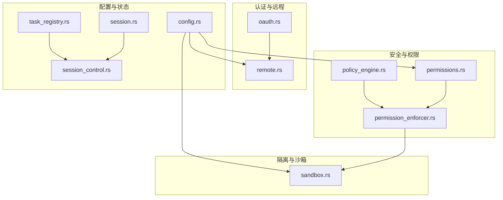
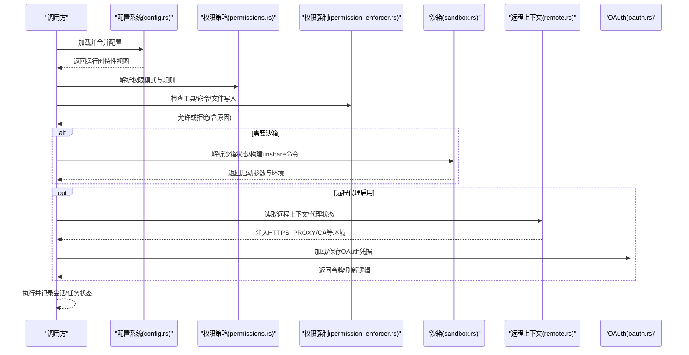
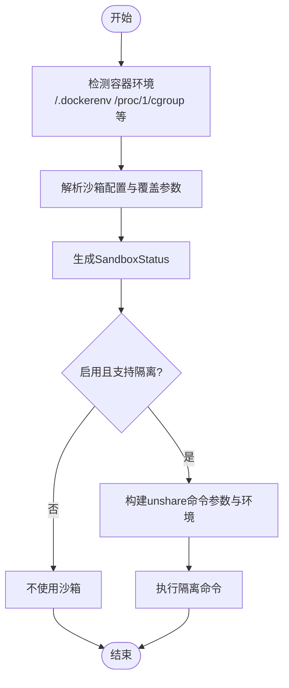
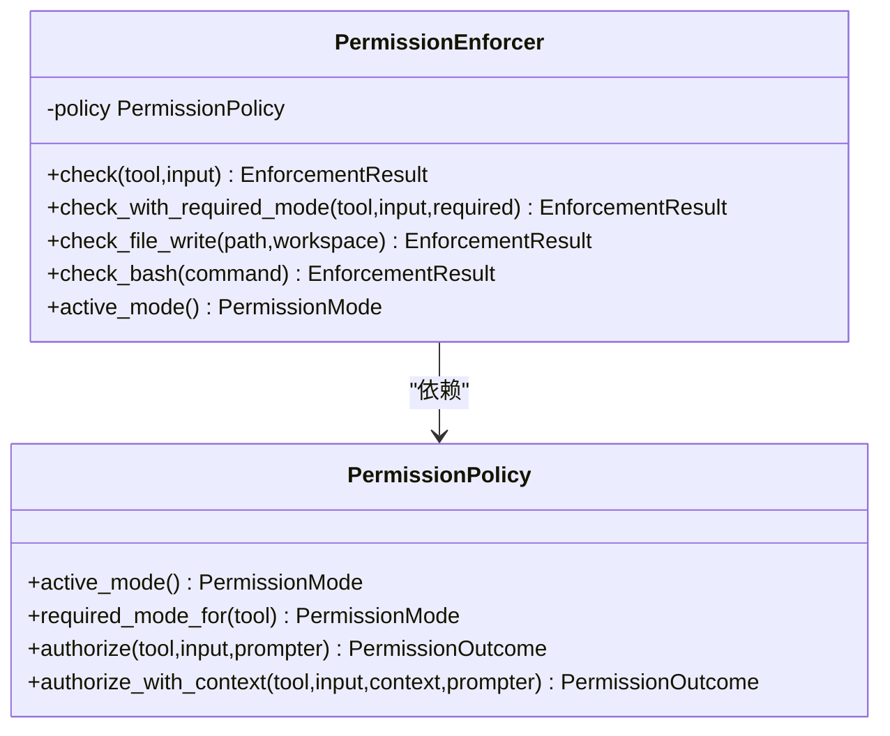
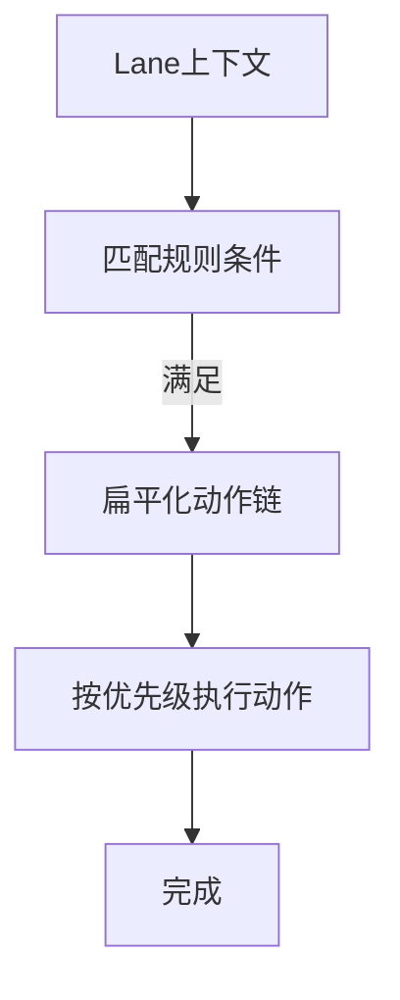
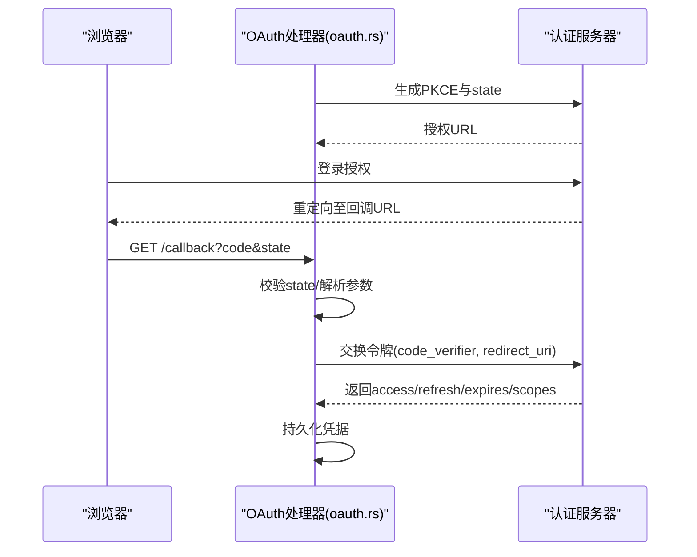
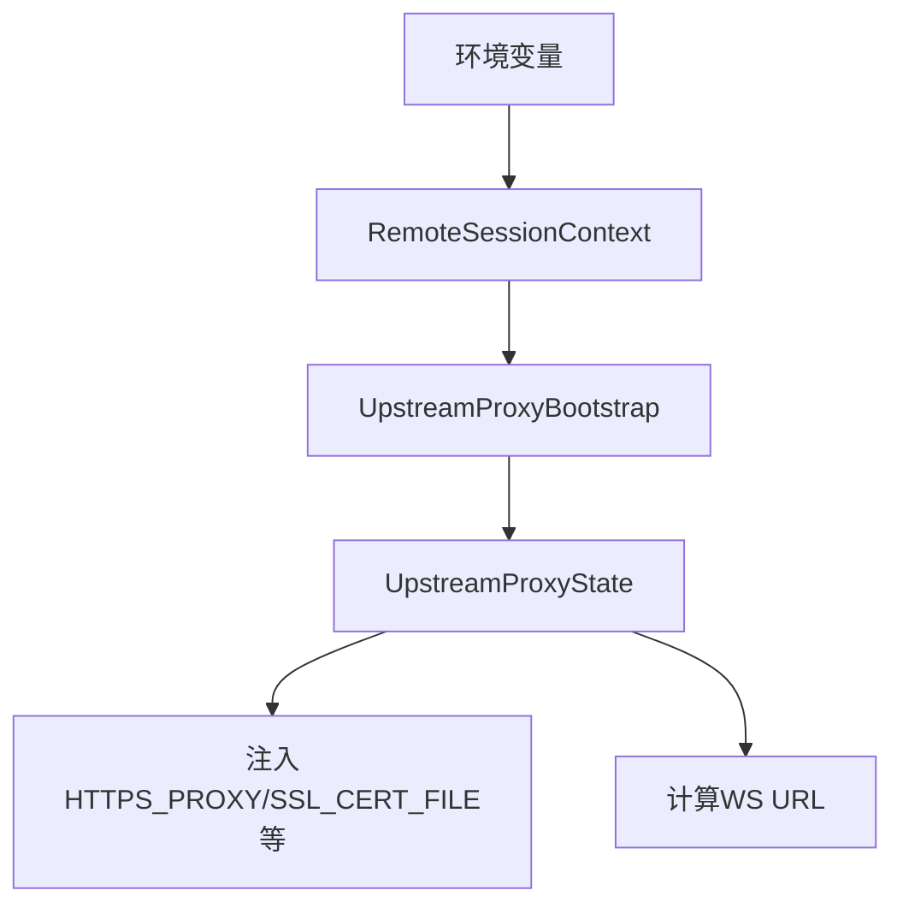
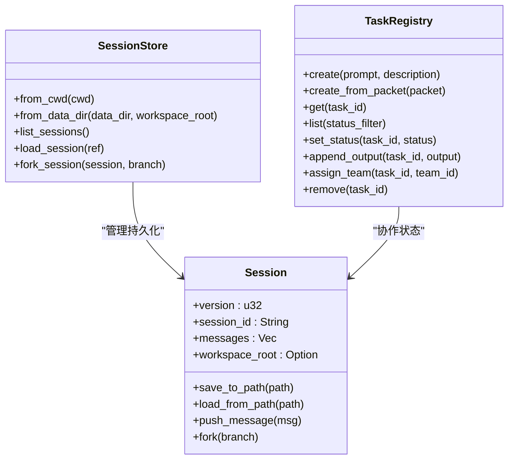
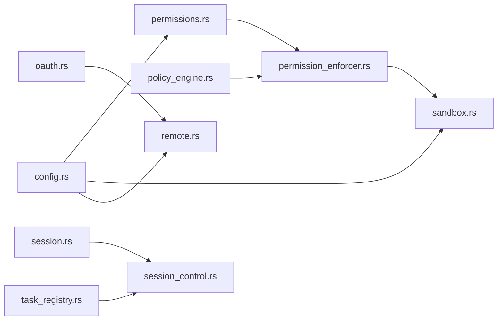

# 沙箱与安全系统

<cite>
**本文档引用的文件**
- [sandbox.rs](file://rust/crates/runtime/src/sandbox.rs)
- [permissions.rs](file://rust/crates/runtime/src/permissions.rs)
- [permission_enforcer.rs](file://rust/crates/runtime/src/permission_enforcer.rs)
- [policy_engine.rs](file://rust/crates/runtime/src/policy_engine.rs)
- [oauth.rs](file://rust/crates/runtime/src/oauth.rs)
- [remote.rs](file://rust/crates/runtime/src/remote.rs)
- [config.rs](file://rust/crates/runtime/src/config.rs)
- [session.rs](file://rust/crates/runtime/src/session.rs)
- [session_control.rs](file://rust/crates/runtime/src/session_control.rs)
- [task_registry.rs](file://rust/crates/runtime/src/task_registry.rs)
</cite>

## 目录
1. [简介](#简介)
2. [项目结构](#项目结构)
3. [核心组件](#核心组件)
4. [架构总览](#架构总览)
5. [详细组件分析](#详细组件分析)
6. [依赖关系分析](#依赖关系分析)
7. [性能考虑](#性能考虑)
8. [故障排查指南](#故障排查指南)
9. [结论](#结论)
10. [附录](#附录)

## 简介
本文件系统化阐述“沙箱与安全系统”的设计与实现，覆盖文件系统隔离、容器环境检测、权限策略、OAuth 认证、远程会话上下文与代理配置、策略引擎、状态管理与持久化等主题。文档旨在帮助开发者在不深入源码的前提下理解整体架构，并为运维与安全人员提供可操作的配置与排障建议。

## 项目结构
围绕“沙箱与安全”主题，相关代码主要集中在 Rust 子工程的 runtime 模块中，采用按职责分层的设计：
- 安全策略与权限：permissions.rs、permission_enforcer.rs、policy_engine.rs
- 沙箱与隔离：sandbox.rs
- 远程会话与代理：remote.rs、oauth.rs
- 配置与运行时视图：config.rs
- 会话与任务状态：session.rs、session_control.rs、task_registry.rs

图表来源
- [permissions.rs:1-684](file://rust/crates/runtime/src/permissions.rs#L1-L684)
- [permission_enforcer.rs:1-586](file://rust/crates/runtime/src/permission_enforcer.rs#L1-L586)
- [policy_engine.rs:1-582](file://rust/crates/runtime/src/policy_engine.rs#L1-L582)
- [sandbox.rs:1-386](file://rust/crates/runtime/src/sandbox.rs#L1-L386)
- [oauth.rs:1-604](file://rust/crates/runtime/src/oauth.rs#L1-L604)
- [remote.rs:1-402](file://rust/crates/runtime/src/remote.rs#L1-L402)
- [config.rs:1-800](file://rust/crates/runtime/src/config.rs#L1-L800)
- [session.rs:1-800](file://rust/crates/runtime/src/session.rs#L1-L800)
- [session_control.rs:1-800](file://rust/crates/runtime/src/session_control.rs#L1-L800)
- [task_registry.rs:1-504](file://rust/crates/runtime/src/task_registry.rs#L1-L504)

章节来源
- [sandbox.rs:1-386](file://rust/crates/runtime/src/sandbox.rs#L1-L386)
- [permissions.rs:1-684](file://rust/crates/runtime/src/permissions.rs#L1-L684)
- [permission_enforcer.rs:1-586](file://rust/crates/runtime/src/permission_enforcer.rs#L1-L586)
- [policy_engine.rs:1-582](file://rust/crates/runtime/src/policy_engine.rs#L1-L582)
- [oauth.rs:1-604](file://rust/crates/runtime/src/oauth.rs#L1-L604)
- [remote.rs:1-402](file://rust/crates/runtime/src/remote.rs#L1-L402)
- [config.rs:1-800](file://rust/crates/runtime/src/config.rs#L1-L800)
- [session.rs:1-800](file://rust/crates/runtime/src/session.rs#L1-L800)
- [session_control.rs:1-800](file://rust/crates/runtime/src/session_control.rs#L1-L800)
- [task_registry.rs:1-504](file://rust/crates/runtime/src/task_registry.rs#L1-L504)

## 核心组件
- 沙箱与隔离（sandbox.rs）
  - 文件系统隔离模式：关闭、仅工作区、白名单
  - 容器环境检测：基于 /proc、环境变量、标记文件
  - 状态解析与命令构建：unshare 命令参数与环境注入
- 权限策略（permissions.rs、permission_enforcer.rs）
  - 权限等级：只读、工作区写入、危险全权、提示、允许
  - 规则匹配：allow/deny/ask 三类规则，支持工具名与输入内容匹配
  - 执行前检查：文件写入边界、bash 命令只读启发式
- 策略引擎（policy_engine.rs）
  - 条件组合：AND/OR、绿灯等级、分支新鲜度、审查状态、超时等
  - 动作链：合并、通知、阻塞、清理、回滚等
- OAuth 与远程代理（oauth.rs、remote.rs）
  - OAuth 流程：PKCE、授权 URL 构建、回调解析、令牌持久化
  - 远程会话上下文：启用标志、会话 ID、基础 URL
  - 上游代理：本地环回代理、CA 证书注入、NO_PROXY 列表
- 配置与运行时视图（config.rs）
  - 配置发现与合并：用户/项目/本地多级优先级
  - 运行时特性视图：插件、MCP、OAuth、权限模式与规则、沙箱配置
- 会话与任务状态（session.rs、session_control.rs、task_registry.rs）
  - 会话持久化：JSON/JSONL、消息与提示历史、压缩摘要
  - 会话存储：按工作区指纹命名空间隔离
  - 任务注册表：任务生命周期、输出累积、团队分配

章节来源
- [sandbox.rs:1-386](file://rust/crates/runtime/src/sandbox.rs#L1-L386)
- [permissions.rs:1-684](file://rust/crates/runtime/src/permissions.rs#L1-L684)
- [permission_enforcer.rs:1-586](file://rust/crates/runtime/src/permission_enforcer.rs#L1-L586)
- [policy_engine.rs:1-582](file://rust/crates/runtime/src/policy_engine.rs#L1-L582)
- [oauth.rs:1-604](file://rust/crates/runtime/src/oauth.rs#L1-L604)
- [remote.rs:1-402](file://rust/crates/runtime/src/remote.rs#L1-L402)
- [config.rs:1-800](file://rust/crates/runtime/src/config.rs#L1-L800)
- [session.rs:1-800](file://rust/crates/runtime/src/session.rs#L1-L800)
- [session_control.rs:1-800](file://rust/crates/runtime/src/session_control.rs#L1-L800)
- [task_registry.rs:1-504](file://rust/crates/runtime/src/task_registry.rs#L1-L504)

## 架构总览
下图展示从“请求进入”到“执行与隔离”的端到端流程，包括权限评估、沙箱构建、远程代理与 OAuth 的集成点。

图表来源
- [config.rs:1-800](file://rust/crates/runtime/src/config.rs#L1-L800)
- [permissions.rs:1-684](file://rust/crates/runtime/src/permissions.rs#L1-L684)
- [permission_enforcer.rs:1-586](file://rust/crates/runtime/src/permission_enforcer.rs#L1-L586)
- [sandbox.rs:1-386](file://rust/crates/runtime/src/sandbox.rs#L1-L386)
- [remote.rs:1-402](file://rust/crates/runtime/src/remote.rs#L1-L402)
- [oauth.rs:1-604](file://rust/crates/runtime/src/oauth.rs#L1-L604)

## 详细组件分析

### 沙箱与文件系统隔离
- 隔离模式
  - 关闭：不进行任何隔离
  - 仅工作区：限制在工作区根目录内访问
  - 白名单：允许挂载指定路径，需显式配置
- 容器环境检测
  - 检测依据：/.dockerenv、/run/.containerenv、/proc/1/cgroup、常见环境变量
  - 结果：标记列表与布尔值，用于决策是否启用隔离
- 状态解析与命令构建
  - 解析配置与覆盖参数，生成 SandboxStatus
  - 在 Linux 上通过 unshare 构建子进程，注入 HOME/TMPDIR、隔离选项与文件系统模式
- 用户命名空间可用性探测
  - 通过尝试执行 unshare --user --map-root-user true 判断 CI 环境限制

图表来源
- [sandbox.rs:108-208](file://rust/crates/runtime/src/sandbox.rs#L108-L208)
- [sandbox.rs:210-262](file://rust/crates/runtime/src/sandbox.rs#L210-L262)

章节来源
- [sandbox.rs:1-386](file://rust/crates/runtime/src/sandbox.rs#L1-L386)

### 权限策略与执行强制
- 权限等级与规则
  - 等级：只读、工作区写入、危险全权、提示、允许
  - 规则：allow/deny/ask 三类，支持工具名精确/前缀匹配与输入内容提取
- 强制执行
  - 工具调用前检查：根据当前模式与所需模式决定放行或拒绝
  - 文件写入边界：仅在工作区写入模式下允许，越界直接拒绝
  - bash 命令只读启发式：基于命令首词判断是否可能修改状态
- 提示与钩子
  - 提示器接口：Prompter 决定是否放行
  - 钩子覆盖：Allow/Deny/Ask 三种覆盖，优先于规则

图表来源
- [permissions.rs:99-333](file://rust/crates/runtime/src/permissions.rs#L99-L333)
- [permission_enforcer.rs:26-174](file://rust/crates/runtime/src/permission_enforcer.rs#L26-L174)

章节来源
- [permissions.rs:1-684](file://rust/crates/runtime/src/permissions.rs#L1-L684)
- [permission_enforcer.rs:1-586](file://rust/crates/runtime/src/permission_enforcer.rs#L1-L586)

### 策略引擎（Lane 策略）
- 条件表达式
  - AND/OR 组合
  - 绿灯等级、分支新鲜度阈值、启动阻塞、完成/和解、审查状态、差异范围、超时
- 动作链
  - 合并到开发、向前合并、一次性恢复、升级、关闭、清理、和解、通知、阻塞、链式动作
- 优先级与稳定排序
  - 规则按优先级升序排列，触发动作按顺序展开

图表来源
- [policy_engine.rs:184-216](file://rust/crates/runtime/src/policy_engine.rs#L184-L216)

章节来源
- [policy_engine.rs:1-582](file://rust/crates/runtime/src/policy_engine.rs#L1-L582)

### OAuth 认证与令牌管理
- PKCE 与授权 URL
  - 生成随机 verifier 与 S256 challenge
  - 构建带 state、code_challenge 的授权 URL
- 回调解析与令牌交换
  - 解析 /callback 路径查询参数
  - 使用 code_verifier 与 redirect_uri 交换令牌
- 凭据持久化
  - ~/.claw/credentials.json 中以 oauth 键存储
  - 支持加载、保存、清除

图表来源
- [oauth.rs:120-239](file://rust/crates/runtime/src/oauth.rs#L120-L239)
- [oauth.rs:269-292](file://rust/crates/runtime/src/oauth.rs#L269-L292)
- [oauth.rs:301-325](file://rust/crates/runtime/src/oauth.rs#L301-L325)

章节来源
- [oauth.rs:1-604](file://rust/crates/runtime/src/oauth.rs#L1-L604)

### 远程会话上下文与代理配置
- 远程上下文
  - 通过环境变量启用：CLAUDE_CODE_REMOTE、会话 ID、基础 URL
  - 默认 Anthropic 基础 URL 与会话令牌路径
- 上游代理
  - 本地环回代理：HTTP 127.0.0.1:port
  - CA 证书注入：SSL_CERT_FILE 等环境键
  - NO_PROXY 列表：内网/本地/上游域名白名单
- 代理状态派生
  - 从远程上下文与令牌路径推导代理 URL、CA 路径与 NO_PROXY

图表来源
- [remote.rs:41-86](file://rust/crates/runtime/src/remote.rs#L41-L86)
- [remote.rs:89-146](file://rust/crates/runtime/src/remote.rs#L89-L146)
- [remote.rs:149-183](file://rust/crates/runtime/src/remote.rs#L149-L183)
- [remote.rs:200-218](file://rust/crates/runtime/src/remote.rs#L200-L218)

章节来源
- [remote.rs:1-402](file://rust/crates/runtime/src/remote.rs#L1-L402)

### 配置与运行时视图
- 配置发现与合并
  - 用户级、项目级、本地级配置文件按优先级合并
  - 支持 hooks、plugins、mcp、oauth、permissions、sandbox 等特性视图
- 运行时特性
  - 权限模式与规则、沙箱配置、OAuth 客户端配置、模型别名等

章节来源
- [config.rs:213-326](file://rust/crates/runtime/src/config.rs#L213-L326)
- [config.rs:419-486](file://rust/crates/runtime/src/config.rs#L419-L486)

### 会话与任务状态管理
- 会话
  - JSON/JSONL 持久化、消息与提示历史、压缩摘要、fork 衍生
  - 工作区绑定防止跨实例写入漂移
- 会话存储
  - 按工作区指纹命名空间隔离，避免多实例冲突
- 任务注册表
  - 任务生命周期：创建/运行/完成/失败/停止
  - 输出累积、消息追加、团队分配、状态更新

图表来源
- [session.rs:90-124](file://rust/crates/runtime/src/session.rs#L90-L124)
- [session_control.rs:19-63](file://rust/crates/runtime/src/session_control.rs#L19-L63)
- [task_registry.rs:55-64](file://rust/crates/runtime/src/task_registry.rs#L55-L64)

章节来源
- [session.rs:1-800](file://rust/crates/runtime/src/session.rs#L1-L800)
- [session_control.rs:1-800](file://rust/crates/runtime/src/session_control.rs#L1-L800)
- [task_registry.rs:1-504](file://rust/crates/runtime/src/task_registry.rs#L1-L504)

## 依赖关系分析
- 组件耦合
  - 权限策略与强制器强耦合：前者定义规则，后者执行检查
  - 沙箱依赖操作系统能力（Linux/unshare）与容器检测结果
  - 远程代理与 OAuth 依赖配置与环境变量
- 外部依赖
  - unshare 命令（Linux 用户命名空间）
  - 文件系统与 /proc 信息
  - 环境变量与本地文件（凭据、令牌）

图表来源
- [permissions.rs:1-684](file://rust/crates/runtime/src/permissions.rs#L1-L684)
- [permission_enforcer.rs:1-586](file://rust/crates/runtime/src/permission_enforcer.rs#L1-L586)
- [policy_engine.rs:1-582](file://rust/crates/runtime/src/policy_engine.rs#L1-L582)
- [sandbox.rs:1-386](file://rust/crates/runtime/src/sandbox.rs#L1-L386)
- [oauth.rs:1-604](file://rust/crates/runtime/src/oauth.rs#L1-L604)
- [remote.rs:1-402](file://rust/crates/runtime/src/remote.rs#L1-L402)
- [config.rs:1-800](file://rust/crates/runtime/src/config.rs#L1-L800)
- [session.rs:1-800](file://rust/crates/runtime/src/session.rs#L1-L800)
- [session_control.rs:1-800](file://rust/crates/runtime/src/session_control.rs#L1-L800)
- [task_registry.rs:1-504](file://rust/crates/runtime/src/task_registry.rs#L1-L504)

## 性能考虑
- 沙箱启动成本
  - unshare 创建新命名空间与挂载点，首次启动有额外开销；CI 环境需注意 user namespace 限制
- 权限检查复杂度
  - 规则匹配为线性扫描，建议合理组织 allow/deny/ask 规则数量与层级
- 会话持久化
  - JSONL 追加写入，配合轮转与原子写入，避免大文件锁争用
- 策略引擎
  - 规则按优先级排序，动作链扁平化减少嵌套深度

[本节为通用指导，无需特定文件引用]

## 故障排查指南
- 沙箱未生效
  - 检查容器检测标记与 unshare 可用性；确认 Linux 与 user namespace 支持
  - 若启用网络隔离但不支持，状态中会记录回退原因
- 权限被拒绝
  - 查看 EnforcementResult 中的工具名、当前模式与所需模式
  - 对 bash 命令，检查是否命中只读启发式或需要提升权限
- 文件写入失败
  - 确认处于工作区写入模式，且路径在工作区内
- OAuth 回调异常
  - 校验 state 是否一致、回调路径是否为 /callback、查询参数是否正确解析
  - 检查凭据文件格式与权限
- 远程代理无效
  - 确认已设置 CLAUDE_CODE_REMOTE 与会话 ID，且令牌文件存在
  - 检查 HTTPS_PROXY/SSL_CERT_FILE 环境变量是否注入成功

章节来源
- [sandbox.rs:155-208](file://rust/crates/runtime/src/sandbox.rs#L155-L208)
- [permission_enforcer.rs:37-100](file://rust/crates/runtime/src/permission_enforcer.rs#L37-L100)
- [oauth.rs:301-325](file://rust/crates/runtime/src/oauth.rs#L301-L325)
- [remote.rs:122-146](file://rust/crates/runtime/src/remote.rs#L122-L146)

## 结论
该系统通过“配置驱动 + 策略引擎 + 权限强制 + 沙箱隔离 + OAuth/代理”的组合，实现了从策略到执行的全链路安全控制。在保证安全的同时，提供了灵活的配置与可观测性（会话与任务状态），便于在不同环境中平衡安全与性能。

[本节为总结，无需特定文件引用]

## 附录
- 最佳实践
  - 默认启用沙箱与最小权限原则；对高风险工具使用提示模式
  - 明确文件系统白名单，避免越界访问
  - 使用 OAuth PKCE 并妥善保管令牌；定期轮换
  - 通过 NO_PROXY 精准放行可信上游，避免全局代理污染
- 合规与审计
  - 保留会话与任务状态，记录权限决策与策略动作
  - 对远程代理与 OAuth 交互建立审计日志
- 应急响应
  - 发现越权行为立即冻结相关会话与令牌
  - 回滚到最近安全版本的配置快照
  - 检查容器检测标记与沙箱状态，必要时降级运行

[本节为通用指导，无需特定文件引用]