# 运行时核心

<cite>
**本文引用的文件**
- [lib.rs](file://rust/crates/runtime/src/lib.rs)
- [bootstrap.rs](file://rust/crates/runtime/src/bootstrap.rs)
- [config.rs](file://rust/crates/runtime/src/config.rs)
- [session.rs](file://rust/crates/runtime/src/session.rs)
- [mcp.rs](file://rust/crates/runtime/src/mcp.rs)
- [conversation.rs](file://rust/crates/runtime/src/conversation.rs)
- [prompt.rs](file://rust/crates/runtime/src/prompt.rs)
- [permission_enforcer.rs](file://rust/crates/runtime/src/permission_enforcer.rs)
- [plugin_lifecycle.rs](file://rust/crates/runtime/src/plugin_lifecycle.rs)
- [usage.rs](file://rust/crates/runtime/src/usage.rs)
- [worker_boot.rs](file://rust/crates/runtime/src/worker_boot.rs)
- [team_cron_registry.rs](file://rust/crates/runtime/src/team_cron_registry.rs)
- [sandbox.rs](file://rust/crates/runtime/src/sandbox.rs)
- [remote.rs](file://rust/crates/runtime/src/remote.rs)
- [lane_events.rs](file://rust/crates/runtime/src/lane_events.rs)
- [task_packet.rs](file://rust/crates/runtime/src/task_packet.rs)
</cite>

## 更新摘要
**变更内容**
- 新增 LaneEvent 事件系统扩展，包含完整的事件生命周期管理
- 实现 Typed Task Packet 格式，提供强类型的任务包验证机制
- 增强启动失败证据收集系统，支持详细的故障分类和诊断
- 扩展工作器状态机，改进启动失败的诊断和恢复能力

## 目录
1. [简介](#简介)
2. [项目结构](#项目结构)
3. [核心组件](#核心组件)
4. [架构总览](#架构总览)
5. [详细组件分析](#详细组件分析)
6. [依赖关系分析](#依赖关系分析)
7. [性能考虑](#性能考虑)
8. [故障排除指南](#故障排除指南)
9. [结论](#结论)
10. [附录](#附录)

## 简介
本文件面向"运行时核心系统"，系统性阐述其初始化流程、配置管理、任务调度、会话运行时、MCP 生命周期与提示工程能力，以及与外部系统的集成与扩展点。文档同时提供监控、性能指标与调试工具的使用建议，并总结故障排除、性能优化与资源管理的最佳实践。

**更新** 本次更新重点介绍了 LaneEvent 事件系统扩展、Typed Task Packet 格式实现和启动失败证据收集系统的重大增强。

## 项目结构
运行时核心位于 Rust 子仓的 runtime crate 中，采用按职责分层的模块化组织：配置加载与合并、会话持久化、对话循环与权限控制、MCP 工具桥接、插件生命周期、工作器状态机、沙箱隔离、远程代理与遥测等。顶层导出统一接口，便于上层 CLI 与服务复用。

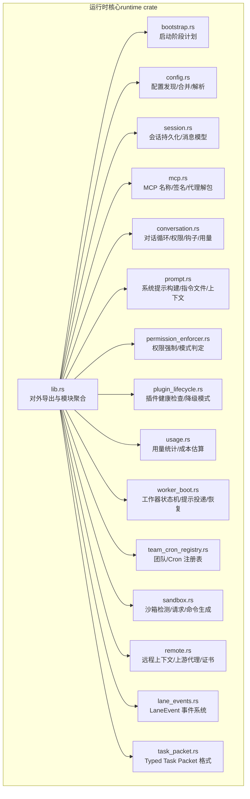

**图表来源**
- [lib.rs:1-180](file://rust/crates/runtime/src/lib.rs#L1-L180)
- [bootstrap.rs:1-112](file://rust/crates/runtime/src/bootstrap.rs#L1-L112)
- [config.rs:1-200](file://rust/crates/runtime/src/config.rs#L1-L200)
- [session.rs:1-120](file://rust/crates/runtime/src/session.rs#L1-L120)
- [mcp.rs:1-120](file://rust/crates/runtime/src/mcp.rs#L1-L120)
- [conversation.rs:1-120](file://rust/crates/runtime/src/conversation.rs#L1-L120)
- [prompt.rs:1-120](file://rust/crates/runtime/src/prompt.rs#L1-L120)
- [permission_enforcer.rs:1-120](file://rust/crates/runtime/src/permission_enforcer.rs#L1-L120)
- [plugin_lifecycle.rs:1-120](file://rust/crates/runtime/src/plugin_lifecycle.rs#L1-L120)
- [usage.rs:1-120](file://rust/crates/runtime/src/usage.rs#L1-L120)
- [worker_boot.rs:1-120](file://rust/crates/runtime/src/worker_boot.rs#L1-L120)
- [team_cron_registry.rs:1-120](file://rust/crates/runtime/src/team_cron_registry.rs#L1-L120)
- [sandbox.rs:1-120](file://rust/crates/runtime/src/sandbox.rs#L1-L120)
- [remote.rs:1-120](file://rust/crates/runtime/src/remote.rs#L1-L120)
- [lane_events.rs:1-800](file://rust/crates/runtime/src/lane_events.rs#L1-L800)
- [task_packet.rs:1-214](file://rust/crates/runtime/src/task_packet.rs#L1-L214)

**章节来源**
- [lib.rs:1-180](file://rust/crates/runtime/src/lib.rs#L1-L180)

## 核心组件
- 启动阶段与计划：定义启动阶段顺序，确保按序完成版本探测、系统提示快速路径、MCP/守护进程/桥接等初始化。
- 配置系统：多源配置发现与合并，支持用户/项目/本地层级，解析为运行时特性视图（hooks、plugins、mcp、oauth、sandbox 等），并提供错误诊断。
- 会话运行时：统一的消息模型、持久化策略（JSON/JSONL）、自动压缩、fork 与工作区绑定，支持增量写入与轮转。
- 对话循环：封装模型请求流式事件、工具执行、权限评估、钩子调用、用量统计与自动压缩阈值。
- 提示工程：系统提示构建器，动态边界注入，项目上下文（Git 状态/差异/最近提交）、指令文件去重与截断、渲染配置节。
- 权限与安全：基于模式的权限强制，文件写入边界检查，bash 命令只读启发式，交互提示模式下的延迟决策。
- MCP 生命周期：MCP 工具命名规范化、签名计算、代理 URL 解包、服务器健康检查与降级模式暴露。
- 插件生命周期：插件健康检查、可用/失败服务器聚合、降级模式下可用/不可用工具集合、事件与状态机。
- 用量与成本：Token 计数、累计用量、成本估算（默认/模型特定定价）、摘要行输出。
- 工作器状态机：信任门禁检测、就绪/运行/失败状态转换、提示误投递检测与自动重播、事件快照文件。
- 团队与定时任务：团队注册表、Cron 注册表（启用/禁用/计数/时间戳）。
- 沙箱隔离：容器环境检测、请求解析、Linux unshare 命令生成、挂载规范化与回退原因。
- 远程代理：远程会话上下文、上游代理开关与证书、WS URL 推导、子进程环境继承。
- **LaneEvent 事件系统**：完整的事件生命周期管理，包括事件名称、状态、失败分类、元数据、构建器和去重机制。
- **Typed Task Packet**：强类型的任务包格式，提供结构化的工作范围定义、验证逻辑和错误处理。
- **启动失败证据收集**：详细的启动失败诊断系统，支持多种故障分类和证据收集。

**章节来源**
- [bootstrap.rs:1-112](file://rust/crates/runtime/src/bootstrap.rs#L1-L112)
- [config.rs:1-200](file://rust/crates/runtime/src/config.rs#L1-L200)
- [session.rs:1-120](file://rust/crates/runtime/src/session.rs#L1-L120)
- [conversation.rs:1-120](file://rust/crates/runtime/src/conversation.rs#L1-L120)
- [prompt.rs:1-120](file://rust/crates/runtime/src/prompt.rs#L1-L120)
- [permission_enforcer.rs:1-120](file://rust/crates/runtime/src/permission_enforcer.rs#L1-L120)
- [mcp.rs:1-120](file://rust/crates/runtime/src/mcp.rs#L1-L120)
- [plugin_lifecycle.rs:1-120](file://rust/crates/runtime/src/plugin_lifecycle.rs#L1-L120)
- [usage.rs:1-120](file://rust/crates/runtime/src/usage.rs#L1-L120)
- [worker_boot.rs:1-120](file://rust/crates/runtime/src/worker_boot.rs#L1-L120)
- [team_cron_registry.rs:1-120](file://rust/crates/runtime/src/team_cron_registry.rs#L1-L120)
- [sandbox.rs:1-120](file://rust/crates/runtime/src/sandbox.rs#L1-L120)
- [remote.rs:1-120](file://rust/crates/runtime/src/remote.rs#L1-L120)
- [lane_events.rs:1-800](file://rust/crates/runtime/src/lane_events.rs#L1-L800)
- [task_packet.rs:1-214](file://rust/crates/runtime/src/task_packet.rs#L1-L214)

## 架构总览
运行时核心通过"配置—会话—对话—工具/插件/MCP"的主干流程驱动交互与一次性任务；权限与安全贯穿工具执行；用量与成本在会话中累积；工作器状态机保障提示投递可靠性；沙箱与远程代理提供隔离与网络控制；团队/Cron 注册表支撑编排与自动化；**LaneEvent 事件系统提供完整的事件生命周期管理**；**Typed Task Packet 确保任务数据的结构化和验证**；**启动失败证据收集系统提供详细的故障诊断能力**。

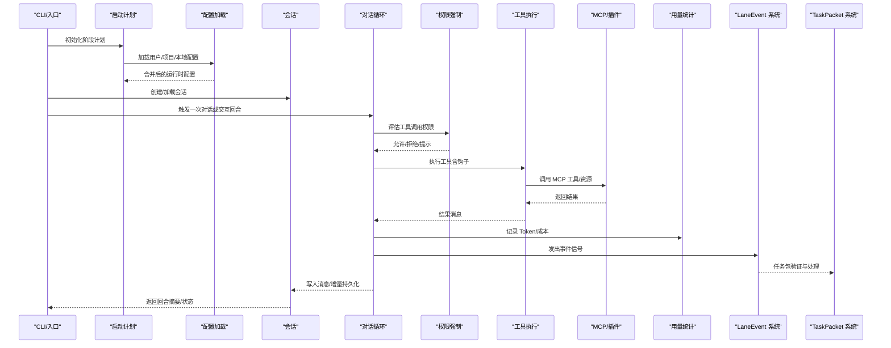

**图表来源**
- [bootstrap.rs:1-112](file://rust/crates/runtime/src/bootstrap.rs#L1-L112)
- [config.rs:213-326](file://rust/crates/runtime/src/config.rs#L213-L326)
- [session.rs:204-227](file://rust/crates/runtime/src/session.rs#L204-L227)
- [conversation.rs:314-515](file://rust/crates/runtime/src/conversation.rs#L314-L515)
- [permission_enforcer.rs:39-100](file://rust/crates/runtime/src/permission_enforcer.rs#L39-L100)
- [usage.rs:168-215](file://rust/crates/runtime/src/usage.rs#L168-L215)
- [lane_events.rs:1-800](file://rust/crates/runtime/src/lane_events.rs#L1-L800)
- [task_packet.rs:1-214](file://rust/crates/runtime/src/task_packet.rs#L1-L214)

## 详细组件分析

### 启动阶段与初始化流程
- 启动阶段顺序确保关键子系统按序就绪：版本探测、系统提示快速路径、MCP/守护进程/桥接、后台会话、模板与环境运行器等。
- 通过阶段去重保证顺序且不重复执行。

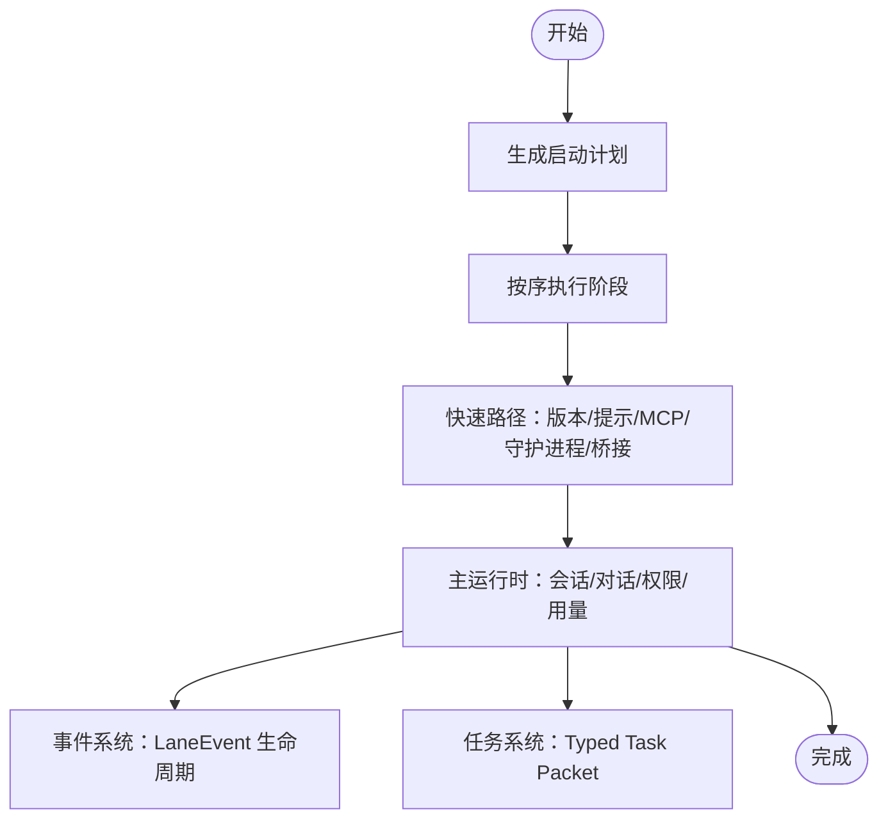

**图表来源**
- [bootstrap.rs:18-56](file://rust/crates/runtime/src/bootstrap.rs#L18-L56)

**章节来源**
- [bootstrap.rs:1-112](file://rust/crates/runtime/src/bootstrap.rs#L1-L112)

### 配置管理与层次结构
- 配置来源与优先级：用户级、项目级、本地级；支持 legacy 与新格式，空文件与缺失文件处理。
- 合并与解析：深度合并对象，解析 hooks/plugins/oauth/sandbox/mcp 等特性视图，提供诊断警告与错误。
- 环境变量与默认值覆盖：通过环境映射读取远程上下文、上游代理、CA 证书等，提供默认值与回退路径。
- 默认配置目录：优先 CLAW_CONFIG_HOME，否则 HOME 下 .claw，最后当前目录 .claw。

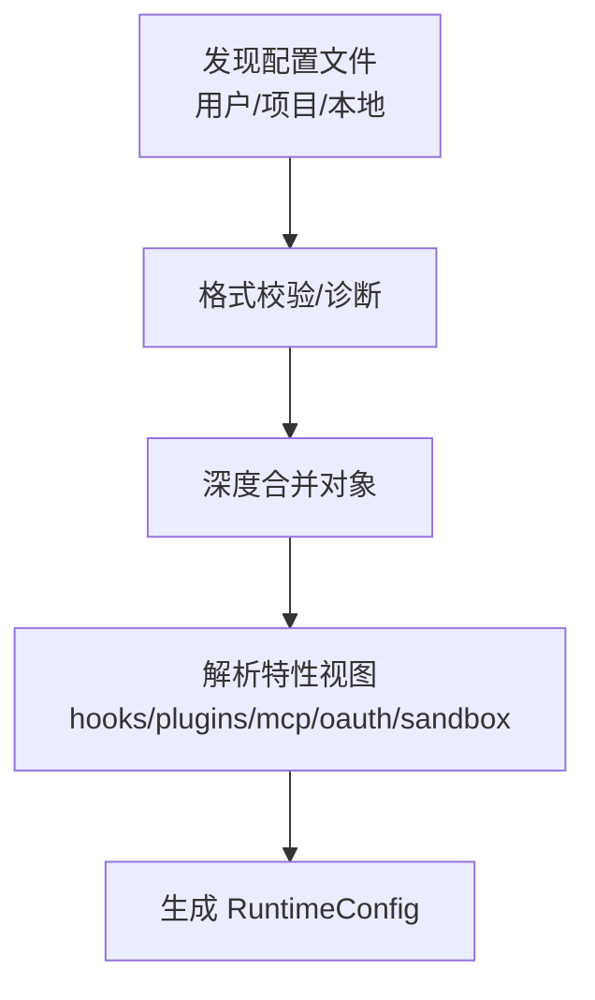

**图表来源**
- [config.rs:213-326](file://rust/crates/runtime/src/config.rs#L213-L326)
- [remote.rs:66-147](file://rust/crates/runtime/src/remote.rs#L66-L147)

**章节来源**
- [config.rs:1-200](file://rust/crates/runtime/src/config.rs#L1-L200)
- [config.rs:213-326](file://rust/crates/runtime/src/config.rs#L213-L326)
- [remote.rs:1-120](file://rust/crates/runtime/src/remote.rs#L1-L120)
- [remote.rs:185-251](file://rust/crates/runtime/src/remote.rs#L185-L251)

### 会话运行时与持久化
- 消息模型：角色、文本/工具调用/工具结果块，支持 Token 使用元数据。
- 持久化：JSON/JSONL 双格式，增量追加写入，文件轮转与清理，工作区根绑定避免跨实例竞态。
- 自动压缩：基于阈值估计 token 数量，压缩历史消息并记录摘要。
- Fork：从父会话派生分支，保留必要元信息。

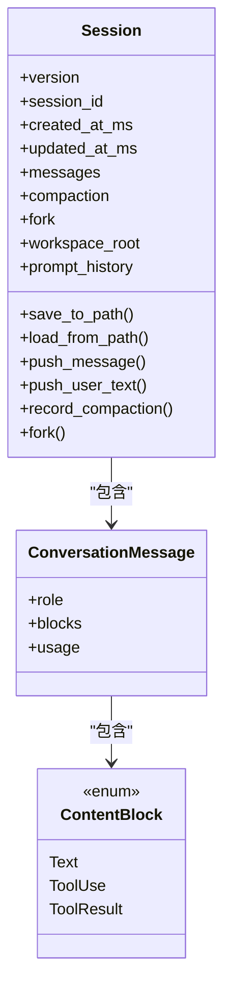

**图表来源**
- [session.rs:90-120](file://rust/crates/runtime/src/session.rs#L90-L120)
- [session.rs:47-75](file://rust/crates/runtime/src/session.rs#L47-L75)
- [session.rs:281-403](file://rust/crates/runtime/src/session.rs#L281-L403)

**章节来源**
- [session.rs:1-200](file://rust/crates/runtime/src/session.rs#L1-L200)
- [session.rs:204-227](file://rust/crates/runtime/src/session.rs#L204-L227)
- [session.rs:405-504](file://rust/crates/runtime/src/session.rs#L405-L504)

### 对话循环与权限控制
- 对话循环：组装 ApiRequest，消费流式事件，构建助手消息，识别工具调用，执行工具前/后钩子，权限评估，记录用量与提示缓存事件。
- 权限强制：根据 Active Mode 与 Required Mode 判定，文件写入边界检查，bash 只读启发式，Prompt 模式下延迟决策。
- 自动压缩：基于输入 Token 阈值触发，压缩后更新会话并返回事件。

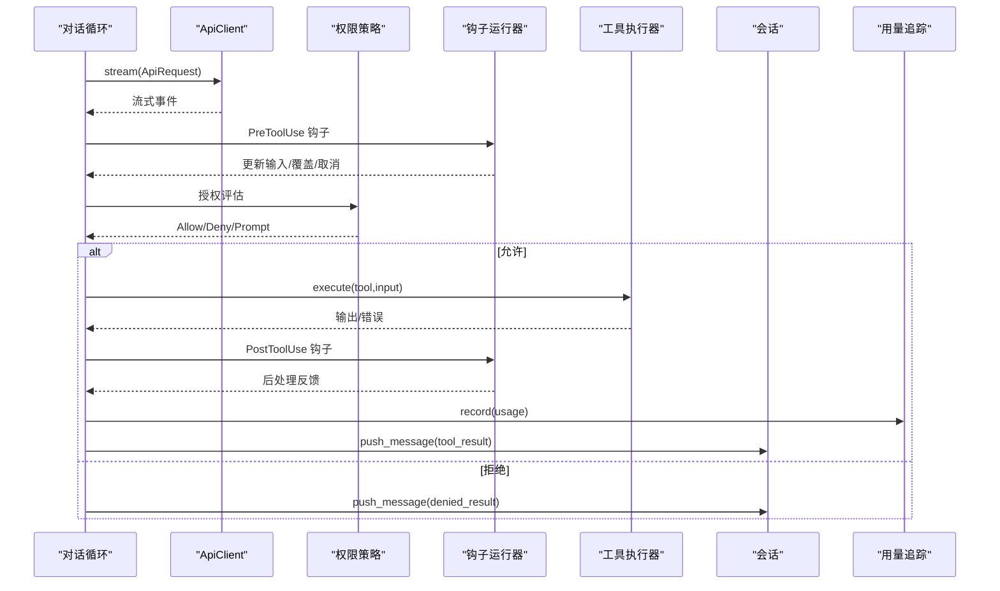

**图表来源**
- [conversation.rs:126-189](file://rust/crates/runtime/src/conversation.rs#L126-L189)
- [conversation.rs:314-515](file://rust/crates/runtime/src/conversation.rs#L314-L515)
- [permission_enforcer.rs:39-100](file://rust/crates/runtime/src/permission_enforcer.rs#L39-L100)

**章节来源**
- [conversation.rs:1-200](file://rust/crates/runtime/src/conversation.rs#L1-L200)
- [permission_enforcer.rs:1-120](file://rust/crates/runtime/src/permission_enforcer.rs#L1-L120)

### 提示工程与系统提示构建
- 动态边界：静态提示与动态上下文分隔标记，确保模型可区分静态规则与动态环境。
- 项目上下文：日期、Git 状态/差异、最近提交、指令文件（去重、截断、渲染）。
- 渲染配置节：列出已加载配置来源与最终合并 JSON。
- OS/输出样式：可选输出风格名称与提示注入。

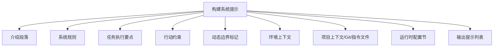

**图表来源**
- [prompt.rs:94-195](file://rust/crates/runtime/src/prompt.rs#L94-L195)
- [prompt.rs:431-446](file://rust/crates/runtime/src/prompt.rs#L431-L446)

**章节来源**
- [prompt.rs:1-120](file://rust/crates/runtime/src/prompt.rs#L1-L120)
- [prompt.rs:197-328](file://rust/crates/runtime/src/prompt.rs#L197-L328)
- [prompt.rs:431-446](file://rust/crates/runtime/src/prompt.rs#L431-L446)

### MCP 生命周期与工具桥接
- 命名与工具前缀：规范化名称、生成工具前缀与工具名。
- 服务器签名：stdio/url 等不同传输的稳定签名，用于配置变更检测。
- 代理 URL 解包：从 CCR 代理路径中提取真实 MCP 地址。
- 服务器健康检查：聚合健康/降级/失败状态，暴露可用/不可用工具集合。

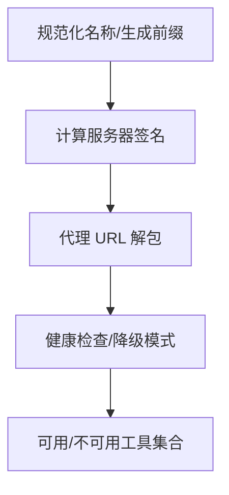

**图表来源**
- [mcp.rs:7-37](file://rust/crates/runtime/src/mcp.rs#L7-L37)
- [mcp.rs:65-121](file://rust/crates/runtime/src/mcp.rs#L65-L121)
- [mcp.rs:40-62](file://rust/crates/runtime/src/mcp.rs#L40-L62)
- [plugin_lifecycle.rs:65-98](file://rust/crates/runtime/src/plugin_lifecycle.rs#L65-L98)

**章节来源**
- [mcp.rs:1-120](file://rust/crates/runtime/src/mcp.rs#L1-L120)
- [plugin_lifecycle.rs:1-120](file://rust/crates/runtime/src/plugin_lifecycle.rs#L1-L120)

### 插件生命周期与降级模式
- 状态机：未配置/验证/启动健康/启动降级/启动失败/关闭中/停止。
- 健康检查：聚合服务器健康状态，生成降级模式描述（可用/不可用工具列表与原因）。
- 事件：配置验证、启动健康/降级/失败、关闭。

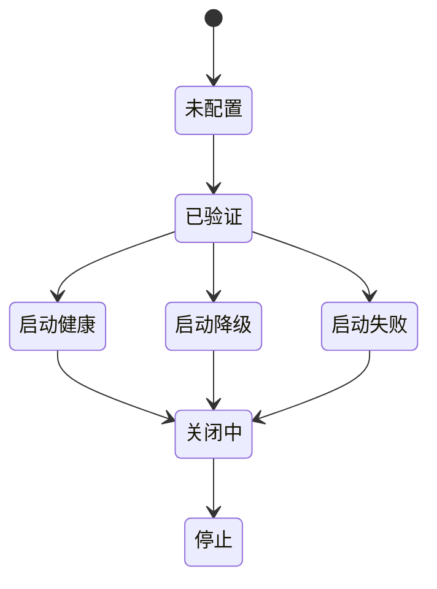

**图表来源**
- [plugin_lifecycle.rs:47-61](file://rust/crates/runtime/src/plugin_lifecycle.rs#L47-L61)
- [plugin_lifecycle.rs:137-161](file://rust/crates/runtime/src/plugin_lifecycle.rs#L137-L161)

**章节来源**
- [plugin_lifecycle.rs:1-120](file://rust/crates/runtime/src/plugin_lifecycle.rs#L1-L120)

### 用量统计与成本估算
- TokenUsage：输入/输出/缓存写/缓存读计数。
- UsageTracker：回合内/累计用量、回合数统计。
- 成本估算：默认/模型特定定价，汇总行输出。

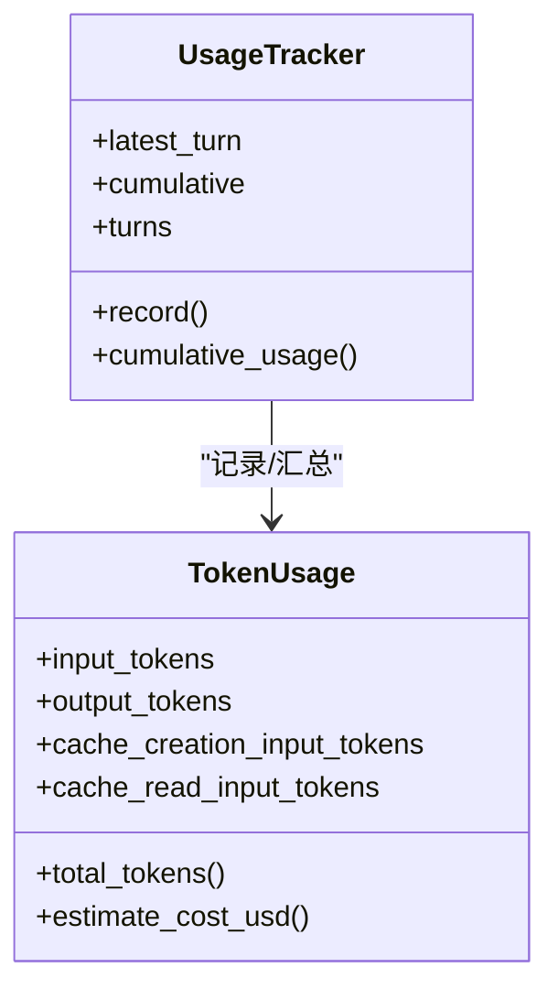

**图表来源**
- [usage.rs:30-90](file://rust/crates/runtime/src/usage.rs#L30-L90)
- [usage.rs:168-215](file://rust/crates/runtime/src/usage.rs#L168-L215)

**章节来源**
- [usage.rs:1-120](file://rust/crates/runtime/src/usage.rs#L1-L120)
- [usage.rs:168-215](file://rust/crates/runtime/src/usage.rs#L168-L215)

### 工作器状态机与提示投递
- 状态：Spawn/TrustRequired/ReadyForPrompt/Running/Finished/Failed。
- 事件：Spawn/TrustRequired/TrustResolved/ReadyForPrompt/PromptMisdelivery/PromptReplayArmed/Running/Restarted/Finished/Failed。
- 观察：信任提示检测、就绪提示检测、运行迹象检测、提示误投递检测（目标/工作目录/任务收据）。
- 快照：事件快照文件，供外部观察者轮询。
- **启动失败证据收集**：详细的启动失败诊断系统，支持多种故障分类和证据收集。

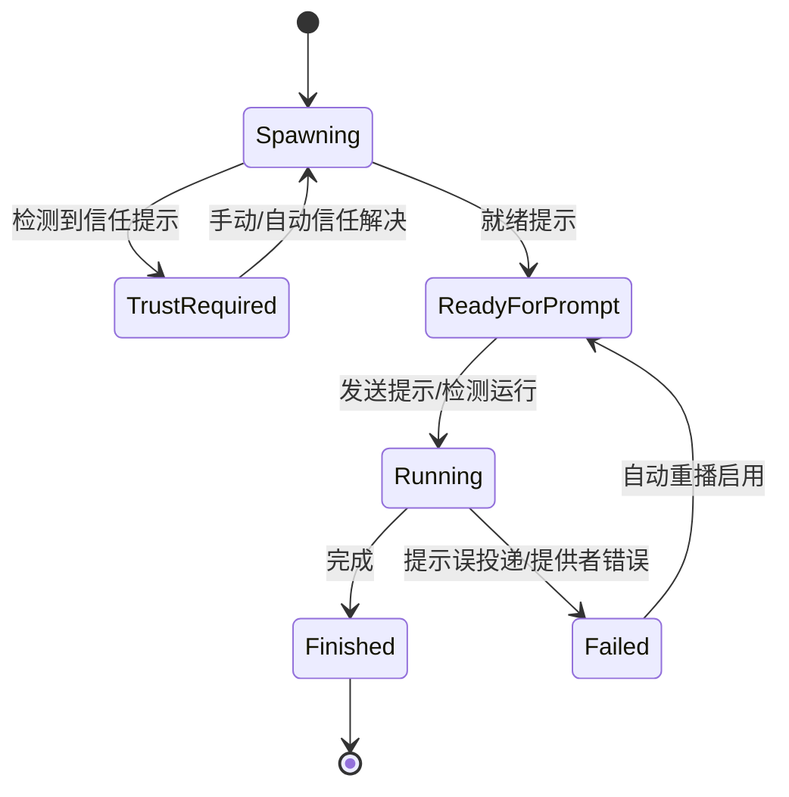

**图表来源**
- [worker_boot.rs:28-50](file://rust/crates/runtime/src/worker_boot.rs#L28-L50)
- [worker_boot.rs:131-158](file://rust/crates/runtime/src/worker_boot.rs#L131-L158)
- [worker_boot.rs:225-371](file://rust/crates/runtime/src/worker_boot.rs#L225-L371)

**章节来源**
- [worker_boot.rs:1-200](file://rust/crates/runtime/src/worker_boot.rs#L1-L200)
- [worker_boot.rs:565-650](file://rust/crates/runtime/src/worker_boot.rs#L565-L650)

### 团队与定时任务注册表
- Team：创建/查询/列表/删除（软删除）、状态枚举。
- Cron：创建/查询/列表（启用过滤）/删除/禁用/记录运行次数与时间戳。

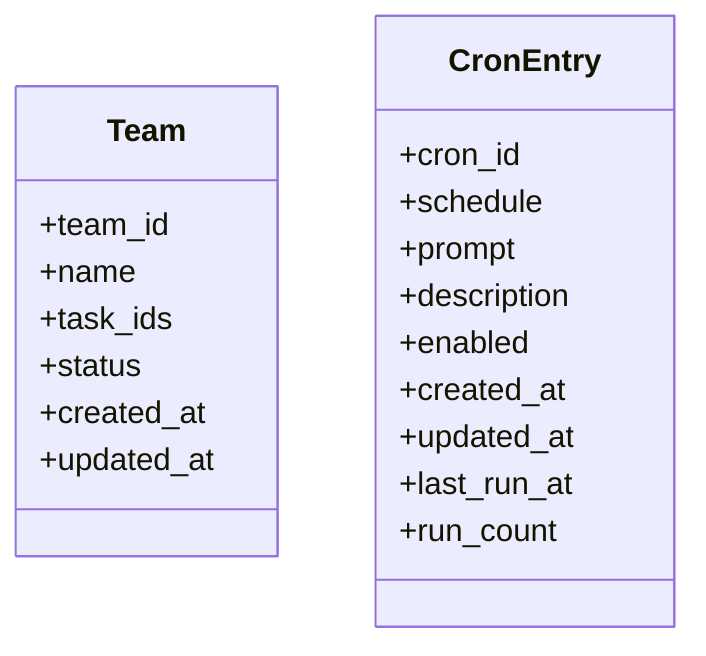

**图表来源**
- [team_cron_registry.rs:20-48](file://rust/crates/runtime/src/team_cron_registry.rs#L20-L48)
- [team_cron_registry.rs:122-133](file://rust/crates/runtime/src/team_cron_registry.rs#L122-L133)

**章节来源**
- [team_cron_registry.rs:1-120](file://rust/crates/runtime/src/team_cron_registry.rs#L1-L120)

### 沙箱隔离与容器环境检测
- 容器检测：/proc/1/cgroup、/.dockerenv、/run/.containerenv、环境变量标记。
- 请求解析：启用/命名空间隔离/网络隔离/文件系统模式/允许挂载。
- Linux 命令生成：unshare 用户命名空间、IPC/PID/UTS、可选网络隔离、环境变量注入。
- 回退原因：当请求的功能在当前系统不可用时给出明确原因。

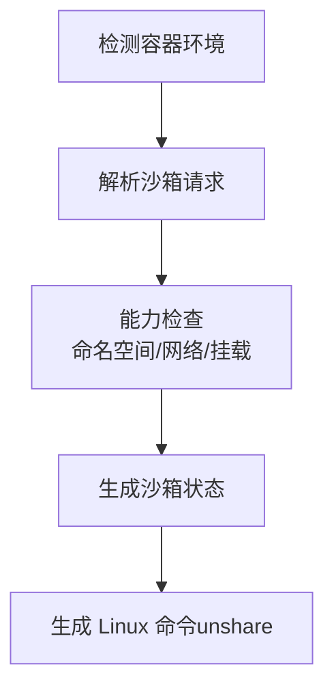

**图表来源**
- [sandbox.rs:109-159](file://rust/crates/runtime/src/sandbox.rs#L109-L159)
- [sandbox.rs:162-208](file://rust/crates/runtime/src/sandbox.rs#L162-L208)
- [sandbox.rs:211-262](file://rust/crates/runtime/src/sandbox.rs#L211-L262)

**章节来源**
- [sandbox.rs:1-120](file://rust/crates/runtime/src/sandbox.rs#L1-L120)
- [sandbox.rs:155-208](file://rust/crates/runtime/src/sandbox.rs#L155-L208)

### 远程代理与上游连接
- 远程上下文：从环境变量读取启用标志、会话 ID、基础 URL。
- 上游代理引导：令牌读取、CA 证书路径、WS URL 推导、端口对应代理状态。
- 子进程环境：HTTPS_PROXY/NO_PROXY/SSL_CERT_FILE 等键值注入。
- 继承代理：要求 HTTPS_PROXY 与 SSL_CERT_FILE 同时存在才继承。

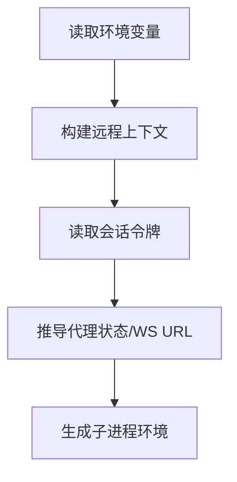

**图表来源**
- [remote.rs:66-147](file://rust/crates/runtime/src/remote.rs#L66-L147)
- [remote.rs:149-183](file://rust/crates/runtime/src/remote.rs#L149-L183)
- [remote.rs:221-235](file://rust/crates/runtime/src/remote.rs#L221-L235)

**章节来源**
- [remote.rs:1-120](file://rust/crates/runtime/src/remote.rs#L1-L120)
- [remote.rs:185-251](file://rust/crates/runtime/src/remote.rs#L185-L251)

### **LaneEvent 事件系统扩展**
- **事件名称与状态**：完整的事件生命周期，包括 Started、Ready、Blocked、Finished、Failed 等状态。
- **失败分类**：详细的故障分类体系，涵盖提示投递、信任门禁、分支分歧、编译、测试、插件启动、MCP 启动、网关路由、工具运行时、工作区不匹配、基础设施等。
- **元数据管理**：事件序列号、来源证明、会话身份、所有权绑定、nudge ID、事件指纹、时间戳等。
- **构建器模式**：LaneEventBuilder 提供链式构建接口，支持完整元数据配置。
- **去重机制**：终端事件指纹计算和去重，确保事件流中的重复事件被正确处理。

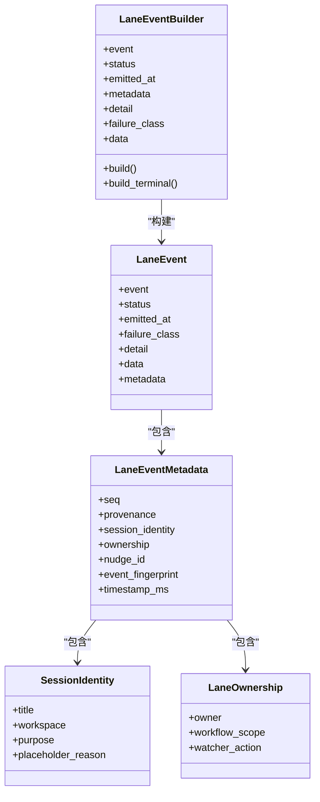

**图表来源**
- [lane_events.rs:408-421](file://rust/crates/runtime/src/lane_events.rs#L408-L421)
- [lane_events.rs:232-328](file://rust/crates/runtime/src/lane_events.rs#L232-L328)
- [lane_events.rs:162-230](file://rust/crates/runtime/src/lane_events.rs#L162-L230)
- [lane_events.rs:92-137](file://rust/crates/runtime/src/lane_events.rs#L92-L137)
- [lane_events.rs:139-160](file://rust/crates/runtime/src/lane_events.rs#L139-L160)

**章节来源**
- [lane_events.rs:1-800](file://rust/crates/runtime/src/lane_events.rs#L1-L800)

### **Typed Task Packet 格式实现**
- **工作范围定义**：支持 Workspace、Module、SingleFile、Custom 四种粒度级别。
- **结构化数据**：包含目标、范围、范围路径、仓库、工作树、分支策略、验收测试、提交策略、报告契约、升级策略等字段。
- **验证机制**：完整的字段验证，包括必需字段检查、范围特定要求验证、空值检查等。
- **错误处理**：TaskPacketValidationError 提供详细的错误信息收集和展示。

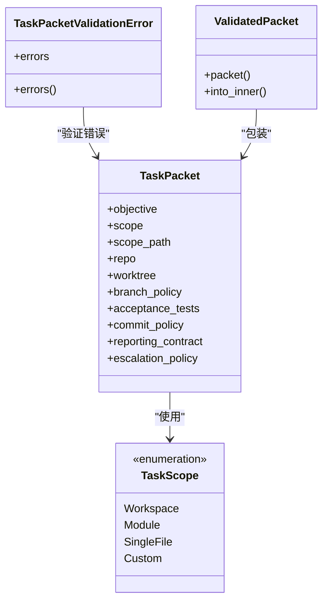

**图表来源**
- [task_packet.rs:29-45](file://rust/crates/runtime/src/task_packet.rs#L29-L45)
- [task_packet.rs:47-85](file://rust/crates/runtime/src/task_packet.rs#L47-L85)
- [task_packet.rs:4-16](file://rust/crates/runtime/src/task_packet.rs#L4-L16)

**章节来源**
- [task_packet.rs:1-214](file://rust/crates/runtime/src/task_packet.rs#L1-L214)

### **启动失败证据收集系统**
- **证据收集**：StartupEvidenceBundle 收集启动超时前的关键状态信息，包括最后生命周期状态、面板命令、提示发送时间、接受状态、信任提示检测、传输健康、MCP 健康、经过时间等。
- **故障分类**：StartupFailureClassification 提供六种故障类型：TrustRequired、PromptMisdelivery、PromptAcceptanceTimeout、TransportDead、WorkerCrashed、Unknown。
- **智能分类**：classify_startup_failure 函数根据证据自动分类，优先检查传输死亡，然后是信任提示、提示接受超时、误投递等情况。
- **事件记录**：WorkerEventPayload.StartupNoEvidence 包含证据和分类结果，便于后续分析和诊断。

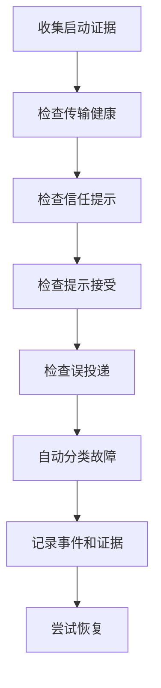

**图表来源**
- [worker_boot.rs:119-139](file://rust/crates/runtime/src/worker_boot.rs#L119-L139)
- [worker_boot.rs:101-117](file://rust/crates/runtime/src/worker_boot.rs#L101-L117)
- [worker_boot.rs:682-707](file://rust/crates/runtime/src/worker_boot.rs#L682-L707)

**章节来源**
- [worker_boot.rs:1-200](file://rust/crates/runtime/src/worker_boot.rs#L1-L200)
- [worker_boot.rs:682-707](file://rust/crates/runtime/src/worker_boot.rs#L682-L707)

## 依赖关系分析
- 模块耦合：lib.rs 作为聚合出口，其他模块相对独立但共享核心类型（如 JsonValue、TokenUsage、RuntimeConfig 等）。
- 外部依赖：JSON 解析、Git 命令、系统环境变量、文件系统、网络（WS/HTTP）。
- 循环依赖：未见直接循环；各模块通过公共类型与 trait 边界进行协作。
- **新增依赖**：LaneEvent 系统与 TaskPacket 系统相互独立，但都服务于运行时的核心功能。

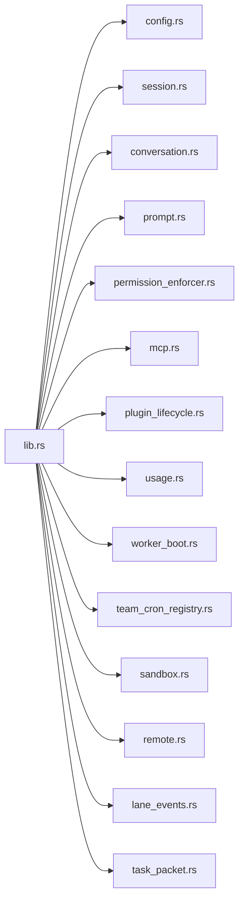

**图表来源**
- [lib.rs:1-180](file://rust/crates/runtime/src/lib.rs#L1-L180)

**章节来源**
- [lib.rs:1-180](file://rust/crates/runtime/src/lib.rs#L1-L180)

## 性能考虑
- 会话压缩：基于阈值估计 token 数量，减少上下文长度，降低延迟与成本。
- 自动压缩阈值：可通过环境变量调整，平衡性能与上下文保留。
- 用量统计：仅在需要时记录，避免频繁序列化开销。
- 文件轮转：限制单文件大小与保留数量，防止磁盘膨胀。
- 沙箱命令：仅在 Linux 且满足能力时启用，避免不必要的系统调用。
- 远程代理：按需启用，避免无效网络握手与证书链加载。
- **事件系统性能**：LaneEvent 的指纹计算和去重机制需要考虑性能影响，建议在大量事件场景下进行优化。
- **任务包验证**：TaskPacket 的验证逻辑会在创建任务时执行，需要确保验证开销在可接受范围内。
- **启动失败诊断**：证据收集和分类过程可能增加启动时间，但提供了重要的故障诊断价值。

## 故障排除指南
- 配置加载失败：检查配置文件格式与字段合法性，关注诊断警告与错误；确认配置发现路径与权限。
- 会话持久化异常：确认持久化路径存在且可写，留意轮转与原子写入；检查 JSON/JSONL 格式一致性。
- 权限拒绝：核对 Active Mode 与 Required Mode，检查文件写入边界与 bash 命令只读启发式；Prompt 模式需交互确认。
- MCP 工具不可用：查看服务器健康状态与降级模式，确认签名与代理 URL 解包是否正确。
- 工作器提示误投递：启用自动重播，检查就绪提示检测与任务收据匹配；查看事件快照文件定位问题。
- 沙箱不可用：检查 unshare 能力与系统支持，确认挂载列表与回退原因；在容器内注意特权限制。
- 远程代理：确认令牌与会话 ID、基础 URL、CA 证书路径；检查代理环境变量继承条件。
- **LaneEvent 事件问题**：检查事件序列号递增、元数据完整性、指纹计算正确性；验证事件去重机制是否正常工作。
- **TaskPacket 验证失败**：根据 TaskPacketValidationError 错误信息逐一修复字段；确保范围路径与工作范围匹配。
- **启动失败诊断**：查看 StartupEvidenceBundle 中的详细证据信息，结合 StartupFailureClassification 进行针对性排查。

**章节来源**
- [config.rs:271-326](file://rust/crates/runtime/src/config.rs#L271-L326)
- [session.rs:204-227](file://rust/crates/runtime/src/session.rs#L204-L227)
- [permission_enforcer.rs:39-100](file://rust/crates/runtime/src/permission_enforcer.rs#L39-L100)
- [mcp.rs:65-121](file://rust/crates/runtime/src/mcp.rs#L65-L121)
- [worker_boot.rs:225-371](file://rust/crates/runtime/src/worker_boot.rs#L225-L371)
- [sandbox.rs:162-208](file://rust/crates/runtime/src/sandbox.rs#L162-L208)
- [remote.rs:185-251](file://rust/crates/runtime/src/remote.rs#L185-L251)
- [lane_events.rs:826-959](file://rust/crates/runtime/src/lane_events.rs#L826-L959)
- [task_packet.rs:87-143](file://rust/crates/runtime/src/task_packet.rs#L87-L143)
- [worker_boot.rs:682-707](file://rust/crates/runtime/src/worker_boot.rs#L682-L707)

## 结论
运行时核心以模块化设计实现从配置、会话、对话到工具/MCP/插件的全链路能力，结合权限与安全、用量与成本、工作器状态机、沙箱与远程代理，形成稳健的运行时基础设施。**本次更新显著增强了事件系统、任务管理和启动诊断能力**，通过合理的配置层次、可观测性与调试工具，可有效提升稳定性与可维护性。

**更新** 新增的 LaneEvent 事件系统提供了完整的事件生命周期管理，Typed Task Packet 确保了任务数据的结构化和验证，启动失败证据收集系统大大提升了故障诊断能力。

## 附录
- 监控与可观测性：会话 Tracer 记录回合事件；工作器事件快照文件；用量追踪器；沙箱状态文件；**LaneEvent 事件流**；**TaskPacket 验证日志**。
- 调试工具：配置诊断输出、提示渲染预览、会话快照、工作器事件回放；**事件指纹计算工具**；**任务包验证器**。
- 最佳实践：合理设置自动压缩阈值；严格控制权限模式；启用沙箱隔离；按需启用远程代理；定期清理轮转日志；**利用 LaneEvent 进行全面的系统监控**；**使用 TaskPacket 确保任务数据质量**；**基于启动失败证据进行预防性维护**。