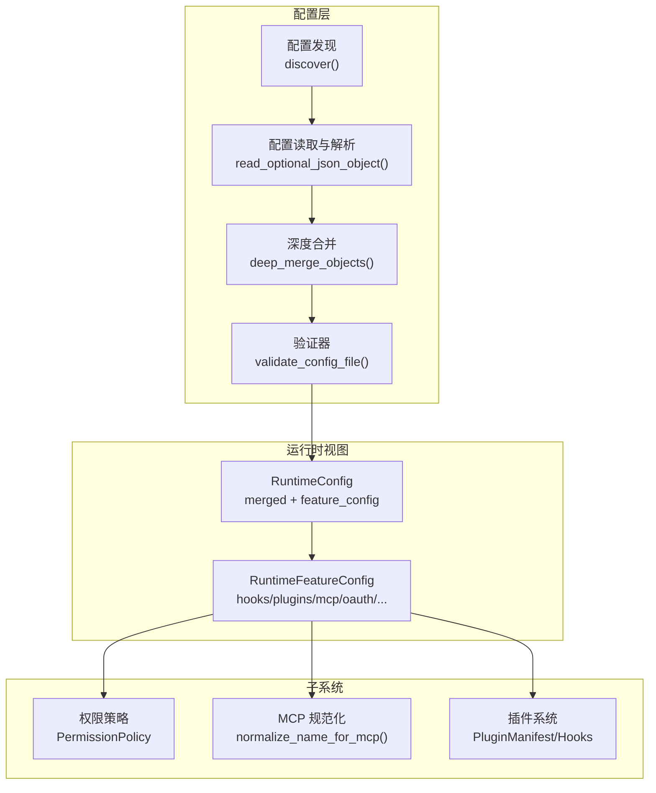
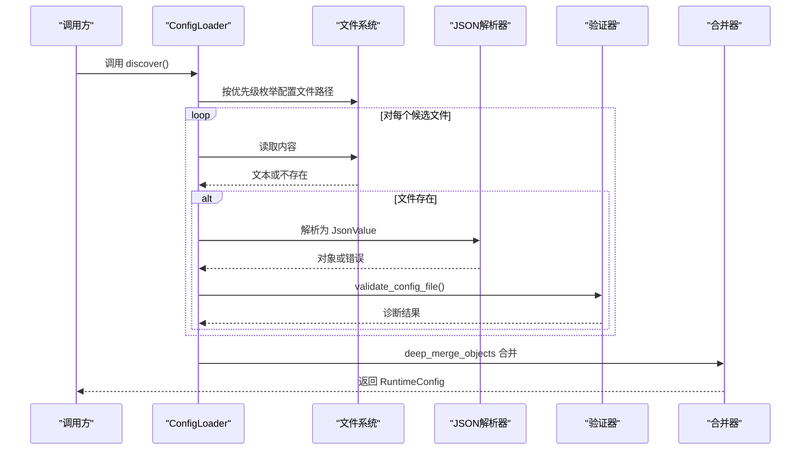
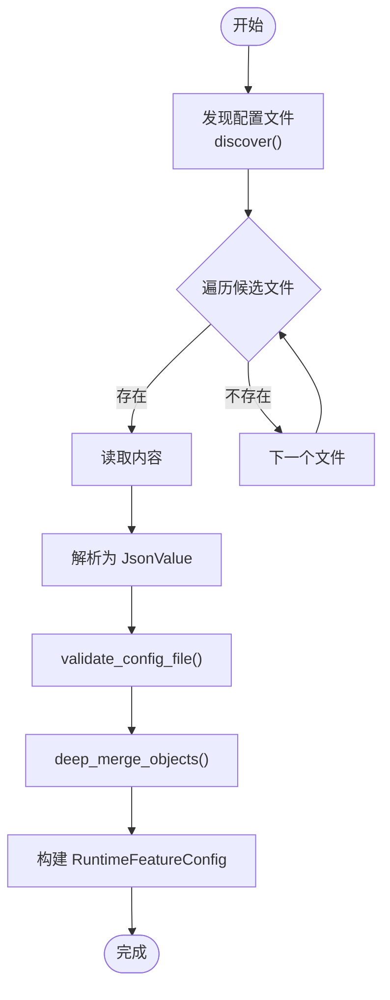
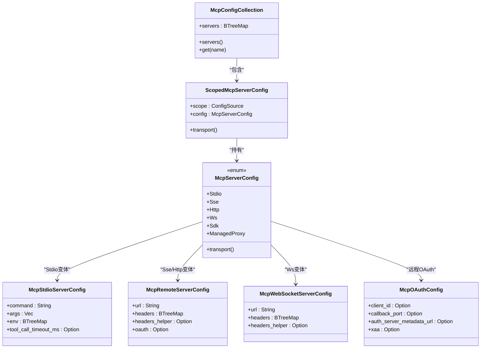
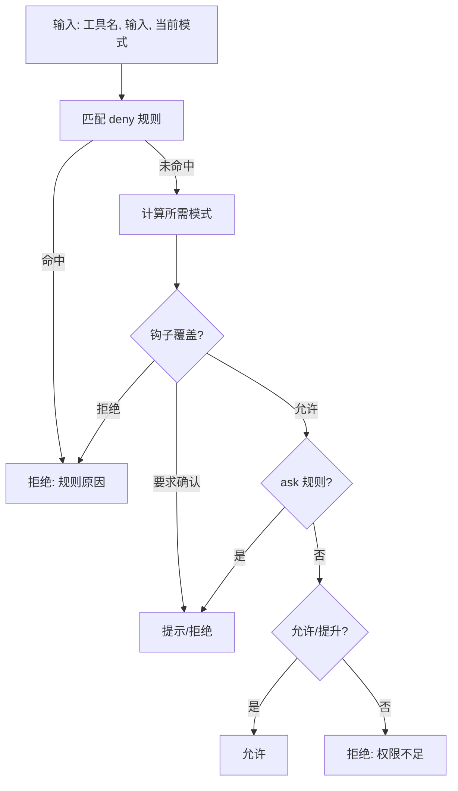
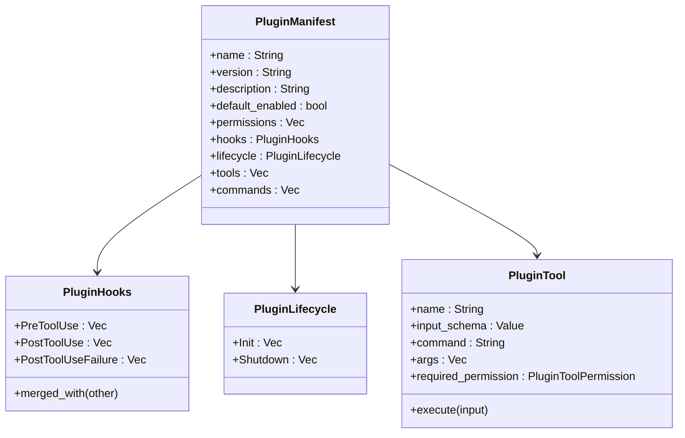
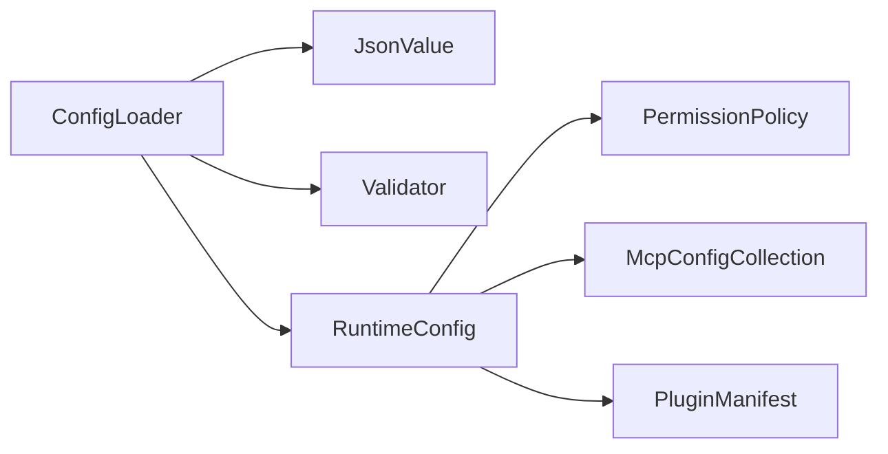

# 配置管理系统

<cite>
**本文引用的文件**
- [config.rs](file://rust/crates/runtime/src/config.rs)
- [config_validate.rs](file://rust/crates/runtime/src/config_validate.rs)
- [mcp.rs](file://rust/crates/runtime/src/mcp.rs)
- [permissions.rs](file://rust/crates/runtime/src/permissions.rs)
- [json.rs](file://rust/crates/runtime/src/json.rs)
- [lib.rs（插件）](file://rust/crates/plugins/src/lib.rs)
- [plugin.json（示例）](file://rust/crates/plugins/bundled/example-bundled/.claude-plugin/plugin.json)
- [plugin.json（示例2）](file://rust/crates/plugins/bundled/sample-hooks/.claude-plugin/plugin.json)
- [pre.sh（示例钩子）](file://rust/crates/plugins/bundled/sample-hooks/hooks/pre.sh)
- [post.sh（示例钩子）](file://rust/crates/plugins/bundled/sample-hooks/hooks/post.sh)
- [anthropic.rs（环境变量使用示例）](file://rust/crates/api/src/providers/anthropic.rs)
- [lib.rs（命令行工具）](file://rust/crates/commands/src/lib.rs)
</cite>

## 目录
1. [简介](#简介)
2. [项目结构](#项目结构)
3. [核心组件](#核心组件)
4. [架构总览](#架构总览)
5. [详细组件分析](#详细组件分析)
6. [依赖关系分析](#依赖关系分析)
7. [性能考量](#性能考量)
8. [故障诊断与修复指南](#故障诊断与修复指南)
9. [结论](#结论)
10. [附录](#附录)

## 简介
本文件系统化阐述配置管理系统的层次结构、加载机制与验证流程，覆盖运行时配置、MCP 配置、权限配置与插件配置的组织方式，并说明环境变量处理、默认值覆盖与配置优先级规则。同时提供配置文件示例、错误诊断与修复指南，解释配置热重载、配置迁移与版本兼容性处理，以及最佳实践、性能优化与安全考虑。

## 项目结构
配置系统主要由以下模块构成：
- 运行时配置加载与合并：负责发现、读取、解析与合并多源配置文件，生成统一的运行时视图。
- 配置验证：基于已知字段与类型进行校验，输出诊断信息。
- 权限策略：根据配置规则与运行时上下文评估工具调用权限。
- MCP 配置：解析与归一化不同传输类型的 MCP 服务器配置。
- 插件配置：解析插件清单与生命周期钩子，支持内置、打包与外部插件。
- JSON 解析器：自定义轻量 JSON 值模型与解析器，用于配置解析与渲染。

图表来源
- [config.rs:242-326](file://rust/crates/runtime/src/config.rs#L242-L326)
- [config_validate.rs:436-506](file://rust/crates/runtime/src/config_validate.rs#L436-L506)
- [permissions.rs:97-333](file://rust/crates/runtime/src/permissions.rs#L97-L333)
- [mcp.rs:7-81](file://rust/crates/runtime/src/mcp.rs#L7-L81)
- [lib.rs（插件）:116-132](file://rust/crates/plugins/src/lib.rs#L116-L132)

章节来源
- [config.rs:242-326](file://rust/crates/runtime/src/config.rs#L242-L326)
- [config_validate.rs:143-200](file://rust/crates/runtime/src/config_validate.rs#L143-L200)

## 核心组件
- 配置源与优先级
  - 用户级：$HOME/.claw 或 CLAW_CONFIG_HOME 下的 settings.json；兼容旧版 .claw.json。
  - 项目级：工作目录下的 .claw.json 与 .claw/settings.json。
  - 本地级：工作目录下的 .claw/settings.local.json。
  - 优先级：用户级 < 项目级 < 本地级；同名键按上述顺序后写覆盖。
- 运行时配置对象
  - RuntimeConfig：保存合并后的键值映射与已加载条目列表，以及按功能拆分的视图（hooks、plugins、mcp、oauth、sandbox 等）。
  - RuntimeFeatureConfig：面向各子系统的结构化配置视图。
- 验证器
  - 已知键与类型检查，未知键提示与建议，弃用键警告，嵌套对象校验。
- JSON 解析器
  - 自定义 JsonValue 枚举与解析器，支持字符串、布尔、数字、数组、对象等类型，提供渲染与解析能力。

章节来源
- [config.rs:12-41](file://rust/crates/runtime/src/config.rs#L12-L41)
- [config.rs:242-326](file://rust/crates/runtime/src/config.rs#L242-L326)
- [config_validate.rs:86-200](file://rust/crates/runtime/src/config_validate.rs#L86-L200)
- [json.rs:4-113](file://rust/crates/runtime/src/json.rs#L4-L113)

## 架构总览
配置系统采用“发现-读取-验证-合并-视图”的流水线式设计。配置发现按优先级顺序扫描多个位置；读取阶段解析为 JsonValue 并进行基础校验；验证阶段执行已知键与类型检查；合并阶段将多源配置深度合并；最终生成统一的运行时视图供各子系统消费。

图表来源
- [config.rs:242-326](file://rust/crates/runtime/src/config.rs#L242-L326)
- [config_validate.rs:436-506](file://rust/crates/runtime/src/config_validate.rs#L436-L506)
- [json.rs:63-72](file://rust/crates/runtime/src/json.rs#L63-L72)

## 详细组件分析

### 配置发现与加载
- 发现顺序
  - 兼容旧版用户级 .claw.json
  - 新版用户级 settings.json
  - 项目级 .claw.json
  - 项目级 .claw/settings.json
  - 本地级 .claw/settings.local.json
- 加载与解析
  - 忽略不存在的文件；空文件视为有效但无内容；非对象顶层报错。
  - 支持弃用格式（如 TOML）直接拒绝。
- 合并与视图
  - 深度合并所有对象键；保留加载条目列表以便审计。
  - 提取 hooks、plugins、mcp、oauth、sandbox、providerFallbacks、trustedRoots 等功能视图。

图表来源
- [config.rs:242-326](file://rust/crates/runtime/src/config.rs#L242-L326)
- [config_validate.rs:436-506](file://rust/crates/runtime/src/config_validate.rs#L436-L506)

章节来源
- [config.rs:242-326](file://rust/crates/runtime/src/config.rs#L242-L326)
- [config_validate.rs:508-519](file://rust/crates/runtime/src/config_validate.rs#L508-L519)

### 配置验证与诊断
- 已知键与类型
  - 顶层键：$schema、model、hooks、permissions、permissionMode、mcpServers、oauth、enabledPlugins、plugins、sandbox、env、aliases、providerFallbacks、trustedRoots。
  - 嵌套键：hooks（PreToolUse、PostToolUse、PostToolUseFailure）、permissions（defaultMode、allow、deny、ask）、plugins（enabled、externalDirectories、installRoot、registryPath、bundledRoot、maxOutputTokens）、sandbox（enabled、namespaceRestrictions、networkIsolation、filesystemMode、allowedMounts）、oauth（clientId、authorizeUrl、tokenUrl、callbackPort、manualRedirectUrl、scopes）。
- 弃用键
  - permissionMode → permissions.defaultMode
  - enabledPlugins → plugins.enabled
- 诊断输出
  - 错误：未知键、类型不匹配；警告：弃用键。
  - 行号定位：通过在原始源中查找键位置实现。

章节来源
- [config_validate.rs:143-322](file://rust/crates/runtime/src/config_validate.rs#L143-L322)
- [config_validate.rs:436-506](file://rust/crates/runtime/src/config_validate.rs#L436-L506)
- [config_validate.rs:326-341](file://rust/crates/runtime/src/config_validate.rs#L326-L341)

### 运行时配置视图与功能拆分
- hooks：预/后置工具使用钩子命令列表，支持去重扩展。
- plugins：插件启用状态、外部目录、安装根、注册表路径、打包根、最大输出令牌数。
- mcp：MCP 服务器集合，按作用域（用户/项目/本地）归档，支持 Stdio、SSE、HTTP、WS、SDK、ManagedProxy 多种传输。
- oauth：主运行时 OAuth 客户端配置。
- sandbox：沙箱隔离模式配置。
- providerFallbacks：模型提供者回退链。
- trustedRoots：信任根列表。

章节来源
- [config.rs:54-68](file://rust/crates/runtime/src/config.rs#L54-L68)
- [config.rs:304-318](file://rust/crates/runtime/src/config.rs#L304-L318)
- [config.rs:635-645](file://rust/crates/runtime/src/config.rs#L635-L645)

### MCP 配置组织与规范化
- 作用域感知：每台 MCP 服务器记录其定义来源（用户/项目/本地），便于审计与覆盖。
- 传输抽象：统一 McpServerConfig 枚举，屏蔽底层差异。
- 名称规范化：将服务器与工具名称转换为稳定标识，适配工具前缀与代理 URL 解包。
- 签名与哈希：为服务器配置生成稳定签名，用于变更检测与缓存。

图表来源
- [config.rs:95-187](file://rust/crates/runtime/src/config.rs#L95-L187)
- [mcp.rs:64-121](file://rust/crates/runtime/src/mcp.rs#L64-L121)

章节来源
- [config.rs:95-187](file://rust/crates/runtime/src/config.rs#L95-L187)
- [mcp.rs:7-81](file://rust/crates/runtime/src/mcp.rs#L7-L81)

### 权限配置与策略
- 权限模式
  - 只读、工作区写入、危险全权限、提示、允许。
- 规则引擎
  - allow/deny/ask 三类规则，支持任意匹配、精确匹配与前缀匹配。
  - 工具级需求与当前模式比较，必要时触发交互确认。
- 上下文与钩子
  - 支持钩子覆盖（允许/拒绝/要求确认），并在授权决策中优先处理。

图表来源
- [permissions.rs:164-292](file://rust/crates/runtime/src/permissions.rs#L164-L292)

章节来源
- [permissions.rs:7-28](file://rust/crates/runtime/src/permissions.rs#L7-L28)
- [permissions.rs:97-333](file://rust/crates/runtime/src/permissions.rs#L97-L333)

### 插件配置与生命周期
- 清单与元数据
  - 插件清单包含名称、版本、描述、默认启用、权限、钩子、生命周期、工具与命令等。
- 生命周期钩子
  - PreToolUse、PostToolUse、PostToolUseFailure；支持聚合去重。
- 执行环境
  - 通过环境变量向插件工具注入上下文（插件 ID/名称、工具名、输入、根目录等）。
- 市场与来源
  - 内置（builtin）、打包（bundled）、外部（external）三种来源；支持本地路径与 Git URL 安装。

图表来源
- [lib.rs（插件）:116-132](file://rust/crates/plugins/src/lib.rs#L116-L132)
- [lib.rs（插件）:68-99](file://rust/crates/plugins/src/lib.rs#L68-L99)
- [lib.rs（插件）:101-114](file://rust/crates/plugins/src/lib.rs#L101-L114)
- [lib.rs（插件）:168-186](file://rust/crates/plugins/src/lib.rs#L168-L186)

章节来源
- [lib.rs（插件）:55-65](file://rust/crates/plugins/src/lib.rs#L55-L65)
- [lib.rs（插件）:68-99](file://rust/crates/plugins/src/lib.rs#L68-L99)
- [lib.rs（插件）:101-114](file://rust/crates/plugins/src/lib.rs#L101-L114)
- [lib.rs（插件）:168-186](file://rust/crates/plugins/src/lib.rs#L168-L186)
- [plugin.json（示例）:1-11](file://rust/crates/plugins/bundled/example-bundled/.claude-plugin/plugin.json#L1-L11)
- [plugin.json（示例2）:1-11](file://rust/crates/plugins/bundled/sample-hooks/.claude-plugin/plugin.json#L1-L11)

### 环境变量处理、默认值与优先级
- 默认配置目录
  - 优先使用 CLAW_CONFIG_HOME；否则回退到 $HOME/.claw；最后回退到 .claw。
- 环境变量注入
  - 插件工具执行时注入 CLAWD_* 系列环境变量以传递上下文。
- CLI 与运行时
  - 在某些场景下临时设置/清理 CLAW_CONFIG_HOME 以隔离测试或特定会话的配置来源。
- 默认值覆盖
  - 未显式提供的字段按功能视图的默认行为处理（例如插件启用状态按默认值或配置决定）。

章节来源
- [config.rs:558-565](file://rust/crates/runtime/src/config.rs#L558-L565)
- [lib.rs（插件）:307-348](file://rust/crates/plugins/src/lib.rs#L307-L348)
- [anthropic.rs（环境变量使用示例）:1082-1272](file://rust/crates/api/src/providers/anthropic.rs#L1082-L1272)
- [lib.rs（命令行工具）:2744-3017](file://rust/crates/commands/src/lib.rs#L2744-L3017)

### 配置热重载、迁移与版本兼容
- 热重载
  - 通过重新调用 ConfigLoader.load() 获取最新合并视图；MCP 与插件可结合签名与哈希检测变更并重启或重新初始化。
- 迁移与兼容
  - 验证器对弃用键发出警告并建议新键；通过已知键表与类型约束保证跨版本兼容性。
  - 未识别键不会阻塞加载，但会输出诊断信息，便于逐步迁移。

章节来源
- [config_validate.rs:313-322](file://rust/crates/runtime/src/config_validate.rs#L313-L322)
- [config_validate.rs:444-456](file://rust/crates/runtime/src/config_validate.rs#L444-L456)

## 依赖关系分析
- 组件耦合
  - ConfigLoader 依赖 JsonValue 与验证器；RuntimeConfig 将合并结果暴露给各子系统。
  - PermissionPolicy 依赖 RuntimePermissionRuleConfig；MCP 与插件配置作为输入参与运行时决策。
- 外部依赖
  - 文件系统读写、进程执行（插件工具）、网络访问（远程 MCP）。
- 循环依赖
  - 未见循环依赖迹象；各模块职责清晰，接口稳定。

图表来源
- [config.rs:271-326](file://rust/crates/runtime/src/config.rs#L271-L326)
- [permissions.rs:97-148](file://rust/crates/runtime/src/permissions.rs#L97-L148)
- [mcp.rs:64-81](file://rust/crates/runtime/src/mcp.rs#L64-L81)
- [lib.rs（插件）:116-132](file://rust/crates/plugins/src/lib.rs#L116-L132)

## 性能考量
- 解析与合并
  - 使用 BTreeMap 保持键有序，便于调试与一致性；深度合并按对象递归进行，复杂度与键数量成正比。
- 验证
  - 单文件验证为 O(n) 遍历键集；嵌套对象验证按层级线性展开。
- 运行时查询
  - BTreeMap 查找为 O(log n)，适合频繁查询场景。
- I/O
  - 配置文件通常较小，I/O 成本较低；可通过缓存最近一次合并结果减少重复解析。

## 故障诊断与修复指南
- 常见错误
  - 未知键：检查拼写或参考弃用键提示；验证器会给出建议。
  - 类型不匹配：确保值类型符合预期（如字符串、布尔、数组等）。
  - 弃用键：按警告提示迁移到新键（如 permissionMode → permissions.defaultMode）。
  - 不支持的格式：仅支持 JSON（settings.json），TOML 等格式会被拒绝。
- 修复步骤
  - 逐条修正诊断输出中的错误与警告。
  - 对照示例插件清单与配置结构，确保字段齐全且类型正确。
  - 如需隔离测试，请使用 CLAW_CONFIG_HOME 设置独立配置目录。
- 示例参考
  - 插件清单示例：[plugin.json（示例）:1-11](file://rust/crates/plugins/bundled/example-bundled/.claude-plugin/plugin.json#L1-L11)
  - 插件清单示例：[plugin.json（示例2）:1-11](file://rust/crates/plugins/bundled/sample-hooks/.claude-plugin/plugin.json#L1-L11)
  - 钩子脚本示例：[pre.sh（示例钩子）:1-3](file://rust/crates/plugins/bundled/sample-hooks/hooks/pre.sh#L1-L3)、[post.sh（示例钩子）:1-3](file://rust/crates/plugins/bundled/sample-hooks/hooks/post.sh#L1-L3)

章节来源
- [config_validate.rs:31-65](file://rust/crates/runtime/src/config_validate.rs#L31-L65)
- [config_validate.rs:521-532](file://rust/crates/runtime/src/config_validate.rs#L521-L532)
- [config_validate.rs:508-519](file://rust/crates/runtime/src/config_validate.rs#L508-L519)

## 结论
该配置管理系统通过明确的层次结构、严格的验证与诊断、清晰的优先级与合并策略，实现了对运行时、MCP、权限与插件配置的统一管理。配合热重载与迁移机制，能够在不中断服务的前提下演进配置模型。建议在生产环境中结合环境变量隔离与最小权限原则，确保安全性与可维护性。

## 附录

### 配置文件示例
- 运行时配置（settings.json）
  - 包含顶层键与嵌套对象（hooks、permissions、plugins、sandbox、oauth、mcpServers 等）。
- 插件清单（.claude-plugin/plugin.json）
  - 包含 name、version、description、defaultEnabled、hooks、lifecycle、tools、commands 等字段。

章节来源
- [plugin.json（示例）:1-11](file://rust/crates/plugins/bundled/example-bundled/.claude-plugin/plugin.json#L1-L11)
- [plugin.json（示例2）:1-11](file://rust/crates/plugins/bundled/sample-hooks/.claude-plugin/plugin.json#L1-L11)

### 最佳实践
- 分层配置：将通用设置放在用户级，项目特有设置放在项目级，仅在本地级放置敏感或临时配置。
- 明确权限：合理设置 permissions 与工具级权限需求，避免过度授权。
- 插件治理：优先使用内置/打包插件，外部插件应严格限制权限与来源。
- 环境隔离：在 CI 与测试中使用 CLAW_CONFIG_HOME 隔离配置，防止宿主状态污染。
- 版本兼容：关注弃用键警告，及时迁移至新键，保持配置稳定性。

### 安全考虑
- 仅加载 JSON 格式配置，拒绝 TOML 等不受支持格式。
- 插件工具执行时注入受控环境变量，避免泄露敏感信息。
- 权限策略强制最小权限原则，必要时触发用户确认。