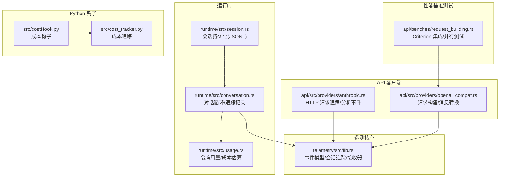
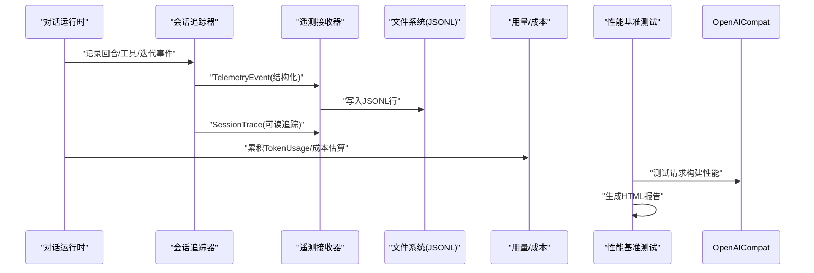
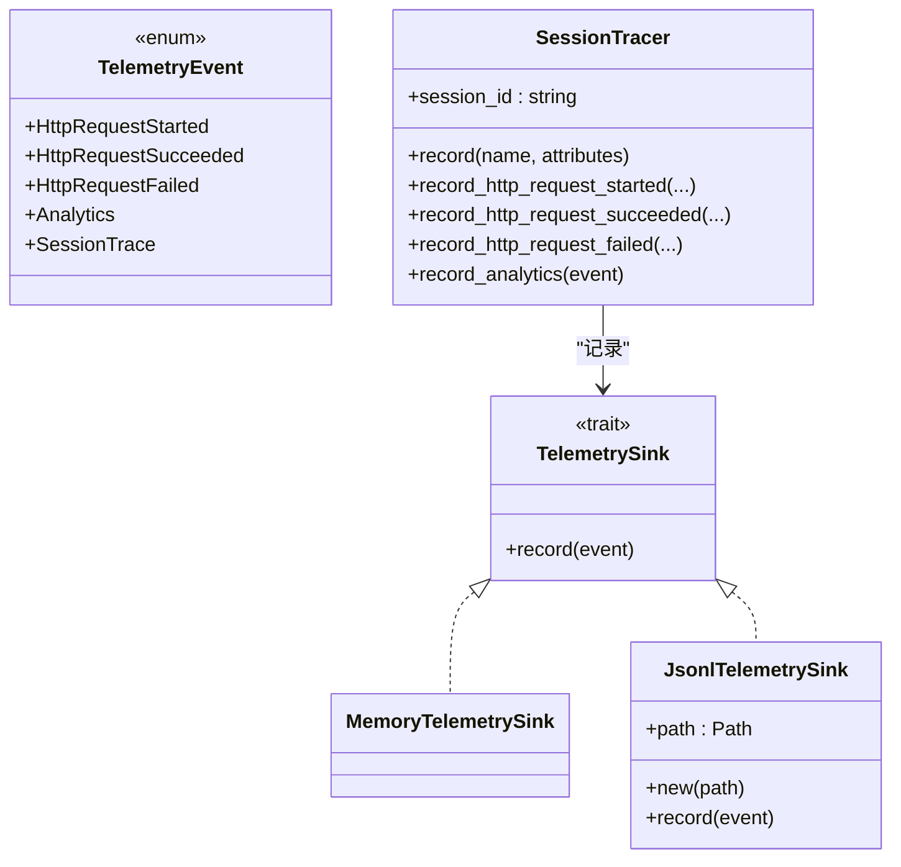
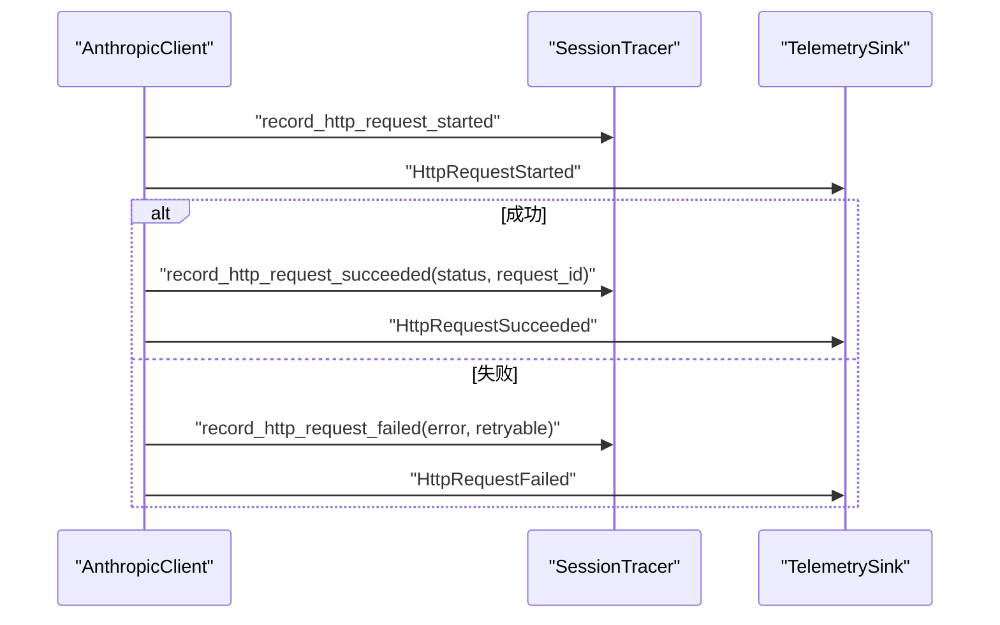
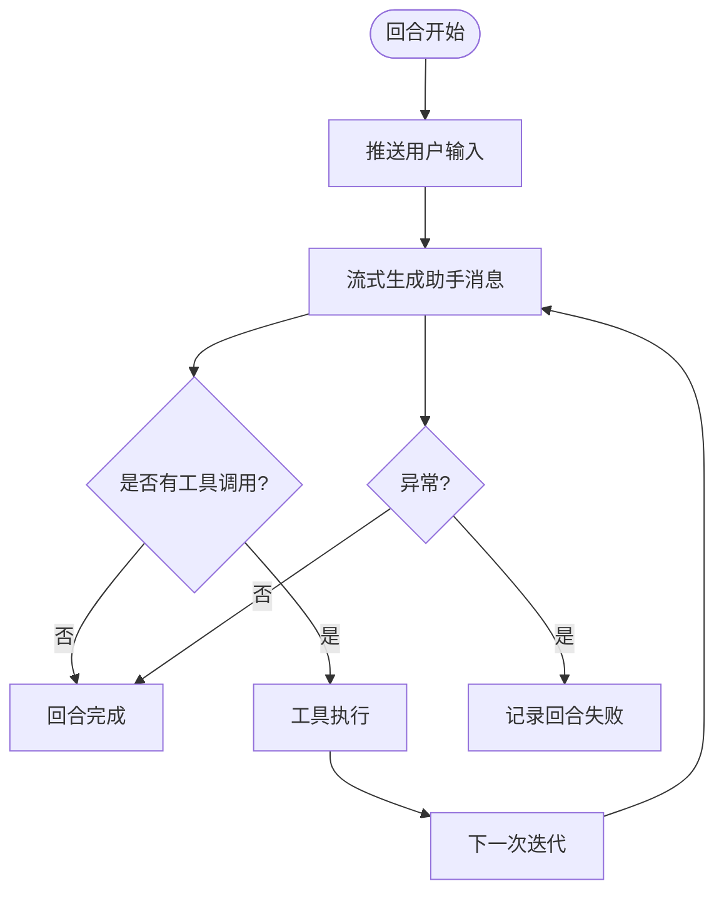
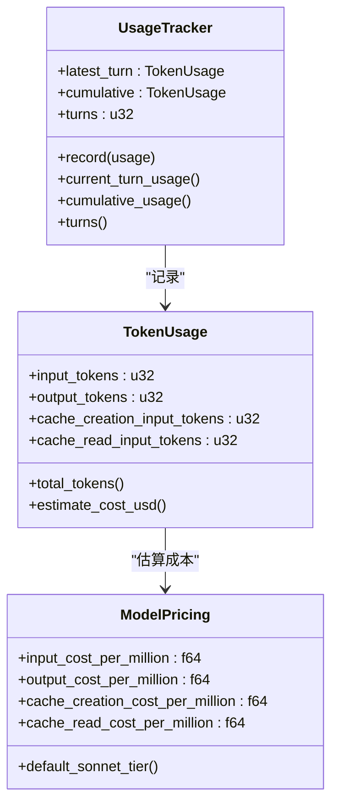
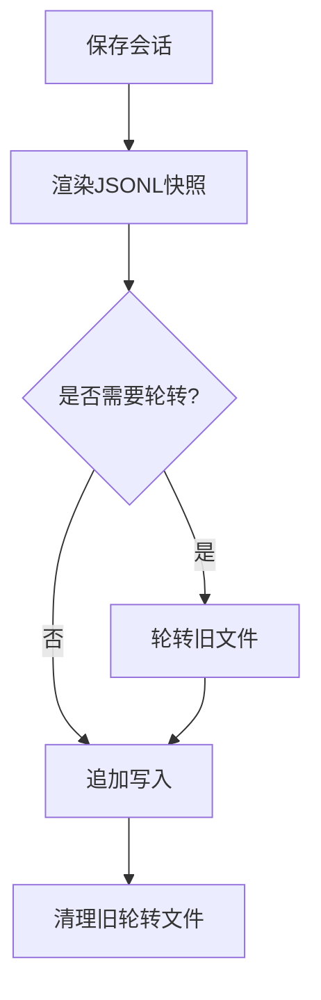
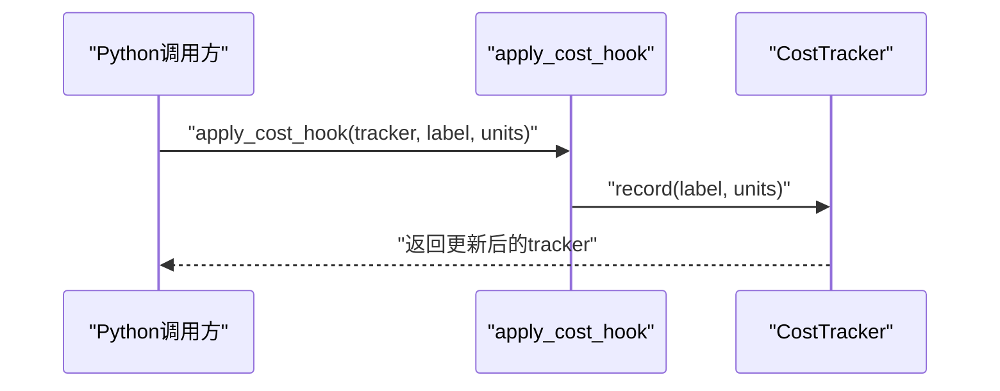
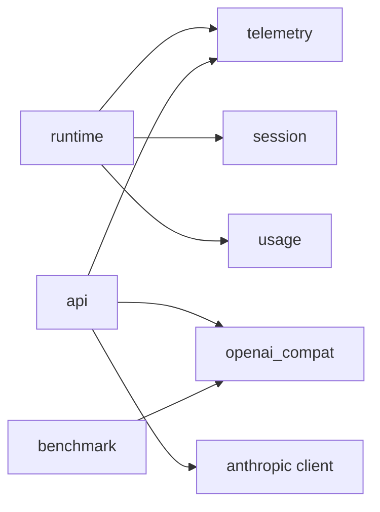

# 遥测与监控

<cite>
**本文引用的文件**
- [rust/crates/telemetry/src/lib.rs](file://rust/crates/telemetry/src/lib.rs)
- [rust/crates/runtime/src/usage.rs](file://rust/crates/runtime/src/usage.rs)
- [rust/crates/runtime/src/session.rs](file://rust/crates/runtime/src/session.rs)
- [rust/crates/runtime/src/conversation.rs](file://rust/crates/runtime/src/conversation.rs)
- [rust/crates/api/src/providers/anthropic.rs](file://rust/crates/api/src/providers/anthropic.rs)
- [rust/crates/api/src/providers/openai_compat.rs](file://rust/crates/api/src/providers/openai_compat.rs)
- [rust/crates/api/benches/request_building.rs](file://rust/crates/api/benches/request_building.rs)
- [rust/crates/api/Cargo.toml](file://rust/crates/api/Cargo.toml)
- [rust/crates/commands/src/lib.rs](file://rust/crates/commands/src/lib.rs)
- [rust/crates/rusty-claude-cli/src/main.rs](file://rust/crates/rusty-claude-cli/src/main.rs)
- [src/cost_tracker.py](file://src/cost_tracker.py)
- [src/costHook.py](file://src/costHook.py)
- [rust/Cargo.toml](file://rust/Cargo.toml)
- [README.md](file://README.md)
</cite>

## 更新摘要
**所做更改**
- 新增性能监控和基准测试章节，详细介绍Criterion框架的集成和使用
- 添加API性能基准测试的具体实现和测试用例
- 更新性能考量部分，包含基准测试结果分析和优化建议
- 新增性能分析工具和方法章节
- 扩展故障排查指南，增加性能相关问题的诊断方法

## 目录
1. [简介](#简介)
2. [项目结构](#项目结构)
3. [核心组件](#核心组件)
4. [架构总览](#架构总览)
5. [详细组件分析](#详细组件分析)
6. [性能监控与基准测试](#性能监控与基准测试)
7. [依赖关系分析](#依赖关系分析)
8. [性能考量](#性能考量)
9. [故障排查指南](#故障排查指南)
10. [结论](#结论)
11. [附录](#附录)

## 简介
本文件面向"遥测与监控"主题，基于仓库中的遥测与运行时模块，系统化阐述统计收集、性能监控与日志记录的实现机制；解释遥测数据的采集、传输与存储流程；给出监控指标定义、告警规则与仪表板配置建议；提供性能分析、瓶颈识别与优化建议的方法；并讨论遥测数据的隐私保护与合规性考虑，以及监控系统的扩展性与高可用性设计。

**更新** 本次更新新增了性能监控和基准测试功能，集成了Criterion框架提供先进的性能测试能力，包括并行基准执行、统计分析和可视化支持。

## 项目结构
围绕遥测与监控的关键代码主要分布在以下位置：
- 遥测核心：rust/crates/telemetry（事件模型、会话追踪器、遥测接收器）
- 运行时与成本统计：rust/crates/runtime（令牌用量、成本估算、会话持久化）
- API 客户端集成：rust/crates/api（Anthropic 客户端与会话追踪器的联动）
- 性能基准测试：rust/crates/api/benches（Criterion框架集成）
- Python 成本钩子：src（成本追踪与钩子应用）

**图表来源**
- [rust/crates/telemetry/src/lib.rs:171-203](file://rust/crates/telemetry/src/lib.rs#L171-L203)
- [rust/crates/runtime/src/conversation.rs:126-139](file://rust/crates/runtime/src/conversation.rs#L126-L139)
- [rust/crates/api/src/providers/anthropic.rs:114-125](file://rust/crates/api/src/providers/anthropic.rs#L114-L125)
- [rust/crates/api/src/providers/openai_compat.rs:843-927](file://rust/crates/api/src/providers/openai_compat.rs#L843-L927)
- [rust/crates/api/benches/request_building.rs:1-330](file://rust/crates/api/benches/request_building.rs#L1-L330)
- [rust/crates/runtime/src/usage.rs:29-45](file://rust/crates/runtime/src/usage.rs#L29-L45)
- [rust/crates/runtime/src/session.rs:90-106](file://rust/crates/runtime/src/session.rs#L90-L106)
- [src/cost_tracker.py:6-13](file://src/cost_tracker.py#L6-L13)
- [src/costHook.py:6-8](file://src/costHook.py#L6-L8)

**章节来源**
- [rust/Cargo.toml:1-23](file://rust/Cargo.toml#L1-L23)
- [README.md:31-44](file://README.md#L31-L44)

## 核心组件
- 遥测事件与会话追踪
  - 事件类型：HTTP 请求开始/成功/失败、分析事件、会话追踪记录
  - 会话追踪器：按会话 ID 记录序列化的追踪事件，并同步记录结构化遥测事件
- 遥测接收器
  - 内存接收器：用于测试或内存中聚合
  - JSONL 接收器：将事件以 JSONL 形式写入文件，支持追加与刷新
- 令牌用量与成本估算
  - TokenUsage：输入/输出/缓存读写令牌计数
  - UsageTracker：回合内与累计用量统计
  - 成本估算：按模型定价估算美元成本
- 会话持久化
  - JSONL 格式快照：元信息、消息、压缩记录、提示历史等
- API 客户端集成
  - Anthropic 客户端：在请求生命周期中记录 HTTP 跟踪与分析事件
  - OpenAI 兼容客户端：提供请求构建、消息转换和工具结果扁平化功能
- 性能基准测试
  - Criterion 框架：提供并行基准执行、统计分析和 HTML 报告生成
  - 测试套件：涵盖消息翻译、请求构建、工具结果扁平化和推理模型检测
- Python 成本钩子
  - 成本追踪器与钩子函数，便于在 Python 层面记录成本单位

**章节来源**
- [rust/crates/telemetry/src/lib.rs:171-203](file://rust/crates/telemetry/src/lib.rs#L171-L203)
- [rust/crates/telemetry/src/lib.rs:209-277](file://rust/crates/telemetry/src/lib.rs#L209-L277)
- [rust/crates/runtime/src/usage.rs:29-155](file://rust/crates/runtime/src/usage.rs#L29-L155)
- [rust/crates/runtime/src/session.rs:521-539](file://rust/crates/runtime/src/session.rs#L521-L539)
- [rust/crates/api/src/providers/anthropic.rs:114-125](file://rust/crates/api/src/providers/anthropic.rs#L114-L125)
- [rust/crates/api/src/providers/openai_compat.rs:843-927](file://rust/crates/api/src/providers/openai_compat.rs#L843-L927)
- [rust/crates/api/benches/request_building.rs:1-330](file://rust/crates/api/benches/request_building.rs#L1-L330)
- [src/cost_tracker.py:6-13](file://src/cost_tracker.py#L6-L13)
- [src/costHook.py:6-8](file://src/costHook.py#L6-L8)

## 架构总览
遥测数据流从运行时与 API 客户端产生，经由会话追踪器统一记录为结构化遥测事件与可读的会话追踪记录，再由接收器进行传输与存储。运行时还负责令牌用量与成本估算，支撑成本监控与预算控制。性能基准测试通过 Criterion 框架独立运行，提供详细的性能分析报告。

**图表来源**
- [rust/crates/runtime/src/conversation.rs:580-685](file://rust/crates/runtime/src/conversation.rs#L580-L685)
- [rust/crates/telemetry/src/lib.rs:280-407](file://rust/crates/telemetry/src/lib.rs#L280-L407)
- [rust/crates/telemetry/src/lib.rs:233-277](file://rust/crates/telemetry/src/lib.rs#L233-L277)
- [rust/crates/runtime/src/usage.rs:168-215](file://rust/crates/runtime/src/usage.rs#L168-L215)
- [rust/crates/api/benches/request_building.rs:322-330](file://rust/crates/api/benches/request_building.rs#L322-L330)

## 详细组件分析

### 组件一：遥测事件与会话追踪
- 结构化事件
  - HTTP 请求开始/成功/失败：携带会话 ID、尝试次数、方法、路径、状态码、请求 ID、重试标记等
  - 分析事件：命名空间与动作，附带属性
  - 会话追踪记录：按序列号生成的可读事件，便于审计与回放
- 会话追踪器
  - 通过 Arc 的原子序号确保多线程安全的序列增长
  - 同步记录 TelemetryEvent 与 SessionTrace，保持一致的事件语义
- 接收器
  - 内存接收器：线程安全地收集事件，便于测试与临时聚合
  - JSONL 接收器：自动创建目录、追加写入、刷新落盘，适合生产环境持久化

**图表来源**
- [rust/crates/telemetry/src/lib.rs:171-203](file://rust/crates/telemetry/src/lib.rs#L171-L203)
- [rust/crates/telemetry/src/lib.rs:280-407](file://rust/crates/telemetry/src/lib.rs#L280-L407)
- [rust/crates/telemetry/src/lib.rs:209-277](file://rust/crates/telemetry/src/lib.rs#L209-L277)

**章节来源**
- [rust/crates/telemetry/src/lib.rs:171-203](file://rust/crates/telemetry/src/lib.rs#L171-L203)
- [rust/crates/telemetry/src/lib.rs:280-407](file://rust/crates/telemetry/src/lib.rs#L280-L407)
- [rust/crates/telemetry/src/lib.rs:209-277](file://rust/crates/telemetry/src/lib.rs#L209-L277)

### 组件二：API 客户端与 HTTP 追踪
- Anthropic 客户端
  - 在发送请求前记录"请求已开始"，在成功/失败时分别记录"成功/失败"
  - 将请求分析事件转发给会话追踪器，统一纳入遥测
- OpenAI 兼容客户端
  - 提供请求构建、消息翻译、工具结果扁平化等功能
  - 包含推理模型检测和工具结果处理逻辑
- 请求头与请求体注入
  - 使用请求配置对象注入版本、用户代理、Beta 标记与额外字段
- 错误与重试
  - 失败事件包含错误文本与是否可重试标记，便于告警策略

**图表来源**
- [rust/crates/api/src/providers/anthropic.rs:114-125](file://rust/crates/api/src/providers/anthropic.rs#L114-L125)
- [rust/crates/api/src/providers/anthropic.rs:313-314](file://rust/crates/api/src/providers/anthropic.rs#L313-L314)
- [rust/crates/api/src/providers/anthropic.rs:409-421](file://rust/crates/api/src/providers/anthropic.rs#L409-L421)
- [rust/crates/api/src/providers/anthropic.rs:549-550](file://rust/crates/api/src/providers/anthropic.rs#L549-L550)
- [rust/crates/telemetry/src/lib.rs:320-395](file://rust/crates/telemetry/src/lib.rs#L320-L395)

**章节来源**
- [rust/crates/api/src/providers/anthropic.rs:114-125](file://rust/crates/api/src/providers/anthropic.rs#L114-L125)
- [rust/crates/api/src/providers/anthropic.rs:313-314](file://rust/crates/api/src/providers/anthropic.rs#L313-L314)
- [rust/crates/api/src/providers/anthropic.rs:409-421](file://rust/crates/api/src/providers/anthropic.rs#L409-L421)
- [rust/crates/api/src/providers/anthropic.rs:549-550](file://rust/crates/api/src/providers/anthropic.rs#L549-L550)

### 组件三：运行时对话循环与追踪
- 回合开始/结束、工具执行开始/结束、迭代完成、失败等事件
- 将用户输入、迭代次数、块数量、工具名称、错误信息等作为属性写入追踪
- 与会话持久化配合，形成完整的会话审计线索

**图表来源**
- [rust/crates/runtime/src/conversation.rs:314-515](file://rust/crates/runtime/src/conversation.rs#L314-L515)
- [rust/crates/runtime/src/conversation.rs:580-685](file://rust/crates/runtime/src/conversation.rs#L580-L685)

**章节来源**
- [rust/crates/runtime/src/conversation.rs:314-515](file://rust/crates/runtime/src/conversation.rs#L314-L515)
- [rust/crates/runtime/src/conversation.rs:580-685](file://rust/crates/runtime/src/conversation.rs#L580-L685)

### 组件四：令牌用量与成本估算
- TokenUsage：输入/输出/缓存读写令牌
- UsageTracker：回合内与累计用量统计，支持从会话重建
- 成本估算：按模型定价估算美元成本，支持默认与特定模型定价
- 输出格式化：将用量与成本汇总为人类可读行

**图表来源**
- [rust/crates/runtime/src/usage.rs:29-45](file://rust/crates/runtime/src/usage.rs#L29-L45)
- [rust/crates/runtime/src/usage.rs:168-215](file://rust/crates/runtime/src/usage.rs#L168-L215)
- [rust/crates/runtime/src/usage.rs:58-81](file://rust/crates/runtime/src/usage.rs#L58-L81)

**章节来源**
- [rust/crates/runtime/src/usage.rs:29-155](file://rust/crates/runtime/src/usage.rs#L29-L155)
- [rust/crates/runtime/src/usage.rs:168-215](file://rust/crates/runtime/src/usage.rs#L168-L215)

### 组件五：会话持久化与审计线索
- JSONL 快照：包含会话元信息、消息、压缩记录、提示历史等
- 追加写入与轮转：支持按大小轮转与清理旧文件
- 与追踪器协同：会话追踪记录与 JSONL 记录共同构成审计线索

**图表来源**
- [rust/crates/runtime/src/session.rs:521-539](file://rust/crates/runtime/src/session.rs#L521-L539)
- [rust/crates/runtime/src/session.rs:204-211](file://rust/crates/runtime/src/session.rs#L204-L211)
- [rust/crates/runtime/src/session.rs:405-504](file://rust/crates/runtime/src/session.rs#L405-L504)

**章节来源**
- [rust/crates/runtime/src/session.rs:521-539](file://rust/crates/runtime/src/session.rs#L521-L539)
- [rust/crates/runtime/src/session.rs:204-211](file://rust/crates/runtime/src/session.rs#L204-L211)
- [rust/crates/runtime/src/session.rs:405-504](file://rust/crates/runtime/src/session.rs#L405-L504)

### 组件六：Python 成本钩子
- 成本追踪器：维护累计单位与事件列表
- 成本钩子：在调用点记录标签与单位，便于跨语言成本度量

**图表来源**
- [src/costHook.py:6-8](file://src/costHook.py#L6-L8)
- [src/cost_tracker.py:6-13](file://src/cost_tracker.py#L6-L13)

**章节来源**
- [src/costHook.py:6-8](file://src/costHook.py#L6-L8)
- [src/cost_tracker.py:6-13](file://src/cost_tracker.py#L6-L13)

## 性能监控与基准测试

### Criterion 框架集成
项目集成了 Criterion 框架，提供先进的性能测试能力，包括并行基准执行、统计分析和可视化支持。框架通过 dev-dependencies 方式集成，支持 HTML 报告生成和详细的性能分析。

### 基准测试套件
API crate 包含专门的性能基准测试套件，涵盖以下关键功能：

#### 消息翻译性能测试
- 文本消息翻译：测试简单文本消息的翻译性能
- 工具调用消息：测试包含多个工具调用的消息翻译
- 工具结果消息：测试工具执行结果消息的翻译
- 大内容消息：测试大文本内容的消息翻译性能
- Kimi 模型特殊处理：针对不支持 is_error 字段的模型进行测试

#### 请求构建性能测试
- 不同消息数量：测试 10、50、100 条消息的请求构建性能
- 推理模型支持：测试 o1-mini 等推理模型的特殊处理
- GPT-5 兼容性：测试 gpt-5 模型的 max_completion_tokens 参数处理
- 配置变化：测试不同 OpenAI 兼容配置下的性能表现

#### 工具结果扁平化测试
- 单文本块：测试单一文本块的扁平化性能
- 多文本块：测试 10 个文本块的批量处理性能
- JSON 内容：测试 JSON 数据块的处理性能
- 混合内容：测试文本和 JSON 混合内容的处理
- 大内容模拟：模拟典型工具输出的大内容处理

#### 推理模型检测测试
- 多种模型：测试 gpt-4o、o1-mini、o3、grok-3、qwen-qwq 等模型的推理检测
- 预期结果验证：验证推理模型检测的准确性

### 基准测试执行
基准测试通过以下方式执行：
- 独立的测试套件：位于 api/benches/request_building.rs
- Criterion 主函数：使用 criterion_main! 宏启动测试
- 并行执行：利用 Criterion 的并行基准执行能力
- 可视化报告：自动生成 HTML 格式的性能报告

### 性能分析工具
项目提供了多种性能分析工具和方法：

#### 命令行性能分析
- 性能分析命令：`/perf` 命令用于分析函数或文件的性能
- 基准测试命令：`/benchmark` 命令用于运行性能基准测试
- 性能报告：生成详细的性能分析报告和可视化图表

#### 运行时性能监控
- 令牌用量统计：实时监控输入/输出/缓存读写的令牌使用情况
- 成本估算：基于模型定价的实时成本计算
- 回合性能：监控对话回合的执行时间和资源消耗

#### 外部性能工具
- Rust 性能分析：使用 perf、valgrind 等工具进行底层性能分析
- 内存泄漏检测：使用 miri、valgrind 等工具检测内存问题
- 并发性能测试：使用 tokio 的并发性能分析工具

**章节来源**
- [rust/crates/api/benches/request_building.rs:1-330](file://rust/crates/api/benches/request_building.rs#L1-L330)
- [rust/crates/api/Cargo.toml:16-25](file://rust/crates/api/Cargo.toml#L16-L25)
- [rust/crates/commands/src/lib.rs:806-812](file://rust/crates/commands/src/lib.rs#L806-L812)
- [rust/crates/rusty-claude-cli/src/main.rs:7331-7332](file://rust/crates/rusty-claude-cli/src/main.rs#L7331-L7332)

## 依赖关系分析
- 工作区组织
  - 工作区成员包含所有 crates，统一版本与特性
- 模块耦合
  - 运行时对话循环依赖遥测追踪器与用量统计
  - API 客户端依赖遥测追踪器与分析事件
  - 性能基准测试独立运行，依赖 OpenAI 兼容功能
  - 会话持久化与对话循环相互协作
- 外部依赖
  - JSON 序列化与解析用于遥测事件与会话快照
  - 文件系统写入用于 JSONL 存储
  - Criterion 框架用于性能基准测试

**图表来源**
- [rust/Cargo.toml:1-23](file://rust/Cargo.toml#L1-L23)
- [rust/crates/runtime/src/conversation.rs:126-139](file://rust/crates/runtime/src/conversation.rs#L126-L139)
- [rust/crates/api/src/providers/anthropic.rs:114-125](file://rust/crates/api/src/providers/anthropic.rs#L114-L125)
- [rust/crates/api/benches/request_building.rs:16-22](file://rust/crates/api/benches/request_building.rs#L16-L22)

**章节来源**
- [rust/Cargo.toml:1-23](file://rust/Cargo.toml#L1-L23)

## 性能考量
- 事件写入
  - JSONL 接收器采用追加写入与刷新，降低随机 IO 开销；建议在高吞吐场景启用批量写入策略与合适的刷新周期
- 会话持久化
  - 支持轮转与清理旧文件，避免单文件过大；建议根据磁盘容量与保留策略调整轮转阈值
- 追踪开销
  - 会话追踪器使用原子序号与互斥锁保护事件队列；在高频事件场景下，建议评估内存接收器与 JSONL 接收器的吞吐差异
- 成本估算
  - 估算成本为 O(1)，对主路径影响极小；建议在回合完成后批量输出摘要，减少终端渲染压力
- **更新** 性能基准测试
  - Criterion 框架提供精确的性能测量，支持统计显著性检验和回归检测
  - 基准测试涵盖关键路径的性能瓶颈识别，包括消息翻译、请求构建和工具结果处理
  - HTML 报告提供可视化性能趋势分析，便于长期性能监控

## 故障排查指南
- HTTP 请求失败
  - 查看失败事件中的错误文本与可重试标记，结合重试策略与退避参数定位问题
- 会话健康检查
  - 对于压缩后无消息的会话，运行健康探测以确认工具执行器响应正常
- 日志与追踪
  - 检查 JSONL 文件是否存在、是否被轮转覆盖；核对会话追踪记录与结构化遥测事件是否成对出现
- 成本异常
  - 核对模型别名与定价映射，确认是否使用默认定价；检查回合用量统计与累计用量的一致性
- **更新** 性能问题排查
  - 使用 `/perf` 命令分析特定函数或文件的性能瓶颈
  - 运行 `/benchmark` 命令获取详细的性能基准测试报告
  - 检查基准测试结果中的回归和性能退化趋势
  - 分析 Criterion 生成的 HTML 报告，识别性能热点和优化机会

**章节来源**
- [rust/crates/api/src/providers/anthropic.rs:549-550](file://rust/crates/api/src/providers/anthropic.rs#L549-L550)
- [rust/crates/runtime/src/conversation.rs:295-311](file://rust/crates/runtime/src/conversation.rs#L295-L311)
- [rust/crates/runtime/src/session.rs:204-211](file://rust/crates/runtime/src/session.rs#L204-L211)
- [rust/crates/runtime/src/usage.rs:168-215](file://rust/crates/runtime/src/usage.rs#L168-L215)

## 结论
该遥测与监控体系通过统一的事件模型与会话追踪器，将运行时行为、API 请求与成本信息有机整合；借助 JSONL 持久化与内存接收器满足不同场景需求；配合令牌用量与成本估算，为资源控制与成本治理提供基础。**更新** 新增的性能监控和基准测试功能通过 Criterion 框架提供了专业的性能分析能力，包括并行基准执行、统计分析和可视化支持。建议在生产环境中结合告警规则与仪表板配置，持续优化事件写入与会话持久化策略，确保可观测性与系统稳定性。

## 附录

### 监控指标定义与建议
- 基础指标
  - HTTP 请求成功率、延迟分位数、错误率、重试次数
  - 回合耗时、工具执行耗时、迭代次数
  - 输入/输出/缓存读写令牌总量与成本
- **更新** 性能指标
  - 基准测试结果：消息翻译、请求构建、工具结果处理的性能指标
  - 回归检测：性能变化的统计显著性检验
  - 资源利用率：CPU、内存、IO 的性能监控指标
- 衍生指标
  - 单回合成本、每千令牌成本、会话平均成本
  - 压缩触发频率、压缩移除消息数

### 告警规则建议
- HTTP 失败率突增、延迟 P95 超阈、错误码分布异常
- 成本超预算阈值、单回合成本异常升高
- 会话健康探测失败、工具执行器不可用
- **更新** 性能告警
  - 基准测试回归：性能指标超出历史范围的告警
  - 性能退化：与基线相比的性能下降检测
  - 资源瓶颈：CPU、内存使用率异常的性能告警

### 仪表板配置建议
- 实时面板：HTTP 指标、回合耗时、工具执行耗时
- 成本面板：累计成本、单回合成本、模型成本占比
- 审计面板：会话追踪记录、JSONL 文件状态
- **更新** 性能面板
  - 基准测试趋势：各功能模块的性能趋势图
  - 回归检测：性能回归的可视化展示
  - 资源监控：系统资源使用的实时监控面板

### 隐私保护与合规性
- 最小化原则：仅记录必要字段，避免敏感信息进入遥测
- 数据脱敏：对认证头与请求 ID 进行遮蔽或去标识化
- 存储安全：限制 JSONL 文件访问权限，定期轮转与清理
- 用户同意：在收集遥测前明确告知并提供关闭选项

### 扩展性与高可用
- 扩展性
  - 接收器插件化：支持多种输出（文件、远程服务、消息队列）
  - 事件过滤与采样：在高负载时降低事件密度
- 高可用
  - 多接收器并行：同时写入本地与远端，提升容错能力
  - 健康检查：定期探测接收器可用性与磁盘空间
  - 自动恢复：失败后重试与降级策略（如切换到内存接收器）
- **更新** 性能扩展
  - 基准测试集群：分布式性能测试环境
  - 性能缓存：热点数据的性能优化缓存策略
  - 异步处理：性能数据的异步处理与分析

### 性能分析工具和方法
- **更新** 基准测试方法
  - 统计显著性检验：使用 t-test 等方法验证性能差异的显著性
  - 回归检测：自动检测性能回归和异常波动
  - 压力测试：模拟高负载场景下的系统性能表现
- **更新** 性能优化建议
  - 缓存策略：针对热点数据和频繁访问的功能实施缓存
  - 异步处理：将耗时操作异步化，提高系统响应性
  - 内存优化：减少内存分配和复制操作
  - 并发优化：合理使用并发和并行技术提升吞吐量