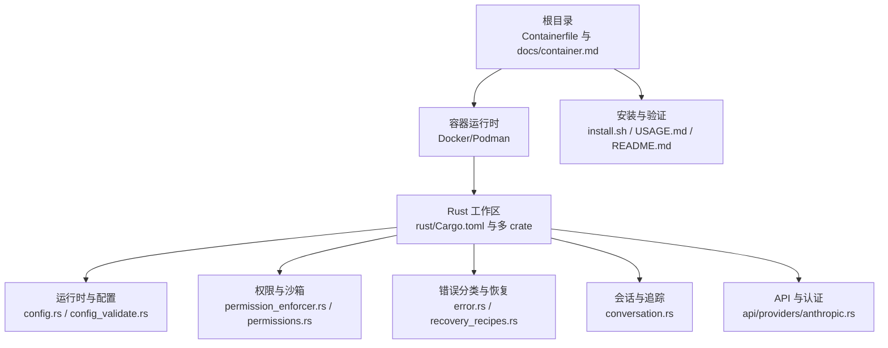
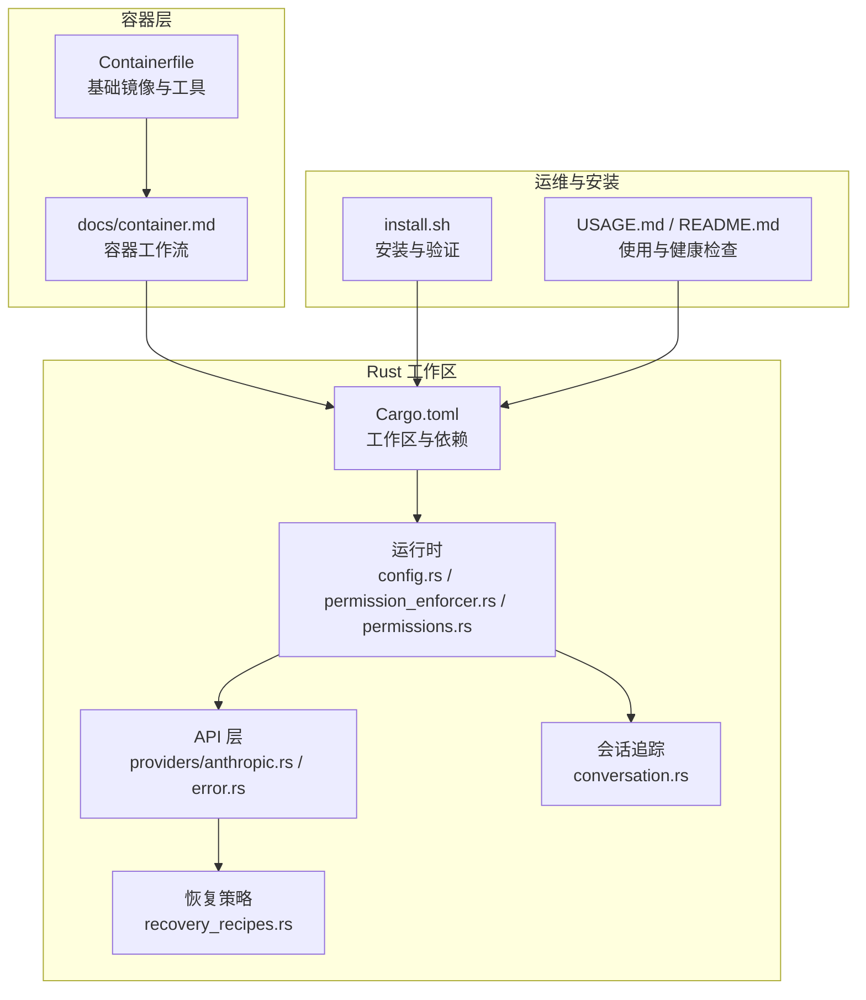
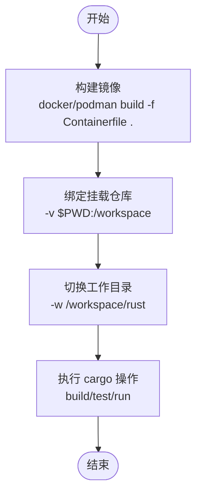
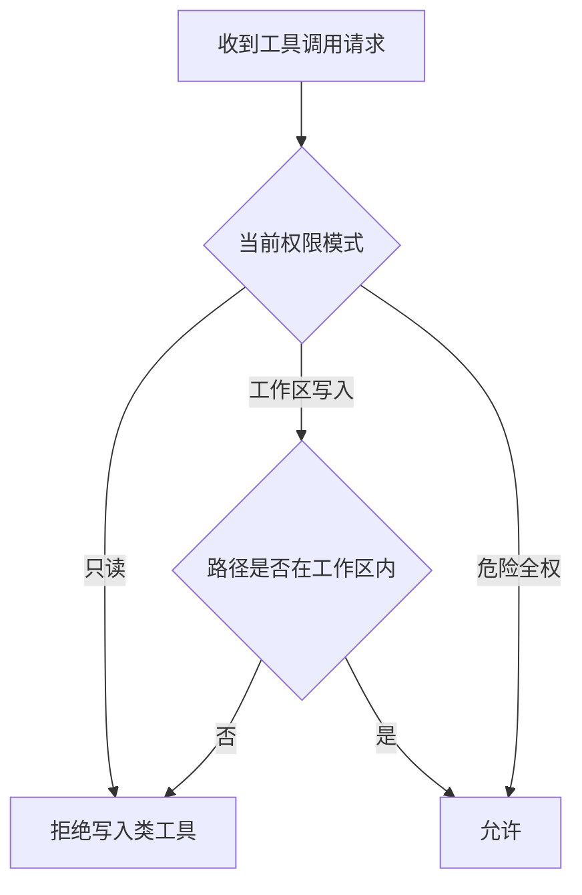
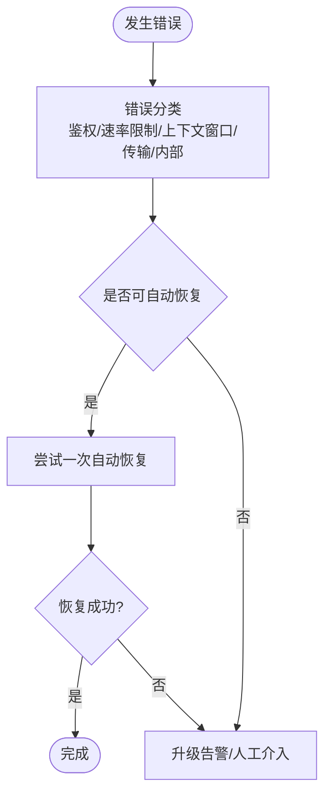
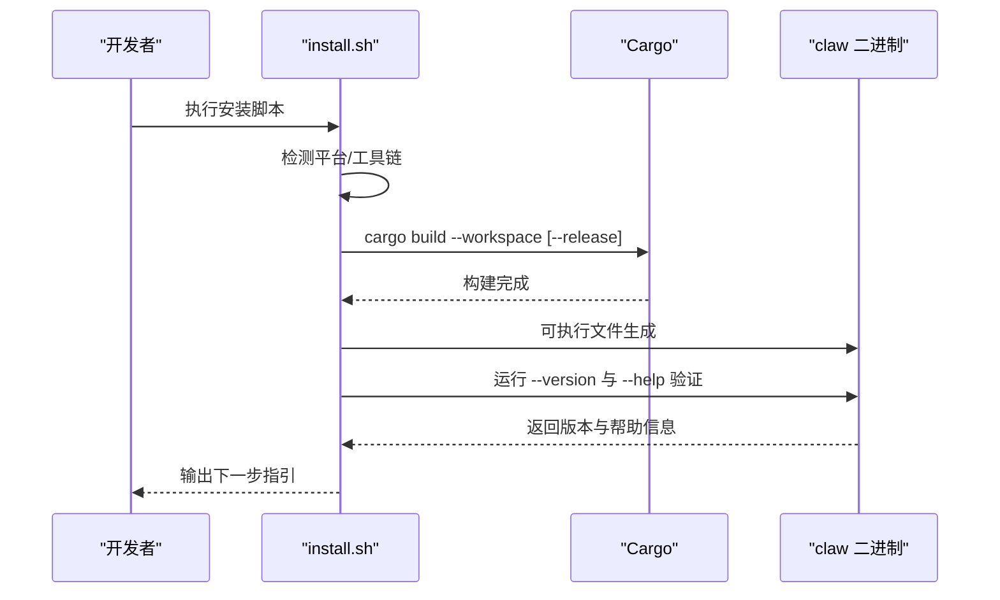
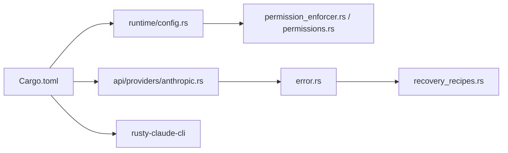

# 部署与运维

<cite>
**本文引用的文件**   
- [Containerfile](file://Containerfile)
- [docs/container.md](file://docs/container.md)
- [install.sh](file://install.sh)
- [README.md](file://README.md)
- [USAGE.md](file://USAGE.md)
- [rust/Cargo.toml](file://rust/Cargo.toml)
- [rust/scripts/run_mock_parity_harness.sh](file://rust/scripts/run_mock_parity_harness.sh)
- [rust/crates/runtime/src/config.rs](file://rust/crates/runtime/src/config.rs)
- [rust/crates/runtime/src/config_validate.rs](file://rust/crates/runtime/src/config_validate.rs)
- [rust/crates/runtime/src/permission_enforcer.rs](file://rust/crates/runtime/src/permission_enforcer.rs)
- [rust/crates/runtime/src/permissions.rs](file://rust/crates/runtime/src/permissions.rs)
- [rust/crates/runtime/src/recovery_recipes.rs](file://rust/crates/runtime/src/recovery_recipes.rs)
- [rust/crates/runtime/src/conversation.rs](file://rust/crates/runtime/src/conversation.rs)
- [rust/crates/api/src/error.rs](file://rust/crates/api/src/error.rs)
- [rust/crates/api/src/providers/anthropic.rs](file://rust/crates/api/src/providers/anthropic.rs)
- [rust/crates/rusty-claude-cli/tests/mock_parity_harness.rs](file://rust/crates/rusty-claude-cli/tests/mock_parity_harness.rs)
- [.github/FUNDING.yml](file://.github/FUNDING.yml)
</cite>

## 目录
1. [简介](#简介)
2. [项目结构](#项目结构)
3. [核心组件](#核心组件)
4. [架构总览](#架构总览)
5. [详细组件分析](#详细组件分析)
6. [依赖关系分析](#依赖关系分析)
7. [性能考量](#性能考量)
8. [故障排查指南](#故障排查指南)
9. [结论](#结论)
10. [附录](#附录)

## 简介
本指南面向部署与运维团队，围绕容器化构建、镜像管理、编排部署、生产环境配置、基础设施要求、监控与日志、告警、高可用与灾难恢复、安全加固与访问控制、合规性、运维工具与自动化脚本等维度，提供可操作的实施建议与最佳实践。文档内容基于仓库中的容器工作流、安装脚本、运行时配置与权限模型、错误分类与恢复策略、以及认证与代理支持等现有能力进行系统化梳理。

## 项目结构
- 根目录提供容器镜像定义与容器工作流文档，便于在 Docker/Podman 中以“容器优先”的方式开展开发与测试。
- rust 工作区包含多 crate，涵盖 API 客户端、运行时、CLI、插件、工具集与遥测等模块，是生产运行的核心。
- install.sh 提供跨平台安装与构建流程，支持调试与发布两种构建模式，并内置常见问题排查提示。
- USAGE.md 与 README.md 提供使用与快速健康检查流程，是日常运维与故障定位的重要参考。

**图示来源**
- [Containerfile](file://Containerfile)
- [docs/container.md](file://docs/container.md)
- [install.sh](file://install.sh)
- [USAGE.md](file://USAGE.md)
- [README.md](file://README.md)
- [rust/Cargo.toml](file://rust/Cargo.toml)
- [rust/crates/runtime/src/config.rs](file://rust/crates/runtime/src/config.rs)
- [rust/crates/runtime/src/config_validate.rs](file://rust/crates/runtime/src/config_validate.rs)
- [rust/crates/runtime/src/permission_enforcer.rs](file://rust/crates/runtime/src/permission_enforcer.rs)
- [rust/crates/runtime/src/permissions.rs](file://rust/crates/runtime/src/permissions.rs)
- [rust/crates/api/src/error.rs](file://rust/crates/api/src/error.rs)
- [rust/crates/api/src/providers/anthropic.rs](file://rust/crates/api/src/providers/anthropic.rs)
- [rust/crates/runtime/src/conversation.rs](file://rust/crates/runtime/src/conversation.rs)

**章节来源**
- [Containerfile](file://Containerfile)
- [docs/container.md](file://docs/container.md)
- [install.sh](file://install.sh)
- [USAGE.md](file://USAGE.md)
- [README.md](file://README.md)
- [rust/Cargo.toml](file://rust/Cargo.toml)

## 核心组件
- 容器构建与运行：通过根目录的 Containerfile 构建基础 Rust 开发/测试镜像；结合 docs/container.md 的容器工作流，可在容器内执行 cargo 命令、运行测试与交互式 CLI。
- 安装与构建：install.sh 支持自动检测平台、校验 Rust 工具链、选择构建配置（debug/release）、执行后置验证，并提供常见问题排查清单。
- 运行时配置与沙箱：运行时配置解析与校验，支持沙箱开关、网络隔离、挂载限制、文件系统模式等，用于生产环境的安全约束。
- 权限与访问控制：权限强制器与规则解析，支持只读、工作区写入、危险全权等模式，以及按工具/输入匹配的细粒度控制。
- 错误分类与恢复：对 API 错误进行分类，区分鉴权、速率限制、上下文窗口、传输与内部错误等类别，并提供恢复预案与升级策略。
- 会话追踪与可观测性：会话级事件记录，便于审计与问题复盘。
- 认证与代理：支持多种凭据形态与代理配置，便于在受限网络环境中运行。

**章节来源**
- [Containerfile](file://Containerfile)
- [docs/container.md](file://docs/container.md)
- [install.sh](file://install.sh)
- [rust/crates/runtime/src/config.rs](file://rust/crates/runtime/src/config.rs)
- [rust/crates/runtime/src/config_validate.rs](file://rust/crates/runtime/src/config_validate.rs)
- [rust/crates/runtime/src/permission_enforcer.rs](file://rust/crates/runtime/src/permission_enforcer.rs)
- [rust/crates/runtime/src/permissions.rs](file://rust/crates/runtime/src/permissions.rs)
- [rust/crates/api/src/error.rs](file://rust/crates/api/src/error.rs)
- [rust/crates/runtime/src/conversation.rs](file://rust/crates/runtime/src/conversation.rs)

## 架构总览
下图展示从容器到运行时、配置、权限、API 调用与恢复机制的整体关系，帮助理解生产部署的关键路径与风险点。

**图示来源**
- [Containerfile](file://Containerfile)
- [docs/container.md](file://docs/container.md)
- [rust/Cargo.toml](file://rust/Cargo.toml)
- [rust/crates/runtime/src/config.rs](file://rust/crates/runtime/src/config.rs)
- [rust/crates/runtime/src/permission_enforcer.rs](file://rust/crates/runtime/src/permission_enforcer.rs)
- [rust/crates/runtime/src/permissions.rs](file://rust/crates/runtime/src/permissions.rs)
- [rust/crates/api/src/providers/anthropic.rs](file://rust/crates/api/src/providers/anthropic.rs)
- [rust/crates/api/src/error.rs](file://rust/crates/api/src/error.rs)
- [rust/crates/runtime/src/recovery_recipes.rs](file://rust/crates/runtime/src/recovery_recipes.rs)
- [rust/crates/runtime/src/conversation.rs](file://rust/crates/runtime/src/conversation.rs)
- [install.sh](file://install.sh)
- [USAGE.md](file://USAGE.md)
- [README.md](file://README.md)

## 详细组件分析

### 容器化构建与镜像管理
- 基础镜像与工具：Containerfile 基于官方 Rust 发行版，安装证书、Git、OpenSSL 头文件与 pkg-config 等常用工具，适合在容器内进行构建与测试。
- 绑定挂载与工作目录：容器工作流文档建议将宿主机仓库绑定挂载至 /workspace，避免将构建产物写回宿主，同时在 rust/ 目录中执行 cargo 操作。
- Docker 与 Podman：两者共享同一 Containerfile，Podman 在部分发行版上需要 SELinux 标记（:Z）。
- 镜像用途：该镜像主要用于开发与测试，不包含应用二进制，适合在 CI 或本地开发中作为“构建壳”。

**图示来源**
- [Containerfile](file://Containerfile)
- [docs/container.md](file://docs/container.md)

**章节来源**
- [Containerfile](file://Containerfile)
- [docs/container.md](file://docs/container.md)

### 生产环境配置与基础设施要求
- 运行时配置加载顺序：用户级、系统级、项目级与本地覆盖，确保在不同环境下的可配置性与可维护性。
- 沙箱配置字段：启用开关、命名空间限制、网络隔离、文件系统模式、允许挂载列表等，用于在生产中限制运行面。
- OAuth 配置字段：客户端 ID、授权与令牌端点、回调端口、手动重定向地址等，支撑企业级登录与代理场景。
- 基础设施建议：
  - CPU/内存：根据并发会话与工具调用复杂度评估，预留 20%-50% 缓冲。
  - 存储：持久化会话与缓存目录，避免容器重启丢失；使用独立卷或持久化存储。
  - 网络：若需代理访问上游服务，配置 HTTP_PROXY/HTTPS_PROXY/NO_PROXY 或统一 proxy_url。
  - 证书：确保系统 CA 信任链完整，必要时注入自定义 CA Bundle。

**章节来源**
- [rust/crates/runtime/src/config.rs](file://rust/crates/runtime/src/config.rs)
- [rust/crates/runtime/src/config_validate.rs](file://rust/crates/runtime/src/config_validate.rs)

### 权限与访问控制
- 权限模式：只读、工作区写入、危险全权等，按工具与输入动态判定是否放行。
- 规则匹配：支持任意、精确匹配与前缀匹配，可对命令主体进行提取与比对。
- 文件边界检查：在工作区外写入直接拒绝，避免越权操作。
- 实施建议：
  - 默认采用“工作区写入”模式，仅在受控场景开启“危险全权”。
  - 对外部工具调用增加最小权限原则，结合前缀匹配限制高危命令。
  - 将敏感参数与路径纳入规则匹配，避免误放行。

**图示来源**
- [rust/crates/runtime/src/permission_enforcer.rs](file://rust/crates/runtime/src/permission_enforcer.rs)
- [rust/crates/runtime/src/permissions.rs](file://rust/crates/runtime/src/permissions.rs)

**章节来源**
- [rust/crates/runtime/src/permission_enforcer.rs](file://rust/crates/runtime/src/permission_enforcer.rs)
- [rust/crates/runtime/src/permissions.rs](file://rust/crates/runtime/src/permissions.rs)

### 错误分类与恢复策略
- 错误分类：将 API 错误映射为“鉴权”“速率限制”“上下文窗口”“传输”“内部错误”等类别，便于统一处理与告警。
- 恢复预案：针对提供方失败等场景，提供一次性自动恢复尝试与升级策略（如告警人类）。
- 实施建议：
  - 在网关或入口层根据错误类别进行差异化降级与重试。
  - 对速率限制与上下文窗口错误，引入指数退避与队列缓冲。
  - 对传输与内部错误，记录结构化事件并触发告警。

**图示来源**
- [rust/crates/api/src/error.rs](file://rust/crates/api/src/error.rs)
- [rust/crates/runtime/src/recovery_recipes.rs](file://rust/crates/runtime/src/recovery_recipes.rs)

**章节来源**
- [rust/crates/api/src/error.rs](file://rust/crates/api/src/error.rs)
- [rust/crates/runtime/src/recovery_recipes.rs](file://rust/crates/runtime/src/recovery_recipes.rs)

### 监控、日志与告警
- 会话追踪：在回合完成与失败时记录结构化属性（迭代次数、消息数量、工具结果数、缓存事件数、错误信息），便于审计与问题复盘。
- 建议指标：
  - 会话吞吐量、平均响应时间、错误率（按类别细分）。
  - 上游调用延迟与错误分布。
  - 资源使用（CPU/内存/IO）与容器健康状态。
- 日志聚合：将容器标准输出与错误输出接入集中式日志系统，保留会话 ID 与请求 ID 以便关联查询。
- 告警策略：对 401/403、429、上下文窗口超限、传输异常与内部错误设置阈值告警；对恢复失败与升级事件进行即时通知。

**章节来源**
- [rust/crates/runtime/src/conversation.rs](file://rust/crates/runtime/src/conversation.rs)

### 负载均衡、高可用与灾难恢复
- 负载均衡：在容器编排平台（如 Kubernetes）中使用服务暴露与副本扩缩容，结合就绪探针与存活探针保障流量健康。
- 高可用：多副本部署，结合持久化会话存储与共享缓存；对上游 API 设置多区域/多提供商后备策略。
- 灾难恢复：定期备份会话与配置，演练故障切换与回滚流程；对关键数据建立异地冗余与快照策略。

### 安全加固与合规
- 凭据管理：通过环境变量或密钥管理服务注入凭据，避免硬编码；区分 API Key 与 Bearer Token 的使用场景。
- 网络与代理：在受限网络中配置代理，确保仅对必要域名放行；对上游服务启用 TLS 与证书校验。
- 沙箱与权限：默认启用沙箱与最小权限，严格限制文件系统与网络访问；对外部工具调用进行白名单与参数校验。
- 合规审计：启用结构化日志与会话追踪，保留必要的操作轨迹；对敏感操作设置二次确认与审批流程。

### 运维工具与自动化脚本
- 安装与验证：install.sh 支持自动检测平台、校验工具链、选择构建配置、执行后置验证，并提供常见问题排查清单。
- 容器工作流：docs/container.md 提供在容器内执行 cargo 测试与交互式 CLI 的完整步骤。
- 并发测试：提供一键运行模拟一致性测试的脚本，便于回归验证。

**图示来源**
- [install.sh](file://install.sh)

**章节来源**
- [install.sh](file://install.sh)
- [docs/container.md](file://docs/container.md)
- [rust/scripts/run_mock_parity_harness.sh](file://rust/scripts/run_mock_parity_harness.sh)
- [rust/crates/rusty-claude-cli/tests/mock_parity_harness.rs](file://rust/crates/rusty-claude-cli/tests/mock_parity_harness.rs)

## 依赖关系分析
- 工作区组织：Cargo.toml 定义了工作区成员与全局 lint 规则，确保多 crate 协同开发的一致性。
- 运行时依赖：运行时配置解析依赖 JSON 解析与字段校验，权限强制器依赖策略与规则匹配，API 层依赖错误分类与恢复策略。
- 外部集成：API 提供商适配与 OAuth 登录流程，支持多种认证与代理场景。

**图示来源**
- [rust/Cargo.toml](file://rust/Cargo.toml)
- [rust/crates/runtime/src/config.rs](file://rust/crates/runtime/src/config.rs)
- [rust/crates/runtime/src/permission_enforcer.rs](file://rust/crates/runtime/src/permission_enforcer.rs)
- [rust/crates/runtime/src/permissions.rs](file://rust/crates/runtime/src/permissions.rs)
- [rust/crates/api/src/providers/anthropic.rs](file://rust/crates/api/src/providers/anthropic.rs)
- [rust/crates/api/src/error.rs](file://rust/crates/api/src/error.rs)
- [rust/crates/runtime/src/recovery_recipes.rs](file://rust/crates/runtime/src/recovery_recipes.rs)

**章节来源**
- [rust/Cargo.toml](file://rust/Cargo.toml)

## 性能考量
- 构建优化：在 CI 中缓存 Cargo registry 与目标目录，减少重复下载与编译时间。
- 运行时优化：合理设置会话缓存与工具调用频率，避免频繁上下文切换；对长耗时任务引入异步与进度反馈。
- 资源规划：根据峰值并发与工具调用复杂度预估 CPU/内存占用，预留缓冲并启用水平扩展。

## 故障排查指南
- 安装阶段：
  - Rust 工具链缺失：通过 rustup 安装并重新加载环境变量。
  - Linux 系统包缺失：安装 git、pkg-config、libssl-dev、ca-certificates、build-essential。
  - macOS 缺失 Xcode CLT：执行 xcode-select --install。
  - Windows 用户：在 WSL 分发版中运行，不支持原生 Windows Shell。
  - 清理重建：进入 rust 目录执行 cargo clean 后重新构建。
- 运行阶段：
  - 健康检查：使用 claw doctor 与 sandbox 命令确认容器检测与运行环境。
  - 代理与网络：检查 HTTP_PROXY/HTTPS_PROXY/NO_PROXY 或统一 proxy_url 配置。
  - 认证问题：区分 API Key 与 Bearer Token 的使用场景，避免混用导致 401。
  - 错误分类：根据错误类别采取重试、降级或人工干预。

**章节来源**
- [install.sh](file://install.sh)
- [USAGE.md](file://USAGE.md)
- [docs/container.md](file://docs/container.md)
- [rust/crates/api/src/providers/anthropic.rs](file://rust/crates/api/src/providers/anthropic.rs)

## 结论
本指南基于仓库现有的容器工作流、安装脚本、运行时配置与权限模型、错误分类与恢复策略，给出了部署与运维的系统化建议。通过容器优先的工作流、严格的权限与沙箱策略、完善的错误分类与恢复机制、以及可观测性的会话追踪，可以在保证安全性与稳定性的同时，提升交付效率与可维护性。建议在生产环境中结合自身基础设施与合规要求，进一步完善镜像签名、密钥轮换、审计日志与灾备演练等流程。

## 附录
- 项目生态与资助：项目在 GitHub 上获得资助，可关注社区动态与兼容性更新。
- 快速健康检查：首次运行后执行 doctor 与 sandbox 命令，确认环境与容器检测状态。

**章节来源**
- [.github/FUNDING.yml](file://.github/FUNDING.yml)
- [README.md](file://README.md)
- [USAGE.md](file://USAGE.md)