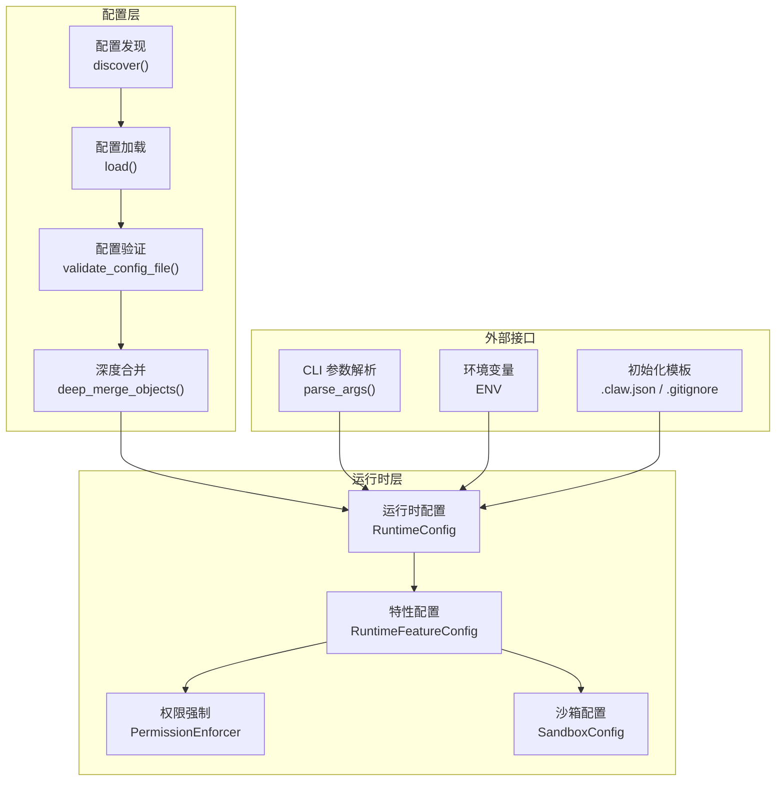
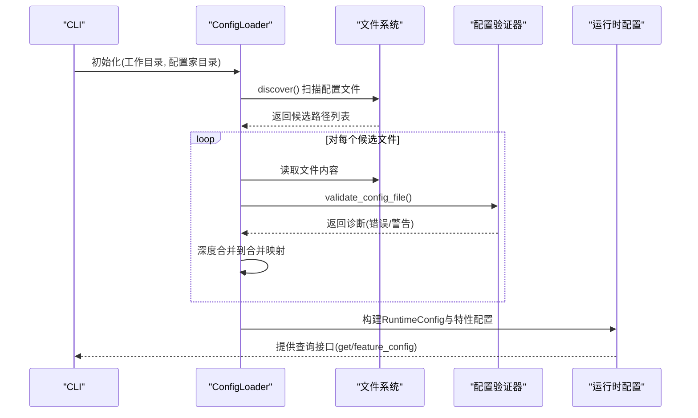
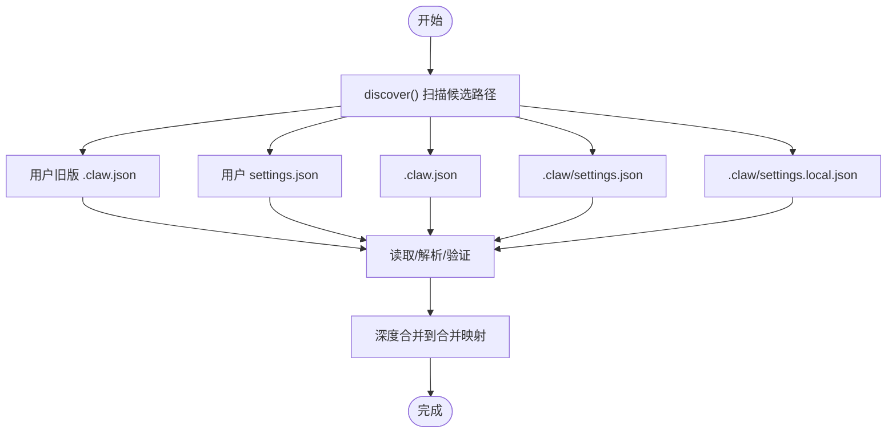
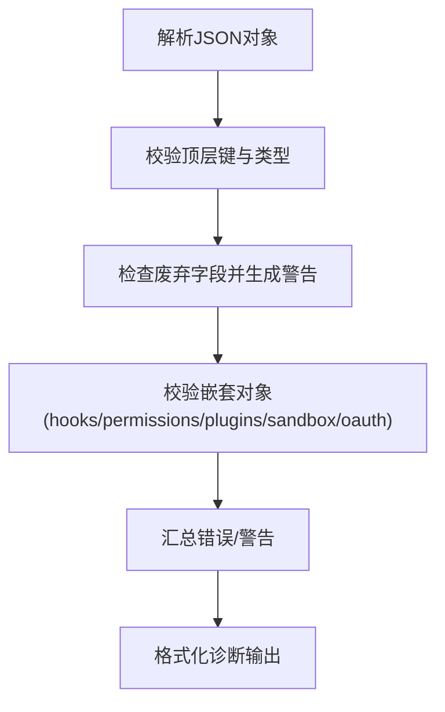
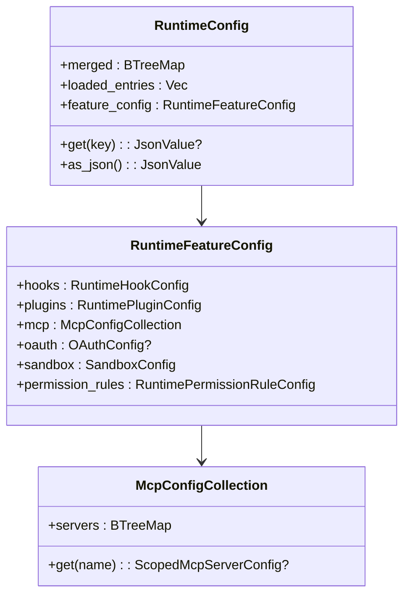
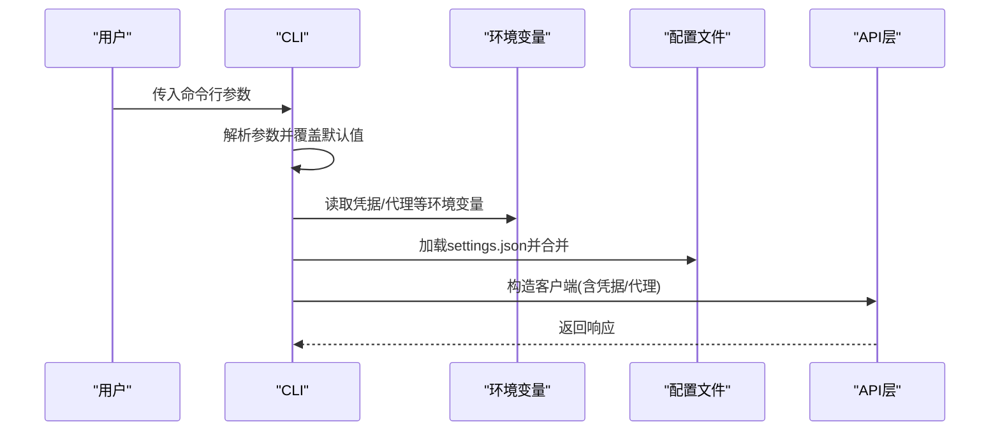
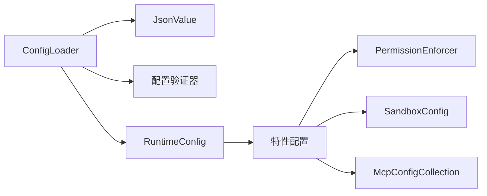

# 配置管理

<cite>
**本文档引用的文件**
- [config.rs](file://rust/crates/runtime/src/config.rs)
- [config_validate.rs](file://rust/crates/runtime/src/config_validate.rs)
- [json.rs](file://rust/crates/runtime/src/json.rs)
- [init.rs](file://rust/crates/rusty-claude-cli/src/init.rs)
- [main.rs](file://rust/crates/rusty-claude-cli/src/main.rs)
- [permission_enforcer.rs](file://rust/crates/runtime/src/permission_enforcer.rs)
- [sandbox.rs](file://rust/crates/runtime/src/sandbox.rs)
- [mcp.rs](file://rust/crates/runtime/src/mcp.rs)
- [providers/mod.rs](file://rust/crates/api/src/providers/mod.rs)
- [anthropic.rs](file://rust/crates/api/src/providers/anthropic.rs)
- [ROADMAP.md](file://ROADMAP.md)
- [USAGE.md](file://USAGE.md)
- [README.md](file://README.md)
</cite>

## 目录
1. [简介](#简介)
2. [项目结构](#项目结构)
3. [核心组件](#核心组件)
4. [架构总览](#架构总览)
5. [详细组件分析](#详细组件分析)
6. [依赖关系分析](#依赖关系分析)
7. [性能考虑](#性能考虑)
8. [故障排除指南](#故障排除指南)
9. [结论](#结论)
10. [附录](#附录)

## 简介
本文件系统性阐述配置管理子系统的架构与实现，覆盖配置文件层次结构、环境变量与命令行参数的优先级机制、默认配置与用户配置的合并策略、配置验证、热重载与配置迁移、不同部署场景的配置模板与最佳实践、敏感配置的安全存储与访问控制，以及配置故障排除、调试工具与配置审计的使用方法。

## 项目结构
配置管理主要由以下模块构成：
- 配置发现与加载：负责扫描、读取、解析与合并配置文件
- 配置验证：对配置键、类型与废弃字段进行校验
- 运行时配置模型：统一的运行时视图，支持特性化配置（插件、MCP、权限等）
- 安全与沙箱：权限强制、沙箱隔离与敏感信息处理
- CLI 集成：命令行参数覆盖、诊断输出与初始化模板

图表来源
- [config.rs:213-326](file://rust/crates/runtime/src/config.rs#L213-L326)
- [config_validate.rs:436-506](file://rust/crates/runtime/src/config_validate.rs#L436-L506)
- [main.rs:392-707](file://rust/crates/rusty-claude-cli/src/main.rs#L392-L707)
- [init.rs:80-112](file://rust/crates/rusty-claude-cli/src/init.rs#L80-L112)

章节来源
- [config.rs:213-326](file://rust/crates/runtime/src/config.rs#L213-L326)
- [config_validate.rs:436-506](file://rust/crates/runtime/src/config_validate.rs#L436-L506)
- [main.rs:392-707](file://rust/crates/rusty-claude-cli/src/main.rs#L392-L707)
- [init.rs:80-112](file://rust/crates/rusty-claude-cli/src/init.rs#L80-L112)

## 核心组件
- 配置源与优先级：用户级、项目级、本地级按顺序发现与合并
- 配置验证：键名、类型、废弃字段检查与建议提示
- 运行时配置模型：统一的合并结果与特性化视图
- 权限与沙箱：基于配置的执行约束与隔离
- CLI 覆盖：命令行参数对默认值的显式覆盖

章节来源
- [config.rs:12-41](file://rust/crates/runtime/src/config.rs#L12-L41)
- [config_validate.rs:67-84](file://rust/crates/runtime/src/config_validate.rs#L67-L84)
- [permission_enforcer.rs:12-24](file://rust/crates/runtime/src/permission_enforcer.rs#L12-L24)
- [sandbox.rs:27-43](file://rust/crates/runtime/src/sandbox.rs#L27-L43)

## 架构总览
配置从磁盘文件与环境变量中加载，经过验证后进行深度合并，形成最终的运行时配置，并驱动权限与沙箱策略。

图表来源
- [config.rs:242-326](file://rust/crates/runtime/src/config.rs#L242-L326)
- [config_validate.rs:436-506](file://rust/crates/runtime/src/config_validate.rs#L436-L506)

## 详细组件分析

### 配置文件层次结构与发现
- 用户级配置：支持传统路径与新式 settings.json；未找到时视为缺失而非错误
- 项目级配置：根目录与 .claw 目录下的 settings.json
- 本地级配置：.claw/settings.local.json 用于机器本地覆盖
- 发现顺序：用户旧版 → 用户新版 → 项目 .claw.json → 项目 .claw/settings.json → 项目 .claw/settings.local.json

图表来源
- [config.rs:242-269](file://rust/crates/runtime/src/config.rs#L242-L269)
- [config.rs:674-707](file://rust/crates/runtime/src/config.rs#L674-L707)

章节来源
- [config.rs:242-269](file://rust/crates/runtime/src/config.rs#L242-L269)
- [config.rs:674-707](file://rust/crates/runtime/src/config.rs#L674-L707)

### 配置验证与诊断
- 已知键与类型：顶层字段、hooks、permissions、plugins、sandbox、oauth 等均有明确类型规范
- 废弃字段：提供替代建议，仅作为警告
- 行号定位：通过在原始源码中查找键位置，生成带行号的诊断信息
- 不支持格式：拒绝 TOML 等非 JSON 格式

图表来源
- [config_validate.rs:436-506](file://rust/crates/runtime/src/config_validate.rs#L436-L506)
- [config_validate.rs:521-532](file://rust/crates/runtime/src/config_validate.rs#L521-L532)

章节来源
- [config_validate.rs:143-200](file://rust/crates/runtime/src/config_validate.rs#L143-L200)
- [config_validate.rs:436-506](file://rust/crates/runtime/src/config_validate.rs#L436-L506)
- [config_validate.rs:508-519](file://rust/crates/runtime/src/config_validate.rs#L508-L519)

### 合并与特性化配置
- 深度合并：对象键递归合并，数组与标量覆盖
- 特性化视图：从合并后的 JSON 中提取 hooks、plugins、mcp、oauth、sandbox、权限规则等
- MCP 服务器：按作用域记录来源，便于审计与覆盖

图表来源
- [config.rs:36-68](file://rust/crates/runtime/src/config.rs#L36-L68)
- [config.rs:304-324](file://rust/crates/runtime/src/config.rs#L304-L324)
- [config.rs:635-645](file://rust/crates/runtime/src/config.rs#L635-L645)

章节来源
- [config.rs:271-326](file://rust/crates/runtime/src/config.rs#L271-L326)
- [config.rs:709-734](file://rust/crates/runtime/src/config.rs#L709-L734)

### 命令行参数与环境变量优先级
- 命令行参数覆盖：CLI 解析阶段对模型、输出格式、权限模式、工具白名单、基础提交、推理努力等进行显式覆盖
- 环境变量：API 层通过环境变量注入凭据与代理设置；CLI 在特定流程中临时设置/恢复 CLAW_CONFIG_HOME 以隔离测试
- 优先级原则：命令行 > 环境变量 > 配置文件（按作用域）

图表来源
- [main.rs:392-707](file://rust/crates/rusty-claude-cli/src/main.rs#L392-L707)
- [providers/mod.rs:412-420](file://rust/crates/api/src/providers/mod.rs#L412-L420)
- [anthropic.rs:1082-1247](file://rust/crates/api/src/providers/anthropic.rs#L1082-L1247)

章节来源
- [main.rs:392-707](file://rust/crates/rusty-claude-cli/src/main.rs#L392-L707)
- [providers/mod.rs:381-420](file://rust/crates/api/src/providers/mod.rs#L381-L420)
- [anthropic.rs:1082-1247](file://rust/crates/api/src/providers/anthropic.rs#L1082-L1247)

### 默认配置、用户配置与系统配置的合并策略
- 默认配置：CLI 解析时的默认值（如模型、输出格式、权限模式）
- 用户配置：用户级 settings.json 与 .claw.json 的合并
- 项目配置：项目级 settings.json 与 .claw.json 的合并
- 本地配置：settings.local.json 作为最终覆盖层
- 合并算法：深度合并对象，保留后发现的值覆盖前发现的值

章节来源
- [config.rs:271-326](file://rust/crates/runtime/src/config.rs#L271-L326)
- [config.rs:1810-2111](file://rust/crates/runtime/src/config.rs#L1810-L2111)

### 配置验证、热重载与配置迁移
- 验证：每次加载均执行键与类型检查，生成可读诊断报告
- 热重载：当前实现为一次性加载；可通过重新调用 ConfigLoader.load() 实现“热重载”效果
- 迁移：未见内置迁移脚本，建议通过版本化字段与废弃提示引导升级

章节来源
- [config_validate.rs:436-506](file://rust/crates/runtime/src/config_validate.rs#L436-L506)
- [config.rs:271-326](file://rust/crates/runtime/src/config.rs#L271-L326)

### 敏感配置的安全存储与访问控制
- 环境变量：API 凭据通过环境变量注入，避免写入明文文件
- 临时隔离：测试中通过设置/恢复 CLAW_CONFIG_HOME 隔离主机状态
- 访问控制：权限强制与沙箱隔离限制工具执行范围与文件系统访问

章节来源
- [providers/mod.rs:412-420](file://rust/crates/api/src/providers/mod.rs#L412-L420)
- [anthropic.rs:1082-1247](file://rust/crates/api/src/providers/anthropic.rs#L1082-L1247)
- [permission_enforcer.rs:12-24](file://rust/crates/runtime/src/permission_enforcer.rs#L12-L24)
- [sandbox.rs:27-43](file://rust/crates/runtime/src/sandbox.rs#L27-L43)

### 不同部署场景下的配置模板与最佳实践
- 单机开发：使用用户级 settings.json 存放通用偏好，项目级 settings.json 存放仓库特定设置，本地级 settings.local.json 存放机器差异
- CI 环境：通过环境变量注入凭据，禁用交互式权限模式，使用只读或工作区写入模式
- 多环境：通过别名与模型前缀路由到不同提供商，避免凭据泄漏

章节来源
- [init.rs:4-12](file://rust/crates/rusty-claude-cli/src/init.rs#L4-L12)
- [USAGE.md:219-237](file://USAGE.md#L219-L237)

### 配置审计与调试工具
- 配置报告：CLI 支持打印已发现与已加载的配置文件、合并键数等
- 诊断输出：验证器生成带行号的错误/警告信息
- 状态快照：CLI 提供状态与沙箱状态查看能力

章节来源
- [main.rs:5185-5305](file://rust/crates/rusty-claude-cli/src/main.rs#L5185-L5305)
- [config_validate.rs:521-532](file://rust/crates/runtime/src/config_validate.rs#L521-L532)

## 依赖关系分析
配置系统内部依赖清晰，职责分离良好：Loader 负责发现与合并，Validator 负责校验，RuntimeConfig 提供统一视图，特性模块（权限、沙箱、MCP）消费这些视图。

图表来源
- [config.rs:213-326](file://rust/crates/runtime/src/config.rs#L213-L326)
- [json.rs:4-12](file://rust/crates/runtime/src/json.rs#L4-L12)
- [permission_enforcer.rs:26-29](file://rust/crates/runtime/src/permission_enforcer.rs#L26-L29)
- [sandbox.rs:27-43](file://rust/crates/runtime/src/sandbox.rs#L27-L43)
- [mcp.rs:85-119](file://rust/crates/runtime/src/mcp.rs#L85-L119)

章节来源
- [config.rs:213-326](file://rust/crates/runtime/src/config.rs#L213-L326)
- [json.rs:4-12](file://rust/crates/runtime/src/json.rs#L4-L12)

## 性能考虑
- 文件读取与解析：按需读取与解析，空文件直接跳过
- 合并复杂度：深度合并为 O(n+m) 级别的键遍历与覆盖
- 验证开销：键与类型的线性检查，建议在开发阶段启用，CI 中保持严格

## 故障排除指南
- 未知键/类型错误：根据诊断报告修正键名或类型
- 废弃字段：按提示迁移到新字段
- TOML 格式不被支持：改用 JSON
- 权限不足：调整权限模式或规则
- 沙箱不可用：检查 Linux 环境与 unshare 可用性

章节来源
- [config_validate.rs:436-506](file://rust/crates/runtime/src/config_validate.rs#L436-L506)
- [config_validate.rs:508-519](file://rust/crates/runtime/src/config_validate.rs#L508-L519)
- [permission_enforcer.rs:108-173](file://rust/crates/runtime/src/permission_enforcer.rs#L108-L173)
- [sandbox.rs:161-208](file://rust/crates/runtime/src/sandbox.rs#L161-L208)

## 结论
该配置管理系统通过严格的层次发现、强类型的验证与深度合并，提供了清晰的优先级与可审计的配置视图。结合权限强制与沙箱隔离，确保了在不同部署场景下的安全性与可控性。建议在生产环境中优先使用环境变量注入敏感信息，并通过 CLI 的诊断与状态功能进行持续监控与排障。

## 附录

### 配置文件层次与示例
- 用户级：~/.claw.json 或 $CLAW_CONFIG_HOME/.claw.json
- 项目级：<repo>/.claw.json 与 <repo>/.claw/settings.json
- 本地级：<repo>/.claw/settings.local.json

章节来源
- [config.rs:242-269](file://rust/crates/runtime/src/config.rs#L242-L269)
- [USAGE.md:323-327](file://USAGE.md#L323-L327)

### 命令行参数覆盖清单
- --model / --output-format / --permission-mode / --dangerously-skip-permissions / --allowed-tools / --base-commit / --reasoning-effort / --allow-broad-cwd / --compact

章节来源
- [main.rs:392-707](file://rust/crates/rusty-claude-cli/src/main.rs#L392-L707)

### 环境变量与凭据
- ANTHROPIC_API_KEY / ANTHROPIC_AUTH_TOKEN / OPENAI_API_KEY / OPENAI_BASE_URL / XAI_API_KEY / DASHSCOPE_API_KEY
- CLAW_CONFIG_HOME 用于隔离测试与多环境配置

章节来源
- [providers/mod.rs:412-420](file://rust/crates/api/src/providers/mod.rs#L412-L420)
- [ROADMAP.md:488-488](file://ROADMAP.md#L488-L488)
- [README.md:31-31](file://README.md#L31-L31)