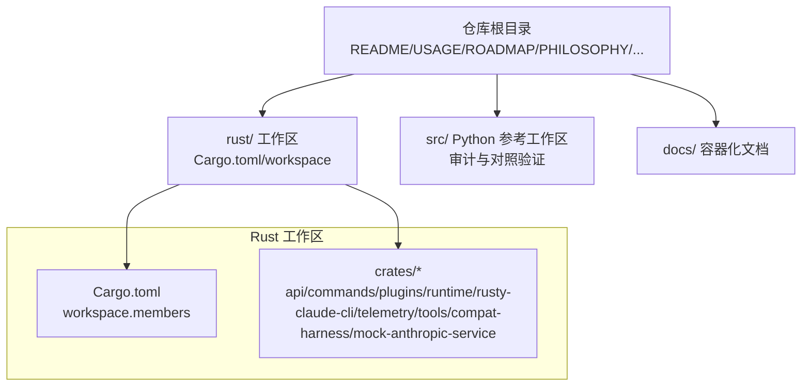
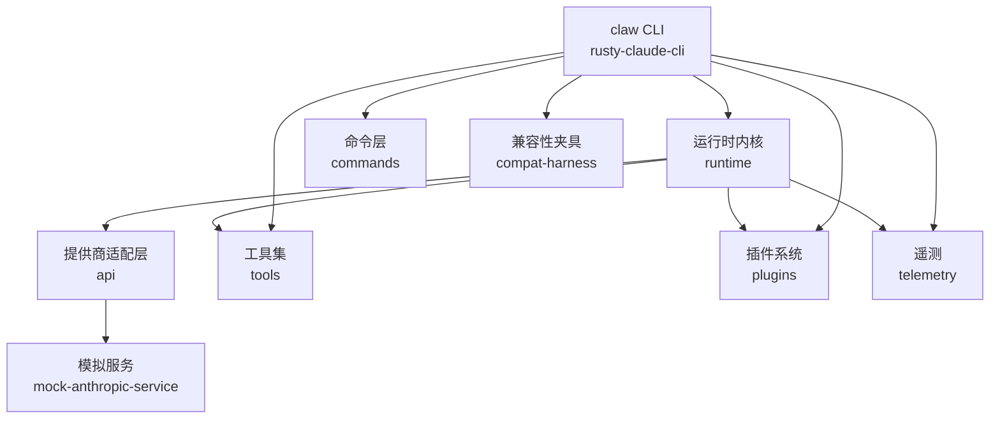
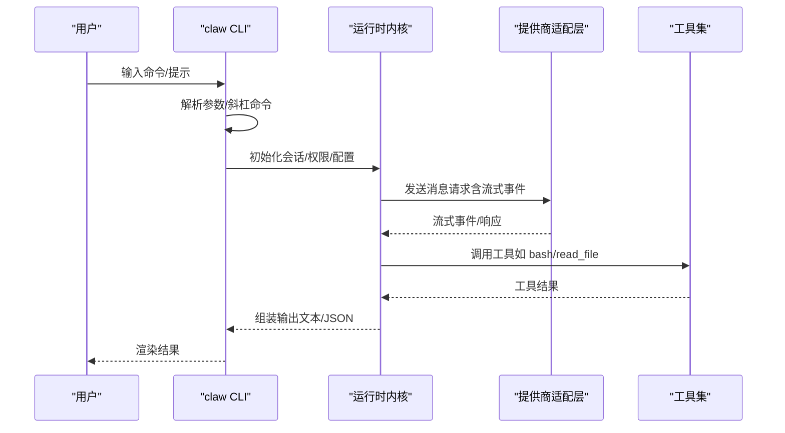
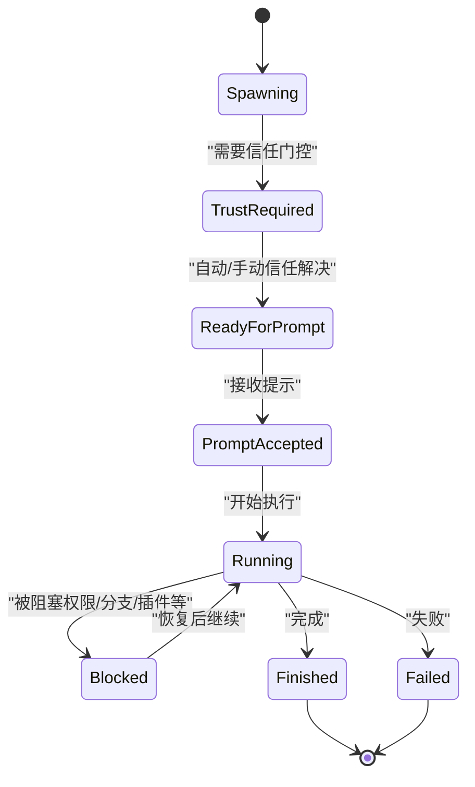
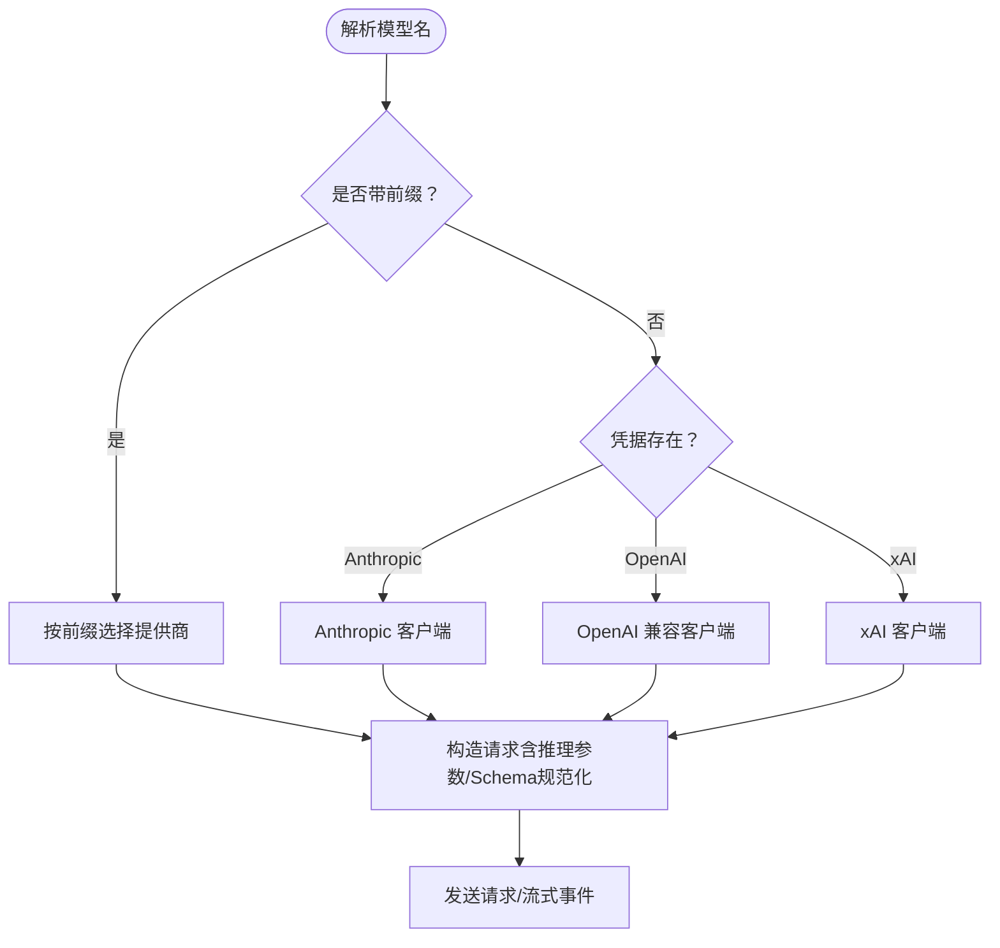
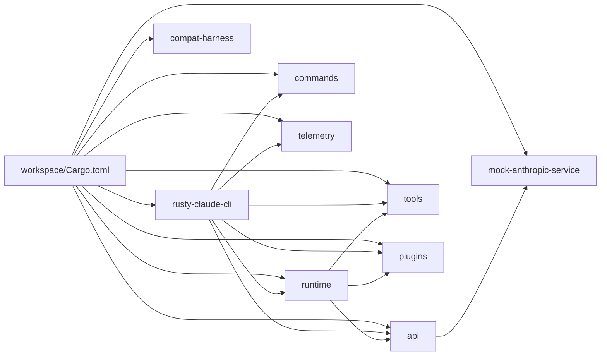

# 项目概述

<cite>
**本文引用的文件**
- [README.md](file://README.md)
- [rust/README.md](file://rust/README.md)
- [PHILOSOPHY.md](file://PHILOSOPHY.md)
- [ROADMAP.md](file://ROADMAP.md)
- [PARITY.md](file://PARITY.md)
- [USAGE.md](file://USAGE.md)
- [docs/container.md](file://docs/container.md)
- [rust/Cargo.toml](file://rust/Cargo.toml)
- [rust/crates/rusty-claude-cli/Cargo.toml](file://rust/crates/rusty-claude-cli/Cargo.toml)
- [rust/crates/rusty-claude-cli/src/main.rs](file://rust/crates/rusty-claude-cli/src/main.rs)
- [rust/crates/runtime/src/lib.rs](file://rust/crates/runtime/src/lib.rs)
- [rust/crates/api/src/lib.rs](file://rust/crates/api/src/lib.rs)
</cite>

## 目录
1. [引言](#引言)
2. [项目结构](#项目结构)
3. [核心组件](#核心组件)
4. [架构总览](#架构总览)
5. [详细组件分析](#详细组件分析)
6. [依赖关系分析](#依赖关系分析)
7. [性能考量](#性能考量)
8. [故障排查指南](#故障排查指南)
9. [结论](#结论)
10. [附录](#附录)

## 引言
Claw Code 是面向“自主软件开发”的高性能 CLI 代理工具，其 Rust 实现旨在提供与 Claude Code 相同的功能面，同时在性能、可靠性与可运维性上实现显著提升。项目采用“双语言架构”：以 Rust 构建的主实现（claw CLI），以及配套的 Python 参考工作区与审计工具，用于对照验证与兼容性测试。在 UltraWorkers 生态中，Claw Code 扮演“代理执行器”的角色，与 oh-my-codex（OmX，工作流层）、clawhip（事件路由与通知）、oh-my-openagent（多智能体协调）等共同构成端到端的自动化开发流水线。

- 核心目标：提供高性能、可恢复、事件驱动的代理执行环境，支持多提供商模型、插件与 MCP 集成、权限控制与会话持久化。
- 设计理念：以“爪子（claw）”而非人类直接操作终端为核心，通过结构化的规划-执行-复盘循环，实现仓库级的公开自举构建。
- 价值主张：降低对人工微管理的依赖，将瓶颈从“打字速度”转移到“系统设计与判断力”，并通过可观测性与自动恢复机制提升工程稳定性。

章节来源
- [README.md:31-36](file://README.md#L31-L36)
- [PHILOSOPHY.md:1-26](file://PHILOSOPHY.md#L1-L26)

## 项目结构
仓库采用“根目录 + Rust 工作区 + Python 参考工作区”的双层结构：
- 根目录：顶层文档、使用说明、路线图、哲学说明、容器化文档与安装脚本。
- rust/：Rust 工作区，包含 9 个 crate，形成完整的 CLI、运行时、工具集与 API 层。
- src/：Python 参考工作区与审计辅助，用于对照验证与兼容性测试（非主运行表面）。

图表来源
- [rust/Cargo.toml:1-23](file://rust/Cargo.toml#L1-L23)
- [rust/README.md:175-191](file://rust/README.md#L175-L191)

章节来源
- [README.md:37-44](file://README.md#L37-L44)
- [rust/README.md:175-191](file://rust/README.md#L175-L191)

## 核心组件
- rusty-claude-cli（二进制入口）：提供 REPL、一次性提示、直接子命令、流式渲染与权限控制；作为 CLI 的唯一可执行入口（二进制名为 claw）。
- runtime：会话持久化、配置加载、权限策略、MCP 生命周期、系统提示组装、使用统计与工作器状态机。
- api：提供商客户端（Anthropic、OpenAI 兼容）、SSE 流式解析、请求预检与上下文窗口检查。
- tools：内置工具集（bash、文件读写、搜索、网络工具、技能、代理等）与工具发现。
- plugins：插件元数据、安装/启用/禁用/更新流程、钩子集成。
- commands：斜杠命令注册、帮助渲染、JSON/文本输出一致性。
- telemetry：会话追踪与遥测事件类型。
- compat-harness：从上游 TypeScript 源提取工具/提示清单的兼容性工具。
- mock-anthropic-service：确定性的 Anthropic 兼容模拟服务，配合清洁环境的测试夹具。

章节来源
- [rust/README.md:193-204](file://rust/README.md#L193-L204)
- [rust/crates/rusty-claude-cli/Cargo.toml:8-10](file://rust/crates/rusty-claude-cli/Cargo.toml#L8-L10)

## 架构总览
Claw Code 的技术架构围绕“CLI 代理 + 运行时内核 + 多提供商适配 + 工具与插件生态”展开。下图展示了主要模块之间的交互关系与职责边界：

图表来源
- [rust/README.md:193-204](file://rust/README.md#L193-L204)
- [rust/crates/rusty-claude-cli/src/main.rs:110-139](file://rust/crates/rusty-claude-cli/src/main.rs#L110-L139)
- [rust/crates/runtime/src/lib.rs:1-51](file://rust/crates/runtime/src/lib.rs#L1-L51)
- [rust/crates/api/src/lib.rs:1-40](file://rust/crates/api/src/lib.rs#L1-L40)

## 详细组件分析

### CLI 与命令系统
- CLI 表面：支持一次性提示、REPL、JSON 输出、权限模式、允许工具列表、会话恢复等。
- 命令体系：斜杠命令覆盖会话、工作区、调试、自动化与插件管理，统一由 commands 管理。
- 错误处理：在 JSON 输出模式下，错误以结构化 JSON 输出，便于下游工具解析。

图表来源
- [rust/crates/rusty-claude-cli/src/main.rs:180-200](file://rust/crates/rusty-claude-cli/src/main.rs#L180-L200)
- [rust/crates/runtime/src/lib.rs:71-75](file://rust/crates/runtime/src/lib.rs#L71-L75)
- [rust/crates/api/src/lib.rs:9-26](file://rust/crates/api/src/lib.rs#L9-L26)

章节来源
- [rust/README.md:116-174](file://rust/README.md#L116-L174)
- [USAGE.md:296-318](file://USAGE.md#L296-L318)

### 运行时内核与工作器状态机
- 会话与权限：支持只读、工作区写入、危险全权限三种模式；文件写边界、bash 只读保护等。
- 工作器生命周期：引入明确的状态机（Spawning → TrustRequired → ReadyForPrompt → PromptAccepted → Running → Blocked → Finished/Failed），并提供信任门控与自动恢复。
- 事件与可观测性：结构化事件（如 lane 事件、失败分类、工作器状态文件）贯穿执行链路，便于外部观察与自动化编排。

图表来源
- [ROADMAP.md:75-84](file://ROADMAP.md#L75-L84)
- [ROADMAP.md:91-97](file://ROADMAP.md#L91-L97)
- [ROADMAP.md:112-132](file://ROADMAP.md#L112-L132)

章节来源
- [ROADMAP.md:73-97](file://ROADMAP.md#L73-L97)
- [ROADMAP.md:112-161](file://ROADMAP.md#L112-L161)

### 提供商适配与多模型路由
- 支持 Anthropic、xAI、OpenAI 兼容（含 OpenRouter、Ollama、DashScope 等）与本地网关。
- 模型名前缀路由优先于环境变量存在性，避免误路由；同时提供别名表与用户自定义别名。
- OpenAI 兼容路径补充了推理效率参数、gpt-5.x 的 max_completion_tokens 适配、严格 JSON Schema 规范化等。

图表来源
- [USAGE.md:234-240](file://USAGE.md#L234-L240)
- [USAGE.md:186-202](file://USAGE.md#L186-L202)
- [rust/crates/api/src/lib.rs:23-26](file://rust/crates/api/src/lib.rs#L23-L26)

章节来源
- [USAGE.md:186-240](file://USAGE.md#L186-L240)
- [PARITY.md:131-159](file://PARITY.md#L131-L159)

### 工具系统与插件生态
- 内置工具：bash、文件读写、搜索、网络抓取、技能、代理、笔记本编辑等。
- 插件管理：安装/启用/禁用/卸载/更新；钩子集成；生命周期健康检查与降级报告。
- MCP 集成：服务器发现、握手、工具/资源列举、调用与断连处理；降级模式与结构化失败分类。

章节来源
- [rust/README.md:85-104](file://rust/README.md#L85-L104)
- [PARITY.md:113-130](file://PARITY.md#L113-L130)

### 容器化与跨平台部署
- 提供 Containerfile，推荐以 bind-mount 方式在容器中进行构建与测试，避免污染宿主工作树。
- 运行时具备容器检测能力，可通过 claw sandbox 查看容器标记与状态。

章节来源
- [docs/container.md:1-133](file://docs/container.md#L1-L133)
- [USAGE.md:349-351](file://USAGE.md#L349-L351)

## 依赖关系分析
- 工作区组织：workspace.members 指定所有 crate，统一 lint 与安全策略。
- CLI 依赖：claw 二进制依赖 api、commands、runtime、plugins、tools 等。
- 运行时依赖：runtime 汇聚 bash、config、permissions、mcp、oauth、sandbox、session 等子模块。
- API 依赖：api 提供提供商客户端与类型定义，并暴露 telemetry 接口。

图表来源
- [rust/Cargo.toml:1-23](file://rust/Cargo.toml#L1-L23)
- [rust/crates/rusty-claude-cli/Cargo.toml:12-25](file://rust/crates/rusty-claude-cli/Cargo.toml#L12-L25)
- [rust/crates/runtime/src/lib.rs:1-51](file://rust/crates/runtime/src/lib.rs#L1-L51)
- [rust/crates/api/src/lib.rs:1-40](file://rust/crates/api/src/lib.rs#L1-L40)

章节来源
- [rust/Cargo.toml:1-23](file://rust/Cargo.toml#L1-L23)
- [rust/crates/rusty-claude-cli/Cargo.toml:12-25](file://rust/crates/rusty-claude-cli/Cargo.toml#L12-L25)

## 性能考量
- Rust 重写带来的性能优势：更快的启动、更低的内存占用、更稳定的并发与流式处理。
- 上下文窗口预检与请求大小控制：避免超大请求导致的失败与重试开销。
- 结构化事件与可观测性：减少日志噪音，提高自动化恢复与诊断效率。
- 容器化与并行测试：通过容器隔离与并行测试提升 CI 稳定性与吞吐。

章节来源
- [README.md:31-36](file://README.md#L31-L36)
- [ROADMAP.md:14-24](file://ROADMAP.md#L14-L24)

## 故障排查指南
- 首次健康检查：构建后运行 claw doctor，随后在 REPL 中执行 /doctor，确认环境与凭据。
- JSON 输出一致性：在 --output-format json 下，错误将以结构化 JSON 输出，便于脚本解析。
- 权限与信任：若遇到 TrustRequired 或权限拒绝，检查权限模式与信任门控配置。
- 提示注入与会话：确保提示在 ReadyForPrompt 后再发送；使用 --resume 恢复会话并查看 /status。
- 容器环境：在容器中运行时，使用 claw sandbox 检查容器标记；避免将 target/ 留在宿主机工作树。

章节来源
- [USAGE.md:5-18](file://USAGE.md#L5-L18)
- [USAGE.md:67-73](file://USAGE.md#L67-L73)
- [ROADMAP.md:27-60](file://ROADMAP.md#L27-L60)
- [docs/container.md:93-94](file://docs/container.md#L93-L94)

## 结论
Claw Code 以 Rust 重构实现了高性能、可恢复、事件驱动的 CLI 代理执行器，结合双语言架构与完备的生态组件，为“爪子自治”的软件开发提供了可复用的基础设施。其在 UltraWorkers 生态中的定位是“代理执行器”，通过结构化的工作流、事件路由与可观测性，将人类从重复性操作中解放出来，专注于方向与判断。随着路线图的推进，项目将持续强化工作器生命周期、事件原生化、分支与测试感知、插件/MCP 成熟度与自动化策略引擎，进一步提升“爪可抓（clawable）”能力。

章节来源
- [PHILOSOPHY.md:73-108](file://PHILOSOPHY.md#L73-L108)
- [ROADMAP.md:14-70](file://ROADMAP.md#L14-L70)

## 附录
- 快速开始与健康检查：参考 USAGE.md 的“Quick-start health check”与“Prerequisites”。
- Rust 工作区概览：参考 rust/README.md 的“Features”、“CLI Flags and Commands”、“Workspace Layout”。
- 兼容性与路线图：参考 PARITY.md 的“Mock parity harness”与 ROADMAP.md 的“Immediate Backlog”。

章节来源
- [USAGE.md:1-18](file://USAGE.md#L1-L18)
- [rust/README.md:78-174](file://rust/README.md#L78-L174)
- [PARITY.md:13-26](file://PARITY.md#L13-L26)
- [ROADMAP.md:281-331](file://ROADMAP.md#L281-L331)